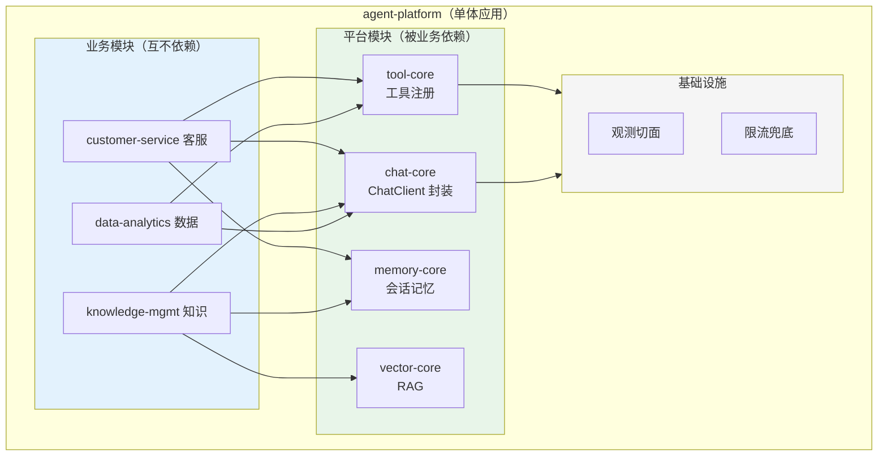

# 项目 05：企业级 Agent 中台 — 01-最小 Demo：模块化单体

> **定位**：把三条业务线的 Agent 能力装进**一个模块化单体**——用包边界与依赖规则代替服务边界，为后续拆分铺设"预切割线"。本篇刻意不引入任何分布式组件，**所有代码完整可手写（一行不省略）**。
>
> 「遇到阻塞？→ [教程 21-微服务拆分与Agent部署 §模块化单体]、[教程 01-Spring-AI框架入门]、[教程 02-ChatClient与对话模型]、[教程 03-工具调用]；API 真实性以 [附录 05-SpringAI2-API基准] 为准」

---

## 1. 为什么最小 Demo 是"模块化单体"而不是直接拆微服务

本项目的演进策略（ADR-001）：**边界先在单体内验证，再物理拆分**。理由：

1. 三条业务线的边界此时只是 CTO 办公室的想象——哪个工具该共享、哪段 Prompt 该统一，只有代码跑起来才知道
2. 单体内的边界重构成本是一次包结构调整；微服务间的边界重构成本是数据迁移+双写+回滚预案
3. 模块化单体的"依赖规则"就是未来微服务的"调用契约"——投资不浪费

> 拆分时机的判断信号（何时必须拆）见 [教程 15 §拆分时机]，本项目的实际触发点在迭代二之前揭晓。

## 2. 模块化单体设计

### 2.1 模块划分与依赖规则



**依赖铁律**（由 ArchUnit 在 CI 中强制）：
1. 业务模块之间**零依赖**（CS 不能 import KM 的任何类）——未来拆分的预切割线
2. 业务模块只能依赖平台模块的 **API 包**（`*.api`），不能依赖 `*.internal`
3. 平台模块间单向依赖：chat-core → tool-core/mem-core（chat 编排工具与记忆，不反向）

### 2.2 模块结构

```
com.acme.agent
├── platform/
│   ├── chat/
│   │   ├── api/       # AgentChatService（业务可用的门面）
│   │   └── internal/  # ChatClient 构建细节
│   ├── tool/api/      # ToolRegistry.register()/invoke()
│   ├── memory/api/    # SessionMemory
│   └── vector/api/    # KnowledgeBase
├── business/
│   ├── cs/api+internal/
│   ├── km/api+internal/
│   └── da/api+internal/
└── bootstrap/         # 组装根：Spring 配置、模块装配
```

## 3. 完整代码（照抄即可，一行不省略）

### 3.1 `pom.xml`（v1 基线——后续迭代在此之上增量）

```xml
<?xml version="1.0" encoding="UTF-8"?>
<project xmlns="http://maven.apache.org/POM/4.0.0"
         xmlns:xsi="http://www.w3.org/2001/XMLSchema-instance"
         xsi:schemaLocation="http://maven.apache.org/POM/4.0.0 https://maven.apache.org/xsd/maven-4.0.0.xsd">
    <modelVersion>4.0.0</modelVersion>
    <parent>
        <groupId>org.springframework.boot</groupId>
        <artifactId>spring-boot-starter-parent</artifactId>
        <version>4.1.0</version>
        <relativePath/>
    </parent>
    <groupId>com.acme</groupId>
    <artifactId>agent-platform</artifactId>
    <version>1.0.0</version>
    <name>agent-platform</name>
    <description>企业级 Agent 中台 — 模块化单体</description>

    <properties>
        <java.version>21</java.version>
        <archunit.version>1.3.0</archunit.version>
    </properties>

    <dependencyManagement>
        <dependencies>
            <dependency>
                <groupId>org.springframework.ai</groupId>
                <artifactId>spring-ai-bom</artifactId>
                <version>2.0.0</version>
                <type>pom</type>
                <scope>import</scope>
            </dependency>
        </dependencies>
    </dependencyManagement>

    <dependencies>
        <dependency>
            <groupId>org.springframework.boot</groupId>
            <artifactId>spring-boot-starter-webflux</artifactId>
        </dependency>
        <dependency>
            <groupId>org.springframework.ai</groupId>
            <artifactId>spring-ai-starter-model-openai</artifactId>
        </dependency>
        <dependency>
            <groupId>org.projectlombok</groupId>
            <artifactId>lombok</artifactId>
            <optional>true</optional>
        </dependency>
        <dependency>
            <groupId>org.springframework.boot</groupId>
            <artifactId>spring-boot-starter-test</artifactId>
            <scope>test</scope>
        </dependency>
        <dependency>
            <groupId>com.tngtech.archunit</groupId>
            <artifactId>archunit-junit5</artifactId>
            <version>${archunit.version}</version>
            <scope>test</scope>
        </dependency>
    </dependencies>

    <build>
        <plugins>
            <plugin>
                <groupId>org.springframework.boot</groupId>
                <artifactId>spring-boot-maven-plugin</artifactId>
            </plugin>
        </plugins>
    </build>
</project>
```

### 3.2 `application.yml`

```yaml
spring:
  application:
    name: agent-platform
  ai:
    openai:
      base-url: https://api.deepseek.com          # DeepSeek 兼容 OpenAI 协议
      api-key: ${DEEPSEEK_API_KEY}                # 环境变量，不落明文
      chat:
        options:
          model: deepseek-chat
server:
  port: 8080
```

### 3.3 `bootstrap/AgentPlatformApplication.java`

```java
package com.acme.agent.bootstrap;

import org.springframework.boot.SpringApplication;
import org.springframework.boot.autoconfigure.SpringBootApplication;

@SpringBootApplication
public class AgentPlatformApplication {
    public static void main(String[] args) {
        SpringApplication.run(AgentPlatformApplication.class, args);
    }
}
```

### 3.4 平台门面：`platform/chat/api/AgentChatService.java`

业务模块唯一入口，`ChatCommand` 承载"命名空间的雏形"（businessLine）。

```java
package com.acme.agent.platform.chat.api;

import java.util.List;

import org.springframework.http.codec.ServerSentEvent;

import reactor.core.publisher.Flux;

/** chat-core 门面：业务模块唯一的对话入口。 */
public interface AgentChatService {

    Flux<ServerSentEvent<AgentEvent>> chat(ChatCommand command);

    record ChatCommand(
            String businessLine,        // "cs" | "km" | "da" —— 命名空间的雏形
            String sessionId,
            String userId,
            String message,
            List<String> enabledTools   // 业务声明的工具集
    ) {}
}
```

### 3.5 事件协议：`platform/chat/api/AgentEvent.java`

```java
package com.acme.agent.platform.chat.api;

/** Agent 事件协议（v1 最小形态：增量 token / 完成 / 错误）。 */
public sealed interface AgentEvent {

    record TokenDelta(String delta) implements AgentEvent {}

    record Done() implements AgentEvent {}

    record Failed(String message) implements AgentEvent {}
}
```

### 3.6 工具注册 API：`platform/tool/api/ToolRegistry.java`

```java
package com.acme.agent.platform.tool.api;

import java.util.List;

import org.springframework.ai.tool.ToolCallback;

/** tool-core 门面：按业务线解析可用工具（v1 进程内，v4 起改为远程 MCP 客户端）。 */
public interface ToolRegistry {

    /** 按业务线 + 声明的工具集过滤出可调用的 ToolCallback。 */
    List<ToolCallback> resolve(String businessLine, List<String> requestedTools);
}
```

### 3.7 记忆 API：`platform/memory/api/SessionMemory.java`

```java
package com.acme.agent.platform.memory.api;

import java.util.List;

import org.springframework.ai.chat.messages.Message;

/** memory-core 门面：会话记忆，按业务线命名空间隔离。 */
public interface SessionMemory {

    /** 生成带命名空间的会话键（v1 起就是 "cs:xxx" 形态，v6 改由 Context 强制注入）。 */
    String conversationId(String businessLine, String sessionId);

    void add(String businessLine, String sessionId, List<Message> messages);

    List<Message> get(String businessLine, String sessionId, int lastN);

    void clear(String businessLine, String sessionId);
}
```

### 3.8 记忆实现：`platform/memory/internal/ChatMemorySessionMemory.java`

```java
package com.acme.agent.platform.memory.internal;

import java.util.List;

import com.acme.agent.platform.memory.api.SessionMemory;

import org.springframework.ai.chat.memory.ChatMemory;
import org.springframework.ai.chat.messages.Message;
import org.springframework.stereotype.Component;

/** 委托 Spring AI ChatMemory，会话键带命名空间前缀。 */
@Component
public class ChatMemorySessionMemory implements SessionMemory {

    private final ChatMemory chatMemory;

    public ChatMemorySessionMemory(ChatMemory chatMemory) {
        this.chatMemory = chatMemory;
    }

    @Override
    public String conversationId(String businessLine, String sessionId) {
        return businessLine + ":" + sessionId;   // 命名空间隔离（同一 sessionId 跨业务线互不可见）
    }

    @Override
    public void add(String businessLine, String sessionId, List<Message> messages) {
        chatMemory.add(conversationId(businessLine, sessionId), messages);
    }

    @Override
    public List<Message> get(String businessLine, String sessionId, int lastN) {
        return chatMemory.get(conversationId(businessLine, sessionId), lastN);
    }

    @Override
    public void clear(String businessLine, String sessionId) {
        chatMemory.clear(conversationId(businessLine, sessionId));
    }
}
```

### 3.9 chat-core 实现：`platform/chat/internal/DefaultAgentChatService.java`

```java
package com.acme.agent.platform.chat.internal;

import java.util.List;

import com.acme.agent.platform.chat.api.AgentChatService;
import com.acme.agent.platform.chat.api.AgentEvent;
import com.acme.agent.platform.memory.api.SessionMemory;
import com.acme.agent.platform.tool.api.ToolRegistry;

import org.springframework.ai.chat.client.ChatClient;
import org.springframework.ai.chat.memory.ChatMemory;
import org.springframework.ai.tool.ToolCallback;
import org.springframework.http.codec.ServerSentEvent;
import org.springframework.stereotype.Service;

import reactor.core.publisher.Flux;

/** Spring AI 2.0.0 —— ChatClient 编排：系统提示词/工具/记忆全部作为参数注入，代码零分支。 */
@Service
public class DefaultAgentChatService implements AgentChatService {

    private final ChatClient.Builder chatClientBuilder;
    private final ToolRegistry toolRegistry;
    private final SessionMemory sessionMemory;

    public DefaultAgentChatService(ChatClient.Builder chatClientBuilder,
                                   ToolRegistry toolRegistry,
                                   SessionMemory sessionMemory) {
        this.chatClientBuilder = chatClientBuilder;
        this.toolRegistry = toolRegistry;
        this.sessionMemory = sessionMemory;
    }

    @Override
    public Flux<ServerSentEvent<AgentEvent>> chat(ChatCommand cmd) {
        List<ToolCallback> tools = toolRegistry.resolve(cmd.businessLine(), cmd.enabledTools());

        return chatClientBuilder.build()
                .prompt()
                .system(resolveSystemPrompt(cmd.businessLine()))   // v1：本地常量；v3 起改由 prompt-service 下发
                .tools(tools)
                .advisors(a -> a.param(ChatMemory.CONVERSATION_ID,
                        sessionMemory.conversationId(cmd.businessLine(), cmd.sessionId())))
                .user(cmd.message())
                .stream()
                .content()                                        // Flux<String> 增量 token
                .map(AgentEvent.TokenDelta::new)
                .concatWithValues(new AgentEvent.Done())
                .map(ev -> ServerSentEvent.<AgentEvent>builder(ev).build());
    }

    private String resolveSystemPrompt(String businessLine) {
        return switch (businessLine) {
            case "da" -> "你是数据分析助手，只执行只读 SQL 查询并解释结果。";
            case "cs" -> "你是客服助手，处理咨询与工单。";
            case "km" -> "你是知识管理助手，基于内部文档回答。";
            default -> "你是通用助手。";
        };
    }
}
```

**零分支原则**：业务线差异（系统提示词、工具集）全部作为参数注入——`if (businessLine.equals("cs"))` 是模块化单体最常见的腐蚀起点，本项目用 `switch` 表达式收敛到数据（提示词字符串），而非散落的控制流。

### 3.10 组装根：`bootstrap/PlatformConfig.java` 与 `bootstrap/ToolWiringConfig.java`

平台基础设施装配（ChatMemory 内存实现 + 各业务线工具注册）。**工具装配必须在 bootstrap**——因为业务模块（`business/da`）不能依赖平台 internal，而平台 internal 也不该反向依赖业务模块，只有组装根能同时看见两者：

```java
package com.acme.agent.bootstrap;

import org.springframework.ai.chat.memory.ChatMemory;
import org.springframework.ai.chat.memory.InMemoryChatMemoryRepository;
import org.springframework.ai.chat.memory.MessageWindowChatMemory;
import org.springframework.context.annotation.Bean;
import org.springframework.context.annotation.Configuration;

@Configuration
public class PlatformConfig {

    @Bean
    public ChatMemory chatMemory() {
        // 官方仅 InMemory / Jdbc 两类仓库（附录 12-00 §2.2）；v1 用内存
        return MessageWindowChatMemory.builder()
                .chatMemoryRepository(new InMemoryChatMemoryRepository())
                .maxMessages(20)
                .build();
    }
}
```

```java
package com.acme.agent.bootstrap;

import java.util.List;
import java.util.Map;

import com.acme.agent.business.da.internal.DataAnalyticsTools;
import com.acme.agent.platform.tool.api.ToolRegistry;
import com.acme.agent.platform.tool.internal.DefaultToolRegistry;

import org.springframework.ai.model.tool.MethodToolCallbackProvider;
import org.springframework.ai.model.tool.ToolCallbackProvider;
import org.springframework.ai.tool.ToolCallback;
import org.springframework.context.annotation.Bean;
import org.springframework.context.annotation.Configuration;

/** 把各业务线的 @Tool 对象装配进 ToolRegistry（bootstrap 专属职责）。 */
@Configuration
public class ToolWiringConfig {

    @Bean
    public ToolRegistry toolRegistry(DataAnalyticsTools daTools) {
        return new DefaultToolRegistry(Map.of(
                "da", toCallbacks(daTools)
                // cs、km 的工具对象就绪后按同一方式注册：Map.of("cs", toCallbacks(csTools), ...)
        ));
    }

    private List<ToolCallback> toCallbacks(Object... toolObjects) {
        ToolCallbackProvider provider = MethodToolCallbackProvider.builder()
                .toolObjects(toolObjects)
                .build();
        return List.of(provider.getToolCallbacks());
    }
}
```

```java
package com.acme.agent.platform.tool.internal;

import java.util.List;
import java.util.Map;
import java.util.concurrent.ConcurrentHashMap;

import com.acme.agent.platform.tool.api.ToolRegistry;

import org.springframework.ai.tool.ToolCallback;

/** 进程内工具注册表：按业务线过滤工具。v4 起重构为远程 MCP 客户端，接口不变。 */
public class DefaultToolRegistry implements ToolRegistry {

    private final Map<String, List<ToolCallback>> toolsByLine;

    public DefaultToolRegistry(Map<String, List<ToolCallback>> toolsByLine) {
        this.toolsByLine = toolsByLine;
    }

    @Override
    public List<ToolCallback> resolve(String businessLine, List<String> requestedTools) {
        Map<String, ToolCallback> byName = new ConcurrentHashMap<>();
        for (ToolCallback cb : toolsByLine.getOrDefault(businessLine, List.of())) {
            byName.put(cb.getToolDefinition().name(), cb);
        }
        return requestedTools.stream()
                .filter(byName::containsKey)
                .map(byName::get)
                .toList();
    }
}
```

### 3.11 业务模块示例（数据线）

工具对象（`business/da/internal/DataAnalyticsTools.java`）：

```java
package com.acme.agent.business.da.internal;

import org.springframework.ai.tool.annotation.Tool;
import org.springframework.ai.tool.annotation.ToolParam;
import org.springframework.stereotype.Component;

@Component
public class DataAnalyticsTools {

    @Tool(name = "sql.query",
          description = "对集团数据仓库执行只读 SQL 查询，返回结果行。仅支持 SELECT，禁止写操作。")
    public String sqlQuery(@ToolParam(description = "只读 SQL 语句") String sql) {
        // 真实实现接查询引擎（SQL 网关）；此处返回示意数据
        return "[{\"month\":\"2026-07\",\"amount\":123456.0}]";
    }

    @Tool(name = "schema.describe",
          description = "列出指定表的字段名与类型。")
    public String schemaDescribe(@ToolParam(description = "表名") String table) {
        return "columns: id:long, amount:decimal, created_at:datetime";
    }
}
```

薄壳 Controller（`business/da/api/DataAnalyticsAgent.java`）：

```java
package com.acme.agent.business.da.api;

import java.util.List;

import com.acme.agent.platform.chat.api.AgentChatService;
import com.acme.agent.platform.chat.api.AgentEvent;

import org.springframework.http.MediaType;
import org.springframework.http.codec.ServerSentEvent;
import org.springframework.web.bind.annotation.PostMapping;
import org.springframework.web.bind.annotation.RequestBody;
import org.springframework.web.bind.annotation.RequestMapping;
import org.springframework.web.bind.annotation.RestController;

import reactor.core.publisher.Flux;

@RestController
@RequestMapping("/da")
public class DataAnalyticsAgent {

    private final AgentChatService chat;

    public DataAnalyticsAgent(AgentChatService chat) {
        this.chat = chat;
    }

    @PostMapping(value = "/chat", produces = MediaType.TEXT_EVENT_STREAM_VALUE)
    public Flux<ServerSentEvent<AgentEvent>> chat(@RequestBody ChatRequest req) {
        return chat.chat(new AgentChatService.ChatCommand(
                "da", req.sessionId(), req.userId(), req.message(),
                List.of("sql.query", "schema.describe")      // 数据线专属工具集
        ));
    }

    public record ChatRequest(String sessionId, String userId, String message) {}
}
```

三条业务线的 Controller 都是这种薄壳——**薄到拆分时可以直接连壳搬走**（v2 网关拆分时业务 Controller 零改动）。

### 3.12 依赖规则守卫：`src/test/java/com/acme/agent/ArchitectureTest.java`

把 2.1 的三条铁律变成 CI 强制（ArchUnit）：

```java
package com.acme.agent;

import com.tngtech.archunit.core.domain.JavaClasses;
import com.tngtech.archunit.core.importer.ClassFileImporter;
import org.junit.jupiter.api.Test;

import static com.tngtech.archunit.lang.syntax.ArchRuleDefinition.noClasses;

class ArchitectureTest {

    private final JavaClasses classes =
            new ClassFileImporter().importPackages("com.acme.agent");

    @Test
    void 业务模块之间零依赖() {
        noClasses().that().resideInAPackage("..business..")
                .should().dependOnClassesThat().resideInAPackage("..business..")
                .because("业务模块互不依赖——未来拆分的预切割线")
                .check(classes);
    }

    @Test
    void 业务模块不得依赖任何internal包() {
        noClasses().that().resideInAPackage("..business..")
                .should().dependOnClassesThat().resideInAPackage("..internal..")
                .because("业务模块只能依赖平台 API 包")
                .check(classes);
    }
}
```

### 3.13 运行

```sh
export DEEPSEEK_API_KEY=sk-xxx
mvn spring-boot:run
# 测试：
# curl -N -X POST "http://localhost:8080/da/chat" \
#   -H "Content-Type: application/json" \
#   -d '{"sessionId":"s1","userId":"u1","message":"查一下 2026-07 的销售额"}'
# 应收到 SSE 流：data:{"delta":"..."} ... data:{"type":"Done"}
```

## 4. 验收标准

| # | 验收项 | 标准 |
|---|--------|------|
| 1 | 三业务线 API | `POST /cs/chat`、`/km/chat`、`/da/chat` 各自可用，输出各自的系统提示词风格 |
| 2 | 工具隔离 | `da` 无法调用 `cs` 的 `ticket.create` 工具（registry 按 businessLine 过滤） |
| 3 | 依赖规则 | ArchUnit 测试通过：业务模块零互相依赖、internal 包不可跨模块引用 |
| 4 | 会话隔离 | 同一 sessionId 在不同业务线互不可见（memory 按 businessLine 前缀键） |
| 5 | 单一部署 | 一个 jar、一个进程、一套配置 |

## 5. v1 的痛点（演进的真实驱动力）

运行两周后的真实痛点（来自运维与财务的联合报告）：

1. **成本黑箱**：三业务线共享一个进程，LLM 调用走各自的 Key，财务拿到的账单无法拆分到业务线——v2 的核心痛点
2. **密钥散乱**：三个模块各自读环境变量里的 Key，安全审计无法通过——"谁的 Key、什么权限、何时轮换"说不清
3. **LLM 供应商锁定**：客服线写死了 DeepSeek 的参数细节，模型团队想给数据线换更便宜的模型，牵一发动全身
4. **单进程风险**：数据线的重查询把 CPU 打满，客服线的会话跟着抖——故障域没有隔离

这四个痛点全部指向同一个解法：**LLM 调用收口到独立网关**。→ [02-迭代一-LLM网关独立.md](02-迭代一-LLM网关独立.md)
