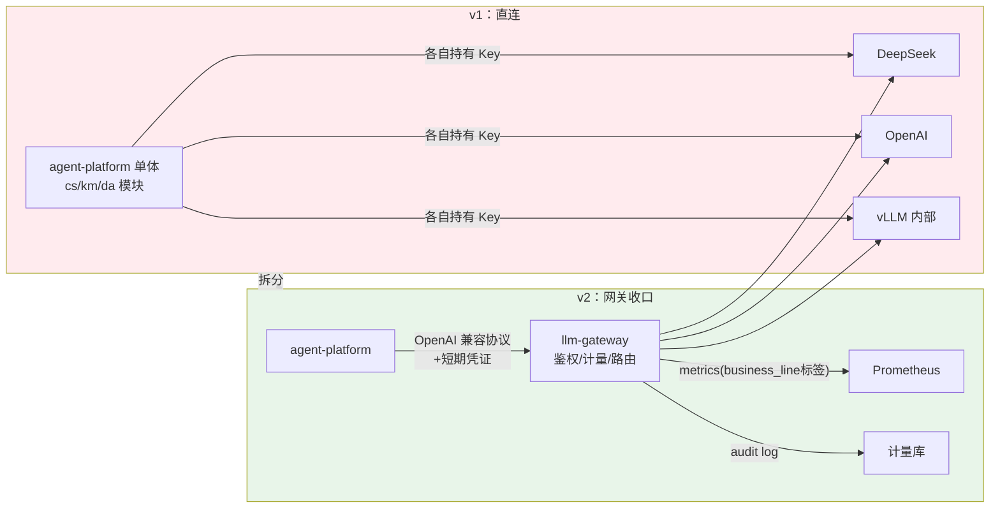
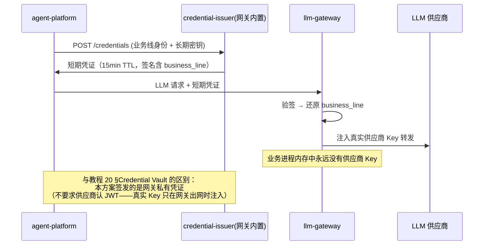

# 项目 05：企业级 Agent 中台 — 02-迭代一：LLM 网关独立

> **定位**：第一次物理拆分——LLM 调用从单体中剥离为独立的 `llm-gateway` 服务，统一计量、密钥收口、模型路由。这是三座烟囱合并后的第一次架构红利兑现。**网关代码完整可手写**。
>
> 「遇到阻塞？→ [教程 21-微服务拆分与Agent部署 §LLM 网关]、[教程 27-成本治理与Token计量 §指标体系]、[教程 32-模型路由与降级]、[教程 22-全链路可观测性 §gen_ai 语义约定]」

---

## 1. 需求与上一版痛点（四问）

| 问 | 答 |
|----|----|
| **新增了什么需求** | 所有 LLM 调用必须经过网关；每次调用可归因（业务线/用户/会话）；密钥三个月轮换；按业务线配置不同模型与预算 |
| **影响了哪些模块** | 新增独立服务 `llm-gateway`；`chat-core` 的 ChatModel 从"直连供应商"改为"调网关" |
| **架构如何演进** | 单体直连 → 网关收口：`agent-platform → llm-gateway → 供应商`；网关统一鉴权/计量/路由 |
| **上一版痛点是什么** | 成本黑箱（账单无法按业务线拆分）、密钥散乱、供应商锁定、单进程故障域混合 |

由于走 OpenAI 兼容协议，这一步业务侧**零代码变更**（只改 base-url 配置），这正是当初选择 OpenAI 兼容路线的远见（ADR-005）。

## 2. 架构演进



## 3. 网关设计

### 3.1 职责边界（做什么/不做什么）

| 做 | 不做 |
|----|------|
| 请求鉴权（业务线短期凭证） | Prompt 处理（业务侧自理，网关透传） |
| 模型路由（按业务线配置路由到不同供应商/模型） | 工具执行（工具在中台的 tool-service，未来迭代） |
| Token 计量与归因（gen_ai 语义约定） | 记忆/会话（业务侧） |
| 供应商密钥保管与轮换 | 检索（RAG 数据面） |
| 降级与故障切换（[教程 32-模型路由与降级 §5 降级链设计]，v8 深化） | Prompt 缓存（语义缓存属业务层优化，附录 07） |
| usage 流式计量（SSE 尾包的 usage 帧捕获） | |

**边界设计原则**：网关是"数据面基础设施"，保持薄与稳；策略（路由规则本身）由配置驱动，v3 起接受 Control Plane 下发。

### 3.2 `pom.xml`（网关基线）

```xml
<?xml version="1.0" encoding="UTF-8"?>
<project xmlns="http://maven.apache.org/POM/4.0.0"
         xmlns:xsi="http://www.w3.org/2001/XMLSchema-instance"
         xsi:schemaLocation="http://maven.apache.org/POM/4.0.0 https://maven.apache.org/xsd/maven-4.0.0.xsd">
    <modelVersion>4.0.0</modelVersion>
    <parent>
        <groupId>org.springframework.boot</groupId>
        <artifactId>spring-boot-starter-parent</artifactId>
        <version>4.1.0</version>
        <relativePath/>
    </parent>
    <groupId>com.acme</groupId>
    <artifactId>llm-gateway</artifactId>
    <version>1.0.0</version>
    <name>llm-gateway</name>

    <properties>
        <java.version>21</java.version>
    </properties>

    <dependencies>
        <dependency>
            <groupId>org.springframework.boot</groupId>
            <artifactId>spring-boot-starter-webflux</artifactId>
        </dependency>
        <dependency>
            <groupId>org.springframework.boot</groupId>
            <artifactId>spring-boot-starter-actuator</artifactId>
        </dependency>
        <dependency>
            <groupId>io.micrometer</groupId>
            <artifactId>micrometer-registry-prometheus</artifactId>
        </dependency>
        <dependency>
            <groupId>org.springframework.boot</groupId>
            <artifactId>spring-boot-starter-test</artifactId>
            <scope>test</scope>
        </dependency>
    </dependencies>
</project>
```

### 3.3 `application.yml`

```yaml
spring:
  application:
    name: llm-gateway
server:
  port: 9090
management:
  endpoints:
    web:
      exposure:
        include: health,prometheus
  metrics:
    tags:
      application: llm-gateway
```

### 3.4 启动类与路由装配

```java
package com.acme.gateway;

import org.springframework.boot.SpringApplication;
import org.springframework.boot.autoconfigure.SpringBootApplication;

@SpringBootApplication
public class LlmGatewayApplication {
    public static void main(String[] args) {
        SpringApplication.run(LlmGatewayApplication.class, args);
    }
}
```

```java
package com.acme.gateway.config;

import com.acme.gateway.web.LlmGatewayHandler;

import org.springframework.context.annotation.Bean;
import org.springframework.context.annotation.Configuration;
import org.springframework.web.reactive.function.server.RequestPredicates;
import org.springframework.web.reactive.function.server.RouterFunction;
import org.springframework.web.reactive.function.server.RouterFunctions;
import org.springframework.web.reactive.function.server.ServerResponse;

@Configuration
public class GatewayRoutes {

    @Bean
    public RouterFunction<ServerResponse> gatewayRoutes(LlmGatewayHandler handler) {
        return RouterFunctions.route(
                RequestPredicates.POST("/v1/chat/completions"), handler::proxy);
    }
}
```

### 3.5 请求上下文 `GatewayContext.java`

一次调用要打上四个标签（业务线/模型/供应商/会话）并在流式场景下不丢——所有归因状态收敛到一个响应式安全的上下文对象：

```java
package com.acme.gateway.web;

import com.acme.gateway.route.ModelRoute;
import com.fasterxml.jackson.core.JsonProcessingException;
import com.fasterxml.jackson.databind.JsonNode;
import com.fasterxml.jackson.databind.ObjectMapper;
import com.fasterxml.jackson.databind.node.ObjectNode;

import org.springframework.web.reactive.function.server.ServerRequest;

/** 网关请求上下文：验签还原的归因标签，贯穿转发与计量链路。 */
public final class GatewayContext {

    private final String credential;        // 短期凭证原文（仅用于验签）
    private final String requestedModel;    // 业务侧请求的模型名（可能被路由改写）
    private final ObjectMapper objectMapper;
    private String businessLine;            // 验签后还原 → 写入所有计量标签
    private String resolvedModel;           // 路由最终选定的模型名

    private GatewayContext(String credential, String requestedModel, ObjectMapper objectMapper) {
        this.credential = credential;
        this.requestedModel = requestedModel;
        this.objectMapper = objectMapper;
    }

    public static GatewayContext from(ServerRequest request, ObjectMapper objectMapper) {
        String auth = request.headers().firstHeader("Authorization");
        return new GatewayContext(auth == null ? "" : auth,
                request.queryParam("model").orElse(""), objectMapper);
    }

    public String credential() { return credential; }
    public String requestedModel() { return requestedModel; }
    public String businessLine() { return businessLine; }
    public void setBusinessLine(String businessLine) { this.businessLine = businessLine; }
    public String model() { return resolvedModel; }
    public void setResolvedModel(String resolvedModel) { this.resolvedModel = resolvedModel; }

    /** 路由可能把模型名改写成供应商侧的名字（如 deepseek-chat → internal-chat）。 */
    public String rewriteBodyFor(ModelRoute route, String originalBody) {
        try {
            JsonNode root = objectMapper.readTree(originalBody);
            if (root.isObject()) {
                ((ObjectNode) root).put("model", route.modelName());
                return objectMapper.writeValueAsString(root);
            }
        } catch (JsonProcessingException e) {
            // 非 JSON（或空体）：原样透传，路由只换 endpoint/key
        }
        return originalBody;
    }
}
```

### 3.6 鉴权：`security/CredentialVerifier.java`

```java
package com.acme.gateway.security;

import java.nio.charset.StandardCharsets;
import java.security.MessageDigest;
import java.util.HexFormat;

import javax.crypto.Mac;
import javax.crypto.spec.SecretKeySpec;

import org.springframework.stereotype.Component;

import reactor.core.publisher.Mono;

/** 短期凭证验签：格式 businessLine.expiry.signature（HMAC-SHA256）。 */
@Component
public class CredentialVerifier {

    private static final String SECRET_ENV = "GATEWAY_CREDENTIAL_SECRET";

    public Mono<String> verify(String credential) {
        return Mono.fromCallable(() -> {
            String token = credential.replaceFirst("(?i)^Bearer ", "");
            String[] parts = token.split("\\.");
            if (parts.length != 3) {
                throw new SecurityException("非法凭证格式");
            }
            String payload = parts[0] + "." + parts[1];
            long expiry = Long.parseLong(parts[1]);
            byte[] expected = signBytes(payload);
            // 常量时间比较，防时序攻击
            if (!MessageDigest.isEqual(expected, parts[2].getBytes(StandardCharsets.UTF_8))) {
                throw new SecurityException("凭证签名校验失败");
            }
            if (System.currentTimeMillis() > expiry) {
                throw new SecurityException("凭证已过期");
            }
            return parts[0];   // businessLine 从凭证还原，不可自报
        });
    }

    /** 供 CredentialIssuer 复用签名逻辑。 */
    public String sign(String payload) {
        return HexFormat.of().formatHex(signBytes(payload));
    }

    private byte[] signBytes(String payload) {
        try {
            Mac mac = Mac.getInstance("HmacSHA256");
            mac.init(new SecretKeySpec(
                    System.getenv(SECRET_ENV).getBytes(StandardCharsets.UTF_8), "HmacSHA256"));
            return mac.doFinal(payload.getBytes(StandardCharsets.UTF_8));
        } catch (Exception e) {
            throw new IllegalStateException("HMAC 初始化失败", e);
        }
    }
}
```

### 3.7 模型路由：`route/ModelRoute.java` 与 `route/ModelRouter.java`

```java
package com.acme.gateway.route;

public record ModelRoute(
        String supplier,     // "deepseek" | "openai" | "vllm"
        String modelName,    // 供应商侧的模型名（可能被改写进 body）
        String endpoint,     // 供应商 API 端点
        String apiKey        // 供应商密钥——只存在于网关内存
) {}
```

```java
package com.acme.gateway.route;

import java.util.Map;
import java.util.concurrent.atomic.AtomicReference;

import org.springframework.stereotype.Component;

/** 模型路由：v2 读本地配置；v3 起改由 policy-service Push 下发（版本化）。 */
@Component
public class ModelRouter {

    private final AtomicReference<Map<String, RouteSpec>> routes = new AtomicReference<>(Map.of(
            "cs", new RouteSpec("deepseek", "deepseek-chat", "https://api.deepseek.com/v1", "DEEPSEEK_API_KEY"),
            "km", new RouteSpec("openai", "gpt-4o-mini", "https://api.openai.com/v1", "OPENAI_API_KEY"),
            "da", new RouteSpec("vllm", "internal-chat", "http://llm-internal:8000/v1", "VLLM_API_KEY")
    ));

    public ModelRoute resolve(String businessLine, String requestedModel) {
        RouteSpec spec = routes.get().getOrDefault(businessLine, routes.get().get("km"));
        return new ModelRoute(spec.supplier(), spec.modelName(), spec.endpoint(),
                System.getenv(spec.keyEnvVar()));   // 密钥运行时读环境变量，不落配置/代码
    }

    /** v3 起由 policy-service 调用：版本单调 + 原子引用替换。 */
    public void applyRoutes(Map<String, RouteSpec> newRoutes) {
        routes.set(Map.copyOf(newRoutes));
    }

    public record RouteSpec(String supplier, String modelName, String endpoint, String keyEnvVar) {}
}
```

### 3.8 核心转发：`web/LlmGatewayHandler.java`

网关最难的不是转发，是**归因**——一次调用要打上四个标签并在流式场景下不丢：

```java
package com.acme.gateway.web;

import java.nio.ByteBuffer;
import java.nio.charset.StandardCharsets;
import java.util.concurrent.atomic.AtomicReference;

import com.acme.gateway.route.ModelRoute;
import com.acme.gateway.route.ModelRouter;
import com.acme.gateway.security.CredentialVerifier;
import com.fasterxml.jackson.core.JsonProcessingException;
import com.fasterxml.jackson.databind.JsonNode;
import com.fasterxml.jackson.databind.ObjectMapper;

import io.micrometer.core.instrument.MeterRegistry;
import org.springframework.core.io.buffer.DataBuffer;
import org.springframework.http.MediaType;
import org.springframework.stereotype.Component;
import org.springframework.web.reactive.function.BodyInserters;
import org.springframework.web.reactive.function.client.WebClient;
import org.springframework.web.reactive.function.server.ServerRequest;
import org.springframework.web.reactive.function.server.ServerResponse;

import reactor.core.publisher.Flux;
import reactor.core.publisher.Mono;

/** Spring AI 2.0 / Micrometer —— 网关核心转发（WebFlux，全链路非阻塞）。 */
@Component
public class LlmGatewayHandler {

    private final WebClient webClient;            // 连接池化的 WebClient
    private final MeterRegistry meterRegistry;
    private final CredentialVerifier credentialVerifier;
    private final ModelRouter modelRouter;
    private final ObjectMapper objectMapper;

    public LlmGatewayHandler(WebClient.Builder webClientBuilder,
                             MeterRegistry meterRegistry,
                             CredentialVerifier credentialVerifier,
                             ModelRouter modelRouter,
                             ObjectMapper objectMapper) {
        this.webClient = webClientBuilder.build();
        this.meterRegistry = meterRegistry;
        this.credentialVerifier = credentialVerifier;
        this.modelRouter = modelRouter;
        this.objectMapper = objectMapper;
    }

    public Mono<ServerResponse> proxy(ServerRequest request) {
        GatewayContext ctx = GatewayContext.from(request, objectMapper);
        // 请求体通常很小，缓冲一次以便改写 model 字段；响应是 SSE 流，不做缓冲
        return request.bodyToMono(String.class)
                .flatMap(body -> credentialVerifier.verify(ctx.credential())
                        .flatMap(bizLine -> {
                            ctx.setBusinessLine(bizLine);
                            // ① 路由：按业务线查模型路由表（v2 本地配置；v3 起控制面下发）
                            ModelRoute route = modelRouter.resolve(bizLine, ctx.requestedModel());
                            ctx.setResolvedModel(route.modelName());
                            // ② 转发：注入真实供应商密钥（业务侧永远拿不到）
                            meterRegistry.counter("gateway.llm.requests",
                                    "business_line", bizLine,                 // 归因标签 ①
                                    "model", route.modelName(),               // 归因标签 ②
                                    "supplier", route.supplier())             // 归因标签 ③
                                    .increment();
                            Flux<DataBuffer> upstream = webClient.post()
                                    .uri(route.endpoint() + "/chat/completions")
                                    .headers(h -> h.setBearerAuth(route.apiKey()))
                                    .contentType(MediaType.APPLICATION_JSON)
                                    .bodyValue(ctx.rewriteBodyFor(route, body))
                                    .retrieve()
                                    .bodyToFlux(DataBuffer.class);   // SSE 透传拿原始字节流
                            return ServerResponse.ok()
                                    .contentType(MediaType.TEXT_EVENT_STREAM)
                                    .body(BodyInserters.fromDataBuffers(
                                            usageMeteringInterceptor(upstream, ctx)));
                        }));
    }

    /** ④ usage 计量：透传流上挂"帧窥探"，捕获流式尾包的 usage 帧（网关最难点）。 */
    private Flux<DataBuffer> usageMeteringInterceptor(Flux<DataBuffer> body, GatewayContext ctx) {
        AtomicReference<Usage> usageRef = new AtomicReference<>();
        return body
                .map(buffer -> {
                    Usage parsed = peekUsageFrame(buffer);   // 只窥探不消费
                    if (parsed != null) usageRef.set(parsed);
                    return buffer;
                })
                .doOnComplete(() -> recordUsage(ctx, usageRef.get(), true))    // 正常完成
                .doOnCancel(() -> recordUsage(ctx, usageRef.get(), false));    // 断连：有 usage 记 usage，没有记"计量丢失"
    }

    /** Buffer 窥探：DataBuffer 是引用计数对象，不得消费（read 会移动读指针）。 */
    private Usage peekUsageFrame(DataBuffer buffer) {
        ByteBuffer bb = buffer.asByteBuffer().duplicate();   // 共享读指针副本
        byte[] bytes = new byte[bb.remaining()];
        bb.get(bytes);
        String frame = new String(bytes, StandardCharsets.UTF_8);
        if (frame.contains("\"usage\"") && frame.contains("prompt_tokens")) {
            return parseUsage(frame);
        }
        return null;
    }

    /** SSE 尾帧形如：data: {"choices":[...],"usage":{"prompt_tokens":N,"completion_tokens":M}}\n\n */
    private Usage parseUsage(String frame) {
        try {
            int idx = frame.indexOf("data:");
            String json = idx >= 0 ? frame.substring(idx + 5).trim() : frame;
            JsonNode usage = objectMapper.readTree(json).path("usage");
            if (usage.isMissingNode()) return null;
            return new Usage(usage.path("prompt_tokens").asLong(0),
                    usage.path("completion_tokens").asLong(0));
        } catch (JsonProcessingException e) {
            return null;
        }
    }

    private void recordUsage(GatewayContext ctx, Usage usage, boolean complete) {
        if (usage != null) {
            // gen_ai 语义约定（教程 22 §gen_ai 语义约定详解、教程 27 §Token 计量指标体系）
            // 网关本地 Usage record 只归因 input/output；若需把前缀缓存命中纳入成本归因，
            // 可对接 Spring AI 的 org.springframework.ai.chat.metadata.Usage（getCacheReadInputTokens()/getCacheWriteInputTokens()）
            meterRegistry.counter("gen_ai.client.token.usage",
                    "business_line", ctx.businessLine(),
                    "model", ctx.model(),
                    "gen_ai.token.type", "input").increment(usage.promptTokens());
            meterRegistry.counter("gen_ai.client.token.usage",
                    "business_line", ctx.businessLine(),
                    "model", ctx.model(),
                    "gen_ai.token.type", "output").increment(usage.completionTokens());
        } else if (!complete) {
            meterRegistry.counter("gateway.llm.usage.missed",
                    "business_line", ctx.businessLine()).increment();
        }
    }

    record Usage(long promptTokens, long completionTokens) {}
}
```

**流式计量设计要点**（ADR-006）：usage 以流式尾包帧为准；断连拿不到 usage 时记"计量丢失"事件并告警——不做估算兜底（估算数据进入财务报表后无法审计）。

### 3.9 短期凭证签发：`security/CredentialIssuer.java` + `web/CredentialIssuerController.java`

```java
package com.acme.gateway.security;

import java.nio.charset.StandardCharsets;
import java.security.MessageDigest;

import org.springframework.stereotype.Component;

import reactor.core.publisher.Mono;

/** 签发网关私有凭证（15 分钟 TTL，ADR-007）。业务进程内存中永远没有供应商 Key。 */
@Component
public class CredentialIssuer {

    private static final long TTL_MILLIS = 15 * 60 * 1000L;
    private final CredentialVerifier verifier;

    public CredentialIssuer(CredentialVerifier verifier) {
        this.verifier = verifier;
    }

    public Mono<Credential> issue(String businessLine, String longTermKey) {
        String adminKey = System.getenv("GATEWAY_ADMIN_KEY");
        if (adminKey == null
                || !MessageDigest.isEqual(longTermKey.getBytes(StandardCharsets.UTF_8),
                        adminKey.getBytes(StandardCharsets.UTF_8))) {
            return Mono.error(new SecurityException("长期密钥错误"));
        }
        long expiresAt = System.currentTimeMillis() + TTL_MILLIS;
        String payload = businessLine + "." + expiresAt;
        return Mono.just(new Credential(payload + "." + verifier.sign(payload), expiresAt));
    }

    public record Credential(String value, long expiresAt) {}
}
```

```java
package com.acme.gateway.web;

import com.acme.gateway.security.CredentialIssuer;

import org.springframework.web.bind.annotation.PostMapping;
import org.springframework.web.bind.annotation.RequestBody;
import org.springframework.web.bind.annotation.RequestMapping;
import org.springframework.web.bind.annotation.RestController;

import reactor.core.publisher.Mono;

@RestController
@RequestMapping("/credentials")
public class CredentialIssuerController {

    private final CredentialIssuer issuer;

    public CredentialIssuerController(CredentialIssuer issuer) {
        this.issuer = issuer;
    }

    @PostMapping
    public Mono<CredentialIssuer.Credential> issue(@RequestBody IssueRequest req) {
        return issuer.issue(req.businessLine(), req.longTermKey());
    }

    public record IssueRequest(String businessLine, String longTermKey) {}
}
```



### 3.10 agent-platform 接入（零代码变更）

业务侧只改配置，把 base-url 指向网关、api-key 换成网关签发的短期凭证：

```yaml
spring:
  ai:
    openai:
      base-url: http://localhost:9090     # 从直连 DeepSeek 改为网关
      api-key: ${GATEWAY_SHORT_TERM_CREDENTIAL}   # 短期凭证（含业务线签名）
      chat:
        model: default          # Spring AI 2.0.0：无 options 中缀；具体模型由网关按业务线路由，body 里的 model 被改写
```

`spring-ai-starter-model-openai` 会把 api-key 作为 `Authorization: Bearer ...` 头发送——正好是网关凭证验签的读取位置。模块化单体内三条业务线各自持有独立凭证的细化（每个业务线一个 `ChatClient` Bean）留到 v6 命名空间强制注入时一并落地。

## 4. 验收标准

| # | 验收项 | 标准 |
|---|--------|------|
| 1 | 收口完整性 | 供应商账单调用量 = 网关计量总量（误差 < 1%，usage 丢失率 < 0.1%） |
| 2 | 归因报表 | 按业务线/模型/供应商三个维度的日报自动生成 |
| 3 | 密钥安全 | 业务进程（含其内存 dump）不含任何供应商 Key；Key 轮换不影响业务 |
| 4 | 流式计量 | 流式调用（含中途断连）均有计量或计量丢失事件 |
| 5 | 路由生效 | 数据线路由到廉价模型、客服线路由到 DeepSeek，按配置即时切换 |
| 6 | 无阻塞 | 网关线程池无 block（指标 `reactor.blocking.ops` = 0） |

## 5. 本迭代的 ADR

| # | 决策 | 理由 |
|---|------|------|
| ADR-005 | 网关对外暴露 OpenAI 兼容协议 | 业务侧 chat-core 零代码变更完成迁移；未来换网关实现（LiteLLM/Higress）也平滑 |
| ADR-006 | usage 计量以"流式尾包帧"为准，缺失时记丢失事件并告警 | 不做估算兜底——估算数据进入财务报表后无法审计 |
| ADR-007 | 短期凭证 15 分钟 | 与教程 20 的 Credential Vault 方案闭环（本版本网关侧换取真实 Key），权衡安全时效与签发开销 |

## 6. v2 的痛点（驱动下一迭代）

网关解决了"数据面收口"，但治理问题开始显形：

1. **配置三处漂移**：模型路由表在网关配置、系统提示词在类路径文件、工具开关在业务代码——改一个 Prompt 要跨两个团队三个地方
2. **策略无版本**：上周改的提示词把客服满意度改崩了，想回滚——发现没有历史版本
3. **变更无灰度**：任何配置变更都是"全量即时生效"，出问题只能靠手速回改

这些痛点指向"配置与策略需要集中管理、版本化、可灰度"——**Control Plane 建设**。→ [03-迭代二-ControlPlane建设.md](03-迭代二-ControlPlane建设.md)
