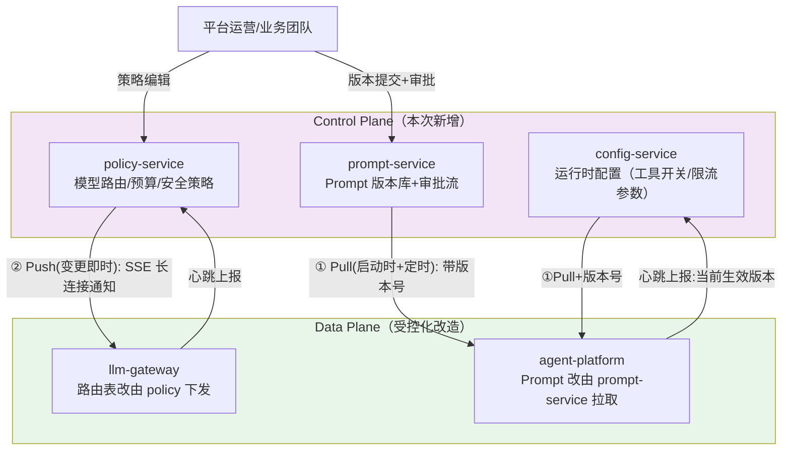
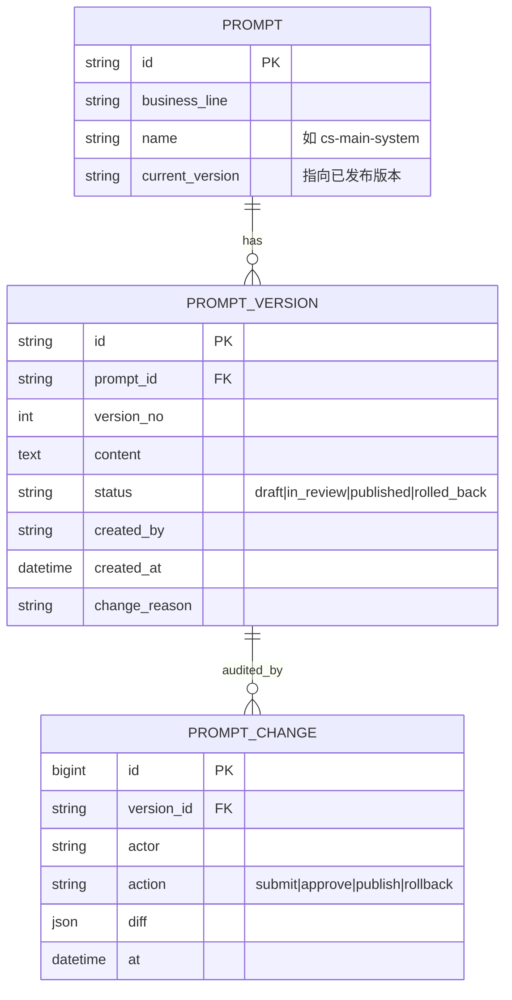
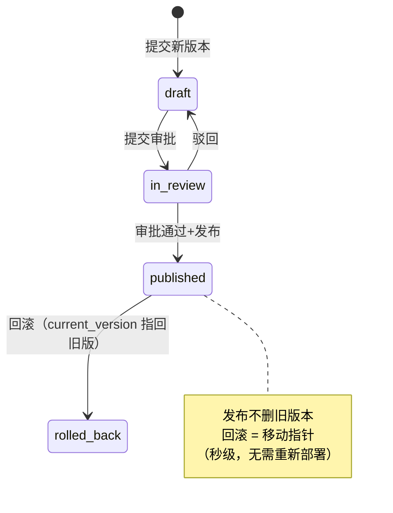
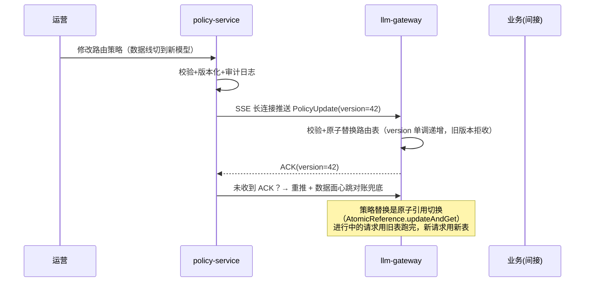

# 项目 05：企业级 Agent 中台 — 03-迭代二：Control Plane 建设

> **定位**：本项目的架构制高点——把散落在三处的配置/提示词/策略收进独立的控制面（config-service + policy-service + prompt-service），实现版本化、灰度化、集中治理。教程 20 的完整落地。**三个控制面服务与数据面接入代码完整可手写**。
>
> 「遇到阻塞？→ [教程 20-管控分离架构 全篇]、[附录 07-企业级架构模式/00-ControlPlane设计模式]、[教程 29-灰度发布与版本管理 §Prompt 版本控制]」

---

## 1. 需求与上一版痛点（四问）

| 问 | 答 |
|----|----|
| **新增了什么需求** | 所有 Prompt 变更走审批+版本记录；配置变更 1 分钟内生效（Push 通道）；策略与配置的变更有完整审计日志 |
| **影响了哪些模块** | 新增 config-service / prompt-service / policy-service；agent-platform 的 Prompt 改为控制面拉取；llm-gateway 的路由表改为 policy 下发 |
| **架构如何演进** | 数据面组件从"自治"转为"受控"：`Push+Pull 双通道`；控制面成为新的高可用责任对象 |
| **上一版痛点是什么** | 配置三处漂移、Prompt 无版本无回滚、变更全量即时生效、策略散落 |

| v2 痛点 | 本次迭代对策 |
|---------|-------------|
| 配置三处漂移 | 统一收敛到 config-service，单一真相源 |
| Prompt 无版本、无回滚 | prompt-service：版本化存储、diff、一键回滚 |
| 变更全量即时生效 | 配置下发带版本号，支持灰度分批（完整灰度在迭代七深化） |
| 策略散落（路由表在网关配置文件） | policy-service 集中策略，网关只执行 |

**这是管控分离的分水岭**——数据面从自治转受控；控制面故障不得传染数据面（Pull 兜底）。

## 2. 架构演进



**Push+Pull 双通道**（ADR-003 的落地）：

| 通道 | 适用 | 机制 | 时效 |
|------|------|------|------|
| Pull + 版本号 | 配置/提示词（允许短暂滞后） | 启动拉全量 + 每 30s 比对版本号，变了才拉 | ≤30s + 拉取耗时 |
| Push 长连接 | 策略（安全/预算类需即时） | 数据面连控制面的 SSE 长连接，变更事件即时推送 + 版本单调 | 秒级 |

Pull 兜底的意义：控制面整体宕机时，数据面用最后已知配置继续运行（控制面故障**不传染**数据面——这是管控分离的生存纪律）。

## 3. 关键实现

### 3.1 prompt-service：版本化与审批

数据模型：



发布流（简版状态机）：



**pom.xml（prompt-service）**：

```xml
<?xml version="1.0" encoding="UTF-8"?>
<project xmlns="http://maven.apache.org/POM/4.0.0"
         xmlns:xsi="http://www.w3.org/2001/XMLSchema-instance"
         xsi:schemaLocation="http://maven.apache.org/POM/4.0.0 https://maven.apache.org/xsd/maven-4.0.0.xsd">
    <modelVersion>4.0.0</modelVersion>
    <parent>
        <groupId>org.springframework.boot</groupId>
        <artifactId>spring-boot-starter-parent</artifactId>
        <version>4.1.0</version>
        <relativePath/>
    </parent>
    <groupId>com.acme</groupId>
    <artifactId>prompt-service</artifactId>
    <version>1.0.0</version>
    <name>prompt-service</name>

    <properties>
        <java.version>21</java.version>
    </properties>

    <dependencies>
        <dependency>
            <groupId>org.springframework.boot</groupId>
            <artifactId>spring-boot-starter-webflux</artifactId>
        </dependency>
        <dependency>
            <groupId>org.springframework.boot</groupId>
            <artifactId>spring-boot-starter-jdbc</artifactId>
        </dependency>
        <dependency>
            <groupId>com.mysql</groupId>
            <artifactId>mysql-connector-j</artifactId>
            <scope>runtime</scope>
        </dependency>
        <dependency>
            <groupId>org.springframework.boot</groupId>
            <artifactId>spring-boot-starter-test</artifactId>
            <scope>test</scope>
        </dependency>
    </dependencies>
</project>
```

**application.yml**：

```yaml
spring:
  application:
    name: prompt-service
  datasource:
    url: jdbc:mysql://mysql-control:3306/control_plane?useSSL=false&serverTimezone=UTC
    username: ${MYSQL_USER}
    password: ${MYSQL_PASSWORD}
server:
  port: 8102
```

**SQL DDL（`schema.sql`，控制面库 `control_plane`）**：

```sql
CREATE TABLE IF NOT EXISTS prompt (
    id                   VARCHAR(64)  PRIMARY KEY,
    business_line        VARCHAR(16)  NOT NULL,
    name                 VARCHAR(64)  NOT NULL,
    current_version_id   VARCHAR(64)  NULL,
    UNIQUE KEY uk_prompt_line_name (business_line, name)
) ENGINE=InnoDB DEFAULT CHARSET=utf8mb4;

CREATE TABLE IF NOT EXISTS prompt_version (
    id             VARCHAR(64)  PRIMARY KEY,
    prompt_id      VARCHAR(64)  NOT NULL,
    version_no     INT          NOT NULL,
    content        TEXT         NOT NULL,
    status         VARCHAR(16)  NOT NULL DEFAULT 'draft',
    created_by     VARCHAR(64)  NOT NULL,
    created_at     DATETIME(6)  NOT NULL,
    change_reason  VARCHAR(255) NULL,
    UNIQUE KEY uk_version_prompt_no (prompt_id, version_no),
    KEY idx_version_prompt_status (prompt_id, status)
) ENGINE=InnoDB DEFAULT CHARSET=utf8mb4;

CREATE TABLE IF NOT EXISTS prompt_change (
    id          BIGINT AUTO_INCREMENT PRIMARY KEY,
    version_id  VARCHAR(64) NOT NULL,
    actor       VARCHAR(64) NOT NULL,
    action      VARCHAR(16) NOT NULL,
    diff        JSON        NULL,
    at          DATETIME(6) NOT NULL,
    KEY idx_change_version (version_id)
) ENGINE=InnoDB DEFAULT CHARSET=utf8mb4;
```

**领域记录 `domain/PromptVersion.java` 与 `domain/PromptChange.java`**：

```java
package com.acme.prompt.domain;

import java.time.LocalDateTime;

public record PromptVersion(
        String id,
        String promptId,
        int versionNo,
        String content,
        String status,          // draft | in_review | published | rolled_back
        String createdBy,
        LocalDateTime createdAt,
        String changeReason
) {}
```

```java
package com.acme.prompt.domain;

import java.time.LocalDateTime;

public record PromptChange(
        long id,
        String versionId,
        String actor,
        String action,          // submit | approve | publish | rollback
        String diff,
        LocalDateTime at
) {}
```

**存储 `storage/JdbcPromptStore.java`**（控制面非热路径，阻塞 JDBC 用 boundedElastic 隔离）：

```java
package com.acme.prompt.storage;

import java.time.LocalDateTime;
import java.util.List;
import java.util.UUID;

import com.acme.prompt.domain.PromptChange;
import com.acme.prompt.domain.PromptVersion;

import org.springframework.jdbc.core.simple.JdbcClient;
import org.springframework.stereotype.Repository;

import reactor.core.publisher.Mono;
import reactor.core.scheduler.Schedulers;

/** 阻塞 JDBC 包一层 Mono + boundedElastic：控制面不在 EventLoop 上 block（响应式铁律）。 */
@Repository
public class JdbcPromptStore {

    private final JdbcClient jdbcClient;

    public JdbcPromptStore(JdbcClient jdbcClient) {
        this.jdbcClient = jdbcClient;
    }

    public Mono<PromptVersion> insertVersion(String promptId, String content, String status,
                                             String createdBy, String changeReason) {
        return Mono.fromCallable(() -> {
            Integer versionNo = jdbcClient.sql(
                    "SELECT COALESCE(MAX(version_no), 0) + 1 FROM prompt_version WHERE prompt_id = :pid")
                    .param("pid", promptId)
                    .query(Integer.class).single();
            String id = UUID.randomUUID().toString();
            LocalDateTime now = LocalDateTime.now();
            jdbcClient.sql("""
                    INSERT INTO prompt_version
                        (id, prompt_id, version_no, content, status, created_by, created_at, change_reason)
                    VALUES (:id, :pid, :vno, :content, :status, :author, :at, :reason)
                    """)
                    .param("id", id).param("pid", promptId).param("vno", versionNo)
                    .param("content", content).param("status", status)
                    .param("author", createdBy).param("at", now).param("reason", changeReason)
                    .update();
            return new PromptVersion(id, promptId, versionNo, content, status, createdBy, now, changeReason);
        }).subscribeOn(Schedulers.boundedElastic());
    }

    public Mono<PromptVersion> updateStatus(String versionId, String status,
                                            String actor, String action, String diff) {
        return Mono.fromCallable(() -> {
            jdbcClient.sql("UPDATE prompt_version SET status = :status WHERE id = :id")
                    .param("status", status).param("id", versionId).update();
            jdbcClient.sql("""
                    INSERT INTO prompt_change (version_id, actor, action, diff, at)
                    VALUES (:vid, :actor, :action, :diff, :at)
                    """)
                    .param("vid", versionId).param("actor", actor).param("action", action)
                    .param("diff", diff).param("at", LocalDateTime.now())
                    .update();
            return findVersion(versionId);
        }).subscribeOn(Schedulers.boundedElastic());
    }

    public Mono<PromptVersion> findVersion(String versionId) {
        return Mono.fromCallable(() -> jdbcClient.sql("""
                SELECT id, prompt_id AS promptId, version_no AS versionNo, content, status,
                       created_by AS createdBy, created_at AS createdAt, change_reason AS changeReason
                FROM prompt_version WHERE id = :id
                """).param("id", versionId).query(PromptVersion.class).single())
                .subscribeOn(Schedulers.boundedElastic());
    }

    public Mono<PromptVersion> setCurrentVersion(String promptId, String versionId) {
        return Mono.fromCallable(() -> {
            jdbcClient.sql("UPDATE prompt SET current_version_id = :vid WHERE id = :pid")
                    .param("vid", versionId).param("pid", promptId).update();
            return versionId;
        }).subscribeOn(Schedulers.boundedElastic())
          .flatMap(this::findVersion);
    }

    public Mono<PromptVersion> rollbackToPreviousPublished(String promptId, String rolledBackVersionId) {
        return Mono.fromCallable(() -> {
            String previousId = jdbcClient.sql("""
                    SELECT id FROM prompt_version
                    WHERE prompt_id = :pid AND status = 'published' AND id <> :vid
                    ORDER BY version_no DESC LIMIT 1
                    """)
                    .param("pid", promptId).param("vid", rolledBackVersionId)
                    .query(String.class).optional().orElseThrow();
            jdbcClient.sql("UPDATE prompt SET current_version_id = :vid WHERE id = :pid")
                    .param("vid", previousId).param("pid", promptId).update();
            return previousId;
        }).subscribeOn(Schedulers.boundedElastic())
          .flatMap(previousId -> findVersion(previousId));
    }

    public Mono<List<PromptVersion>> publishedAll() {
        return Mono.fromCallable(() -> jdbcClient.sql("""
                SELECT v.id, v.prompt_id AS promptId, v.version_no AS versionNo, v.content, v.status,
                       v.created_by AS createdBy, v.created_at AS createdAt, v.change_reason AS changeReason
                FROM prompt_version v
                JOIN prompt p ON p.current_version_id = v.id
                """).query(PromptVersion.class).list())
                .subscribeOn(Schedulers.boundedElastic());
    }
}
```

> 说明：阻塞 JDBC 全部包在 `Mono.fromCallable + subscribeOn(boundedElastic)` 中，WebFlux EventLoop 上不发生任何 block（响应式铁律）。

**服务 `service/PromptService.java`**（状态机转移规则）：

```java
package com.acme.prompt.service;

import java.util.List;

import com.acme.prompt.domain.PromptVersion;
import com.acme.prompt.storage.JdbcPromptStore;

import org.springframework.stereotype.Service;

import reactor.core.publisher.Mono;

@Service
public class PromptService {

    private final JdbcPromptStore store;

    public PromptService(JdbcPromptStore store) {
        this.store = store;
    }

    /** 提交新草稿（draft）。 */
    public Mono<PromptVersion> submitDraft(String promptId, String content,
                                           String createdBy, String changeReason) {
        return store.insertVersion(promptId, content, "draft", createdBy, changeReason);
    }

    /** 提交审批：draft → in_review（允许的转移才执行，否则报错）。 */
    public Mono<PromptVersion> submitForReview(String versionId, String actor) {
        return transition(versionId, "draft", "in_review", actor, "submit", "{}");
    }

    /** 审批通过并发布：in_review → published，并把 current_version 指针指向本版本。 */
    public Mono<PromptVersion> publish(String versionId, String actor) {
        return transition(versionId, "in_review", "published", actor, "publish", "{}")
                .flatMap(v -> store.setCurrentVersion(v.promptId(), v.id()));
    }

    /** 驳回：in_review → draft。 */
    public Mono<PromptVersion> reject(String versionId, String actor) {
        return transition(versionId, "in_review", "draft", actor, "reject", "{}");
    }

    /** 回滚：published → rolled_back，指针切回上一个 published 版本（秒级）。 */
    public Mono<PromptVersion> rollback(String versionId, String actor) {
        return transition(versionId, "published", "rolled_back", actor, "rollback", "{}")
                .flatMap(v -> store.rollbackToPreviousPublished(v.promptId(), v.id()));
    }

    /** 数据面 Pull 通道：拉取全部已发布 Prompt。 */
    public Mono<List<PromptVersion>> publishedAll() {
        return store.publishedAll();
    }

    private Mono<PromptVersion> transition(String versionId, String from, String to,
                                           String actor, String action, String diff) {
        return store.findVersion(versionId)
                .flatMap(v -> {
                    if (!from.equals(v.status())) {
                        return Mono.error(new IllegalStateException(
                                "非法状态转移: %s -> %s（当前 %s）".formatted(from, to, v.status())));
                    }
                    return store.updateStatus(versionId, to, actor, action, diff);
                });
    }
}
```

**入口 `web/PromptController.java`**：

```java
package com.acme.prompt.web;

import java.util.List;

import com.acme.prompt.domain.PromptVersion;
import com.acme.prompt.service.PromptService;

import org.springframework.web.bind.annotation.GetMapping;
import org.springframework.web.bind.annotation.PathVariable;
import org.springframework.web.bind.annotation.PostMapping;
import org.springframework.web.bind.annotation.RequestBody;
import org.springframework.web.bind.annotation.RequestMapping;
import org.springframework.web.bind.annotation.RequestParam;
import org.springframework.web.bind.annotation.RestController;

import reactor.core.publisher.Mono;

@RestController
@RequestMapping("/prompts")
public class PromptController {

    private final PromptService promptService;

    public PromptController(PromptService promptService) {
        this.promptService = promptService;
    }

    @PostMapping("/{promptId}/draft")
    public Mono<PromptVersion> submitDraft(@PathVariable String promptId,
                                           @RequestBody DraftRequest req) {
        return promptService.submitDraft(promptId, req.content(), req.createdBy(), req.changeReason());
    }

    @PostMapping("/versions/{versionId}/review")
    public Mono<PromptVersion> submitForReview(@PathVariable String versionId,
                                               @RequestBody ActorRequest actor) {
        return promptService.submitForReview(versionId, actor.actor());
    }

    @PostMapping("/versions/{versionId}/publish")
    public Mono<PromptVersion> publish(@PathVariable String versionId, @RequestBody ActorRequest actor) {
        return promptService.publish(versionId, actor.actor());
    }

    @PostMapping("/versions/{versionId}/reject")
    public Mono<PromptVersion> reject(@PathVariable String versionId, @RequestBody ActorRequest actor) {
        return promptService.reject(versionId, actor.actor());
    }

    @PostMapping("/versions/{versionId}/rollback")
    public Mono<PromptVersion> rollback(@PathVariable String versionId, @RequestBody ActorRequest actor) {
        return promptService.rollback(versionId, actor.actor());
    }

    /** 数据面 Pull 通道：全量已发布 Prompt（数据面本地按版本号 merge）。 */
    @GetMapping("/published")
    public Mono<List<PromptVersion>> published() {
        return promptService.publishedAll();
    }

    public record DraftRequest(String content, String createdBy, String changeReason) {}
    public record ActorRequest(String actor) {}
}
```

### 3.2 数据面接入：agent-platform 的 Prompt 解析改造

**`platform/chat/internal/PromptResolver.java`**——从"类路径文件"改为"控制面拉取+本地缓存"：

```java
package com.acme.agent.platform.chat.internal;

import java.io.IOException;
import java.io.InputStream;
import java.nio.charset.StandardCharsets;
import java.util.List;
import java.util.Map;
import java.util.concurrent.ConcurrentHashMap;
import java.util.concurrent.atomic.AtomicReference;

import org.slf4j.Logger;
import org.slf4j.LoggerFactory;
import org.springframework.scheduling.annotation.Scheduled;
import org.springframework.stereotype.Component;
import org.springframework.web.reactive.function.client.WebClient;

import reactor.core.publisher.Mono;

/** Prompt 解析：控制面拉取 + 本地缓存 + 出厂文件兜底（三层来源，ADR-009）。 */
@Component
public class PromptResolver {

    private static final Logger log = LoggerFactory.getLogger(PromptResolver.class);

    private final WebClient webClient;
    private final AtomicReference<Map<String, VersionedPrompt>> cache = new AtomicReference<>(Map.of());

    public PromptResolver(WebClient.Builder webClientBuilder) {
        this.webClient = webClientBuilder.baseUrl(System.getenv("PROMPT_SERVICE_URL")).build();
    }

    /** Pull 通道：启动拉全量 + 每 30s 比对版本号，变了才替换（本地缓存续命）。 */
    @Scheduled(fixedDelay = 30_000)
    void refresh() {
        webClient.get()
                .uri("/prompts/published")
                .retrieve()
                .bodyToFlux(PublishedPrompt.class)
                .collectList()
                .doOnNext(this::merge)
                .subscribe(
                        unused -> log.info("Prompt 全量同步完成"),
                        err -> log.warn("Prompt 拉取失败，使用本地缓存/出厂文件: {}", err.getMessage()));
    }

    private void merge(List<PublishedPrompt> fresh) {
        Map<String, VersionedPrompt> merged = new ConcurrentHashMap<>(cache.get());
        for (PublishedPrompt p : fresh) {
            String key = p.businessLine() + "/" + p.name();
            VersionedPrompt old = merged.get(key);
            if (old == null || old.versionNo() < p.versionNo()) {
                merged.put(key, new VersionedPrompt(p.content(), p.versionNo()));
                log.info("Prompt 更新生效: {} v{}", key, p.versionNo());
            }
        }
        cache.set(Map.copyOf(merged));   // 原子替换
    }

    public String resolve(String businessLine, String name) {
        VersionedPrompt p = cache.get().get(businessLine + "/" + name);
        return p != null ? p.content() : fallbackFromLocalFile(businessLine, name);
    }

    /** 控制面不可用时的降级：类路径永远保留一份"出厂版本"作为最后防线。 */
    private String fallbackFromLocalFile(String businessLine, String name) {
        try (InputStream in = getClass().getResourceAsStream(
                "/prompts/" + businessLine + "/" + name + ".txt")) {
            if (in == null) {
                throw new IllegalStateException("Prompt 无任何可用来源: " + businessLine + "/" + name);
            }
            return new String(in.readAllBytes(), StandardCharsets.UTF_8);
        } catch (IOException e) {
            throw new IllegalStateException("出厂 Prompt 读取失败: " + businessLine + "/" + name, e);
        }
    }

    /** 数据面本地版本化缓存条目。 */
    public record VersionedPrompt(String content, int versionNo) {}

    /** 控制面 Pull 通道的传输对象。 */
    public record PublishedPrompt(String id, String businessLine, String name,
                                  String content, int versionNo) {}
}
```

> 需要在 `AgentPlatformApplication` 上加 `@EnableScheduling`（见 3.4）。控制面不可用 → 本地缓存续命；缓存也空 → 出厂文件；两者都没有 → 拒绝启动。

### 3.3 policy-service 与网关的 Push 通道

**pom.xml（policy-service）**：与 prompt-service 同构（webflux + jdbc + mysql），端口 8103。为节省篇幅仅列差异，完整依赖块参照 3.1 的 pom 结构。

```xml
<dependency>
    <groupId>org.springframework.boot</groupId>
    <artifactId>spring-boot-starter-webflux</artifactId>
</dependency>
<dependency>
    <groupId>org.springframework.boot</groupId>
    <artifactId>spring-boot-starter-jdbc</artifactId>
</dependency>
<dependency>
    <groupId>com.mysql</groupId>
    <artifactId>mysql-connector-j</artifactId>
    <scope>runtime</scope>
</dependency>
```

```yaml
spring:
  application:
    name: policy-service
  datasource:
    url: jdbc:mysql://mysql-control:3306/control_plane?useSSL=false&serverTimezone=UTC
    username: ${MYSQL_USER}
    password: ${MYSQL_PASSWORD}
server:
  port: 8103
```

**`service/PolicyService.java`**（策略版本化 + SSE 事件广播）：

```java
package com.acme.policy.service;

import java.time.Instant;
import java.util.concurrent.atomic.AtomicLong;

import org.springframework.stereotype.Service;

import reactor.core.publisher.Flux;
import reactor.core.publisher.Mono;
import reactor.core.publisher.Sinks;

@Service
public class PolicyService {

    private final AtomicLong version = new AtomicLong(0);
    // 多播 + 最近 100 条重放：网关断线重连后能拿到漏掉的版本
    private final Sinks.Many<PolicyUpdate> sink = Sinks.many().replay().limit(100);

    /** 运营侧编辑策略：版本号单调递增 + 广播 + 落库（审计日志省略于篇幅，模式同 prompt_change）。 */
    public Mono<PolicyUpdate> updateRoutes(RoutePolicy policy) {
        return Mono.fromCallable(() -> {
            long v = version.incrementAndGet();
            PolicyUpdate update = new PolicyUpdate(v, policy, Instant.now());
            Sinks.EmitResult result = sink.tryEmitNext(update);
            if (result.isFailure()) {
                throw new IllegalStateException("策略广播失败: " + result);
            }
            return update;
        });
    }

    /** Push 通道：数据面订阅的 SSE 流，只推比客户端更新的版本。 */
    public Flux<PolicyUpdate> eventsSince(long fromVersion) {
        return sink.asFlux().filter(u -> u.version() > fromVersion);
    }

    public record RoutePolicy(String businessLine, String supplier, String modelName,
                              String endpoint, String keyEnvVar) {}

    public record PolicyUpdate(long version, RoutePolicy policy, Instant at) {}
}
```

**`web/PolicyController.java`**：

```java
package com.acme.policy.web;

import com.acme.policy.service.PolicyService;
import com.acme.policy.service.PolicyService.PolicyUpdate;
import com.acme.policy.service.PolicyService.RoutePolicy;

import org.springframework.http.MediaType;
import org.springframework.http.codec.ServerSentEvent;
import org.springframework.web.bind.annotation.GetMapping;
import org.springframework.web.bind.annotation.PutMapping;
import org.springframework.web.bind.annotation.RequestBody;
import org.springframework.web.bind.annotation.RequestMapping;
import org.springframework.web.bind.annotation.RequestParam;
import org.springframework.web.bind.annotation.RestController;

import reactor.core.publisher.Flux;
import reactor.core.publisher.Mono;

@RestController
@RequestMapping("/policy")
public class PolicyController {

    private final PolicyService policyService;

    public PolicyController(PolicyService policyService) {
        this.policyService = policyService;
    }

    @PutMapping("/routes")
    public Mono<PolicyUpdate> updateRoutes(@RequestBody RoutePolicy policy) {
        return policyService.updateRoutes(policy);
    }

    /** Push 通道端点：数据面（网关）通过 SSE 长连接订阅。 */
    @GetMapping(value = "/stream", produces = MediaType.TEXT_EVENT_STREAM_VALUE)
    public Flux<ServerSentEvent<PolicyUpdate>> stream(@RequestParam(defaultValue = "0") long fromVersion) {
        return policyService.eventsSince(fromVersion)
                .map(u -> ServerSentEvent.<PolicyUpdate>builder(u).build());
    }
}
```

**网关侧订阅端：`policy/PolicyClient.java`（llm-gateway 新增）**：

```java
package com.acme.gateway.policy;

import java.time.Duration;
import java.util.Map;
import java.util.concurrent.atomic.AtomicReference;

import com.acme.gateway.route.ModelRouter;

import org.slf4j.Logger;
import org.slf4j.LoggerFactory;
import org.springframework.boot.context.event.ApplicationReadyEvent;
import org.springframework.context.event.EventListener;
import org.springframework.core.ParameterizedTypeReference;
import org.springframework.http.codec.ServerSentEvent;
import org.springframework.stereotype.Component;
import org.springframework.web.reactive.function.client.WebClient;

import reactor.util.retry.Retry;

/** Push 通道客户端：订阅 policy-service 的 SSE 流，版本单调拒收乱序旧推送（ADR-010）。 */
@Component
public class PolicyClient {

    private static final Logger log = LoggerFactory.getLogger(PolicyClient.class);

    private final WebClient webClient;
    private final ModelRouter modelRouter;

    public PolicyClient(WebClient.Builder webClientBuilder, ModelRouter modelRouter) {
        this.webClient = webClientBuilder.baseUrl(System.getenv("POLICY_SERVICE_URL")).build();
        this.modelRouter = modelRouter;
    }

    @EventListener(ApplicationReadyEvent.class)
    public void subscribe() {
        AtomicReference<Long> lastVersion = new AtomicReference<>(0L);
        webClient.get()
                .uri(uriBuilder -> uriBuilder.path("/policy/stream")
                        .queryParam("fromVersion", 0).build())
                .retrieve()
                .bodyToFlux(new ParameterizedTypeReference<ServerSentEvent<PolicyUpdate>>() {})
                .map(ServerSentEvent::data)
                .filter(u -> u.version() > lastVersion.get())   // 版本单调：旧版本拒收
                .doOnNext(u -> {
                    lastVersion.set(u.version());
                    modelRouter.applyRoutes(Map.of(u.policy().businessLine(),
                            new ModelRouter.RouteSpec(u.policy().supplier(), u.policy().modelName(),
                                    u.policy().endpoint(), u.policy().keyEnvVar())));
                    log.info("路由策略更新: v{} → {}", u.version(), u.policy().businessLine());
                })
                .retryWhen(Retry.backoff(5, Duration.ofSeconds(1))
                        .maxBackoff(Duration.ofSeconds(30)))   // 断线重连：指数退避
                .subscribe(
                        unused -> {},
                        err -> log.error("策略推送连接中断: {}", err.getMessage()));
    }

    /** 与 policy-service 的 PolicyUpdate 对应的客户端 DTO（契约跨服务共享）。 */
    public record PolicyUpdate(long version, RoutePolicy policy, java.time.Instant at) {
        public record RoutePolicy(String businessLine, String supplier, String modelName,
                                  String endpoint, String keyEnvVar) {}
    }
}
```

**版本单调性是推送协议的命门**：乱序到达的旧推送必须被拒收（`filter(u -> u.version() > lastVersion.get())`），否则"先发后至"会把新策略改回旧的。路由表替换是 `AtomicReference` 原子引用切换——进行中的请求用旧表跑完，新请求用新表。

**`route/ModelRouter.java` 增加 `applyRoutes`（v2 已预留，此处补实现）**：

```java
package com.acme.gateway.route;

import java.util.HashMap;
import java.util.Map;
import java.util.concurrent.atomic.AtomicReference;

import org.springframework.stereotype.Component;

@Component
public class ModelRouter {

    private final AtomicReference<Map<String, RouteSpec>> routes = new AtomicReference<>(Map.of(
            "cs", new RouteSpec("deepseek", "deepseek-chat", "https://api.deepseek.com/v1", "DEEPSEEK_API_KEY"),
            "km", new RouteSpec("openai", "gpt-4o-mini", "https://api.openai.com/v1", "OPENAI_API_KEY"),
            "da", new RouteSpec("vllm", "internal-chat", "http://llm-internal:8000/v1", "VLLM_API_KEY")
    ));

    public ModelRoute resolve(String businessLine, String requestedModel) {
        RouteSpec spec = routes.get().getOrDefault(businessLine, routes.get().get("km"));
        return new ModelRoute(spec.supplier(), spec.modelName(), spec.endpoint(),
                System.getenv(spec.keyEnvVar()));
    }

    /** Push 通道落点：版本单调校验已在 PolicyClient 完成，此处只做原子替换。 */
    public void applyRoutes(Map<String, RouteSpec> newRoutes) {
        routes.updateAndGet(map -> {
            Map<String, RouteSpec> copy = new HashMap<>(map);
            copy.putAll(newRoutes);
            return Map.copyOf(copy);
        });
    }

    public record RouteSpec(String supplier, String modelName, String endpoint, String keyEnvVar) {}
}
```



### 3.4 config-service：Pull + 版本号

**`web/ConfigController.java`**（config-service，端口 8101）：

```java
package com.acme.config.web;

import java.util.Map;
import java.util.concurrent.ConcurrentHashMap;

import org.springframework.web.bind.annotation.GetMapping;
import org.springframework.web.bind.annotation.PathVariable;
import org.springframework.web.bind.annotation.PutMapping;
import org.springframework.web.bind.annotation.RequestBody;
import org.springframework.web.bind.annotation.RequestMapping;
import org.springframework.web.bind.annotation.RestController;

import reactor.core.publisher.Mono;

/** 运行时配置（工具开关/限流参数）：版本号单调递增，数据面本地比对。 */
@RestController
@RequestMapping("/config")
public class ConfigController {

    private final Map<String, ConfigValue> store = new ConcurrentHashMap<>();

    @GetMapping("/{key}")
    public Mono<ConfigValue> get(@PathVariable String key) {
        return Mono.justOrEmpty(store.get(key));
    }

    @PutMapping("/{key}")
    public Mono<ConfigValue> put(@PathVariable String key, @RequestBody String value) {
        long v = store.containsKey(key) ? store.get(key).version() + 1 : 1;
        ConfigValue cv = new ConfigValue(key, value, v);
        store.put(key, cv);
        return Mono.just(cv);
    }

    public record ConfigValue(String key, String value, long version) {}
}
```

> 数据面接入 config-service 的 Pull 模式与 PromptResolver 完全一致（定时全量比对版本号、本地缓存、fail-safe 兜底），不再重复贴代码——这是"配置/提示词共用一套 Pull 协议"的体现。

### 3.5 数据面启用定时拉取

在 `AgentPlatformApplication` 上加调度开关（Pull 通道依赖）：

```java
package com.acme.agent.bootstrap;

import org.springframework.boot.SpringApplication;
import org.springframework.boot.autoconfigure.SpringBootApplication;
import org.springframework.scheduling.annotation.EnableScheduling;

@SpringBootApplication
@EnableScheduling
public class AgentPlatformApplication {
    public static void main(String[] args) {
        SpringApplication.run(AgentPlatformApplication.class, args);
    }
}
```

## 4. 验收标准

| # | 验收项 | 标准 |
|---|--------|------|
| 1 | Prompt 治理 | 修改→审批→发布全流程留痕；回滚 < 1 分钟生效（无需重启） |
| 2 | 下发时效 | 策略 Push 秒级生效；配置 Pull ≤ 35s 生效 |
| 3 | 版本一致性 | 任意时刻查询"每台网关/业务实例当前生效版本"，心跳对账无漂移 |
| 4 | 控制面容错 | 重启 config-service，业务无感（本地缓存续命）；整体停机 1 小时，数据面按最后配置继续服务 |
| 5 | 推送乱序防护 | 模拟旧版本延迟到达，被正确拒收 |
| 6 | 审计 | 所有配置/策略/Prompt 变更可查 actor/action/diff/时间 |

### 验证包（手工测试与验证）

**前置条件**：上一迭代已验收通过；本迭代全部组件部署完成；测试租户/业务线账号就绪。

**材料 A——探针请求集**（按验收项逐条构造）：

```bash
# 通用请求模板（按验收场景替换 path/body）
curl -X POST http://localhost:8080/api/{本迭代接口} \
  -H "Authorization: Bearer $TEST_TOKEN" -H "Content-Type: application/json" \
  -d '{按验收项构造的请求体}'
```

**材料 B——压测器**（hey/wrk，用于并发/配额类验收项）：`hey -c 500 -n 5000 -H "Authorization: Bearer $T" http://...`
**材料 C——故障注入开关**（kill 组件/断网，用于高可用/降级类验收项）。

**步骤与断言**：

| # | 操作（对照材料 A/B/C 构造场景） | 预期（PASS 判据） |
|---|------|------------------|
| 1 | 按验收项「Prompt 治理」构造场景执行 | 修改→审批→发布全流程留痕；回滚 < 1 分钟生效（无需重启） |
| 2 | 按验收项「下发时效」构造场景执行 | 策略 Push 秒级生效；配置 Pull ≤ 35s 生效 |
| 3 | 按验收项「版本一致性」构造场景执行 | 任意时刻查询"每台网关/业务实例当前生效版本"，心跳对账无漂移 |
| 4 | 按验收项「控制面容错」构造场景执行 | 重启 config-service，业务无感（本地缓存续命）；整体停机 1 小时，数据面按最后配置继续服务 |
| 5 | 按验收项「推送乱序防护」构造场景执行 | 模拟旧版本延迟到达，被正确拒收 |
| 6 | 按验收项「审计」构造场景执行 | 所有配置/策略/Prompt 变更可查 actor/action/diff/时间 |

**失败排查**：断言不符时先分层定位——网关入口日志（请求到没到）→ 对应服务日志（业务内失败）→ 控制面/策略是否生效（配置版本与 ACK）；隔离/配额类失败优先怀疑测试前置（租户/凭证是否真的构造对），再怀疑实现。

## 5. 本迭代的 ADR

| # | 决策 | 理由 |
|---|------|------|
| ADR-008 | 控制面拆三个服务而非一个"大一统"控制面 | 变更频率与故障域不同（Prompt 高频/策略低频）；一统则任一模块发布影响全部 |
| ADR-009 | Prompt 降级三层（控制面→出厂文件→拒绝启动） | 控制面 SLA 低于数据面是被允许的，前提是数据面有底线 |
| ADR-010 | 推送协议强制版本单调 + 断线重连 + 心跳对账 | 网络重排与推送丢失是必然事件，不是异常事件 |

## 6. v3 的痛点（驱动下一迭代）

控制面就位后，能力复用的矛盾浮上水面：

1. **工具重复实现**：客服线和数据线都要"查订单"，两份代码、两份权限配置、两份审计——重复是其次，**权限口径不一致**才是风险
2. **工具硬编码**：`chat-core` 的工具集编译期写死，新增工具要发版业务应用
3. **工具无法独立扩缩容**：重 IO 的 SQL 工具和轻量的 FAQ 工具挤在同一进程

→ [04-迭代三-工具服务化与注册中心.md](04-迭代三-工具服务化与注册中心.md)
