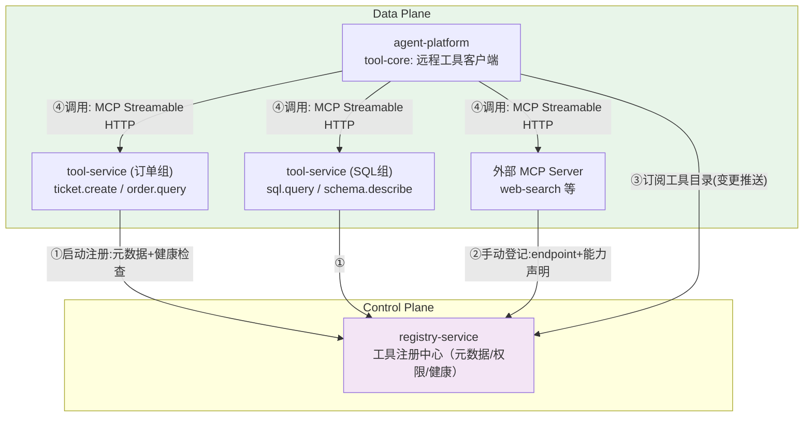

# 项目 05：企业级 Agent 中台 — 04-工具服务化与注册中心

> **定位**：工具从"业务代码内的方法"演进为"独立部署的服务 + 统一注册中心 + MCP 标准接入"——能力复用、权限统一口径、独立扩缩容三箭齐发。**registry-service / tool-service / agent-platform 工具客户端代码完整可手写**。
>
> 「遇到阻塞？→ [教程 00-基础与核心/03-工具调用 §工具注册与发现]、[教程 02-SpringAI核心机制/07-MCP协议]、[前沿 04-MCP生态全景 §企业 Gateway]；MCP API 真实性以 [附录 05-01-MCP真实API与坐标] 为准」

---

## 1. 需求与上一版痛点（四问）

| 问 | 答 |
|----|----|
| **新增了什么需求** | 工具统一注册与发现；工具权限按"业务线×工具×参数级别"三级声明；内部工具与外部 MCP 工具同一套接入模型 |
| **影响了哪些模块** | `tool-core` 从"进程内 ToolRegistry"重构为"远程工具客户端"；新增 `tool-service`（数据面）与 registry-service（控制面） |
| **架构如何演进** | 工具唯一实现 + 注册中心动态发现 + 权限规则由控制面下发、数据面本地判定 |
| **上一版痛点是什么** | 工具重复实现、权限口径不一；工具硬编码新增要发版；重 IO 工具与轻量工具挤同进程 |

| v3 痛点 | 本次迭代对策 |
|---------|-------------|
| 工具重复实现、权限口径不一 | 工具唯一实现 + 中台统一权限模型 |
| 工具硬编码、新增要发版 | 注册中心 + 动态发现，业务侧零代码接入新工具 |
| 重 IO 工具与轻量工具挤同进程 | tool-service 独立部署、按工具组扩缩容 |

### 1.1 本节核对（四问与痛点对策）

- 四问完整；三行对策各自在 §3 有落点（§3.1 注册模型/§3.2 独立部署/§3.3 权限模型）。

## 2. 架构演进



### 2.1 本节核对（架构演进图）

- 注册边①②与订阅边③调用边④方向正确：tool-service 注册进 registry，agent-platform 只连 registry（发现）与 tool-service（执行），无业务→registry 的热路径调用（ADR-011）。

## 3. 关键实现

### 3.1 registry-service：工具注册模型

**`domain/ToolRegistration.java`**：

```java
package com.acme.registry.domain;

import java.util.List;

import com.fasterxml.jackson.databind.JsonNode;

/** registry-service 的核心实体：全局唯一 toolId + 部署组 + 参数 Schema + 权限规则。 */
public record ToolRegistration(
        String toolId,               // 全局唯一: "order.query"
        String group,                // 部署组: "order-tools" → 决定打到哪个 tool-service 实例
        String description,          // 给 LLM 看的描述（教程 00-基础与核心/03-工具调用 §description 写作法则）
        JsonNode parameterSchema,    // JSON Schema 参数声明
        ToolTransport transport,     // MCP_STREAMABLE_HTTP
        String endpoint,
        List<PermissionRule> permissions,   // 权限规则（见 §3.3）
        HealthStatus health          // 注册中心被动探测 + 服务主动上报
) {}
```

**`domain/ToolTransport.java` / `domain/HealthStatus.java` / `domain/PermissionRule.java`**：

```java
package com.acme.registry.domain;

public enum ToolTransport { MCP_STREAMABLE_HTTP }
```

```java
package com.acme.registry.domain;

public enum HealthStatus { UP, DOWN, DEPRECATING }
```

```java
package com.acme.registry.domain;

import java.util.List;

/** 权限三级: 业务线 × 工具 × 参数规则。 */
public record PermissionRule(
        String businessLine,         // "cs" | "km" | "da" | "*"
        Effect effect,               // ALLOW / DENY
        List<ParamConstraint> constraints   // 参数级约束: amount <= 5000 之类
) {}
```

```java
package com.acme.registry.domain;

public enum Effect { ALLOW, DENY }
```

```java
package com.acme.registry.domain;

public record ParamConstraint(String param, String op, String value) {}
```

**`web/RegistryController.java`**（注册/查询/健康上报）：

```java
package com.acme.registry.web;

import java.util.List;
import java.util.Map;
import java.util.concurrent.ConcurrentHashMap;

import com.acme.registry.domain.HealthStatus;
import com.acme.registry.domain.ToolRegistration;

import org.springframework.web.bind.annotation.GetMapping;
import org.springframework.web.bind.annotation.PathVariable;
import org.springframework.web.bind.annotation.PostMapping;
import org.springframework.web.bind.annotation.RequestBody;
import org.springframework.web.bind.annotation.RequestMapping;
import org.springframework.web.bind.annotation.RestController;

import reactor.core.publisher.Mono;

@RestController
@RequestMapping("/registry")
public class RegistryController {

    private final Map<String, ToolRegistration> tools = new ConcurrentHashMap<>();

    /** 工具服务启动时注册（①）。 */
    @PostMapping("/tools")
    public Mono<ToolRegistration> register(@RequestBody ToolRegistration registration) {
        tools.put(registration.toolId(), registration);
        return Mono.just(registration);
    }

    /** 数据面订阅工具目录（③ Pull 通道；变更推送复用 v3 的 Push+版本号协议）。 */
    @GetMapping("/tools")
    public Mono<List<ToolRegistration>> list() {
        return Mono.just(List.copyOf(tools.values()));
    }

    @GetMapping("/tools/{toolId}")
    public Mono<ToolRegistration> get(@PathVariable String toolId) {
        return Mono.justOrEmpty(tools.get(toolId));
    }

    /** 健康上报：UP / DOWN / DEPRECATING（下线优雅期，ADR-013）。 */
    @PostMapping("/tools/{toolId}/health")
    public Mono<ToolRegistration> updateHealth(@PathVariable String toolId,
                                               @RequestBody HealthReport report) {
        ToolRegistration existing = tools.get(toolId);
        if (existing == null) {
            return Mono.error(new IllegalArgumentException("工具不存在: " + toolId));
        }
        ToolRegistration updated = new ToolRegistration(
                existing.toolId(), existing.group(), existing.description(),
                existing.parameterSchema(), existing.transport(), existing.endpoint(),
                existing.permissions(), report.health());
        tools.put(toolId, updated);
        return Mono.just(updated);
    }

    public record HealthReport(HealthStatus health) {}
}
```

**pom.xml（registry-service）**：webflux 即可，端口 8301。

```xml
<?xml version="1.0" encoding="UTF-8"?>
<project xmlns="http://maven.apache.org/POM/4.0.0"
         xmlns:xsi="http://www.w3.org/2001/XMLSchema-instance"
         xsi:schemaLocation="http://maven.apache.org/POM/4.0.0 https://maven.apache.org/xsd/maven-4.0.0.xsd">
    <modelVersion>4.0.0</modelVersion>
    <parent>
        <groupId>org.springframework.boot</groupId>
        <artifactId>spring-boot-starter-parent</artifactId>
        <version>4.1.0</version>
        <relativePath/>
    </parent>
    <groupId>com.acme</groupId>
    <artifactId>registry-service</artifactId>
    <version>1.0.0</version>
    <name>registry-service</name>

    <properties>
        <java.version>21</java.version>
    </properties>

    <dependencies>
        <dependency>
            <groupId>org.springframework.boot</groupId>
            <artifactId>spring-boot-starter-webflux</artifactId>
        </dependency>
        <dependency>
            <groupId>org.springframework.boot</groupId>
            <artifactId>spring-boot-starter-test</artifactId>
            <scope>test</scope>
        </dependency>
    </dependencies>
</project>
```

**配置（两段式：`application.yaml` + `application-registry-service.yaml`）**：

```yaml
# application.yaml（全局骨架：仅 .env 导入 + profile 激活）
spring:
  config:
    import: optional:file:.env[.properties]
  profiles:
    active: agenthub
```

```yaml
# application-registry-service.yaml（registry-service 业务配置）
spring:
  application:
    name: registry-service
server:
  port: 8301
```

#### 3.1.1 本节测试与验证（registry-service 注册与目录）

**前置条件**：registry-service 按 §3.1 启动于 8301。

**材料——注册探针**（来自 §3.1 RegistryController）：

```bash
curl -X POST http://localhost:8301/registry/tools \
  -H "Content-Type: application/json" \
  -d '{"toolId":"order.query","group":"order-tools","description":"查询订单","parameterSchema":{"type":"object"},"transport":"MCP_STREAMABLE_HTTP","endpoint":"http://tool-order:8201/mcp","permissions":[{"businessLine":"da","effect":"ALLOW","constraints":[]}],"health":"UP"}'
curl http://localhost:8301/registry/tools
curl http://localhost:8301/registry/tools/order.query
curl -X POST http://localhost:8301/registry/tools/order.query/health \
  -H "Content-Type: application/json" -d '{"health":"DEPRECATING"}'
```

**步骤与断言**：

| # | 操作 | 预期（PASS 判据） |
|---|------|------------------|
| 1 | 材料：注册 + list | list 含 order.query，字段与提交一致 |
| 2 | get 单个 | 返回该 ToolRegistration |
| 3 | health 上报 | 返回体 health=DEPRECATING，其余字段不变（只换健康位） |
| 4 | 对不存在的 toolId 上报健康 | 报「工具不存在」（IllegalArgumentException） |

**失败排查**：步骤 3 其余字段被清空 → 未按 §3.1 示例做"保留旧值重建 record"。

### 3.2 tool-service：@Tool 暴露为 MCP 工具

> **API 真实性要点**（依据附录 05-01）：Spring AI 中 `@Tool` 方法暴露为 MCP 工具**需要显式注册 `ToolCallbackProvider` Bean**，不存在"自动注册"。本项目技术栈为 WebFlux，因此用 **`spring-ai-starter-mcp-server-webflux`**（而非 servlet 的 webmvc 变体）——保持全链路非阻塞。

**pom.xml（tool-service，订单组）**：

```xml
<?xml version="1.0" encoding="UTF-8"?>
<project xmlns="http://maven.apache.org/POM/4.0.0"
         xmlns:xsi="http://www.w3.org/2001/XMLSchema-instance"
         xsi:schemaLocation="http://maven.apache.org/POM/4.0.0 https://maven.apache.org/xsd/maven-4.0.0.xsd">
    <modelVersion>4.0.0</modelVersion>
    <parent>
        <groupId>org.springframework.boot</groupId>
        <artifactId>spring-boot-starter-parent</artifactId>
        <version>4.1.0</version>
        <relativePath/>
    </parent>
    <groupId>com.acme</groupId>
    <artifactId>tool-service-order</artifactId>
    <version>1.0.0</version>
    <name>tool-service-order</name>

    <properties>
        <java.version>21</java.version>
    </properties>

    <dependencyManagement>
        <dependencies>
            <dependency>
                <groupId>org.springframework.ai</groupId>
                <artifactId>spring-ai-bom</artifactId>
                <version>2.0.0</version>
                <type>pom</type>
                <scope>import</scope>
            </dependency>
        </dependencies>
    </dependencyManagement>

    <dependencies>
        <dependency>
            <groupId>org.springframework.boot</groupId>
            <artifactId>spring-boot-starter-webflux</artifactId>
        </dependency>
        <dependency>
            <groupId>org.springframework.ai</groupId>
            <artifactId>spring-ai-starter-mcp-server-webflux</artifactId>
        </dependency>
        <dependency>
            <groupId>org.springframework.boot</groupId>
            <artifactId>spring-boot-starter-test</artifactId>
            <scope>test</scope>
        </dependency>
    </dependencies>
</project>
```

**application.yml**：

**配置（两段式：`application.yaml` + `application-tool-service.yaml`）**：

```yaml
# application.yaml（全局骨架：仅 .env 导入 + profile 激活）
spring:
  config:
    import: optional:file:.env[.properties]
  profiles:
    active: agenthub
```

```yaml
# application-tool-service.yaml（tool-service 订单组业务配置）
spring:
  application:
    name: tool-service-order
server:
  port: 8201
# MCP Server（Streamable HTTP）由 starter 自动装配，默认暴露路径以所引版本为准（通常 /mcp）
```

**`order/OrderTools.java`**：

```java
package com.acme.tool.order;

import org.springframework.ai.tool.annotation.Tool;
import org.springframework.ai.tool.annotation.ToolParam;
import org.springframework.stereotype.Component;

@Component
public class OrderTools {

    private final OrderRepository orderRepository;

    public OrderTools(OrderRepository orderRepository) {
        this.orderRepository = orderRepository;
    }

    @Tool(name = "order.query",
          description = "按订单号查询订单状态与金额。仅支持本集团订单。")
    public OrderStatus queryOrder(
            @ToolParam(description = "订单号，形如 SO-2026xxxxx") String orderId) {
        return orderRepository.findStatus(orderId);
    }

    @Tool(name = "ticket.create",
          description = "创建一张客服工单并返回工单号。紧急度 P0 需人工审批。")
    public String createTicket(
            @ToolParam(description = "用户 ID") String userId,
            @ToolParam(description = "问题描述") String description,
            @ToolParam(description = "紧急度: P0/P1/P2") String urgency) {
        if ("P0".equalsIgnoreCase(urgency)) {
            throw new IllegalArgumentException("P0 紧急工单需人工审批（参数级约束，§3.3）");
        }
        return "ticket-" + Integer.toHexString((userId + description).hashCode());
    }
}
```

**`order/OrderStatus.java` 与 `order/OrderRepository.java`**：

```java
package com.acme.tool.order;

public record OrderStatus(String orderId, double amount, String status) {}
```

```java
package com.acme.tool.order;

import java.util.Map;
import java.util.concurrent.ConcurrentHashMap;

import org.springframework.stereotype.Repository;

@Repository
public class OrderRepository {

    private final Map<String, OrderStatus> store = new ConcurrentHashMap<>();

    public OrderRepository() {
        store.put("SO-2026001", new OrderStatus("SO-2026001", 199.0, "已发货"));
        store.put("SO-2026002", new OrderStatus("SO-2026002", 599.0, "待支付"));
    }

    public OrderStatus findStatus(String orderId) {
        return store.get(orderId);
    }
}
```

**`config/McpServerConfig.java`**（关键步骤——缺 Provider 不生效）：

```java
package com.acme.tool.config;

import com.acme.tool.order.OrderTools;

import org.springframework.ai.tool.method.MethodToolCallbackProvider;   // Spring AI 2.0.0 真实包
import org.springframework.ai.tool.ToolCallbackProvider;   // Spring AI 2.0.0 真实包
import org.springframework.context.annotation.Bean;
import org.springframework.context.annotation.Configuration;

@Configuration
public class McpServerConfig {

    /** 显式把 @Tool 对象暴露为 MCP 工具（Spring AI 2.0.0，真实坐标见附录 05-01）。 */
    @Bean
    public ToolCallbackProvider orderToolProvider(OrderTools tools) {
        return MethodToolCallbackProvider.builder()
                .toolObjects(tools)
                .build();
    }
}
```

传输协议采用 **MCP Streamable HTTP**（2025-03 规范后取代 HTTP+SSE 的现行标准；对比与选型见 [教程 02-SpringAI核心机制/07-MCP协议 §Streamable HTTP]）。

#### 3.2.1 本节测试与验证（tool-service MCP 暴露）

**前置条件**：tool-service（订单组）按 §3.2 启动，MCP 端点 `http://localhost:8201/mcp` 可达；`ToolCallbackProvider` Bean 已显式注册（无自动注册）。

**步骤与断言**：

| # | 操作 | 预期（PASS 判据） |
|---|------|------------------|
| 1 | 启动日志/`jar` 内核对依赖 | 使用的是 `spring-ai-starter-mcp-server-webflux`（WebFlux 变体），非 webmvc |
| 2 | MCP 客户端（或 curl 发 MCP initialize/list_tools 请求）到 `/mcp` | `tools/list` 返回 §3.2 定义的 `ticket.create`/`order.query`（含 description 与参数 schema） |
| 3 | tools/call `order.query` 传真实参数 | 返回工具结果 JSON；tool-service 日志有执行记录 |

**失败排查**：步骤 2 工具列表为空 → `ToolCallbackProvider` Bean 没写（`@Tool` 不会自动暴露为 MCP 工具，附录 05-01）；步骤 3 阻塞报错 → 误用 servlet starter 或工具方法内 block。

### 3.3 中台统一权限模型（解决"口径不一"）

```java
// 权限三级: 业务线 × 工具 × 参数规则（registry-service 存储，agent-platform 调用前本地判定）
// 示例策略（registry 下发的规则）：
// order.query:      cs=ALLOW, da=ALLOW, km=DENY
// ticket.create:    cs=ALLOW(constraint: 紧急度 != P0), 其他=DENY
// sql.query:        da=ALLOW(constraint: 只读), 其他=DENY
```

> 目录级判定只查业务线 × 工具（`ToolEntry.isAllowed(businessLine)`）；**参数级约束在调用前执行**：`RemoteToolFacade` 在 `ToolCallback` 包装层用 `ToolEntry.isAllowed(businessLine, args)` 校验参数（如 `ticket.create` 的 `urgency != P0`），任一约束不满足即拒绝（fail-closed）。完整实现见 §3.4 `ToolDirectoryCache.ToolEntry`。

**判定位置的选择**（ADR-011）：权限判定在 **agent-platform 侧执行、registry 下发规则**——而不是每次调用都问 registry（控制面挡在数据面热路径上是反模式，[教程 01-WebFlux与响应式编程/04-WebFlux-vs-MVC §控制面不进热路径]）。规则随工具目录订阅推送，本地缓存判定，纳秒级开销。

#### 3.3.1 本节测试与验证（权限三级模型本地判定）

**前置条件**：registry 已按 §3.3 示例策略注册工具（order.query: cs=ALLOW/da=ALLOW/km=DENY；ticket.create: cs=ALLOW 但紧急度≠P0）。

**步骤与断言**：

| # | 操作 | 预期（PASS 判据） |
|---|------|------------------|
| 1 | agent-platform `ToolDirectoryCache.list("km", ["order.query"])`（或经 km 线对话触发） | 返回空——km 被 DENY（fail-closed） |
| 2 | `list("cs", ["order.query"])` | 返回 ["order.query"] |
| 3 | cs 线创建紧急度=P0 的工单 | 被 ParamConstraint 拦截（参数级约束生效） |
| 4 | registry 中把某工具改为未声明任何规则的 businessLine 调用 | 默认拒绝（isAllowed 返回 false） |

**失败排查**：步骤 1 km 能调用 → PermissionRule 匹配顺序错（DENY 应优先于 `*`）或规则未随目录刷新；步骤 4 竟然放行 → 缺"未声明→默认拒绝"分支。

### 3.4 agent-platform 侧：远程工具客户端

需在 pom.xml 中添加依赖：

```xml
<dependency>
    <groupId>org.springframework.ai</groupId>
    <artifactId>spring-ai-starter-mcp-client</artifactId>
</dependency>
```

**application.yml（agent-platform 增补 MCP 客户端连接）**：

```yaml
spring:
  ai:
    mcp:
      client:
        streamable-http:                  # javap 实证：前缀 spring.ai.mcp.client.streamable-http，下挂 connections 映射
          connections:
            tool-order:
              url: http://tool-order:8201/mcp
            tool-sql:
              url: http://tool-sql:8202/mcp
```

**`platform/tool/internal/RemoteToolFacade.java`**——替换 v1 的 `DefaultToolRegistry`，实现同一个 `ToolRegistry` 接口（架构连续性：业务侧零感知）：

```java
package com.acme.agent.platform.tool.internal;

import java.util.Arrays;
import java.util.List;

import com.acme.agent.platform.tool.api.ToolRegistry;

import io.modelcontextprotocol.client.McpSyncClient;   // MCP SDK 真实客户端类型（附录 05-01）
import org.springframework.ai.mcp.SyncMcpToolCallbackProvider;   // 真实构造: 接受 List
import org.springframework.ai.tool.ToolCallbackProvider;   // Spring AI 2.0.0 真实包
import org.springframework.ai.tool.ToolCallback;
import org.springframework.stereotype.Component;

/** v4 远程工具客户端：替代进程内 DefaultToolRegistry，接口不变。 */
@Component
public class RemoteToolFacade implements ToolRegistry {

    private final List<McpSyncClient> mcpClients;           // 多 tool-service 注入 List
    private final ToolDirectoryCache directoryCache;        // 订阅 registry 的本地目录缓存

    public RemoteToolFacade(List<McpSyncClient> mcpClients, ToolDirectoryCache directoryCache) {
        this.mcpClients = mcpClients;
        this.directoryCache = directoryCache;
    }

    @Override
    public List<ToolCallback> resolve(String businessLine, List<String> requestedTools) {
        // ① 权限过滤（本地判定，ADR-011）
        List<String> permitted = directoryCache.list(businessLine, requestedTools);
        // ② 聚合全部 MCP 客户端为一个 ToolCallbackProvider（附录 05-01 §2.3）
        ToolCallbackProvider provider = new SyncMcpToolCallbackProvider(mcpClients);
        return Arrays.stream(provider.getToolCallbacks())
                .filter(cb -> permitted.contains(cb.getToolDefinition().name()))
                .toList();
    }
}
```

**`platform/tool/internal/ToolDirectoryCache.java`**（本地目录缓存 + 定时 Pull + fail-closed）：

```java
package com.acme.agent.platform.tool.internal;

import java.util.List;
import java.util.Map;
import java.util.concurrent.ConcurrentHashMap;
import java.util.concurrent.atomic.AtomicReference;

import org.springframework.scheduling.annotation.Scheduled;
import org.springframework.stereotype.Component;
import org.springframework.web.reactive.function.client.WebClient;

import lombok.extern.slf4j.Slf4j;

/** 订阅 registry 的本地工具目录缓存：定时 Pull + 原子替换；权限判定在数据面（ADR-011）。 */
@Slf4j
@Component
public class ToolDirectoryCache {

    private final WebClient webClient;
    private final AtomicReference<Map<String, ToolEntry>> entries = new AtomicReference<>(Map.of());

    public ToolDirectoryCache(WebClient.Builder webClientBuilder) {
        this.webClient = webClientBuilder.baseUrl(System.getenv("REGISTRY_SERVICE_URL")).build();
    }

    /** Pull 通道：每 10s 拉目录并原子替换（控制面宕机 → 本地缓存续命）。 */
    @Scheduled(fixedDelay = 10_000)
    void refresh() {
        webClient.get()
                .uri("/registry/tools")
                .retrieve()
                .bodyToFlux(ToolEntry.class)
                .collectList()
                .doOnNext(fresh -> {
                    Map<String, ToolEntry> merged = new ConcurrentHashMap<>(entries.get());
                    for (ToolEntry e : fresh) {
                        merged.put(e.toolId(), e);
                    }
                    entries.set(Map.copyOf(merged));
                    log.info("工具目录刷新: {} 个工具", fresh.size());
                })
                .subscribe(
                        unused -> {},
                        err -> log.warn("工具目录拉取失败，使用本地缓存: {}", err.getMessage()));
    }

    /** 按业务线 + 声明工具集过滤出"被允许且健康"的工具（fail-closed 默认拒绝）。 */
    public List<String> list(String businessLine, List<String> requestedTools) {
        return requestedTools.stream()
                .filter(id -> {
                    ToolEntry e = entries.get().get(id);
                    return e != null
                            && e.isAllowed(businessLine)
                            && e.health() != ToolEntry.HealthStatus.DOWN;
                })
                .toList();
    }

    /** 工具目录条目（registry 契约的客户端 DTO）。 */
    public record ToolEntry(String toolId, String group, String endpoint,
                            List<PermissionRule> permissions, HealthStatus health) {

        /** 目录级判定：业务线 × 工具（fail-closed 默认拒绝，DENY 优先于 `*`）。 */
        public boolean isAllowed(String businessLine) {
            PermissionRule matched = matchRule(businessLine);
            return matched != null && matched.effect() == Effect.ALLOW;
        }

        /** 参数级判定：调用前校验参数约束（§3.3 三级权限的参数级，在 ToolCallback 包装层调用）。 */
        public boolean isAllowed(String businessLine, java.util.Map<String, String> args) {
            PermissionRule matched = matchRule(businessLine);
            if (matched == null || matched.effect() != Effect.ALLOW) return false;
            for (ParamConstraint c : matched.constraints()) {
                if (!c.satisfiedBy(args)) return false;
            }
            return true;
        }

        private PermissionRule matchRule(String businessLine) {
            for (PermissionRule rule : permissions) {
                if (rule.businessLine().equals(businessLine) || rule.businessLine().equals("*")) {
                    return rule;
                }
            }
            return null;   // 未声明 → 默认拒绝
        }

        public record PermissionRule(String businessLine, Effect effect,
                                     List<ParamConstraint> constraints) {}

        /** 参数约束：op ∈ {"<=", "==", "!="}；参数缺失或比较不满足 → 拒绝。 */
        public record ParamConstraint(String param, String op, String value) {

            public boolean satisfiedBy(java.util.Map<String, String> args) {
                String actual = args.get(param);
                return switch (op) {
                    case "<=" -> actual != null && Long.parseLong(actual) <= Long.parseLong(value);
                    case "==" -> value.equals(actual);
                    case "!=" -> actual != null && !value.equals(actual);
                    default -> false;
                };
            }
        }

        public enum Effect { ALLOW, DENY }

        public enum HealthStatus { UP, DOWN, DEPRECATING }
    }
}
```

> 变更推送的另一种实现：工具目录变更 → registry 推新版本目录（复用 v3 的 Push+版本号协议，参照 `PolicyClient` 的 SSE 订阅模式）。此处用定时 Pull 兜底更简单，二者可并存（Pull 兜底是管控分离的生存纪律）。

#### 3.4.1 本节测试与验证（远程工具客户端与目录缓存）

**前置条件**：agent-platform 已加 `spring-ai-starter-mcp-client` 依赖并按 §3.4 配置两条 streamable-http connections；`REGISTRY_SERVICE_URL` 已设置；§3.1.1/§3.2.1 均通过。

**步骤与断言**：

| # | 操作 | 预期（PASS 判据） |
|---|------|------------------|
| 1 | 启动 agent-platform | 日志「工具目录刷新: N 个工具」；两个 McpSyncClient 连上 8201/8202 |
| 2 | da 线发"查一下 2026-07 的销售额" | 经 `RemoteToolFacade.resolve` → MCP 远程调用 sql.query（不再是进程内方法调用） |
| 3 | kill registry-service | 目录拉取失败只告警，业务继续（本地缓存续命） |
| 4 | registry 新注册一个工具 | ≤10s（10s 定时 Pull）后新工具出现在 resolve 结果中 |

**失败排查**：步骤 2 报 404/connection refused → connections 的 url 写错或 tool-service 未起；步骤 3 业务失败 → refresh 的错误分支没有吞掉异常（订阅 onError 后应保留旧缓存）。

### 3.5 注册中心的目录推送

复用 v3 的 Push+版本号协议：工具目录变更（新增/下线/权限变化）→ registry 推送新版本目录 → agent-platform 原子替换本地缓存。**下线工具的优雅期**：目录标记 `deprecating` + 7 天宽限，避免进行中的会话突然"工具消失"（ADR-013）。

工具调用链（LLM 决定调工具 → Spring AI ToolCallingManager 执行 → MCP 客户端 → tool-service）的完整机制见 [教程 00-基础与核心/03-工具调用 §调用循环] 与 [教程 05-Observation可观测/12-综合实战：工业巡检Agent可观测闭环 §流式工具调用]。

### 3.6 工具调用跨业务线可见（过程可见性）

> 过程可见性是工业级标配。本项目租户概念止步于业务线（[00-需求分析与架构设计 §1.4 非目标]），因此工具调用做**跨业务线可见**：每条业务线能看到本线的工具调用过程，运营/管理员能看到全部（审计视角）。工具执行 emit 中台工具事件：`{callId, businessLine, tool, 注册版本, 结果, 配额}`；订阅端在事件出口按 businessLine 过滤（隔离过滤在出口，不在生产端）。

**`platform/tool/internal/ToolEventBus.java`（agent-platform，事件出口隔离）**：

```java
package com.acme.agent.platform.tool.internal;

import org.springframework.stereotype.Component;

import reactor.core.publisher.Flux;
import reactor.core.publisher.Sinks;

/** 工具调用事件总线：出口按 businessLine 过滤（订阅端只见本线事件，管理员传 "*" 见全部）。 */
@Component
public class ToolEventBus {

    private final Sinks.Many<ToolEvent> sink = Sinks.many().multicast().onBackpressureBuffer(1024);

    /** 工具执行完成后发布事件（结果来自 MCP 调用返回，agent-platform 侧组装）。 */
    public void emit(ToolEvent event) {
        sink.tryEmitNext(event);
    }

    /** 订阅本业务线工具事件；businessLine="*" 时订阅全部（运营/管理员审计视角）。 */
    public Flux<ToolEvent> subscribe(String businessLine) {
        return sink.asFlux().filter(e -> businessLine.equals("*") || e.businessLine().equals(businessLine));
    }

    public record ToolEvent(String callId, String businessLine, String tool,
                            long registeredVersion, String result, long quotaTokens) {}
}
```

### 3.6.1 本节核对（目录推送与跨业务线可见）

- 优雅下线口径自洽：`DEPRECATING` 状态在 §3.1 HealthStatus、§3.5 的 7 天宽限、验收项 6 三处一致。
- §3.6 的事件契约含 `{callId, businessLine, tool, 注册版本, 结果, 配额}`，隔离过滤在事件出口（`ToolEventBus.subscribe` 按 businessLine 过滤，本线只见本线事件，与 00 篇「租户止步于业务线」口径一致）。

## 4. 验收标准

| # | 验收项 | 标准 |
|---|--------|------|
| 1 | 复用兑现 | order.query 一份实现，cs/da 两线可用；新增工具零业务发版 |
| 2 | 权限统一 | km 线调用 order.query 被拒；cs 的 P0 紧急工单创建被参数约束拦截 |
| 3 | 动态发现 | registry 上线新工具 → agent-platform ≤ 10s 内可调用（推送+订阅链路） |
| 4 | 独立扩缩 | SQL 组扩到 4 实例，订单组保持 2 实例，互不影响 |
| 5 | 外部 MCP | web-search MCP Server 以同一模型接入，权限规则同样生效 |
| 6 | 优雅下线 | 工具标记 deprecating 后进行中的会话正常完成，7 天后彻底下线 |
| 7 | 故障隔离 | tool-service (SQL组) 宕机 → 数据线降级，客服线完全无感 |

### 4.1 全篇回归验证（工具服务化整体）

> 探针材料已按主题上移：注册中心→§3.1.1、MCP 暴露→§3.2.1、权限→§3.3.1、远程客户端→§3.4.1。本节只做跨组件回归。

| # | 操作 | 预期（PASS 判据） |
|---|------|------------------|
| 1 | cs 与 da 各发一轮会话（都触 order.query） | 同一份 tool-service 实现，两线均成功（复用兑现）；km 线被拒 |
| 2 | 外部 web-search MCP Server 手动登记进 registry | 同一接入模型可调用，权限规则同样生效 |
| 3 | kill SQL 组 tool-service | 数据线工具降级，客服线会话完全无感（进程已隔离） |
| 4 | SQL 组扩到 4 实例（负载均衡层） | 订单组实例数不变，两组互不影响 |

**失败排查**：跨组互相影响 → 两组共用同一部署/同一连接池；外部 MCP 权限不生效 → 未走登记+规则下发流程（绕过了 registry）。

## 5. 本迭代的 ADR

| # | 决策 | 理由 |
|---|------|------|
| ADR-011 | 权限判定在数据面本地、规则由控制面下发 | 控制面不进热路径；规则缓存换取纳秒判定 |
| ADR-012 | 内外部工具统一走 MCP 协议 | 一套接入模型、一套权限框架；未来接企业 MCP 工具市场零成本（[前沿 04 §工具市场]） |
| ADR-013 | 工具下线必有 7 天宽限期 | 会话中间态（已告知 LLM 工具存在）不能被抽梯子 |
| ADR-014 | 按工具组部署而非单一 tool-service | 故障域与扩缩容需求差异大（SQL 重 IO vs FAQ 轻量） |

### 5.1 本节核对（ADR）

- 四条 ADR 可回指正文落点：ADR-011→§3.3 判定位置、ADR-012→§3.2/§3.4 统一 MCP、ADR-013→§3.5 宽限期、ADR-014→§2 图中两个 tool-service 组。

## 6. v4 的痛点（驱动下一迭代）

服务拆开了，但**观测散了**：一次客服对话现在跨 agent-platform → llm-gateway → tool-service 三个服务，排障要在三个日志系统里人肉拼时间线；Token 计量在网关、工具耗时在 tool-service、会话指标在业务侧——**没有一条完整的调用链**。→ [05-全链路可观测.md](05-全链路可观测.md)

### 6.1 本节核对（v4 痛点衔接）

- 痛点与本篇架构一致：拆分后确实跨三服务、计量确实分散（网关 Token/工具耗时/业务会话指标三处）；对策（全链路 Trace）由 05 篇承接。
