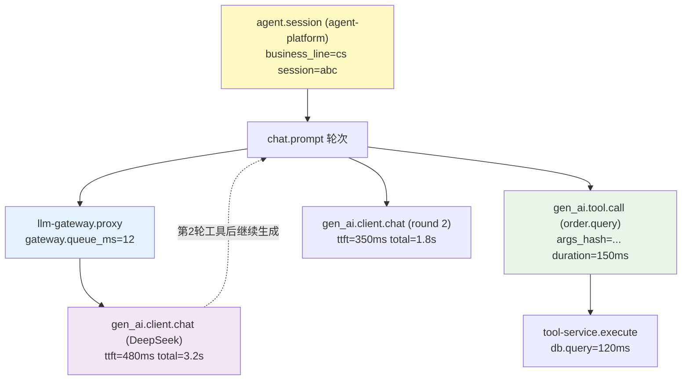

# 项目 05：企业级 Agent 中台 — 05-迭代四：全链路可观测

> **定位**：跨服务 Trace 贯通——一次 Agent 调用从 agent-platform → llm-gateway → LLM → tool-service 的完整 Span 树，gen_ai 语义约定统一指标口径。教程 16/17 在微服务体系中的落地。**观测代码（网关分段计时 / 工具审计观测 / 标签贯通）完整可手写**。
>
> 「遇到阻塞？→ [教程 22-全链路可观测性 全篇]、[教程 23-工具执行可观测与审计 全篇]、[教程 18 §跨服务传播]；Observation 真实 API 以 [附录 05-02 §3] 为准」

---

## 1. 需求与上一版痛点（四问）

| 问 | 答 |
|----|----|
| **新增了什么需求** | 任一会话可一键调出完整调用链；P99 延迟按"LLM/工具/编排"分段可查；工具调用参数与结果（脱敏后）入审计库 |
| **影响了哪些模块** | 不加新服务——各服务接 OTel SDK + OTLP 上报；新增 OTel Collector + Prometheus + Grafana 观测平面（部署物） |
| **架构如何演进** | 观测是横切能力：W3C traceparent 跨服务自动传播 + gen_ai 语义约定统一指标 + 审计流独立落库 |
| **上一版痛点是什么** | 排障人肉拼三个系统时间线；指标口径不一；工具审计分散；"慢"无法定位 |

| v4 痛点 | 本次迭代对策 |
|---------|-------------|
| 排障要人肉拼三个系统的时间线 | 全链路 Trace（traceparent 跨服务传播） |
| 指标口径不一（网关记 model 名、业务记业务线） | 统一标签集 + gen_ai 语义约定 |
| 工具调用审计分散 | Tool Call Span 统一结构 + 审计流独立落库 |
| "慢"无法定位（LLM 慢？工具慢？排队慢？） | Span 分层计时（模型 TTFT / 工具执行 / 网关排队） |

## 2. 目标 Span 树



一次"查询订单并回复"的对话 = 1 个 session span，内含 2 轮模型调用 + 1 次工具调用，跨 3 个服务——链路完整。

## 3. 关键实现

### 3.1 跨服务传播

需在 pom.xml 中添加依赖（各数据面服务）——注意是 **javaagent 挂载方式**（`-javaagent` 参数）而非 starter 依赖方式，避免 SDK 手动配置与自动装配的双重注册冲突（[附录 05-02 §3.2]）：

```xml
<!-- OTel javaagent：作为部署工件（-javaagent:opentelemetry-javaagent.jar），
     不进入运行时 classpath，scope=provided 仅用于随构建分发版本 -->
<dependency>
    <groupId>io.opentelemetry.javaagent</groupId>
    <artifactId>opentelemetry-javaagent</artifactId>
    <version>2.7.0</version>
    <scope>provided</scope>
</dependency>
```

- **HTTP 跳**（agent-platform → llm-gateway）：W3C `traceparent` 头自动传播（javaagent 默认行为）
- **MCP 跳**（agent-platform → tool-service）：MCP Streamable HTTP 本身是 HTTP，traceparent 同样透传——**选择 MCP 的隐性红利**
- **业务语义标签**：`business_line` / `session_id` 通过 Span 属性显式写入（见 §3.4），保证跨服务后标签不丢

各服务部署配置（docker/k8s 环境变量，挂 javaagent + 指向 OTel Collector）：

```yaml
# 所有数据面服务统一注入（以 llm-gateway 为例）
OTEL_SERVICE_NAME: llm-gateway
OTEL_EXPORTER_OTLP_ENDPOINT: http://otel-collector:4317
OTEL_METRICS_EXPORTER: otlp
OTEL_TRACES_EXPORTER: otlp
# 采样策略（ADR-016）：头采样 10% + 错误/慢请求 100% 尾采样保留
OTEL_TRACES_SAMPLER: traceidratio
OTEL_TRACES_SAMPLER_ARG: "0.1"
# JVM 参数
# -javaagent:/opt/otel/opentelemetry-javaagent.jar
```

Spring AI 观测开关（application.yml，键名随版本核对，[附录 05-02 §3.1]）：

```yaml
spring:
  ai:
    chat:
      observations:
        log-prompt: false   # javap 实证：真实键是 log-prompt/log-completion（无 include-prompt-content）——不记录 Prompt 原文（PII 最小化）
        log-completion: false
```

### 3.2 网关侧：分段计时（回答"慢在哪"）

**`obs/GatewayObservation.java`（llm-gateway）**——Spring AI 2.0 / Micrometer 真实 API：

```java
package com.acme.gateway.obs;

import io.micrometer.observation.Observation;
import io.micrometer.observation.ObservationRegistry;

import org.springframework.stereotype.Component;

import reactor.core.publisher.Flux;

/** 网关分段计时：llm.gateway.proxy Span，携带 business_line 标签与排队时长。 */
@Component
public class GatewayObservation {

    private final ObservationRegistry registry;

    public GatewayObservation(ObservationRegistry registry) {
        this.registry = registry;
    }

    /** 包装一次上游转发：观测在转发开始处 start、流结束后 stop。 */
    public <T> Flux<T> proxy(String businessLine, long queuedAt, Flux<T> upstream) {
        Observation obs = Observation.createNotStarted("llm.gateway.proxy", registry)
                .lowCardinalityKeyValue("business_line", businessLine)
                .start();
        return upstream
                .doOnComplete(() -> finish(obs, queuedAt))
                .doOnCancel(() -> finish(obs, queuedAt))
                .doOnError(e -> obs.error(e).stop());
    }

    private void finish(Observation obs, long queuedAt) {
        obs.highCardinalityKeyValue("gateway.queue.ms",
                        String.valueOf((System.nanoTime() - queuedAt) / 1_000_000))
                .stop();
    }
}
```

在 `LlmGatewayHandler` 中接入（在路由解析后、转发前取排队起点）：

```java
// LlmGatewayHandler 中新增字段：
// private final GatewayObservation gatewayObservation;

// 转发前：
long queuedAt = System.nanoTime();
Flux<DataBuffer> upstream = webClient.post()
        .uri(route.endpoint() + "/chat/completions")
        .headers(h -> h.setBearerAuth(route.apiKey()))
        .contentType(MediaType.APPLICATION_JSON)
        .bodyValue(ctx.rewriteBodyFor(route, body))
        .retrieve()
        .bodyToFlux(DataBuffer.class);

Flux<DataBuffer> observed = gatewayObservation.proxy(bizLine, queuedAt,
        usageMeteringInterceptor(upstream, ctx));
return ServerResponse.ok()
        .contentType(MediaType.TEXT_EVENT_STREAM)
        .body(BodyInserters.fromDataBuffers(observed));
```

> 观测命名与标签遵循 gen_ai 语义约定（`gen_ai.operation.name`、`gen_ai.request.model` 等，[教程 16 §gen_ai 语义约定]；TTFT 从 SSE 首帧时间戳计算——`bodyToFlux(DataBuffer)` 的首个 buffer 到达时刻即可近似首帧）。

### 3.3 工具调用审计流

**`obs/ToolAuditObservationHandler.java`（tool-service）**——Micrometer 真实 `ObservationHandler<ToolCallingObservationContext>`：

```java
package com.acme.tool.obs;

import com.acme.tool.audit.AuditSink;

import io.micrometer.observation.Observation;
import io.micrometer.observation.ObservationHandler;
import io.micrometer.tracing.Tracer;   // ⚠ 需引入依赖 io.micrometer:micrometer-tracing（本地未下载，未 javap 实证）
import org.springframework.ai.tool.observation.ToolCallingObservationContext;   // Spring AI 2.0.0 真实类

/** 工具调用观测处理器：参数/结果脱敏后入独立审计库（与业务库分离，ADR-017）。 */
public class ToolAuditObservationHandler implements ObservationHandler<ToolCallingObservationContext> {

    private final AuditSink auditSink;
    private final Tracer tracer;

    public ToolAuditObservationHandler(AuditSink auditSink, Tracer tracer) {
        this.auditSink = auditSink;
        this.tracer = tracer;
    }

    @Override
    public boolean supportsContext(Observation.Context context) {
        return context instanceof ToolCallingObservationContext;
    }

    // Observation.Context 无 getDuration()（javap 实证）；时长需用 ctx.put/get 计时
    private static final Object START_KEY = new Object();

    @Override
    public void onStart(ToolCallingObservationContext ctx) {
        ctx.put(START_KEY, System.nanoTime());   // Observation.Context.put(Object, T)
    }

    @Override
    public void onStop(ToolCallingObservationContext ctx) {
        String toolName = ctx.getToolDefinition().name();
        Long startNanos = ctx.get(START_KEY);
        long durationMs = startNanos != null ? (System.nanoTime() - startNanos) / 1_000_000 : -1;
        // TraceId 真实获取路径：Tracer.currentSpan().context().traceId()（[附录 05-02 §3.1]）
        String traceId = tracer.currentSpan() == null
                ? "n/a"
                : tracer.currentSpan().context().traceId();
        auditSink.emit(toolName, durationMs, traceId);
    }
}
```

**`audit/AuditSink.java` 与 `config/ObservationConfig.java`**：

```java
package com.acme.tool.audit;

/** 审计流：工具调用 100% 有记录，trace_id 可回链。 */
public interface AuditSink {
    void emit(String toolName, long durationMs, String traceId);
}
```

```java
package com.acme.tool.config;

import com.acme.tool.audit.AuditSink;
import com.acme.tool.obs.ToolAuditObservationHandler;

import io.micrometer.observation.ObservationHandler;
import io.micrometer.tracing.Tracer;   // ⚠ 需引入依赖 io.micrometer:micrometer-tracing（本地未下载，未 javap 实证）
import org.springframework.ai.tool.observation.ToolCallingObservationContext;
import org.springframework.context.annotation.Bean;
import org.springframework.context.annotation.Configuration;

@Configuration
public class ObservationConfig {

    /** Spring Boot 自动把 ObservationHandler Bean 组装进 ObservationRegistry。 */
    @Bean
    public ObservationHandler<ToolCallingObservationContext> toolAuditHandler(
            AuditSink auditSink, Tracer tracer) {
        return new ToolAuditObservationHandler(auditSink, tracer);
    }
}
```

**`audit/AsyncAuditSink.java`**（脱敏后入独立审计库的落点示意——生产替换为独立审计存储）：

```java
package com.acme.tool.audit;

import java.util.concurrent.BlockingQueue;
import java.util.concurrent.LinkedBlockingQueue;

import org.springframework.stereotype.Component;

@Component
public class AsyncAuditSink implements AuditSink {

    // 生产环境替换为独立审计库（与业务库分离、保留期 1-5 年、独立访问权限）
    private final BlockingQueue<AuditRecord> queue = new LinkedBlockingQueue<>(10_000);

    @Override
    public void emit(String toolName, long durationMs, String traceId) {
        queue.offer(new AuditRecord(toolName, durationMs, traceId));
    }

    public record AuditRecord(String toolName, long durationMs, String traceId) {}
}
```

审计与 Trace 的分工（[教程 17 §审计 vs 监控]）：Trace 服务于排障（保留 7 天），审计服务于合规（保留按策略 1-5 年），**不同存储、不同保留期、不同访问权限**。

### 3.4 业务语义标签贯通（business_line/session_id 跨服务不丢）

`business_line` 等业务标签由业务侧用 Micrometer Tracing 的 `Tracer` 写入当前 Span 属性：

```java
package com.acme.agent.platform.obs;

import io.micrometer.tracing.Span;   // ⚠ 需引入依赖 io.micrometer:micrometer-tracing（本地未下载，未 javap 实证）
import io.micrometer.tracing.Tracer;   // ⚠ 需引入依赖 io.micrometer:micrometer-tracing（本地未下载，未 javap 实证）

import org.springframework.stereotype.Component;

/** 业务语义标签写入当前 Span（session 根 Span 上打标，随 traceparent 贯通全链路）。 */
@Component
public class BusinessLineTagging {

    private final Tracer tracer;

    public BusinessLineTagging(Tracer tracer) {
        this.tracer = tracer;
    }

    public void tag(String businessLine, String sessionId) {
        Span span = tracer.currentSpan();
        if (span != null) {
            span.tag("business_line", businessLine);
            span.tag("session_id", sessionId);
        }
    }
}
```

在 `DefaultAgentChatService.chat()` 入口调用一次 `tag(cmd.businessLine(), cmd.sessionId())`，该标签随 W3C traceparent 传播到 llm-gateway 与 tool-service 的所有下游 Span。

### 3.5 Grafana 三板斧

1. **服务拓扑图**：基于 Trace 的服务依赖图（agent-platform → gateway/tool → 供应商）
2. **延迟瀑布模板**：任选 session_id → 面板渲染该会话全部 Span 的瀑布图（排障入口）
3. **成本看板**：`gen_ai.client.token.usage` 按业务线/模型的日聚合（与 v2 网关计量互为印证）

## 4. 验收标准

| # | 验收项 | 标准 |
|---|--------|------|
| 1 | 链路完整 | 随机抽 100 个含工具调用的会话，≥99 条可拉出跨 3 服务的完整 Span 树 |
| 2 | 标签贯通 | business_line 标签在所有服务的 Span/Metric 上不丢失 |
| 3 | 延迟分段 | P99 延迟可按 queue/model-ttft/model-total/tool 拆分查询 |
| 4 | 审计落库 | 工具调用 100% 有审计记录（脱敏字段合规）且 trace_id 可回链 |
| 5 | 排障时效 | "该会话为什么慢"从 30 分钟人肉拼图 → 1 分钟瀑布图 |
| 6 | 观测开销 | 开启全量 Trace 后服务吞吐下降 < 5%（采样策略按 [教程 16 §采样]） |

### 验证包（手工测试与验证）

**前置条件**：上一迭代已验收通过；本迭代全部组件部署完成；测试租户/业务线账号就绪。

**材料 A——探针请求集**（按验收项逐条构造）：

```bash
# 通用请求模板（按验收场景替换 path/body）
curl -X POST http://localhost:8080/api/{本迭代接口} \
  -H "Authorization: Bearer $TEST_TOKEN" -H "Content-Type: application/json" \
  -d '{按验收项构造的请求体}'
```

**材料 B——压测器**（hey/wrk，用于并发/配额类验收项）：`hey -c 500 -n 5000 -H "Authorization: Bearer $T" http://...`
**材料 C——故障注入开关**（kill 组件/断网，用于高可用/降级类验收项）。

**步骤与断言**：

| # | 操作（对照材料 A/B/C 构造场景） | 预期（PASS 判据） |
|---|------|------------------|
| 1 | 按验收项「链路完整」构造场景执行 | 随机抽 100 个含工具调用的会话，≥99 条可拉出跨 3 服务的完整 Span 树 |
| 2 | 按验收项「标签贯通」构造场景执行 | business_line 标签在所有服务的 Span/Metric 上不丢失 |
| 3 | 按验收项「延迟分段」构造场景执行 | P99 延迟可按 queue/model-ttft/model-total/tool 拆分查询 |
| 4 | 按验收项「审计落库」构造场景执行 | 工具调用 100% 有审计记录（脱敏字段合规）且 trace_id 可回链 |
| 5 | 按验收项「排障时效」构造场景执行 | "该会话为什么慢"从 30 分钟人肉拼图 → 1 分钟瀑布图 |
| 6 | 按验收项「观测开销」构造场景执行 | 开启全量 Trace 后服务吞吐下降 < 5%（采样策略按 [教程 16 §采样]） |

**失败排查**：断言不符时先分层定位——网关入口日志（请求到没到）→ 对应服务日志（业务内失败）→ 控制面/策略是否生效（配置版本与 ACK）；隔离/配额类失败优先怀疑测试前置（租户/凭证是否真的构造对），再怀疑实现。

## 5. 本迭代的 ADR

| # | 决策 | 理由 |
|---|------|------|
| ADR-015 | javaagent 挂载而非 SDK starter + 手写 SdkTracerProvider | 避免双重注册；业务代码零侵入（审计切面除外） |
| ADR-016 | Trace 采样：头采样 10% + 错误/慢请求 100% 尾采样保留 | 全量成本不可接受；排障最需要的是异常链路 |
| ADR-017 | 审计存 sha256 哈希 + 脱敏原文双轨 | 哈希供防篡改比对，脱敏原文供人工审查；原文保留期短于哈希 |

## 6. v5 的痛点（驱动下一迭代）

链路通了，财务提出了新问题：**"审计报告里的业务线是自己声明的吗？"**——business_line 来自调用方自报（短期凭证签发时绑定），但工具执行、会话存储的资源消耗没有硬隔离；数据线的重查询高峰仍会挤占共享存储的 IO。**隔离需要从"标签"升级为"边界"**。→ [06-业务线隔离与资源治理.md](06-业务线隔离与资源治理.md)
