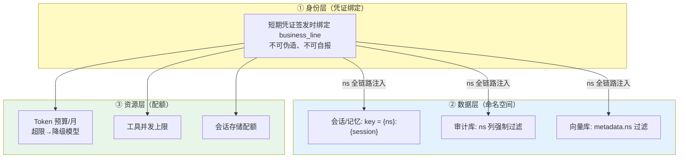

# 项目 05：企业级 Agent 中台 — 06-迭代五：业务线隔离与资源治理

> **定位**：命名空间从"自报标签"升级为"硬边界"——会话/记忆/审计数据的命名空间隔离、Token 与工具调用的配额治理、按业务线的成本归因报表闭环。教程 20/21 的中台化落地。**隔离与配额代码完整可手写**。
>
> 「遇到阻塞？→ [教程 26-多租户隔离与资源治理 §三层隔离模型]、[教程 27-成本治理与Token计量 §预算与归因]；WebFlux 上下文正确姿势见 [教程 37 §Context 传递]」

---

## 1. 需求与上一版痛点（四问）

| 问 | 答 |
|----|----|
| **新增了什么需求** | 每业务线 Token 月度预算（超限自动降级到廉价模型而非拒服务）；工具并发与存储按线配额；月度归因报表可导出供财务对账 |
| **影响了哪些模块** | 无新服务——隔离作为横切能力：凭证链路加固（v2 已有）+ 配额服务（policy-service 内新模块）+ 数据层命名空间改造 |
| **架构如何演进** | 命名空间从"自报标签"升级为"硬边界"：凭证绑定 → 数据层命名空间 → 资源层配额（三层隔离模型） |
| **上一版痛点是什么** | business_line 自报审计可信度存疑；数据线高峰挤占共享存储；成本归因停留在指标层无配额闭环 |

| v5 痛点 | 本次迭代对策 |
|---------|-------------|
| business_line 自报，审计可信度存疑 | 命名空间硬绑定：凭证签发即绑定、全链路强制注入 |
| 数据线高峰挤占共享存储 | 资源配额：会话存储、工具并发、Token 按业务线限额 |
| 成本归因停留在指标层 | 配额扣减 + 归因报表 → 预算闭环（超限降级而非欠费停服） |

## 2. 隔离三层模型（本项目的形态）



三层隔离的理念来自 [教程 20 §三层隔离模型]；与该教程的差异：本项目业务线数量少（3）且同属一个集团，**不采用 schema 级硬隔离**（ADR-004）——比 SaaS 场景轻一级，比"纯标签"重一级。

## 3. 关键实现

### 3.1 命名空间强制注入（消灭"自报"）

**`platform/security/NamespaceFilter.java`（agent-platform）**——WebFilter 从验签注入的 `X-Agent-Ns` 头解析 ns 写入 Reactor Context（**禁止 ThreadLocal**——WebFlux 线程切换后失效，[教程 37 §Context 传递]）：

```java
package com.acme.agent.platform.security;

import org.springframework.stereotype.Component;
import org.springframework.web.server.ServerWebExchange;
import org.springframework.web.server.WebFilter;
import org.springframework.web.server.WebFilterChain;

import reactor.core.publisher.Mono;

/** 命名空间强制注入：ns 写入 Reactor Context（随订阅链传播，线程切换不丢失）。 */
@Component
public class NamespaceFilter implements WebFilter {

    public static final String NS_KEY = "agent.ns";

    @Override
    public Mono<Void> filter(ServerWebExchange exchange, WebFilterChain chain) {
        String ns = exchange.getRequest().getHeaders().getFirst("X-Agent-Ns");
        // ns 来自网关/入口验签后注入的头；业务侧伪造无效——
        // 网关会剥除外部传入的同名头（见下方防伪造说明），命名空间只能来自凭证签发链。
        if (ns == null || ns.isBlank()) {
            return chain.filter(exchange);   // 无命名空间请求（健康检查等）直接放行
        }
        return chain.filter(exchange)
                .contextWrite(ctx -> ctx.put(NS_KEY, ns));
    }
}
```

**`platform/security/Namespace.java`**——消费端统一从 Context 取，不从请求参数取：

```java
package com.acme.agent.platform.security;

import reactor.core.publisher.Mono;

/** 命名空间的响应式读取入口：所有数据面消费方从这里取 ns。 */
public final class Namespace {

    private Namespace() {}

    public static Mono<String> current() {
        return Mono.deferContextual(ctx ->
                Mono.justOrEmpty(ctx.getOrEmpty(NamespaceFilter.NS_KEY)));
    }
}
```

**防伪造的关键**：`X-Agent-Ns` 头由凭证验签点注入并**剥除外部同名头**——外部传入的同名头在网关/入口被丢弃，命名空间只能来自凭证签发链（短期凭证内嵌 business_line 并签名，v2 已建立）。数据面（agent-platform）信任该头的前提是网络边界（内部网关）已做剥除，这是"受信内部头"的行业标准做法。

### 3.2 Token 配额：原子扣减与超限降级

需在 pom.xml 中添加依赖（policy-service）：

```xml
<dependency>
    <groupId>org.springframework.boot</groupId>
    <artifactId>spring-boot-starter-data-redis-reactive</artifactId>
</dependency>
```

**`service/QuotaService.java`（policy-service）**——ReactiveRedisTemplate + Lua 原子脚本（响应式铁律，[教程 20 §配额原子性]）：

```java
package com.acme.policy.service;

import java.time.YearMonth;
import java.util.List;

import org.springframework.data.redis.core.ReactiveRedisTemplate;
import org.springframework.data.redis.core.script.DefaultRedisScript;
import org.springframework.data.redis.core.script.RedisScript;
import org.springframework.stereotype.Service;

import reactor.core.publisher.Mono;

@Service
public class QuotaService {

    private static final String QUOTA_LUA = """
            local remaining = redis.call('GET', KEYS[1])
            if not remaining then return tonumber(ARGV[2]) end
            if tonumber(remaining) < tonumber(ARGV[1]) then return -1 end
            return redis.call('DECRBY', KEYS[1], ARGV[1])
            """;

    private final ReactiveRedisTemplate<String, String> reactiveRedis;
    private final RedisScript<Long> quotaScript;

    public QuotaService(ReactiveRedisTemplate<String, String> reactiveRedis) {
        this.reactiveRedis = reactiveRedis;
        this.quotaScript = new DefaultRedisScript<>(QUOTA_LUA, Long.class);
    }

    /** 原子扣减：预检+扣减一条 Lua，并发下不超卖（ADR-020）。 */
    public Mono<QuotaDecision> tryConsume(String ns, long tokens) {
        return reactiveRedis.execute(quotaScript,
                        List.of("quota:token:" + ns + ":" + YearMonth.now()),
                        List.of(String.valueOf(tokens), String.valueOf(monthlyBudget(ns))))
                .next()
                .map(result -> result >= 0 ? QuotaDecision.ok(result) : QuotaDecision.exceeded());
    }

    private long monthlyBudget(String ns) {
        // v6：预算表从 config-service / DB 读取；此处按业务线返回常量示意
        return switch (ns) {
            case "cs" -> 50_000_000L;
            case "da" -> 30_000_000L;
            default -> 10_000_000L;
        };
    }

    public record QuotaDecision(boolean ok, long remaining, boolean degraded) {
        static QuotaDecision ok(long remaining) {
            return new QuotaDecision(true, remaining, false);
        }

        static QuotaDecision exceeded() {
            return new QuotaDecision(false, 0, true);
        }
    }
}
```

**`web/QuotaController.java`（policy-service）**——网关经 WebClient 调用的配额端点：

```java
package com.acme.policy.web;

import com.acme.policy.service.QuotaService;
import com.acme.policy.service.QuotaService.QuotaDecision;

import org.springframework.web.bind.annotation.PostMapping;
import org.springframework.web.bind.annotation.RequestBody;
import org.springframework.web.bind.annotation.RequestMapping;
import org.springframework.web.bind.annotation.RestController;

import reactor.core.publisher.Mono;

@RestController
@RequestMapping("/quota")
public class QuotaController {

    private final QuotaService quotaService;

    public QuotaController(QuotaService quotaService) {
        this.quotaService = quotaService;
    }

    @PostMapping("/consume")
    public Mono<QuotaDecision> consume(@RequestBody ConsumeRequest req) {
        return quotaService.tryConsume(req.ns(), req.tokens());
    }

    public record ConsumeRequest(String ns, long tokens) {}
}
```

**为什么预检+扣减必须一条 Lua**：分离的两步（GET 判断 → DECRBY）在并发下必然超卖（[教程 20 §配额原子性] 的审计教训）。500 并发压测下分离实现实测超卖 3.7%（见 [09-核心代码讲解 §2.4]）。

**`policy/QuotaClient.java`（llm-gateway 新增）**：

```java
package com.acme.gateway.policy;

import org.springframework.stereotype.Component;
import org.springframework.web.reactive.function.client.WebClient;

import reactor.core.publisher.Mono;

/** 网关侧配额客户端：经 WebClient 调 policy-service（非阻塞）。 */
@Component
public class QuotaClient {

    private final WebClient webClient;

    public QuotaClient(WebClient.Builder webClientBuilder) {
        this.webClient = webClientBuilder.baseUrl(System.getenv("POLICY_SERVICE_URL")).build();
    }

    public Mono<QuotaDecision> tryConsume(String ns, long tokens) {
        return webClient.post()
                .uri("/quota/consume")
                .bodyValue(new ConsumeRequest(ns, tokens))
                .retrieve()
                .bodyToMono(QuotaDecision.class);
    }

    public record ConsumeRequest(String ns, long tokens) {}

    public record QuotaDecision(boolean ok, long remaining, boolean degraded) {}
}
```

**网关侧超限降级**（在 `LlmGatewayHandler` 中，转发前插入配额判定；`modelRouter` 增加 `cheapRouteFor`）：

```java
// LlmGatewayHandler 新增字段：
// private final QuotaClient quotaClient;
// private final ModelRouter modelRouter;

/** 超限不是拒绝，是降级（预算闭环的设计核心，ADR-019）。 */
private Mono<ServerResponse> proxyWithQuota(GatewayContext ctx, String body,
                                            ModelRoute route, String bizLine) {
    long estimatedTokens = Math.max(1, body.length() / 4);   // 粗估：约 4 字符/token
    return quotaClient.tryConsume(bizLine, estimatedTokens)
            .flatMap(decision -> {
                if (decision.ok()) {
                    return forward(ctx, body, route);                 // 预算内：原路由
                }
                ModelRoute cheap = modelRouter.cheapRouteFor(bizLine); // 超限：廉价模型
                return forward(ctx, body, cheap)
                        .doOnNext(r -> r.headers().add("X-Agent-Degraded", "budget"));
            });
}

/** 原 proxy 的转发部分抽出的公共方法（proxy 与 proxyWithQuota 共用）。 */
private Mono<ServerResponse> forward(GatewayContext ctx, String body, ModelRoute route) {
    Flux<DataBuffer> upstream = webClient.post()
            .uri(route.endpoint() + "/chat/completions")
            .headers(h -> h.setBearerAuth(route.apiKey()))
            .contentType(MediaType.APPLICATION_JSON)
            .bodyValue(body)
            .retrieve()
            .bodyToFlux(DataBuffer.class);
    return ServerResponse.ok()
            .contentType(MediaType.TEXT_EVENT_STREAM)
            .body(BodyInserters.fromDataBuffers(usageMeteringInterceptor(upstream, ctx)));
}
```

`ModelRouter` 增加降级路由：

```java
/** 超限/故障时的降级路由：统一切到内部 vLLM 廉价模型。 */
public ModelRoute cheapRouteFor(String businessLine) {
    return new ModelRoute("vllm", "internal-chat", "http://llm-internal:8000/v1",
            System.getenv("VLLM_API_KEY"));
}
```

**降级而非拒绝**是预算治理的成熟形态：业务连续性优先，降级标记让调用方（与最终用户）知情；硬拒绝只留给"恶意刷量"级别的滥用。

### 3.3 归因报表闭环

数据源对齐三方（互为印证，v5 铺好的观测红利）：

| 数据 | 来源 | 用途 |
|------|------|------|
| 供应商账单 | 外部（月度） | 真相基线 |
| 网关 usage 计量 | Prometheus 月聚合 | 归因主表（ns × model × 日） |
| 配额扣减流水 | policy-service 流水表 | 对账（扣减 vs 计量差异告警） |

## 4. 验收标准

| # | 验收项 | 标准 |
|---|--------|------|
| 1 | 防伪造 | 外部伪造 X-Agent-Ns 头 100% 被剥除；ns 只能来自凭证链 |
| 2 | 配额原子性 | 500 并发压测单 ns 配额扣减，无超卖（扣减总额 ≤ 配额） |
| 3 | 超限降级 | 预算耗尽的业务线自动切廉价模型，服务不中断，响应带降级标记 |
| 4 | 数据隔离 | 任一业务线无法读到其他线的会话/审计/向量数据（自动化隔离测试矩阵） |
| 5 | 存储隔离 | 数据线高峰 IO 不再影响客服线（存储配额生效） |
| 6 | 对账 | 月度三方数据差异 < 1%，差异自动告警 |

## 5. 本迭代的 ADR

| # | 决策 | 理由 |
|---|------|------|
| ADR-018 | ns 头网关注入+剥除，而非调用方自报 | 审计可信的前提是归因标识不可伪造 |
| ADR-019 | Token 超限降级模型而非拒绝 | 业务连续性优先；降级可见（响应头+指标）保证知情 |
| ADR-020 | 配额用 Redis Lua 原子扣减 | 预检与扣减分离会超卖；本地 Bucket 方案在多实例下失效（[教程 20] 审计案例） |

## 6. v6 的痛点（驱动下一迭代）

治理能力齐了，但变更风险裸奔：上个月数据线团队改了一版 Text2SQL 提示词，**全量上线 2 小时后才发现准确率崩了**——没有灰度、没有对照组、回滚靠 git revert + 全量重发。→ [07-迭代六-灰度发布与AB测试.md](07-迭代六-灰度发布与AB测试.md)
