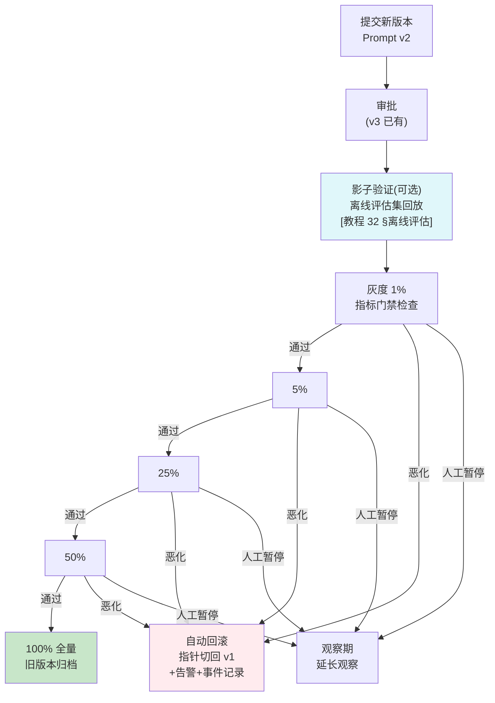

# 项目 05：企业级 Agent 中台 — 07-迭代六：灰度发布与 A/B 测试

> **定位**：Prompt/模型/工具的变更从"全量即时"升级为"分批灰度 + A/B 对照 + 指标门禁 + 一键回滚"。控制面（v3）+ 观测（v5）+ 评估闭环三能力的汇合点。**分桶 / 数据面取版本 / 自动熔断代码完整可手写**。
>
> 「遇到阻塞？→ [教程 23-灰度发布与版本管理 全篇]、[教程 32-自我反思与Agent评估 §在线评估]、[教程 36-数据飞轮与持续改进 §闭环]」

---

## 1. 需求与上一版痛点（四问）

| 问 | 答 |
|----|----|
| **新增了什么需求** | Prompt/模型路由变更支持 1%→5%→25%→50%→100% 分批；A/B 实验带统计显著性判定；灰度期间指标恶化自动回滚；实验结果沉淀为决策记录 |
| **影响了哪些模块** | prompt-service 增加实验管理；agent-platform 增加分桶执行（同一次调用按桶走不同版本）；观测平面增加实验指标看板 |
| **架构如何演进** | 灰度是平台能力：共用一套分桶/门禁/回滚机制，Prompt/模型/工具三类变更全部接入 |
| **上一版痛点是什么** | Prompt 变更全量即时准确率崩了才发现；无对照无数据；回滚靠 git revert + 全量重发 |

| v6 痛点 | 本次迭代对策 |
|---------|-------------|
| Prompt 变更全量即时，准确率崩了才发现 | Prompt 灰度：按流量百分比分批 |
| 无法对比新旧版本效果 | A/B 实验：确定性分桶 + 对照指标 |
| 回滚靠重发 | 控制面指针回滚（v3 已有）+ 灰度自动熔断 |
| "感觉变好了"无数据支撑 | 指标门禁：评估指标不达标自动停止放量 |

## 2. 灰度发布流水线



**指标门禁**（进下一批的及格线）：
- 质量类：人工抽检满意率、结构化输出解析成功率、工具调用成功率
- 稳定类：错误率、P99 延迟不劣化超过 5%
- 成本类：单会话平均 Token 不超预算线（新 Prompt 更啰嗦是常见退化）

## 3. 关键实现

### 3.1 确定性分桶

**`platform/experiment/ExperimentBucketer.java`（agent-platform）**——同一用户永远进同一桶，保证对照纯净：

```java
package com.acme.agent.platform.experiment;

import java.nio.charset.StandardCharsets;
import java.security.MessageDigest;
import java.security.NoSuchAlgorithmException;

import org.springframework.stereotype.Component;

/** 确定性分桶：sha256 + floorMod（ADR-021）。避免 abs(hashCode)%100 的 MIN_VALUE 溢出与分布偏差。 */
@Component
public class ExperimentBucketer {

    public String bucket(String experimentId, String userId) {
        // experimentId 入盐：同一 userId 在不同实验里独立分桶
        byte[] digest = sha256(experimentId + ":" + userId);
        int v = ((digest[0] & 0xFF) << 24) | ((digest[1] & 0xFF) << 16)
              | ((digest[2] & 0xFF) << 8) | (digest[3] & 0xFF);
        return String.valueOf(Math.floorMod(v, 100));   // "00" - "99"
    }

    private byte[] sha256(String input) {
        try {
            return MessageDigest.getInstance("SHA-256")
                    .digest(input.getBytes(StandardCharsets.UTF_8));
        } catch (NoSuchAlgorithmException e) {
            throw new IllegalStateException(e);
        }
    }
}
```

> 桶 0-4 进 5% 灰度组、其余进对照组——控制面只下发"桶区间→版本"映射，数据面无感。

「遇到阻塞？→ [教程 23 §确定性分桶]——注意避开 `Math.abs(hashCode) % 100` 的两个坑（MIN_VALUE 溢出、分布不均）」

### 3.2 数据面：按桶取版本

**`platform/chat/internal/PromptResolver.java` 升级**（v3 基础上加实验维度；完整类）：

```java
package com.acme.agent.platform.chat.internal;

import java.io.IOException;
import java.io.InputStream;
import java.nio.charset.StandardCharsets;
import java.util.List;
import java.util.Map;
import java.util.concurrent.ConcurrentHashMap;
import java.util.concurrent.atomic.AtomicReference;

import com.acme.agent.platform.experiment.ExperimentBucketer;

import io.micrometer.tracing.Span;
import io.micrometer.tracing.Tracer;
import org.slf4j.Logger;
import org.slf4j.LoggerFactory;
import org.springframework.scheduling.annotation.Scheduled;
import org.springframework.stereotype.Component;
import org.springframework.web.reactive.function.client.WebClient;

import reactor.core.publisher.Mono;

/** Prompt 解析：控制面拉取 + 实验分桶 + 本地缓存 + 出厂文件兜底（四层）。 */
@Component
public class PromptResolver {

    private static final Logger log = LoggerFactory.getLogger(PromptResolver.class);

    private final WebClient webClient;
    private final ExperimentBucketer bucketer;
    private final Tracer tracer;
    private final AtomicReference<Map<String, PromptDefinition>> cache = new AtomicReference<>(Map.of());

    public PromptResolver(WebClient.Builder webClientBuilder,
                          ExperimentBucketer bucketer, Tracer tracer) {
        this.webClient = webClientBuilder.baseUrl(System.getenv("PROMPT_SERVICE_URL")).build();
        this.bucketer = bucketer;
        this.tracer = tracer;
    }

    @Scheduled(fixedDelay = 30_000)
    void refresh() {
        webClient.get()
                .uri("/prompts/published")
                .retrieve()
                .bodyToFlux(PublishedPrompt.class)
                .collectList()
                .doOnNext(this::merge)
                .subscribe(
                        unused -> log.info("Prompt 全量同步完成"),
                        err -> log.warn("Prompt 拉取失败，使用本地缓存/出厂文件: {}", err.getMessage()));
    }

    private void merge(List<PublishedPrompt> fresh) {
        Map<String, PromptDefinition> merged = new ConcurrentHashMap<>(cache.get());
        for (PublishedPrompt p : fresh) {
            String key = p.businessLine() + "/" + p.name();
            PromptDefinition old = merged.get(key);
            if (old == null || old.currentVersionNo() < p.versionNo()) {
                merged.put(key, PromptDefinition.from(p));
            }
        }
        cache.set(Map.copyOf(merged));
    }

    /** 按业务线 + Prompt 名解析；若该 Prompt 有活跃实验则按桶取版本。 */
    public String resolve(String ns, String name, String userId) {
        PromptDefinition def = cache.get().get(ns + "/" + name);
        if (def == null) {
            return fallbackFromLocalFile(ns, name);
        }
        if (def.experiment() != null) {
            String bucket = bucketer.bucket(def.experiment().id(), userId);
            String assigned = def.experiment().versionFor(bucket);
            if (assigned != null) {
                // 实验标签进 Span/Metric——A/B 效果分析依赖观测数据的实验维度（v5 红利）
                Span span = tracer.currentSpan();
                if (span != null) {
                    span.tag("experiment", def.experiment().id() + ":" + bucket);
                }
                return assigned;
            }
        }
        return def.currentContent();
    }

    private String fallbackFromLocalFile(String businessLine, String name) {
        try (InputStream in = getClass().getResourceAsStream(
                "/prompts/" + businessLine + "/" + name + ".txt")) {
            if (in == null) {
                throw new IllegalStateException("Prompt 无任何可用来源: " + businessLine + "/" + name);
            }
            return new String(in.readAllBytes(), StandardCharsets.UTF_8);
        } catch (IOException e) {
            throw new IllegalStateException("出厂 Prompt 读取失败: " + businessLine + "/" + name, e);
        }
    }

    /** 本地缓存条目：当前发布版本 + 可选活跃实验。 */
    public record PromptDefinition(String currentContent, int currentVersionNo,
                                   Experiment experiment) {

        static PromptDefinition from(PublishedPrompt p) {
            return new PromptDefinition(p.content(), p.versionNo(), p.experiment());
        }

        public record Experiment(String id, List<BucketRule> rules) {

            /** 桶区间 → 版本内容（"0-4"→新版本、"5-99"→对照组）。 */
            public String versionFor(String bucket) {
                for (BucketRule rule : rules) {
                    if (rule.contains(bucket)) {
                        return rule.versionContent();
                    }
                }
                return null;
            }

            public record BucketRule(int from, int to, String versionContent) {
                public boolean contains(String bucket) {
                    int b = Integer.parseInt(bucket);
                    return b >= from && b <= to;
                }
            }
        }
    }

    /** 控制面 Pull 通道的传输对象（含实验配置）。 */
    public record PublishedPrompt(String id, String businessLine, String name,
                                  String content, int versionNo,
                                  PromptDefinition.Experiment experiment) {}
}
```

**实验标签进 Span/Metric**——A/B 效果分析完全依赖观测数据的实验维度标签（v5 的又一次红利兑现）。

### 3.3 模型路由灰度

policy-service 的路由策略支持实验：`cs 线 25% 流量切到 deepseek-v3.5 试运行`。数据面网关按同一分桶协议执行。**与 Prompt 灰度共用一套分桶/门禁/回滚机制**——灰度是平台能力，不是各配置类型的私有能力（ADR-023）。

### 3.4 自动熔断（watchdog）

**`experiment/ExperimentWatchdog.java`（policy-service）**——每分钟评估一次门禁指标：

```java
package com.acme.policy.experiment;

import java.util.List;
import java.util.Map;
import java.util.concurrent.CopyOnWriteArrayList;

import org.slf4j.Logger;
import org.slf4j.LoggerFactory;
import org.springframework.scheduling.annotation.Scheduled;
import org.springframework.stereotype.Component;

/** 实验门禁 watchdog：每分钟评估活跃实验，指标恶化自动回滚（ADR-022）。 */
@Component
public class ExperimentWatchdog {

    private static final Logger log = LoggerFactory.getLogger(ExperimentWatchdog.class);

    private final List<Experiment> activeExperiments = new CopyOnWriteArrayList<>();
    private final GateEvaluator gate;
    private final RollbackService rollbackService;
    private final Alerting alerting;

    public ExperimentWatchdog(GateEvaluator gate, RollbackService rollbackService,
                              Alerting alerting) {
        this.gate = gate;
        this.rollbackService = rollbackService;
        this.alerting = alerting;
    }

    @Scheduled(fixedDelay = 60_000)
    void checkExperiments() {
        for (Experiment exp : activeExperiments) {
            // 小流量（<5%）样本不足不做自动判定，只人工观察（ADR-022）
            if (exp.allocatedPercent() < 5) {
                continue;
            }
            Map<String, Double> metrics = gate.queryMetrics(exp);
            GateResult r = gate.evaluate(exp, metrics);
            if (r.failed()) {
                rollbackService.rollbackToBaseline(exp);   // 指针切回，秒级生效（v3 能力）
                alerting.warn("实验 %s 触发自动回滚: %s".formatted(exp.id(), r.reason()));
                exp.recordAutoRollback(r.reason());        // 决策留痕
            }
        }
    }

    public void activate(Experiment exp) {
        activeExperiments.add(exp);
    }

    public static class Experiment {
        private final String id;
        private final int allocatedPercent;    // 当前放量百分比（1/5/25/50/100）
        private volatile String rollbackReason;

        public Experiment(String id, int allocatedPercent) {
            this.id = id;
            this.allocatedPercent = allocatedPercent;
        }

        public String id() { return id; }
        public int allocatedPercent() { return allocatedPercent; }
        public String rollbackReason() { return rollbackReason; }
        public void recordAutoRollback(String reason) { this.rollbackReason = reason; }
    }

    public record GateResult(boolean failed, String reason) {}
}
```

**`experiment/GateEvaluator.java`**（门禁指标评估接口——生产实现查询 Prometheus 实验看板）：

```java
package com.acme.policy.experiment;

import java.util.Map;

import com.acme.policy.experiment.ExperimentWatchdog.Experiment;
import com.acme.policy.experiment.ExperimentWatchdog.GateResult;

/** 指标门禁：质量/稳定/成本三类指标，任一不达标即失败（应回滚）。 */
public interface GateEvaluator {

    Map<String, Double> queryMetrics(Experiment exp);

    GateResult evaluate(Experiment exp, Map<String, Double> metrics);
}
```

**`experiment/PrometheusGateEvaluator.java`**（示意实现——真实场景查 Prometheus / 评估服务，此处用最近指标容器）：

```java
package com.acme.policy.experiment;

import java.util.Map;
import java.util.concurrent.ConcurrentHashMap;

import com.acme.policy.experiment.ExperimentWatchdog.Experiment;
import com.acme.policy.experiment.ExperimentWatchdog.GateResult;
import org.springframework.stereotype.Component;

@Component
public class PrometheusGateEvaluator implements GateEvaluator {

    // 生产实现：PromQL 查询实验组/对照组的错误率、P99、单会话 Token 等
    private final Map<String, Map<String, Double>> latest = new ConcurrentHashMap<>();

    @Override
    public Map<String, Double> queryMetrics(Experiment exp) {
        return latest.getOrDefault(exp.id(), Map.of());
    }

    @Override
    public GateResult evaluate(Experiment exp, Map<String, Double> metrics) {
        double errorRate = metrics.getOrDefault("error_rate", 0.0);
        double baselineErrorRate = metrics.getOrDefault("baseline_error_rate", 0.0);
        // 门禁规则示例：错误率劣化 3 倍 → 失败
        if (errorRate > baselineErrorRate * 3 && baselineErrorRate > 0) {
            return new GateResult(true, "错误率 %s → %s（3 倍劣化）".formatted(
                    baselineErrorRate, errorRate));
        }
        return new GateResult(false, "");
    }

    public void ingest(String experimentId, Map<String, Double> metrics) {
        latest.put(experimentId, metrics);
    }
}
```

**`experiment/RollbackService.java`**（回滚客户端——调用 prompt-service 的 rollback 端点）：

```java
package com.acme.policy.experiment;

import com.acme.policy.experiment.ExperimentWatchdog.Experiment;

import org.springframework.stereotype.Component;
import org.springframework.web.reactive.function.client.WebClient;

/** 回滚客户端：调用 prompt-service 的 rollback 端点（秒级指针回切，v3 能力）。 */
@Component
public class RollbackService {

    private final WebClient webClient;

    public RollbackService(WebClient.Builder webClientBuilder) {
        this.webClient = webClientBuilder.baseUrl(System.getenv("PROMPT_SERVICE_URL")).build();
    }

    public void rollbackToBaseline(Experiment exp) {
        webClient.post()
                .uri(uriBuilder -> uriBuilder.path("/prompts/experiments/{id}/rollback")
                        .build(exp.id()))
                .bodyValue(new ActorRequest("watchdog"))
                .retrieve()
                .toBodilessEntity()
                .subscribe();   // 异步触发，不阻塞 watchdog 调度线程
    }

    public record ActorRequest(String actor) {}
}
```

**`experiment/Alerting.java`**（告警——对接集团告警平台的最小抽象）：

```java
package com.acme.policy.experiment;

import org.slf4j.Logger;
import org.slf4j.LoggerFactory;
import org.springframework.stereotype.Component;

@Component
public class Alerting {

    private static final Logger log = LoggerFactory.getLogger(Alerting.class);

    public void warn(String message) {
        // 生产实现：调企业微信/钉钉/邮件网关
        log.warn("[告警] {}", message);
    }
}
```

**统计显著性**：小流量阶段（1%）不做自动判定（样本不足），只人工观察；≥5% 且样本量过门槛后才启用自动门禁——避免噪声导致的误回滚（[教程 32 §评估统计学陷阱]，ADR-022）。

## 4. 验收标准

| # | 验收项 | 标准 |
|---|--------|------|
| 1 | 分批放量 | 1→5→25→50→100 全流程可执行，每批有门禁记录 |
| 2 | 分桶稳定 | 同一 userId 在实验期内 100% 进同一组 |
| 3 | 对照纯净 | 实验组/对照组除目标变量外无其他差异（实验配置审计） |
| 4 | 自动回滚 | 注入"错误率 3 倍劣化"场景，1 个窗口内自动回滚并告警 |
| 5 | 显著性 | 实验报告含样本量、置信区间、显著性 p 值 |
| 6 | 决策留痕 | 每个实验从创建到终局（全量/回滚/放弃）全程可追溯 |

## 5. 本迭代的 ADR

| # | 决策 | 理由 |
|---|------|------|
| ADR-021 | 分桶用 sha256 + floorMod，不用 abs(hashCode)%100 | 溢出 bug 与分布偏差；experimentId 入盐保证实验间独立 |
| ADR-022 | 小流量（<5%）不做自动门禁 | 样本不足时噪声触发误回滚的代价高于晚发现 |
| ADR-023 | Prompt/模型/工具灰度共用一套实验平台 | 灰度是平台能力；N 套灰度 = N 倍故障面 |
| ADR-024 | K8s 侧（Argo Rollouts）与应用内灰度分层：基础设施灰度管发布、应用内灰度管配置 | 配置变更不该走发布流水线（分钟级 vs 秒级回滚） |

## 6. v7 的痛点（驱动最终迭代）

体系已成型，最后一块短板是**韧性**：上季度 LLM 供应商一次 40 分钟故障，中台整体不可用——网关的路由表没有自动故障切换（v2 只做了配置切换）；控制面 MySQL 主从切换时 config-service 抖动波及数据面心跳告警风暴；从未做过容灾演练。→ [08-迭代七-高可用与容灾.md](08-迭代七-高可用与容灾.md)
