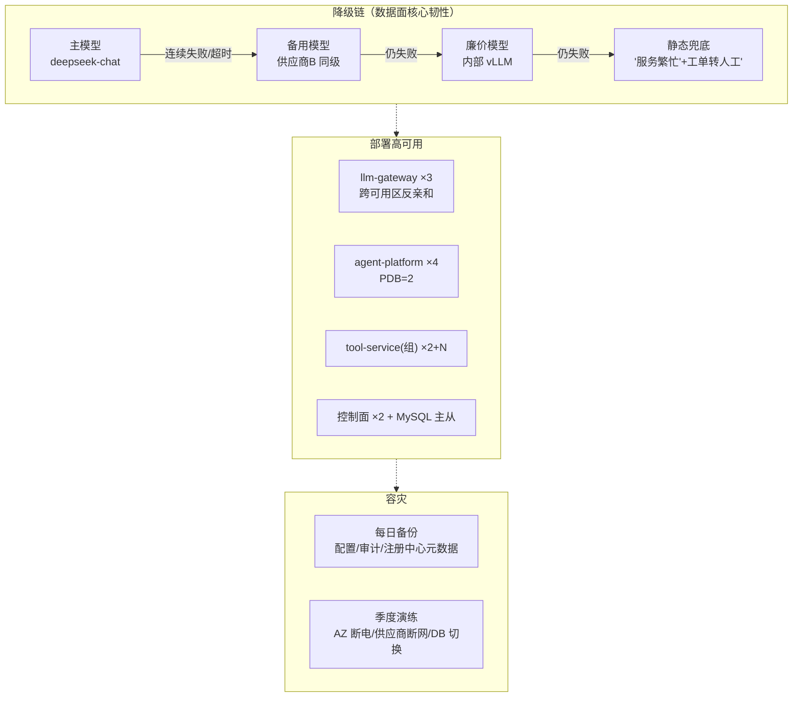
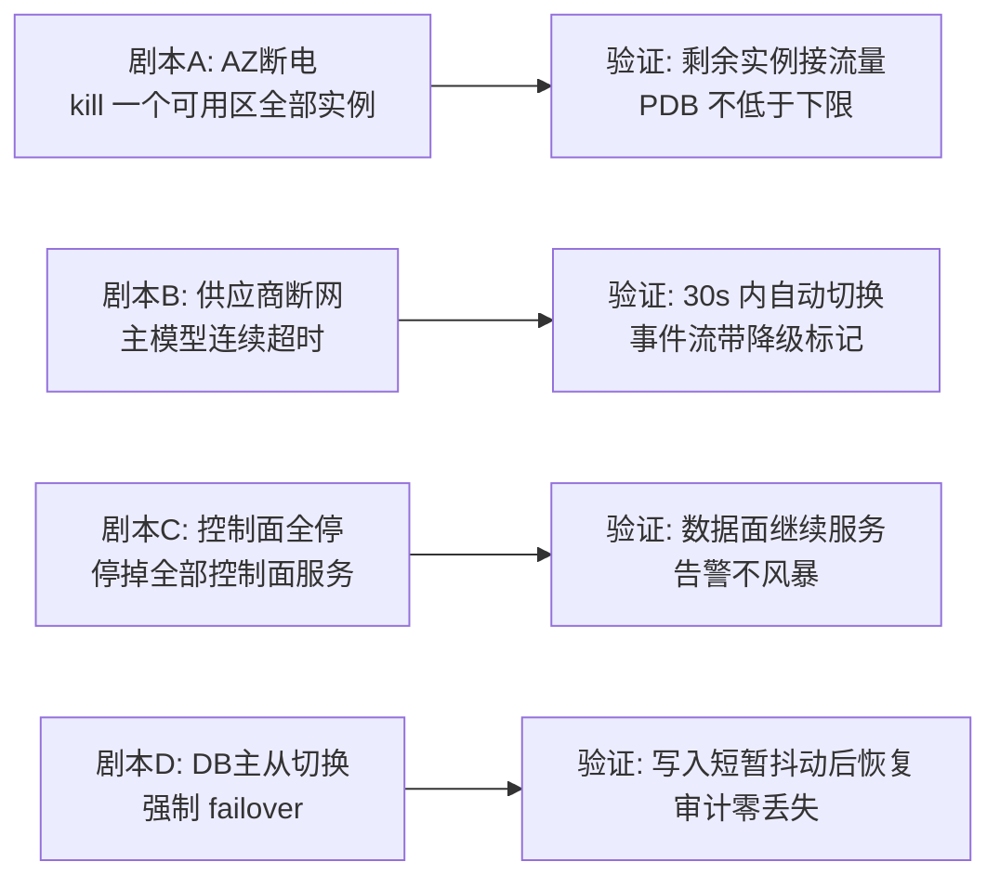
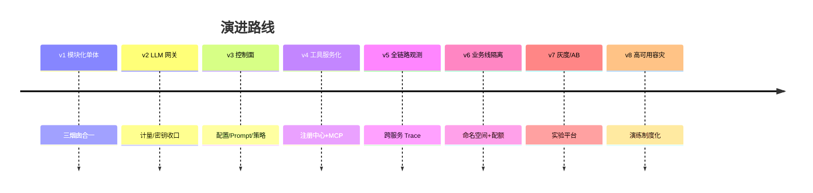

# 项目 05：企业级 Agent 中台 — 08-高可用与容灾

> **定位**：主线收官迭代——把"能跑"变成"打不死"：供应商故障自动切换、服务熔断降级链、控制面/数据面的分级 SLA、容灾演练制度化。**健康判定 / 自动切换 / 流式去重重试代码完整可手写**。（主线 v1-v8 至此收官；进阶深化 v9-v11 见 [10-多模型路由与成本深化] 起。）
>
> 「遇到阻塞？→ [教程 63-容错与弹性设计 全篇]、[教程 65-模型路由与降级 §6 模型健康检查与自动切换]、[教程 66-部署与运维 §3.5 Deployment]」

---

## 1. 需求与上一版痛点（四问）

| 问 | 答 |
|----|----|
| **新增了什么需求** | 任一 LLM 供应商故障，受影响调用 30 秒内自动切换；单服务实例故障不影响整体；每季度容灾演练有报告 |
| **影响了哪些模块** | llm-gateway：健康判定 + 自动故障切换 + 流式去重重试；数据面：对控制面故障的"免疫力"再加固；测试侧：混沌测试进 CI |
| **架构如何演进** | 从"配置切换"升级为"自动故障切换"；从"没演练过"升级为"季度演练制度化" |
| **上一版痛点是什么** | 供应商 40 分钟故障整体不可用；控制面 DB 切换波及数据面告警风暴；从未演练 |

| v7 痛点 | 本次迭代对策 |
|---------|-------------|
| 供应商 40 分钟故障导致整体不可用 | 健康探测 + 自动故障切换 + 降级链 |
| 控制面 DB 切换波及数据面（告警风暴） | 分级 SLA：数据面对控制面故障的"免疫力"再加固 |
| 从未演练 | 容灾演练日历 + 自动化故障注入 |

### 1.1 本节核对（四问）

- 四问完整；对策落点：健康判定→§3.1、自动切换→§3.2、流式去重→§3.3、控制面免疫→§3.4、演练→§3.5。

## 2. 高可用全景



### 2.1 本节核对（高可用全景图）

- 降级链四层（主→备→廉价→静态兜底）与 §3.2/§3.3 实现对应；部署 HA 副本数与验收项 5 对应；演练剧本 A-D 与 §3.5 一致。

## 3. 关键实现

### 3.1 供应商健康探测：低频探活（吸取的教训）

> **本迭代修正 v2 遗留的矛盾**：早期版本的 `ModelHealthChecker` 每 30 秒对每个模型发真实 "1+1=?" 请求——3 个业务线 × 5 个模型 = 每天 14400 次探活调用，纯烧钱。统一为：**被动健康判定为主 + 低频主动探活为辅**（ADR-025）。

**`route/RouteHealthTracker.java`（llm-gateway）**——被动判定：滑动窗口统计真实流量的成败率：

```java
package com.acme.gateway.route;

import java.util.ArrayDeque;
import java.util.Deque;
import java.util.Map;
import java.util.concurrent.ConcurrentHashMap;

import org.springframework.stereotype.Component;

/** 被动健康判定（主）：按模型名维护滑动窗口，记录真实流量成败（ADR-025）。 */
@Component
public class RouteHealthTracker {

    private static final int WINDOW_SIZE = 100;

    private final Map<String, SlidingWindow> windows = new ConcurrentHashMap<>();

    public void record(String modelName, boolean success) {
        windows.computeIfAbsent(modelName, k -> new SlidingWindow(WINDOW_SIZE)).record(success);
    }

    public boolean hasRecentTraffic(String modelName) {
        SlidingWindow w = windows.get(modelName);
        return w != null && w.size() > 0;
    }

    public RouteState state(String modelName) {
        SlidingWindow w = windows.get(modelName);
        if (w == null || w.size() == 0) return RouteState.CLOSED;
        if (w.failureRate() > 0.5 && w.size() >= 20) return RouteState.OPEN;
        if (w.failureRate() < 0.2) return RouteState.CLOSED;
        return RouteState.HALF_OPEN;      // 放行试探流量
    }

    public enum RouteState { CLOSED, OPEN, HALF_OPEN }

    static final class SlidingWindow {
        private final int capacity;
        private final Deque<Boolean> samples;

        SlidingWindow(int capacity) {
            this.capacity = capacity;
            this.samples = new ArrayDeque<>(capacity);
        }

        synchronized void record(boolean success) {
            if (samples.size() == capacity) {
                samples.removeFirst();
            }
            samples.addLast(success);
        }

        synchronized double failureRate() {
            if (samples.isEmpty()) return 0.0;
            long failures = samples.stream().filter(b -> !b).count();
            return (double) failures / samples.size();
        }

        synchronized int size() { return samples.size(); }
    }
}
```

**`health/ModelHealthChecker.java`**——主动探活（辅）：仅对"当前无流量"的路由目标每 5 分钟一次轻量 `models.list` 调用（不耗 Token）：

```java
package com.acme.gateway.health;

import com.acme.gateway.route.ModelRouter;
import com.acme.gateway.route.RouteHealthTracker;

import org.slf4j.Logger;
import org.slf4j.LoggerFactory;
import org.springframework.scheduling.annotation.Scheduled;
import org.springframework.stereotype.Component;
import org.springframework.web.reactive.function.client.WebClient;

/** 主动探活（辅）：仅对无真实流量的路由目标做低频 models.list（v2 烧钱探活的修正）。 */
@Component
public class ModelHealthChecker {

    private static final Logger log = LoggerFactory.getLogger(ModelHealthChecker.class);

    private final WebClient webClient;
    private final RouteHealthTracker healthTracker;
    private final ModelRouter modelRouter;

    public ModelHealthChecker(WebClient.Builder webClientBuilder,
                              RouteHealthTracker healthTracker,
                              ModelRouter modelRouter) {
        this.webClient = webClientBuilder.build();
        this.healthTracker = healthTracker;
        this.modelRouter = modelRouter;
    }

    @Scheduled(fixedDelay = 300_000)
    public void probe() {
        modelRouter.allRoutes().forEach(route -> {
            if (healthTracker.hasRecentTraffic(route.modelName())) {
                return;   // 有真实流量：以被动判定为准，不烧钱探活
            }
            webClient.get()
                    .uri(route.endpoint() + "/models")
                    .headers(h -> h.setBearerAuth(route.apiKey()))
                    .retrieve()
                    .bodyToMono(String.class)
                    .subscribe(
                            unused -> healthTracker.record(route.modelName(), true),
                            err -> healthTracker.record(route.modelName(), false));
        });
    }
}
```

> 需要在 `LlmGatewayApplication` 上启用 `@EnableScheduling`（与 agent-platform 相同）。

「遇到阻塞？→ [教程 63-容错与弹性设计 §6.4 熔断器的三种状态]、[教程 65-模型路由与降级 §6.1 健康检查器]——流式调用的故障判定要看"首帧超时"而非"整体超时"，避免长回答被误杀」

#### 3.1.1 本节测试与验证（健康探测）

**前置条件**：`RouteHealthTracker`（被动窗口）与低频主动探活（`@EnableScheduling`）已上线。

**步骤与断言**：

| # | 操作 | 预期（PASS 判据） |
|---|------|------------------|
| 1 | 对某模型连续灌入失败流量至窗口阈值 | `healthTracker.state(model)` 变为 OPEN（熔断） |
| 2 | 灌入成功流量恢复 | 状态经 HALF_OPEN 回 CLOSED（或按实现的恢复路径） |
| 3 | 观察主动探活调用量（`gateway.llm.requests` 按来源/探活标记区分） | 占总调用 < 0.5%（修正 v2 的 14400 次/天烧钱探活，验收项 4） |
| 4 | 观察探活日志 | 只对"无流量或异常"的模型低频探活，不与真实流量重复 |

**失败排查**：永不 OPEN → 阈值/窗口参数错；状态抖动 → HALF_OPEN 半开探测未实现；探活占比超标 → 频率仍是 30s 高频。

### 3.2 自动故障切换：`route/ModelRouter.java`（v8 版）

在 v3 基础上增加健康感知与主备切换：

```java
package com.acme.gateway.route;

import java.util.HashMap;
import java.util.List;
import java.util.Map;
import java.util.concurrent.atomic.AtomicReference;

import org.springframework.stereotype.Component;

@Component
public class ModelRouter {

    private final AtomicReference<Map<String, RouteSpec>> routes = new AtomicReference<>(Map.of(
            "cs", new RouteSpec("deepseek", "deepseek-chat", "https://api.deepseek.com/v1", "DEEPSEEK_API_KEY"),
            "km", new RouteSpec("openai", "gpt-4o-mini", "https://api.openai.com/v1", "OPENAI_API_KEY"),
            "da", new RouteSpec("vllm", "internal-chat", "http://llm-internal:8000/v1", "VLLM_API_KEY")
    ));

    private final RouteHealthTracker healthTracker;

    public ModelRouter(RouteHealthTracker healthTracker) {
        this.healthTracker = healthTracker;
    }

    /** 解析主路由；若主路由熔断（OPEN）则自动切备用（v8，ADR-025）。 */
    public ModelRoute resolve(String businessLine, String requestedModel) {
        ModelRoute primary = primaryRoute(businessLine);
        if (healthTracker.state(primary.modelName()) == RouteHealthTracker.RouteState.OPEN) {
            ModelRoute backup = backupRoute(businessLine);
            if (backup != null) {
                return backup;
            }
        }
        return primary;
    }

    /** 全部路由（供主动探活遍历）。 */
    public List<ModelRoute> allRoutes() {
        return routes.get().values().stream()
                .map(spec -> new ModelRoute(spec.supplier(), spec.modelName(), spec.endpoint(),
                        System.getenv(spec.keyEnvVar())))
                .toList();
    }

    public ModelRoute cheapRouteFor(String businessLine) {
        return new ModelRoute("vllm", "internal-chat", "http://llm-internal:8000/v1",
                System.getenv("VLLM_API_KEY"));
    }

    public void applyRoutes(Map<String, RouteSpec> newRoutes) {
        routes.updateAndGet(map -> {
            Map<String, RouteSpec> copy = new HashMap<>(map);
            copy.putAll(newRoutes);
            return Map.copyOf(copy);
        });
    }

    private ModelRoute primaryRoute(String businessLine) {
        RouteSpec spec = routes.get().getOrDefault(businessLine, routes.get().get("km"));
        return new ModelRoute(spec.supplier(), spec.modelName(), spec.endpoint(),
                System.getenv(spec.keyEnvVar()));
    }

    /** 备用路由：供应商 B 同级模型（配置由 policy-service 下发，此处示意）。 */
    private ModelRoute backupRoute(String businessLine) {
        return switch (businessLine) {
            case "cs" -> new ModelRoute("supplierB", "cs-backup", "https://api.supplier-b.com/v1",
                    System.getenv("SUPPLIER_B_API_KEY"));
            default -> null;   // 无备用则维持主路由（可进一步降级到廉价模型）
        };
    }

    public record RouteSpec(String supplier, String modelName, String endpoint, String keyEnvVar) {}
}
```

#### 3.2.1 本节测试与验证（自动故障切换）

**前置条件**：v8 版 ModelRouter 已接入 healthTracker；cs 线配了备用路由（supplierB/cs-backup）。

**材料——故障注入**：把主供应商 endpoint 指向不可达地址（或 iptables 屏蔽），使 cs 主模型流量全失败。

**步骤与断言**：

| # | 操作 | 预期（PASS 判据） |
|---|------|------------------|
| 1 | 注入主模型 100% 超时 | 30s 内 `resolve("cs",...)` 返回备用路由；`gateway.llm.requests` 的 supplier 标签变为 supplierB（验收项 1 前半） |
| 2 | 注入期间持续发请求 | 服务不中断（切换过程业务侧无感失败） |
| 3 | 恢复主供应商，持续发正常流量 | 5 分钟内切回主路由（验收项 1 后半，状态回 CLOSED） |
| 4 | 对无备用路由的线（km/da）注入故障 | 维持主路由（backupRoute 返回 null），可进一步走 cheapRouteFor 降级 |

**失败排查**：切不过去 → 状态未达 OPEN（回查 §3.1.1 步骤 1）或 resolve 没查 healthTracker；切回失败 → 恢复探测未触发。

### 3.3 流式故障切换的去重难题

流式输出到一半供应商断连——直接切备用模型重试会导致**已输出内容重复**。两种策略（按场景选择）：

| 策略 | 做法 | 适用 |
|------|------|------|
| 重生成 | 首帧前失败→静默重试；首帧后失败→向前端发 `error(recoverable)` 事件，由用户选择重试 | 对话类（本项目默认） |
| 断点续写 | 把已生成内容+续写指令发给备用模型 | 长文生成；成本高、拼接处质量不稳定 |

**`stream/RecoverableStreamException.java`**：

```java
package com.acme.gateway.stream;

/** 流式可恢复错误事件：携带已流出字节数，前端提示用户"重试"而非"重头再来"。 */
public class RecoverableStreamException extends RuntimeException {

    private final int partialLength;

    public RecoverableStreamException(int partialLength, Throwable cause) {
        super("流式中断（已输出 %d 字节）".formatted(partialLength), cause);
        this.partialLength = partialLength;
    }

    public int partialLength() { return partialLength; }
}
```

**`LlmGatewayHandler` 的递归重试转发**（首帧前静默重试 / 首帧后发可恢复错误）：

```java
// LlmGatewayHandler 新增字段：
// private final RouteHealthTracker healthTracker;

/** 按候选路由链尝试转发：首帧前失败静默重试下一路由，首帧后失败发可恢复错误（ADR-026）。 */
private Flux<DataBuffer> tryRoute(List<ModelRoute> candidates, int attempt, String body,
                                  AtomicBoolean firstFrameEmitted, AtomicInteger partialLength) {
    if (attempt >= candidates.size()) {
        return Flux.error(new IllegalStateException("所有路由均失败"));
    }
    ModelRoute route = candidates.get(attempt);
    return webClient.post()
            .uri(route.endpoint() + "/chat/completions")
            .headers(h -> h.setBearerAuth(route.apiKey()))
            .contentType(MediaType.APPLICATION_JSON)
            .bodyValue(body)
            .retrieve()
            .bodyToFlux(DataBuffer.class)
            .doOnNext(buffer -> {
                firstFrameEmitted.set(true);
                partialLength.addAndGet(buffer.readableByteCount());
                healthTracker.record(route.modelName(), true);
            })
            .onErrorResume(e -> {
                healthTracker.record(route.modelName(), false);
                if (!firstFrameEmitted.get()) {
                    // 一帧未出：静默切下一路由重试，用户无感
                    return tryRoute(candidates, attempt + 1, body, firstFrameEmitted, partialLength);
                }
                // 已有内容流出：不能静默重试（前端会重复），发可恢复错误事件
                return Flux.error(new RecoverableStreamException(partialLength.get(), e));
            });
}
```

调用方（在 `proxy` 方法内，转发处替换为候选路由链）：

```java
// 候选链：主路由 → 备用路由 → 廉价模型 → （静态兜底由前端/业务侧承接）
List<ModelRoute> candidates = List.of(
        route,
        modelRouter.cheapRouteFor(bizLine));
Flux<DataBuffer> upstream = tryRoute(candidates, 0, ctx.rewriteBodyFor(route, body),
        new AtomicBoolean(false), new AtomicInteger(0));
return ServerResponse.ok()
        .contentType(MediaType.TEXT_EVENT_STREAM)
        .body(BodyInserters.fromDataBuffers(usageMeteringInterceptor(upstream, ctx)));
```

#### 3.3.1 本节测试与验证（流式切换去重）

**前置条件**：`tryRoute` 递归重试转发已接入 `LlmGatewayHandler`。

**材料——两阶段断连注入**：① 首帧前断连（上游立即 RST）；② 首帧后断连（流到 N 字节后切断）。

**步骤与断言**：

| # | 操作 | 预期（PASS 判据） |
|---|------|------------------|
| 1 | 注入①后发流式请求 | 静默重试下一候选路由，前端收到完整回答、无错误事件 |
| 2 | 注入②后发流式请求 | 前端收到 `error(recoverable)` 类事件（RecoverableStreamException 语义），**不**自动重发导致内容重复（验收项 2） |
| 3 | 全部候选路由失败 | 返回「所有路由均失败」错误，非悬挂连接 |

**失败排查**：步骤 2 内容重复 → 首帧后仍走了静默重试（firstFrameEmitted 判断漏）；步骤 1 直接报错 → 候选链没把备用/廉价路由排进去。

### 3.4 数据面对控制面的"免疫力"清单（v3 原则的最终验收）

| 控制面故障 | 数据面行为 |
|-----------|-----------|
| config-service 全挂 | 本地缓存续命运行；仅"配置变更"能力受损 |
| policy-service 全挂 | 策略表冻结在最后已知版本；配额扣减走 Redis（独立存储）不受影响 |
| registry-service 全挂 | 工具目录本地缓存续命；新工具上线暂停（可接受） |
| 控制 DB 主从切换 | 数据面心跳对账静默重试（告警降级为日志，不触发告警风暴） |

**核心不变式：控制面任何组件全挂，数据面以最后已知配置无限期运行。** 每条进 CI 的混沌测试：

```java
package com.acme.agent;

import com.acme.agent.platform.chat.internal.PromptResolver;

import org.junit.jupiter.api.Test;
import org.springframework.beans.factory.annotation.Autowired;
import org.springframework.boot.test.context.SpringBootTest;   // ⚠ 需引入依赖 org.springframework.boot:spring-boot-starter-test（本地未下载，未 javap 实证；以引入依赖后 javap 输出为准）

import static org.assertj.core.api.Assertions.assertThat;

/** 混沌测试：控制面全停、数据面用最后已知配置继续跑（ADR-027 进 CI）。 */
@SpringBootTest
class ControlPlaneImmunityTest {

    @Autowired
    private PromptResolver promptResolver;

    @Test
    void 控制面不可用时数据面用本地缓存或出厂文件续命() {
        // 真实混沌演练：停掉 prompt-service 后调用 resolve，应返回缓存/出厂值而非抛错
        // 注意：v7 起 resolve 为 3 参签名（ns/name/userId），userId 用于实验分桶
        String resolved = promptResolver.resolve("cs", "main-system", "chaos-test-user");
        assertThat(resolved).isNotBlank();
    }
}
```

#### 3.4.1 本节测试与验证（控制面免疫混沌测试）

**前置条件**：`ControlPlaneImmunityTest` 已入 CI（ADR-027）；testcontainers 依赖已加（§3.5）。

**步骤与断言**：

| # | 操作 | 预期（PASS 判据） |
|---|------|------------------|
| 1 | 停掉 prompt-service 后运行该测试 | `resolve("cs","main-system","chaos-test-user")` 返回非空（缓存/出厂文件兜底，不抛错） |
| 2 | 按免疫力清单逐行注入（config/policy/registry 全挂） | 对应数据面行为与清单一致：缓存续命/策略冻结/目录续命，业务请求不失败 |
| 3 | 控制 DB 强制 failover | 心跳对账静默重试，只降级为日志，无告警风暴 |

**失败排查**：步骤 1 抛错 → 兜底顺序错（缓存/出厂文件缺失或顺序颠倒）；步骤 3 告警风暴 → 心跳重试没有退避与降级。

### 3.5 容灾演练自动化

需在 pom.xml 中添加依赖（演练工具）：

```xml
<dependency>
    <groupId>org.testcontainers</groupId>
    <artifactId>testcontainers</artifactId>
    <scope>test</scope>
</dependency>
```

演练剧本（季度执行 + 每次大版本前抽样）：



### 3.5.1 本节核对（演练自动化）

- 剧本 A-D 各有明确验证点（剩余实例接流量/30s 切换/数据面续命/审计零丢失），与验收项 1/3/5 可对上。
- testcontainers 依赖已标注「需在 pom.xml 中添加依赖」。

## 4. 验收标准（项目收官验收）

| # | 验收项 | 标准 |
|---|--------|------|
| 1 | 供应商切换 | 注入供应商 100% 超时，30s 内全部流量切到备用；恢复后 5 分钟内切回 |
| 2 | 流式去重 | 切换过程中前端零内容重复（首帧后失败走 recoverable 事件） |
| 3 | 控制面免疫 | 剧本 C 通过：控制面全停 1 小时，业务可用性 100% |
| 4 | 探活成本 | 主动探活调用量 < 总调用的 0.5%（修正 v2 的烧钱探活） |
| 5 | 部署韧性 | 滚动更新零中断；实例级故障自愈 |
| 6 | 演练制度化 | 每季度演练报告归档；剧本 A-D 全过 |

### 4.1 全篇回归验证（v8 收官）

> 探针材料已按主题上移：健康探测→§3.1.1、故障切换→§3.2.1、流式去重→§3.3.1、控制面免疫→§3.4.1。本节只做收官级整体回归。

| # | 操作 | 预期（PASS 判据） |
|---|------|------------------|
| 1 | 执行完整剧本 B（供应商断网演练） | 30s 切换 + 恢复 5 分钟切回 + 全程事件流带降级标记 |
| 2 | 滚动更新 llm-gateway（×3 实例） | 零中断（PDB 保底，验收项 5） |
| 3 | 对照 §3.4 免疫清单 + 各章本节验证全绿 | 剧本 A-D 报告归档（验收项 6） |

**失败排查**：滚动更新中断 → PDB/反亲和未配置；剧本不过 → 回到对应小节（§3.1.1–§3.4.1）的失败排查。

## 5. 本迭代的 ADR

| # | 决策 | 理由 |
|---|------|------|
| ADR-025 | 被动健康为主、低频主动为辅 | 真实流量判定最准；探活是纯成本 |
| ADR-026 | 首帧后失败不静默重试 | 流式已输出内容不可回滚，静默重试必然重复 |
| ADR-027 | 数据面对控制面无限期免疫（最后已知配置） | 管控分离的生存纪律，进混沌测试 CI |

### 5.1 本节核对（ADR）

- 三条 ADR 可回指落点：ADR-025→§3.1+§3.1.1、ADR-026→§3.3+§3.3.1、ADR-027→§3.4+§3.4.1。

## 6. v8 主线总结



八轮主线迭代走完一条完整的中台演进弧线：**合（单体）→ 收（网关）→ 治（控制面）→ 开（工具服务）→ 看（观测）→ 隔（隔离）→ 稳（灰度）→ 打不死（容灾）**。至此 27 条 ADR 记录了每个岔路口的取舍（进阶轮再添 10 条，全量见 [13-ADR架构决策记录]）。主线到此收官，但工程纵深未完：路由与成本效率（v9）、能力开放与市场（v10）、混沌与容量（v11）三块进阶短板在 [10-多模型路由与成本深化] 起继续。

→ [09-核心代码讲解.md](09-核心代码讲解.md) — 全项目关键代码集中解析。

### 6.1 本节核对（v8 主线总结）

- timeline 八个版本与 01-08 篇一一对应；"27 条 ADR"与 [13-ADR架构决策记录] 主线条目数一致（进阶 10 条另计）。
