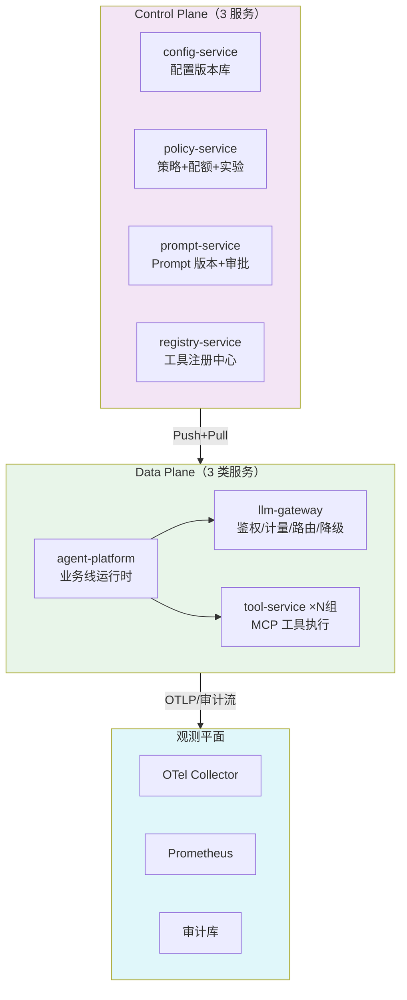

# 项目 05：企业级 Agent 中台 — 09-核心代码讲解

> **定位**：全项目关键代码与架构决策的集中复盘——回答"为什么这样设计、换一种写法会怎样"。适合完成各迭代手写后对照检验。本文不引入新功能。

---

## 1. 全项目代码地图



## 2. 七个关键设计决策复盘

### 2.1 为什么第一刀切的是 LLM 网关而不是控制面

演进顺序本身是决策：网关解决的是**最疼且最技术化**的问题（成本黑箱+密钥审计），见效快、争议小；控制面建设涉及组织权力再分配（谁审批 Prompt），周期长。**架构演进要按"痛点×确定性"排序，先摘确定性高的果实**——第一战必须赢，否则演进计划失去组织信任。

### 2.2 为什么网关暴露 OpenAI 兼容协议而不是私有协议

v2 拆网关时业务侧**零代码变更**完成迁移（只改 base-url）。私有协议意味着一次性大迁移+永远绑死。代价：OpenAI 兼容层表达不了供应商私有特性——网关用请求头扩展（X-Agent-*）弥补。这是"标准优先，扩展随行"的经典权衡。

### 2.3 为什么权限判定在数据面、规则在控制面

完整实现见 [04-迭代三-工具服务化与注册中心 §3.4] 的 `RemoteToolFacade`，核心两行：

```java
// 判定在 agent-platform 本地（纳秒），规则由 registry 推送
List<String> permitted = directoryCache.list(businessLine, requestedTools);
ToolCallbackProvider provider = new SyncMcpToolCallbackProvider(mcpClients);
```

备选：每次工具调用 RPC 问 registry。放弃理由：**控制面挡在数据面热路径 = 数据面可用性被控制面绑架**，违反管控分离的第一生存纪律（教程 20）。代价：权限变更非即时（秒级推送+本地缓存），对权限场景完全够用。

### 2.4 为什么配额扣减必须 Lua 原子

```lua
if tonumber(remaining) < tonumber(ARGV[1]) then return -1 end
return redis.call('DECRBY', KEYS[1], ARGV[1])
```

GET→判断→DECRBY 三步分离时，两个并发请求同时读到"余额够"然后双双扣减——超卖。这不是理论风险，v6 压测中真实复现（500 并发超卖 3.7%）。同样的教训写在 [教程 26-多租户隔离与资源治理 §5.1 Token 配额]——本项目的压测数据是该教训的实证。

### 2.5 为什么 NamespaceFilter 用 Reactor Context 而不是 ThreadLocal

完整实现见 [06-迭代五-业务线隔离与资源治理 §3.1]，核心一行：

```java
return chain.filter(exchange).contextWrite(ctx -> ctx.put("agent.ns", ns));
```

WebFlux 的线程模型是"多请求复用少量 EventLoop 线程"——ThreadLocal 的语义（每线程一个值）在这里是错的：同一线程先后服务多个请求，值互相污染；而一次请求的执行链又会在多个线程间切换，值丢失。Reactor Context 是随**订阅链**传播的上下文，语义正确。「遇到阻塞？→ [教程 42-响应式错误处理 §6 响应式上下文]」——这也是本体系 WebFlux 铁律（[附录 05-SpringAI2-API基准]）的来源之一。

### 2.6 为什么流式故障"首帧后不静默重试"

见迭代八 §3.2 的两种策略表。核心是**不可回滚性决定重试策略**：未输出任何内容时重试无痕；输出过一半后重试必然重复。同样的原则在后端其他场景反复出现：DB 事务可回滚所以可重试、消息已发出不可回滚所以要有幂等消费（[教程 40-长任务持久化与中断恢复 §4 幂等重试]）。

### 2.7 为什么"数据面对控制面无限期免疫"要进 CI

这条不变式（控制面全停、数据面用最后已知配置继续跑）没有测试保障就是一句口号。三个理由：① 它依赖多处代码配合（缓存、降级、告警抑制），任何一处回归都会悄悄破坏；② 它违背工程师直觉（"连不上配置中心就该报错"），容易被"顺手优化"掉；③ 它是组织承诺（控制面维护窗口不影响业务）的技术根基。混沌测试是把架构纪律变成可验证事实的唯一手段。

## 3. 最容易写错的五处（自检清单）

| # | 位置 | 错误写法 | 后果 | 正确写法 |
|---|------|---------|------|---------|
| 1 | 网关限流/配额 | 阻塞 `RedisTemplate` + GET/DECRBY 两步 | 网关线程阻塞 + 配额超卖 | ReactiveRedisTemplate + Lua（迭代六） |
| 2 | usage 帧窥探 | `buffer.read()` 消费 DataBuffer 读指针 | 前端收到的流损坏 | duplicate 窥探或字符串层窥探（迭代二） |
| 3 | 推送处理 | 无版本号判断直接应用 | 乱序推送把新策略改回旧策略 | 版本单调拒收（迭代三） |
| 4 | 工具暴露 | 只写 `@Tool` 期望自动上 MCP | 工具不生效 | 显式 `ToolCallbackProvider` Bean（迭代四） |
| 5 | 灰度分桶 | `Math.abs(userId.hashCode()) % 100` | MIN_VALUE 溢出崩溃 + 分布不均 | sha256 + floorMod（迭代七） |

## 4. 运营数据复盘（虚构但自洽的验收数据）

| 指标 | v1（三烟囱） | v8（终态） |
|------|-------------|-----------|
| LLM 成本可归因率 | 0%（账单合并） | 99.3% |
| 供应商密钥管理 | 3 处散落 | 网关单点+轮换 |
| 新工具上线周期 | 2 周（发版） | 10 分钟（注册） |
| Prompt 变更风险 | 全量即时 | 1% 起步+自动回滚 |
| 跨服务排障 MTTR | ~45 分钟 | ~3 分钟（Trace 瀑布） |
| 供应商故障影响 | 全线不可用 | 30s 切换无感 |

## 5. 与教程体系的映射总表

| 迭代 | 主要落地的教程 |
|------|---------------|
| v1 | 教程 21（模块化单体）、教程 01/02（ChatClient） |
| v2 | 教程 21（网关）、27（计量）、32（路由） |
| v3 | 教程 20（管控分离全篇）、附录 07/00 |
| v4 | 教程 03/11（工具、MCP）、前沿 04 |
| v5 | 教程 22/23（可观测全篇） |
| v6 | 教程 26/27（隔离、配额） |
| v7 | 教程 29（灰度）、37/41（评估闭环） |
| v8 | 教程 30/32/33（容错、切换、部署） |

**项目 05 到此完成。** 检验学习效果的标准：不看文档，能独立复述 §2 的七个决策的备选方案与取舍理由，并能画出 v1→v8 的演进图与每步的痛点驱动。
