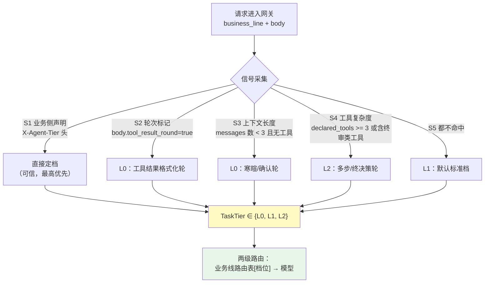
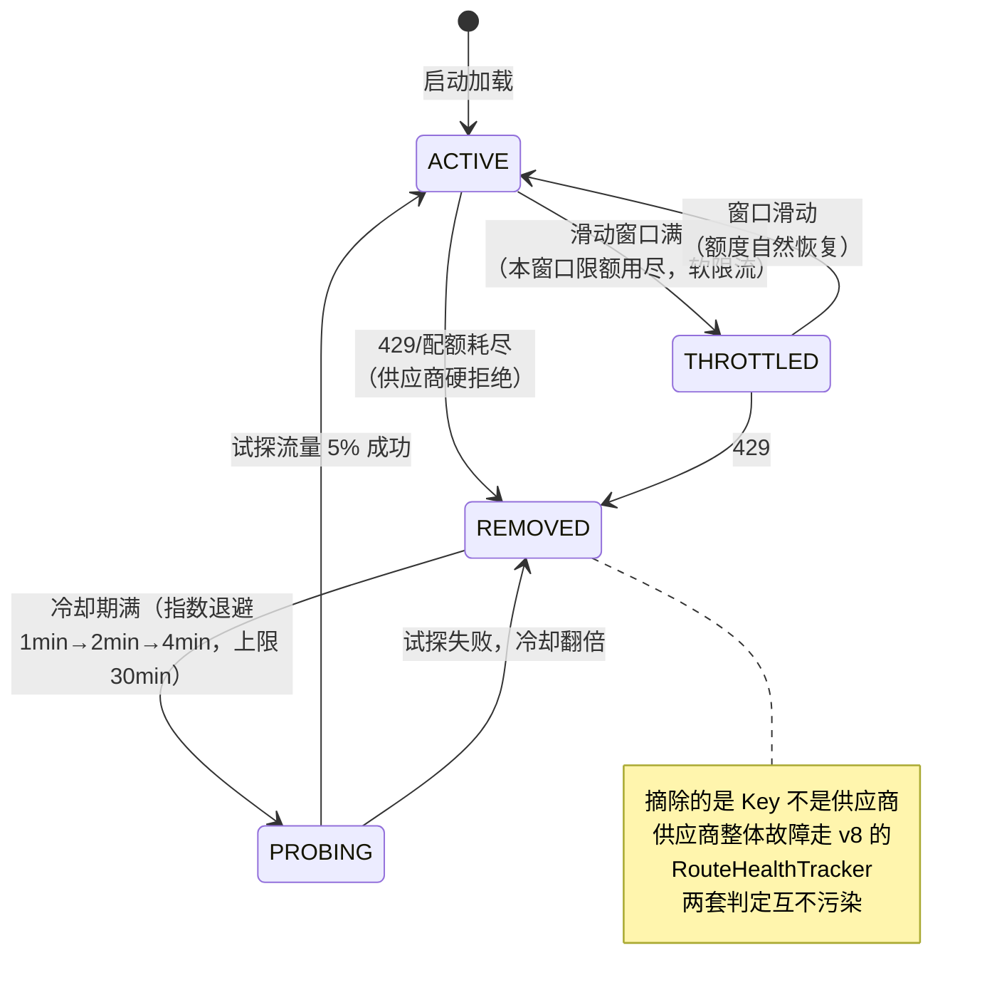
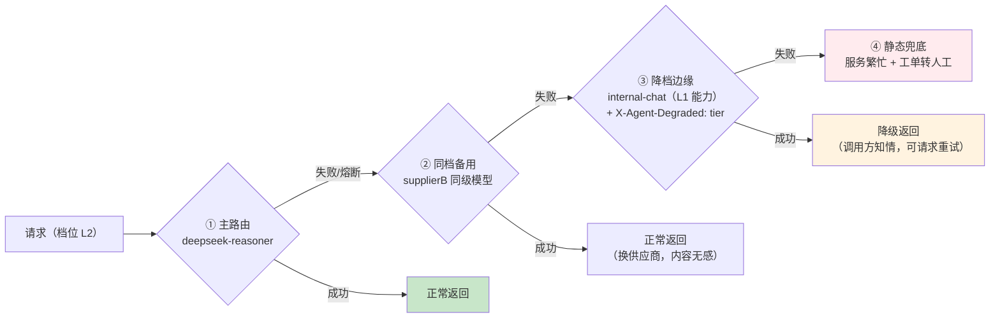
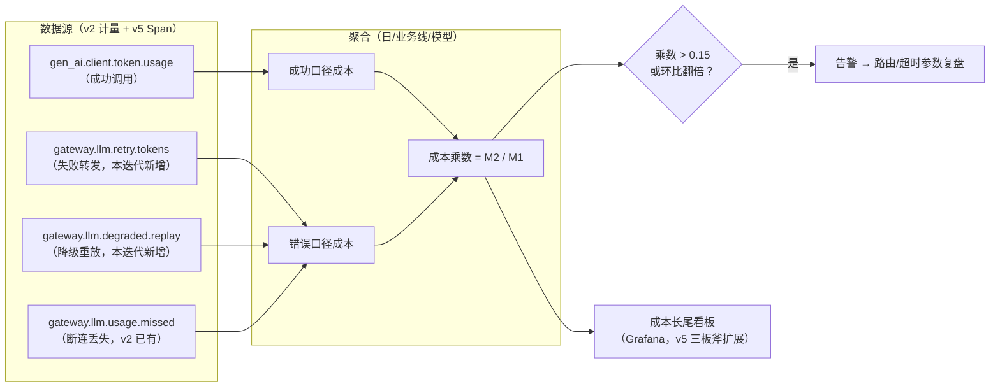

# 项目 05：企业级 Agent 中台 — 10-多模型路由与成本深化

> **定位**：主线路由是"业务线 → 模型"一对一；本迭代把它深化为"业务线 × 任务复杂度 → 模型"的两级路由（轻量模型跑例行、重模型只管终决策），并补齐供应商 Key 池管理、多级降级链与**错误路径成本**的观测盲区。这是把 v2/v6/v8 已有路由、配额、健康三块能力拧成"成本效率"专项的进阶迭代。**分档路由 / Key 池 / 成本长尾监控代码完整可手写**。
>
> 「遇到阻塞？→ [教程 32-模型路由与降级 全篇]、[教程 27-成本治理与Token计量 §指标体系]、[教程 44-多模型协作与供应策略 §模型级联]」

---

## 1. 需求与上一版痛点（四问）

| 问 | 答 |
|----|----|
| **新增了什么需求** | 任务按复杂度分档路由（例行任务走轻量模型、终决策才上重模型）；供应商 Key 池化（多 Key 分摊限流额度、故障摘除与自动恢复）；降级链从两级扩到多级（主→备→边缘）；"错误路径"消耗的 Token 可被单独度量与告警 |
| **影响了哪些模块** | llm-gateway：`ModelRouter` 升级两级路由、新增 `KeyPool`、候选链生成改为按档位；policy-service：分档策略与预算联动；观测平面：成本长尾看板 |
| **架构如何演进** | 路由决策从"按业务线"进化为"按业务线 × 任务档位"；Key 从"每供应商一把"进化为"每供应商一个池"；成本从"总量漏斗"进化为"成功路径 / 错误路径双口径" |
| **上一版痛点是什么** | 路由粒度粗——客服线 70% 的"查订单回复"例行轮次也在烧 deepseek-chat；单 Key 在月初并发高峰集体 429；降级链只有"主→廉价"两级，重任务降级后质量塌方；成本报表只看总量，失败重试放大的开销 invisible |

| v8 痛点 | 本次迭代对策 |
|---------|-------------|
| 轻问题也用贵模型（例行轮次烧重模型） | 任务分档路由：L0 例行/L1 标准/L2 终决策三档 |
| 单 Key 高峰 429、无池化 | Key 池：滑动窗口分摊 + 摘除冷却 + 半开恢复 |
| 降级链两级、重任务降级质量塌方 | 多级降级链：主→备（同级）→边缘（轻量+标记）→静态兜底 |
| 错误路径成本 invisible | 成本乘数指标：错误路径 Token 单独计量、长尾告警 |

### 1.1 本节核对（四问）

- 四问完整；对策落点：分档→§2、Key 池→§3、降级链与成本→§4。

## 2. 任务分档模型

### 2.1 为什么按"任务复杂度"而不只按"业务线"

v2 的路由表是 `cs → deepseek-chat`。但一次客服会话的轮次分布（项目内统计口径，虚构但自洽）是：

| 轮次类型 | 占比 | 典型内容 | 需要的模型 |
|---------|------|---------|-----------|
| 例行轮（L0） | ~55% | 问候、格式化工具结果、确认类回复 | 轻量（internal-chat / gpt-4o-mini 档） |
| 标准轮（L1） | ~35% | 常规问答 + 单工具编排 | 中档（deepseek-chat 档） |
| 终决策轮（L2） | ~10% | 多步推理、投诉升级判断、方案终稿 | 重模型（reasoner 档） |

**结论**：按业务线一刀切，等于让 55% 的例行流量陪跑最贵的模型。分档路由的收益上限就是"L0 流量 × 重轻模型价差"——这是 [教程 27 §模型路由降级] 里"成本杠杆排序"的第一位。

### 2.2 分档器：规则先行（ADR-028）



**为什么规则先行而不是"小模型分类器"先行**：规则零成本、零延迟、可解释、可审计；小模型分类器每一轮要额外花一次调用（把省下的钱又花出去）。级联分类器（先用规则、规则不确定再用小模型）是可选增强，放 ADR 里记录为"未来选项"——[教程 44 §模型级联] 的级联思想在本项目的落地形态。

### 2.3 分档器实现

**`route/TaskTier.java` 与 `route/TaskTierClassifier.java`（llm-gateway）**：

```java
package com.acme.gateway.route;

public enum TaskTier {
    L0,   // 例行：格式化、确认、寒暄
    L1,   // 标准：常规问答 + 单工具
    L2;   // 终决策：多步推理、方案终稿

    /** 降档方向：L2→L1、L1→L0、L0→L0（触底不再降）。 */
    public TaskTier lower() {
        return switch (this) {
            case L2 -> L1;
            case L1 -> L0;
            case L0 -> L0;
        };
    }
}
```

```java
package com.acme.gateway.route;

import com.fasterxml.jackson.databind.JsonNode;
import com.fasterxml.jackson.databind.ObjectMapper;

import org.springframework.stereotype.Component;

/** 任务分档器：规则先行（ADR-028）。信号按优先级短路，全部不命中默认 L1。 */
@Component
public class TaskTierClassifier {

    private final ObjectMapper objectMapper;

    public TaskTierClassifier(ObjectMapper objectMapper) {
        this.objectMapper = objectMapper;
    }

    public TaskTier classify(String declaredTierHeader, String body) {
        // S1 业务侧显式声明（经凭证链签发的可信头，网关剥除外部同名头——同 X-Agent-Ns 机制）
        if ("L0".equals(declaredTierHeader)) return TaskTier.L0;
        if ("L2".equals(declaredTierHeader)) return TaskTier.L2;

        JsonNode root = readTree(body);
        if (root == null) return TaskTier.L1;

        // S2 工具结果轮：上一轮工具输出 → 本轮只需格式化转述
        if (root.path("metadata").path("tool_result_round").asBoolean(false)) {
            return TaskTier.L0;
        }
        // S4 工具复杂度：声明工具 >= 3 或含终审类工具 → 重任务
        int toolCount = root.path("tools").size();
        if (toolCount >= 3 || hasFinalReviewTool(root)) {
            return TaskTier.L2;
        }
        // S3 上下文极短且无工具：寒暄/确认轮
        int messageCount = root.path("messages").size();
        if (messageCount > 0 && messageCount < 3 && toolCount == 0) {
            return TaskTier.L0;
        }
        return TaskTier.L1;
    }

    private boolean hasFinalReviewTool(JsonNode root) {
        for (JsonNode tool : root.path("tools")) {
            String name = tool.path("function").path("name").asText("");
            if (name.startsWith("final.") || name.endsWith(".review")) {
                return true;   // 终审类工具命名约定（中台工具命名规范）
            }
        }
        return false;
    }

    private JsonNode readTree(String body) {
        try {
            JsonNode node = objectMapper.readTree(body);
            return node.isObject() ? node : null;
        } catch (Exception e) {
            return null;   // 非 JSON：透传场景，默认 L1
        }
    }
}
```

### 2.4 两级路由：`ModelRouter` v9

路由表从 `Map<businessLine, RouteSpec>` 升级为 `Map<businessLine, Map<TaskTier, RouteSpec>>`（policy-service 下发，沿用 v3 的 Push+版本号协议）：

```java
package com.acme.gateway.route;

import java.util.HashMap;
import java.util.Map;
import java.util.concurrent.atomic.AtomicReference;

import org.springframework.stereotype.Component;

/** v9 两级路由：业务线 × 任务档位 → 模型。表结构由 policy-service 下发（Push+Pull 不变）。 */
@Component
public class ModelRouter {

    /** 每业务线的档位路由：L0 轻量 / L1 中档 / L2 重模型；缺档回落到 L1。 */
    private final AtomicReference<Map<String, Map<TaskTier, RouteSpec>>> routes =
            new AtomicReference<>(Map.of(
                    "cs", Map.of(
                            TaskTier.L0, new RouteSpec("vllm", "internal-chat", "http://llm-internal:8000/v1", "VLLM_API_KEY"),
                            TaskTier.L1, new RouteSpec("deepseek", "deepseek-chat", "https://api.deepseek.com/v1", "DEEPSEEK_API_KEY"),
                            TaskTier.L2, new RouteSpec("deepseek", "deepseek-reasoner", "https://api.deepseek.com/v1", "DEEPSEEK_API_KEY")),
                    "km", Map.of(
                            TaskTier.L0, new RouteSpec("openai", "gpt-4o-mini", "https://api.openai.com/v1", "OPENAI_API_KEY"),
                            TaskTier.L1, new RouteSpec("openai", "gpt-4o-mini", "https://api.openai.com/v1", "OPENAI_API_KEY")),
                    "da", Map.of(
                            TaskTier.L1, new RouteSpec("vllm", "internal-chat", "http://llm-internal:8000/v1", "VLLM_API_KEY"))));

    private final RouteHealthTracker healthTracker;

    public ModelRouter(RouteHealthTracker healthTracker) {
        this.healthTracker = healthTracker;
    }

    /** 按业务线 + 档位解析；主路由熔断（OPEN）则降档优先于换供应商（ADR-029 见本篇 §5）。 */
    public ModelRoute resolve(String businessLine, TaskTier tier) {
        Map<TaskTier, RouteSpec> byTier = routes.get()
                .getOrDefault(businessLine, routes.get().get("km"));
        RouteSpec spec = byTier.getOrDefault(tier, byTier.get(TaskTier.L1));
        if (healthTracker.state(spec.modelName()) == RouteHealthTracker.RouteState.OPEN) {
            // 同档备用（异供应商）→ 降一档（L2→L1 保业务连续，响应带降级标记）
            RouteSpec backup = byTier.getOrDefault(tier.lower(), byTier.get(TaskTier.L1));
            if (backup != null) {
                return new ModelRoute(backup.supplier(), backup.modelName(),
                        backup.endpoint(), System.getenv(backup.keyEnvVar()));
            }
        }
        return new ModelRoute(spec.supplier(), spec.modelName(),
                spec.endpoint(), System.getenv(spec.keyEnvVar()));
    }

    /** v3 起的 Push 落点：版本单调校验在 PolicyClient，此处原子替换（结构升级为两级）。 */
    public void applyRoutes(Map<String, Map<TaskTier, RouteSpec>> newRoutes) {
        routes.updateAndGet(map -> {
            Map<String, Map<TaskTier, RouteSpec>> copy = new HashMap<>(map);
            copy.putAll(newRoutes);
            return Map.copyOf(copy);
        });
    }

    public record RouteSpec(String supplier, String modelName, String endpoint, String keyEnvVar) {}
}
```

**降档语义**：L2 请求降到 L1 模型时网关注入 `X-Agent-Degraded: tier` 响应头——与 v6 的 `X-Agent-Degraded: budget` 同一套标记协议，调用方与观测平面无需新增解析逻辑。

### 2.5 本节测试与验证（任务分档与两级路由）

**前置条件**：`TaskTierClassifier`/`ModelRouter` v9 已上线；网关 9090 可达。

**材料——分档探针**：

```bash
# S2 命中（工具结果轮 → L0）
curl -N -X POST "http://localhost:9090/v1/chat/completions" \
  -H "Authorization: Bearer $CRED_VALUE" -H "Content-Type: application/json" \
  -d '{"model":"default","messages":[{"role":"user","content":"把上面的订单信息整理成表格"}],"metadata":{"tool_result_round":true}}'
```

**步骤与断言**：

| # | 操作 | 预期（PASS 判据） |
|---|------|------------------|
| 1 | 单测：30 条构造请求（寒暄短轮/工具结果轮/三工具重任务/声明头覆盖/非 JSON 体） | 分档符合 S1-S5 优先级；`X-Agent-Tier` 声明头最高优先；非 JSON 默认 L1 不抛异常 |
| 2 | 材料：工具结果轮探针 | 网关日志 resolvedModel = internal-chat（cs 线 L0 档） |
| 3 | 单测：`ModelRouterV9Test`——主路由 OPEN 时 L2 请求 | 降档到 L1 路由命中（缺档回落 L1）；响应头 `X-Agent-Degraded: tier` 语义正确 |
| 4 | 单测：`RouteChainBuilderTest`——有/无备用两种配置 | 候选链长 3 或 2；链内模型不重复 |
| 5 | 构造 S4 场景（tools ≥3 或含 final.*/.*.review 工具） | 分档为 L2，路由到 reasoner 档 |

**失败排查**：步骤 2 仍走中档 → metadata 信号路径写错或优先级顺序颠倒；步骤 3 换了供应商而非降档 → 备用表命中顺序先于 `tier.lower()`。

## 3. 供应商 Key 池

### 3.1 问题与形态

v2 起"每供应商一把 Key"：供应商限流按 Key 计（如 60 req/min/Key），月初报表高峰三业务线并发直接打穿单 Key 的限额，429 风暴又污染 v8 的健康判定（`RouteHealthTracker` 把限流误判为供应商故障，触发不必要的切换）。

**Key 池形态**：每个供应商配置 N 把 Key，网关按滑动窗口把请求分摊到各 Key；单 Key 触发 429/配额耗尽即摘除冷却，冷却期满半开试探恢复。

### 3.2 Key 状态机



**与 v8 健康判定的分工**：Key 池判定"这把 Key 还能不能用"（限流口径），`RouteHealthTracker` 判定"这个供应商/模型还能不能用"（故障口径）。429 只摘 Key 不记供应商失败——v8 的误切换问题就此修正。

### 3.3 Key 池实现

**`route/KeyPool.java`（llm-gateway）**：

```java
package com.acme.gateway.route;

import java.time.Duration;
import java.util.ArrayDeque;
import java.util.Deque;
import java.util.List;
import java.util.Map;
import java.util.concurrent.ConcurrentHashMap;
import java.util.concurrent.atomic.AtomicInteger;

import org.springframework.stereotype.Component;

/** 供应商 Key 池：滑动窗口分摊 + 摘除冷却 + 半开恢复（ADR-029）。 */
@Component
public class KeyPool {

    private static final long WINDOW_MILLIS = 60_000L;      // 滑动窗口 60s（与供应商分钟级限流对齐）
    private static final int PROBE_PERCENT = 5;             // 半开试探流量比例

    private final Map<String, SupplierKeys> pools = new ConcurrentHashMap<>();

    /** 初始化某供应商的 Key 池（Key 名为环境变量名，真实值运行时读）。 */
    public void register(String supplier, List<String> keyEnvVars, int perKeyLimitPerMinute) {
        pools.put(supplier, new SupplierKeys(keyEnvVars, perKeyLimitPerMinute));
    }

    /** 取一把可用 Key 的真实值；池空（全部摘除）返回 null（调用方走降级链）。 */
    public String acquire(String supplier) {
        SupplierKeys pool = pools.get(supplier);
        return pool != null ? pool.acquire() : null;
    }

    /** 上游回报 429/配额耗尽：摘除对应 Key。 */
    public void reportRejected(String supplier, String apiKey) {
        SupplierKeys pool = pools.get(supplier);
        if (pool != null) pool.remove(apiKey);
    }

    static final class SupplierKeys {
        private final List<KeySlot> slots;
        private final AtomicInteger cursor = new AtomicInteger(0);

        SupplierKeys(List<String> keyEnvVars, int limit) {
            this.slots = keyEnvVars.stream().map(env -> new KeySlot(env, limit)).toList();
        }

        synchronized String acquire() {
            long now = System.currentTimeMillis();
            // 轮询找第一把可用 Key；半开状态按概率放行试探
            for (int i = 0; i < slots.size(); i++) {
                KeySlot slot = slots.get(Math.floorMod(cursor.getAndIncrement(), slots.size()));
                if (slot.usable(now, ThreadLocalRandomHolder.next(PROBE_PERCENT))) {
                    slot.record(now);
                    return System.getenv(slot.keyEnvVar);
                }
            }
            return null;
        }

        synchronized void remove(String apiKey) {
            for (KeySlot slot : slots) {
                if (apiKey.equals(System.getenv(slot.keyEnvVar))) {
                    slot.markRemoved();
                }
            }
        }
    }

    static final class KeySlot {
        final String keyEnvVar;
        private final int limit;
        private final Deque<Long> window = new ArrayDeque<>();
        private long removedUntil = 0L;        // 0 = 未摘除；> now = 冷却中
        private int cooldownMinutes = 1;       // 指数退避

        KeySlot(String keyEnvVar, int limit) {
            this.keyEnvVar = keyEnvVar;
            this.limit = limit;
        }

        boolean usable(long now, boolean probeAllowed) {
            if (removedUntil > now) {
                return probeAllowed && removedUntil - now < Duration.ofSeconds(10).toMillis();
                // 冷却最后 10s 视为半开窗口：按 PROBE_PERCENT 概率放试探流量
            }
            evictOld(now);
            return window.size() < limit;
        }

        synchronized void record(long now) {
            window.addLast(now);
            evictOld(now);
        }

        void markRemoved() {
            removedUntil = System.currentTimeMillis() + Duration.ofMinutes(cooldownMinutes).toMillis();
            cooldownMinutes = Math.min(cooldownMinutes * 2, 30);   // 退避翻倍，上限 30 分钟
        }

        /** 半开试探成功后由 reportSuccess 复位（供 watch 调用）。 */
        void markRestored() {
            removedUntil = 0L;
            cooldownMinutes = 1;
            window.clear();
        }

        private void evictOld(long now) {
            while (!window.isEmpty() && now - window.peekFirst() >= WINDOW_MILLIS) {
                window.removeFirst();
            }
        }
    }

    /** 试探概率持有者（独立小类便于单测替换）。 */
    static final class ThreadLocalRandomHolder {
        static boolean next(int percent) {
            return java.util.concurrent.ThreadLocalRandom.current().nextInt(100) < percent;
        }
    }
}
```

> `markRestored()` 的触发点：试探流量拿到成功响应时调用（在 `LlmGatewayHandler` 的 `doOnNext` 里按"该响应使用的 Key"回报，模式与 `healthTracker.record` 相同，不再重复贴转发改造代码——v8 的 `tryRoute` 候选链里加一行 `keyPool.reportSuccess(supplier, key)` 即可）。KeySlot 状态被 `synchronized`/`volatile` 化以保证并发正确，这是网关内**少数允许轻量同步**的位置（临界区纳秒级，不构成 EventLoop 阻塞）。

### 3.4 本节测试与验证（Key 池状态机）

**前置条件**：KeyPool 已 register（如 deepseek 3 把 Key）；mock 供应商可控返回 429。

**材料——指标核对**：`sum(rate(gateway.llm.requests[1m])) by (supplier)`（摘除单 Key 后供应商维度不跌零）。

**步骤与断言**：

| # | 操作 | 预期（PASS 判据） |
|---|------|------------------|
| 1 | 单测：单 Key 打满窗口限额 | 其余 Key 分摊；同窗口内单 Key 计数 ≤ limit（THROTTLED→ACTIVE 窗口滑动恢复） |
| 2 | 注入单 Key 429（mock） | 该 Key 转 REMOVED 冷却；材料指标中该 supplier 总量不跌零（池未耗尽）；429 不记入 `RouteHealthTracker` 失败窗口（不误触发供应商切换） |
| 3 | 单测：全部 Key 摘除后 acquire | 返回 null（调用方走 §4 降级链） |
| 4 | 冷却期满（或单测缩短退避） | 5% 试探流量（注入固定随机源断言放行）；失败则冷却翻倍（1→2→4min，上限 30min） |

**失败排查**：步骤 2 供应商被误切换 → 429 被计入了 RouteHealthTracker（两套判定串了）；步骤 4 恢复失败 → 指数退避未实现上限/翻倍逻辑。

## 4. 多级降级链与错误路径成本

### 4.1 多级降级链（v8 两级 → 四级）

v8 的候选链是"主路由 → 廉价模型"。v9 按**档位保持优先**重排候选链：



候选链生成（`route/RouteChainBuilder.java`，核心逻辑）：

```java
package com.acme.gateway.route;

import java.util.ArrayList;
import java.util.List;

import org.springframework.stereotype.Component;

/** 候选链生成：主 → 同档备用 → 降档边缘 → （静态兜底由前端承接，不入链）。 */
@Component
public class RouteChainBuilder {

    private final ModelRouter modelRouter;

    public RouteChainBuilder(ModelRouter modelRouter) {
        this.modelRouter = modelRouter;
    }

    public List<ModelRoute> candidates(String businessLine, TaskTier tier) {
        List<ModelRoute> chain = new ArrayList<>();
        ModelRoute primary = modelRouter.resolve(businessLine, tier);
        chain.add(primary);
        ModelRoute sameTierBackup = modelRouter.backupFor(businessLine, tier);   // 同档异供应商
        if (sameTierBackup != null) {
            chain.add(sameTierBackup);
        }
        chain.add(modelRouter.cheapRouteFor(businessLine));                       // 边缘轻量（v6 已有）
        return chain;
    }
}
```

`ModelRouter.backupFor(businessLine, tier)`：从 policy-service 下发的备用表中取同档异供应商路由（无则返回 null）——表结构与 `RouteSpec` 一致，不重复贴。这条候选链直接喂给 v8 的 `tryRoute(candidates, ...)`：**首帧前失败静默切下一跳、首帧后失败发 `RecoverableStreamException`** 的去重纪律原样继承（ADR-026）。

### 4.2 错误路径成本乘数

成本报表的盲区：一次"成功"的业务请求背后，可能有 3 次失败转发（每次都烧了部分输入 Token）、1 次降级重生成、2 倍超长上下文重放。定义：

> **错误路径成本乘数 = 错误路径消耗 Token / 成功路径消耗 Token**（按业务线/模型日聚合）

错误路径包括：失败重试的输入 Token、超时中断的已生成 Token、降级链重放的上下文 Token、断连后用户重试导致的会话重放。



**`obs/CostLongTailMonitor.java`（llm-gateway）**——Micrometer 实证 API（`counter(String, String...)`、`DistributionSummary.builder`）：

```java
package com.acme.gateway.obs;

import io.micrometer.core.instrument.DistributionSummary;
import io.micrometer.core.instrument.MeterRegistry;

import org.springframework.stereotype.Component;

/** 会话级 Token 长尾监控：P50/P99 分布 + 错误路径 Token 独立计量（ADR-030）。 */
@Component
public class CostLongTailMonitor {

    private final MeterRegistry meterRegistry;
    private final DistributionSummary sessionTokens;

    public CostLongTailMonitor(MeterRegistry meterRegistry) {
        this.meterRegistry = meterRegistry;
        this.sessionTokens = DistributionSummary.builder("gateway.llm.session.tokens")
                .description("单会话总 Token 消耗分布（长尾监控）")
                .publishPercentiles(0.5, 0.95, 0.99)
                .register(meterRegistry);
    }

    /** 会话收口时记录总消耗（成功 + 错误路径合计）。 */
    public void recordSession(String businessLine, double totalTokens) {
        sessionTokens.record(totalTokens);
    }

    /** 失败转发的 Token（错误路径口径①：烧了钱但没产出）。 */
    public void recordRetryTokens(String businessLine, String model, long tokens) {
        meterRegistry.counter("gateway.llm.retry.tokens",
                "business_line", businessLine, "model", model).increment(tokens);
    }

    /** 降级重放的上下文 Token（错误路径口径②：同一上下文被第二跳模型重新计费）。 */
    public void recordDegradedReplay(String businessLine, String model, long tokens) {
        meterRegistry.counter("gateway.llm.degraded.replay",
                "business_line", businessLine, "model", model).increment(tokens);
    }
}
```

**口径纪律（ADR-030）**：错误路径指标只进**观测与优化看板**，不进财务归因报表——财务报表口径仍是"供应商账单对账"（v6 三方对账），两套口径分开，避免"乘数修正后的成本"污染对账基线。

### 4.3 本节测试与验证（降级链与错误路径成本乘数）

**前置条件**：RouteChainBuilder 已接入 tryRoute；CostLongTailMonitor 已注册。

**材料——乘数 PromQL**（Grafana 导入）：

```promql
成本乘数 = sum(increase(gateway.llm.retry.tokens[1d]))
         / sum(increase(gen_ai.client.token.usage[1d]))
```

**步骤与断言**：

| # | 操作 | 预期（PASS 判据） |
|---|------|------------------|
| 1 | 使主路由失败（§3.4 材料），观察 L2 请求走向 | 候选链顺序：主→同档备用→降档边缘（internal-chat）→（静态兜底由前端承接）；第三跳成功时响应带 `X-Agent-Degraded: tier` |
| 2 | 触发降级重放后查指标 | `gateway.llm.degraded.replay` 有增量；`gateway.llm.retry.tokens` 记录失败转发 Token |
| 3 | 材料乘数查询 | 数值口径 = M2/M1；乘数 >0.15 或环比翻倍时告警到复盘通道 |
| 4 | 核对财务归因报表 | 错误路径指标**未**进入财务报表（口径分离，ADR-030） |

**失败排查**：步骤 1 链顺序错 → RouteChainBuilder 追加顺序（primary→backup→cheap）；步骤 4 乘数混入财务口径 → 归因取数源用错了 counter。

## 5. 全篇回归验证（v9 端到端）

> 单测与 curl/指标材料已按主题上移：分档/两级路由→§2.5、Key 池→§3.4、降级链/乘数→§4.3。本节只做端到端回归。

| # | 操作 | 预期（PASS 判据） |
|---|------|------------------|
| 1 | 压测脚本按 55/35/10 轮次配比回放三档流量 | 轻量模型调用占比从 0% 升至 ≥50% |
| 2 | 500 并发下注入单 Key 429 | 成功率不下降（池分摊）；供应商维度请求率不跌零 |
| 3 | 全池摘除 | 请求沿候选链落到边缘模型并带 `X-Agent-Degraded` 头，业务不硬失败 |

**失败排查**：占比未升 → 分档信号 S2/S3 未生效（回查 §2.5）；全池摘除时硬失败 → acquire 返回 null 后没接候选链（回查 §4.3 步骤 1）。

## 6. 验收对照

| 验收项 | 目标 | 实测口径 |
|--------|------|---------|
| 分档命中率 | 规则分档与人工标注一致率 ≥ 90%（抽样 200 轮） | 标注集对照测试 |
| 成本下降 | 总 Token 成本环比降 ≥ 18%（L0 流量迁移红利） | `gen_ai.client.token.usage` × 单价月度对比 |
| Key 池韧性 | 单 Key 429 时请求成功率 ≥ 99.5%，无供应商级误切换 | 压测 + `RouteHealthTracker` 状态审计 |
| 摘除恢复 | 冷却期满恢复耗时 < 2 分钟（半开试探成功即复位） | KeySlot 状态转移日志时间戳 |
| 降级链端到端 | 主/备全断时 30s 内落到边缘档，降级头 100% 出现 | 故障注入（mock 供应商断连） |
| 错误路径可见 | 成本乘数看板上线；乘数 > 0.15 触发告警 | Grafana 看板 + 告警规则演练 |
| 口径分离 | 财务归因报表不包含乘数修正项 | 报表字段审计（与 v6 对账基线一致） |

### 6.1 本节核对（验收对照）

- 每项验收的"实测口径"可由已上移的本节验证执行：分档命中→§2.5 步骤 1、Key 池→§3.4、降级链→§4.3/§5；无仅有目标无口径的条目。

## 7. 本迭代的 ADR

| # | 决策 | 理由 |
|---|------|------|
| ADR-028 | 分档器规则先行，小模型级联分类列为未来选项 | 规则零成本可审计；分类器每轮额外调用会吃掉分档收益 |
| ADR-029 | Key 池判定与供应商健康判定分离（429 只摘 Key） | 限流与故障是两类事件；v8 的误切换源于口径混用 |
| ADR-030 | 错误路径成本只进观测口径、不进财务口径 | 财务对账必须与供应商账单逐笔可核；乘数是优化信号不是账目事实 |

### 7.1 本节核对（ADR）

- 三条 ADR 可回指落点：ADR-028→§2.2 规则先行、ADR-029→§3.2 两套判定分离、ADR-030→§4.2 口径纪律+§4.3 步骤 4。

## 8. v9 的痛点（驱动下一迭代）

成本与路由深化后，中台的**接入模式**成了瓶颈：集团又有 5 条新业务线（HR、法务、供应链、营销、行政）申请接入，中台团队 3 个人按 v2-v8 的"人肉对接"模式每条要两周；业务线不知道中台**到底有哪些能力可用**（没有目录）；对外部合作伙伴的有限开放更是无从谈起。**中台需要从"定制承接"转向"能力商品化"。** → [11-中台能力开放与API市场.md](11-中台能力开放与API市场.md)

### 8.1 本节核对（v9 痛点衔接）

- 痛点与本篇一致：v9 只优化了路由/成本效率，接入仍靠人肉对接、无能力目录；商品化（SDK 自助/市场/SLA）由 11 篇承接。
