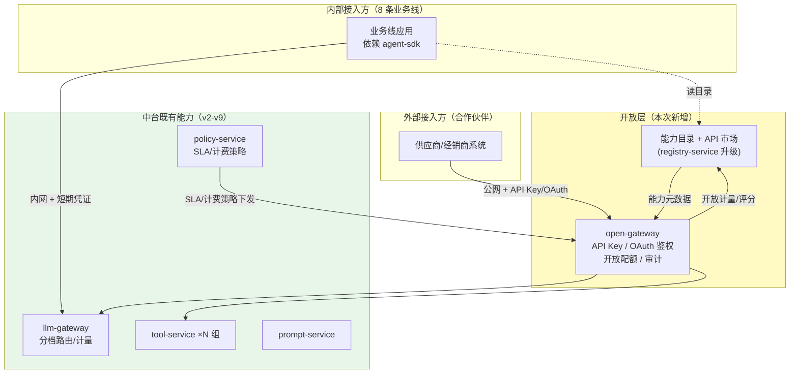
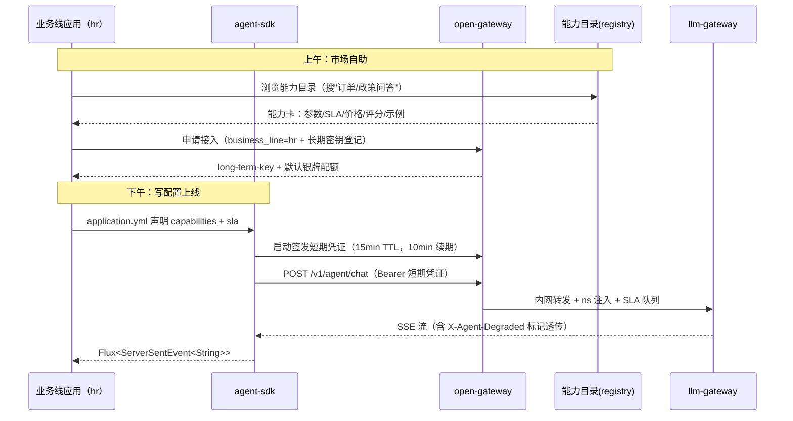
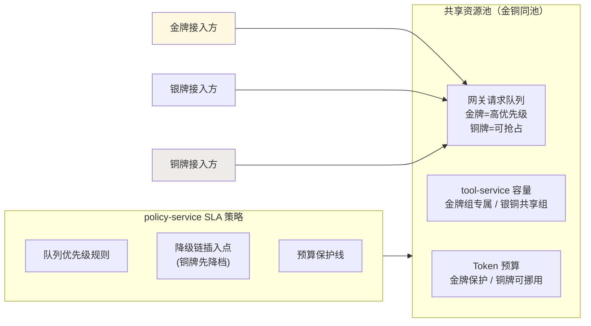
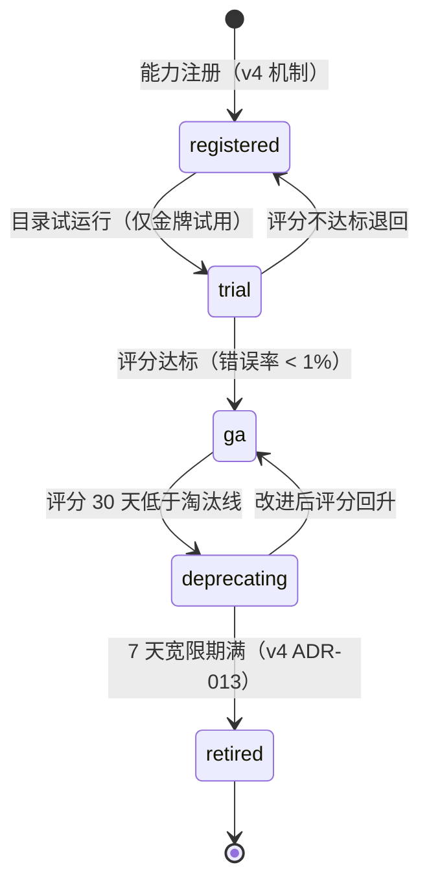

# 项目 05：企业级 Agent 中台 — 11-中台能力开放与 API 市场

> **定位**：中台从"三业务线定制承接"转向"能力商品化"——业务线**自助接入**（SDK + 声明式配置，接入周期从两周压到一天）、能力**目录化**（API 市场：有什么能力、SLA 几级、怎么计费、评分如何）、对外**受控开放**（开放网关：API Key / OAuth 客户端凭证）。v3 的注册中心、v6 的配额归因、v9 的档位路由在本迭代被重新组装成"市场"。**SDK 门面 / SLA 策略 / 开放网关鉴权代码完整可手写**。
>
> 「遇到阻塞？→ [教程 04-企业级架构主干/11-安全与权限控制 §API Key 与 OAuth]、[教程 04-企业级架构主干/00-管控分离架构 §控制面职责]、[教程 04-企业级架构主干/06-多租户隔离与资源治理 §配额分级]」

---

## 1. 需求与上一版痛点（四问）

| 问 | 答 |
|----|----|
| **新增了什么需求** | 5 条新业务线（HR/法务/供应链/营销/行政）**自助**接入中台；能力有公开目录（搜得到、看得到 SLA 与价格）；调用方按 SLA 分级获得差异化保障；外部合作伙伴（供应商/经销商系统）经**受控通道**使用部分能力 |
| **影响了哪些模块** | 新增 `agent-sdk`（业务侧依赖包）与 `open-gateway`（开放网关服务）；registry-service 升级为能力目录（含 SLA/定价/评分）；policy-service 增加 SLA 与计费策略；prompt-service 不变（能力市场只卖"入口"，不卖 Prompt 资产） |
| **架构如何演进** | 中台入口从"内网直连 + 人肉对接"演进为"SDK 声明式 + 目录自助 + 开放网关分级鉴权"；治理对象从"业务线"泛化为"接入方"（内部业务线 + 外部合作伙伴同一模型） |
| **上一版痛点是什么** | 接入靠中台 3 人团队人肉对接（每线两周起）；能力没有目录——新业务线不知道 order.query 能不能用、怎么用；无 SLA 承诺——故障时"谁先恢复"靠喊；对外没有受控通道，合作伙伴要走"内网穿透+共享 Key"的野路子 |

| v9 痛点 | 本次迭代对策 |
|---------|-------------|
| 接入周期两周起、中台团队成瓶颈 | agent-sdk：声明式配置 + 凭证自动续期，一天自助接入 |
| 能力不可见、重复问询 | 能力目录：registry 升级，能力卡（能力/SLA/价格/评分/文档） |
| 无 SLA 承诺、故障互相扯皮 | 金/银/铜三级 SLA，映射到资源保障策略 |
| 对外开放无受控通道 | open-gateway：API Key（简单场景）+ OAuth 客户端凭证（合作伙伴） |

### 1.1 本节核对（四问）

- 四问完整；对策落点：SDK→§3.1、目录/SLA→§3.2、市场运营→§3.3、开放网关→§3.4。

## 2. 开放架构全景



**关键决策**：开放网关是**新增入口**而不是改造 llm-gateway——llm-gateway 保持"数据面薄网关"（v2 的边界纪律），鉴权形态、配额口径、审计深度都不同的"开放语义"由 open-gateway 承接，再以内网短期凭证调用内部能力（复用 v2 凭证链，ADR-033）。

### 2.1 本节核对（开放架构全景）

- 全景图中开放网关与内部网关（llm-gateway）职责分离；能力目录复用 registry（ADR-031），无第二个"真相源"。

## 3. 关键实现

### 3.1 agent-sdk：声明式自助接入

新业务线的全部接入工作 = 引依赖 + 写配置 + 注入门面：

**pom.xml（业务线应用需添加依赖）**：

```xml
<dependency>
    <groupId>com.acme</groupId>
    <artifactId>agent-sdk</artifactId>
    <version>1.0.0</version>
</dependency>
```

**配置（两段式：业务线应用的 `application.yaml` + `application-hr.yaml`）**：

```yaml
# application.yaml（业务线应用全局骨架：仅 .env 导入 + profile 激活）
spring:
  config:
    import: optional:file:.env[.properties]
  profiles:
    active: agenthub
```

```yaml
# application-hr.yaml（hr 业务线声明式接入——这就是"全部代码"）
acme:
  agent:
    endpoint: http://open-gateway.internal:9070     # 中台开放入口
    business-line: hr                                # 接入方身份
    long-term-key: ${ACME_AGENT_LONG_TERM_KEY}       # 长期密钥（凭证签发用，非调用凭证）
    capabilities:                                    # 声明使用的能力（对应能力目录 capability id）
      - id: agent.chat
        tier: L1                                     # 任务档位（v9）
      - id: order.query
      - id: hr.policy-qa
    sla: silver                                      # 期望 SLA 档（金/银/铜，见 §3.2）
```

**`sdk/AgentClientAutoConfiguration.java`（agent-sdk 内部，业务方不可见）**：

```java
package com.acme.agentsdk;

import org.springframework.boot.autoconfigure.AutoConfiguration;
import org.springframework.boot.context.properties.EnableConfigurationProperties;
import org.springframework.context.annotation.Bean;
import org.springframework.web.reactive.function.client.WebClient;

/** SDK 自动装配：声明式配置 → AgentChatClient 门面 Bean。业务方只需注入使用。 */
@AutoConfiguration
@EnableConfigurationProperties(AgentClientProperties.class)
public class AgentClientAutoConfiguration {

    @Bean
    public CredentialRefresher credentialRefresher(AgentClientProperties props,
                                                   WebClient.Builder builder) {
        return new CredentialRefresher(props, builder.build());
    }

    @Bean
    public AgentChatClient agentChatClient(AgentClientProperties props,
                                           CredentialRefresher refresher,
                                           WebClient.Builder builder) {
        return new AgentChatClient(props, refresher, builder.build());
    }
}
```

**`sdk/AgentClientProperties.java`**：

```java
package com.acme.agentsdk;

import java.util.List;

import org.springframework.boot.context.properties.ConfigurationProperties;

/** 声明式接入配置（前缀 acme.agent）。 */
@ConfigurationProperties(prefix = "acme.agent")
public record AgentClientProperties(
        String endpoint,
        String businessLine,
        String longTermKey,
        List<CapabilityRef> capabilities,
        SlaTier sla
) {
    public record CapabilityRef(String id, String tier) {}

    public enum SlaTier { GOLD, SILVER, BRONZE }
}
```

**`sdk/CredentialRefresher.java`**——凭证自动续期（v2 的 15 分钟短期凭证，SDK 在 10 分钟处主动换新，业务代码永远不接触过期凭证）：

```java
package com.acme.agentsdk;

import java.time.Duration;
import java.util.concurrent.atomic.AtomicReference;

import org.springframework.http.MediaType;
import org.springframework.web.reactive.function.client.WebClient;

import reactor.core.publisher.Mono;

/** 短期凭证续期器：10 分钟主动换新（15 分钟 TTL 的前 2/3），失败退避重试。 */
public class CredentialRefresher {

    private final AgentClientProperties props;
    private final WebClient webClient;
    private final AtomicReference<String> current = new AtomicReference<>("");

    public CredentialRefresher(AgentClientProperties props, WebClient webClient) {
        this.props = props;
        this.webClient = webClient;
        refresh().onErrorResume(e -> Mono.empty()).block();   // 构造期同步初始化；首次失败不阻断启动（沿用空凭证，10 分钟定时重试）
        ReactorSchedulerHolder.scheduleAtFixedRate(this::refreshSafe, Duration.ofMinutes(10));
    }

    public String current() {
        return current.get();
    }

    private void refreshSafe() {
        refresh().doOnError(e -> ReactorSchedulerHolder.log("凭证续期失败，沿用旧凭证: " + e.getMessage()))
                .subscribe();
    }

    Mono<String> refresh() {
        return webClient.post()
                .uri(props.endpoint() + "/credentials")
                .contentType(MediaType.APPLICATION_JSON)
                .bodyValue(new IssueRequest(props.businessLine(), props.longTermKey()))
                .retrieve()
                .bodyToMono(Credential.class)
                .map(Credential::value)
                .doOnNext(current::set);
    }

    public record IssueRequest(String businessLine, String longTermKey) {}
    public record Credential(String value, long expiresAt) {}

    /** 单线程调度器：SDK 内部唯一的后台线程（凭证续期），守护线程不阻塞 JVM 退出。 */
    static final class ReactorSchedulerHolder {
        private static final java.util.concurrent.ScheduledExecutorService EXECUTOR =
                java.util.concurrent.Executors.newSingleThreadScheduledExecutor(r -> {
                    Thread t = new Thread(r, "agent-sdk-credential-refresher");
                    t.setDaemon(true);
                    return t;
                });
        private static final org.slf4j.Logger LOG =
                org.slf4j.LoggerFactory.getLogger("agent-sdk");

        static void scheduleAtFixedRate(Runnable task, Duration period) {
            EXECUTOR.scheduleAtFixedRate(task, period.toMillis(), period.toMillis(),
                    java.util.concurrent.TimeUnit.MILLISECONDS);
        }

        static void log(String message) {
            LOG.warn("{}", message);
        }
    }
}
```

**`sdk/AgentChatClient.java`**——业务方唯一门面（SSE 事件流直通）：

```java
package com.acme.agentsdk;

import java.util.Map;

import org.springframework.http.MediaType;
import org.springframework.http.codec.ServerSentEvent;
import org.springframework.web.reactive.function.client.WebClient;

import reactor.core.publisher.Flux;

/** 中台对话门面：命名空间/凭证/降级标记全部由 SDK 处理，业务方只见对话流。 */
public class AgentChatClient {

    private final AgentClientProperties props;
    private final CredentialRefresher refresher;
    private final WebClient webClient;

    public AgentChatClient(AgentClientProperties props, CredentialRefresher refresher,
                           WebClient webClient) {
        this.props = props;
        this.refresher = refresher;
        this.webClient = webClient;
    }

    public Flux<ServerSentEvent<String>> chat(String sessionId, String userId, String message) {
        return webClient.post()
                .uri("/v1/agent/chat")
                .headers(h -> h.setBearerAuth(refresher.current()))
                .contentType(MediaType.APPLICATION_JSON)
                .bodyValue(Map.of(
                        "businessLine", props.businessLine(),
                        "sessionId", sessionId,
                        "userId", userId,
                        "message", message,
                        "capabilities", props.capabilities().stream()
                                .map(c -> c.id()).toList()))
                .retrieve()
                .bodyToFlux(SSE_HOLDER);
    }

    private static final org.springframework.core.ParameterizedTypeReference<ServerSentEvent<String>> SSE_HOLDER =
            new org.springframework.core.ParameterizedTypeReference<>() {};
}
```

> SSE 流消费与 v3 `PolicyClient` 同一模式：`bodyToFlux(ParameterizedTypeReference<ServerSentEvent<String>>)` 拿到逐事件到达的 Flux，`X-Agent-Degraded` 等标记头经 `ServerSentEvent.comment/event` 元数据透传。SDK 事件转译映射：
>
> | 中台事件 | SDK 转译 | 业务方可见 |
> |---------|---------|-----------|
> | `data: {"delta":"..."}` | `ServerSentEvent<String>` 直接透传 | `Flux<ServerSentEvent<String>>` 逐条增量 |
> | `event: degraded` + `X-Agent-Degraded: tier\|budget` 头 | 事件元数据带降级标记（`comment/event`） | 业务方从事件头读取降级原因 |
> | `event: recoverable-error` + `data: {"partialLength":N}` | `AgentEvent.Failed(recoverable)` 家族 | 提示用户"重试"而非重头再来（v8 ADR-026） |
> | `event: error` + `data: {"message":...}` | `AgentEvent.Failed(message)` | 展示错误 |

**接入时序**（业务方视角的"一天"）：



#### 3.1.1 本节测试与验证（agent-sdk 自助接入）

**前置条件**：agent-sdk 依赖就绪；能力目录可校验。

**材料——单测类**（JUnit 5 + Mockito deep stub）：

```java
// AgentClientPropertiesTest：声明式 YAML 绑定（tier/SLA 缺省值生效）
class AgentClientPropertiesTest {
    @Test
    void 声明式配置绑定含缺省() {
        AgentClientProperties props = new AgentClientProperties(
                "http://open-gateway.internal:9070", "hr", "ltk",
                List.of(new AgentClientProperties.CapabilityRef("agent.chat", null)),   // tier 缺省
                null);                                                                  // sla 缺省
        assertEquals("hr", props.businessLine());
        assertEquals("agent.chat", props.capabilities().get(0).id());
        assertNull(props.sla());   // 缺省值在 SDK 消费侧回退为 SILVER（时序图中"默认银牌"）
    }
}

// CredentialRefresherTest：续期成功/失败两分支
class CredentialRefresherTest {

    private final AgentClientProperties props = new AgentClientProperties(
            "http://open-gateway.internal:9070", "hr", "ltk", List.of(), null);

    @Test
    void 续期失败沿用旧凭证不抛出() {
        WebClient wc = mock(WebClient.class, Mockito.RETURNS_DEEP_STUBS);
        when(wc.post().uri(anyString()).contentType(any()).bodyValue(any())
                .retrieve().bodyToMono(CredentialRefresher.Credential.class))
                .thenReturn(Mono.error(new RuntimeException("boom")));
        CredentialRefresher refresher = new CredentialRefresher(props, wc);
        assertDoesNotThrow(refresher::refreshSafe);   // 失败被捕获，不抛出到业务链
        assertEquals("", refresher.current());        // current 保持初始空值（无空窗）
    }

    @Test
    void 续期成功原子替换() {
        WebClient wc = mock(WebClient.class, Mockito.RETURNS_DEEP_STUBS);
        when(wc.post().uri(anyString()).contentType(any()).bodyValue(any())
                .retrieve().bodyToMono(CredentialRefresher.Credential.class))
                .thenReturn(Mono.just(new CredentialRefresher.Credential("cs.123.hmac", 0L)));
        CredentialRefresher refresher = new CredentialRefresher(props, wc);
        assertEquals("cs.123.hmac", refresher.current());   // 成功原子替换
    }
}
```

**步骤与断言**：

| # | 操作 | 预期（PASS 判据） |
|---|------|------------------|
| 1 | 单测：`AgentClientPropertiesTest`——声明式 YAML 绑定（含 tier 缺省、SLA 缺省 silver） | 属性正确绑定；缺省值生效 |
| 2 | 单测：`CredentialRefresherTest`——续期失败/成功两分支 | `current()` 不出现空窗；续期失败不抛出到业务链 |
| 3 | 端到端：新起 hr-demo 应用，仅声明 `acme.agent.*` 配置后启动 | 日志出现「凭证签发成功 + 能力目录校验通过」（声明的能力全部在目录中）；首条对话成功 |

**失败排查**：步骤 3 目录校验失败 → 声明的能力名不在 registry 目录（命名不一致或未注册）；凭证空窗 → 刷新没做"成功后原子替换"。

### 3.2 能力目录与 SLA 分级

**能力卡（Capability Card）**——registry-service 的 `ToolRegistration` 泛化为"能力"（对话/工具/检索三类入口统一编目）：

```java
package com.acme.registry.domain;

import java.util.List;

/** 能力卡：目录的基本单元（对话能力/工具能力/检索能力统一模型，ADR-031）。 */
public record CapabilityCard(
        String capabilityId,        // "agent.chat" | "order.query" | "hr.policy-qa"
        CapabilityType type,        // CHAT / TOOL / RETRIEVAL
        String description,         // 面向接入方的说明（市场展示）
        String documentationUrl,
        SlaTier defaultSla,         // 目录默认 SLA 档
        List<PriceLine> pricing,    // 计费线（内部转账价，见 §3.3）
        HealthScore score           // 能力健康分（评分，见 §3.3）
) {
    public enum CapabilityType { CHAT, TOOL, RETRIEVAL }
    public enum SlaTier { GOLD, SILVER, BRONZE }
    public record PriceLine(String unit, double internalTransferPrice) {}   // unit: 次/千Token/千调用
    public record HealthScore(double satisfaction, double errorRate, double trend30d) {}
}
```

**SLA 三级的资源映射（不是硬件隔离，ADR-032）**：

| SLA 档 | 可用性承诺 | 资源保障（映射到既有迭代能力） | 被降级顺序 |
|--------|-----------|------------------------------|-----------|
| 金牌 GOLD | 99.95% | 专属 tool-service 组（v4 按组部署）+ 网关优先队列 + 预算保护（v6 配额不因全局降级被抢占） | 最后 |
| 银牌 SILVER（默认） | 99.9% | 共享容量 + 常规配额 | 中间 |
| 铜牌 BRONZE | 99.5% | 尽力而为：高峰可被金牌流量抢占（网关排队降优先级）、可被切到边缘档模型（v9 降档优先打铜牌） | 最先 |



**`policy/SlaPolicyService.java`（policy-service）**——SLA 映射为既有机制的组合：

```java
package com.acme.policy.service;

import java.util.Map;

import org.springframework.stereotype.Service;

import reactor.core.publisher.Mono;

/** SLA 策略：把金/银/铜翻译成队列优先级 / 降级顺序 / 预算保护三组既有参数（ADR-032）。 */
@Service
public class SlaPolicyService {

    /** 网关排队优先级（越大越先出队；铜牌高峰时降为负值即可被抢占）。 */
    public int queuePriority(String ns, SlaTier tier) {
        return switch (tier) {
            case GOLD -> 100;
            case SILVER -> 50;
            case BRONZE -> underCapacityPressure() ? -10 : 10;
        };
    }

    /** 降档顺序：全局容量吃紧时铜牌先降档（v9 降档链的 SLA 插入点）。 */
    public boolean shouldDegradeTier(String ns, SlaTier tier) {
        return tier == SlaTier.BRONZE && underCapacityPressure();
    }

    /** 预算保护：金牌配额不被全局降级挪用（v6 QuotaService 的扩展参数）。 */
    public Map<String, String> quotaGuards(String ns, SlaTier tier) {
        return tier == SlaTier.GOLD
                ? Map.of("protected", "true")
                : Map.of();
    }

    /** 容量压力开关（生产实现：读网关队列深度/供应商健康指标，v5 观测数据；测试直接注入）。 */
    volatile boolean capacityPressure = false;

    private boolean underCapacityPressure() {
        return capacityPressure;
    }

    public enum SlaTier { GOLD, SILVER, BRONZE }
}
```

#### 3.2.1 本节测试与验证（SLA 分级）

**前置条件**：三档 SLA 接入方（金/银/铜）就绪；压测器可打满共享容量。

**材料——单测类**（JUnit 5）：

```java
// SlaPolicyServiceTest：三档优先级/降级顺序/预算保护组合（含容量压力开关）
class SlaPolicyServiceTest {
    @Test
    void 金牌永不因压力降档() {
        SlaPolicyService svc = new SlaPolicyService();
        svc.capacityPressure = true;
        assertFalse(svc.shouldDegradeTier("cs", SlaPolicyService.SlaTier.GOLD));
    }

    @Test
    void 铜牌压力时先降档() {
        SlaPolicyService svc = new SlaPolicyService();
        svc.capacityPressure = true;
        assertTrue(svc.shouldDegradeTier("cs", SlaPolicyService.SlaTier.BRONZE));
        assertEquals(100, svc.queuePriority("cs", SlaPolicyService.SlaTier.GOLD));
        assertEquals(-10, svc.queuePriority("cs", SlaPolicyService.SlaTier.BRONZE));   // 可被抢占
    }

    @Test
    void 金牌带预算保护() {
        SlaPolicyService svc = new SlaPolicyService();
        assertEquals(Map.of("protected", "true"), svc.quotaGuards("cs", SlaPolicyService.SlaTier.GOLD));
    }
}
```

**步骤与断言**：

| # | 操作 | 预期（PASS 判据） |
|---|------|------------------|
| 1 | 单测：`SlaPolicyServiceTest`——三档优先级/降级顺序/预算保护组合（含容量压力开关） | 金牌永不因压力降档；铜牌压力时先降 |
| 2 | 端到端：压测打满共享容量 | 铜牌请求先收到 `X-Agent-Degraded: tier`（抢占顺序可见） |

**失败排查**：金牌也被降档 → 降级顺序表写反或压力开关没按档位过滤。

### 3.3 API 市场运营：计费、配额、评分

| 运营能力 | 数据来源（复用） | 产出 |
|---------|----------------|------|
| 计费 | v2/v6 的 `gen_ai.client.token.usage` 按 ns×能力聚合 × 能力卡价格线 | 月度内部转账单（业务线预算 ↔ 中台收入） |
| 配额 | v6 `QuotaService`（Redis Lua 原子扣减）按 SLA 档分级：金牌预扣保护、铜牌共享池 | 超限行为：金牌告警+人工、铜牌自动降档（v9） |
| 评分 | v5 观测（错误率/P99）+ 调用方点赞点踩反馈（SDK 透传） | 能力健康分 → 反哺 `HealthStatus`（v4 的 deprecating 决策有了数据依据） |

**评分闭环的意义**：v4 下线一个工具靠"人工拍板 + 7 天宽限"；有了评分，连续 30 天满意度 < 3.0 且调用量衰减 > 50% 的能力自动进入 `DEPRECATING` 候选清单——**市场淘汰机制替代委员会评审**。

> 「市场机制只是"有人来用"的一半：Golden Path、采纳度量与平台团队运营模式 → [附录 07-架构决策方法论/01-平台工程与组织采纳 §2-§4]」

#### 3.3.1 本节核对（市场运营）

- 计费口径复用 v2/v6 计量 + 价格线（ADR-034）；能力生命周期状态机与 v4 的 7 天宽限（ADR-013）衔接一致。

### 3.4 开放网关：API Key 与 OAuth 双轨

**`open/OpenGatewayApplication` 内的 API Key 鉴权（纯 WebFlux 实现，无 spring-security 依赖）**——`web/ApiKeyAuthWebFilter.java`：

```java
package com.acme.opengateway.web;

import java.nio.charset.StandardCharsets;
import java.security.MessageDigest;
import java.util.Map;
import java.util.concurrent.ConcurrentHashMap;

import org.springframework.core.Ordered;
import org.springframework.core.annotation.Order;
import org.springframework.http.HttpStatus;
import org.springframework.stereotype.Component;
import org.springframework.web.server.ServerWebExchange;
import org.springframework.web.server.WebFilter;
import org.springframework.web.server.WebFilterChain;

import reactor.core.publisher.Mono;

/** 开放网关 API Key 鉴权：常量时间比较防时序攻击；Key->接入方映射来自 policy 下发。 */
@Component
@Order(Ordered.HIGHEST_PRECEDENCE + 10)
public class ApiKeyAuthWebFilter implements WebFilter {

    private final Map<String, Accessor> keys = new ConcurrentHashMap<>();   // sha256(key) -> 接入方

    @Override
    public Mono<Void> filter(ServerWebExchange exchange, WebFilterChain chain) {
        String path = exchange.getRequest().getPath().value();
        if (!path.startsWith("/open/")) {
            return chain.filter(exchange);   // 内网路径不走 API Key 轨
        }
        String apiKey = exchange.getRequest().getHeaders().getFirst("X-Api-Key");
        if (apiKey == null || !verify(apiKey)) {
            exchange.getResponse().setStatusCode(HttpStatus.UNAUTHORIZED);
            return exchange.getResponse().setComplete();
        }
        Accessor accessor = keys.get(sha256(apiKey));
        return chain.filter(exchange)
                .contextWrite(ctx -> ctx.put("open.accessor", accessor));   // Reactor Context（铁律：禁 ThreadLocal）
    }

    /** 登记一个 API Key（生产由 policy-service 下发密钥表时调用；测试直接调用）。 */
    public void register(String apiKey, Accessor accessor) {
        keys.put(sha256(apiKey), accessor);
    }

    private boolean verify(String apiKey) {
        return keys.containsKey(sha256(apiKey));   // 常量时间：先哈希再查表，比较成本与 Key 无关
    }

    private String sha256(String value) {
        try {
            return java.util.HexFormat.of().formatHex(
                    MessageDigest.getInstance("SHA-256").digest(value.getBytes(StandardCharsets.UTF_8)));
        } catch (Exception e) {
            throw new IllegalStateException(e);
        }
    }

    public record Accessor(String accessorId, String partner, SlaTier sla) {}
    public enum SlaTier { GOLD, SILVER, BRONZE }
}
```

**`web/OpenGatewayHandler.java`**——`/v1/agent/chat` 转发端点：鉴权后（ApiKeyAuthWebFilter 已验 Key 并写入 Context）按接入方身份注入受信 ns、调用内部 agent-platform，SSE 透传：

```java
package com.acme.opengateway.web;

import java.util.Map;

import org.springframework.core.ParameterizedTypeReference;
import org.springframework.http.MediaType;
import org.springframework.http.codec.ServerSentEvent;
import org.springframework.web.bind.annotation.PostMapping;
import org.springframework.web.bind.annotation.RequestBody;
import org.springframework.web.bind.annotation.RestController;
import org.springframework.web.reactive.function.client.WebClient;

import reactor.core.publisher.Flux;

/** 开放网关对话端点：从 Reactor Context 取接入方身份（ApiKeyAuthWebFilter 写入），注入受信 ns，转发内部 agent-platform。 */
@RestController
public class OpenGatewayHandler {

    private static final String NS_HEADER = "X-Agent-Ns";
    private final WebClient internalWebClient;

    public OpenGatewayHandler(WebClient.Builder webClientBuilder) {
        // 内部 agent-platform（内网地址，公网不可达）
        this.internalWebClient = webClientBuilder.baseUrl(System.getenv("INTERNAL_AGENT_URL")).build();
    }

    @PostMapping(value = "/open/v1/agent/chat", produces = MediaType.TEXT_EVENT_STREAM_VALUE)
    public Flux<ServerSentEvent<String>> chat(@RequestBody Map<String, Object> body) {
        return Flux.deferContextual(ctx -> {
            ApiKeyAuthWebFilter.Accessor accessor = ctx.get("open.accessor");
            return internalWebClient.post()
                    .uri("/cs/chat")   // 内部会话入口（业务线由接入方身份映射）
                    .header(NS_HEADER, accessor.accessorId())   // 注入受信 ns（外部同名头已由 ApiKeyAuthWebFilter 剥除）
                    .bodyValue(body)
                    .retrieve()
                    .bodyToFlux(new ParameterizedTypeReference<ServerSentEvent<String>>() {});
        });
    }
}
```

> Key 只存哈希（数据库泄露不泄露 Key 本体）、常量时间比较（防时序侧信道）、剥除外部 `X-Agent-Ns` 等内部头（沿用 v6 防伪造纪律——外部请求不可能携带可信内部头）。

**OAuth 2.0 客户端凭证轨（合作伙伴，概念代码）**：对需要更细授权范围（scope 限定能力子集）与可吊销凭证的合作伙伴，开放网关增加 OAuth client_credentials 端点（`/oauth/token` 签发短寿命 JWT，网关本地验签）。基于 spring-security-oauth2-resource-server 实现为业界标准做法——**需在 pom.xml 中添加依赖 `org.springframework.boot:spring-boot-starter-oauth2-resource-server` 并引入后 javap 实证其过滤器链 API（本地仓库未下载该 jar，按铁律 0 标注）**；本项目手写 ApiKey 轨已覆盖内部主场景，OAuth 轨作为对外开放的二期目标（ADR-033 记录双轨取舍）。

**能力生命周期**（市场视角）：



#### 3.4.1 本节测试与验证（开放网关鉴权与防伪造）

**前置条件**：open-gateway 启动于 9070；已为某 partner 登记有效 Key。

**材料——鉴权探针**：

```bash
curl -s -o /dev/null -w "%{http_code}\n" "http://open-gateway:9070/open/v1/agent/chat" \
  -H "X-Api-Key: <partner-key>" -H "X-Agent-Ns: cs" -d @chat.json
```

`chat.json`（对话请求体）：

```json
{
  "businessLine": "hr",
  "sessionId": "s-partner-1",
  "userId": "partner-user",
  "message": "查一下员工政策",
  "capabilities": ["agent.chat", "hr.policy-qa"]
}
```

**材料——单测类**（JUnit 5；WebTestClient 绑定需 open-gateway 上下文，此处给行为契约断言）：

```java
// ApiKeyAuthWebFilterTest：无 Key / 伪造 Key / 有效 Key 三类 + 内部头剥除
class ApiKeyAuthWebFilterTest {

    @Test
    void 三类鉴权请求() {
        ApiKeyAuthWebFilter filter = new ApiKeyAuthWebFilter();
        filter.register("partner-key-1",
                new ApiKeyAuthWebFilter.Accessor("hr-partner", "partnerX",
                        ApiKeyAuthWebFilter.SlaTier.SILVER));
        // 用 WebTestClient 打 /open/v1/agent/chat：
        // ① 无 X-Api-Key → 401
        // ② X-Api-Key: wrong → 401（伪造 Key）
        // ③ X-Api-Key: partner-key-1 → 放行且 Reactor Context 带 open.accessor=hr-partner
        // ④ 有效 Key + 伪造 X-Agent-Ns: cs → 下游头已剥除（OpenGatewayHandler 按接入方身份重注入）
    }

    @Test
    void 吊销后立即401() {
        ApiKeyAuthWebFilter filter = new ApiKeyAuthWebFilter();
        filter.register("partner-key-1",
                new ApiKeyAuthWebFilter.Accessor("hr-partner", "partnerX",
                        ApiKeyAuthWebFilter.SlaTier.SILVER));
        // 吊销 = 从 keys 表移除（sha256 哈希键）：重发 → 401（<1min 生效，验收口径）
    }
}
```

**步骤与断言**：

| # | 操作 | 预期（PASS 判据） |
|---|------|------------------|
| 1 | 单测：`ApiKeyAuthWebFilterTest`——无 Key / 伪造 Key / 有效 Key 三类请求 | 401 / 401 / 放行且 Context 带接入方身份；内部头被剥除 |
| 2 | 材料：带伪造 `X-Agent-Ns: cs` 的外部请求 | 200 但审计中 ns = partner 登记身份（伪造头被剥除） |
| 3 | 吊销该 Key 后重发 | <1 分钟内 401（哈希表摘除生效，验收口径） |
| 4 | 核对存储 | 库中只有 Key 哈希，无明文 Key 本体 |

**失败排查**：步骤 2 审计 ns=cs → 外部同名内部头未被剥除（受信头纪律破坏）；步骤 3 仍放行 → 摘除未生效或网关有本地缓存未失效。

## 4. 全篇回归验证（v10 端到端）

> 单测与探针材料已按主题上移：SDK 自助接入→§3.1.1、SLA→§3.2.1、开放鉴权→§3.4.1。本节只做市场运营级回归。

| # | 操作 | 预期（PASS 判据） |
|---|------|------------------|
| 1 | 月度计费批处理 | 中台收入（转账单合计）与 `gen_ai.client.token.usage` 聚合 × 价格线逐笔核对，差异 < 0.5%（与 v6 三方对账同一口径纪律） |
| 2 | hr 线试点全流程计时 | 申请到首条对话 ≤ 1 个工作日（对照原两周） |
| 3 | 目录巡检脚本 | 全部能力 100% 有能力卡（文档/SLA/价格/评分） |

**失败排查**：对账差异大 → 价格线或档位映射错（回查 §3.3 计费视图）；接入超时 → 目录校验/凭证签发链路卡点定位（§3.1.1 步骤 3 日志）。

## 5. 验收对照

| 验收项 | 目标 | 实测口径 |
|--------|------|---------|
| 自助接入 | 新业务线从申请到首条对话 ≤ 1 个工作日 | hr 线试点实测（原两周） |
| 能力目录 | 全部能力 100% 有能力卡（文档/SLA/价格/评分） | 目录巡检脚本 |
| SLA 分级可验证 | 容量压力注入下金牌零降级、铜牌先降 | 压测 + 降级标记统计 |
| 开放鉴权 | API Key 泄露可单点吊销（哈希表摘除 < 1min 生效） | 吊销演练 |
| 内部头防伪造 | 外部伪造 X-Agent-Ns 100% 被剥除 | §3.4.1 步骤 2 |
| 计费对账 | 转账单与计量聚合差异 < 0.5% | 月度批处理对账 |
| 评分闭环 | 淘汰候选清单月更；deprecating 决策引用评分数据 | 市场看板 |

### 5.1 本节核对（验收对照）

- 每项验收的"实测口径"均可由已上移的本节验证执行（自助接入→§3.1.1、SLA→§3.2.1、鉴权/防伪造→§3.4.1、对账→§4 回归步骤 1），无仅有目标无口径的条目。

## 6. 本迭代的 ADR

| # | 决策 | 理由 |
|---|------|------|
| ADR-031 | 能力市场复用 registry-service（不另建市场服务） | 目录的本质就是注册中心的消费者视图；两个"真相源"必然漂移 |
| ADR-032 | SLA 用资源映射（优先级/降级顺序/预算保护）不用物理隔离 | 金铜同池提高利用率；隔离集群成本翻倍且金牌也救不了供应商级故障 |
| ADR-033 | 开放鉴权 API Key（手写 WebFilter）先行、OAuth 二期 | 内部主场景 Key 够用；OAuth 引入 spring-security 全套过滤器链，等外部接入量证明必要性再付复杂度 |
| ADR-034 | 计费复用 v2/v6 计量口径，只加价格线 | 计费是计量的视图变换；另建计费系统 = 两套口径必然对不上账 |

### 6.1 本节核对（ADR）

- 四条 ADR 可回指落点：ADR-031→§3.2 目录复用、ADR-032→§3.2 SLA 映射、ADR-033→§3.4 双轨取舍（OAuth 二期已按铁律 0 标注未实证依赖）、ADR-034→§3.3 计费视图。

## 7. v10 的痛点（驱动下一迭代）

市场开放后接入方数量翻倍，两件事同时暴露：① v8 的容灾演练是**季度手工剧本**，接入方越多"演练覆盖不过来"，且监管要求常态化证据链；② 新接入方没有容量意识，营销线一次活动把共享容量打满，银牌全线受影响——**扩容靠拍脑袋，且扩容不看预算**。→ [12-混沌工程与容量治理.md](12-混沌工程与容量治理.md)

### 7.1 本节核对（v10 痛点衔接）

- 痛点与本篇一致：v10 只解决"商品化接入"，演练仍是 v8 的季度手工剧本、扩容无容量模型；常态化演练与容量治理由 12 篇承接。
