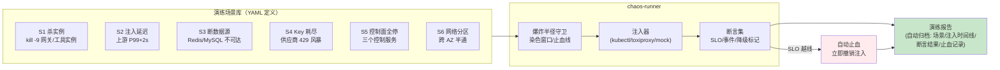
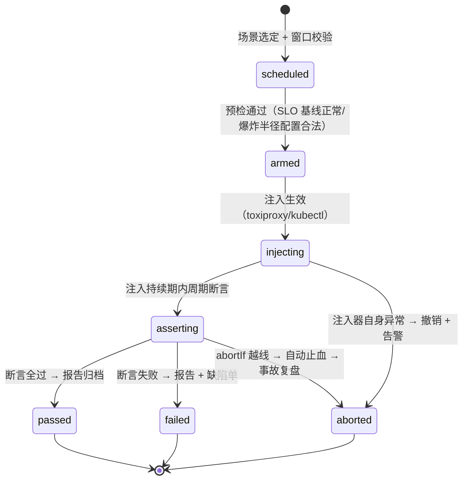
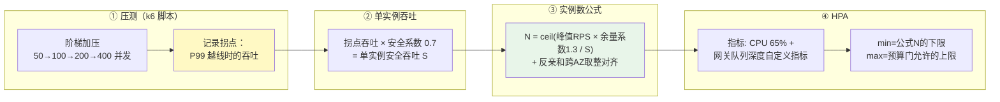
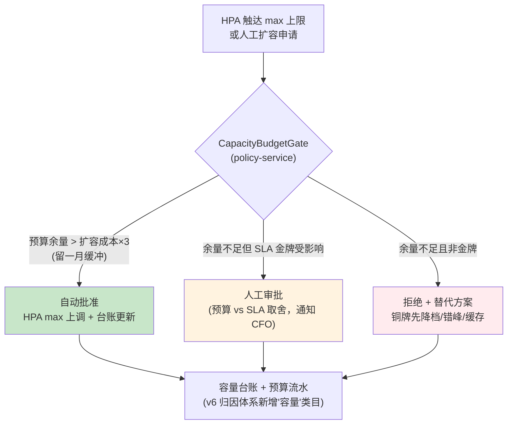

# 项目 05：企业级 Agent 中台 — 12-混沌工程与容量治理

> **定位**：把 v8 的"季度手工容灾演练"升级为**演练场景库 + 爆炸半径控制 + CI 常态化**的混沌工程体系；把"拍脑袋扩容"升级为**压测 → 单实例吞吐 → 实例数公式 → HPA** 的容量模型，并让扩容与预算联动（成本-容量闭环）。**演练场景定义 / 爆炸半径守卫 / 容量预算门代码完整可手写**。
>
> 「遇到阻塞？→ [教程 30-容错与弹性设计 全篇]、[教程 33-部署与运维 §HPA 与容量规划]、[教程 27-成本治理与Token计量 §预算与归因]」

---

## 1. 需求与上一版痛点（四问）

| 问 | 答 |
|----|----|
| **新增了什么需求** | 演练从"季度手工剧本"升级为场景库（杀实例/注入延迟/断数据源/Key 耗尽/控制面全停等）且可进 CI 常态回归；每场演练有爆炸半径约束与自动止血；容量规划有模型（压测数据支撑的实例数公式 + HPA 自动伸缩）；扩容动作过预算门（成本-容量联动） |
| **影响了哪些模块** | 新增 `chaos-runner`（演练执行器，测试侧工件）；open-gateway 与 agent-platform 增加流量染色守卫；policy-service 增加 `CapacityBudgetGate`（容量预算门）；观测平面增加演练看板 |
| **架构如何演进** | 韧性保障从"事件驱动"（出了事再演练）转为"持续验证"（演练进 CI，架构不变式随时可证）；容量从"运维经验"转为"数据模型"；成本与容量从两个部门的两张表转为一个预算门 |
| **上一版痛点是什么** | 演练靠人肉执行剧本，季度一次、不回归（剧本本身会腐化）；无爆炸半径控制（演练惊吓生产）；容量无模型（大促扩容拍脑袋，事后发现多扩 40%）；扩容不看预算（成本月报才发现超支） |

| v10 痛点 | 本次迭代对策 |
|---------|-------------|
| 演练季度一次、剧本不回归、无证据链 | 场景库 as code + CI 常态抽样回归 + 演练报告自动归档 |
| 演练惊吓生产（无爆炸半径） | 流量染色 + 演练窗口 + SLO 越线自动止血 |
| 容量拍脑袋、多扩 40% | 压测→单实例吞吐→实例数公式→HPA 的容量模型 |
| 扩容不看预算 | CapacityBudgetGate：扩容请求先过预算余量检查 |

### 1.1 本节核对（四问）

- 四问完整；对策落点：演练体系→§2、容量模型/预算门→§3。

## 2. 混沌工程体系

### 2.1 演练场景库

v8 的四个剧本（AZ 断电/供应商断网/控制面全停/DB 切换）泛化为**场景即代码**的场景库，每场演练 = 场景定义 + 注入器 + 断言集 + 爆炸半径：



**场景定义（`chaos/scenarios/s4-key-exhaustion.yaml`）**：

```yaml
scenarioId: S4-key-exhaustion
title: 供应商 Key 耗尽（429 风暴）
objective: 验证 Key 池分摊、摘除恢复与降级链（v9 能力）在 429 风暴下的行为
blastRadius:                       # 爆炸半径（见 §2.2）
  trafficFilter: "chaos=true"      # 只影响染色流量
  namespaces: ["cs-chaos"]         # 只影响演练命名空间
  window: "02:00-02:30 +08:00"     # 低峰窗口
injection:
  type: upstream-429
  target: supplier=deepseek
  rate: 100%                       # 全部请求返回 429
  duration: 10m
assertions:                        # 断言集（全部可 PromQL 化）
  - id: availability
    query: 'sum(rate(gateway.llm.requests{ns="cs-chaos",code!~"5.."}[1m])) / sum(rate(gateway.llm.requests{ns="cs-chaos"}[1m]))'
    expect: ">= 0.99"              # 池分摊下降级链兜住，成功率不塌
  - id: degraded-visible
    query: 'sum(increase(gateway.llm.degraded.replay{ns="cs-chaos"}[10m]))'
    expect: "> 0"                  # 降级发生了且被计量（错误路径口径，v9）
  - id: no-cascade
    query: 'sum(rate(gateway.llm.requests{ns!="cs-chaos",code=~"5.."}[1m]))'
    expect: "< 0.001"              # 非染色流量零波及（爆炸半径成立的证明）
abortIf:                           # 止血线（SLO 越线立即撤销注入）
  - query: 'sum(rate(gateway.llm.requests{ns!="cs-chaos",code=~"5.."}[1m]))'
    expect: "< 0.005"
```

**`chaos/Scenario.java`（chaos-runner 的场景模型）**：

```java
package com.acme.chaos;

import java.time.LocalTime;
import java.util.List;

/** 演练场景模型：与 YAML 一一对应（加载用 Jackson，略）。 */
public record Scenario(
        String scenarioId,
        String title,
        String objective,
        BlastRadius blastRadius,
        Injection injection,
        List<Assertion> assertions,
        List<Assertion> abortIf
) {
    public record BlastRadius(String trafficFilter, List<String> namespaces,
                              String window) {}

    public record Injection(String type, String target, String rate, String duration) {}

    public record Assertion(String id, String query, String expect) {}
}
```

**注入器的分工**（按注入类型选工具，非自研重造）：

| 注入类型 | 工具 | 说明 |
|---------|------|------|
| 杀实例 | `kubectl delete pod` / `kill -9` | 原生 |
| 上游延迟 / 429 / 超时 | **toxiproxy**（第三方，需自行引入 `github.com/shopify/toxiproxy`，与本仓库技术栈无 Maven 坐标——网络代理进程独立部署） | TCP 层注入延迟/带宽/拒绝 |
| 断数据源 | K8s NetworkPolicy 拒绝 + 防火墙规则 | 原生 |
| 控制面全停 | `kubectl scale --replicas=0` | 原生（v8 剧本 C 的自动化） |

### 2.2 爆炸半径控制

三条防线（缺一不可）：

1. **流量染色**：演练请求带 `X-Chaos-Request: <scenarioId>` 头，网关把染色标记写入 Reactor Context——**注入与断言只作用于染色流量**（toxiproxy 按 poisoned pool 只挂染色连接；断言的 PromQL 全部带 `ns="cs-chaos"` 过滤）。
2. **演练窗口**：低峰窗口外场景拒绝武装（`window` 字段校验）。
3. **自动止血**：`abortIf` 断言越线（非染色流量被波及）→ 立即撤销注入（`toxiproxy` 删 toxic / `kubectl` 恢复副本）+ 告警。

**`web/ChaosGuardWebFilter.java`（open-gateway / agent-platform 共用逻辑）**：

```java
package com.acme.opengateway.web;

import org.springframework.core.Ordered;
import org.springframework.core.annotation.Order;
import org.springframework.stereotype.Component;
import org.springframework.web.server.ServerWebExchange;
import org.springframework.web.server.WebFilter;
import org.springframework.web.server.WebFilterChain;

import reactor.core.publisher.Mono;

/** 演练染色守卫：把 X-Chaos-Request 标记写入 Reactor Context，下游全部据此分流。 */
@Component
@Order(Ordered.HIGHEST_PRECEDENCE + 20)
public class ChaosGuardWebFilter implements WebFilter {

    public static final String CHAOS_KEY = "chaos.scenario";

    @Override
    public Mono<Void> filter(ServerWebExchange exchange, WebFilterChain chain) {
        String scenario = exchange.getRequest().getHeaders().getFirst("X-Chaos-Request");
        if (scenario == null || scenario.isBlank()) {
            return chain.filter(exchange);   // 生产流量零开销
        }
        return chain.filter(exchange)
                .contextWrite(ctx -> ctx.put(CHAOS_KEY, scenario));
    }
}
```

**演练执行状态机**：



**`chaos/ChaosWatchdog.java`（chaos-runner）**——止血执行者：

```java
package com.acme.chaos;

import java.time.Duration;
import java.util.List;

import org.slf4j.Logger;
import org.slf4j.LoggerFactory;
import org.springframework.scheduling.annotation.Scheduled;
import org.springframework.stereotype.Component;
import org.springframework.web.reactive.function.client.WebClient;

/** 演练 watchdog：周期评估 abortIf 断言，越线立即撤销注入（止血优先于演练目标）。 */
@Component
public class ChaosWatchdog {

    private static final Logger log = LoggerFactory.getLogger(ChaosWatchdog.class);

    private final PrometheusClient prometheus;
    private final InjectionController injectionController;
    private volatile Scenario active;

    public ChaosWatchdog(PrometheusClient prometheus, InjectionController injectionController) {
        this.prometheus = prometheus;
        this.injectionController = injectionController;
    }

    public void arm(Scenario scenario) {
        this.active = scenario;
    }

    @Scheduled(fixedDelay = 15_000)
    void checkAbort() {
        Scenario scenario = active;
        if (scenario == null) {
            return;
        }
        for (Scenario.Assertion abort : scenario.abortIf()) {
            prometheus.query(abort.query(), Duration.ofMinutes(1))
                    .doOnNext(value -> {
                        if (!AssertionEvaluator.matches(value, abort.expect())) {
                            log.warn("[止血] {} 越线: {} 实测 {} 期望 {} —— 撤销注入",
                                    scenario.scenarioId(), abort.id(), value, abort.expect());
                            injectionController.revokeAll(scenario);   // 立即止血
                            active = null;
                        }
                    })
                    .subscribe();
        }
    }
}
```

> `PrometheusClient`（查 PromQL）与 `InjectionController`（封装 toxiproxy/kubectl 调用）是 chaos-runner 的两个适配器类，接口签名如上所用（实现为 WebClient 包装与 ProcessBuilder 封装，非本文重点，不展开）。`AssertionEvaluator.matches(String value, String expect)` 解析 `">= 0.99"` 形式的期望串（纯 Java，略）。

### 2.3 演练进 CI（ADR-035）

- **每周例行**：S1/S4（轻量场景，染色流量下杀单实例/429）在预发环境跑全量断言。
- **每次大版本前**：S5（控制面全停）+ 数据面不变式断言——v8 的 `ControlPlaneImmunityTest` 从"单测级别的混沌"升级为场景库的一个断言项，**架构纪律从文档变成随时可证的测试资产**（呼应 [09-核心代码讲解 §2.7]）。
- **报告归档**：每场演练产出场景/时间线/断言结果/止血记录，作为监管与集团审计的证据链。

### 2.4 本节测试与验证（混沌演练体系）

**前置条件**：chaos-runner 场景库（S1-S6）加载完成；ChaosGuard 三防线（染色守卫/watchdog/爆炸半径断言）上线。

**步骤与断言**：

| # | 操作 | 预期（PASS 判据） |
|---|------|------------------|
| 1 | 单测：`ChaosGuardWebFilterTest`——带/不带 `X-Chaos-Request` 头的请求 | 染色流量 Context 含 scenario；生产流量零写入 |
| 2 | 单测：`ChaosWatchdogTest`——abortIf 越线/正常两态（注入固定 PromQL 返回） | 越线时 revokeAll 恰好调用一次且 active 置空 |
| 3 | 单测：`ScenarioLoaderTest`——场景 YAML 全量加载 | 字段完整、window 可解析、expect 语法合法 |
| 4 | 场景库实测 S1（kill -9 单网关实例） | 染色流量成功率 ≥ 99%；非染色错误率增量 < 0.5% |
| 5 | 场景库实测 S2（toxiproxy 上游 +2s） | 降级链触发，染色 P99 < 8s；非染色零波及 |
| 6 | 场景库实测 S5（控制面三服务 scale 0） | 数据面 1 小时可用性 100%（v8 剧本 C 常态化） |
| 7 | 手动制造断言越线（把 expect 调到不可能值） | watchdog <30s 撤销注入并归档止血记录 |

**失败排查**：步骤 4 非染色被波及 → 爆炸半径断言/染色守卫缺口（ADR-036 三防线不齐）；步骤 7 不止血 → watchdog 周期过长或 revoke 调用未生效。

## 3. 容量模型

### 3.1 从压测到实例数公式



**WebFlux 服务的压测要点**（与 MVC 容量模型的本质差异）：吞吐瓶颈不在线程数（EventLoop 固定 = CPU 核数），而在**连接池**（WebClient 到上游的 maxConnections）、**堆内存**（流式缓冲）与**下游**（供应商限流）。压测要找的是"拐点"——P99 开始非线性劣化的并发位，不是"压到崩"。

**压测脚本（k6，示意）**：

```javascript
// chaos/load/gateway-ramp.js —— 网关容量压测：阶梯加压找拐点
import http from 'k6/http';
import { check, sleep } from 'k6';

export const options = {
  stages: [
    { duration: '2m', target: 50 },
    { duration: '2m', target: 100 },
    { duration: '2m', target: 200 },
    { duration: '2m', target: 400 },
  ],
  thresholds: { http_req_duration: ['p(99)<3000'] },   // 目标 P99 < 3s（SSE 首帧口径）
};

export default function () {
  const res = http.post(`${__ENV.GATEWAY_URL}/v1/chat/completions`,
    JSON.stringify({ model: 'default', messages: [{ role: 'user', content: '容量压测探针' }] }),
    { headers: { Authorization: `Bearer ${__ENV.CHAT_CREDENTIAL}`, 'Content-Type': 'application/json' } });
  check(res, { 'status 200': (r) => r.status === 200 });
  sleep(0.1);
}
```

**容量公式落表（容量台账，月度更新）**：

| 服务 | 单实例安全吞吐（实测） | 峰值 RPS（历史 × 增长） | 公式实例数 | 现状实例数 | 水位 |
|------|----------------------|------------------------|-----------|-----------|------|
| llm-gateway | 120 RPS @P99<3s | 350 | ceil(350×1.3/120)=4 | 3 | 超→触发扩容评审 |
| agent-platform | 80 RPS | 200 | 4 | 4 | 平 |
| tool-service(SQL组) | 45 RPS | 60 | 2 | 2 | 平 |
| open-gateway | 150 RPS | 90 | 1（AZ 对齐取 2） | 2 | 松 |

### 3.2 成本-容量联动：扩容预算门

扩容不是无条件的——**每实例都有月成本，扩容请求先过预算门**：



**`service/CapacityBudgetGate.java`（policy-service）**——复用 v6 的 Redis Lua 原子纪律（预留而非扣减，扩容失败可回滚预留）：

```java
package com.acme.policy.service;

import java.util.List;

import org.springframework.data.redis.core.ReactiveRedisTemplate;
import org.springframework.data.redis.core.script.DefaultRedisScript;
import org.springframework.data.redis.core.script.RedisScript;
import org.springframework.stereotype.Service;

import reactor.core.publisher.Mono;

/** 容量预算门：扩容前预留预算（Lua 原子，同 v6 ADR-020 的超卖纪律）。 */
@Service
public class CapacityBudgetGate {

    private static final String RESERVE_LUA = """
            local remaining = redis.call('GET', KEYS[1])
            if not remaining then return tonumber(ARGV[2]) end
            if tonumber(remaining) < tonumber(ARGV[1]) then return -1 end
            return redis.call('DECRBY', KEYS[1], ARGV[1])
            """;

    private final ReactiveRedisTemplate<String, String> reactiveRedis;
    private final RedisScript<Long> reserveScript;

    public CapacityBudgetGate(ReactiveRedisTemplate<String, String> reactiveRedis) {
        this.reactiveRedis = reactiveRedis;
        this.reserveScript = new DefaultRedisScript<>(RESERVE_LUA, Long.class);
    }

    /** 扩容请求：按月度实例成本预留预算；月度滚动窗口到期自动归还（对账任务略）。 */
    public Mono<GateDecision> tryReserve(String service, int addInstances, long costPerInstanceMonthly) {
        long reserveAmount = addInstances * costPerInstanceMonthly;
        return reactiveRedis.execute(reserveScript,
                        List.of("budget:capacity:" + service + ":" + java.time.YearMonth.now()),
                        List.of(String.valueOf(reserveAmount), "0"))
                .next()
                .map(result -> result >= 0
                        ? new GateDecision(true, result, reserveAmount)
                        : new GateDecision(false, 0, reserveAmount));
    }

    /** 扩容未执行（审批拒绝/HPA 回落）：归还预留。 */
    public Mono<Void> release(String service, long reserveAmount) {
        return reactiveRedis.opsForValue()
                .increment("budget:capacity:" + service + ":" + java.time.YearMonth.now(), reserveAmount)
                .then();
    }

    public record GateDecision(boolean approved, long remaining, long reserved) {}
}
```

> 注意 `tryReserve` 与 v6 `QuotaService.tryConsume` 的差别：预算门做**预留**（reserve，可归还），配额做**扣减**（consume，不可逆）——预留语义是扩容可回滚的前提（审批被拒要退回），这是容量与用量两类资源在资金语义上的本质差异。

### 3.3 月度容量评审

容量水位（公式 N / 现状 N）× 预算消耗率双维看板：水位 > 100% 且预算消耗率 > 90% 的服务进入"重评审"（要么预算、要么优化、要么 SLA 降档——把 [11] 的 SLA 分级变成容量谈判的筹码）。

### 3.4 本节测试与验证（容量模型与预算门）

**前置条件**：k6 压测脚本与 Redis 预算键就绪。

**步骤与断言**：

| # | 操作 | 预期（PASS 判据） |
|---|------|------------------|
| 1 | 单测：`CapacityBudgetGateTest`——余量充足/不足两态；预留后归还 | Lua 原子性（并发 200 预留不超卖）；归还后余量复原（零泄漏） |
| 2 | k6 阶梯压测（50→100→200→400 并发） | 得到 P99 越线拐点吞吐；按公式得单实例安全吞吐 S（拐点 × 0.7） |
| 3 | 公式预测大促实例数 vs 大促实测 | 误差 < 15% |
| 4 | HPA 压缩到预算门 max 后继续压测 | 「拒绝 + 铜牌降档」路径生效（扩容被门拦下并给出替代方案） |

**失败排查**：步骤 1 超卖 → 预留 Lua 与 v6 配额 Lua 混用（reserve 可归还/consume 不可逆，语义不能共用）；步骤 3 误差大 → 拐点识别或安全系数取值不当。

## 4. 全篇回归验证（v11 端到端）

> 材料已按主题上移：混沌单测与场景实测→§2.4、容量/预算门→§3.4。本节只做收束级回归。

| # | 操作 | 预期（PASS 判据） |
|---|------|------------------|
| 1 | 场景库 6 场景全部自动执行一轮（CI 季度全量） | 全部断言通过并产出证据链报告（监管口径） |
| 2 | 每周 CI 抽样 ≥ 2 场 | 流水线记录可查 |
| 3 | 月度容量评审看板 | 水位 × 预算消耗率双维可查；重评审清单有 SLA 降档/预算/优化三选决策记录 |

**失败排查**：CI 抽样失败 → 回查 §2.4 对应场景的排查项；看板数据缺失 → 容量台账未接入预算流水。

## 5. 验收对照

| 验收项 | 目标 | 实测口径 |
|--------|------|---------|
| 演练常态化 | 场景库 6 场景全部可自动执行；每周 CI 抽样 ≥ 2 场 | CI 流水线记录 |
| 爆炸半径 | 全部演练非染色流量错误率增量 < 0.5%；违规即止血 | `no-cascade` 断言 + 止血日志 |
| 止血时效 | abortIf 越线到注入撤销 < 30s | watchdog 周期 + 撤销时间戳 |
| 架构不变式 | S5 场景（控制面全停）数据面可用性 100% | 场景报告（v8 剧本 C 常态化） |
| 容量模型 | 公式预测 vs 大促实测误差 < 15% | 容量台账复盘 |
| 成本-容量联动 | 全部扩容过预算门；预算门拒绝时给出替代方案 | 预算流水 + 台账 |
| 预留可回滚 | 审批拒绝后预算余量复原（零泄漏） | `CapacityBudgetGateTest` 并发用例 |

### 5.1 本节核对（验收对照）

- 各验收口径均可由已上移验证执行：演练/止血/不变式→§2.4、容量/预算门→§3.4、常态化→§4 回归。

## 6. 本迭代的 ADR

| # | 决策 | 理由 |
|---|------|------|
| ADR-035 | 演练场景 as code + CI 常态抽样（季度全量） | 剧本会腐化；架构不变式（控制面免疫）没有回归测试就是口号 |
| ADR-036 | 爆炸半径用流量染色而非独立演练环境 | 独立环境永远滞后生产（版本/数据/负载三重漂移），染色在生产验证才有效；代价是守卫必须三防线齐备 |
| ADR-037 | 容量公式 + 预算预留门（可回滚），不做全自动无限扩缩 | 扩容是资金决策不是纯技术决策；预留语义保证审批拒绝可无损退回 |

### 6.1 本节核对（ADR）

- 三条 ADR 可回指落点：ADR-035→§2.3 CI 常态化、ADR-036→§2.1 染色守卫、ADR-037→§3.2 预算门。

## 7. v11 的痛点（驱动收束）

到本迭代为止，中台的**工程能力**已经闭环：拆分、治理、观测、隔离、灰度、容灾、路由成本、开放市场、混沌容量九大块齐备。但复盘 11 轮迭代留下的 37 条 ADR 散落在各篇的"本迭代的 ADR"小节里——**决策资产没有被系统化沉淀**（三个月后新人问"为什么 Push+Pull 双通道而不是上 Kafka"，要翻 5 篇文档才能拼出答案）；同时 2026 年行业对"生产级 Agent 平台"的标准又在快速抬升（Agent 治理栈、A2A 互操作、评估驱动开发）。前者靠一篇 ADR 总集收束，后者靠一篇前沿对照收官。→ [13-ADR架构决策记录.md](13-ADR架构决策记录.md)

### 7.1 本节核对（v11 痛点衔接）

- 痛点成立：37 条 ADR 确散落在 02-12 各篇"本迭代的 ADR"小节；总集（13 篇）与前沿收官（14 篇）确实存在且编号衔接。
