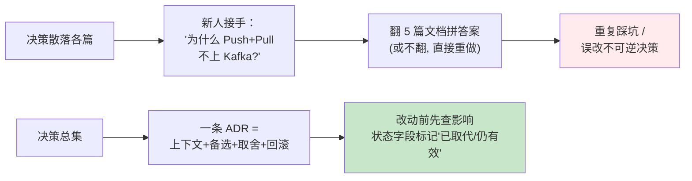
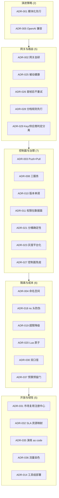
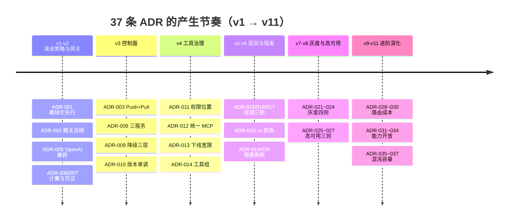
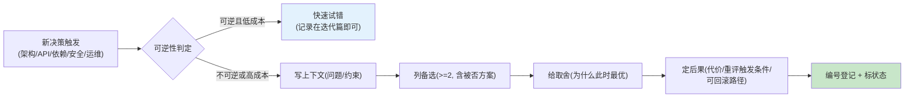

# 项目 05：企业级 Agent 中台 — 13-ADR 架构决策记录

> **定位**：把项目 05 从 00 到 12 的全部架构决策收束成**决策资产总集**——37 条 ADR（ADR-001 ~ ADR-037），每条含决策上下文 / 备选方案 / 取舍理由 / 后果与可回滚性。这是中台的" Institutional Memory"：三个月后的新人改架构时，能知道"当时为什么这么定"、哪些决策还活着、哪些已经该被推翻。**本文不引入新功能，只做决策的体系化沉淀与复盘**。
>
> 「遇到阻塞？→ [附录 08-架构决策方法论/00-ADR架构决策记录]（ADR 通用方法论与模板）」
> **铁律 0**：涉及 Spring AI 2.0 API 的决策均以 [scripts/api-baseline-spring-ai-2.0.0.md] 与本地 jar javap 实证为准。

---

## 一、为什么需要 ADR 总集

11 轮迭代（v1-v11）的决策散落在各篇的「本迭代的 ADR」小节：ADR-001~004 在 00 篇预录，ADR-005~027 在迭代篇逐个产生，ADR-028~037 在进阶篇（10-12）产生。**散落的决策没有复利**：

ADR 三问（每条决策必须能回答）：**当时面对什么问题**（上下文）、**还有什么别的路**（备选）、**为什么这条路在当时最优**（取舍）。回答不了的决策是"拍脑袋"，拍脑袋的决策无法演进——只能推翻或盲从。

## 二、ADR 总索引（37 条）

| # | 决策 | 产生篇 | 领域 | 状态 |
|---|------|-------|------|------|
| ADR-001 | 先模块化单体、后物理拆分 | 00 | 演进策略 | ✅ 采纳（已兑现：v2 拆分零返工） |
| ADR-002 | 自建 LLM 网关（第一版），预留替换 | 00 | 网关 | ✅ 采纳 |
| ADR-003 | 控制面 Push+Pull 双通道（SSE 长连接 + 定时拉取） | 00 | 控制面 | ✅ 采纳 |
| ADR-004 | 业务线命名空间隔离，不做硬多租户 | 00 | 隔离 | ✅ 采纳（SaaS 化时需重评） |
| ADR-005 | 网关对外暴露 OpenAI 兼容协议 | 02 | 网关 | ✅ 采纳 |
| ADR-006 | usage 计量以流式尾包帧为准，缺失记丢失事件 | 02 | 计量 | ✅ 采纳 |
| ADR-007 | 短期凭证 15 分钟 TTL | 02 | 安全 | ✅ 采纳 |
| ADR-008 | 控制面拆三服务而非大一统 | 03 | 控制面 | ✅ 采纳 |
| ADR-009 | Prompt 降级三层（控制面→出厂文件→拒绝启动） | 03 | 控制面 | ✅ 采纳 |
| ADR-010 | 推送协议版本单调 + 断线重连 + 心跳对账 | 03 | 控制面 | ✅ 采纳 |
| ADR-011 | 权限判定在数据面本地、规则由控制面下发 | 04 | 工具治理 | ✅ 采纳 |
| ADR-012 | 内外部工具统一走 MCP 协议 | 04 | 工具治理 | ✅ 采纳 |
| ADR-013 | 工具下线必有 7 天宽限期 | 04 | 工具治理 | ✅ 采纳 |
| ADR-014 | 按工具组部署而非单一 tool-service | 04 | 工具治理 | ✅ 采纳 |
| ADR-015 | OTel javaagent 挂载而非 SDK starter | 05 | 观测 | ✅ 采纳 |
| ADR-016 | Trace 头采样 10% + 错误/慢请求尾采样 100% | 05 | 观测 | ✅ 采纳 |
| ADR-017 | 审计存 sha256 哈希 + 脱敏原文双轨 | 05 | 观测/合规 | ✅ 采纳 |
| ADR-018 | ns 头网关注入 + 剥除，禁止调用方自报 | 06 | 隔离 | ✅ 采纳 |
| ADR-019 | Token 超限降级模型而非拒绝 | 06 | 成本治理 | ✅ 采纳 |
| ADR-020 | 配额用 Redis Lua 原子扣减 | 06 | 成本治理 | ✅ 采纳 |
| ADR-021 | 分桶用 sha256 + floorMod | 07 | 灰度 | ✅ 采纳 |
| ADR-022 | 小流量（<5%）不做自动门禁 | 07 | 灰度 | ✅ 采纳 |
| ADR-023 | Prompt/模型/工具灰度共用一套实验平台 | 07 | 灰度 | ✅ 采纳 |
| ADR-024 | K8s 灰度与应用内灰度分层 | 07 | 灰度 | ✅ 采纳 |
| ADR-025 | 被动健康为主、低频主动探活为辅 | 08 | 高可用 | ✅ 采纳（修正 v2 烧钱探活） |
| ADR-026 | 流式首帧后失败不静默重试 | 08 | 高可用 | ✅ 采纳 |
| ADR-027 | 数据面对控制面无限期免疫（最后已知配置） | 08 | 高可用 | ✅ 采纳（进 CI 混沌验证） |
| ADR-028 | 任务分档路由规则先行，级联分类器列为未来选项 | 10 | 路由/成本 | ✅ 采纳 |
| ADR-029 | Key 池判定与供应商健康判定分离 | 10 | 路由/高可用 | ✅ 采纳（修正 v8 误切换） |
| ADR-030 | 错误路径成本只进观测口径、不进财务口径 | 10 | 成本治理 | ✅ 采纳 |
| ADR-031 | 能力市场复用 registry-service | 11 | 开放 | ✅ 采纳 |
| ADR-032 | SLA 用资源映射不用物理隔离 | 11 | 开放/隔离 | ✅ 采纳 |
| ADR-033 | 开放鉴权 API Key 先行、OAuth 二期 | 11 | 开放/安全 | ✅ 采纳（二期触发条件见详解） |
| ADR-034 | 计费复用计量口径，只加价格线 | 11 | 开放/成本 | ✅ 采纳 |
| ADR-035 | 演练场景 as code + CI 常态抽样 | 12 | 混沌 | ✅ 采纳 |
| ADR-036 | 爆炸半径用流量染色而非独立演练环境 | 12 | 混沌 | ✅ 采纳 |
| ADR-037 | 容量公式 + 预算预留门（可回滚） | 12 | 容量/成本 | ✅ 采纳 |

**决策领域分布**：

**决策-迭代时间线**：

## 三、关键 ADR 详解（12 条）

> 格式：上下文 → 备选方案 → 决策与取舍 → 后果与可回滚性。其余 25 条按总索引回各产生篇查阅（每篇「本迭代的 ADR」小节有当轮理由）。

### ADR-001：先模块化单体、后物理拆分

- **上下文**：三团队三烟囱合并，CTO 办公室要求"半年见效"；同时微服务拆分呼声很高（团队里有人刚学完 K8s）。三条业务线的边界此时只是想象——哪个工具该共享、哪段 Prompt 该统一，没有运行数据支撑。
- **备选方案**：
  - A：直接重写为微服务——❌ 边界靠猜，拆完改边界 = 数据迁移 + 双写 + 回滚预案，成本十倍于包结构调整
  - B：永久单体（不拆）——❌ 故障域混合（数据线重查询拖垮客服线）、独立扩缩容无解
  - C：模块化单体（包边界 + ArchUnit 依赖铁律 + 薄壳 Controller）→ 拆分时机由痛点触发——✅
- **决策与取舍**：C。边界先在单体内验证 1-2 个迭代（[01 §2.1] 三条依赖铁律），拆分时"预切割线"直接变服务边界。代价：单体期忍受共享进程（v1 的四个痛点就是这份代价的账单——它们恰是 v2 拆网关的需求来源）。
- **后果与可回滚性**：v2 拆网关时业务侧**零代码变更**（只改 base-url），验证了预切割线的价值。不可回滚（拆出去的服务没有再合回去的理由），但该决策本身完成了使命。

### ADR-002 + ADR-005：网关自研 + OpenAI 兼容协议（决策族）

- **上下文**：网关要解决"深度计量与归因"（gen_ai 语义约定、流式尾包 usage、断连计量丢失事件）——这些是 2026 年 AI 网关的新需求，通用 API 网关（Kong/Higress 的通用层）没有原生支持。
- **备选方案**：
  - A：LiteLLM / Kong AI Gateway / Higress 现成方案——❌（当时口径）计量粒度不满足三方对账、SSE 帧窥探不可定制；✅ 的部分：运维成熟、插件生态全
  - B：完全自研私有协议网关——❌ 业务侧要一次性大迁移，永远绑死
  - C：自研实现 + **对外暴露 OpenAI 兼容协议**——✅
- **决策与取舍**：C。自研换计量深度（ADR-002），OpenAI 兼容换迁移平滑（ADR-005：v2 上线时业务侧零代码变更；未来换回 LiteLLM 类方案也只需换 base-url 指向）。代价：网关的供应商私有特性要自己维护（请求头扩展 `X-Agent-*` 弥补，[09 §2.2]）。
- **后果与可回滚性**：接口按抽象设计（`ModelRouter` 可整体替换），回滚路径清晰。**重评触发条件**：当 LiteLLM 类产品的计量能力追平且自研维护成本 > 二次迁移成本时。

### ADR-003：控制面决策同步用 Push+Pull 双通道（SSE 长连接 + 定时拉取）

- **上下文**：配置/策略需要从控制面下发到数据面。时效要求分裂：Prompt/配置可容忍 30s 滞后；安全/预算类策略要求秒级。
- **备选方案**：
  - A：纯 Pull（30s 轮询）——❌ 策略类时效不够（预算超限要多烧 30s 的钱）
  - B：纯 Push（长连接）——❌ 断线期间变更丢失，且"控制面不可用时数据面怎么办"没有答案
  - C：消息队列（Kafka/RocketMQ）承载变更事件——❌（当时量级）三条业务线 × 几十个配置项，日均变更事件两位数，为两位数日事件引入 MQ 集群是运维负债；且数据面仍需"启动全量拉取"兜底，MQ 只解决了增量
  - D：**SSE 长连接 Push（策略类，秒级）+ 定时 Pull 版本号比对（配置类，≤30s）+ 控制面全停时本地缓存续命**——✅
- **决策与取舍**：D。SSE 复用 WebFlux 原生能力（`Sinks.Many` + `ServerSentEvent`），零新增中间件。代价：推送可靠性要自建（版本单调拒乱序 + 断线重连退避 + 心跳对账，ADR-010）——这些复杂度在 MQ 方案里由中间件承担，但在本量级下自建的总量更小。
- **后果与可回滚性**：可回滚——数据面接入层（`PolicyClient`）是唯一耦合点，换 MQ 只改这一层。**重评触发条件**（[00 §5] 已预留）：事件量级上来（多业务线 × 高频变更）、或需要变更事件被多个下游消费（审计/风控/BI）时，升级 Kafka——届时 Push 通道退役、Pull 兜底保留。

### ADR-004：业务线命名空间隔离，不做硬多租户

- **上下文**：三条业务线同属一个集团、互相可信、数量少（3，规划 ≤ 10）；但财务要求归因清晰、审计要求边界可证。
- **备选方案**：
  - A：schema 级硬隔离（每线独立库）——❌ 跨线分析难（中台要出全局看板）、成本 ×3、业务线数量增长时运维爆炸
  - B：纯标签（无强制）——❌ v5 的教训：自报标签审计不可信
  - C：命名空间硬绑定（凭证签发即绑定 + 头注入剥除 + 数据层 ns 前缀/过滤 + 配额）——✅
- **决策与取舍**：C。隔离强度介于 B 与 A 之间，与"可信内部、少量租户"的场景匹配。代价：ns 防伪造依赖网关剥除纪律（ADR-018 补强）。
- **后果与可回滚性**：**如果中台对外 SaaS 化（租户不可信、数量大），本决策必须推翻重评**——schema/实例级隔离、租户级密钥体系都要上。这是本总集里被明确标记"条件失效"的决策之一。

### ADR-008：控制面拆三服务（config / prompt / policy）而非大一统

- **上下文**：控制面的职责清单浮出：配置、Prompt 版本、策略、注册。一个"control-plane"服务还是多个？
- **备选方案**：
  - A：大一统控制面服务——❌ 变更频率与故障域不同（Prompt 高频、策略低频），任一模块发布影响全部；审批流的组织归属也不同（Prompt 归业务、策略归平台）
  - B：每类配置一个服务（过度拆分）——❌ 三个业务场景共享"版本化 + 审计 + Push/Pull"骨架，重复建设
  - C：按**变更频率与审批归属**拆三服务，共享协议骨架——✅
- **决策与取舍**：C。registry 后续作为第四个控制面服务加入（v4），验证了"按职责归属拆"的可持续性。
- **后果与可回滚性**：合并的成本远低于当初拆错再拆——方向安全。v8 给三个控制面统一上了"MySQL 主从 + 数据面免疫"的 HA 基线，证明拆分没有放大容灾复杂度（免疫纪律是按"数据面本地缓存"一处解决的）。

### ADR-011：权限判定在数据面本地、规则由控制面下发

- **上下文**：工具权限（业务线 × 工具 × 参数级）需要每次调用前判定。判定放哪？
- **备选方案**：
  - A：每次调用 RPC 问 registry——❌ 控制面挡在数据面热路径，数据面可用性被控制面绑架（违反管控分离第一生存纪律）
  - B：权限写死在业务代码——❌ 权限变更要发版，口径回归各自为政（v3 痛点重现）
  - C：规则随目录订阅推送、agent-platform 本地判定（纳秒级）——✅
- **决策与取舍**：C。代价：权限变更非即时（秒级推送 + 本地缓存）。对权限场景（分钟级容忍）完全够用；真正即时的需求（密钥吊销）走凭证 TTL 通道解决。
- **后果与可回滚性**：判定逻辑内聚在 `ToolDirectoryCache.list()`，换判定引擎只动一处。

### ADR-014：工具服务化粒度 = 按工具组部署

- **上下文**：工具服务化时，一个 tool-service 装所有工具，还是拆？
- **备选方案**：
  - A：单一 tool-service——❌ 重 IO 的 SQL 工具与轻量 FAQ 工具挤同进程（v1 单体痛点在工具维度的重演）；扩缩容只能整体
  - B：每工具一服务——❌ 上百工具 = 上百部署单元，运维爆炸
  - C：按**负载特征 + 故障域**分组（订单组/SQL 组/…），组内共享部署——✅
- **决策与取舍**：C。分组依据是可观测的：v5 的 Span 数据直接给出每工具的延迟/IO 特征——**拆分粒度由数据决定，不由直觉决定**。
- **后果与可回滚性**：组间迁移 = 改注册元数据（v4 注册中心的本意）；[11] 的金牌专属组是同一粒度体系的延伸。

### ADR-019 + ADR-020：超限降级 + Lua 原子扣减（预算治理二则）

- **上下文**：Token 预算见底时，拒绝还是降级？配额扣减在多实例并发下如何不超卖？
- **备选方案**（ADR-019）：硬拒绝（402/429）❌ 业务连续性中断，恶意刷量才配得上；降级到廉价模型 + 降级标记 ✅。备选方案（ADR-020）：GET→判断→DECRBY 三步 ❌ v6 压测 500 并发超卖 3.7%（实证，[09 §2.4]）；本地令牌桶 ❌ 多实例下各自为政；Redis Lua 预检+扣减一条脚本 ✅。
- **决策与取舍**：降级优先（业务连续性 > 单次质量，且降级可见保证知情）；Lua 原子（超卖进财务对账就是事故）。
- **后果与可回滚性**：降级标记协议（`X-Agent-Degraded`）被 v9 档位降级复用——协议先行的红利。Lua 脚本无回滚需求（正确性决策）。

### ADR-021：灰度分桶用 sha256 + floorMod

- **上下文**：A/B 实验要求同一用户实验期内 100% 进同一组（对照纯净的前提）。
- **备选方案**：
  - A：`Math.abs(userId.hashCode()) % 100`——❌ 两个坑：`Integer.MIN_VALUE` 的 abs 仍为负（抛异常/结果异常）；hashCode 低 位分布不均（对照组成分偏差）
  - B：随机分组（每次请求随机）——❌ 同一用户来回横跳，对照失效
  - C：sha256(experimentId + ":" + userId) 取前 4 字节 + `Math.floorMod(v, 100)`——✅ experimentId 入盐保证实验间独立分桶
- **决策与取舍**：C。确定性 + 均匀性 + 实验独立性三 properties 同时满足，成本只是每次分桶一次哈希（微秒级）。
- **后果与可回滚性**：分桶函数更换会使在途实验的分组漂移——**实验活跃期内禁止更换分桶算法**（写入 [07] 的实验平台纪律）。

### ADR-025 + ADR-026 + ADR-027：高可用三则

- **上下文**：v8 前的三个真实事故：供应商 40 分钟故障整体不可用；流式切换内容重复；控制面 DB 切换波及数据面告警风暴。
- **决策与取舍**：
  - **ADR-025 被动健康为主**：真实流量的成败率是最准的健康信号，主动探活是纯成本（v2 每天 14400 次探活调用的教训）。修正案（v9 ADR-029）：429 只摘 Key 不记供应商失败——限流与故障是两类事件。
  - **ADR-026 首帧后不静默重试**：不可回滚性决定重试策略——输出过一半的流静默重试必然重复；宁可发可恢复错误让用户选择。
  - **ADR-027 控制面无限期免疫**：控制面任何组件全停，数据面以最后已知配置无限期运行。进 CI 混沌验证（[08 §3.4]），v11 升级为场景库 S5 常态化。
- **后果与可回滚性**：三条都是"纪律型"决策——没有技术回滚问题，只有"会不会被顺手优化掉"的风险，因此全部绑定自动化测试（这是它们区别于口号的地方）。

### ADR-032：SLA 用资源映射，不用物理隔离

- **上下文**：[11] 能力市场要求金/银/铜三级 SLA。金牌承诺 99.95%。
- **备选方案**：
  - A：金牌独立集群——❌ 成本翻倍；且供应商级故障（外因）独立集群也救不了，虚假承诺
  - B：只写 SLA 数字不做资源差异化——❌ 市场承诺无技术支撑，违约无底线
  - C：SLA 映射为三组既有参数：网关队列优先级 + 降级链插入顺序（铜牌先降档）+ 预算保护线（v6/v9 能力复用）——✅
- **决策与取舍**：C。金铜同池提高整体利用率；隔离逻辑变成 policy-service 的三行策略而不是三套基础设施。
- **后果与可回滚性**：金牌承诺的边界必须写进能力卡（"供应商级故障不在 SLA 内"）——**用诚实的 SLA 定义换取资源映射的可行性**。回滚路径：某金牌接入方确实需要物理隔离时，单独立项独立组（v4 粒度体系支持）。

### ADR-036：爆炸半径用流量染色，不建独立演练环境

- **上下文**：[12] 混沌演练需要验证生产行为。独立演练环境 vs 生产染色？
- **备选方案**：
  - A：独立 staging 全量演练——❌ 三重漂移（版本/数据/负载）导致演练结果不可信；环境成本常驻
  - B：生产直接注入（无守卫）——❌ 演练变事故
  - C：生产 + 三防线（流量染色 Context 分流 + 演练窗口 + SLO 越线自动止血）——✅
- **决策与取舍**：C。染色保证"在生产验证"的真实性，三防线保证"生产不被伤到"。代价：守卫代码是安全关键路径（守卫失效 = 事故），因此守卫本身要有测试（`ChaosGuardWebFilterTest`）。
- **后果与可回滚性**：止血链路（watchdog → 撤销注入）必须先于任何场景上线——**先有刹车再踩油门**。

## 四、ADR 使用规范（决策纪律）

| 规范 | 说明 |
|------|------|
| 触发 | 架构拆分 / API 契约 / 新依赖 / 安全机制 / 运维策略，任一重大变更 |
| 必填 | 上下文 + ≥2 备选 + 取舍理由 + 后果（含重评触发条件） |
| 编号 | 全项目单调递增（当前至 ADR-037），永不复用 |
| 状态 | ✅ 采纳 / 🔄 已取代（注明被谁）/ ⚠️ 条件失效（注明条件，如 ADR-004） |
| 复盘 | 每次大版本收官（如本文）总集复盘一次：哪些决策被后续事实推翻，为什么 |

**自检清单**（新决策合入前过一遍）：

1. 被否掉的备选方案写了吗？（半年后环境变了，被否方案可能变优——不写就没法重评）
2. 重评触发条件写了吗？（ADR-002 的"LiteLLM 追平计量"、ADR-003 的"事件量级上来"、ADR-004 的"SaaS 化"都是范例）
3. 决策的代价诚实写了吗？（只写好处的 ADR 是宣传稿）
4. 涉及 Spring AI API 的，javap 实证了吗？（铁律 0）

## 五、下一篇

37 条决策沉淀完毕，中台的工程叙事完整了。最后一篇站在 2026 年行业前沿回望：Google 的五层 Agent 治理栈、20 问框架、AWS 的生产化报告——这个中台离"行业先进"还差哪几步。→ [14-工业前沿与演进方向.md](14-工业前沿与演进方向.md)
