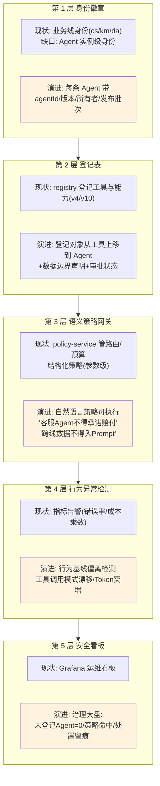
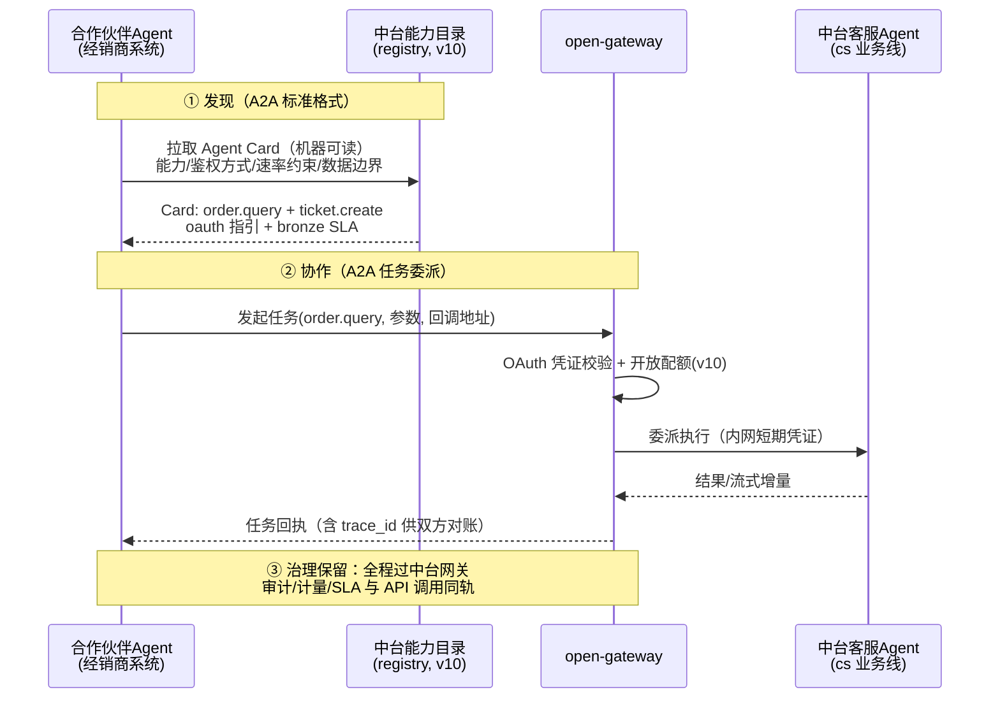
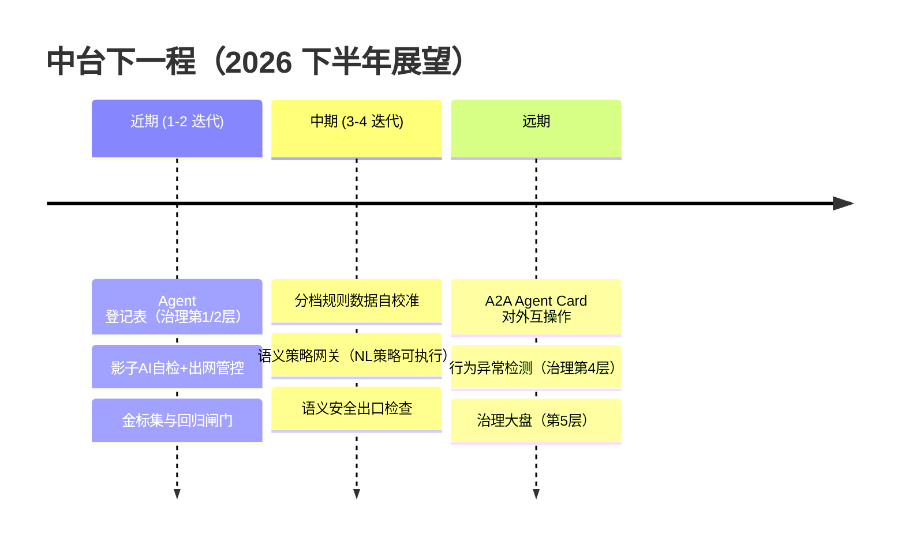

# 项目 05：企业级 Agent 中台 — 14-工业前沿与演进方向

> **定位**：站在 2026 年行业共识上审视这座中台——对照 Google（五篇生产级 Agent 指南、Agent 20 问框架）与 AWS（企业 Agent 生产化报告）的最新实践，找出中台已踩在趋势线上的部分与尚未覆盖的缺口，给出 v12 之后的演进方向，并为项目 05 收官。**本文不写新代码，写"下一步该往哪走"**。
> **读者画像**：已完成 00-13 全部迭代的读者；想了解"企业级 Agent 中台"这个品类在 2026 年往哪演进的架构师。
> **前置阅读**：[13-ADR架构决策记录]（本文的演进建议会引用决策状态）。
> **来源**：本文引用均为真实外部资料，已标注链接（CLAUDE.md 规则 14）。

---

## 一、调研结论：2026 年生产级 Agent 平台的共识

三份一线资料（[Google: Five guides to building and scaling production-ready AI agents](https://cloud.google.com/blog/topics/developers-practitioners/five-guides-to-building-and-scaling-production-ready-ai-agents)、[Google 20 问框架报道](https://itbrief.com.au/story/google-sets-out-20-question-framework-for-ai-agents)、[AWS 企业生产级 Agent 实践报告](https://cloud.it168.com/a2026/0708/6939/000006939041.shtml)）指向同一组结论：

1. **Agent 是要治理的运维对象，不是聊完即弃的函数**（Google）：每个 Agent 要有身份、登记、所有者、数据与工具边界——**五层治理栈**（身份徽章 → 登记表 → 语义策略网关 → 行为异常检测 → 安全看板）与**影子 AI 治理**（未登记的 Agent 是企业最大的失控面）。
2. **上线前先回答 20 个问题**（Google 20 问框架）：身份、权限、数据边界、评估、回滚、监控——这套问题清单本质上是"生产就绪检查表"，与本项目 37 条 ADR 的追问结构同构。
3. **大量 Agent 项目因成本/价值/风险被砍**（AWS）：生产化的分水岭不在模型能力，而在**评估驱动开发、成本治理、安全合规**——恰好是本项目 v5-v12 花了七个迭代构筑的三根柱子。
4. **模型-任务匹配（model-task matching）是成本主线**：不同任务用不同模型、级联优先——本项目 v9 的任务分档路由就是这一共识的中台化落地。
5. **互操作走向 A2A + Agent Cards**（Google）：Agent 对外发布能力卡（能做什么、怎么鉴权、什么约束），其他 Agent 按 A2A 协议直接协作——**能力市场（v10）与 A2A 的能力卡在概念上正在合流**。
6. **语义安全 + 传统安全双策略**：Prompt 注入、Tool Poisoning、数据外泄这些"语义层攻击"无法被传统鉴权/网络策略拦截，平台需要两层叠加。

**对照结论**：这座中台在成本治理（v6/v9/v12）、评估与灰度（v7）、高可用（v8/v12）上**已踩在趋势线上**；在 Agent 级治理、A2A 互操作、语义安全上**存在结构性缺口**——这正是下一程。

## 二、六大前沿方向对照

| # | 前沿方向 | 来源 | 中台现状 | 演进方向 |
|---|---------|------|---------|---------|
| F1 | 五层 Agent 治理栈 | [Google 指南](https://cloud.google.com/blog/topics/developers-practitioners/five-guides-to-building-and-scaling-production-ready-ai-agents) | 有第 2 层雏形（registry 登记工具/能力），无 Agent 身份与治理看板 | 建 Agent 登记表：每条业务线 Agent 有身份/所有者/边界/审批状态 |
| F2 | 影子 AI 治理 | [Google 指南](https://cloud.google.com/blog/topics/developers-practitioners/five-guides-to-building-and-scaling-production-ready-ai-agents) | 收口了 LLM 调用，但业务线理论上仍可绕过网关直连供应商 | 启动自检 + 出网管控：未登记的 ChatClient 禁止上线；网关外 LLM 出网流量告警 |
| F3 | 评估驱动开发 | [AWS 报告](https://cloud.it168.com/a2026/0708/6939/000006939041.shtml) | v7 有实验门禁（指标恶化自动回滚），但"指标"是运维指标为主，业务质量金标集未建 | 金标集 + 回归闸门：Prompt/模型变更上线前必须过评估集（[教程 37-自我反思与Agent评估]） |
| F4 | 模型-任务匹配深化 | [Google 20 问](https://itbrief.com.au/story/google-sets-out-20-question-framework-for-ai-agents)、[AWS 报告](https://cloud.it168.com/a2026/0708/6939/000006939041.shtml) | v9 规则分档（L0/L1/L2） | 分档规则由评估数据自动校准：L0 档误分率超阈值时自动升级该类请求 |
| F5 | A2A + Agent Cards 互操作 | [Google 指南](https://cloud.google.com/blog/topics/developers-practitioners/five-guides-to-building-and-scaling-production-ready-ai-agents) | v10 能力卡面向"人读"的市场目录，API Key/OAuth 面向机器调用 | 能力卡升级为 A2A Agent Card（机器可读），合作伙伴 Agent 直接互操作 |
| F6 | 语义安全双策略 | [Google 20 问](https://itbrief.com.au/story/google-sets-out-20-question-framework-for-ai-agents) | 传统层完备（凭证/隔离/审计）；语义层只有 SafeGuardAdvisor 级别的关键词拦截 | 网关加语义检查层：注入检测/外泄检测（LLM 判定），与传统鉴权叠加 |

## 三、方向展开与中台映射

### 3.1 F1/F2：五层治理栈与影子 AI

Google 五层栈逐层对照中台：

**最务实的落点**是第 2 层的"对象上移"：v4 的注册中心已经登记工具，v10 已经登记能力——把登记对象再上移一层（登记 Agent：谁拥有、用什么模型档、碰什么数据、审批人是谁），五层栈的第 1/2 层就成型了。第 3 层语义策略与第 6 方向（语义安全）共享同一块基础设施（LLM 判定策略违规），可以合并建设。**影子 AI 治理在中台语境的具体形态**：`agent-platform` 启动自检（每个 ChatClient Bean 必须有登记记录，未登记即启动失败——模式同 [01 §3.12] 的 ArchUnit 纪律）+ 网络层兜底（业务 Pod 到供应商 API 的直连出网被防火墙默认拒绝，只放行 llm-gateway）。中台"收口"从**约定**升级为**物理事实**。

### 3.2 F3/F4：评估驱动开发与分档自校准

AWS 报告的结论在本项目的镜像：v7 的门禁指标是**运维指标**（错误率/P99/Token 成本），它们能拦住"系统坏了"，拦不住"**回答变蠢了但系统没坏**"——Text2SQL 准确率从 82% 跌到 71%，错误率可能纹丝不动。补上这块需要：

1. **金标集**（每业务线 200-500 条人工标注样本，含典型/边界/对抗三类）；
2. **回归闸门**：Prompt/模型/分档规则变更 → 灰度前先离线跑金标集（`RelevancyEvaluator` 等 Spring AI 官方评估 API，`org.springframework.ai.chat.evaluation`，见 [附录 05] 与 [教程 37]）→ 分数不达标不进灰度；
3. **分档自校准**（F4）：v9 分档是规则拍定的；评估数据反过来回答"哪些请求被分错了档"——L0 请求被人工投诉质量差的比例超阈值，就把该类信号从 L0 规则里摘除。**分档规则本身进入数据飞轮**（[教程 41-数据飞轮与持续改进]），这是"模型-任务匹配"从静态规则到动态校准的演进。

### 3.3 F5：能力市场 × A2A 合流

v10 的能力卡（给人读）与 A2A 的 Agent Card（给机器读）正在合流——都是"声明我有什么能力、怎么调用、什么约束"的结构化名片：

对本中台，A2A 的价值不是"再造一个市场"，而是**把 v10 的开放对象从"系统"升到"Agent"**：合作伙伴的 Agent 与中台的 Agent 按标准协议互操作，而鉴权、配额、审计、SLA 全部沿用既有机制（能力卡加机器可读格式、open-gateway 加任务委派端点）。**中台的护城河恰在治理层**——互操作越标准，"受治理的互操作"越稀缺。

### 3.4 F6：语义安全双策略

传统安全（v2 凭证/v6 隔离/v10 开放鉴权）管"**谁能调**"；语义安全管"**调的内容是否恶意/是否泄密**"——两者正交，缺一不可：

| 攻击面 | 传统层能否拦截 | 语义层对策 |
|--------|--------------|-----------|
| 越权调用（无凭证） | ✅ API Key/OAuth | — |
| 合法凭证 + Prompt 注入（指令藏在文档/工具结果里） | ❌ | 入口与工具结果侧注入检测（LLM 判定 + 规则前置） |
| 合法凭证 + Tool Poisoning（恶意工具描述诱导 LLM） | ❌ | 工具注册时描述语义审查 + 运行时行为比对（v4 注册中心的扩展） |
| 合法凭证 + 数据外泄（答案里夹带他线数据） | 部分（ns 隔离挡存储层） | 出口侧外泄检测（敏感模式 + LLM 判定） |

落点选择：语义检查放 **open-gateway 与 llm-gateway 的出口/工具结果汇入处**（与 v2 网关"薄"的边界纪律有张力——语义检查有延迟与成本，应作为可配置的策略档而非默认全量，走 [11] 的 SLA 分级：金牌全检、银牌抽样、铜牌规则前置）。「遇到阻塞？→ [教程 43-Agent治理与合规框架]、[附录 09-Agent安全深度]」。

### 3.5 演进路线（v12 展望）

路线排序的依据（延续本项目的"痛点 × 确定性"纪律）：影子 AI 与登记表确定性最高（机制已备，只差对象上移）；评估闸门价值最大但要先养金标集（数据工程先行）；A2A 依赖外部生态成熟度，保持 Card 格式兼容即可，不抢先重注。

## 四、收官：项目 05 的答案

回望 [00 §1.2] CTO 办公室的五个原始诉求，中台交付的答案：

| 原始诉求 | 交付 | 迭代 |
|---------|------|------|
| "三条业务线 AI 花了多少钱说不清" | 计量-配额-预算-计费四层闭环 + 错误路径成本口径 | v2/v6/v9/v10 |
| "三个团队三种密钥管理，审计无法过" | 短期凭证 + 网关单点收口 + （下一程）出网物理管控 | v2 |
| "查订单工具要用得重新实现" | 注册中心 + MCP 统一接入 + 能力市场 | v4/v10 |
| "Prompt 想统一改要找三个团队排期" | 控制面三服务 + 版本化 + 灰度 + 自动回滚 | v3/v7 |
| "业务线要保持独立演进" | SDK 声明式自助接入 + SLA 分级 + 命名空间自治 | v1/v6/v10 |

而比这五个答案更重要的是**演进方法论本身**：11 轮迭代每轮回答四问（新增需求/影响模块/架构演进/上一版痛点），37 条 ADR 记录每个岔路口的备选与取舍，架构不变式（控制面免疫、配额不超卖、首帧后不重试）全部绑定自动化验证——**这套"痛点驱动 + 决策留痕 + 不变式进 CI"的纪律，可以平移到任何一座企业平台的构筑上**。

对照 2026 行业共识：成本治理、评估灰度、高可用容灾已在趋势线上；Agent 治理栈、A2A 互操作、语义安全是下一程的三块高地。中台的故事到此收官，读者的故事从复述这 37 条决策的备选与取舍开始——能不看文档讲清楚"为什么"，才算真正拥有这座中台。
