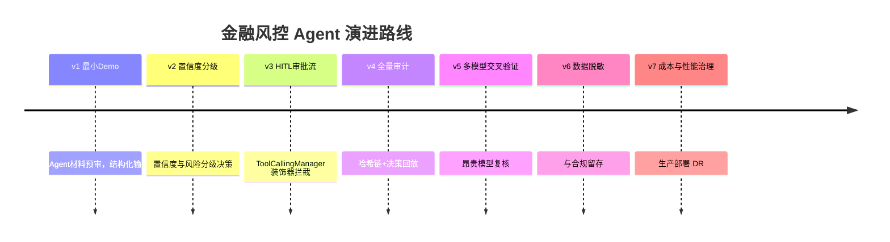
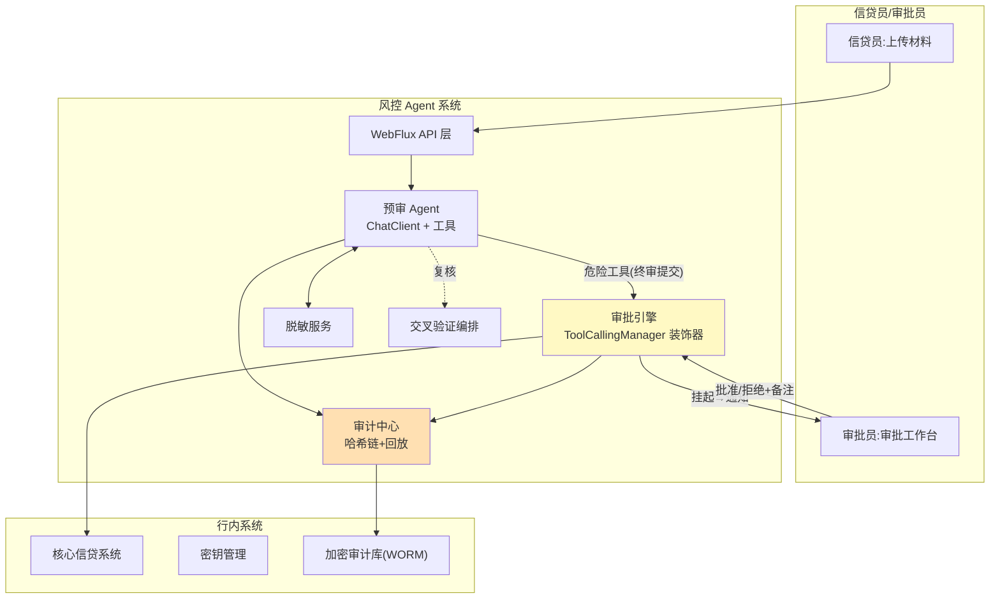

# 项目 06：金融风控 Agent 系统 — 00-需求分析与架构设计

> **定位**：某银行信贷审批 Agent 系统的完整演进——高风险强监管场景下，HITL 审批、全量审计、数据脱敏、多模型交叉验证如何作为迭代里程碑逐步落地。项目 06 是**完整独立**的项目，不依赖也不引用其他项目。本文给出全项目工程骨架（pom.xml / application.yml / 启动类），后续每篇迭代文档在骨架之上增量演进。
>
> 「遇到阻塞？→ [教程 04-企业级架构主干/08-Human-in-the-Loop与审批流]、[教程 04-企业级架构主干/05-历史记录持久化与合规]、[教程 08-架构师进阶/09-Agent治理与合规框架]、[附录 12-AI治理与合规]」

### ★ 阅读顺序总览（14 篇，序号即阅读顺序）

| 序号 | 文件 | 阶段 | 内容一句话 |
|------|------|------|-----------|
| 00 | 00-需求分析与架构设计 | 阶段 0：地基 | 监管约束、演进路线、工程骨架 |
| 01 | 01-最小Demo搭建 | 基础篇（v1） | 结构化预审最小闭环 |
| 02 | 02-置信度与风险分级 | 基础篇（v2） | 置信度校准 + 分级路由 |
| 03 | 03-HITL审批流 | 基础篇（v3） | ToolCallingManager 装饰器人工闸门 |
| 04 | 04-全量审计与决策回放 | 基础篇（v4） | 哈希链审计 + 决策回放 |
| 05 | 05-多模型交叉验证 | 基础篇（v5） | 双模型字段级比对 |
| 06 | 06-数据脱敏与合规 | 基础篇（v6） | 双通道脱敏 + 合规落地 |
| 07 | 07-成本治理与生产部署 | 基础篇（v7） | 预算联动 + 等保部署 + DR |
| 08 | 08-核心代码讲解 | 基础篇收束 | 五个关键设计复盘 + 自检清单 |
| 09 | 09-实时流式风控 | 进阶篇（v8） | 快慢双通道 + 滑动窗口 + 热更新 |
| 10 | 10-监管报送与可解释合规 | 进阶篇（v9） | 模型卡片 + 依据链 + 报送 + 门禁 |
| 11 | 11-反欺诈多Agent协同 | 进阶篇（v10） | 图关联 + 团伙识别 + 三 Agent 会签 |
| 12 | 12-ADR架构决策记录 | 合成篇 | 36 条决策总账（101-136） |
| 13 | 13-工业前沿与演进方向 | 收官篇 | 三来源六前沿 + 演进路线 |

分阶段建议：地基（00）→ 基础篇按序精读并手写代码（01-08）→ 进阶篇（09-11，同样按序）→ 合成与收官（12-13，复盘用）。

---

## 1. 业务场景

### 1.1 背景

某城商行信贷部现状：小微信贷审批平均 3.5 天，人工预审员每天处理 40 份材料。行里想上 AI 预审 Agent：**Agent 预审 + 结构化建议 + 人工终审**（监管红线：终审决定必须由人做，AI 只能辅助——这正是 HITL 的强监管版本）。

### 1.2 监管约束（本项目的一切设计前提）

| 约束 | 来源 | 架构含义 |
|------|------|---------|
| 终审必须人工 | 《个人贷款管理办法》审贷分离 | HITL 不是增强，是法定环节 |
| 决策全程可追溯 | 监管检查要求 | 每一次 AI 建议可回放：输入、版本、输出、依据 |
| 敏感数据不出行 | 数据分级管控 | PII 脱敏进 Prompt；模型部署可控 |
| 算法可解释 | 监管问询 | 建议必须附理由与置信度，不能是黑盒打分 |
| 模型变更留痕 | 版本管理要求 | Prompt/模型版本与每次决策绑定记录 |

### 1.3 项目目标

1. **预审 Agent**：读取信贷材料（营业执照/流水/征信摘要），产出结构化预审意见（风险等级+理由+置信度）
2. **HITL 审批流**：高风险建议强制转人工，审批员的批准/拒绝与备注全量留痕
3. **审计与回放**：任一历史决策可完整回放（当时输入、Prompt 版本、模型输出、人工动作）
4. **数据脱敏**：PII 不进 Prompt 明文；审计库加密留存
5. **多模型交叉验证**：高额度申请用第二模型复核第一模型结论

### 1.4 非目标

- 不做自动放款决策（法定人工终审）
- 不做征信系统对接（输入材料由信贷员上传）
- 不做多租户（行内单一主体）

### 1.5 本节核对（业务场景与监管约束）

- [ ] 能不看正文说出五条监管约束中至少三条（终审人工/可追溯/数据不出行/可解释/变更留痕）及其对应的架构含义
- [ ] 五条项目目标与 1.2 的监管约束一一映射得上（每条目标能指出它服务哪条约束）
- [ ] 三条非目标均未悄悄混入目标清单（尤其"不做自动放款"）

## 2. 演进路线



**顺序的理由**：先让预审能力可用（v1-v2）→ 审批流是上线合规的前置（v3）→ 没有审计的审批不敢真用（v4）→ 高额度场景的可靠性升级（v5）→ 脱敏与留存是监管验收项（v6）→ 生产化收尾（v7）。**每个能力都是下一个的准入条件**——风控场景不存在"先上线后补合规"。

> 进阶篇（09-13）在此弧线之上继续：v8 实时流式 → v9 监管可解释 → v10 反欺诈多 Agent 协同 → 12-ADR 总账 → 13-前沿收官。基础篇的六段演进理由在进阶篇同样成立（每个能力仍是下一个的准入条件）。

### 2.1 本节核对（演进路线）

- [ ] v1→v7 的顺序理由（每个能力是下一个的准入条件）能不看正文复述
- [ ] timeline 中每个版本号与后续各迭代篇（01-07）的标题一一对应，无缺漏错位

## 3. 目标架构（v7 终态）



### 3.1 本节核对（目标架构）

- [ ] 架构图中的每个系统框（HITL/AUDIT/REDACT/CROSS）都能对应到后续某一迭代篇（03/04/06/05），映射一致
- [ ] 「AGENT -- 危险工具 --> HITL」这条边与 ADR-102 的拦截点论述不矛盾

## 4. 工程骨架（完整可手写代码）

### 4.1 `pom.xml`（项目基线，照抄即可）

> 本块是 v1 基线。后续迭代引入新依赖（JDBC/H2、Micrometer Prometheus 等）时，每篇会给出**增量 `<dependency>` 片段**并标注「需在 pom.xml 中添加依赖」，叠加到本基线上即可。

```xml
<?xml version="1.0" encoding="UTF-8"?>
<project xmlns="http://maven.apache.org/POM/4.0.0"
         xmlns:xsi="http://www.w3.org/2001/XMLSchema-instance"
         xsi:schemaLocation="http://maven.apache.org/POM/4.0.0 https://maven.apache.org/xsd/maven-4.0.0.xsd">
    <modelVersion>4.0.0</modelVersion>
    <parent>
        <groupId>org.springframework.boot</groupId>
        <artifactId>spring-boot-starter-parent</artifactId>
        <version>4.1.0</version>
        <relativePath/>
    </parent>

    <groupId>com.bank.risk</groupId>
    <artifactId>risk-agent</artifactId>
    <version>0.1.0</version>
    <name>risk-agent</name>
    <description>金融风控信贷预审 Agent 系统</description>

    <properties>
        <java.version>21</java.version>
        <spring-ai.version>2.0.0</spring-ai.version>
    </properties>

    <dependencyManagement>
        <dependencies>
            <dependency>
                <groupId>org.springframework.ai</groupId>
                <artifactId>spring-ai-bom</artifactId>
                <version>${spring-ai.version}</version>
                <type>pom</type>
                <scope>import</scope>
            </dependency>
        </dependencies>
    </dependencyManagement>

    <dependencies>
        <!-- 响应式 Web（非 MVC）——WebFlux 铁律 -->
        <dependency>
            <groupId>org.springframework.boot</groupId>
            <artifactId>spring-boot-starter-webflux</artifactId>
        </dependency>
        <!-- OpenAI 协议模型集成（DeepSeek 兼容） -->
        <dependency>
            <groupId>org.springframework.ai</groupId>
            <artifactId>spring-ai-starter-model-openai</artifactId>
        </dependency>
        <dependency>
            <groupId>org.projectlombok</groupId>
            <artifactId>lombok</artifactId>
            <optional>true</optional>
        </dependency>
        <dependency>
            <groupId>org.springframework.boot</groupId>
            <artifactId>spring-boot-starter-test</artifactId>
            <scope>test</scope>
        </dependency>
    </dependencies>

    <build>
        <plugins>
            <plugin>
                <groupId>org.springframework.boot</groupId>
                <artifactId>spring-boot-maven-plugin</artifactId>
            </plugin>
        </plugins>
    </build>
</project>
```

### 4.2 `application.yml`（项目基线）

```yaml
spring:
  application:
    name: risk-agent
  ai:
    openai:
      base-url: https://api.deepseek.com          # DeepSeek 兼容 OpenAI 协议
      api-key: ${DEEPSEEK_API_KEY}                 # 环境变量注入，禁止硬编码
      chat:
        model: deepseek-chat          # Spring AI 2.0.0：无 options 中缀，参数直挂
server:
  port: 8080
```

### 4.3 `RiskApplication.java`（启动类）

```java
package com.bank.risk;

import org.springframework.boot.SpringApplication;
import org.springframework.boot.autoconfigure.SpringBootApplication;

@SpringBootApplication
public class RiskApplication {

    public static void main(String[] args) {
        SpringApplication.run(RiskApplication.class, args);
    }
}
```

### 4.4 本节测试与验证（工程骨架可编译）

**前置条件**：JDK 21、Maven 已装；`DEEPSEEK_API_KEY` 环境变量已设置（仅供后续运行，编译不需要）。

**材料——核对命令**：

```bash
mvn clean compile
```

**步骤与断言**：

| # | 操作 | 预期（PASS 判据） |
|---|------|------------------|
| 1 | 按本节手写 pom.xml / application.yml / RiskApplication.java 后执行材料命令 | `BUILD SUCCESS`，无编译错误 |
| 2 | 核对 pom | parent 为 spring-boot-starter-parent 4.1.0；spring-ai-bom 2.0.0 以 `import` 方式进 dependencyManagement；含 webflux（非 MVC）与 spring-ai-starter-model-openai |
| 3 | 核对 yml | `spring.ai.openai.chat.model` 直接挂模型名（2.0.0 无 options 中缀）；api-key 用 `${DEEPSEEK_API_KEY}` 占位，未硬编码 |

**失败排查**：①依赖解析失败→BOM 版本或仓库镜像配置问题，核对 `<spring-ai.version>2.0.0</spring-ai.version>`；②`invalid target release: 21`→本机 JDK 低于 21；③编译过但后续启动报 WebFlux 类缺失→误引了 starter-web。

## 5. 关键 ADR（预录）

| # | 决策 | 理由 |
|---|------|------|
| ADR-101 | AI 只做预审建议，终审动作必须走 HITL 工具 | 监管红线；技术实现为"终审工具"需人工解锁 |
| ADR-102 | HITL 拦截点在 ToolCallingManager 装饰器，不在 Advisor | Advisor 环绕整个 ChatClient 调用，拦不到"工具意图返回后、执行前"时点（[教程 03-React前端与AgenticUI/04-流式工具调用与事件协议 §4.1]） |
| ADR-103 | 审计哈希链防篡改，WORM 存储按 SEC 17a-4 精神保留 7 年 | 监管可验证性优先于存储成本 |
| ADR-104 | 交叉验证用"结构化结论比对"而非自由文本比对 | 可判定的差异检测；文本相似度不可审计 |

### 5.1 本节核对（预录 ADR）

- [ ] ADR-102 的"装饰器而非 Advisor"理由能复述（Advisor 拦不到工具意图返回后、执行前的时点）
- [ ] ADR-101~104 与 12-ADR架构决策记录 的 101-136 号段首尾衔接，编号不冲突

## 6. 下一步

→ [01-最小Demo搭建.md](01-最小Demo搭建.md) — 最小预审 Agent：材料输入 → 结构化预审意见。

---

## 7. 代码使用说明（照抄前必读）

> 本节核对（一句话）：三条使用规则（框架 API 真实 / 业务类完整实现 / 新依赖显式标注）在后续每篇迭代文档中均被遵守，抽查任一篇发现违反即 FAIL。

本项目的代码遵循「项目文档不生成 .java 文件、代码由用户手写」的规范，因此：

1. **框架 API 全部真实**：Spring AI 2.0.0 的 `ChatClient`/`@Tool`/`CallAdvisor`/`ToolCallingManager` 等均按 [附录 05-SpringAI2-API基准] 的真实签名书写，可照抄编译；API 真实性以 `spring-ai-*-2.0.0-sources.jar` 反编译核对为准。
2. **自定义业务类是完整实现**：如 `Calibrator`、`AuditHashChain`、`PseudonymVault` 等为本项目专属业务类，文档给出**完整可手写实现**（含全部 import，无省略），你需要理解后照抄。
3. **依赖标注**：凡引入 pom.xml 基线未声明的新依赖，均标注「需在 pom.xml 中添加依赖」并给出完整 `<dependency>` 片段，不实际修改 pom.xml。
4. **WebFlux 一致性**：所有代码遵循响应式铁律（Reactor Context 传请求上下文、禁 ThreadLocal、EventLoop 上禁 block、Redis 用 ReactiveRedisTemplate）。
5. **演进式阅读**：每个迭代篇都从"上一版痛点"出发，回答"新增需求→影响模块→架构演进"三问，请按 `00 → 01 → 02 → ...` 顺序阅读，不要跳读最终版。

## 8. 总结

> 本节核对（一句话）：四行总结分别对应 1.2（监管）、2（演进）、3/5（架构与 ADR）、4（骨架），与正文口径一致即 PASS。

| 层 | 一句话 |
|----|--------|
| 业务 | 监管红线（终审人工）是唯一不可退让的约束，一切架构决策为其服务 |
| 演进 | 可用→可信→可控→可证→可靠→合规→可运营，每个能力是下一个的准入条件 |
| 技术 | 拦截点选在被拦截行为的真实发生层（ToolCallingManager），比对用可判定的结构化字段 |
| 骨架 | pom/yml/启动类照抄即可，后续迭代在骨架上增量加类与依赖 |
