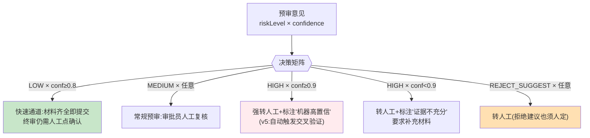

# 项目 06：金融风控 Agent 系统 — 02-置信度校准与风险分级决策

> **定位**：把"自由心证"的置信度变成**校准过的、可驱动流程决策的分级信号**——不同等级走不同处理路径，并引入"机器自信但出错"的兜底机制。**本文给出完整可手写代码（一行不省略）**。
>
> 「遇到阻塞？→ [教程 80-自我反思与Agent评估 §3.3 准确率的评估方法]、[教程 22-结构化输出]」

---

## 1. 需求与上一版痛点（四问）

| 问 | 答 |
|----|----|
| **新增了什么需求** | ① 置信度校准（分桶观察实际准确率） ② 等级×置信度决策矩阵 ③ 单模型 self-check 兜底 |
| **影响了哪些模块** | 预审输出后的处理管线（新增校准器、路由器、质检器） |
| **架构如何演进** | 输出之后多一层"决策管道"：预审 → 校准 → 路由 →（可选）质检 |
| **上一版痛点是什么** | 置信度自由心证无法驱动流程；HIGH 建议被直接当结论；单模型结论无对照 |

| v1 痛点 | 对策 |
|---------|------|
| 置信度自由心证，无法驱动流程 | 置信度校准（分桶观察实际准确率）+ 等级×置信度决策矩阵 |
| HIGH 建议被直接当结论 | 等级与处理路径强绑定（分级路由） |
| 单模型结论无对照 | 自查反思（第一版先做 self-check，v5 升级双模型） |

### 1.1 本节核对（四问与痛点对照）

- [ ] 三条 v1 痛点与本篇三个新增能力（校准/矩阵/self-check）一一对应，无孤儿对策
- [ ] "self-check 是第一版兜底，v5 升级双模型"与 00 篇演进路线 v5 一致

## 2. 分级决策矩阵



**设计要点**：矩阵中**没有任何一格是"机器直接放款/拒绝"**——所有路径终点都是人。矩阵改变的只是人的工作强度与信息提示。

### 2.1 本节核对（决策矩阵）

- [ ] 五条路径（P1–P5）的终点全部是"人"，没有任何一格机器直接终审（合规红线）
- [ ] 矩阵的分支条件（等级 × 校准后置信度阈值）与 §3.4 `RoutingService.route` 的 if 顺序一致

## 3. 完整代码（照抄即可）

### 3.1 `CalibrationBucket.java`（校准分桶 record）

```java
package com.bank.risk.domain;

/** 离线校准分桶：按置信度区间统计实际人工终审一致率。 */
public record CalibrationBucket(
        double confidenceRangeStart,   // 置信度区间起点（含）
        double confidenceRangeEnd,     // 置信度区间终点（不含）
        long sampleCount,              // 桶内样本数
        double actualAgreementRate     // 与人工终审结论的一致率（校准后概率）
) {}
```

### 3.2 `Calibrator.java`（校准器）

```java
package com.bank.risk.service;

import com.bank.risk.domain.CalibrationBucket;
import org.springframework.stereotype.Service;

import java.util.List;

/**
 * 置信度校准：LLM 自报的 confidence 是"语气强度"而非校准概率（经验上严重过自信）。
 * 用历史数据分桶对照，把自报置信度映射到实际一致率。
 */
@Service
public class Calibrator {

    // 示例分桶结果（回填 500 份历史样本后；生产从 calibration_bucket 表加载）
    // 0.8-1.0 桶: 一致率 0.71  → 校准因子: 实际≈自报×0.85
    // 0.6-0.8 桶: 一致率 0.58
    // 0.4-0.6 桶: 一致率 0.52  → 接近随机，说明该区间信号弱
    private final List<CalibrationBucket> buckets = List.of(
            new CalibrationBucket(0.8, 1.0, 220, 0.71),
            new CalibrationBucket(0.6, 0.8, 160, 0.58),
            new CalibrationBucket(0.4, 0.6, 120, 0.52),
            new CalibrationBucket(0.0, 0.4, 0, 0.50)   // 样本不足，保守取 0.5
    );

    /** 查表校准：返回该置信度桶对应的实际一致率。 */
    public double calibrate(double rawConfidence) {
        return buckets.stream()
                .filter(b -> rawConfidence >= b.confidenceRangeStart()
                        && rawConfidence < b.confidenceRangeEnd())
                .map(CalibrationBucket::actualAgreementRate)
                .findFirst()
                .orElseThrow(() -> new IllegalArgumentException("置信度越界: " + rawConfidence));
    }
}
```

> 「遇到阻塞？→ [教程 37 §3.3 准确率的评估方法]——校准数据本身也要入审计（哪个版本的校准因子在生效，v4 起入审计链）」

### 3.3 `RoutingDecision.java`（路由决策 sealed 穷尽）

```java
package com.bank.risk.domain;

import com.bank.risk.domain.PreTrialOpinion;

/** 分级路由结果（Java 21 sealed）：所有路径终点都是人。 */
public sealed interface RoutingDecision permits
        RoutingDecision.FastTrack,
        RoutingDecision.HumanReview,
        RoutingDecision.HumanReviewFlagged {

    PreTrialOpinion opinion();

    /** 快速通道：材料齐全即提交，终审仍需人工点确认。 */
    record FastTrack(PreTrialOpinion opinion) implements RoutingDecision {}

    /** 常规人工复核。 */
    record HumanReview(PreTrialOpinion opinion, String reason) implements RoutingDecision {}

    /** 强转人工并标注旗帜（机器高置信 / 证据不充分等）。 */
    record HumanReviewFlagged(PreTrialOpinion opinion, String flag) implements RoutingDecision {}
}
```

### 3.4 `RoutingService.java`（决策矩阵执行）

```java
package com.bank.risk.service;

import com.bank.risk.domain.PreTrialOpinion;
import com.bank.risk.domain.PreTrialOpinion.RiskLevel;
import com.bank.risk.domain.RoutingDecision;
import org.springframework.stereotype.Service;

@Service
public class RoutingService {

    private final Calibrator calibrator;

    public RoutingService(Calibrator calibrator) {
        this.calibrator = calibrator;
    }

    public RoutingDecision route(PreTrialOpinion op) {
        double calibratedConfidence = calibrator.calibrate(op.confidence());
        if (op.riskLevel() == RiskLevel.REJECT_SUGGEST) {
            return new RoutingDecision.HumanReview(op, "拒绝建议须人工裁定");
        }
        if (op.riskLevel() == RiskLevel.HIGH && calibratedConfidence >= 0.85) {
            return new RoutingDecision.HumanReviewFlagged(op, "机器高置信高风险——v5 起自动交叉验证");
        }
        if (op.riskLevel() == RiskLevel.LOW && calibratedConfidence >= 0.75) {
            return new RoutingDecision.FastTrack(op);
        }
        return new RoutingDecision.HumanReview(op, "常规复核");
    }
}
```

### 3.5 Self-check 反思（第一版兜底）

#### `SelfCheckResult.java`

```java
package com.bank.risk.domain;

import java.util.List;

/** 质检结果：被材料证据不支持的因子清单 + 裁定。 */
public record SelfCheckResult(
        List<String> unsupportedFactors,   // 材料无法支持的因子
        Verdict verdict                    // PASS / FAIL
) {
    public enum Verdict { PASS, FAIL }
}
```

#### `SelfCheckService.java`

```java
package com.bank.risk.service;

import com.bank.risk.domain.PreTrialOpinion;
import com.bank.risk.domain.SelfCheckResult;
import com.bank.risk.domain.SelfCheckResult.Verdict;
import com.fasterxml.jackson.databind.ObjectMapper;
import org.springframework.ai.chat.client.ChatClient;
import org.springframework.stereotype.Service;
import reactor.core.publisher.Mono;
import reactor.core.scheduler.Schedulers;

/**
 * 生成后追加一轮自检（成本低：单独一次轻量调用）。
 * 止损纪律：重生成只做一次——两次 FAIL 不再循环，直接降级为"转人工+标注质检未过"。
 */
@Service
public class SelfCheckService {

    private final ChatClient chatClient;
    private final PreTrialService preTrialService;
    private final ObjectMapper objectMapper;

    public SelfCheckService(ChatClient chatClient,
                            PreTrialService preTrialService,
                            ObjectMapper objectMapper) {
        this.chatClient = chatClient;
        this.preTrialService = preTrialService;
        this.objectMapper = objectMapper;
    }

    public Mono<PreTrialOpinion> withSelfCheck(PreTrialOpinion opinion, String material) {
        return runSelfCheck(opinion, material)
                .flatMap(check -> {
                    if (check.verdict() == Verdict.PASS) {
                        return Mono.just(opinion);
                    }
                    // 止损纪律：带不支持因子清单重生成一次（只做一次）
                    return redoWithHints(opinion, material, check.unsupportedFactors());
                });
    }

    private Mono<SelfCheckResult> runSelfCheck(PreTrialOpinion opinion, String material) {
        return Mono.fromCallable(() -> chatClient.prompt()
                    .system("你是风控质检员。核对预审意见的每个风险因子是否能被材料证据支持。")
                    .user("材料：\n" + material + "\n\n预审意见：\n" + toJson(opinion))
                    .call()
                    .entity(SelfCheckResult.class))
                .subscribeOn(Schedulers.boundedElastic());
    }

    private Mono<PreTrialOpinion> redoWithHints(PreTrialOpinion opinion, String material,
                                                java.util.List<String> unsupportedFactors) {
        String hintText = String.join("、", unsupportedFactors);
        String promptedMaterial = material + "\n【质检提示】以下因子材料无法支撑，请重新核实或归入 missingMaterials：" + hintText;
        return preTrialService.preTrial(opinion.applicationId(), promptedMaterial);
    }

    private String toJson(PreTrialOpinion opinion) {
        try {
            return objectMapper.writeValueAsString(opinion);
        } catch (Exception e) {
            throw new IllegalStateException("预审意见序列化失败", e);
        }
    }
}
```

**止损纪律**：`redoWithHints` 里**只重生成一次**，不再递归调用 `withSelfCheck`——两次质检 FAIL 不再循环（Reflection 的停止条件，[教程 37 §2.4 何时停止反思]），调用方（controller 层）捕获后降级为"转人工+标注质检未过"。

### 3.6 SQL DDL（校准分桶表）

```sql
-- 校准分桶（离线任务回填；线上校准器从本表加载）
CREATE TABLE IF NOT EXISTS calibration_bucket (
    id                   BIGINT PRIMARY KEY AUTO_INCREMENT,
    range_start          DOUBLE NOT NULL,          -- 置信度区间起点（含）
    range_end            DOUBLE NOT NULL,          -- 置信度区间终点（不含）
    sample_count         BIGINT NOT NULL,          -- 桶内历史样本数
    actual_agreement_rate DOUBLE NOT NULL,         -- 与人工终审结论的一致率
    model                VARCHAR(64)  NOT NULL,    -- 哪个模型的校准
    prompt_version       VARCHAR(64)  NOT NULL     -- 哪个 Prompt 版本（审计必需）
);
```

### 3.5 风险判定过程可见（为什么要拦，看得见）

> 过程可见性是工业级标配。风控 Agent 拦下/放行一笔要可信——用户和合规要看到"模型给出多高置信、因为哪个信号被判高风险"。风险判定 emit 判定事件：`{reqId, 置信度, 信号[分项], 分级, 动作}`。

| 要素 | 事件 | 使用者看到 |
|------|------|-----------|
| 置信度 | Confidence{model,score}` | "欺诈模型置信 0.92" |
| 信号分解 | SignalBreakdown[{factor,score}]` | "命中：异地登录0.3+金额超限0.4+设备异常0.22" |
| 分级决策 | RiskTier{tier}` | "判为高危" |
| 动作 | ActionTaken{放行/拦/人工}` | "转人工复核" |

**四条纪律**：① **分项信号可见**——拦截理由不是"模型说高风险"一句话，而是分项得分（可解释性，呼应监管报送）；② 置信度与阈值对比可见，用户知道"差 0.02 没过线"；③ 人工复核时把判定事件作为复核上下文（HITL 衔接，03 迭代）；④ 事件不泄用户隐私原始值，只给脱敏信号与分数。


### 3.7 本节测试与验证（校准器 / 路由 / self-check）

**前置条件**：v1（01 篇）代码可用；§3.1–3.6 已手写完成。

**材料——校准与路由断言样本**（写入 `src/test/java`，手写单测）：

```java
// CalibratorTest：
// ① calibrate(0.85) → 期望 0.71（落在 0.8-1.0 桶）
// ② calibrate(0.65) → 期望 0.58（落在 0.6-0.8 桶）
// ③ calibrate(1.2)  → 期望抛 IllegalArgumentException("置信度越界: 1.2")
// RoutingServiceTest（用真实 Calibrator）：
// ④ LOW + rawConf=0.85 → 校准 0.71 <0.75 → HumanReview("常规复核")
// ⑤ LOW + rawConf=0.95 → 校准 0.71，仍 <0.75 → HumanReview（注意：0.8-1.0 桶一致率 0.71 决定了 FastTrack 门槛）
// ⑥ HIGH + rawConf=0.9 → 校准 0.71 <0.85 → HumanReview("常规复核")
// ⑦ REJECT_SUGGEST + 任意 → HumanReview("拒绝建议须人工裁定")
```

**步骤与断言**：

| # | 操作 | 预期（PASS 判据） |
|---|------|------------------|
| 1 | `mvn clean test` | 材料①–⑦ 全部按注释预期通过 |
| 2 | 路由穷尽核对 | `RoutingDecision` 为 sealed，三个实现类穷尽；`route` 无任何 return 路径产生"机器终审" |
| 3 | self-check 止损核对 | `redoWithHints` 内调用的是 `preTrialService.preTrial`（不再递归 `withSelfCheck`）——代码审查断言，重试链路深度为 1 |
| 4 | DDL 执行 | `calibration_bucket` 建表成功，`prompt_version` 列存在（审计预留，ADR-105） |

**失败排查**：①⑤意外进 FastTrack→校准阈值 0.75 与分桶值对不上，重算 0.8-1.0 桶校准后值；②sealed 编译失败→permits 列表与 record 定义不同包/漏 implements；③self-check 死循环→误改成了递归调用 `withSelfCheck`，回查止损纪律。

## 4. 验收标准

| # | 验收项 | 标准 |
|---|--------|------|
| 1 | 校准有效性 | 校准后 confidence 与实际一致率的秩相关 ≥ 0.6（回测集） |
| 2 | 决策矩阵执行 | 500 份样本全部按矩阵路由，无"机器直接终审"路径（合规红线） |
| 3 | self-check 止损 | 质检失败重试 ≤ 1 次；两次失败 100% 转人工 |
| 4 | 一致性对照 | 快速通道建议与人工终审一致率 ≥ 92%（未达 90% 前不开放快速通道） |

> 本节是 §3.7 单测断言在 500 份回测样本上的规模化执行：验收 1/2 对应 §3.7 材料④–⑦ 的矩阵路由无越权，验收 3 对应断言 3 的止损深度，本表不重复单测材料。

## 5. 本迭代的 ADR

| # | 决策 | 理由 |
|---|------|------|
| ADR-105 | 校准数据（分桶/因子/模型版本）必须入审计 | 决策依据链完整：当时的校准版本可回溯 |
| ADR-106 | 决策矩阵硬编码在代码里但阈值外置配置 | 矩阵是合规审查对象，改阈值不改代码逻辑，降低误改风险 |
| ADR-107 | self-check 失败只重试一次 | 无限反思会引入"为过检而改结论"的博弈，且成本失控 |

### 5.1 本节核对（ADR-105~107）

- [ ] ADR-105 与 §3.6 DDL 的 `prompt_version` 列呼应（校准依据可回溯的字段落点）
- [ ] ADR-106"阈值外置配置"与 §3.4 现状（0.85/0.75 硬编码）差距能说清（本迭代先硬编码，后续外置）

## 6. v2 的痛点

分级路由有了，但**"转人工"还只是一个标签**：意见带着标签混在普通工作流里，信贷员仍可能拿建议直接提交终审——**缺一道强制的人工闸门**。→ [03-HITL审批流.md](03-HITL审批流.md)

## 7. 总结

| 概念 | 一句话 |
|------|--------|
| 校准 | 用历史分桶把"语气强度"变成"实际一致率" |
| 矩阵 | 没有任何一格是机器终审——矩阵只改变人的工作强度 |
| 止损 | 反思只做一次，两次失败转人工，不无限循环 |
| 审计预留 | 校准因子本身要入审计（v4 落链） |

## 8. 全篇回归验证

> §6（痛点一句话核对：指向 03 人工闸门即 PASS）、§7（总结四行与 §3.2/§2/§3.5/ADR-105 对应即 PASS）。

**前置条件**：§3.7 全部断言通过。

| # | 操作 | 预期（PASS 判据） |
|---|------|------------------|
| 1 | `mvn clean test` | 全部单测（CalibratorTest / RoutingServiceTest）通过，`BUILD SUCCESS` |
| 2 | 用 v1 的 §4.1 材料 curl 打一遍预审，再手动喂给 `RoutingService.route`（或集成测试） | 预审→路由链路贯通，返回值是三种 RoutingDecision 之一，无异常 |
| 3 | 回归 v1 验收 | §3.7 改动未破坏 entity 结构化输出（PreTrialOpinion 契约未动） |

**失败排查**：②抛 IllegalArgumentException→预审输出 confidence 越界进了 calibrate（v1 的 validate 应已拦，检查调用顺序）；③契约破坏→误改 PreTrialOpinion 字段。
