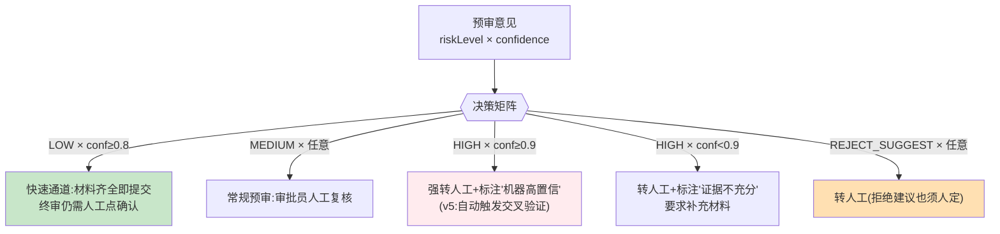

# 项目 06：金融风控 Agent 系统 — 02-迭代一：置信度校准与风险分级决策

> **定位**：把"自由心证"的置信度变成**校准过的、可驱动流程决策的分级信号**——不同等级走不同处理路径，并引入"机器自信但出错"的兜底机制。**本文给出完整可手写代码（一行不省略）**。
>
> 「遇到阻塞？→ [教程 32-自我反思与Agent评估 §置信度校准]、[教程 12-结构化输出]」

---

## 1. 需求与上一版痛点（四问）

| 问 | 答 |
|----|----|
| **新增了什么需求** | ① 置信度校准（分桶观察实际准确率） ② 等级×置信度决策矩阵 ③ 单模型 self-check 兜底 |
| **影响了哪些模块** | 预审输出后的处理管线（新增校准器、路由器、质检器） |
| **架构如何演进** | 输出之后多一层"决策管道"：预审 → 校准 → 路由 →（可选）质检 |
| **上一版痛点是什么** | 置信度自由心证无法驱动流程；HIGH 建议被直接当结论；单模型结论无对照 |

| v1 痛点 | 对策 |
|---------|------|
| 置信度自由心证，无法驱动流程 | 置信度校准（分桶观察实际准确率）+ 等级×置信度决策矩阵 |
| HIGH 建议被直接当结论 | 等级与处理路径强绑定（分级路由） |
| 单模型结论无对照 | 自查反思（第一版先做 self-check，v5 升级双模型） |

## 2. 分级决策矩阵



**设计要点**：矩阵中**没有任何一格是"机器直接放款/拒绝"**——所有路径终点都是人。矩阵改变的只是人的工作强度与信息提示。

## 3. 完整代码（照抄即可）

### 3.1 `CalibrationBucket.java`（校准分桶 record）

```java
package com.bank.risk.domain;

/** 离线校准分桶：按置信度区间统计实际人工终审一致率。 */
public record CalibrationBucket(
        double confidenceRangeStart,   // 置信度区间起点（含）
        double confidenceRangeEnd,     // 置信度区间终点（不含）
        long sampleCount,              // 桶内样本数
        double actualAgreementRate     // 与人工终审结论的一致率（校准后概率）
) {}
```

### 3.2 `Calibrator.java`（校准器）

```java
package com.bank.risk.service;

import com.bank.risk.domain.CalibrationBucket;
import org.springframework.stereotype.Service;

import java.util.List;

/**
 * 置信度校准：LLM 自报的 confidence 是"语气强度"而非校准概率（经验上严重过自信）。
 * 用历史数据分桶对照，把自报置信度映射到实际一致率。
 */
@Service
public class Calibrator {

    // 示例分桶结果（回填 500 份历史样本后；生产从 calibration_bucket 表加载）
    // 0.8-1.0 桶: 一致率 0.71  → 校准因子: 实际≈自报×0.85
    // 0.6-0.8 桶: 一致率 0.58
    // 0.4-0.6 桶: 一致率 0.52  → 接近随机，说明该区间信号弱
    private final List<CalibrationBucket> buckets = List.of(
            new CalibrationBucket(0.8, 1.0, 220, 0.71),
            new CalibrationBucket(0.6, 0.8, 160, 0.58),
            new CalibrationBucket(0.4, 0.6, 120, 0.52),
            new CalibrationBucket(0.0, 0.4, 0, 0.50)   // 样本不足，保守取 0.5
    );

    /** 查表校准：返回该置信度桶对应的实际一致率。 */
    public double calibrate(double rawConfidence) {
        return buckets.stream()
                .filter(b -> rawConfidence >= b.confidenceRangeStart()
                        && rawConfidence < b.confidenceRangeEnd())
                .map(CalibrationBucket::actualAgreementRate)
                .findFirst()
                .orElseThrow(() -> new IllegalArgumentException("置信度越界: " + rawConfidence));
    }
}
```

> 「遇到阻塞？→ [教程 32 §置信度校准]——校准数据本身也要入审计（哪个版本的校准因子在生效，v4 起入审计链）」

### 3.3 `RoutingDecision.java`（路由决策 sealed 穷尽）

```java
package com.bank.risk.domain;

import com.bank.risk.domain.PreTrialOpinion;

/** 分级路由结果（Java 21 sealed）：所有路径终点都是人。 */
public sealed interface RoutingDecision permits
        RoutingDecision.FastTrack,
        RoutingDecision.HumanReview,
        RoutingDecision.HumanReviewFlagged {

    PreTrialOpinion opinion();

    /** 快速通道：材料齐全即提交，终审仍需人工点确认。 */
    record FastTrack(PreTrialOpinion opinion) implements RoutingDecision {}

    /** 常规人工复核。 */
    record HumanReview(PreTrialOpinion opinion, String reason) implements RoutingDecision {}

    /** 强转人工并标注旗帜（机器高置信 / 证据不充分等）。 */
    record HumanReviewFlagged(PreTrialOpinion opinion, String flag) implements RoutingDecision {}
}
```

### 3.4 `RoutingService.java`（决策矩阵执行）

```java
package com.bank.risk.service;

import com.bank.risk.domain.PreTrialOpinion;
import com.bank.risk.domain.PreTrialOpinion.RiskLevel;
import com.bank.risk.domain.RoutingDecision;
import org.springframework.stereotype.Service;

@Service
public class RoutingService {

    private final Calibrator calibrator;

    public RoutingService(Calibrator calibrator) {
        this.calibrator = calibrator;
    }

    public RoutingDecision route(PreTrialOpinion op) {
        double calibratedConfidence = calibrator.calibrate(op.confidence());
        if (op.riskLevel() == RiskLevel.REJECT_SUGGEST) {
            return new RoutingDecision.HumanReview(op, "拒绝建议须人工裁定");
        }
        if (op.riskLevel() == RiskLevel.HIGH && calibratedConfidence >= 0.85) {
            return new RoutingDecision.HumanReviewFlagged(op, "机器高置信高风险——v5 起自动交叉验证");
        }
        if (op.riskLevel() == RiskLevel.LOW && calibratedConfidence >= 0.75) {
            return new RoutingDecision.FastTrack(op);
        }
        return new RoutingDecision.HumanReview(op, "常规复核");
    }
}
```

### 3.5 Self-check 反思（第一版兜底）

#### `SelfCheckResult.java`

```java
package com.bank.risk.domain;

import java.util.List;

/** 质检结果：被材料证据不支持的因子清单 + 裁定。 */
public record SelfCheckResult(
        List<String> unsupportedFactors,   // 材料无法支持的因子
        Verdict verdict                    // PASS / FAIL
) {
    public enum Verdict { PASS, FAIL }
}
```

#### `SelfCheckService.java`

```java
package com.bank.risk.service;

import com.bank.risk.domain.PreTrialOpinion;
import com.bank.risk.domain.SelfCheckResult;
import com.bank.risk.domain.SelfCheckResult.Verdict;
import com.fasterxml.jackson.databind.ObjectMapper;
import org.springframework.ai.chat.client.ChatClient;
import org.springframework.stereotype.Service;
import reactor.core.publisher.Mono;
import reactor.core.scheduler.Schedulers;

/**
 * 生成后追加一轮自检（成本低：单独一次轻量调用）。
 * 止损纪律：重生成只做一次——两次 FAIL 不再循环，直接降级为"转人工+标注质检未过"。
 */
@Service
public class SelfCheckService {

    private final ChatClient chatClient;
    private final PreTrialService preTrialService;
    private final ObjectMapper objectMapper;

    public SelfCheckService(ChatClient chatClient,
                            PreTrialService preTrialService,
                            ObjectMapper objectMapper) {
        this.chatClient = chatClient;
        this.preTrialService = preTrialService;
        this.objectMapper = objectMapper;
    }

    public Mono<PreTrialOpinion> withSelfCheck(PreTrialOpinion opinion, String material) {
        return runSelfCheck(opinion, material)
                .flatMap(check -> {
                    if (check.verdict() == Verdict.PASS) {
                        return Mono.just(opinion);
                    }
                    // 止损纪律：带不支持因子清单重生成一次（只做一次）
                    return redoWithHints(opinion, material, check.unsupportedFactors());
                });
    }

    private Mono<SelfCheckResult> runSelfCheck(PreTrialOpinion opinion, String material) {
        return Mono.fromCallable(() -> chatClient.prompt()
                    .system("你是风控质检员。核对预审意见的每个风险因子是否能被材料证据支持。")
                    .user("材料：\n" + material + "\n\n预审意见：\n" + toJson(opinion))
                    .call()
                    .entity(SelfCheckResult.class))
                .subscribeOn(Schedulers.boundedElastic());
    }

    private Mono<PreTrialOpinion> redoWithHints(PreTrialOpinion opinion, String material,
                                                java.util.List<String> unsupportedFactors) {
        String hintText = String.join("、", unsupportedFactors);
        String promptedMaterial = material + "\n【质检提示】以下因子材料无法支撑，请重新核实或归入 missingMaterials：" + hintText;
        return preTrialService.preTrial(opinion.applicationId(), promptedMaterial);
    }

    private String toJson(PreTrialOpinion opinion) {
        try {
            return objectMapper.writeValueAsString(opinion);
        } catch (Exception e) {
            throw new IllegalStateException("预审意见序列化失败", e);
        }
    }
}
```

**止损纪律**：`redoWithHints` 里**只重生成一次**，不再递归调用 `withSelfCheck`——两次质检 FAIL 不再循环（Reflection 的停止条件，[教程 32 §停止条件]），调用方（controller 层）捕获后降级为"转人工+标注质检未过"。

### 3.6 SQL DDL（校准分桶表）

```sql
-- 校准分桶（离线任务回填；线上校准器从本表加载）
CREATE TABLE IF NOT EXISTS calibration_bucket (
    id                   BIGINT PRIMARY KEY AUTO_INCREMENT,
    range_start          DOUBLE NOT NULL,          -- 置信度区间起点（含）
    range_end            DOUBLE NOT NULL,          -- 置信度区间终点（不含）
    sample_count         BIGINT NOT NULL,          -- 桶内历史样本数
    actual_agreement_rate DOUBLE NOT NULL,         -- 与人工终审结论的一致率
    model                VARCHAR(64)  NOT NULL,    -- 哪个模型的校准
    prompt_version       VARCHAR(64)  NOT NULL     -- 哪个 Prompt 版本（审计必需）
);
```

## 4. 验收标准

| # | 验收项 | 标准 |
|---|--------|------|
| 1 | 校准有效性 | 校准后 confidence 与实际一致率的秩相关 ≥ 0.6（回测集） |
| 2 | 决策矩阵执行 | 500 份样本全部按矩阵路由，无"机器直接终审"路径（合规红线） |
| 3 | self-check 止损 | 质检失败重试 ≤ 1 次；两次失败 100% 转人工 |
| 4 | 一致性对照 | 快速通道建议与人工终审一致率 ≥ 92%（未达 90% 前不开放快速通道） |

## 5. 本迭代的 ADR

| # | 决策 | 理由 |
|---|------|------|
| ADR-105 | 校准数据（分桶/因子/模型版本）必须入审计 | 决策依据链完整：当时的校准版本可回溯 |
| ADR-106 | 决策矩阵硬编码在代码里但阈值外置配置 | 矩阵是合规审查对象，改阈值不改代码逻辑，降低误改风险 |
| ADR-107 | self-check 失败只重试一次 | 无限反思会引入"为过检而改结论"的博弈，且成本失控 |

## 6. v2 的痛点

分级路由有了，但**"转人工"还只是一个标签**：意见带着标签混在普通工作流里，信贷员仍可能拿建议直接提交终审——**缺一道强制的人工闸门**。→ [03-迭代二-HITL审批流.md](03-迭代二-HITL审批流.md)

## 7. 总结

| 概念 | 一句话 |
|------|--------|
| 校准 | 用历史分桶把"语气强度"变成"实际一致率" |
| 矩阵 | 没有任何一格是机器终审——矩阵只改变人的工作强度 |
| 止损 | 反思只做一次，两次失败转人工，不无限循环 |
| 审计预留 | 校准因子本身要入审计（v4 落链） |
