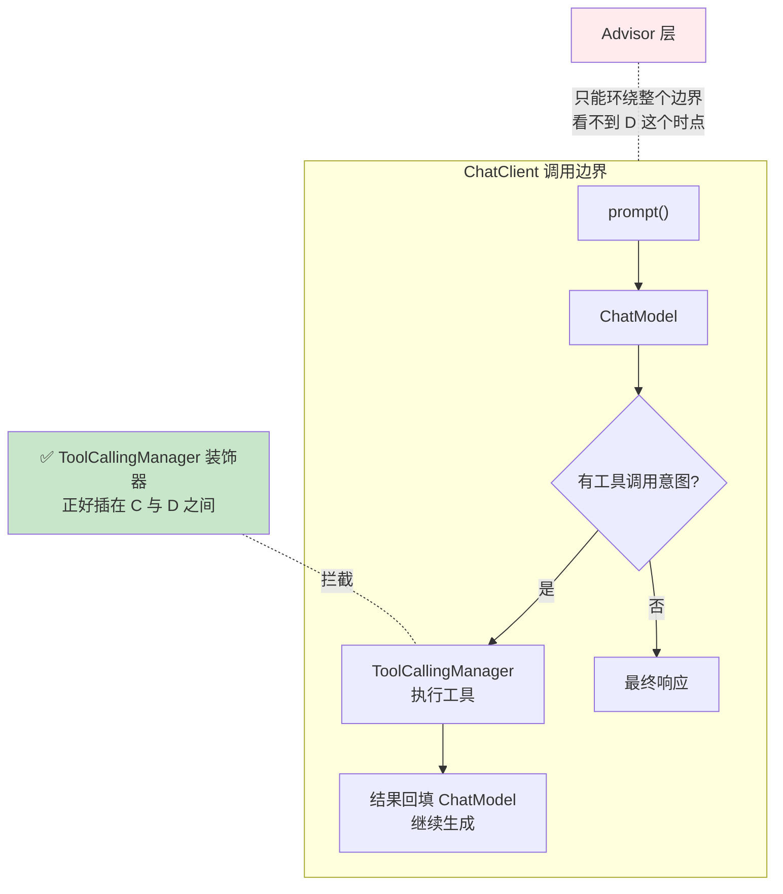
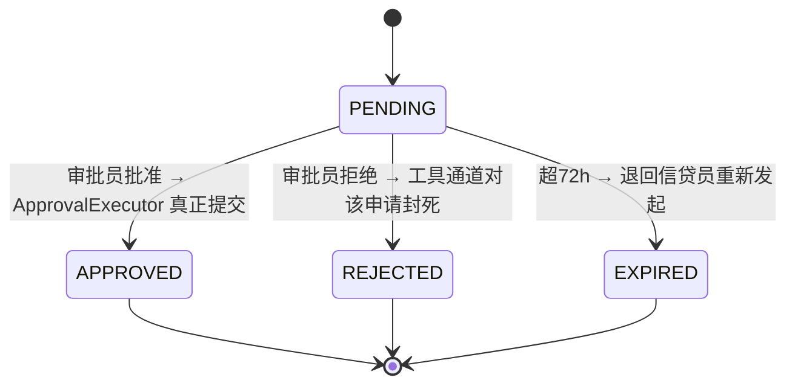
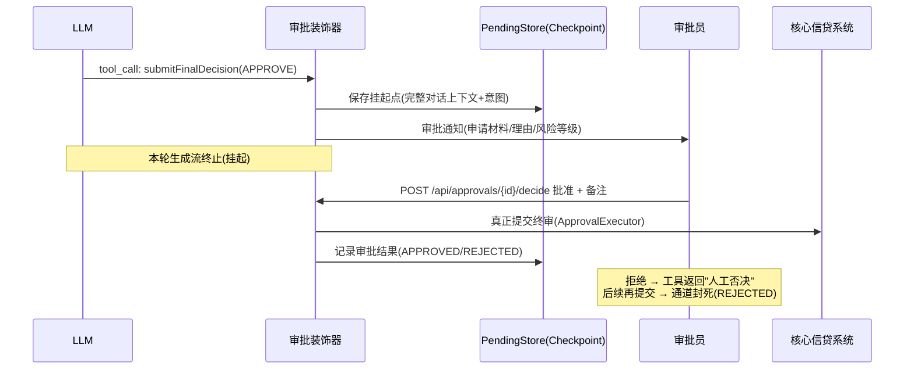

# 项目 06：金融风控 Agent 系统 — 03-HITL 审批流

> **定位**：本项目的技术核心——把"终审必须人工"从流程约定升级为**架构强制**：终审动作建模为工具，ToolCallingManager 装饰器在"LLM 决定调用工具"与"工具实际执行"之间插入人工闸门。**本文给出完整可手写代码（一行不省略），API 签名以 spring-ai-model-2.0.0 反编译核对的真实接口为准。**
>
> 「遇到阻塞？→ [教程 28-Human-in-the-Loop与审批流 全篇]、[教程 40-长任务持久化与中断恢复 §Checkpoint]」

---

## 1. 需求与上一版痛点（四问）

| 问 | 答 |
|----|----|
| **新增了什么需求** | ① 终审动作工具化 + 拦截层强制挂起 ② 审批挂起 Checkpoint 化（跨重启恢复） ③ 审批决策全量留痕 |
| **影响了哪些模块** | 工具执行（新增 ToolCallingManager 装饰器）、新增审批引擎（ApprovalService/Store/Executor）、新增审批 API |
| **架构如何演进** | "转人工"从标签升级为架构强制：终审工具被装饰器拦截，人工批准才真正执行 |
| **上一版痛点是什么** | "转人工"只是标签，无强制闸门；挂起期间状态易丢失 |

| v2 痛点 | 对策 |
|---------|------|
| "转人工"只是标签，无强制闸门 | 终审动作工具化 + 拦截层强制挂起 |
| 挂起期间状态易丢失 | 审批挂起 Checkpoint 化，跨重启/跨天恢复 |

## 2. 为什么拦截点是 ToolCallingManager 装饰器

> 这是本项目最重要的架构决策（ADR-102），也是对早期方案的修正。



**Advisor 层拦不到"工具意图返回后、工具执行前"**——它环绕的是整个 ChatClient 调用，工具执行发生在 ChatModel 内部的循环里。早期方案试图在 Advisor 里检查 toolCalls 并挂起，机制上不成立（[教程 28 §4.1] 的结论，本迭代是该结论的完整落地）。

**真实接口（2.0.0 反编译核对）**：`ToolCallingManager` 在 `org.springframework.ai.model.tool` 包，只有两个抽象方法——`resolveToolDefinitions(ToolCallingChatOptions)` 与 `executeToolCalls(Prompt, ChatResponse)`。**注意：`executeToolCalls` 的第二个参数是 `ChatResponse` 而非工具清单**——工具调用意图要从 `ChatResponse.getResults()` 的 `Generation` 里取（`generation.getOutput().getToolCalls()`）。

## 3. 审批状态机



**超时升级**（[教程 28 §6 超时升级机制]）：PENDING 超 24h → 升级通知审批主管；超 72h → EXPIRED，流程退回信贷员重新发起（不自动通过、不自动拒绝——**挂起默认失败安全**）。

## 4. 完整代码（照抄即可）

### 4.1 依赖增量（需在 pom.xml 中添加依赖）

```xml
<!-- 审批 Checkpoint 持久化：JDBC + H2（本地演示用文件库，重启数据不丢；生产换 PostgreSQL） -->
<dependency>
    <groupId>org.springframework.boot</groupId>
    <artifactId>spring-boot-starter-jdbc</artifactId>
</dependency>
<dependency>
    <groupId>com.h2database</groupId>
    <artifactId>h2</artifactId>
    <scope>runtime</scope>
</dependency>
```

`application.yml` 增加数据源（H2 文件库，`DB_CLOSE_DELAY=-1` 保持连接）：

```yaml
spring:
  datasource:
    url: jdbc:h2:file:./data/riskdb;MODE=PostgreSQL;DB_CLOSE_DELAY=-1
    driver-class-name: org.h2.Driver
    username: sa
    password: ""
```

### 4.2 `ApprovalStatus.java`（状态枚举）

```java
package com.bank.risk.domain;

public enum ApprovalStatus {
    NONE,      // 无审批记录（首次挂起前）
    PENDING,   // 挂起等待人工
    APPROVED,  // 已批准（ApprovalExecutor 已真正提交）
    REJECTED,  // 已拒绝（工具通道对该申请封死）
    EXPIRED    // 超时过期（退回信贷员重新发起）
}
```

### 4.3 `ApprovalCheckpoint.java`（挂起快照）

```java
package com.bank.risk.domain;

import java.time.Instant;

/** 审批挂起点：包含恢复所需全部状态（跨天/跨重启）。 */
public record ApprovalCheckpoint(
        String approvalId,           // 审批单号
        String applicationId,        // 申请编号
        String conversationJson,     // 完整对话上下文（恢复后 Agent 可继续）
        String toolName,             // 挂起的工具名
        String toolCallArguments,    // 挂起的工具意图（JSON 参数）
        String opinionJson,          // 关联预审意见快照（可空，v4 回放时反序列化）
        String promptVersion,        // 审计必需：挂起时的 Prompt 版本
        ApprovalStatus status,       // PENDING/APPROVED/REJECTED/EXPIRED
        String approver,             // 审批人（决定后回填）
        String remark,               // 审批备注（决定后回填）
        Instant createdAt,
        Instant decidedAt
) {}
```

### 4.4 受控异常

```java
package com.bank.risk.tool;

/** 审批挂起：受控异常，中断当前生成流。挂起不是错误，但必须停止"自动继续"。 */
public class ApprovalPendingException extends RuntimeException {

    private final String approvalId;

    public ApprovalPendingException(String approvalId) {
        super("终审提交已挂起等待人工审批: " + approvalId);
        this.approvalId = approvalId;
    }

    public String getApprovalId() {
        return approvalId;
    }
}
```

### 4.5 `PendingApprovalStore.java`（接口）

```java
package com.bank.risk.service;

import com.bank.risk.domain.ApprovalCheckpoint;
import com.bank.risk.domain.ApprovalStatus;

import java.util.List;
import java.util.Optional;

public interface PendingApprovalStore {

    void save(ApprovalCheckpoint checkpoint);

    Optional<ApprovalCheckpoint> findById(String approvalId);

    Optional<ApprovalCheckpoint> findByApplicationId(String applicationId);

    List<ApprovalCheckpoint> listPending();

    void updateStatus(String approvalId, ApprovalStatus status);

    void updateDecision(String approvalId, String approver, String remark, ApprovalStatus status);
}
```

### 4.6 `JdbcPendingApprovalStore.java`（JDBC 实现）

```java
package com.bank.risk.service;

import com.bank.risk.domain.ApprovalCheckpoint;
import com.bank.risk.domain.ApprovalStatus;
import org.springframework.jdbc.core.JdbcTemplate;
import org.springframework.stereotype.Repository;

import java.sql.ResultSet;
import java.sql.SQLException;
import java.sql.Timestamp;
import java.time.Instant;
import java.util.List;
import java.util.Optional;

@Repository
public class JdbcPendingApprovalStore implements PendingApprovalStore {

    private final JdbcTemplate jdbc;

    public JdbcPendingApprovalStore(JdbcTemplate jdbc) {
        this.jdbc = jdbc;
    }

    @Override
    public void save(ApprovalCheckpoint cp) {
        jdbc.update("""
                INSERT INTO approval_checkpoint
                    (approval_id, application_id, conversation_json, tool_name, tool_call_args,
                     opinion_json, prompt_version, status, approver, remark, created_at, decided_at)
                VALUES (?,?,?,?,?,?,?,?,?,?,?,?)
                """,
                cp.approvalId(), cp.applicationId(), cp.conversationJson(), cp.toolName(),
                cp.toolCallArguments(), cp.opinionJson(), cp.promptVersion(), cp.status().name(),
                cp.approver(), cp.remark(), Timestamp.from(cp.createdAt()),
                cp.decidedAt() != null ? Timestamp.from(cp.decidedAt()) : null);
    }

    @Override
    public Optional<ApprovalCheckpoint> findById(String approvalId) {
        return jdbc.query("SELECT * FROM approval_checkpoint WHERE approval_id = ?",
                (rs, i) -> map(rs), approvalId).stream().findFirst();
    }

    @Override
    public Optional<ApprovalCheckpoint> findByApplicationId(String applicationId) {
        return jdbc.query("""
                        SELECT * FROM approval_checkpoint WHERE application_id = ?
                        ORDER BY created_at DESC LIMIT 1
                        """,
                (rs, i) -> map(rs), applicationId).stream().findFirst();
    }

    @Override
    public List<ApprovalCheckpoint> listPending() {
        return jdbc.query("SELECT * FROM approval_checkpoint WHERE status = 'PENDING' ORDER BY created_at",
                (rs, i) -> map(rs));
    }

    @Override
    public void updateStatus(String approvalId, ApprovalStatus status) {
        jdbc.update("UPDATE approval_checkpoint SET status = ?, decided_at = ? WHERE approval_id = ?",
                status.name(), Timestamp.from(Instant.now()), approvalId);
    }

    @Override
    public void updateDecision(String approvalId, String approver, String remark, ApprovalStatus status) {
        jdbc.update("""
                UPDATE approval_checkpoint
                SET status = ?, approver = ?, remark = ?, decided_at = ? WHERE approval_id = ?
                """,
                status.name(), approver, remark, Timestamp.from(Instant.now()), approvalId);
    }

    private ApprovalCheckpoint map(ResultSet rs) throws SQLException {
        Timestamp decidedAt = rs.getTimestamp("decided_at");
        return new ApprovalCheckpoint(
                rs.getString("approval_id"),
                rs.getString("application_id"),
                rs.getString("conversation_json"),
                rs.getString("tool_name"),
                rs.getString("tool_call_args"),
                rs.getString("opinion_json"),
                rs.getString("prompt_version"),
                ApprovalStatus.valueOf(rs.getString("status")),
                rs.getString("approver"),
                rs.getString("remark"),
                rs.getTimestamp("created_at").toInstant(),
                decidedAt != null ? decidedAt.toInstant() : null);
    }
}
```

### 4.7 `ApprovalReceipt.java` + `ApprovalExecutor.java`（批准后真正执行）

```java
package com.bank.risk.domain;

/** 终审提交回执（核心信贷系统返回）。 */
public record ApprovalReceipt(String applicationId, String decision, String status) {}
```

```java
package com.bank.risk.service;

import com.bank.risk.domain.ApprovalCheckpoint;
import com.bank.risk.domain.ApprovalReceipt;
import com.bank.risk.domain.ApprovalStatus;
import com.fasterxml.jackson.databind.JsonNode;
import com.fasterxml.jackson.databind.ObjectMapper;
import org.slf4j.Logger;
import org.slf4j.LoggerFactory;
import org.springframework.stereotype.Component;
import org.springframework.web.reactive.function.client.WebClient;
import reactor.core.publisher.Mono;

/** 审批通过后触发真正的终审提交（核心信贷系统）。 */
@Component
public class ApprovalExecutor {

    private static final Logger log = LoggerFactory.getLogger(ApprovalExecutor.class);

    private final WebClient coreClient;
    private final PendingApprovalStore store;
    private final ObjectMapper objectMapper;

    public ApprovalExecutor(WebClient.Builder webClientBuilder,
                            PendingApprovalStore store,
                            ObjectMapper objectMapper) {
        this.coreClient = webClientBuilder.baseUrl("http://core-system").build();
        this.store = store;
        this.objectMapper = objectMapper;
    }

    public Mono<ApprovalReceipt> executeApproved(ApprovalCheckpoint cp, String approver, String remark) {
        SubmitFinalRequest req = parseRequest(cp, approver, remark);
        return coreClient.post()
                .uri("/api/core/loan/final")
                .bodyValue(req)
                .retrieve()
                .bodyToMono(ApprovalReceipt.class)
                .doOnSuccess(receipt -> {
                    store.updateDecision(cp.approvalId(), approver, remark, ApprovalStatus.APPROVED);
                    log.info("终审已提交: approvalId={}, receipt={}", cp.approvalId(), receipt);
                });
    }

    private SubmitFinalRequest parseRequest(ApprovalCheckpoint cp, String approver, String remark) {
        try {
            JsonNode args = objectMapper.readTree(cp.toolCallArguments());
            return new SubmitFinalRequest(
                    cp.applicationId(),
                    args.path("decision").asText(),
                    args.path("reason").asText(),
                    approver,
                    remark);
        } catch (Exception e) {
            throw new IllegalStateException("终审参数解析失败: " + cp.toolCallArguments(), e);
        }
    }

    public record SubmitFinalRequest(String applicationId, String decision, String reason,
                                     String approver, String remark) {}
}
```

### 4.8 `ApproverNotifier.java`（通知）

```java
package com.bank.risk.service;

import org.slf4j.Logger;
import org.slf4j.LoggerFactory;
import org.springframework.stereotype.Component;

/** 审批通知（多渠道：工作台/短信/IM）。demo 打日志，生产接消息队列。 */
@Component
public class ApproverNotifier {

    private static final Logger log = LoggerFactory.getLogger(ApproverNotifier.class);

    public void notifyApprovers(String approvalId, String applicationId, String toolName) {
        log.info("审批挂起通知: approvalId={}, applicationId={}, toolName={}",
                approvalId, applicationId, toolName);
    }

    public void notifySubmitter(String approvalId, String message) {
        log.info("审批结果通知: approvalId={}, message={}", approvalId, message);
    }
}
```

### 4.9 `ApprovalService.java`（审批引擎）

```java
package com.bank.risk.service;

import com.bank.risk.domain.ApprovalCheckpoint;
import com.bank.risk.domain.ApprovalStatus;
import com.fasterxml.jackson.databind.ObjectMapper;
import org.springframework.ai.chat.messages.AssistantMessage;
import org.springframework.ai.chat.messages.Message;
import org.springframework.beans.factory.annotation.Value;
import org.springframework.stereotype.Service;
import reactor.core.publisher.Mono;

import java.time.Instant;
import java.util.List;
import java.util.UUID;

@Service
public class ApprovalService {

    private final PendingApprovalStore store;
    private final ApproverNotifier notifier;
    private final ApprovalExecutor approvalExecutor;
    private final ObjectMapper objectMapper;

    @Value("${risk.prompt-version:v3.2}")
    private String promptVersion;

    public ApprovalService(PendingApprovalStore store,
                           ApproverNotifier notifier,
                           ApprovalExecutor approvalExecutor,
                           ObjectMapper objectMapper) {
        this.store = store;
        this.notifier = notifier;
        this.approvalExecutor = approvalExecutor;
        this.objectMapper = objectMapper;
    }

    /** 挂起：保存 Checkpoint、通知审批员，返回 approvalId。 */
    public String suspend(String applicationId, List<Message> conversation, AssistantMessage.ToolCall call) {
        String approvalId = UUID.randomUUID().toString();
        ApprovalCheckpoint cp = new ApprovalCheckpoint(
                approvalId, applicationId, toJson(conversation), call.name(), call.arguments(),
                null, promptVersion, ApprovalStatus.PENDING, null, null, Instant.now(), null);
        store.save(cp);
        notifier.notifyApprovers(approvalId, applicationId, call.name());
        return approvalId;
    }

    public ApprovalStatus statusFor(String applicationId) {
        return store.findByApplicationId(applicationId)
                .map(ApprovalCheckpoint::status)
                .orElse(ApprovalStatus.NONE);
    }

    public String currentApprovalId(String applicationId) {
        return store.findByApplicationId(applicationId)
                .map(ApprovalCheckpoint::approvalId)
                .orElseThrow(() -> new IllegalStateException("无挂起审批: " + applicationId));
    }

    public ApprovalCheckpoint detail(String approvalId) {
        return store.findById(approvalId)
                .orElseThrow(() -> new IllegalArgumentException("审批单不存在: " + approvalId));
    }

    public List<ApprovalCheckpoint> listPending() {
        return store.listPending();
    }

    public Mono<Void> decide(String approvalId, ApprovalDecision decision, String approver, String remark) {
        ApprovalCheckpoint cp = store.findById(approvalId)
                .orElseThrow(() -> new IllegalArgumentException("审批单不存在: " + approvalId));
        if (decision == ApprovalDecision.APPROVE) {
            return approvalExecutor.executeApproved(cp, approver, remark).then();
        }
        store.updateDecision(approvalId, approver, remark, ApprovalStatus.REJECTED);
        notifier.notifySubmitter(approvalId, "您的终审提交被拒绝: " + remark);
        return Mono.empty();
    }

    private String toJson(Object value) {
        try {
            return objectMapper.writeValueAsString(value);
        } catch (Exception e) {
            throw new IllegalStateException("序列化失败", e);
        }
    }

    public enum ApprovalDecision { APPROVE, REJECT }
}
```

### 4.10 终审动作工具化：`FinalDecisionTools.java`

```java
package com.bank.risk.tool;

import com.bank.risk.domain.ApprovalReceipt;
import org.springframework.ai.tool.annotation.Tool;
import org.springframework.ai.tool.annotation.ToolParam;
import org.springframework.stereotype.Component;

@Component
public class FinalDecisionTools {

    /**
     * 提交信贷终审决定。这是危险操作——真正执行发生在人工审批通过后（ApprovalExecutor 触发）。
     * 此方法体只在"已批准后模型再次调用"的放行路径下被 delegate 执行。
     */
    @Tool(name = "submit_final_decision",
          description = "提交信贷终审决定。这是危险操作，需要人工审批确认后才会真正执行。")
    public ApprovalReceipt submitFinalDecision(
            @ToolParam(description = "申请编号") String applicationId,
            @ToolParam(description = "决定: APPROVE 或 REJECT") String decision,
            @ToolParam(description = "决策理由摘要") String reason) {
        return new ApprovalReceipt(applicationId, decision, "ALREADY_APPROVED");
    }
}
```

### 4.11 审批装饰器：`HumanApprovalToolManager.java`（核心）

```java
package com.bank.risk.tool;

import com.bank.risk.domain.ApprovalStatus;
import com.bank.risk.service.ApprovalService;
import com.fasterxml.jackson.databind.JsonNode;
import com.fasterxml.jackson.databind.ObjectMapper;
import org.springframework.ai.chat.messages.AssistantMessage;
import org.springframework.ai.chat.messages.AssistantMessage.ToolCall;
import org.springframework.ai.chat.messages.Message;
import org.springframework.ai.chat.messages.ToolResponseMessage;
import org.springframework.ai.chat.messages.ToolResponseMessage.ToolResponse;
import org.springframework.ai.chat.model.ChatResponse;
import org.springframework.ai.chat.model.Generation;
import org.springframework.ai.chat.prompt.Prompt;
import org.springframework.ai.model.tool.ToolCallingChatOptions;
import org.springframework.ai.model.tool.ToolCallingManager;
import org.springframework.ai.model.tool.ToolExecutionResult;
import org.springframework.ai.tool.definition.ToolDefinition;

import java.util.ArrayList;
import java.util.List;
import java.util.Set;

/**
 * 审批守卫：装饰 ToolCallingManager —— Spring AI 2.0.0 真实扩展点。
 * 命中危险工具（submit_final_decision）→ 按审批状态决定：挂起/放行/封死。
 */
public class HumanApprovalToolManager implements ToolCallingManager {

    private static final Set<String> DANGEROUS_TOOLS = Set.of("submit_final_decision");

    private final ToolCallingManager delegate;
    private final ApprovalService approvalService;
    private final ObjectMapper objectMapper;

    public HumanApprovalToolManager(ToolCallingManager delegate,
                                    ApprovalService approvalService,
                                    ObjectMapper objectMapper) {
        this.delegate = delegate;
        this.approvalService = approvalService;
        this.objectMapper = objectMapper;
    }

    @Override
    public List<ToolDefinition> resolveToolDefinitions(ToolCallingChatOptions chatOptions) {
        return delegate.resolveToolDefinitions(chatOptions);
    }

    @Override
    public ToolExecutionResult executeToolCalls(Prompt prompt, ChatResponse chatResponse) {
        AssistantMessage assistantMessage = chatResponse.getResults().stream()
                .filter(g -> !g.getOutput().getToolCalls().isEmpty())
                .map(Generation::getOutput)
                .findFirst()
                .orElseThrow(() -> new IllegalStateException("模型没有请求任何工具调用"));

        for (ToolCall call : assistantMessage.getToolCalls()) {
            if (!DANGEROUS_TOOLS.contains(call.name())) {
                continue;
            }
            String applicationId = extractApplicationId(call.arguments());
            ApprovalStatus status = approvalService.statusFor(applicationId);
            switch (status) {
                case APPROVED -> { /* 已批准：放行，由 delegate 执行 */ }
                case REJECTED -> {
                    // 拒绝后通道封死：返回"人工否决"结果，Agent 不得重试提交（ADR-109）
                    return rejectedResult(prompt, assistantMessage, call, "人工否决：终审提交被审批员拒绝，禁止再次提交");
                }
                case PENDING, EXPIRED -> throw new ApprovalPendingException(
                        approvalService.currentApprovalId(applicationId));
                case NONE -> throw new ApprovalPendingException(
                        approvalService.suspend(applicationId, prompt.getInstructions(), call));
            }
        }
        return delegate.executeToolCalls(prompt, chatResponse);
    }

    /** 从工具参数 JSON 中提取申请编号。 */
    private String extractApplicationId(String argumentsJson) {
        try {
            JsonNode node = objectMapper.readTree(argumentsJson);
            return node.path("applicationId").asText();
        } catch (Exception e) {
            throw new IllegalArgumentException("无法解析终审工具参数: " + argumentsJson, e);
        }
    }

    /** 构造"人工否决"的工具执行结果，回填给模型继续生成。 */
    private ToolExecutionResult rejectedResult(Prompt prompt, AssistantMessage assistantMessage,
                                               ToolCall call, String message) {
        String json = "{\"status\":\"REJECTED_BY_HUMAN\",\"message\":\"" + message + "\"}";
        ToolResponse response = new ToolResponse(call.id(), call.name(), json);
        ToolResponseMessage responseMessage = ToolResponseMessage.builder()
                .responses(List.of(response))
                .build();
        List<Message> history = new ArrayList<>(prompt.getInstructions());
        history.add(assistantMessage);
        history.add(responseMessage);
        return ToolExecutionResult.builder()
                .conversationHistory(history)
                .returnDirect(false)
                .build();
    }
}
```

> **API 真实性标注**：
> - `executeToolCalls(Prompt, ChatResponse)` 是 2.0.0 真实签名（不是 `(Prompt, ToolCallingChatOptions, List<ToolDefinition>)`——那是旧稿/其他版本的形态，编译不过）。
> - `ToolCall` 是 `AssistantMessage.ToolCall`（record：`id/type/name/arguments`），从 `Generation.getOutput().getToolCalls()` 取。
> - 拒绝结果用 `ToolExecutionResult.builder().conversationHistory(...).returnDirect(false).build()` 真实构造——把"人工否决"作为工具响应回填给模型。

### 4.12 `HumanApprovalConfig.java`（装饰器 Bean + @Tool 暴露）

```java
package com.bank.risk.config;

import com.bank.risk.service.ApprovalService;
import com.bank.risk.tool.FinalDecisionTools;
import com.bank.risk.tool.HumanApprovalToolManager;
import io.micrometer.observation.ObservationRegistry;
import org.springframework.ai.model.tool.ToolCallingManager;
import org.springframework.ai.tool.execution.ToolExecutionExceptionProcessor;
import org.springframework.ai.tool.method.MethodToolCallbackProvider;
import org.springframework.ai.tool.resolution.ToolCallbackResolver;
import org.springframework.beans.factory.ObjectProvider;
import org.springframework.context.annotation.Bean;
import org.springframework.context.annotation.Configuration;
import org.springframework.context.annotation.Primary;
import com.fasterxml.jackson.databind.ObjectMapper;

@Configuration
public class HumanApprovalConfig {

    /**
     * 装饰 ToolCallingManager：审批守卫替换默认实现。
     * 默认实现是 @ConditionalOnMissingBean——我们声明了同类型 Bean 后它自动让位，
     * 因此在内部用 ToolCallingManager.builder() 重建 delegate 并包装。
     */
    @Bean
    @Primary
    public ToolCallingManager humanApprovalToolManager(
            ToolCallbackResolver toolCallbackResolver,
            ToolExecutionExceptionProcessor toolExecutionExceptionProcessor,
            ObjectProvider<ObservationRegistry> observationRegistry,
            ApprovalService approvalService,
            ObjectMapper objectMapper) {
        ToolCallingManager delegate = ToolCallingManager.builder()
                .observationRegistry(observationRegistry.getIfUnique(() -> ObservationRegistry.NOOP))
                .toolCallbackResolver(toolCallbackResolver)
                .toolExecutionExceptionProcessor(toolExecutionExceptionProcessor)
                .build();
        return new HumanApprovalToolManager(delegate, approvalService, objectMapper);
    }

    /** @Tool 注解暴露为工具需显式 ToolCallbackProvider Bean（[附录 05-SpringAI2-API基准/02-Tool与Observation真实API §1]）。 */
    @Bean
    public MethodToolCallbackProvider finalDecisionToolProvider(FinalDecisionTools tools) {
        return MethodToolCallbackProvider.builder().toolObjects(tools).build();
    }
}
```

### 4.13 `RiskAgentConfig.java` 更新（ChatClient 注册工具）

```java
package com.bank.risk.config;

import org.springframework.ai.chat.client.ChatClient;
import org.springframework.ai.tool.ToolCallbackProvider;
import org.springframework.context.annotation.Bean;
import org.springframework.context.annotation.Configuration;

@Configuration
public class RiskAgentConfig {

    @Bean
    public ChatClient pretrialChatClient(ChatClient.Builder builder,
                                         ToolCallbackProvider toolCallbackProvider) {
        return builder
                .defaultSystem("""
                        你是小微企业信贷预审助手。根据信贷员提供的申请材料输出预审意见。
                        规则：
                        1. 每个风险因子必须引用材料中的具体证据，禁止臆造
                        2. 材料不足以判断的维度，归入 missingMaterials 而不是猜测
                        3. 你只做预审建议，终审由人工完成。
                        4. 当审批员明确要求提交终审决定时，调用 submit_final_decision 工具；
                           该工具会转入人工审批，不要重复提交、不要换措辞绕过。
                        """)
                .defaultTools(toolCallbackProvider)
                .build();
    }
}
```

### 4.14 `ApprovalController.java`（审批工作台 API）

```java
package com.bank.risk.web;

import com.bank.risk.domain.ApprovalCheckpoint;
import com.bank.risk.service.ApprovalService;
import org.springframework.web.bind.annotation.GetMapping;
import org.springframework.web.bind.annotation.PathVariable;
import org.springframework.web.bind.annotation.PostMapping;
import org.springframework.web.bind.annotation.RequestBody;
import org.springframework.web.bind.annotation.RequestMapping;
import org.springframework.web.bind.annotation.RequestParam;
import org.springframework.web.bind.annotation.RestController;
import reactor.core.publisher.Mono;
import reactor.core.scheduler.Schedulers;

import java.util.List;

@RestController
@RequestMapping("/api/approvals")
public class ApprovalController {

    private final ApprovalService approvalService;

    public ApprovalController(ApprovalService approvalService) {
        this.approvalService = approvalService;
    }

    @GetMapping("/{approvalId}")
    public Mono<ApprovalCheckpoint> detail(@PathVariable String approvalId) {
        return Mono.fromCallable(() -> approvalService.detail(approvalId))
                .subscribeOn(Schedulers.boundedElastic());
    }

    @GetMapping
    public Mono<List<ApprovalCheckpoint>> pending() {
        return Mono.fromCallable(approvalService::listPending)
                .subscribeOn(Schedulers.boundedElastic());
    }

    @PostMapping("/{approvalId}/decide")
    public Mono<Void> decide(@PathVariable String approvalId,
                             @RequestParam ApprovalService.ApprovalDecision decision,
                             @RequestParam String approver,
                             @RequestBody(required = false) String remark) {
        return approvalService.decide(approvalId, decision, approver, remark == null ? "" : remark);
    }
}
```

### 4.15 调用方处理挂起（`PretrialChatController.java`）

```java
package com.bank.risk.web;

import com.bank.risk.tool.ApprovalPendingException;
import org.springframework.ai.chat.client.ChatClient;
import org.springframework.web.bind.annotation.PostMapping;
import org.springframework.web.bind.annotation.RequestBody;
import org.springframework.web.bind.annotation.RequestMapping;
import org.springframework.web.bind.annotation.RestController;
import reactor.core.publisher.Mono;

import java.util.Map;

@RestController
@RequestMapping("/api/pretrial")
public class PretrialChatController {

    private final ChatClient chatClient;

    public PretrialChatController(ChatClient chatClient) {
        this.chatClient = chatClient;
    }

    /** 对话入口：当模型触发终审工具时，装饰器抛出 ApprovalPendingException，这里转为审批挂起响应。 */
    @PostMapping("/chat")
    public Mono<Object> chat(@RequestBody String message) {
        return Mono.fromCallable(() -> chatClient.prompt()
                    .user(message)
                    .call()
                    .content())
                .map(content -> (Object) Map.of("status", "RESPONSE", "content", content))
                .onErrorResume(ApprovalPendingException.class, e ->
                        Mono.just(Map.of("status", "PENDING_APPROVAL", "approvalId", e.getApprovalId())));
    }
}
```

### 4.16 SQL DDL（审批 Checkpoint + 审批审计对）

```sql
-- 审批挂起 Checkpoint（跨重启恢复）
CREATE TABLE IF NOT EXISTS approval_checkpoint (
    approval_id        VARCHAR(64) PRIMARY KEY,
    application_id     VARCHAR(64) NOT NULL,
    conversation_json  CLOB       NOT NULL,
    tool_name          VARCHAR(64) NOT NULL,
    tool_call_args     CLOB       NOT NULL,
    opinion_json       CLOB,
    prompt_version     VARCHAR(64) NOT NULL,
    status             VARCHAR(16) NOT NULL,
    approver           VARCHAR(64),
    remark             CLOB,
    created_at         TIMESTAMP  NOT NULL,
    decided_at         TIMESTAMP
);
CREATE INDEX IF NOT EXISTS idx_approval_app ON approval_checkpoint(application_id);

-- 审批审计对（approval/asked + approval/decided 成对落日志；v4 并入审计哈希链）
CREATE TABLE IF NOT EXISTS approval_audit (
    approval_id    VARCHAR(64) PRIMARY KEY,
    session_id     VARCHAR(64) NOT NULL,
    tool_name      VARCHAR(64) NOT NULL,
    call_id        VARCHAR(64),
    reason         TEXT,
    outcome        VARCHAR(32),
    asked_at       BIGINT NOT NULL,
    decided_at     BIGINT
);
```

## 5. 挂起恢复（跨天、跨重启）

审批员可能第二天才处理。Checkpoint 持久化包含**恢复所需全部状态**：`conversationJson`（完整对话上下文）、`toolCallArguments`（挂起的工具意图）、`promptVersion`（审计必需）。JdbcPendingApprovalStore 用 H2 **文件库**（`jdbc:h2:file:`），重启后数据仍在。



## 6. 验收标准

| # | 验收项 | 标准 |
|---|--------|------|
| 1 | 闸门强制性 | 绕过审批直接调用终审工具的路径不存在（代码审查+渗透测试确认） |
| 2 | 挂起恢复 | 挂起后重启服务，审批员仍可处理；批准后流程正确续走 |
| 3 | 超时升级 | 24h/72h 升级与过期路径 100% 触发；EXPIRED 不自动通过 |
| 4 | 审批留痕 | 每次批准/拒绝带审批员身份+备注，不可篡改（对接 v4 审计） |
| 5 | 拒绝语义 | 人工否决后工具返回"人工否决"，Agent 不得重试提交（防绕过） |

## 7. 本迭代的 ADR

| # | 决策 | 理由 |
|---|------|------|
| ADR-108 | 挂起用受控异常中断生成流 | 挂起必须立刻停止 Agent 循环；"继续跑但工具不执行"会诱导 LLM 幻觉出执行结果 |
| ADR-109 | 审批拒绝后禁止 Agent 自动重试 | 消除"反复提交直到碰巧被批"的绕过面 |
| ADR-110 | 挂起默认失败安全（EXPIRED 退回重发起） | 绝不自动通过（合规红线）；自动拒绝对客户不公平 |
| ADR-111 | Checkpoint 用 JDBC 文件库持久化 | 跨重启恢复是审批硬要求；H2 文件库本地可验证，生产换 PostgreSQL |

## 8. v3 的痛点

审批流跑通后，监管检查试点暴露短板：**"你们怎么保证审批记录事后没被改过？"**——当前审批日志是普通数据库表，DBA 理论上可 UPDATE。→ [04-全量审计与决策回放.md](04-全量审计与决策回放.md)

## 9. 总结

| 概念 | 一句话 |
|------|--------|
| 拦截点 | ToolCallingManager 装饰器，不是 Advisor（拦不到"工具意图返回后、执行前"时点） |
| 真实签名 | `executeToolCalls(Prompt, ChatResponse)`——从 ChatResponse 的 Generation 取工具调用 |
| 挂起 | 受控异常终止生成流 + Checkpoint 持久化 + 事件驱动恢复 |
| 拒绝 | 工具通道对该申请封死（REJECTED 状态，返回"人工否决"结果） |
| 失败安全 | EXPIRED 不自动通过、不自动拒绝——退回重发起 |
