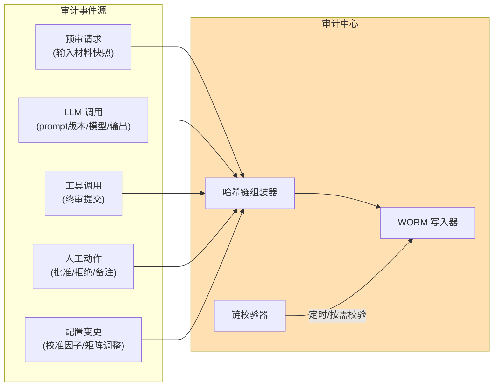
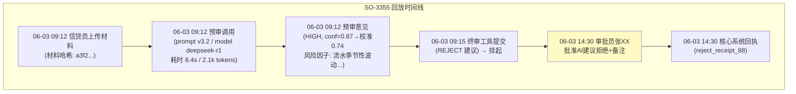

# 项目 06：金融风控 Agent 系统 — 04-全量审计与决策回放

> **定位**：构建"事后不可抵赖、记录不可篡改、历史可完整回放"的审计体系——哈希链、WORM 留存、决策回放。监管检查的技术底气。**本文给出完整可手写代码（一行不省略）。**
>
> 「遇到阻塞？→ [教程 04-企业级架构主干/03-工具执行可观测与审计 §审计数据模型]、[教程 04-企业级架构主干/05-历史记录持久化与合规 §WORM 与留存]、[教程 08-架构师进阶/09-Agent治理与合规框架 §行为审计]」

---

## 1. 需求与上一版痛点（四问）

| 问 | 答 |
|----|----|
| **新增了什么需求** | ① 哈希链防篡改 ② 决策回放（输入/版本/输出/人工动作全快照） ③ 独立审计库与独立权限 |
| **影响了哪些模块** | 新增审计中心（哈希链组装器/WORM 写入器/链校验器）；审批、预审、工具执行全部接入审计 |
| **架构如何演进** | 从"审批日志是普通表"升级为"哈希链 + WORM 只追加存储 + 每日外部锚定" |
| **上一版痛点是什么** | 审批记录理论上可被 DBA 篡改；"当时 AI 为什么这么建议"无法还原；审计与业务数据混存 |

| v3 痛点 | 对策 |
|---------|------|
| 审批记录理论上可被 DBA 篡改 | 哈希链 + WORM 存储 |
| "当时 AI 为什么这么建议"无法还原 | 决策回放：输入/版本/输出/人工动作全快照 |
| 审计与业务数据混存 | 独立审计库、独立权限、独立保留期 |

### 1.1 本节核对（四问）

- [ ] 三条 v3 痛点与三个新增能力（哈希链 / 回放快照 / 独立审计库）一一对应
- [ ] 痛点"DBA 可篡改"与 03 篇 §8 的衔接句一致

## 2. 审计事件模型



### 2.1 本节核对（事件模型）

- [ ] 五个事件源（预审/LLM/工具/人工/配置变更）与 §3.1 的七个 EventType 映射得上（另两个为 v5 交叉验证与审计查询）
- [ ] 图中三个组件（组装器/WORM 写入器/链校验器）分别对应 §3.6/§3.5/§3.6#verify，无缺失

## 3. 完整代码（照抄即可）

### 3.1 `AuditEvent.java`（审计事件）

```java
package com.bank.risk.domain;

import java.time.Instant;

/** 审计事件：链上最小单元。 */
public record AuditEvent(
        String eventId,
        EventType type,
        String applicationId,
        String payloadJson,     // 事件负载（材料快照/模型输出/审批决定等，规范化 JSON）
        String promptVersion,
        Instant occurredAt
) {
    public enum EventType {
        PRETRIAL_REQUEST,     // 预审请求
        OPINION_PRODUCED,     // 预审意见产出
        TOOL_CALLED,          // 工具调用
        APPROVAL_DECIDED,     // 审批决定
        CONFIG_CHANGED,       // 配置变更（校准因子/矩阵）
        CROSS_VALIDATION,     // 交叉验证结果（v5）
        AUDIT_QUERY           // 审计查询本身（ADR-113）
    }
}
```

### 3.2 `AuditRecord.java`（链上记录）

```java
package com.bank.risk.domain;

import java.time.Instant;

/** 链上审计记录：seq 连续 + prevHash 指向前一条 + hash 覆盖全部内容。 */
public record AuditRecord(
        long seq,
        Instant timestamp,
        AuditEvent event,
        String prevHash,
        String hash
) {}
```

### 3.3 `ChainVerification.java`（校验结果）

```java
package com.bank.risk.domain;

/** 链完整性校验结果。 */
public record ChainVerification(boolean intact, long brokenAtSeq, long size) {

    public static ChainVerification intact(long size) {
        return new ChainVerification(true, -1, size);
    }

    public static ChainVerification brokenAt(long seq) {
        return new ChainVerification(false, seq, -1);
    }
}
```

### 3.4 `WormStore.java`（WORM 存储接口）

```java
package com.bank.risk.service;

import com.bank.risk.domain.AuditRecord;

import java.util.List;
import java.util.Optional;

/** 只追加、不可 UPDATE/DELETE 的审计存储（存储层强制 WORM）。 */
public interface WormStore {

    Optional<AuditRecord> last();

    long nextSeq();

    void append(AuditRecord record);

    List<AuditRecord> readAll();

    List<AuditRecord> findByApplicationId(String applicationId);
}
```

### 3.5 `JdbcWormStore.java`（JDBC 实现）

```java
package com.bank.risk.service;

import com.bank.risk.domain.AuditEvent;
import com.bank.risk.domain.AuditRecord;
import com.fasterxml.jackson.databind.ObjectMapper;
import org.springframework.beans.factory.annotation.Autowired;
import org.springframework.jdbc.core.JdbcTemplate;
import org.springframework.stereotype.Repository;

import java.sql.ResultSet;
import java.sql.SQLException;
import java.time.Instant;
import java.util.List;
import java.util.Optional;

/**
 * 审计库只授权 INSERT/SELECT——业务 DBA 无写权限（权限隔离，验收项 4）。
 * 物理 WORM 由对象存储合规保留模式承担（保留期内任何角色不可删除）。
 */
@Repository
public class JdbcWormStore implements WormStore {

    @Autowired
    private JdbcTemplate jdbc;
    @Autowired
    private ObjectMapper objectMapper;

    @Override
    public Optional<AuditRecord> last() {
        return jdbc.query("SELECT * FROM audit_chain ORDER BY seq DESC LIMIT 1",
                (rs, i) -> map(rs)).stream().findFirst();
    }

    @Override
    public long nextSeq() {
        Long max = jdbc.queryForObject("SELECT COALESCE(MAX(seq), 0) FROM audit_chain", Long.class);
        // 生产建议改用 DB 序列保证并发下连续唯一；此处演示用 max+1
        return (max == null ? 0 : max) + 1;
    }

    @Override
    public void append(AuditRecord record) {
        jdbc.update("""
                INSERT INTO audit_chain (seq, event_json, event_type, application_id, prev_hash, hash, occurred_at)
                VALUES (?,?,?,?,?,?,?)
                """,
                record.seq(), toJson(record.event()), record.event().type().name(),
                record.event().applicationId(), record.prevHash(), record.hash(),
                java.sql.Timestamp.from(record.timestamp()));
    }

    @Override
    public List<AuditRecord> readAll() {
        return jdbc.query("SELECT * FROM audit_chain ORDER BY seq", (rs, i) -> map(rs));
    }

    @Override
    public List<AuditRecord> findByApplicationId(String applicationId) {
        return jdbc.query("SELECT * FROM audit_chain WHERE application_id = ? ORDER BY seq",
                (rs, i) -> map(rs), applicationId);
    }

    private AuditRecord map(ResultSet rs) throws SQLException {
        return new AuditRecord(
                rs.getLong("seq"),
                rs.getTimestamp("occurred_at").toInstant(),
                fromJson(rs.getString("event_json")),
                rs.getString("prev_hash"),
                rs.getString("hash"));
    }

    private String toJson(AuditEvent event) {
        try {
            return objectMapper.writeValueAsString(event);
        } catch (Exception e) {
            throw new IllegalStateException("审计事件序列化失败", e);
        }
    }

    private AuditEvent fromJson(String json) {
        try {
            return objectMapper.readValue(json, AuditEvent.class);
        } catch (Exception e) {
            throw new IllegalStateException("审计事件反序列化失败", e);
        }
    }
}
```

### 3.6 `AuditHashChain.java`（哈希链核心）

```java
package com.bank.risk.service;

import com.bank.risk.domain.AuditEvent;
import com.bank.risk.domain.AuditRecord;
import com.bank.risk.domain.ChainVerification;
import com.fasterxml.jackson.databind.ObjectMapper;
import com.fasterxml.jackson.databind.SerializationFeature;
import jakarta.annotation.PostConstruct;
import org.springframework.beans.factory.annotation.Autowired;
import org.springframework.stereotype.Component;

import java.nio.charset.StandardCharsets;
import java.security.MessageDigest;
import java.security.NoSuchAlgorithmException;
import java.time.Instant;
import java.util.HexFormat;
import java.util.List;

/**
 * 哈希链：每条记录 hash = SHA256(prevHash + "|" + canonicalJson(event))。
 * canonical（键排序）序列化——否则同一事件两次序列化哈希不同，链会随机断裂（ADR-114）。
 */
@Component
public class AuditHashChain {

    public static final String GENESIS = "GENESIS";

    private ObjectMapper canonicalMapper;

    @Autowired
    private WormStore wormStore;
    @Autowired
    private ObjectMapper springMapper;

    /** 依赖注入完成后构造 canonicalMapper：复制 Spring 注入的 ObjectMapper（含 JavaTimeModule，Instant 才能序列化），
     *  再开启键排序——append 与 verify 用同一实例，保证哈希可重算（ADR-114）。 */
    @PostConstruct
    public void init() {
        this.canonicalMapper = springMapper.copy()
                .configure(SerializationFeature.ORDER_MAP_ENTRIES_BY_KEYS, true);
    }

    public AuditRecord append(AuditEvent event) {
        String prevHash = wormStore.last().map(AuditRecord::hash).orElse(GENESIS);
        String canonical = canonicalJson(event);
        String hash = sha256(prevHash + "|" + canonical);
        AuditRecord record = new AuditRecord(wormStore.nextSeq(), Instant.now(), event, prevHash, hash);
        wormStore.append(record);
        return record;
    }

    /** 校验：重放整链验证连续性与哈希。 */
    public ChainVerification verify() {
        List<AuditRecord> all = wormStore.readAll();
        for (int i = 1; i < all.size(); i++) {
            AuditRecord prev = all.get(i - 1);
            AuditRecord cur = all.get(i);
            boolean ok = cur.prevHash().equals(prev.hash())
                    && cur.hash().equals(sha256(prev.hash() + "|" + canonicalJson(cur.event())))
                    && cur.seq() == prev.seq() + 1;
            if (!ok) {
                return ChainVerification.brokenAt(cur.seq());
            }
        }
        return ChainVerification.intact(all.size());
    }

    private String canonicalJson(Object value) {
        try {
            return canonicalMapper.writeValueAsString(value);
        } catch (Exception e) {
            throw new IllegalStateException("规范化序列化失败", e);
        }
    }

    private String sha256(String input) {
        try {
            MessageDigest digest = MessageDigest.getInstance("SHA-256");
            byte[] bytes = digest.digest(input.getBytes(StandardCharsets.UTF_8));
            return HexFormat.of().formatHex(bytes);
        } catch (NoSuchAlgorithmException e) {
            throw new IllegalStateException("SHA-256 不可用", e);
        }
    }
}
```

**威胁模型明确**：哈希链防"静默篡改"（改一条链就断）；DBA 换掉整条链无法靠链内校验发现——所以**每天把链尾哈希锚定到外部**（行内值班记录/独立系统），锚点之后整链替换也会暴露。这是审计设计的纵深，不是多余的偏执（ADR-112）。

### 3.7 `AuditService.java`（审计门面）

```java
package com.bank.risk.service;

import com.bank.risk.domain.AuditEvent;
import com.bank.risk.domain.AuditRecord;
import com.bank.risk.domain.ChainVerification;
import org.springframework.beans.factory.annotation.Autowired;
import org.springframework.stereotype.Service;

import java.util.List;

@Service
public class AuditService {

    @Autowired
    private AuditHashChain chain;
    @Autowired
    private WormStore wormStore;

    /** 业务侧唯一的写入口：所有审计事件经此落链。 */
    public AuditRecord record(AuditEvent event) {
        return chain.append(event);
    }

    public ChainVerification verify() {
        return chain.verify();
    }

    public List<AuditRecord> replayFor(String applicationId) {
        return wormStore.findByApplicationId(applicationId);
    }
}
```

**业务落链接线（对应 §1 宣称的审计接入——预审提交处与审批决定处，事件类型与 §2 事件模型/§3.1 EventType 一致）**：

`PreTrialService` 接线（v4 时点改造）：预审请求与意见产出两个落链点——

```java
package com.bank.risk.service;

import com.bank.risk.domain.AuditEvent;
import com.bank.risk.domain.PreTrialOpinion;
import com.bank.risk.domain.PreTrialOpinion.RiskLevel;
import com.fasterxml.jackson.databind.ObjectMapper;
import org.springframework.ai.chat.client.ChatClient;
import org.springframework.beans.factory.annotation.Autowired;
import org.springframework.beans.factory.annotation.Qualifier;
import org.springframework.beans.factory.annotation.Value;
import org.springframework.stereotype.Service;
import reactor.core.publisher.Mono;
import reactor.core.scheduler.Schedulers;

import java.time.Instant;
import java.util.Map;
import java.util.UUID;

// Spring AI 2.0.0 —— v4 审计接线版：两个落链点（PRETRIAL_REQUEST / OPINION_PRODUCED）
@Service
public class PreTrialService {

    @Autowired
    @Qualifier("modelAClient")
    private ChatClient chatClient;
    @Autowired
    private AuditService auditService;
    @Autowired
    private ObjectMapper objectMapper;

    @Value("${risk.prompt-version:v3.2}")
    private String promptVersion;   // 审计必需：每次落链带当时生效的 Prompt 版本

    public Mono<PreTrialOpinion> preTrial(String applicationId, String materialText) {
        return Mono.fromCallable(() -> {
                    // 落链点 1：预审请求（材料快照入链）
                    auditService.record(new AuditEvent(
                            UUID.randomUUID().toString(),
                            AuditEvent.EventType.PRETRIAL_REQUEST,
                            applicationId,
                            toJson(Map.of("material", materialText)),
                            promptVersion, Instant.now()));

                    PreTrialOpinion opinion = chatClient.prompt()
                            .user(u -> u.text("""
                                    申请编号：{appId}
                                    申请材料：
                                    {material}
                                    """)
                                    .param("appId", applicationId)
                                    .param("material", materialText))
                            .call()
                            .entity(PreTrialOpinion.class);
                    PreTrialOpinion validated = validate(opinion);

                    // 落链点 2：预审意见产出（等级/置信度/风险因子入链，v7 月报按 riskLevel 统计）
                    auditService.record(new AuditEvent(
                            UUID.randomUUID().toString(),
                            AuditEvent.EventType.OPINION_PRODUCED,
                            applicationId,
                            toJson(validated),
                            promptVersion, Instant.now()));
                    return validated;
                })
                .subscribeOn(Schedulers.boundedElastic());
    }

    /** 分层信任：entity 只保证 JSON 可解析；这里做语义校验（v1 §3.5 同款完整展开）。 */
    private PreTrialOpinion validate(PreTrialOpinion opinion) {
        if (opinion.confidence() < 0 || opinion.confidence() > 1) {
            throw new OpinionValidationException("confidence 越界: " + opinion.confidence());
        }
        if (opinion.riskLevel() == RiskLevel.HIGH && opinion.riskFactors().stream()
                .noneMatch(f -> "high".equals(f.severity()))) {
            throw new OpinionValidationException("HIGH 等级必须至少有一个 high 风险因子支撑");
        }
        return opinion;
    }

    private String toJson(Object value) {
        try {
            return objectMapper.writeValueAsString(value);
        } catch (Exception e) {
            throw new IllegalStateException("审计负载序列化失败", e);
        }
    }
}
```

> v1 原版的 `validate` 含"HIGH 必须有 high 因子"第二条校验——接线版保留 v1 原文完整展开（校验逻辑与审计无关，但"零省略"口径要求完整，不再留给读者自行抄录）。

`ApprovalService` 接线（v4 时点改造）：审批决定与终审工具执行两个落链点——

```java
package com.bank.risk.service;

import com.bank.risk.domain.AuditEvent;
import com.bank.risk.domain.ApprovalCheckpoint;
import com.bank.risk.domain.ApprovalStatus;
import com.fasterxml.jackson.databind.JsonNode;
import com.fasterxml.jackson.databind.ObjectMapper;
import org.springframework.ai.chat.messages.AssistantMessage;
import org.springframework.ai.chat.messages.Message;
import org.springframework.beans.factory.annotation.Autowired;
import org.springframework.beans.factory.annotation.Value;
import org.springframework.stereotype.Service;
import reactor.core.publisher.Mono;

import java.time.Instant;
import java.util.List;
import java.util.UUID;

// Spring AI 2.0.0 —— v4 审计接线版：两个落链点（TOOL_CALLED / APPROVAL_DECIDED）
@Service
public class ApprovalService {

    @Autowired
    private PendingApprovalStore store;
    @Autowired
    private ApproverNotifier notifier;
    @Autowired
    private ApprovalExecutor approvalExecutor;
    @Autowired
    private AuditService auditService;
    @Autowired
    private ObjectMapper objectMapper;

    @Value("${risk.prompt-version:v3.2}")
    private String promptVersion;

    /** 挂起：保存 Checkpoint、通知审批员，返回 approvalId（v3 §4.9 原版完整抄录，接线版不省略）。 */
    public String suspend(String applicationId, List<Message> conversation, AssistantMessage.ToolCall call) {
        String approvalId = UUID.randomUUID().toString();
        ApprovalCheckpoint cp = new ApprovalCheckpoint(
                approvalId, applicationId, toJson(conversation), call.name(), call.arguments(),
                null, promptVersion, ApprovalStatus.PENDING, null, null, Instant.now(), null);
        store.save(cp);
        notifier.notifyApprovers(approvalId, applicationId, call.name());
        return approvalId;
    }

    public ApprovalStatus statusFor(String applicationId) {
        return store.findByApplicationId(applicationId)
                .map(ApprovalCheckpoint::status)
                .orElse(ApprovalStatus.NONE);
    }

    public String currentApprovalId(String applicationId) {
        return store.findByApplicationId(applicationId)
                .map(ApprovalCheckpoint::approvalId)
                .orElseThrow(() -> new IllegalStateException("无挂起审批: " + applicationId));
    }

    public ApprovalCheckpoint detail(String approvalId) {
        return store.findById(approvalId)
                .orElseThrow(() -> new IllegalArgumentException("审批单不存在: " + approvalId));
    }

    public List<ApprovalCheckpoint> listPending() {
        return store.listPending();
    }

    public Mono<Void> decide(String approvalId, ApprovalDecision decision, String approver, String remark) {
        ApprovalCheckpoint cp = store.findById(approvalId)
                .orElseThrow(() -> new IllegalArgumentException("审批单不存在: " + approvalId));
        if (decision == ApprovalDecision.APPROVE) {
            return approvalExecutor.executeApproved(cp, approver, remark)
                    .doOnSuccess(receipt -> {
                        // 落链点 3：终审工具真正执行（审批放行后）
                        record(cp, "TOOL_CALLED",
                                "{\"tool\":\"submit_final_decision\",\"receipt\":\"" + receipt.status() + "\"}");
                        // 落链点 4：审批决定（outcome 供 v7 月报 overrideRate 统计：OVERRIDE=人工推翻 AI 建议）
                        record(cp, "APPROVAL_DECIDED",
                                "{\"decision\":\"APPROVE\",\"approver\":\"" + approver
                                        + "\",\"outcome\":\"" + outcomeOf(cp, "APPROVE") + "\"}");
                    })
                    .then();
        }
        store.updateDecision(approvalId, approver, remark, ApprovalStatus.REJECTED);
        // 落链点 4（拒绝路径）：人工否决同样入链
        record(cp, "APPROVAL_DECIDED",
                "{\"decision\":\"REJECT\",\"approver\":\"" + approver
                        + "\",\"outcome\":\"" + outcomeOf(cp, "REJECT") + "\",\"remark\":\"" + remark + "\"}");
        notifier.notifySubmitter(approvalId, "您的终审提交被拒绝: " + remark);
        return Mono.empty();
    }

    /** OVERRIDE/CONFIRM 判定：人工决定与挂起时 AI 建议（工具参数里的 decision）不一致即 OVERRIDE。 */
    private String outcomeOf(ApprovalCheckpoint cp, String humanDecision) {
        try {
            JsonNode args = objectMapper.readTree(cp.toolCallArguments());
            String aiSuggestion = args.path("decision").asText("");
            return aiSuggestion.equalsIgnoreCase(humanDecision) ? "CONFIRM" : "OVERRIDE";
        } catch (Exception e) {
            return "OVERRIDE";   // 建议不可解析时按保守口径记 OVERRIDE
        }
    }

    private void record(ApprovalCheckpoint cp, String type, String payloadJson) {
        auditService.record(new AuditEvent(
                UUID.randomUUID().toString(),
                AuditEvent.EventType.valueOf(type),
                cp.applicationId(),
                payloadJson,
                cp.promptVersion(),
                Instant.now()));
    }

    private String toJson(Object value) {
        try {
            return objectMapper.writeValueAsString(value);
        } catch (Exception e) {
            throw new IllegalStateException("序列化失败", e);
        }
    }

    public enum ApprovalDecision { APPROVE, REJECT }
}
```

> v3 原版的 `suspend/statusFor/currentApprovalId/detail/listPending/toJson` 未变方法已在上方完整抄录（与 v3 §4.9 逐行等价，注入改为 @Autowired 字段风格），接线改动仅在 `decide` 增加两个落链点与新增 `record`/`outcomeOf`。手写后跑 §3.11/§3.12 的链完整性与回放断言：`GET /api/audit/replay/{applicationId}` 时间线应包含 PRETRIAL_REQUEST→OPINION_PRODUCED→TOOL_CALLED→APPROVAL_DECIDED 四类事件（§10 回归断言 2 的依赖）。

### 3.8 `AuditController.java`（校验 + 回放 + 查询审计）

```java
package com.bank.risk.controller;

import com.bank.risk.domain.AuditEvent;
import com.bank.risk.domain.AuditRecord;
import com.bank.risk.domain.ChainVerification;
import com.bank.risk.service.AuditService;
import org.springframework.beans.factory.annotation.Autowired;
import org.springframework.web.bind.annotation.GetMapping;
import org.springframework.web.bind.annotation.PathVariable;
import org.springframework.web.bind.annotation.RequestMapping;
import org.springframework.web.bind.annotation.RestController;
import reactor.core.publisher.Mono;
import reactor.core.scheduler.Schedulers;

import java.time.Instant;
import java.util.List;
import java.util.UUID;

@RestController
@RequestMapping("/api/audit")
public class AuditController {

    @Autowired
    private AuditService auditService;

    /** 链完整性校验（定时任务/监管按需触发）。 */
    @GetMapping("/verify")
    public Mono<ChainVerification> verify() {
        return Mono.fromCallable(auditService::verify)
                .subscribeOn(Schedulers.boundedElastic());
    }

    /** 决策回放：重建某申请的全量时间线。 */
    @GetMapping("/replay/{applicationId}")
    public Mono<List<AuditRecord>> replay(@PathVariable String applicationId) {
        return Mono.fromCallable(() -> {
            // ADR-113：查询审计本身也被审计
            auditService.record(new AuditEvent(
                    UUID.randomUUID().toString(),
                    AuditEvent.EventType.AUDIT_QUERY,
                    applicationId,
                    "{\"action\":\"REPLAY\"}",
                    null,
                    Instant.now()));
            return auditService.replayFor(applicationId);
        }).subscribeOn(Schedulers.boundedElastic());
    }
}
```

### 3.9 SQL DDL（审计链 + 权限提示）

```sql
-- 审计哈希链（只授权 INSERT/SELECT；UPDATE/DELETE 一律拒绝——WORM 语义）
CREATE TABLE IF NOT EXISTS audit_chain (
    seq            BIGINT PRIMARY KEY,
    event_json     CLOB       NOT NULL,     -- 完整审计事件（规范化 JSON）
    event_type     VARCHAR(64) NOT NULL,
    application_id VARCHAR(64),
    prev_hash      VARCHAR(64) NOT NULL,    -- 前一条的 hash（GENESIS 为首条 prevHash）
    hash           VARCHAR(64) NOT NULL,    -- SHA256(prevHash + "|" + canonicalJson(event))
    occurred_at    TIMESTAMP  NOT NULL
);
CREATE INDEX IF NOT EXISTS idx_audit_app ON audit_chain(application_id);

-- 权限落地（在目标库执行）：
-- REVOKE UPDATE, DELETE ON audit_chain FROM business_dba;
-- GRANT INSERT, SELECT ON audit_chain TO business_dba;
```

### 3.10 `DailyAnchorTask.java`（每日外部锚定任务）

验收 2 的每日锚定（§3.6 威胁模型：锚点之后整链替换也会暴露，ADR-112）：链尾哈希每日写外部锚点表。锚点表与审计库分权——只许 INSERT，防"锚点被同手改"。生产写行内值班记录/独立系统，本地演示用独立 H2 表。

```java
package com.bank.risk.service;

import com.bank.risk.domain.AuditRecord;
import org.springframework.beans.factory.annotation.Autowired;
import org.springframework.jdbc.core.JdbcTemplate;
import org.springframework.scheduling.annotation.Scheduled;
import org.springframework.stereotype.Component;

import java.sql.Timestamp;
import java.time.Instant;
import java.util.Optional;

/** 每日锚定：把链尾 hash 写入独立锚点表——锚点之后整链替换也会暴露（威胁模型见 §3.6）。 */
@Component
public class DailyAnchorTask {

    @Autowired
    private WormStore wormStore;
    @Autowired
    private JdbcTemplate anchorJdbc;   // 独立数据源（锚点库），不复用审计库连接

    @Scheduled(cron = "0 30 23 * * ?")   // 每日 23:30 锚定当天链尾（需 @EnableScheduling，同 03 篇 §4.17）
    public void anchor() {
        Optional<AuditRecord> tail = wormStore.last();
        tail.ifPresent(record -> anchorJdbc.update(
                "INSERT INTO anchor_log (seq, chain_tail_hash, anchored_at) VALUES (?,?,?)",
                record.seq(), record.hash(), Timestamp.from(Instant.now())));
    }
}
```

```sql
-- 锚点表（独立库执行；只授权 INSERT/SELECT）
CREATE TABLE IF NOT EXISTS anchor_log (
    id               BIGINT PRIMARY KEY AUTO_INCREMENT,
    seq              BIGINT      NOT NULL,
    chain_tail_hash  VARCHAR(64) NOT NULL,
    anchored_at      TIMESTAMP   NOT NULL
);
```

**本节测试与验证（每日锚定）**：

- 断言：链上 append 一条事件后调 `anchor()` → `anchor_log` 新增一行，`chain_tail_hash` 与 `wormStore.last()` 一致；对 `audit_chain` 执行 UPDATE 篡改后再次 `anchor()` → 新锚点 hash 变化，与上次锚点比对即可发现整链被替换（ADR-112 的检测面）。

### 3.11 本节测试与验证（哈希链与 WORM 存储）

**前置条件**：v3 已可用；H2 数据源在位（复用 03 篇）；§3.9 DDL 已执行。

**材料——链完整性单测**（手写，用 H2 真库）：

```java
// AuditHashChainTest：
// ① 依次 append 三个不同类型事件 → verify() 返回 intact(size=3)
// ② 直接对 audit_chain 执行 jdbc.update("UPDATE audit_chain SET event_json='篡改' WHERE seq=2")
//    → verify() 返回 brokenAt(2)
// ③ 重启应用（或重建 bean）后再 append 一条 → verify() 仍 intact —— 哈希可重算（canonicalMapper 持久一致）
// ④ 同一事件对象 append 两次（同内容）→ 链仍 intact（内容相同不破坏链，只是多一条记录）
```

```bash
# 权限核对（目标库为 PostgreSQL 时，人工审查项；本地 H2 无角色体系无法模拟）：
# ① 以审计库管理员执行 §3.9 注释的 REVOKE UPDATE, DELETE / GRANT INSERT, SELECT
# ② 以 business_dba 登录执行：UPDATE audit_chain SET event_json='篡改' WHERE seq=1;
# 预期：② 报权限拒绝（permission denied for table audit_chain）——验收 4 的可执行核对点
```

**步骤与断言**：

| # | 操作 | 预期（PASS 判据） |
|---|------|------------------|
| 1 | `mvn clean test` | 材料①–④ 按注释预期通过 |
| 2 | 首条记录核对 | seq=1，prevHash=`GENESIS`，hash=SHA256("GENESIS|" + canonicalJson) 长度 64 十六进制 |
| 3 | canonical 核对 | canonicalMapper 开启了 `ORDER_MAP_ENTRIES_BY_KEYS`（ADR-114），append 与 verify 用同一实例 |
| 4 | 权限核对（目标库为 PG 时，本地 H2 无角色体系 → 标注人工审查项） | 在 PG 预发库执行 §3.9 注释的 REVOKE/GRANT 后，以 business_dba 登录执行上方 SQL 应报 `permission denied for table audit_chain`（本地无法模拟，作为上线前人工审查项在预发环境核对） |

**失败排查**：③重启后链断→ObjectMapper 配置不一致（两处 new 了不同配置的 mapper）；②UPDATE 后仍 intact→map() 读回的 event_json 与哈希所用 canonical 不一致（键序/时间格式漂移）；Instant 序列化失败→未复制 Spring 注入的含 JavaTimeModule 的 mapper。

### 3.12 本节测试与验证（审计门面 / 校验与回放 API）

**前置条件**：§3.11 通过；应用已启动。

**材料——curl 探针**：

```bash
# ① 校验链完整性
curl "http://localhost:8081/api/audit/verify"
# ② 回放某申请
curl "http://localhost:8081/api/audit/replay/SO-0001"
```

**步骤与断言**：

| # | 操作 | 预期（PASS 判据） |
|---|------|------------------|
| 1 | 材料① | `{"intact":true,"brokenAtSeq":-1,"size":N}`（N≥ 已落链事件数） |
| 2 | 材料②（先完成一次 v3 全流程使 SO-0001 有事件） | 返回列表按 seq 升序，含 PRETRIAL_REQUEST/APPROVAL_DECIDED 等本单相关事件 |
| 3 | 再次材料② | 链上多一条 `AUDIT_QUERY` 事件（查询本身被审计，ADR-113）——用 `SELECT * FROM audit_chain WHERE event_type='AUDIT_QUERY'` 核对 |

**失败排查**：①intact=false→上一轮测试残留了被篡改的行，清库重跑；②空列表→该申请的事件落链点未接入（业务侧 record 调用遗漏）；③AUDIT_QUERY 不出现→replay 里漏了 record 调用。

## 4. 决策回放

监管问询的典型问题："2026 年 6 月申请 SO-3355，AI 为什么建议拒绝？"——回放接口从审计链重建完整时间线：



**回放的完整性**：Prompt 版本号在链上（`AuditEvent.promptVersion`），所以回放可以精确重放"当时的提示词+当时的材料"——必要时可离线重跑验证结论一致性（模型本身不可复现，但输入与版本可追溯）。

### 4.1 本节核对（回放完整性）

- [ ] 回放时间线六要素（材料上传/预审调用/意见/挂起/人工决定/回执）能对照 §3.1 的 EventType 一一指出落链事件类型
- [ ] `promptVersion` 在 `AuditEvent` 字段中存在，支撑"当时的提示词可追溯"论断

## 5. WORM 留存策略

| 数据 | 存储 | 保留期 | 依据 |
|------|------|--------|------|
| 审计哈希链 | WORM（对象存储合规保留模式） | 7 年 | 监管留存要求（SEC 17a-4 精神，国内监管同类） |
| 材料快照（脱敏后） | 加密对象存储 | 7 年 | 回放依据 |
| PII 原文 | 行内加密库 | 按数据分级策略 | 最小化接触面 |
| Trace/Span | 观测系统 | 30 天 | 排障用途，非审计 |

### 5.1 本节核对（留存策略）

- [ ] 四行数据的存储/保留期/依据三列齐全，无空缺
- [ ] 金融审计记录为"不可删除（WORM）"而非"到期物理删除"，与教程 03-React前端与AgenticUI/01-React状态管理 §6.2 的更严口径一致

**注意与 [教程 03-React前端与AgenticUI/01-React状态管理 §6.2 数据留存期限矩阵] 的对齐**：金融交易相关记录是"不可删除"（WORM），不是"到期物理删除"——两类留存义务并存时取**更严格者**（审计篇当年在这里有矛盾表述，本篇按合规口径为准）。

## 6. 验收对照

| # | 验收项 | 标准 |
|---|--------|------|
| 1 | 篡改可检测 | 人工 UPDATE 任意一条记录，链校验器 100% 报告断点位置 |
| 2 | 锚定机制 | 每日链尾哈希锚定外部系统；整链替换可被发现 |
| 3 | 回放完整 | 随机抽 50 单历史决策，回放时间线六要素（输入/版本/输出/挂起/人工/回执）齐全 |
| 4 | 权限隔离 | 业务 DBA 无审计库写权限；审计查询单独授权、单独审计（查审计也有日志） |
| 5 | 保留合规 | WORM 存储在保留期内任何角色（含系统管理员）无法删除 |

> 与章节验证的映射：验收 1=§3.11 材料②、验收 2=每日锚定任务（落地实现见 §3.10 DailyAnchorTask + 锚点表 DDL）、验收 3=§4.1 核对+§3.12 断言 2、验收 4=§3.11 断言 4、验收 5=对象存储保留模式配置项。本表不重复材料。

## 7. 本迭代的 ADR

| # | 决策 | 理由 |
|---|------|------|
| ADR-112 | 哈希链+每日外部锚定，不上区块链 | 链内防篡改+锚点防整链替换已覆盖威胁模型；区块链引入的复杂度与性能成本不成比例 |
| ADR-113 | 审计查询本身被审计 | 监管要求"谁看过审批记录"也可追溯 |
| ADR-114 | canonical JSON（键排序）后再哈希 | 序列化不稳定会让哈希链随机断裂 |

### 7.1 本节核对（ADR-112~114）

- [ ] ADR-112"不上区块链"的威胁模型论证（链内防静默篡改+锚点防整链替换）能复述
- [ ] ADR-113 与 §3.8 replay 的 AUDIT_QUERY 落链对应；ADR-114 与 §3.6 canonicalMapper 对应

## 8. v4 的痛点

审计立住了，业务侧的新焦虑：**高额度申请（>500 万）的错误代价太大**——单模型预审在该额度段的对照一致率只有 81%。→ [05-多模型交叉验证.md](05-多模型交叉验证.md)

## 9. 总结

| 概念 | 一句话 |
|------|--------|
| 哈希链 | `SHA256(prevHash + "|" + canonicalJson(event))`，seq 连续 + prevHash 指向前 |
| WORM | 只 INSERT/SELECT，权限与保留模式双重强制 |
| 回放 | 事件链 + promptVersion + 材料快照 → 精确重建"当时的决策" |
| 锚定 | 链尾哈希每日锚定外部，防整链替换 |
| 查询审计 | 谁看过审批记录，也入链（ADR-113） |

> §8 一句话核对：痛点（高额度单模型一致率 81%）指向 05 交叉验证即 PASS；§9 总结五行与 §3.6/§3.9/§3.8/ADR-112/ADR-113 一一对应即 PASS。

## 10. 全篇回归验证

**前置条件**：§3.11 / §3.12 通过；v3 审批流可用。

| # | 操作 | 预期（PASS 判据） |
|---|------|------------------|
| 1 | `mvn clean test` | 全部单测通过，`BUILD SUCCESS` |
| 2 | 全流程剧本：预审→挂起→批准（或拒绝），随后 `GET /api/audit/replay/{applicationId}` | 时间线包含 PRETRIAL_REQUEST→OPINION_PRODUCED→TOOL_CALLED→APPROVAL_DECIDED 完整链路（跨 v3/v4 集成回归） |
| 3 | 流程结束后 `GET /api/audit/verify` | intact=true（新事件追加未破坏旧链） |

**失败排查**：②缺事件类型→对应业务点的 record 调用漏写；③链断→并发 append 导致 seq 冲突（nextSeq 用 max+1，演示实现非并发安全，生产换 DB 序列——代码注释已标注）。
