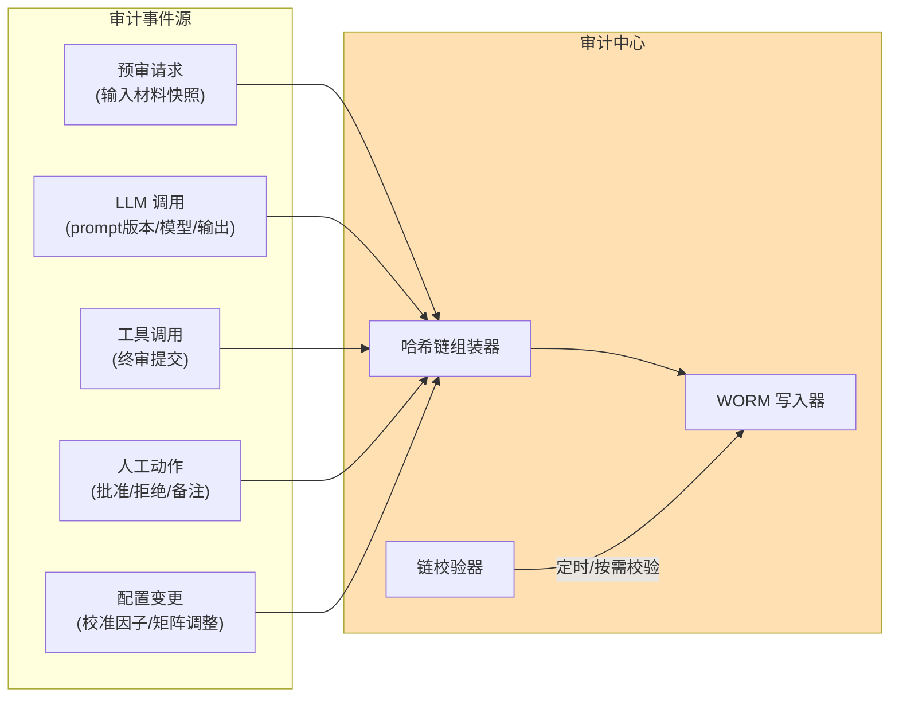
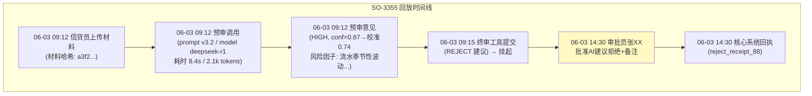

# 项目 06：金融风控 Agent 系统 — 04-全量审计与决策回放

> **定位**：构建"事后不可抵赖、记录不可篡改、历史可完整回放"的审计体系——哈希链、WORM 留存、决策回放。监管检查的技术底气。**本文给出完整可手写代码（一行不省略）。**
>
> 「遇到阻塞？→ [教程 23-工具执行可观测与审计 §审计数据模型]、[教程 25-历史记录持久化与合规 §WORM 与留存]、[教程 43-Agent治理与合规框架 §行为审计]」

---

## 1. 需求与上一版痛点（四问）

| 问 | 答 |
|----|----|
| **新增了什么需求** | ① 哈希链防篡改 ② 决策回放（输入/版本/输出/人工动作全快照） ③ 独立审计库与独立权限 |
| **影响了哪些模块** | 新增审计中心（哈希链组装器/WORM 写入器/链校验器）；审批、预审、工具执行全部接入审计 |
| **架构如何演进** | 从"审批日志是普通表"升级为"哈希链 + WORM 只追加存储 + 每日外部锚定" |
| **上一版痛点是什么** | 审批记录理论上可被 DBA 篡改；"当时 AI 为什么这么建议"无法还原；审计与业务数据混存 |

| v3 痛点 | 对策 |
|---------|------|
| 审批记录理论上可被 DBA 篡改 | 哈希链 + WORM 存储 |
| "当时 AI 为什么这么建议"无法还原 | 决策回放：输入/版本/输出/人工动作全快照 |
| 审计与业务数据混存 | 独立审计库、独立权限、独立保留期 |

## 2. 审计事件模型



## 3. 完整代码（照抄即可）

### 3.1 `AuditEvent.java`（审计事件）

```java
package com.bank.risk.domain;

import java.time.Instant;

/** 审计事件：链上最小单元。 */
public record AuditEvent(
        String eventId,
        EventType type,
        String applicationId,
        String payloadJson,     // 事件负载（材料快照/模型输出/审批决定等，规范化 JSON）
        String promptVersion,
        Instant occurredAt
) {
    public enum EventType {
        PRETRIAL_REQUEST,     // 预审请求
        OPINION_PRODUCED,     // 预审意见产出
        TOOL_CALLED,          // 工具调用
        APPROVAL_DECIDED,     // 审批决定
        CONFIG_CHANGED,       // 配置变更（校准因子/矩阵）
        CROSS_VALIDATION,     // 交叉验证结果（v5）
        AUDIT_QUERY           // 审计查询本身（ADR-113）
    }
}
```

### 3.2 `AuditRecord.java`（链上记录）

```java
package com.bank.risk.domain;

import java.time.Instant;

/** 链上审计记录：seq 连续 + prevHash 指向前一条 + hash 覆盖全部内容。 */
public record AuditRecord(
        long seq,
        Instant timestamp,
        AuditEvent event,
        String prevHash,
        String hash
) {}
```

### 3.3 `ChainVerification.java`（校验结果）

```java
package com.bank.risk.domain;

/** 链完整性校验结果。 */
public record ChainVerification(boolean intact, long brokenAtSeq, long size) {

    public static ChainVerification intact(long size) {
        return new ChainVerification(true, -1, size);
    }

    public static ChainVerification brokenAt(long seq) {
        return new ChainVerification(false, seq, -1);
    }
}
```

### 3.4 `WormStore.java`（WORM 存储接口）

```java
package com.bank.risk.service;

import com.bank.risk.domain.AuditRecord;

import java.util.List;
import java.util.Optional;

/** 只追加、不可 UPDATE/DELETE 的审计存储（存储层强制 WORM）。 */
public interface WormStore {

    Optional<AuditRecord> last();

    long nextSeq();

    void append(AuditRecord record);

    List<AuditRecord> readAll();

    List<AuditRecord> findByApplicationId(String applicationId);
}
```

### 3.5 `JdbcWormStore.java`（JDBC 实现）

```java
package com.bank.risk.service;

import com.bank.risk.domain.AuditEvent;
import com.bank.risk.domain.AuditRecord;
import com.fasterxml.jackson.databind.ObjectMapper;
import org.springframework.jdbc.core.JdbcTemplate;
import org.springframework.stereotype.Repository;

import java.sql.ResultSet;
import java.sql.SQLException;
import java.time.Instant;
import java.util.List;
import java.util.Optional;

/**
 * 审计库只授权 INSERT/SELECT——业务 DBA 无写权限（权限隔离，验收项 4）。
 * 物理 WORM 由对象存储合规保留模式承担（保留期内任何角色不可删除）。
 */
@Repository
public class JdbcWormStore implements WormStore {

    private final JdbcTemplate jdbc;
    private final ObjectMapper objectMapper;

    public JdbcWormStore(JdbcTemplate jdbc, ObjectMapper objectMapper) {
        this.jdbc = jdbc;
        this.objectMapper = objectMapper;
    }

    @Override
    public Optional<AuditRecord> last() {
        return jdbc.query("SELECT * FROM audit_chain ORDER BY seq DESC LIMIT 1",
                (rs, i) -> map(rs)).stream().findFirst();
    }

    @Override
    public long nextSeq() {
        Long max = jdbc.queryForObject("SELECT COALESCE(MAX(seq), 0) FROM audit_chain", Long.class);
        // 生产建议改用 DB 序列保证并发下连续唯一；此处演示用 max+1
        return (max == null ? 0 : max) + 1;
    }

    @Override
    public void append(AuditRecord record) {
        jdbc.update("""
                INSERT INTO audit_chain (seq, event_json, event_type, application_id, prev_hash, hash, occurred_at)
                VALUES (?,?,?,?,?,?,?)
                """,
                record.seq(), toJson(record.event()), record.event().type().name(),
                record.event().applicationId(), record.prevHash(), record.hash(),
                java.sql.Timestamp.from(record.timestamp()));
    }

    @Override
    public List<AuditRecord> readAll() {
        return jdbc.query("SELECT * FROM audit_chain ORDER BY seq", (rs, i) -> map(rs));
    }

    @Override
    public List<AuditRecord> findByApplicationId(String applicationId) {
        return jdbc.query("SELECT * FROM audit_chain WHERE application_id = ? ORDER BY seq",
                (rs, i) -> map(rs), applicationId);
    }

    private AuditRecord map(ResultSet rs) throws SQLException {
        return new AuditRecord(
                rs.getLong("seq"),
                rs.getTimestamp("occurred_at").toInstant(),
                fromJson(rs.getString("event_json")),
                rs.getString("prev_hash"),
                rs.getString("hash"));
    }

    private String toJson(AuditEvent event) {
        try {
            return objectMapper.writeValueAsString(event);
        } catch (Exception e) {
            throw new IllegalStateException("审计事件序列化失败", e);
        }
    }

    private AuditEvent fromJson(String json) {
        try {
            return objectMapper.readValue(json, AuditEvent.class);
        } catch (Exception e) {
            throw new IllegalStateException("审计事件反序列化失败", e);
        }
    }
}
```

### 3.6 `AuditHashChain.java`（哈希链核心）

```java
package com.bank.risk.service;

import com.bank.risk.domain.AuditEvent;
import com.bank.risk.domain.AuditRecord;
import com.bank.risk.domain.ChainVerification;
import com.fasterxml.jackson.databind.ObjectMapper;
import com.fasterxml.jackson.databind.SerializationFeature;
import org.springframework.stereotype.Component;

import java.nio.charset.StandardCharsets;
import java.security.MessageDigest;
import java.security.NoSuchAlgorithmException;
import java.time.Instant;
import java.util.HexFormat;
import java.util.List;

/**
 * 哈希链：每条记录 hash = SHA256(prevHash + "|" + canonicalJson(event))。
 * canonical（键排序）序列化——否则同一事件两次序列化哈希不同，链会随机断裂（ADR-114）。
 */
@Component
public class AuditHashChain {

    public static final String GENESIS = "GENESIS";

    private final WormStore wormStore;
    private final ObjectMapper canonicalMapper;

    public AuditHashChain(WormStore wormStore, ObjectMapper springMapper) {
        this.wormStore = wormStore;
        // 复制 Spring 注入的 ObjectMapper（含 JavaTimeModule，Instant 才能序列化），
        // 再开启键排序——append 与 verify 用同一实例，保证哈希可重算（ADR-114）。
        this.canonicalMapper = springMapper.copy()
                .configure(SerializationFeature.ORDER_MAP_ENTRIES_BY_KEYS, true);
    }

    public AuditRecord append(AuditEvent event) {
        String prevHash = wormStore.last().map(AuditRecord::hash).orElse(GENESIS);
        String canonical = canonicalJson(event);
        String hash = sha256(prevHash + "|" + canonical);
        AuditRecord record = new AuditRecord(wormStore.nextSeq(), Instant.now(), event, prevHash, hash);
        wormStore.append(record);
        return record;
    }

    /** 校验：重放整链验证连续性与哈希。 */
    public ChainVerification verify() {
        List<AuditRecord> all = wormStore.readAll();
        for (int i = 1; i < all.size(); i++) {
            AuditRecord prev = all.get(i - 1);
            AuditRecord cur = all.get(i);
            boolean ok = cur.prevHash().equals(prev.hash())
                    && cur.hash().equals(sha256(prev.hash() + "|" + canonicalJson(cur.event())))
                    && cur.seq() == prev.seq() + 1;
            if (!ok) {
                return ChainVerification.brokenAt(cur.seq());
            }
        }
        return ChainVerification.intact(all.size());
    }

    private String canonicalJson(Object value) {
        try {
            return canonicalMapper.writeValueAsString(value);
        } catch (Exception e) {
            throw new IllegalStateException("规范化序列化失败", e);
        }
    }

    private String sha256(String input) {
        try {
            MessageDigest digest = MessageDigest.getInstance("SHA-256");
            byte[] bytes = digest.digest(input.getBytes(StandardCharsets.UTF_8));
            return HexFormat.of().formatHex(bytes);
        } catch (NoSuchAlgorithmException e) {
            throw new IllegalStateException("SHA-256 不可用", e);
        }
    }
}
```

**威胁模型明确**：哈希链防"静默篡改"（改一条链就断）；DBA 换掉整条链无法靠链内校验发现——所以**每天把链尾哈希锚定到外部**（行内值班记录/独立系统），锚点之后整链替换也会暴露。这是审计设计的纵深，不是多余的偏执（ADR-112）。

### 3.7 `AuditService.java`（审计门面）

```java
package com.bank.risk.service;

import com.bank.risk.domain.AuditEvent;
import com.bank.risk.domain.AuditRecord;
import com.bank.risk.domain.ChainVerification;
import org.springframework.stereotype.Service;

import java.util.List;

@Service
public class AuditService {

    private final AuditHashChain chain;
    private final WormStore wormStore;

    public AuditService(AuditHashChain chain, WormStore wormStore) {
        this.chain = chain;
        this.wormStore = wormStore;
    }

    /** 业务侧唯一的写入口：所有审计事件经此落链。 */
    public AuditRecord record(AuditEvent event) {
        return chain.append(event);
    }

    public ChainVerification verify() {
        return chain.verify();
    }

    public List<AuditRecord> replayFor(String applicationId) {
        return wormStore.findByApplicationId(applicationId);
    }
}
```

### 3.8 `AuditController.java`（校验 + 回放 + 查询审计）

```java
package com.bank.risk.web;

import com.bank.risk.domain.AuditEvent;
import com.bank.risk.domain.AuditRecord;
import com.bank.risk.domain.ChainVerification;
import com.bank.risk.service.AuditService;
import org.springframework.web.bind.annotation.GetMapping;
import org.springframework.web.bind.annotation.PathVariable;
import org.springframework.web.bind.annotation.RequestMapping;
import org.springframework.web.bind.annotation.RestController;
import reactor.core.publisher.Mono;
import reactor.core.scheduler.Schedulers;

import java.time.Instant;
import java.util.List;
import java.util.UUID;

@RestController
@RequestMapping("/api/audit")
public class AuditController {

    private final AuditService auditService;

    public AuditController(AuditService auditService) {
        this.auditService = auditService;
    }

    /** 链完整性校验（定时任务/监管按需触发）。 */
    @GetMapping("/verify")
    public Mono<ChainVerification> verify() {
        return Mono.fromCallable(auditService::verify)
                .subscribeOn(Schedulers.boundedElastic());
    }

    /** 决策回放：重建某申请的全量时间线。 */
    @GetMapping("/replay/{applicationId}")
    public Mono<List<AuditRecord>> replay(@PathVariable String applicationId) {
        return Mono.fromCallable(() -> {
            // ADR-113：查询审计本身也被审计
            auditService.record(new AuditEvent(
                    UUID.randomUUID().toString(),
                    AuditEvent.EventType.AUDIT_QUERY,
                    applicationId,
                    "{\"action\":\"REPLAY\"}",
                    null,
                    Instant.now()));
            return auditService.replayFor(applicationId);
        }).subscribeOn(Schedulers.boundedElastic());
    }
}
```

### 3.9 SQL DDL（审计链 + 权限提示）

```sql
-- 审计哈希链（只授权 INSERT/SELECT；UPDATE/DELETE 一律拒绝——WORM 语义）
CREATE TABLE IF NOT EXISTS audit_chain (
    seq            BIGINT PRIMARY KEY,
    event_json     CLOB       NOT NULL,     -- 完整审计事件（规范化 JSON）
    event_type     VARCHAR(64) NOT NULL,
    application_id VARCHAR(64),
    prev_hash      VARCHAR(64) NOT NULL,    -- 前一条的 hash（GENESIS 为首条 prevHash）
    hash           VARCHAR(64) NOT NULL,    -- SHA256(prevHash + "|" + canonicalJson(event))
    occurred_at    TIMESTAMP  NOT NULL
);
CREATE INDEX IF NOT EXISTS idx_audit_app ON audit_chain(application_id);

-- 权限落地（在目标库执行）：
-- REVOKE UPDATE, DELETE ON audit_chain FROM business_dba;
-- GRANT INSERT, SELECT ON audit_chain TO business_dba;
```

## 4. 决策回放

监管问询的典型问题："2026 年 6 月申请 SO-3355，AI 为什么建议拒绝？"——回放接口从审计链重建完整时间线：



**回放的完整性**：Prompt 版本号在链上（`AuditEvent.promptVersion`），所以回放可以精确重放"当时的提示词+当时的材料"——必要时可离线重跑验证结论一致性（模型本身不可复现，但输入与版本可追溯）。

## 5. WORM 留存策略

| 数据 | 存储 | 保留期 | 依据 |
|------|------|--------|------|
| 审计哈希链 | WORM（对象存储合规保留模式） | 7 年 | 监管留存要求（SEC 17a-4 精神，国内监管同类） |
| 材料快照（脱敏后） | 加密对象存储 | 7 年 | 回放依据 |
| PII 原文 | 行内加密库 | 按数据分级策略 | 最小化接触面 |
| Trace/Span | 观测系统 | 30 天 | 排障用途，非审计 |

**注意与 [教程 25 §6.2 数据留存期限矩阵] 的对齐**：金融交易相关记录是"不可删除"（WORM），不是"到期物理删除"——两类留存义务并存时取**更严格者**（审计篇当年在这里有矛盾表述，本篇按合规口径为准）。

## 6. 验收标准

| # | 验收项 | 标准 |
|---|--------|------|
| 1 | 篡改可检测 | 人工 UPDATE 任意一条记录，链校验器 100% 报告断点位置 |
| 2 | 锚定机制 | 每日链尾哈希锚定外部系统；整链替换可被发现 |
| 3 | 回放完整 | 随机抽 50 单历史决策，回放时间线六要素（输入/版本/输出/挂起/人工/回执）齐全 |
| 4 | 权限隔离 | 业务 DBA 无审计库写权限；审计查询单独授权、单独审计（查审计也有日志） |
| 5 | 保留合规 | WORM 存储在保留期内任何角色（含系统管理员）无法删除 |

## 7. 本迭代的 ADR

| # | 决策 | 理由 |
|---|------|------|
| ADR-112 | 哈希链+每日外部锚定，不上区块链 | 链内防篡改+锚点防整链替换已覆盖威胁模型；区块链引入的复杂度与性能成本不成比例 |
| ADR-113 | 审计查询本身被审计 | 监管要求"谁看过审批记录"也可追溯 |
| ADR-114 | canonical JSON（键排序）后再哈希 | 序列化不稳定会让哈希链随机断裂 |

## 8. v4 的痛点

审计立住了，业务侧的新焦虑：**高额度申请（>500 万）的错误代价太大**——单模型预审在该额度段的对照一致率只有 81%。→ [05-多模型交叉验证.md](05-多模型交叉验证.md)

## 9. 总结

| 概念 | 一句话 |
|------|--------|
| 哈希链 | `SHA256(prevHash + "|" + canonicalJson(event))`，seq 连续 + prevHash 指向前 |
| WORM | 只 INSERT/SELECT，权限与保留模式双重强制 |
| 回放 | 事件链 + promptVersion + 材料快照 → 精确重建"当时的决策" |
| 锚定 | 链尾哈希每日锚定外部，防整链替换 |
| 查询审计 | 谁看过审批记录，也入链（ADR-113） |
