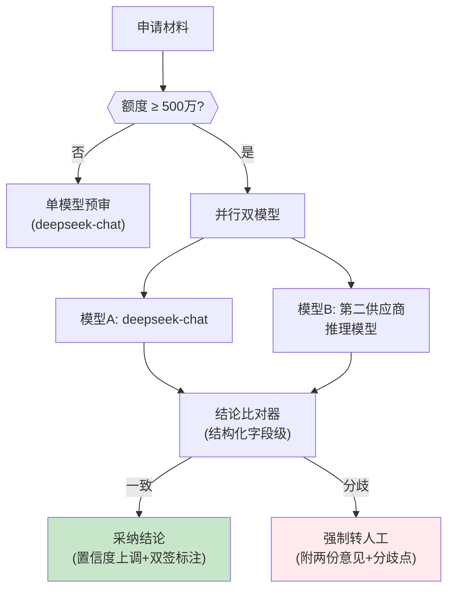

# 项目 06：金融风控 Agent 系统 — 05-多模型交叉验证

> **定位**：高额度段引入第二模型独立复核——昂贵模型对廉价模型结论做结构化比对，分歧即转人工。多模型协作在风控场景的落地。**本文给出完整可手写代码（一行不省略）。**
>
> 「遇到阻塞？→ [教程 44-多模型协作与供应策略 §2 多模型编排架构]、[教程 37 §7 评估的反模式]、[教程 32-模型路由与降级]」

---

## 1. 需求与上一版痛点（四问）

| 问 | 答 |
|----|----|
| **新增了什么需求** | ① 高额度段第二模型独立预审 ② 字段级结构化结论比对 ③ 分歧强制转人工 ④ 交叉验证结果入审计链 |
| **影响了哪些模块** | 新增交叉验证编排（双 ChatClient + 比对器）；审计中心接入新事件类型 CROSS_VALIDATION |
| **架构如何演进** | 单模型预审 → 额度阈值分流 →（高额度）双模型并行 + 结构化比对 |
| **上一版痛点是什么** | 高额度段单模型一致率 81%；自查反思（self-check）对系统性偏差无效 |

| v4 痛点 | 对策 |
|---------|------|
| 高额度段单模型一致率 81% | 第二模型独立预审 + 结构化结论比对 |
| 自查反思（self-check）对系统性偏差无效 | 换模型消除同源偏差（同一模型的自我检查会重复自己的盲点） |

### 1.1 本节核对（四问）

- [ ] 两条 v4 痛点与对策（第二模型比对 / 换模型消除同源偏差）一一对应
- [ ] "self-check 对系统性偏差无效"的原因（同一模型重复自己盲点）能复述

## 2. 交叉验证流程



### 2.1 本节核对（流程图）

- [ ] 低额度走单模型、高额度（≥500 万）走并行双模型，分流条件唯一且清晰
- [ ] 比对结果只有两去向（采纳 / 强制转人工），无自动仲裁分支（与 ADR-116 一致）

## 3. 完整代码（照抄即可）

### 3.1 `CrossValidationResult.java`（比对结果）

```java
package com.bank.risk.domain;

import java.util.List;

/**
 * 结构化结论比对结果（ADR-104：不用文本相似度——字段级差异可判定、可审计）。
 */
public record CrossValidationResult(
        boolean consistent,
        List<FieldDiff> diffs,        // 字段级分歧清单
        CrossVerdict verdict          // ADOPT / HUMAN_REVIEW
) {

    public enum CrossVerdict { ADOPT, HUMAN_REVIEW }

    public enum DiffSeverity { CRITICAL, MAJOR, MINOR }

    public record FieldDiff(
            String field,             // 分歧字段，如 riskLevel / confidence / riskFactor.流水真实性
            String modelAValue,
            String modelBValue,
            DiffSeverity severity
    ) {}
}
```

### 3.2 `CrossValidatedOpinion.java`（交叉验证产出）

```java
package com.bank.risk.domain;

/** 双模型交叉验证结果（含两份意见 + 比对结论）。 */
public record CrossValidatedOpinion(
        PreTrialOpinion modelA,       // 主模型意见
        PreTrialOpinion modelB,       // 复核模型意见
        CrossValidationResult result  // 比对结论
) {}
```

### 3.3 `CrossModelConfig.java`（双 ChatClient）

> **改名提示**：v5 起用 `modelAClient` 取代 v1 的 `pretrialChatClient`——请删除 `RiskAgentConfig` 中旧的 `pretrialChatClient` Bean（或改名为 `modelAClient`），否则 `PreTrialService` 按类型注入 `ChatClient` 会因多 Bean 歧义。`CrossValidationService` 按参数名 `modelAClient`/`modelBClient` 精确注入，不受多 Bean 影响。

```java
package com.bank.risk.config;

import org.springframework.ai.chat.client.ChatClient;
import org.springframework.ai.openai.OpenAiChatOptions;
import org.springframework.context.annotation.Bean;
import org.springframework.context.annotation.Configuration;

/**
 * 双模型 ChatClient。
 * 说明：v1 的 pretrialChatClient 在 v5 由 modelAClient 取代（主模型职责不变）；
 * 同供应商不同模型走同一 base-url；跨供应商需另配 ChatModel Bean（见注释）。
 */
@Configuration
public class CrossModelConfig {

    private static final String PRE_TRIAL_SYSTEM = """
            你是小微企业信贷预审助手。根据信贷员提供的申请材料输出预审意见。
            规则：
            1. 每个风险因子必须引用材料中的具体证据，禁止臆造
            2. 材料不足以判断的维度，归入 missingMaterials 而不是猜测
            3. 你只做预审建议，终审由人工完成
            """;

    /** 主模型：deepseek-chat（低成本，v1 基线同款）。 */
    @Bean
    public ChatClient modelAClient(ChatClient.Builder builder) {
        return builder
                .defaultOptions(OpenAiChatOptions.builder().model("deepseek-chat"))
                .defaultSystem(PRE_TRIAL_SYSTEM)
                .build();
    }

    /**
     * 复核模型：第二供应商推理模型（不同供应商，消除同源训练偏差，ADR-117）。
     * 同 base-url 时用不同 model 名即可；真正的第二供应商需配置第二个 ChatModel Bean。
     */
    @Bean
    public ChatClient modelBClient(ChatClient.Builder builder) {
        return builder
                .defaultOptions(OpenAiChatOptions.builder().model("deepseek-reasoner"))
                .defaultSystem(PRE_TRIAL_SYSTEM)
                .build();
    }
}
```

### 3.4 `CrossValidationService.java`（并行编排 + 比对 + 审计）

```java
package com.bank.risk.service;

import com.bank.risk.domain.AuditEvent;
import com.bank.risk.domain.CrossValidatedOpinion;
import com.bank.risk.domain.CrossValidationResult;
import com.bank.risk.domain.CrossValidationResult.DiffSeverity;
import com.bank.risk.domain.CrossValidationResult.FieldDiff;
import com.bank.risk.domain.PreTrialOpinion;
import com.bank.risk.domain.PreTrialOpinion.RiskFactor;
import com.fasterxml.jackson.databind.ObjectMapper;
import org.springframework.ai.chat.client.ChatClient;
import org.springframework.stereotype.Service;
import reactor.core.publisher.Mono;
import reactor.core.scheduler.Schedulers;

import java.time.Instant;
import java.util.ArrayList;
import java.util.List;
import java.util.Set;
import java.util.UUID;
import java.util.stream.Collectors;

@Service
public class CrossValidationService {

    private final ChatClient modelAClient;
    private final ChatClient modelBClient;
    private final AuditService auditService;
    private final ObjectMapper objectMapper;

    public CrossValidationService(ChatClient modelAClient,
                                  ChatClient modelBClient,
                                  AuditService auditService,
                                  ObjectMapper objectMapper) {
        this.modelAClient = modelAClient;
        this.modelBClient = modelBClient;
        this.auditService = auditService;
        this.objectMapper = objectMapper;
    }

    /**
     * 双模型并行——不用 CompletableFuture 固定线程池（WebFlux 反模式）。
     * 每个阻塞的 ChatClient.call() 用 boundedElastic 桥接；Mono.zip 并行等待。
     */
    public Mono<CrossValidatedOpinion> crossValidate(String appId, String material) {
        Mono<PreTrialOpinion> a = preTrial(modelAClient, appId, material);
        Mono<PreTrialOpinion> b = preTrial(modelBClient, appId, material);

        return Mono.zip(a, b)
                .map(tuple -> {
                    PreTrialOpinion opinionA = tuple.getT1();
                    PreTrialOpinion opinionB = tuple.getT2();
                    CrossValidationResult result = compare(opinionA, opinionB);
                    auditService.record(new AuditEvent(
                            UUID.randomUUID().toString(),
                            AuditEvent.EventType.CROSS_VALIDATION,
                            appId,
                            toJson(result),
                            null,
                            Instant.now()));
                    return new CrossValidatedOpinion(opinionA, opinionB, result);
                });
    }

    private Mono<PreTrialOpinion> preTrial(ChatClient client, String appId, String material) {
        return Mono.fromCallable(() -> client.prompt()
                    .user(u -> u.text("""
                            申请编号：{appId}
                            申请材料：
                            {material}
                            """)
                            .param("appId", appId)
                            .param("material", material))
                    .call()
                    .entity(PreTrialOpinion.class))
                .subscribeOn(Schedulers.boundedElastic());
    }

    /**
     * 字段级结构化比对（ADR-104）：可判定、可审计、可回溯。
     * 不用文本相似度——两段 summaryReason 的余弦相似度 0.73 还是 0.68 无法审计。
     */
    public CrossValidationResult compare(PreTrialOpinion a, PreTrialOpinion b) {
        List<FieldDiff> diffs = new ArrayList<>();
        if (a.riskLevel() != b.riskLevel()) {
            diffs.add(new FieldDiff("riskLevel", a.riskLevel().name(), b.riskLevel().name(),
                    DiffSeverity.CRITICAL));
        }
        if (Math.abs(a.confidence() - b.confidence()) > 0.3) {
            diffs.add(new FieldDiff("confidence", String.valueOf(a.confidence()),
                    String.valueOf(b.confidence()), DiffSeverity.MAJOR));
        }
        diffs.addAll(compareRiskFactorDimensions(a.riskFactors(), b.riskFactors()));

        boolean consistent = diffs.stream().noneMatch(d -> d.severity() == DiffSeverity.CRITICAL);
        return new CrossValidationResult(consistent, diffs,
                consistent ? CrossValidationResult.CrossVerdict.ADOPT
                           : CrossValidationResult.CrossVerdict.HUMAN_REVIEW);
    }

    /** 一方标 high 另一方未提及 → CRITICAL 分歧。 */
    private List<FieldDiff> compareRiskFactorDimensions(List<RiskFactor> a, List<RiskFactor> b) {
        List<FieldDiff> diffs = new ArrayList<>();
        Set<String> aHigh = a.stream()
                .filter(f -> "high".equals(f.severity()))
                .map(RiskFactor::dimension)
                .collect(Collectors.toSet());
        Set<String> bHigh = b.stream()
                .filter(f -> "high".equals(f.severity()))
                .map(RiskFactor::dimension)
                .collect(Collectors.toSet());
        for (String dim : aHigh) {
            if (!bHigh.contains(dim)) {
                diffs.add(new FieldDiff("riskFactor." + dim, "high", "未提及", DiffSeverity.CRITICAL));
            }
        }
        return diffs;
    }

    private String toJson(Object value) {
        try {
            return objectMapper.writeValueAsString(value);
        } catch (Exception e) {
            throw new IllegalStateException("序列化失败", e);
        }
    }
}
```

### 3.5 本节测试与验证（比对器与双模型编排）

**前置条件**：v4 审计链可用；`modelAClient` 已取代旧 `pretrialChatClient`（见 §3.3 改名提示，删除旧 Bean 避免注入歧义）。

**材料——比对器单测样本**（手写，不起 LLM，直接构造 PreTrialOpinion）：

```java
// CrossValidationServiceTest#compare：
// ① a.riskLevel=HIGH, b.riskLevel=MEDIUM → diffs 含 riskLevel/CRITICAL；consistent=false；verdict=HUMAN_REVIEW
// ② 两份完全相同意见（riskLevel 相同、confidence 差 0.1、high 因子集合相同）→ diffs 为空；verdict=ADOPT
// ③ a 有 high 因子"流水真实性"、b 未提及 → diffs 含 riskFactor.流水真实性/CRITICAL
// ④ confidence 差 0.4（riskLevel 相同）→ diffs 含 confidence/MAJOR，但 consistent=true、verdict=ADOPT（MAJOR 不触发分歧）
```

**步骤与断言**：

| # | 操作 | 预期（PASS 判据） |
|---|------|------------------|
| 1 | `mvn clean test` | 材料①–④ 按注释预期通过 |
| 2 | 编译核对 | `OpenAiChatOptions.builder().model(...)` 编译通过；Bean 名恰为 modelAClient/modelBClient |
| 3 | 集成核对（DEEPSEEK_API_KEY 在位） | `crossValidate` 返回 CrossValidatedOpinion，且 audit_chain 出现一条 `CROSS_VALIDATION` 事件（SQL：`SELECT * FROM audit_chain WHERE event_type='CROSS_VALIDATION'`） |
| 4 | 并行核对 | 两个 preTrial 均为 `Mono.fromCallable(...).subscribeOn(boundedElastic)`，`Mono.zip` 等待——代码审查无 CompletableFuture |

**失败排查**：启动报 ChatClient 多 Bean 歧义→旧 `pretrialChatClient` 未删除（§3.3 改名提示）；④consistency 误判 false→CRITICAL 判定条件被扩大到 MAJOR；③CROSS_VALIDATION 不落链→AuditService 注入失败或 record 调用在 map 外。

## 4. 分歧转人工的工作台呈现

分歧点直接渲染到审批工作台（前端契约沿用 [教程 18-Agentic-UI设计 §3.3 审批卡] 的模式）：

| 分歧字段 | 模型 A（主） | 模型 B（复核） | 处理 |
|---------|------------|--------------|------|
| riskLevel | HIGH | MEDIUM | 人工裁定 |
| 流水真实性 | high（季节波动） | 未提及 | 补充材料后复核 |

**成本治理联动**：交叉验证只在高额度段启用——双倍 Token 成本换错误率下降，只在"错误代价 > 验证成本"的分段划算（[教程 44 §6.3 成本估算]）。阈值本身是策略配置（矩阵的延伸），入审计（v4 的 CONFIG_CHANGED 事件）。

### 4.1 本节核对（工作台契约与成本联动）

- [ ] 分歧表两行（riskLevel、流水真实性）的字段名与 §3.4 比对器产出的 FieldDiff.field 对得上
- [ ] "阈值入审计"的说法能落到 v4 的 `CONFIG_CHANGED` 事件类型上

## 5. 验收标准

| # | 验收项 | 标准 |
|---|--------|------|
| 1 | 一致率提升 | 高额度段双模型一致路径的一致率 ≥ 90%（回测 200 单） |
| 2 | 分歧捕获 | 注入 30 单"两模型结论相反"样本，100% 转人工（不静默采纳任一方） |
| 3 | 成本可控 | 交叉验证只覆盖 ≥500 万段；该段成本增幅 ≤ 2.2×（并行调用） |
| 4 | 双签可审计 | 每份双模型意见（含分歧）100% 入审计链 |

> 与章节验证的映射：验收 1=回测规模化执行（材料为 §3.5 集成核对）、验收 2=§3.5 材料①③ 的分歧样本扩展、验收 3=额度分流策略配置核对、验收 4=§3.5 断言 3。本表不重复材料。

## 6. 本迭代的 ADR

| # | 决策 | 理由 |
|---|------|------|
| ADR-115 | 比对用字段级结构化对照 | 可判定、可审计；文本相似度不可复现 |
| ADR-116 | 分歧一律人工，不设"权重自动仲裁" | 风控场景错误代价不对称；仲裁逻辑本身会成为新的不可解释黑盒 |
| ADR-117 | 复核模型选不同供应商 | 同供应商同系模型共享训练偏差，交叉验证失效 |
| ADR-118 | 并行用 Mono.zip + boundedElastic | 与 WebFlux 栈一致；CompletableFuture 固定线程池会线程饥饿 |

### 6.1 本节核对（ADR-115~118）

- [ ] ADR-115 与 §3.4 注释（余弦相似度不可审计）对应；ADR-116 与 §2.1 核对第二点对应
- [ ] ADR-118 与 §3.5 断言 4 对应（Mono.zip + boundedElastic）

## 7. v5 的痛点

监管验收进入实质阶段，数据合规组提出硬性要求：**进 Prompt 的材料必须脱敏**（当前是明文整段进入）；审计库的材料快照同样需要脱敏与加密分级。→ [06-数据脱敏与合规.md](06-数据脱敏与合规.md)

## 8. 总结

| 概念 | 一句话 |
|------|--------|
| 双模型 | 高额度段第二模型独立预审，消除同源偏差 |
| 比对 | 字段级结构化对照（riskLevel 差异/置信度差异/high 因子集合差异），不用文本相似度 |
| 并行 | Mono.zip + boundedElastic，WebFlux 正确姿势 |
| 分歧 | 一律人工，无权重自动仲裁（ADR-116） |
| 审计 | CROSS_VALIDATION 事件入链，双签可追溯 |

> §7 一句话核对：痛点（明文进 Prompt）指向 06 脱敏即 PASS；§8 总结五行与 §2/§3.4/§3.4/ADR-116/§3.5 断言 3 一一对应即 PASS。

## 9. 全篇回归验证

**前置条件**：§3.5 全部断言通过。

| # | 操作 | 预期（PASS 判据） |
|---|------|------------------|
| 1 | `mvn clean test` | 全部单测通过，`BUILD SUCCESS` |
| 2 | 同一材料分别走单模型路径与 crossValidate | 低额度单模型路径未触发 CROSS_VALIDATION 事件；高额度路径触发——分流互不污染（跨 v1/v5 回归） |
| 3 | `GET /api/audit/verify` | 交叉验证事件追加后链仍 intact（v4 链未被新事件类型破坏） |

**失败排查**：②单模型路径也落 CROSS_VALIDATION→分流条件写反或编排点挂错；③链断→CROSS_VALIDATION 的 payloadJson 序列化不稳定（result 含嵌套枚举，核对 ObjectMapper 配置）。
