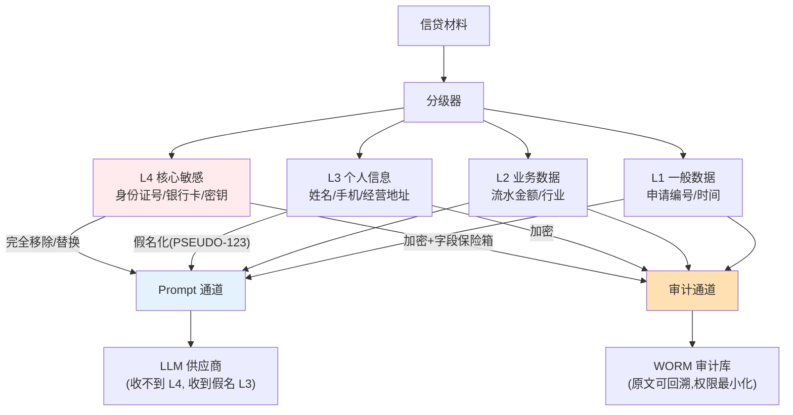

# 项目 06：金融风控 Agent 系统 — 06-数据脱敏与合规落地

> **定位**：PII 在进入 Prompt 与审计链之前完成脱敏；数据分级、加密、留存策略与个保法/GDPR 口径对齐——监管验收的收官篇。**本文给出完整可手写代码（一行不省略）。**
>
> 「遇到阻塞？→ [附录 09-Agent安全深度/02-数据泄露防护]、[附录 13-AI治理与合规/02-数据隐私与偏见检测]、[教程 25 §6.4 用户数据导出权]、[教程 43 §4.6 数据主体权利工程落地]」

---

## 1. 需求与上一版痛点（四问）

| 问 | 答 |
|----|----|
| **新增了什么需求** | ① 数据分级（L1-L4）与双通道脱敏 ② 假名映射保险箱 ③ 字段级加密（KMS 密钥） ④ 删除权实现 |
| **影响了哪些模块** | 预审入口前置脱敏管道；审计通道改为加密原文；新增假名映射库 |
| **架构如何演进** | 材料进入系统先分级 → Prompt 通道假名化 / 审计通道加密原文——两条通道策略不同 |
| **上一版痛点是什么** | 材料明文进 Prompt；LLM 供应商收到 PII；数据分级无制度落地 |

| v5 痛点 | 对策 |
|---------|------|
| 材料明文进 Prompt | 双通道脱敏：Prompt 通道假名化，审计通道加密原文分级留存 |
| LLM 供应商收到 PII | 脱敏后出域 + 供应商数据处理协议（DPA）备案 |
| 数据分级无制度落地 | 四级分级模型 + 每级技术措施 |

## 2. 数据分级与通道设计



**双通道原则**：Prompt 通道服务于推理（要脱敏），审计通道服务于回放（要保真）——两条通道的脱敏策略**不同**是本设计的核心。假名化保留推理能力（"借款人 PSEUDO-1 的流水"仍可分析），加密原文保住回放能力。

## 3. 完整代码（照抄即可）

### 3.1 `DataLevel.java`（数据分级）

```java
package com.bank.risk.domain;

/** 数据分级（L1 一般 → L4 核心敏感）。 */
public enum DataLevel {
    L1_GENERAL,      // 申请编号/时间
    L2_BUSINESS,     // 流水金额/行业
    L3_PERSONAL,     // 姓名/手机/经营地址
    L4_CRITICAL      // 身份证号/银行卡/密钥
}
```

### 3.2 `SensitiveHit.java`（命中位点）

```java
package com.bank.risk.domain;

/** 一次敏感数据命中：原文区间 + 等级 + 类型。 */
public record SensitiveHit(
        int start,          // 原文起始下标（含）
        int end,            // 原文结束下标（不含）
        DataLevel level,
        String type,        // ID_CARD / BANK_CARD / PHONE / NAME 等类型
        String text         // 命中的原文片段
) {}
```

### 3.3 `SensitiveDetector.java`（检测器接口）

```java
package com.bank.risk.domain;

import java.util.List;

/** 敏感数据检测器（正则/词典/NER 辅助）。检测是尽力而为，recall 优先（ADR-121）。 */
public interface SensitiveDetector {

    List<SensitiveHit> find(String text);
}
```

### 3.4 `RegexSensitiveDetector.java`（正则实现）

```java
package com.bank.risk.service;

import com.bank.risk.domain.DataLevel;
import com.bank.risk.domain.SensitiveDetector;
import com.bank.risk.domain.SensitiveHit;
import org.springframework.stereotype.Component;

import java.util.ArrayList;
import java.util.List;
import java.util.regex.Matcher;
import java.util.regex.Pattern;

@Component
public class RegexSensitiveDetector implements SensitiveDetector {

    private static final List<PatternRule> RULES = List.of(
            new PatternRule(Pattern.compile("\\d{17}[\\dXx]"), DataLevel.L4_CRITICAL, "ID_CARD"),
            new PatternRule(Pattern.compile("\\d{16,19}"), DataLevel.L4_CRITICAL, "BANK_CARD"),
            new PatternRule(Pattern.compile("1[3-9]\\d{9}"), DataLevel.L3_PERSONAL, "PHONE")
    );

    @Override
    public List<SensitiveHit> find(String text) {
        List<SensitiveHit> hits = new ArrayList<>();
        for (PatternRule rule : RULES) {
            Matcher m = rule.pattern().matcher(text);
            while (m.find()) {
                hits.add(new SensitiveHit(m.start(), m.end(), rule.level(), rule.type(), m.group()));
            }
        }
        return hits;
    }

    private record PatternRule(Pattern pattern, DataLevel level, String type) {}
}
```

> 「遇到阻塞？→ [附录 09-Agent安全深度/02-数据泄露防护 §1]——检测是**尽力而为**（recall 优先），漏检兜底靠"假定出域即留痕"的供应商侧协议与审计，不存在 100% 检测」

### 3.5 `ClassifiedMaterial.java`（分级后材料）

```java
package com.bank.risk.service;

import com.bank.risk.domain.SensitiveHit;

import java.util.Comparator;
import java.util.List;
import java.util.function.Function;

/** 分级后的材料：保留原文 + 命中清单；提供通道视图生成。 */
public final class ClassifiedMaterial {

    private final String rawText;
    private final List<SensitiveHit> hits;

    public ClassifiedMaterial(String rawText, List<SensitiveHit> hits) {
        this.rawText = rawText;
        this.hits = hits;
    }

    public String rawText() {
        return rawText;
    }

    public List<SensitiveHit> hits() {
        return hits;
    }

    /** 按命中位点从后往前替换（避免替换导致 span 位移）。 */
    public String applyHits(Function<SensitiveHit, String> replacement) {
        String result = rawText;
        List<SensitiveHit> sorted = hits.stream()
                .sorted(Comparator.comparingInt(SensitiveHit::start).reversed())
                .toList();
        for (SensitiveHit hit : sorted) {
            String rep = replacement.apply(hit);
            result = result.substring(0, hit.start()) + rep + result.substring(hit.end());
        }
        return result;
    }

    /** 审计通道：全文加密（回放保真，权限最小化）。 */
    public String toAuditEncrypted(Function<String, String> encrypter) {
        return encrypter.apply(rawText);
    }
}
```

### 3.6 `FieldVault.java`（字段级 AES-GCM 加密）

```java
package com.bank.risk.service;

import org.springframework.beans.factory.annotation.Value;
import org.springframework.stereotype.Component;

import javax.crypto.Cipher;
import javax.crypto.spec.GCMParameterSpec;
import javax.crypto.spec.SecretKeySpec;
import java.nio.charset.StandardCharsets;
import java.security.SecureRandom;
import java.util.Arrays;
import java.util.Base64;

/** 字段级加密：AES-GCM（128 位 tag），IV 随机前置。密钥来自 KMS/环境变量，不落代码。 */
@Component
public class FieldVault {

    private static final int IV_LENGTH = 12;
    private static final int TAG_BITS = 128;

    private final SecretKeySpec key;

    public FieldVault(@Value("${risk.encryption-key}") String base64Key) {
        byte[] keyBytes = Base64.getDecoder().decode(base64Key);
        if (keyBytes.length != 16 && keyBytes.length != 24 && keyBytes.length != 32) {
            throw new IllegalArgumentException("AES 密钥长度必须为 16/24/32 字节");
        }
        this.key = new SecretKeySpec(keyBytes, "AES");
    }

    public String encrypt(String plain) {
        try {
            Cipher cipher = Cipher.getInstance("AES/GCM/NoPadding");
            byte[] iv = new byte[IV_LENGTH];
            new SecureRandom().nextBytes(iv);
            cipher.init(Cipher.ENCRYPT_MODE, key, new GCMParameterSpec(TAG_BITS, iv));
            byte[] encrypted = cipher.doFinal(plain.getBytes(StandardCharsets.UTF_8));
            byte[] combined = new byte[iv.length + encrypted.length];
            System.arraycopy(iv, 0, combined, 0, iv.length);
            System.arraycopy(encrypted, 0, combined, iv.length, encrypted.length);
            return Base64.getEncoder().encodeToString(combined);
        } catch (Exception e) {
            throw new IllegalStateException("加密失败", e);
        }
    }

    public String decrypt(String cipherText) {
        try {
            byte[] combined = Base64.getDecoder().decode(cipherText);
            byte[] iv = Arrays.copyOfRange(combined, 0, IV_LENGTH);
            byte[] encrypted = Arrays.copyOfRange(combined, IV_LENGTH, combined.length);
            Cipher cipher = Cipher.getInstance("AES/GCM/NoPadding");
            cipher.init(Cipher.DECRYPT_MODE, key, new GCMParameterSpec(TAG_BITS, iv));
            return new String(cipher.doFinal(encrypted), StandardCharsets.UTF_8);
        } catch (Exception e) {
            throw new IllegalStateException("解密失败", e);
        }
    }
}
```

`application.yml` 增加密钥占位：

```yaml
risk:
  encryption-key: ${RISK_ENCRYPTION_KEY}   # 行内 KMS 托管，运行时注入，禁止硬编码
```

### 3.7 `PseudonymVault.java`（假名映射保险箱）

```java
package com.bank.risk.service;

import com.bank.risk.domain.AuditEvent;
import org.springframework.jdbc.core.JdbcTemplate;
import org.springframework.stereotype.Component;

import java.nio.charset.StandardCharsets;
import java.security.MessageDigest;
import java.security.NoSuchAlgorithmException;
import java.time.Instant;
import java.util.HexFormat;
import java.util.List;
import java.util.UUID;
import java.util.concurrent.atomic.AtomicLong;

/**
 * 假名映射保险箱：PSEUDO-N → 真实值（加密存储）。
 * 同一真实值 → 同一假名（保证"PSEUDO-1 的流水"在全文推理中指代一致）。
 * 还原动作本身入审计链（ADR-113 的延续）。
 */
@Component
public class PseudonymVault {

    private final JdbcTemplate jdbc;
    private final FieldVault fieldVault;
    private final AuditService auditService;
    private final AtomicLong idGen = new AtomicLong(1);

    public PseudonymVault(JdbcTemplate jdbc, FieldVault fieldVault, AuditService auditService) {
        this.jdbc = jdbc;
        this.fieldVault = fieldVault;
        this.auditService = auditService;
    }

    public String pseudonymize(String applicationId, String realValue) {
        String valueHash = sha256(realValue);
        // 按申请维度去重：同一真实值在同一申请内 → 同一假名（指代一致）；跨申请隔离（防交叉关联）
        List<String> existing = jdbc.queryForList(
                "SELECT pseudo FROM pseudonym_map WHERE value_hash = ? AND application_id = ? LIMIT 1",
                String.class, valueHash, applicationId);
        if (!existing.isEmpty()) {
            return existing.get(0);
        }
        String pseudo = "PSEUDO-" + idGen.incrementAndGet();
        jdbc.update("INSERT INTO pseudonym_map (pseudo, application_id, value_hash, encrypted_value) VALUES (?,?,?,?)",
                pseudo, applicationId, valueHash, fieldVault.encrypt(realValue));
        return pseudo;
    }

    /** 回放时：有解密权限的审计角色才能还原；每次还原留痕。 */
    public String reveal(String pseudo, String operator) {
        String encrypted = jdbc.queryForObject(
                "SELECT encrypted_value FROM pseudonym_map WHERE pseudo = ?",
                String.class, pseudo);
        String plain = fieldVault.decrypt(encrypted);
        auditService.record(new AuditEvent(
                UUID.randomUUID().toString(),
                AuditEvent.EventType.AUDIT_QUERY,
                null,
                "{\"action\":\"REVEAL\",\"pseudo\":\"" + pseudo + "\",\"operator\":\"" + operator + "\"}",
                null,
                Instant.now()));
        return plain;
    }

    /** 删除权实现：销毁假名映射（PSEUDO-N 永久无法还原），审计链保留脱敏记录（ADR-120）。 */
    public void destroy(String applicationId) {
        jdbc.update("DELETE FROM pseudonym_map WHERE pseudo IN (SELECT pseudo FROM pseudonym_map WHERE application_id = ?)",
                applicationId);
    }

    private String sha256(String input) {
        try {
            MessageDigest digest = MessageDigest.getInstance("SHA-256");
            return HexFormat.of().formatHex(digest.digest(input.getBytes(StandardCharsets.UTF_8)));
        } catch (NoSuchAlgorithmException e) {
            throw new IllegalStateException("SHA-256 不可用", e);
        }
    }
}
```

### 3.8 `DataClassificationPipeline.java`（分级 + 双通道）

```java
package com.bank.risk.service;

import com.bank.risk.domain.DataLevel;
import com.bank.risk.domain.SensitiveDetector;
import com.bank.risk.domain.SensitiveHit;
import org.springframework.stereotype.Component;

import java.util.ArrayList;
import java.util.List;

/**
 * 分级与脱敏管道。
 * 双通道原则（ADR-119）：Prompt 通道假名化（保留推理能力），审计通道加密原文（保住回放能力）。
 */
@Component
public class DataClassificationPipeline {

    private final List<SensitiveDetector> detectors;
    private final PseudonymVault pseudonymVault;
    private final FieldVault fieldVault;

    public DataClassificationPipeline(List<SensitiveDetector> detectors,
                                      PseudonymVault pseudonymVault,
                                      FieldVault fieldVault) {
        this.detectors = detectors;
        this.pseudonymVault = pseudonymVault;
        this.fieldVault = fieldVault;
    }

    public ClassifiedMaterial process(String rawMaterial) {
        List<SensitiveHit> hits = new ArrayList<>();
        for (SensitiveDetector detector : detectors) {
            hits.addAll(detector.find(rawMaterial));
        }
        return new ClassifiedMaterial(rawMaterial, hits);
    }

    /** Prompt 通道视图：L4 移除，L3 假名化，L2/L1 保留。applicationId 用于假名按申请维度去重。 */
    public String toPromptView(String applicationId, ClassifiedMaterial m) {
        return m.applyHits(hit -> switch (hit.level()) {
            case L4_CRITICAL -> "[REDACTED]";
            case L3_PERSONAL -> pseudonymVault.pseudonymize(applicationId, hit.text());
            default -> hit.text();
        });
    }

    /** 审计通道视图：原文加密（回放保真）。 */
    public String toAuditView(ClassifiedMaterial m) {
        return m.toAuditEncrypted(fieldVault::encrypt);
    }
}
```

### 3.9 SQL DDL（假名映射表）

```sql
-- 假名映射保险箱：pseudo → 真实值（加密存储）；value_hash 用于同一真实值 → 同一假名
CREATE TABLE IF NOT EXISTS pseudonym_map (
    pseudo           VARCHAR(32) PRIMARY KEY,
    application_id   VARCHAR(64),
    value_hash       VARCHAR(64) NOT NULL,     -- SHA-256(真实值)，用于去重
    encrypted_value  CLOB       NOT NULL       -- FieldVault AES-GCM 加密后的真实值
);
CREATE INDEX IF NOT EXISTS idx_pseudo_hash ON pseudonym_map(value_hash);
CREATE INDEX IF NOT EXISTS idx_pseudo_app ON pseudonym_map(application_id);
```

## 4. 合规清单落地（监管验收映射）

| 监管要求 | 本项目实现 | 验收证据 |
|---------|-----------|---------|
| 个人信息处理告知同意 | 信贷申请环节的 AI 处理告知书（业务流程） | 告知书模板+签署记录 |
| 最小必要 | Prompt 通道只保留分析必需字段（L4 移除） | 脱敏前后样本对照 |
| 出域管控 | 供应商 DPA + 出域数据脱敏 | DPA 备件+抽检出域请求 |
| 可解释 | 意见附风险因子证据链（v1 起） | 回放时间线（v4） |
| 偏见监测 | 季度公平性抽样：拒贷率按行业/地区分布无异常聚集（[附录 13-AI治理与合规/02-数据隐私与偏见检测 §2 偏见检测]） | 季度报告 |
| 留存与删除 | 审计 7 年 WORM；假名映射随信贷档案生命周期管理 | 留存策略文档 |

**删除与 WORM 的张力**：个保法的删除权 vs 金融审计的不可删——处理方式是**删除"可识别性"而非删除记录**：销毁假名映射（PSEUDO-1 永久无法还原），审计链上的哈希与脱敏记录保留。这在监管实践中是接受的标准答案（[附录 13-AI治理与合规/02-数据隐私与偏见检测 §1.3 落地框架]）。

## 5. 验收标准

| # | 验收项 | 标准 |
|---|--------|------|
| 1 | 出域零 L4 | 抽检全部出域请求，L4 数据检出率 0 |
| 2 | 假名有效 | L3 假名化后无法从 Prompt 文本反推真实身份（抽检 200 条） |
| 3 | 回放能力 | 脱敏后回放仍完整可读（假名一致 + 授权可还原） |
| 4 | 还原可控 | 假名还原仅审计授权角色可用，且每次还原留痕 |
| 5 | 删除权 | 行使删除权后假名映射不可恢复，审计链完整不断 |
| 6 | 偏见监测 | 首次季度公平性报告产出，无明显异常聚集项 |

## 6. 本迭代的 ADR

| # | 决策 | 理由 |
|---|------|------|
| ADR-119 | 双通道脱敏（Prompt 假名化/审计加密原文） | 推理能力与回放能力都要保，单通道顾此失彼 |
| ADR-120 | 删除权=销毁映射而非删审计记录 | 满足"不可识别"的删除实质，同时保住审计完整性 |
| ADR-121 | 检测 recall 优先（宁可误杀） | 漏检的合规代价远大于误替换造成的分析损失 |

## 7. v6 的痛点

功能与合规齐备，上线前最后两件事：**成本失控预警**（交叉验证后高额度段 Token 成本 3.1×，预算超支）与**生产部署**（等保三级环境、DR 演练、监管报表）。→ [07-成本治理与生产部署.md](07-成本治理与生产部署.md)

## 8. 总结

| 概念 | 一句话 |
|------|--------|
| 分级 | L1-L4 四级模型，每级技术措施不同 |
| 双通道 | Prompt 假名化（推理）、审计加密原文（回放）——按消费方分通道 |
| 保险箱 | PSEUDO-N → 加密真实值；同一真实值 → 同一假名 |
| 删除权 | 销毁映射而非删审计记录，审计链完整不断 |
| 还原审计 | 每次假名还原动作入链，权限最小化 |
