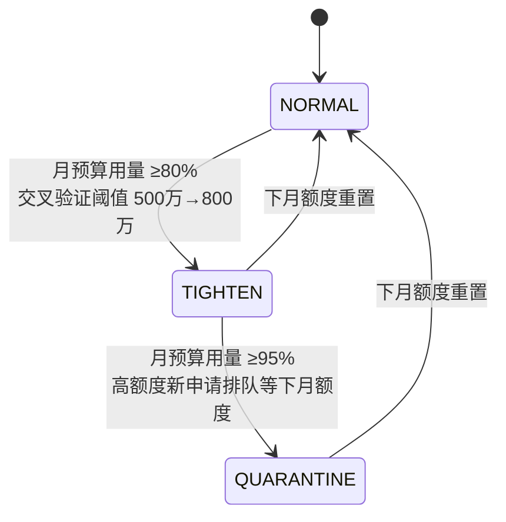
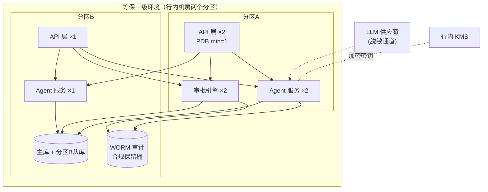
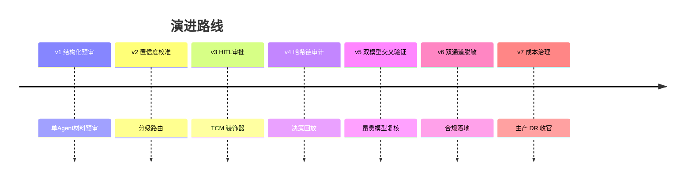

# 项目 06：金融风控 Agent 系统 — 07-迭代六：成本治理与生产部署（收官）

> **定位**：收官迭代——Token 成本治理（预算/审计联动）+ 等保三级环境生产部署 + DR 演练 + 监管报表自动化。**本文给出完整可手写代码（一行不省略）。**
>
> 「遇到阻塞？→ [教程 21-成本治理与Token计量]、[教程 28-部署与运维 全篇]、[教程 24-容错与弹性设计]」

---

## 1. 需求与上一版痛点（四问）

| 问 | 答 |
|----|----|
| **新增了什么需求** | ① 分段成本预算 + 触发降级链 ② 等保三级部署、探针、PDB、密钥管理 ③ 监管月报自动化（从审计链直接生成） |
| **影响了哪些模块** | 新增 Token 计量（MeterRegistry）、预算守卫、月报服务；预审/交叉验证接入计量与阈值 |
| **架构如何演进** | 单机演示 → 等保三级双分区高可用部署；成本从"事后核算"到"预算联动收敛触发面" |
| **上一版痛点是什么** | 交叉验证后高额度段成本 3.1×；未生产化；监管报表靠人工 |

| v6 痛点 | 对策 |
|---------|------|
| 交叉验证后高额度段成本 3.1× | 分段成本预算 + 触发降级链（复用 v2 分级思想） |
| 未生产化 | 等保三级部署、探针、PDB、密钥管理落地 |
| 监管报表靠人工 | 月报自动化（从审计链直接生成） |

## 2. 成本治理

### 2.1 成本模型

| 环节 | Token 构成 | 优化后 |
|------|-----------|--------|
| 单模型预审 | 材料 2.1k + 意见 0.4k | 基线 |
| self-check | +0.8k | 仅 MEDIUM 以上触发 |
| 交叉验证 | ×2 模型 | 仅 ≥500 万段 |
| 争议重生成 | +1.3k | 限 1 次（v2 已有） |

**关键优化**：self-check 从"全部触发"改为"仅 MEDIUM/HIGH 触发"——LOW 档（快速通道候选）的自查历史一致率本就 96%，省下的成本覆盖交叉验证增幅的 40%。

### 2.2 预算联动

预算超限不降级模型质量（风控场景质量>成本），而是**收敛触发面**：月预算 80% 时交叉验证阈值从 500 万提到 800 万；95% 时 self-check 仅 HIGH 触发；超限后高额度新申请排队等下月额度（**排队而非降质**——与中台项目的"降级模型"策略相反，因为错误代价不对称）。



## 3. 完整代码（照抄即可）

### 3.1 `BudgetGuardService.java`（预算守卫 + Token 计量）

```java
package com.bank.risk.service;

import io.micrometer.core.instrument.Counter;
import io.micrometer.core.instrument.MeterRegistry;
import org.springframework.beans.factory.annotation.Value;
import org.springframework.stereotype.Service;

import java.util.Optional;

/**
 * 预算联动：不降级模型质量（风控错误代价不对称），而是收敛触发面。
 * NORMAL → TIGHTEN（80%，交叉验证阈值上调）→ QUARANTINE（95%，高额度排队）。
 */
@Service
public class BudgetGuardService {

    @Value("${risk.budget.monthly-cap:1000000}")
    private double monthlyCap;   // 月度预算上限（Token 计量单位，映射成本）

    private final MeterRegistry meterRegistry;

    public BudgetGuardService(MeterRegistry meterRegistry) {
        this.meterRegistry = meterRegistry;
    }

    /** 每次模型调用后计量 Token（gen_ai.* 语义）。 */
    public void recordTokenUsage(String model, double inputTokens, double outputTokens) {
        meterRegistry.counter("gen_ai.client.token.input", "model", model).increment(inputTokens);
        meterRegistry.counter("gen_ai.client.token.output", "model", model).increment(outputTokens);
    }

    /** 当前月度用量（从指标累计）。 */
    public double monthlySpend() {
        double input = Optional.ofNullable(meterRegistry.find("gen_ai.client.token.input").counter())
                .map(Counter::count).orElse(0.0);
        double output = Optional.ofNullable(meterRegistry.find("gen_ai.client.token.output").counter())
                .map(Counter::count).orElse(0.0);
        return input + output;
    }

    /** 当前预算档位。 */
    public BudgetTier currentTier() {
        double usageRatio = monthlySpend() / monthlyCap;
        if (usageRatio >= 0.95) {
            return BudgetTier.QUARANTINE;
        }
        if (usageRatio >= 0.80) {
            return BudgetTier.TIGHTEN;
        }
        return BudgetTier.NORMAL;
    }

    /** 交叉验证是否启用（当前阈值按档位收敛）。 */
    public boolean isCrossValidationEnabled(double loanAmountWan) {
        return switch (currentTier()) {
            case NORMAL -> loanAmountWan >= 500;
            case TIGHTEN -> loanAmountWan >= 800;
            case QUARANTINE -> false;   // 高额度新申请排队等下月额度
        };
    }

    public enum BudgetTier { NORMAL, TIGHTEN, QUARANTINE }
}
```

### 3.2 `RegulatoryReport.java`（监管月报）

```java
package com.bank.risk.domain;

import java.time.YearMonth;
import java.util.Map;

/** 监管月报（从审计链重算，不另存数据源——单一真相）。 */
public record RegulatoryReport(
        YearMonth month,
        long totalApplications,                    // 总申请数
        Map<String, Long> aiOpinionDistribution,   // 预审意见等级分布
        Map<String, Long> humanApprovalStats,      // 人工审批决定分布
        double crossValidationCoverage,            // 交叉验证覆盖率
        double overrideRate,                       // 人工推翻 AI 的比率（监管最关注）
        boolean chainIntegrity                     // 报告自带链完整性证明
) {}
```

### 3.3 `MonthlyReportService.java`（月报从审计链直接生成）

```java
package com.bank.risk.service;

import com.bank.risk.domain.AuditEvent;
import com.bank.risk.domain.AuditRecord;
import com.bank.risk.domain.RegulatoryReport;
import com.fasterxml.jackson.databind.JsonNode;
import com.fasterxml.jackson.databind.ObjectMapper;
import org.springframework.stereotype.Service;
import reactor.core.publisher.Mono;
import reactor.core.scheduler.Schedulers;

import java.time.YearMonth;
import java.util.List;
import java.util.Map;
import java.util.stream.Collectors;

/**
 * 月报从审计链直接生成——报表不另存数据源（单一真相），从链上重算。
 * 前提：审批路径把 APPROVAL_DECIDED 事件写入审计链，payload 含 decision + outcome(OVERRIDE/CONFIRM)。
 */
@Service
public class MonthlyReportService {

    private final WormStore wormStore;
    private final AuditService auditService;
    private final ObjectMapper objectMapper;

    public MonthlyReportService(WormStore wormStore, AuditService auditService, ObjectMapper objectMapper) {
        this.wormStore = wormStore;
        this.auditService = auditService;
        this.objectMapper = objectMapper;
    }

    public Mono<RegulatoryReport> monthlyReport(YearMonth month) {
        return Mono.fromCallable(() -> {
            List<AuditRecord> records = wormStore.readAll().stream()
                    .filter(r -> YearMonth.from(r.timestamp()).equals(month))
                    .toList();
            return build(month, records);
        }).subscribeOn(Schedulers.boundedElastic());
    }

    private RegulatoryReport build(YearMonth month, List<AuditRecord> records) {
        return new RegulatoryReport(
                month,
                countBy(records, AuditEvent.EventType.PRETRIAL_REQUEST),
                distBy(records, AuditEvent.EventType.OPINION_PRODUCED, "riskLevel"),
                distBy(records, AuditEvent.EventType.APPROVAL_DECIDED, "decision"),
                crossRate(records),
                overrideRate(records),
                auditService.verify().intact());   // 报告自带链完整性证明
    }

    private long countBy(List<AuditRecord> records, AuditEvent.EventType type) {
        return records.stream().filter(r -> r.event().type() == type).count();
    }

    private Map<String, Long> distBy(List<AuditRecord> records, AuditEvent.EventType type, String field) {
        return records.stream()
                .filter(r -> r.event().type() == type)
                .map(r -> payload(r.event()).path(field).asText("UNKNOWN"))
                .collect(Collectors.groupingBy(s -> s, Collectors.counting()));
    }

    private double crossRate(List<AuditRecord> records) {
        long cross = countBy(records, AuditEvent.EventType.CROSS_VALIDATION);
        long pretrial = countBy(records, AuditEvent.EventType.PRETRIAL_REQUEST);
        return pretrial == 0 ? 0.0 : (double) cross / pretrial;
    }

    /** 人工推翻 AI 的比率——异常低意味着"橡皮图章"（HITL 形同虚设），异常高意味着 AI 不可信。 */
    private double overrideRate(List<AuditRecord> records) {
        long decided = countBy(records, AuditEvent.EventType.APPROVAL_DECIDED);
        long overridden = records.stream()
                .filter(r -> r.event().type() == AuditEvent.EventType.APPROVAL_DECIDED)
                .filter(r -> "OVERRIDE".equals(payload(r.event()).path("outcome").asText()))
                .count();
        return decided == 0 ? 0.0 : (double) overridden / decided;
    }

    private JsonNode payload(AuditEvent event) {
        try {
            return objectMapper.readTree(event.payloadJson());
        } catch (Exception e) {
            return objectMapper.createObjectNode();
        }
    }
}
```

### 3.4 `MonthlyReportController.java`（报表 API）

```java
package com.bank.risk.web;

import com.bank.risk.domain.RegulatoryReport;
import com.bank.risk.service.MonthlyReportService;
import org.springframework.web.bind.annotation.GetMapping;
import org.springframework.web.bind.annotation.RequestMapping;
import org.springframework.web.bind.annotation.RequestParam;
import org.springframework.web.bind.annotation.RestController;
import reactor.core.publisher.Mono;

import java.time.YearMonth;

@RestController
@RequestMapping("/api/reports")
public class MonthlyReportController {

    private final MonthlyReportService monthlyReportService;

    public MonthlyReportController(MonthlyReportService monthlyReportService) {
        this.monthlyReportService = monthlyReportService;
    }

    @GetMapping("/monthly")
    public Mono<RegulatoryReport> monthly(@RequestParam YearMonth month) {
        return monthlyReportService.monthlyReport(month);
    }
}
```

## 4. 生产部署

### 4.1 部署拓扑



要点（吸取项目体系审计教训）：
- **无 sessionAffinity**——服务无状态，会话在 DB；粘性设计与无状态架构矛盾（[教程 28 §一致性检讨]）
- LLM 出域走统一网关代理（审计出域流量），供应商 Key 只在 KMS 托管、运行时按需解密
- 探针：就绪探针检查"审批引擎连通 + KMS 可达"（不是只 ping 端口）

### 4.2 `application.yml` 生产片段

```yaml
spring:
  application:
    name: risk-agent
  ai:
    openai:
      base-url: https://api.deepseek.com
      api-key: ${DEEPSEEK_API_KEY}              # KMS 托管，运行时按需解密注入
      chat:
        options:
          model: deepseek-chat
  datasource:
    url: jdbc:postgresql://${DB_HOST}:5432/riskdb
    username: ${DB_USER}
    password: ${DB_PASSWORD}
server:
  port: 8080
management:
  endpoints:
    web:
      exposure:
        include: health,metrics,prometheus    # 探针与可观测
risk:
  prompt-version: v7.1                          # 审计必需：当前生效版本
  encryption-key: ${RISK_ENCRYPTION_KEY}
  budget:
    monthly-cap: 1000000
```

> 就绪探针不是只 ping 端口：用 Spring Boot Actuator 自定义健康指示器检查"审批引擎连通 + KMS 可达"（[教程 28 §探针设计]）。

### 4.3 DR 演练剧本（季度）

| 剧本 | 注入 | 预期 |
|------|------|------|
| 分区 A 整体断电 | 关停 AZ1 全部实例 | AZ2 接管，RTO < 5 分钟，挂起中的审批不丢失（Checkpoint 在 DB） |
| 主库故障 | 强制切换 | 从库提升，写中断 < 60s，审计链校验通过 |
| LLM 供应商断供 | 断开出域 | 预审暂停（不降质），排队机制启动，审批工作台不受影响 |
| KMS 不可达 | 断开 KMS | 已解密密钥的缓存续命 30 分钟，超时进入安全停机（宁可停不可裸奔） |

## 5. 验收标准（项目收官）

| # | 验收项 | 标准 |
|---|--------|------|
| 1 | 成本可控 | 优化后月成本回到基线 1.4× 以内；预算联动三级阈值生效 |
| 2 | DR 演练 | 四剧本全过；审计链在所有剧本后校验完整 |
| 3 | 等保合规 | 三级测评通过（部署配置为测评物） |
| 4 | 报表自动化 | 月报一键生成且与链上数据零差异 |
| 5 | override 监测 | 人工推翻率纳入月报，异常阈值告警 |

## 6. 项目 06 总结



七个迭代走完强监管场景的完整弧线：**可用 → 可信（分级）→ 可控（闸门）→ 可证（审计）→ 可靠（交叉）→ 合规（脱敏）→ 可运营（成本/部署）**。24 条 ADR 沉淀了风控场景的关键取舍，其中 ADR-102（TCM 拦截点）与 ADR-120（删除权的调和）是本项目最有复用价值的两个决策。

## 7. 本迭代的 ADR

| # | 决策 | 理由 |
|---|------|------|
| ADR-122 | 超预算收敛触发面 + 排队，不降级模型质量 | 错误代价不对称；降质在风控场景不可接受 |
| ADR-123 | 报表从审计链重算，不另存数据源 | 单一真相；链上数据天然带完整性证明 |
| ADR-124 | 探针检查业务依赖而非只 ping 端口 | 端口健康不代表审批引擎/KMS 可达 |

→ [08-核心代码讲解.md](08-核心代码讲解.md)

## 8. 总结

| 概念 | 一句话 |
|------|--------|
| 预算联动 | 80% 收紧阈值、95% 排队——不降质，收敛触发面 |
| 计量 | `gen_ai.client.token.*` 计数器 + MeterRegistry |
| 报表 | 从审计链重算，override rate 双向告警（橡皮图章 / AI 不可信） |
| 部署 | 双分区无状态 + PDB + 探针检查业务依赖 + KMS 托管密钥 |
| DR | Checkpoint 在 DB，断电不丢挂起审批；审计链每剧本后校验 |
