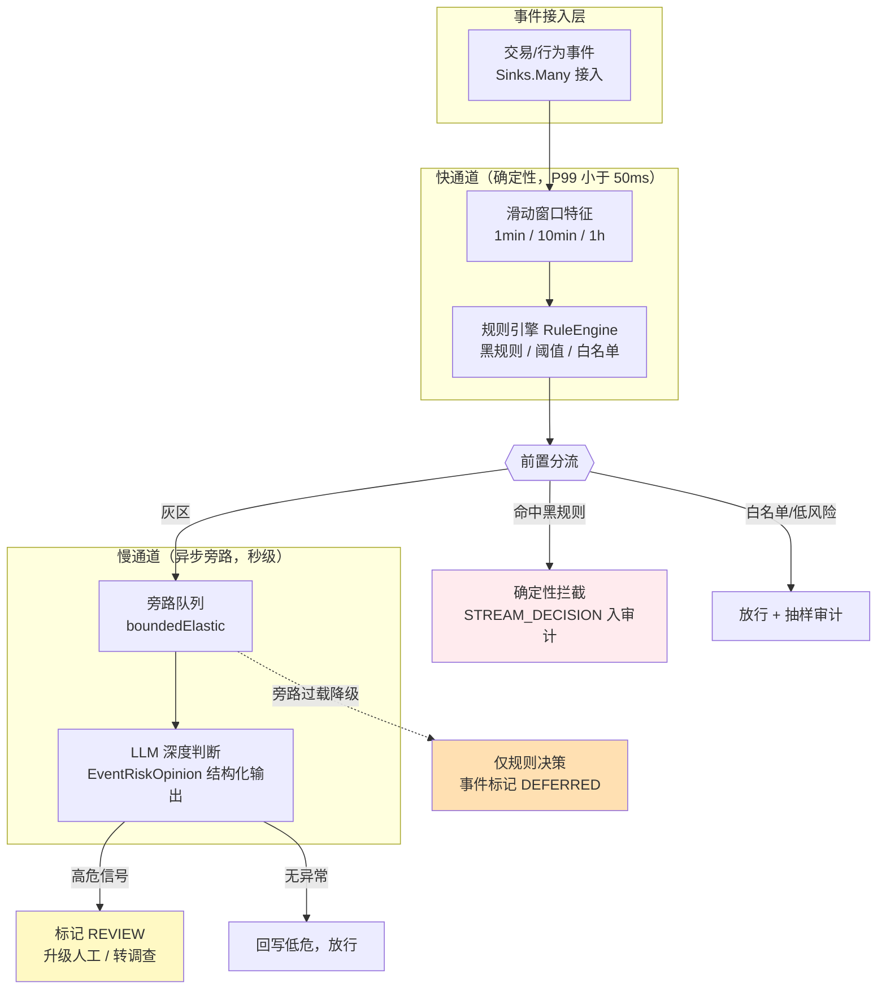
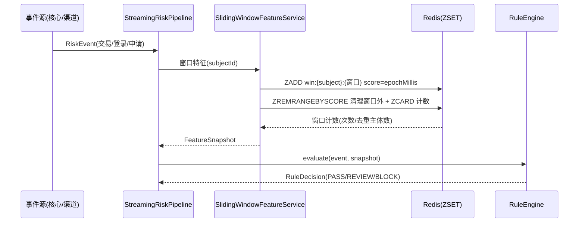
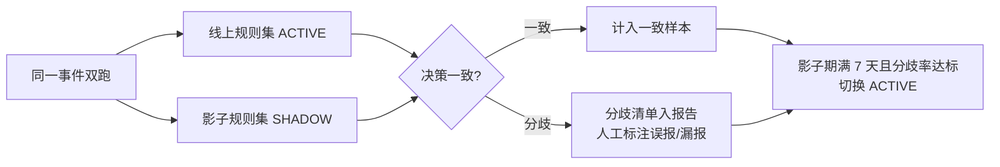
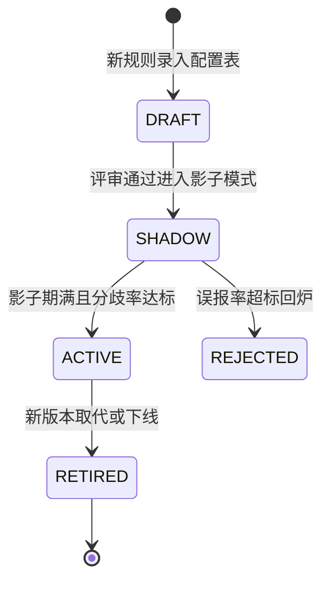

# 项目 06：金融风控 Agent 系统 — 09-实时流式风控

> **定位**：把风控从"申请粒度的批式预审"推进到"交易粒度的实时流式决策"——规则引擎毫秒级前置过滤 + LLM 深度判断异步旁路的快慢双通道，滑动窗口特征与规则热更新不停机生效。本篇起进入**进阶篇**（v8-v10 迭代 + ADR 总账 + 前沿收官），基础篇 00-08 的全部能力（分级/审批/审计/交叉验证/脱敏/预算）在流式场景下继续复用。**本文给出完整可手写代码（一行不省略）。**
>
> 「遇到阻塞？→ [教程 02-SpringAI核心机制/00-SSE流式通信 §流式链路]、[教程 01-WebFlux与响应式编程/02-背压与流量控制]、[教程 08-架构师进阶/08-响应式错误处理]、[教程 04-企业级架构主干/07-成本治理与Token计量]」

---

## 1. 需求与上一版痛点（四问）

| 问 | 答 |
|----|----|
| **新增了什么需求** | ① 交易/行为事件流的毫秒级前置过滤（确定性规则引擎）② 灰区事件的 LLM 深度判断异步旁路 ③ 滑动窗口特征实时计算 ④ 规则热更新（不停机生效，影子模式灰度） |
| **影响了哪些模块** | 新增流式入口（Sinks 接入）、规则引擎、滑动窗口特征服务、旁路编排；审计中心接入新事件类型 STREAM_DECISION / RULE_UPDATED |
| **架构如何演进** | 同步请求-响应的预审 → 快慢双通道：确定性规则在主链路（P99 < 50ms），LLM 深度判断走异步旁路（不阻塞主链路） |
| **上一版痛点是什么** | 预审按申请粒度批量触发，交易级欺诈信号（短时多笔、设备聚集）无法实时拦截；规则调整要发版，风控策略响应以天计 |

| v7 痛点 | 对策 |
|---------|------|
| 交易级信号无法实时消费 | 事件流接入 + 毫秒级前置过滤 |
| LLM 判断延迟与成本撑不起全量实时决策 | 快慢双通道：LLM 只看灰区，走异步旁路 |
| 规则调整需发版 | 规则配置化 + 双缓冲原子热切换 + 影子模式灰度 |

### 1.1 本节核对（四问）

- [ ] 三条 v7 痛点与四项新增能力对应得上
- [ ] "50ms 延迟预算"与"LLM 无放行权"两个硬约束能复述

## 2. 快慢双通道：为什么规则在前、LLM 在后

实时风控的延迟预算是硬约束：核心系统的交易同步链路只肯给风控 **50ms**。LLM 单次调用秒级起步，不可能放在主链路上等它。但这不等于 LLM 没用——规则引擎覆盖不住**语义型灰区**（材料措辞异常、行为模式可疑但未触线），这正是 v1-v7 打磨出来的深度判断能力。

结论：**确定性动作给规则引擎（可解释、可审计、毫秒级），语义灰区给 LLM（异步旁路，结论只做标记不做放行）**。这是 v2 "决策矩阵"思想在流式场景的投影：矩阵里没有任何一格是"机器直接终审"，双通道里同样没有——LLM 旁路的最重动作是"标记 REVIEW 升级人工"，不是拦截也不是放行。



**旁路降级的方向必须是保守侧**（ADR-128）：旁路队列过载时，事件退回"仅规则决策 + 标记 DEFERRED"，绝不能退成"默认放行"。这与 v3 的失败安全（EXPIRED 不自动通过）一脉相承。

### 2.1 本节核对（双通道设计）

- [ ] 图中 LLM 旁路的最重动作是"标记 REVIEW"，无任何拦截/放行路径（与 v2 矩阵"无机器终审"同构）
- [ ] 旁路过载降级目标是 DEFERRED（保守侧），不是默认放行——ADR-128

## 3. 滑动窗口特征

团伙与盗用类欺诈的最强信号都在时间窗口里：同一主体 10 分钟内多渠道发起申请、同一设备 1 小时内关联多个陌生主体、夜间短时高频小额试探。这些特征要用**滑动窗口**（不是翻滚桶——桶边界会漏掉跨桶的连续异常）。

### 3.1 窗口特征的计算时序


### 3.2 依赖增量（需在 pom.xml 中添加依赖）

```xml
<!-- 滑动窗口特征存储：Redis（响应式，WebFlux 铁律禁同步 RedisTemplate） -->
<dependency>
    <groupId>org.springframework.boot</groupId>
    <artifactId>spring-boot-starter-data-redis-reactive</artifactId>
</dependency>
```

`application-bankrisk.yaml`（两段式配置的业务段）增加：

```yaml
spring:
  data:
    redis:
      host: ${REDIS_HOST:127.0.0.1}
      port: 6379
risk:
  stream:
    bypass-queue-cap: 2000        # 旁路队列容量，过载触发 DEFERRED 降级
    sample-audit-rate: 0.05       # 放行事件抽样审计比例
```

> **API 真实性标注**：`ReactiveRedisTemplate` / `ReactiveStringRedisTemplate` 为 Spring Data Redis 真实 API（[教程 04-企业级架构主干/04-多页面流式响应与会话管理] 与 [教程 04-企业级架构主干/01-微服务拆分与Agent部署 §5.2] 同款用法，全体系已实证）；该依赖不在 pom 基线中，按「需在 pom.xml 中添加依赖」处理。

### 3.3 `RiskEvent.java` 与 `FeatureSnapshot.java`（事件与特征契约）

```java
package com.bank.risk.domain;

import java.time.Instant;

/** 流式风控事件：交易/登录/申请三类统一形态。 */
public record RiskEvent(
        String eventId,
        String type,          // TRANSACTION / LOGIN / APPLICATION
        String subjectId,     // 客户号（PII 脱敏后的主体标识，见 v6 双通道）
        String deviceId,
        double amountWan,
        String channel,
        Instant occurredAt
) {}
```

```java
package com.bank.risk.domain;

/** 滑动窗口特征快照：规则引擎的全部输入（确定性，可重算）。 */
public record FeatureSnapshot(
        String subjectId,
        long txnCount1min,
        long txnCount10min,
        long txnCount1h,
        long distinctDevice1h,
        double amountSum10min
) {}
```

### 3.4 `SlidingWindowFeatureService.java`（ZSET 滑动窗口）

```java
package com.bank.risk.service;

import com.bank.risk.domain.RiskEvent;
import com.bank.risk.domain.FeatureSnapshot;
import org.springframework.beans.factory.annotation.Autowired;
import org.springframework.data.redis.core.ReactiveRedisTemplate;
import org.springframework.data.redis.core.ReactiveZSetOperations;
import org.springframework.stereotype.Service;
import reactor.core.publisher.Mono;

import java.time.Duration;

/**
 * 滑动窗口特征：ZSET member=事件ID，score=epochMillis。
 * 先 ZADD 当前事件，再裁掉窗口外成员，最后 ZCARD——三步构成一次窗口快照。
 * 注意：三步非原子，高并发下窗口计数可能瞬时偏差；对精度敏感的场景改用 Lua 脚本打包。
 */
@Service
public class SlidingWindowFeatureService {

    @Autowired
    private ReactiveRedisTemplate<String, String> redis;

    public Mono<FeatureSnapshot> snapshot(RiskEvent event) {
        String subject = event.subjectId();
        String device = event.deviceId() == null ? "unknown" : event.deviceId();
        long now = event.occurredAt().toEpochMilli();
        String member = event.eventId();

        Mono<Long> c1 = windowCount(subject, "txn1m", member, now, Duration.ofMinutes(1));
        Mono<Long> c10 = windowCount(subject, "txn10m", member, now, Duration.ofMinutes(10));
        Mono<Long> c60 = windowCount(subject, "txn1h", member, now, Duration.ofHours(1));
        Mono<Long> dev60 = windowCount(device, "dev1h", member, now, Duration.ofHours(1));
        Mono<Double> amt10 = windowAmountSum(subject, "amt10m", member, event.amountWan(),
                now, Duration.ofMinutes(10));

        return Mono.zip(c1, c10, c60, dev60, amt10)
                .map(t -> new FeatureSnapshot(subject, t.getT1(), t.getT2(), t.getT3(),
                        t.getT4(), t.getT5()));   // amountSum10min：独立 ZSET（score=金额）窗口求和
    }

    /** 单窗口计数：ZADD → ZREMRANGEBYSCORE（裁剪）→ ZCARD（计数）。 */
    private Mono<Long> windowCount(String keyPart, String windowName, String member,
                                   long nowMillis, Duration window) {
        String key = "risk:win:" + windowName + ":" + keyPart;
        long windowStart = nowMillis - window.toMillis();
        ReactiveZSetOperations<String, String> ops = redis.opsForZSet();
        return ops.add(key, member, nowMillis)
                .then(ops.removeRangeByScore(key, 0, windowStart))
                .then(ops.zCard(key))
                .timeout(Duration.ofMillis(30))         // 特征查询硬超时：宁可特征缺失也不拖垮主链路
                .onErrorResume(e -> Mono.just(0L));     // 特征降级：缺失时按 0 处理（规则侧保守阈值兜底）
    }

    /** 金额窗口求和：独立 ZSET（score=金额，member=事件ID）——ZADD → 裁剪 → rangeWithScores 逐 score 求和。 */
    private Mono<Double> windowAmountSum(String keyPart, String windowName, String member,
                                         double amountWan, long nowMillis, Duration window) {
        String key = "risk:win:" + windowName + ":" + keyPart;
        long windowStart = nowMillis - window.toMillis();
        ReactiveZSetOperations<String, String> ops = redis.opsForZSet();
        return ops.add(key, member, amountWan)
                .then(ops.removeRangeByScore(key, 0, windowStart))
                .then(ops.rangeWithScores(key, 0, -1))
                .map(t -> t.getScore())                        // Flux<TypedTuple> → 逐个取 score
                .collectList()
                .map(scores -> scores.stream().mapToDouble(Double::doubleValue).sum())
                .timeout(Duration.ofMillis(30))                 // 硬超时同 windowCount
                .onErrorResume(e -> Mono.just(0.0));            // 特征降级：金额缺失按 0（规则侧保守阈值兜底）
    }
}
```

> 精度与原子性的取舍见 ADR-126：演示实现允许瞬时计数偏差（窗口特征是统计信号，非账务数字）；需要严格原子时用 Lua 把三步打包成一次 EVAL（Redis 原生能力）。

### 3.5 本节测试与验证（ZSET 滑动窗口）

**前置条件**：Redis 可连（`REDIS_HOST`）；§3.2 依赖增量与 yml 已加。

**材料——时间可控窗口测试**：

```java
// 用 reactor-test 的 StepVerifier.withVirtualTime 驱动（需在 pom 添加测试依赖
// io.projectreactor:reactor-test，scope=test）；不引时改用可注入 Clock 手工控制时间。
// ① 注入跨窗口边界的事件序列（1 分钟窗口：59s 前一串 + 61s 前一串）
// ② 金额求和：10 分钟窗口内注入 amountWan=1.5/2.0/3.5 三笔 → 断言 amountSum10min=7.0；窗口外一笔不计入
```

**步骤与断言**：

| # | 操作 | 预期（PASS 判据） |
|---|------|------------------|
| 1 | 材料① 断言 `txnCount1min` | 只含窗口内事件——61s 前的事件被 ZREMRANGEBYSCORE 裁掉 |
| 2 | Redis 手工核对 | `ZCARD risk:win:txn1m:{subject}` 与快照计数一致；key 结构为 `risk:win:{窗口}:{主体}` |
| 3 | 超时降级核对 | Redis 停机后 snapshot 不抛异常，各计数按 0 返回（30ms 超时 + onErrorResume） |
| 4 | 编译核对 | `ReactiveRedisTemplate` 为 spring-boot-starter-data-redis-reactive 真实 API，`opsForZSet().add/removeRangeByScore/zCard/rangeWithScores` 编译通过 |
| 5 | 金额求和核对 | 材料② 断言 `amountSum10min`=7.0（ZREMRANGEBYSCORE 裁剪后 rangeWithScores 求和）；窗口外事件不计入 |

**失败排查**：①窗口边界漏裁→score 用了秒而非毫秒；③主链路被拖→timeout 未设或设太长；并发计数偏差大→三步非原子（ADR-126 已声明，需要严格原子改 Lua）。

## 4. Flink 式窗口计算：自研内嵌 vs 流计算平台

上面的 ZSET 滑动窗口覆盖"单主体短窗口"特征。当特征升级为**跨主体、多事件源、乱序事件、精确一次（exactly-once）**的复杂流计算时，行业标准答案是流计算平台。选型分界：

| 维度 | 内嵌（Reactor + Redis） | 流计算平台（Flink） |
|------|------------------------|--------------------|
| 窗口语义 | 简单滑动/计数窗口 | 事件时间窗口、水位线、乱序容忍、会话窗口 |
| 一致性 | 尽力而为 | checkpoint + exactly-once 状态恢复 |
| 运维成本 | 无额外集群 | 独立集群、作业管理、状态后端 |
| 适用 | 单主体短窗口统计信号 | 跨主体关联、多源 Join、大状态长窗口 |

本迭代选择内嵌（交易级单主体信号），跨主体团伙关联留给 v10 的图谱方案——不引入 Flink 集群。若未来事件量与关联复杂度上来，Flink 的真实坐标如下（**第三方，本机 Maven 仓库未下载，未 javap 实证，引入前需自行验证版本兼容**）：

```xml
<!-- 概念坐标：Apache Flink 流计算（本机仓库未下载，引入前需自行实证）
<dependency>
    <groupId>org.apache.flink</groupId>
    <artifactId>flink-streaming-java</artifactId>
    <version>2.0.0</version>
</dependency>
-->
```

Flink 侧的等价窗口逻辑（**概念代码**，示意形态，非本项目落地代码）：

```java
// 概念代码：Flink 事件时间滑动窗口（真实 API 以 Flink 官方文档与本机实证为准）
DataStream<RiskEvent> events = env.addSource(coreSystemSource);
events
    .keyBy(RiskEvent::subjectId)
    .window(SlidingEventTimeWindows.of(Time.hours(1), Time.minutes(1)))
    .aggregate(new SubjectWindowAggregator())     // 等价于上面的 ZSET 窗口
    .addSink(ruleEngineSink);
```

Reactor 自身的窗口原语也真实可用（[教程 01-WebFlux与响应式编程/01-Reactor核心] 已覆盖）：`Flux.window(Duration)` / `Flux.bufferTimeout(int, Duration)`——单进程内的微批聚合用它们足够，跨进程才需要 Flink。

### 4.1 本节核对（选型分界）

- [ ] 四个维度（窗口语义/一致性/运维成本/适用）的内嵌 vs Flink 差异能复述
- [ ] Flink 的 XML 坐标与窗口代码均标注"概念/未实证"——本迭代不引入 Flink（ADR-126）

## 5. 规则引擎与热更新

### 5.1 确定性规则引擎

```java
package com.bank.risk.domain;

/** 前置分流结果（sealed 穷尽）：任何结果都携带规则版本，入审计可回溯。 */
public sealed interface RuleDecision permits
        RuleDecision.Pass, RuleDecision.Review, RuleDecision.Block {

    String ruleVersion();

    record Pass(String ruleVersion, String matchedRule) implements RuleDecision {}

    record Review(String ruleVersion, String matchedRule, String reason) implements RuleDecision {}

    record Block(String ruleVersion, String matchedRule, String reason) implements RuleDecision {}
}
```

```java
package com.bank.risk.service;

import com.bank.risk.domain.FeatureSnapshot;
import com.bank.risk.domain.RiskEvent;
import com.bank.risk.domain.RuleDecision;
import com.bank.risk.service.RuleEngine.RuleSet;
import org.springframework.beans.factory.annotation.Autowired;
import org.springframework.stereotype.Component;

import java.util.List;

/**
 * 确定性规则引擎：只做可解释的布尔/阈值判断。
 * 规则集来自 RuleSetHolder（热更新），引擎本身无状态。
 */
@Component
public class RuleEngine {

    @Autowired
    private RuleSetHolder holder;

    public RuleDecision evaluate(RiskEvent event, FeatureSnapshot f) {
        RuleSet rules = holder.current();
        for (RuleSet.Rule rule : rules.rules()) {
            if (!rule.type().equals(event.type())) {
                continue;
            }
            boolean hit = switch (rule.predicate()) {
                case "txnCount10min" -> f.txnCount10min() >= rule.threshold();
                case "distinctDevice1h" -> f.distinctDevice1h() >= rule.threshold();
                case "amountSum10min" -> f.amountSum10min() >= rule.threshold();
                default -> false;
            };
            if (hit) {
                return switch (rule.action()) {
                    case "BLOCK" -> new RuleDecision.Block(rules.version(), rule.name(), rule.reason());
                    case "REVIEW" -> new RuleDecision.Review(rules.version(), rule.name(), rule.reason());
                    default -> new RuleDecision.Pass(rules.version(), rule.name());
                };
            }
        }
        return new RuleDecision.Pass(rules.version(), "default-pass");
    }

    /** 规则集快照：版本 + 不可变规则清单（热切换的原子单位）。 */
    public record RuleSet(String version, List<Rule> rules) {
        public record Rule(String name, String type, String predicate,
                           long threshold, String action, String reason) {}
    }
}
```
### 5.2 热更新：双缓冲原子切换 + 影子模式

规则不能等发版才能改——欺诈手法变化以小时计。热更新三件套：**配置表为源、内存双缓冲原子切换、变更入审计链**。

```java
package com.bank.risk.service;

import com.bank.risk.service.RuleEngine.RuleSet;
import org.springframework.beans.factory.annotation.Autowired;
import org.springframework.jdbc.core.JdbcTemplate;
import org.springframework.stereotype.Component;

import java.util.List;
import java.util.concurrent.atomic.AtomicReference;

/**
 * 规则集持有者：AtomicReference 整体替换（读侧永远拿到完整一致的规则集快照）。
 * 刷新来源：规则配置表（风控策略员经 v9 合规检查点修改），变更动作入审计 CONFIG_CHANGED。
 */
@Component
public class RuleSetHolder {

    private final AtomicReference<RuleSet> currentSet = new AtomicReference<>
            (new RuleSet("v1", List.of()));
    @Autowired
    private JdbcTemplate jdbc;

    public RuleSet current() {
        return currentSet.get();
    }

    /** 热切换：加载配置表并整体替换引用——生效耗时小于 5s，无停机。 */
    public void reload() {
        List<RuleSet.Rule> rules = jdbc.query(
                "SELECT name, type, predicate, threshold, action, reason FROM rule_config WHERE status = 'ACTIVE'",
                (rs, i) -> new RuleSet.Rule(rs.getString("name"), rs.getString("type"),
                        rs.getString("predicate"), rs.getLong("threshold"),
                        rs.getString("action"), rs.getString("reason")));
        currentSet.set(new RuleSet("cfg-" + System.currentTimeMillis(), List.copyOf(rules)));
    }
}
```

```sql
-- 规则配置表（热更新数据源；修改必须经 v9 合规检查点，变更入审计链）
CREATE TABLE IF NOT EXISTS rule_config (
    id         BIGINT PRIMARY KEY AUTO_INCREMENT,
    name       VARCHAR(64)  NOT NULL,
    type       VARCHAR(32)  NOT NULL,        -- TRANSACTION / LOGIN / APPLICATION
    predicate  VARCHAR(64)  NOT NULL,        -- 条件键：txnCount10min / distinctDevice1h / amountSum10min
    threshold  BIGINT       NOT NULL,
    action     VARCHAR(16)  NOT NULL,        -- BLOCK / REVIEW / PASS
    reason     VARCHAR(256) NOT NULL,        -- 拦截理由（可解释性，入审计）
    status     VARCHAR(16)  NOT NULL,        -- DRAFT / SHADOW / ACTIVE / RETIRED
    updated_by VARCHAR(64)  NOT NULL,
    updated_at TIMESTAMP    NOT NULL
);
```

新规则不是直接上线——先在**影子模式**跑：只记录不拦截，与线上规则集双跑比对，达标才切换（复用 v5 灰度思想，[教程 04-企业级架构主干/09-灰度发布与版本管理 §流量切分]）：



规则生命周期整体如下（SHADOW 只记录不拦截；RETIRED 保留在配置表与审计链中——每条 STREAM_DECISION 都带规则版本，监管问询可回溯"当时生效的是哪个版本"）：



### 5.3 本节测试与验证（规则引擎与热更新）

**前置条件**：§5.2 的 rule_config DDL 已执行并插入 ≥1 条 ACTIVE 规则（如 txnCount10min ≥ 5 → BLOCK）。

**材料——热切换并发测试与影子比对**：

```java
// ① 热切换并发：线程 A 循环 evaluate()，线程 B 循环 reload()（规则数 3 → 5），持续 10s
// ② 同一事件流双跑 ACTIVE 与 SHADOW 两套规则集，收集分歧清单
```

**步骤与断言**：

| # | 操作 | 预期（PASS 判据） |
|---|------|------------------|
| 1 | 材料① | 任意时刻 `current()` 的规则集内部一致——版本与规则数匹配，无半新半旧（AtomicReference 整体替换） |
| 2 | 灰区规则核对 | 构造 snapshot 命中阈值 → 返回 `RuleDecision.Block`，携带 ruleVersion 与 reason（可解释） |
| 3 | 影子模式 | 材料② 运行 7 天分歧率 <5% 才切换 ACTIVE；分歧清单可人工标注误报/漏报 |
| 4 | 生命周期核对 | rule_config 的 status 流转 DRAFT→SHADOW→ACTIVE→RETIRED 与状态图一致；RETIRED 记录保留 |

**失败排查**：①半新半旧→误用可变 List 而非 `List.copyOf` 整体替换；③SHADOW 规则参与了拦截→evaluate 只加载 status='ACTIVE'。

## 6. 流式管线与旁路编排（WebFlux 铁律落地）

```java
package com.bank.risk.service;

import com.bank.risk.domain.AuditEvent;
import com.bank.risk.domain.RiskEvent;
import lombok.extern.slf4j.Slf4j;
import org.springframework.beans.factory.annotation.Autowired;
import org.springframework.beans.factory.annotation.Value;
import org.springframework.stereotype.Service;
import reactor.core.publisher.Flux;
import reactor.core.publisher.Sinks;
import reactor.core.scheduler.Schedulers;

import java.time.Instant;
import java.util.UUID;
import java.util.concurrent.atomic.AtomicLong;

/**
 * 流式风控管线：Sinks 接入 → 窗口特征 → 规则分流 → （灰区）LLM 旁路。
 * 铁律：主链路 EventLoop 上无 block；LLM 调用全部 boundedElastic 桥接；
 * 旁路过载降级方向为保守侧（DEFERRED，不默认放行）。
 */
@Slf4j
@Service
public class StreamingRiskPipeline {

    private final Sinks.Many<RiskEvent> inlet = Sinks.many().multicast().onBackpressureBuffer();
    private final AtomicLong bypassInFlight = new AtomicLong();

    @Autowired
    private SlidingWindowFeatureService featureService;
    @Autowired
    private RuleEngine ruleEngine;
    @Autowired
    private DeepInsightService deepInsightService;
    @Autowired
    private AuditService auditService;

    @Value("${risk.stream.bypass-queue-cap:2000}")
    private long bypassQueueCap;

    /** 事件入口：核心系统/渠道适配器调用。 */
    public boolean submit(RiskEvent event) {
        return inlet.tryEmitNext(event).isSuccess();
    }

    /** 订阅即启动（@PostConstruct 或独立 Runner 触发）。 */
    public Flux<StreamVerdict> start() {
        return inlet.asFlux()
                .flatMap(event -> featureService.snapshot(event)
                        .map(f -> toVerdict(event, f)),
                        256)                                   // 并发上限：主链路背压闸门
                .doOnNext(v -> {
                    if (v.needsDeepInsight()) {
                        enqueueDeepInsight(v.event());
                    }
                });
    }

    /** 灰区旁路：容量满则 DEFERRED（保守降级），绝不静默丢。 */
    private void enqueueDeepInsight(RiskEvent event) {
        if (bypassInFlight.incrementAndGet() > bypassQueueCap) {
            bypassInFlight.decrementAndGet();
            audit(event, "DEFERRED", "旁路过载，仅规则决策生效");
            return;
        }
        deepInsightService.deepInsight(event)
                .subscribeOn(Schedulers.boundedElastic())
                .doFinally(s -> bypassInFlight.decrementAndGet())
                .subscribe(
                        opinion -> audit(event, opinion.verdict().name(), opinion.summaryReason()),
                        err -> log.error("深度判断失败 event={}", event.eventId(), err));
    }

    private StreamVerdict toVerdict(RiskEvent event, FeatureSnapshot f) {
        RuleDecision decision = ruleEngine.evaluate(event, f);
        audit(event, kindOf(decision), reasonOf(decision));
        return new StreamVerdict(event, decision,
                decision instanceof RuleDecision.Review);
    }

    private String kindOf(RuleDecision d) {
        if (d instanceof RuleDecision.Block) {
            return "BLOCK";
        }
        return d instanceof RuleDecision.Review ? "REVIEW" : "PASS";
    }

    private String reasonOf(RuleDecision d) {
        if (d instanceof RuleDecision.Block b) {
            return b.reason();
        }
        return d instanceof RuleDecision.Review r ? r.reason() : null;
    }

    private void audit(RiskEvent event, String outcome, String reason) {
        String payload = """
                {"eventId":"%s","outcome":"%s","reason":"%s"}
                """.formatted(event.eventId(), outcome, reason == null ? "" : reason);
        auditService.record(new AuditEvent(
                UUID.randomUUID().toString(),
                AuditEvent.EventType.STREAM_DECISION,
                event.subjectId(),
                payload,
                ruleEngine.current().version(),
                Instant.now()));
    }

    /** 流式裁决：事件 + 决策 + 是否需要旁路。 */
    public record StreamVerdict(RiskEvent event, RuleDecision decision, boolean needsDeepInsight) {}
}
```

> **API 真实性标注**：`Sinks.many().multicast().onBackpressureBuffer()` 与 `tryEmitNext()` 返回 `Sinks.EmitResult`（`isSuccess()` 判定）均为 Reactor 真实 API（[教程 03-React前端与AgenticUI/04-流式工具调用与事件协议] 已实证 Sinks.Many 用法）；`flatMap(fn, 256)` 第二参为并发预取上限（Reactor 真实重载）；`Flux.subscribe(onNext, onError)` 为真实重载。

**接入层接线（入口端点 + 管线启动）**——`submit`/`start` 两个方法的调用方，让"灌入 1000 事件"可直接经 HTTP 执行：

```java
// Spring AI 2.0.0 —— 事件接入端点：核心系统/渠道适配器把交易/登录/申请事件 POST 进来
package com.bank.risk.controller;

import com.bank.risk.domain.RiskEvent;
import com.bank.risk.service.StreamingRiskPipeline;
import org.springframework.beans.factory.annotation.Autowired;
import org.springframework.web.bind.annotation.PostMapping;
import org.springframework.web.bind.annotation.RequestBody;
import org.springframework.web.bind.annotation.RequestMapping;
import org.springframework.web.bind.annotation.RestController;
import reactor.core.publisher.Mono;

import java.util.Map;

@RestController
@RequestMapping("/api/stream")
public class StreamEventController {

    @Autowired
    private StreamingRiskPipeline pipeline;

    /** 事件接入：accepted=false 表示 Sinks 背压缓冲满（tryEmitNext 失败），上游应重试或丢弃计数。 */
    @PostMapping("/events")
    public Mono<Map<String, Object>> accept(@RequestBody RiskEvent event) {
        boolean accepted = pipeline.submit(event);
        return Mono.just(Map.of("accepted", accepted, "eventId", event.eventId()));
    }
}
```

```java
// Spring AI 2.0.0 —— 管线启动接线：应用就绪即订阅，事件到达即刻流经窗口特征与规则引擎
package com.bank.risk.config;

import com.bank.risk.service.StreamingRiskPipeline;
import lombok.extern.slf4j.Slf4j;
import org.springframework.boot.CommandLineRunner;
import org.springframework.context.annotation.Bean;
import org.springframework.context.annotation.Configuration;

@Slf4j
@Configuration
public class StreamingPipelineConfig {

    @Bean
    public CommandLineRunner startStreamingPipeline(StreamingRiskPipeline pipeline) {
        return args -> pipeline.start().subscribe(
                verdict -> log.info("流式裁决: event={}, decision={}",
                        verdict.event().eventId(), verdict.decision().getClass().getSimpleName()),
                err -> log.error("流式管线异常", err));
    }
}
```

### 6.1 `DeepInsightService.java`（LLM 旁路，复用既有实证 API）

```java
package com.bank.risk.service;

import com.bank.risk.domain.RiskEvent;
import org.springframework.ai.chat.client.ChatClient;
import org.springframework.beans.factory.annotation.Autowired;
import org.springframework.stereotype.Service;
import reactor.core.publisher.Mono;
import reactor.core.scheduler.Schedulers;

/**
 * LLM 深度判断旁路：灰区事件的语义风险信号。
 * 输出 EventRiskOpinion（结构化）；结论只用于标记（REVIEW 升级人工），
 * 不用于放行——流式场景下 LLM 无放行权（ADR-125 的另一半）。
 */
@Service
public class DeepInsightService {

    @Autowired
    private ChatClient modelAClient;   // 复用 v5 的 modelAClient（主模型）

    public Mono<EventRiskOpinion> deepInsight(RiskEvent event) {
        return Mono.fromCallable(() -> modelAClient.prompt()
                    .system("""
                            你是交易风险分析师。根据事件与窗口特征判断是否存在欺诈信号。
                            规则：只输出材料支持的判断；证据不足时 verdict 给 LOW 并说明缺口。
                            """)
                    .user("事件：" + event)
                    .call()
                    .entity(EventRiskOpinion.class))   // entity(Class) 真实重载（v1 同款）
                .subscribeOn(Schedulers.boundedElastic());
    }

    /** 旁路结构化输出契约。 */
    public record EventRiskOpinion(Verdict verdict, String summaryReason) {
        public enum Verdict { LOW, HIGH }
    }
}
```

### 6.2 审计事件类型演进

在 v4 的 `AuditEvent.EventType` 枚举中**新增两个值**（枚举演进，链上老记录不受影响——事件 JSON 反序列化按枚举名，历史值不变）：

```java
public enum EventType {
    PRETRIAL_REQUEST, OPINION_PRODUCED, TOOL_CALLED, APPROVAL_DECIDED,
    CONFIG_CHANGED, CROSS_VALIDATION, AUDIT_QUERY,
    STREAM_DECISION,     // v8：流式风控裁决（含 DEFERRED 降级）
    RULE_UPDATED         // v8：规则热更新（版本/操作人/来源配置表快照）
}
```

### 6.3 本节测试与验证（管线旁路与降级）

**前置条件**：§3.5 / §5.3 通过；`DeepInsightService` 可用（DEEPSEEK_API_KEY 在位）。

**材料——旁路背压测试**：

```yaml
# 临时把旁路容量调小（写入 application-bankrisk.yaml）
risk:
  stream:
    bypass-queue-cap: 10
```

**材料——事件灌入脚本**（可执行，验证 §6 接入层；应用已启动 8081 端口）：

```bash
# 循环灌入 1000 个灰区事件（type=APPLICATION 走灰区分流）
for i in $(seq 1 1000); do
  curl -s -X POST "http://localhost:8081/api/stream/events" -H "Content-Type: application/json" \
    -d "{\"eventId\":\"EVT-$i\",\"type\":\"APPLICATION\",\"subjectId\":\"PSEUDO-S$i\",\"deviceId\":\"DEV-$((i % 50))\",\"amountWan\":1.5,\"channel\":\"app\",\"occurredAt\":\"2026-08-30T10:00:00Z\"}" > /dev/null
done
# 预期：每个请求返回 {"accepted":true,...}；旁路容量 10 时，超出部分产生 DEFERRED 审计事件（见断言 1 的 SQL）
```

**步骤与断言**：

| # | 操作 | 预期（PASS 判据） |
|---|------|------------------|
| 1 | 灌入 1000 个灰区事件 | 超出容量的部分 100% 产生 `STREAM_DECISION(outcome=DEFERRED)` 审计事件（SQL：`SELECT COUNT(*) FROM audit_chain WHERE event_type='STREAM_DECISION' AND event_json LIKE '%DEFERRED%'`） |
| 2 | 主链路隔离 | 旁路打满时主链路延迟波动 <10%（P99 不受影响）——LLM 调用全在 boundedElastic |
| 3 | 旁路意见核对 | 灰区事件经 deepInsight 后产出 EventRiskOpinion（verdict LOW/HIGH），结论只做标记不做放行 |
| 4 | 枚举演进核对 | `STREAM_DECISION` / `RULE_UPDATED` 新增后，链上老事件反序列化不受影响（`verify()` 通过，历史 EventType 值不变） |

**失败排查**：①超量事件被静默丢→enqueueDeepInsight 未走 DEFERRED 审计分支；②主链路抖动→deepInsight 漏了 subscribeOn(boundedElastic)；④老记录解析失败→枚举名被改名（只能新增不能改名）。

## 7. 全篇回归验证

**前置条件**：§3.5 / §5.3 / §6.3 均通过。

| # | 操作 | 预期（PASS 判据） |
|---|------|------------------|
| 1 | `mvn clean test` | 全部单测（窗口/热切换/旁路）通过，`BUILD SUCCESS` |
| 2 | 审计完整性：任取一个已裁决事件回放 | 链上可见"事件 → 窗口特征（规则版本内）→ 裁决 →（旁路意见）"完整链路；`GET /api/audit/verify` intact=true |
| 3 | 回归 v3-v6 | 申请粒度的审批/审计/脱敏链路不受流式新增代码影响（EventType 扩展向后兼容） |

**失败排查**：②缺规则版本→audit() 的 promptVersion 位传了 null；③老链路断→枚举演进破坏了历史反序列化，回查 §6.2 约束。

## 8. 验收对照

| # | 验收项 | 标准 |
|---|--------|------|
| 1 | 主链路延迟 | 前置分流 P99 小于 50ms（含窗口特征查询 30ms 超时预算） |
| 2 | 旁路隔离 | LLM 旁路故障/过载不影响主链路；降级路径 100% 走 DEFERRED 审计 |
| 3 | 热更新 | 规则修改到生效小于 5s，零停机；切换前后裁决均可按规则版本回溯 |
| 4 | 影子灰度 | 新规则影子期不少于 7 天，误报率小于 5% 才可激活；激活动作入审计 RULE_UPDATED |
| 5 | 保守降级 | 任何过载/故障路径无"默认放行"；特征缺失走保守阈值 |
| 6 | 审计联动 | 流式裁决 100% 入链（含放行抽样）；链校验通过 |

> 与章节验证的映射：验收 1=§3.5 断言 3（30ms 超时预算）+压测、验收 2=§6.3 断言 1/2、验收 3=§5.3 断言 1、验收 4=§5.3 断言 3、验收 5=§3.5 断言 3+§6.3 断言 1（保守降级面）、验收 6=§7 回归断言 2。本表不重复材料。

## 9. 本迭代的 ADR

| # | 决策 | 理由 |
|---|------|------|
| ADR-125 | 确定性规则前置、LLM 只做异步旁路且无放行权 | 50ms 延迟预算内 LLM 不可行；旁路最重动作是标记 REVIEW（矩阵无机器放行格的原则在流式场景的延续） |
| ADR-126 | 窗口特征用 Redis ZSET 内嵌实现，不引 Flink | 当前特征为单主体短窗口统计信号，Flink 集群的运维成本不成比例；跨主体关联走 v10 图谱而非流计算 |
| ADR-127 | 规则热更新用双缓冲原子切换 + 影子模式 | 欺诈手法以小时变化，发版响应太慢；影子灰度防新规则误伤（复用 v5 灰度思想） |
| ADR-128 | 旁路过载降级方向为保守侧（DEFERRED） | 流式场景的失败安全：宁可不享受 LLM 深度判断，不可默认放行（v3 EXPIRED 原则的流式版） |

### 9.1 本节核对（ADR-125~128）

- [ ] ADR-125 的"旁路无放行权"与 §2 图、§6.3 断言 3 三方一致
- [ ] ADR-128（保守降级）与 v3 ADR-110（EXPIRED 失败安全）的传承关系能说出来

## 10. v8 的痛点

实时拦截量上来之后，监管现场检查的问法变了：不再只问"这笔为什么拦"，而是问"**你们整体的风险策略是什么、模型用了什么数据、依据是什么**"——单笔可回放（v4）有了，但**体系级的可解释与报送**（模型卡片、数据卡片、逐笔依据链、上线前合规评审）还是空白。→ [10-监管报送与可解释合规.md](10-监管报送与可解释合规.md)

## 11. 总结

| 概念 | 一句话 |
|------|--------|
| 快慢双通道 | 规则引擎毫秒级主链路 + LLM 异步旁路；旁路无放行权 |
| 滑动窗口 | Redis ZSET（score=epoch）三步快照：ZADD → 裁剪 → 计数；30ms 硬超时 |
| 热更新 | 配置表为源 + AtomicReference 整体替换 + 影子模式灰度 + 变更入链 |
| 降级方向 | 任何过载都退到保守侧（DEFERRED / 特征缺失保守阈值），无默认放行 |
| 审计演进 | EventType 新增 STREAM_DECISION / RULE_UPDATED，裁决与规则版本全量入链 |

> §10 一句话核对：痛点（体系级可解释与报送空白）指向 10 即 PASS；§11 总结五行与 §2/§3.4/§5.2/ADR-128/§6.2 一一对应即 PASS。

→ [10-监管报送与可解释合规.md](10-监管报送与可解释合规.md)

**下一篇**：10-监管报送与可解释合规——模型卡片落地 + 决策可解释 + 合规检查点。
