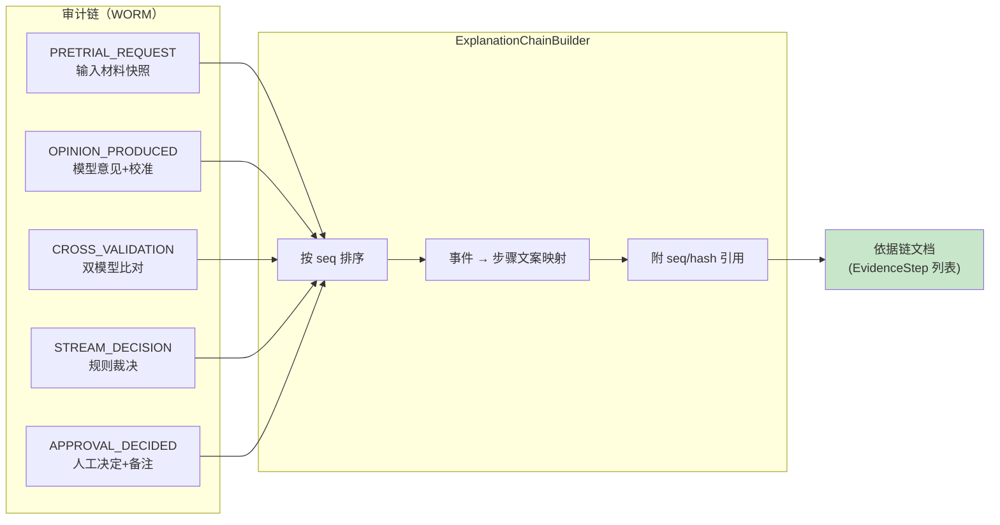
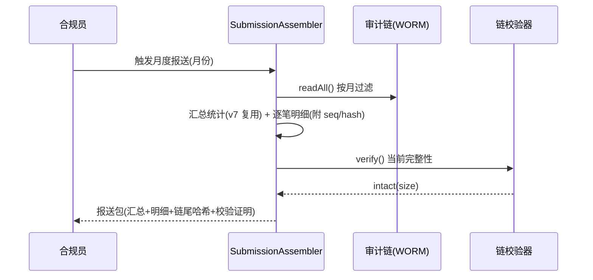
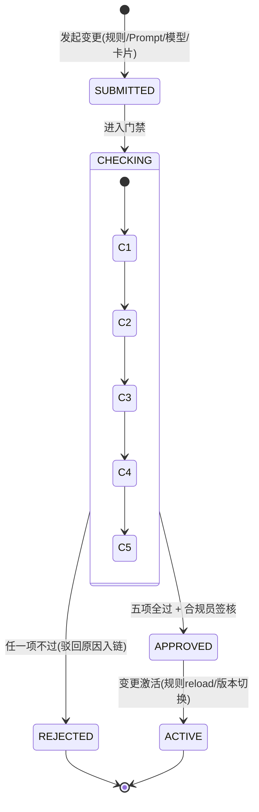

# 项目 06：金融风控 Agent 系统 — 10-监管报送与可解释合规

> **定位**：把"单笔可回放"升级为"体系可解释"——模型卡片/数据卡片文档化并与版本同链、监管报送从审计链自动生成、每次拒贷/放款的完整依据链、新策略上线前的合规评审门。监管验收从"回答问题"变成"出示证据"。**本文给出完整可手写代码（一行不省略）。**
>
> 「遇到阻塞？→ [附录 12-AI治理与合规/01-模型卡片与数据卡片]、[附录 12-AI治理与合规/00-NIST-AI-RMF框架]、[教程 08-架构师进阶/09-Agent治理与合规框架]、[教程 08-架构师进阶/07-数据飞轮与持续改进 §金标集]」

---

## 1. 需求与上一版痛点（四问）

| 问 | 答 |
|----|----|
| **新增了什么需求** | ① 模型卡片/数据卡片文档化（决策依据文档化，与模型/Prompt 版本绑定）② 监管报送自动化（审计链 → 报送格式，汇总 + 逐笔）③ 决策可解释依据链（每次拒贷/放款的完整依据）④ 合规检查点（新策略上线前合规评审门） |
| **影响了哪些模块** | 新增合规模块：ModelCardRegistry、ExplanationChainBuilder、SubmissionAssembler、ComplianceGate；审计中心接入新事件 MODEL_CARD_PUBLISHED / COMPLIANCE_GATE |
| **架构如何演进** | v7 的月报（汇总统计）→ 报送（对外格式化产物）+ 依据链（逐笔解释文档）+ 卡片（体系化治理文档）+ 门禁（上线前强制评审） |
| **上一版痛点是什么** | 实时拦截量上来后监管问询升级：整体策略/模型数据依据无法体系化出示；解释靠人工拼材料；新规则上线无合规评审环节 |

| v8 痛点 | 对策 |
|---------|------|
| "整体策略与模型依据"无法出示 | 模型卡片/数据卡片代码化 + 版本同链 |
| 问询解释靠人工拼装 | 依据链自动组装（事件链 → 解释文档） |
| 新规则直接热更新上线，无合规环节 | 合规检查点作为激活前的硬门禁 |

### 1.1 本节核对（四问）

- [ ] 三条 v8 痛点与四项新增能力对应（卡片/报送/依据链/门禁）
- [ ] "体系可解释 vs 单笔回放"的分界能复述（v4 回放单笔，本篇出示体系证据）

## 2. 模型卡片与数据卡片：文档即数据

卡片失败的主流形态是 wiki 上的静态文档——模型改了卡片忘改，监管拿到的与线上跑的是两回事。本项目的做法（ADR-129）：**卡片是系统里的代码化 record，注册在库里，哈希入审计链；改模型必改卡片，卡片不过门禁则模型不能上**（门禁见 §5）。

卡片内容对齐 [附录 12-AI治理与合规/01-模型卡片与数据卡片] 的字段框架：用途与范围、版本、评估指标与限制、人工监督点、数据来源与分级。金融场景必须多两样：**监管红线声明**（终审人工）与**已知不适用场景**（如跨境材料、非小微客群）。

### 2.1 `ModelCard.java` 与 `DataCard.java`（卡片契约）

```java
package com.bank.risk.domain;

import java.time.Instant;
import java.util.List;

/** 模型卡片：与 model + promptVersion 绑定的治理文档（代码化，非 wiki）。 */
public record ModelCard(
        String cardId,
        String model,                    // deepseek-chat / deepseek-reasoner
        String promptVersion,            // 绑定的 Prompt 版本（与链上事件一致）
        String purpose,                  // 用途：信贷预审建议（辅助人工终审）
        List<String> intendedUse,        // 适用：小微信贷材料预审
        List<String> outOfScopeUse,      // 不适用：跨境材料/非小微客群/自动放款决策
        List<Metric> metrics,            // 评估指标（一致率/校准后置信度分桶）
        String humanOversight,           // 人工监督点：终审必须人工（监管红线）
        String limitations,              // 已知限制（材料造假识别上限/长尾行业覆盖不足）
        String owner,
        Instant publishedAt
) {
    public record Metric(String name, double value, String evaluatedOn) {}
}
```

```java
package com.bank.risk.domain;

import java.time.Instant;
import java.util.List;

/** 数据卡片：模型消费的数据的来源与分级文档（对齐 v6 的 L1-L4 分级）。 */
public record DataCard(
        String cardId,
        String datasetName,              // 信贷申请材料/征信摘要/交易事件流
        List<String> sources,            // 来源系统与采集方式
        String classification,           // 最高涉密等级（L1-L4）
        String piiHandling,              // PII 处理：Prompt 假名化 + 审计加密（v6 双通道）
        String retention,                // 留存：审计 7 年 WORM（ADR-103）
        String knownGaps,                // 已知数据缺口（新行业无历史样本）
        Instant publishedAt
) {}
```

### 2.2 `ModelCardRegistry.java`（注册 + 入链）

```java
package com.bank.risk.service;

import com.bank.risk.domain.AuditEvent;
import com.bank.risk.domain.DataCard;
import com.bank.risk.domain.ModelCard;
import com.fasterxml.jackson.databind.ObjectMapper;
import org.springframework.jdbc.core.JdbcTemplate;
import org.springframework.stereotype.Service;

import java.time.Instant;
import java.util.Optional;
import java.util.UUID;

/**
 * 卡片注册表：发布即入审计链（MODEL_CARD_PUBLISHED）——卡片与决策同链，
 * 监管可核对"当时生效的卡片"与"当时的决策"是否一致。
 */
@Service
public class ModelCardRegistry {

    private final JdbcTemplate jdbc;
    private final AuditService auditService;
    private final ObjectMapper objectMapper;

    public ModelCardRegistry(JdbcTemplate jdbc, AuditService auditService,
                             ObjectMapper objectMapper) {
        this.jdbc = jdbc;
        this.auditService = auditService;
        this.objectMapper = objectMapper;
    }

    public void publish(ModelCard card) {
        jdbc.update("""
                INSERT INTO model_card (card_id, model, prompt_version, card_json, owner, published_at)
                VALUES (?,?,?,?,?,?)
                """,
                card.cardId(), card.model(), card.promptVersion(), toJson(card),
                card.owner(), java.sql.Timestamp.from(card.publishedAt()));
        auditService.record(new AuditEvent(
                UUID.randomUUID().toString(),
                AuditEvent.EventType.MODEL_CARD_PUBLISHED,
                null,
                toJson(card),
                card.promptVersion(),
                Instant.now()));
    }

    /** 门禁用：某 model+promptVersion 是否有已发布卡片。 */
    public Optional<ModelCard> findFor(String model, String promptVersion) {
        return jdbc.query(
                "SELECT card_json FROM model_card WHERE model = ? AND prompt_version = ? ORDER BY published_at DESC LIMIT 1",
                (rs, i) -> fromJson(rs.getString("card_json")), model, promptVersion).stream().findFirst();
    }

    private String toJson(Object value) {
        try {
            return objectMapper.writeValueAsString(value);
        } catch (Exception e) {
            throw new IllegalStateException("卡片序列化失败", e);
        }
    }

    private ModelCard fromJson(String json) {
        try {
            return objectMapper.readValue(json, ModelCard.class);
        } catch (Exception e) {
            throw new IllegalStateException("卡片反序列化失败", e);
        }
    }
}
```

```sql
-- 模型卡片表（数据卡片同构，略）
CREATE TABLE IF NOT EXISTS model_card (
    card_id        VARCHAR(64) PRIMARY KEY,
    model          VARCHAR(64) NOT NULL,
    prompt_version VARCHAR(64) NOT NULL,
    card_json      CLOB        NOT NULL,
    owner          VARCHAR(64) NOT NULL,
    published_at   TIMESTAMP   NOT NULL
);
```

EventType 枚举再演进两个值（同 v8 的做法）：`MODEL_CARD_PUBLISHED`（卡片发布）、`COMPLIANCE_GATE`（门禁通过/驳回记录）。

### 2.3 本节测试与验证（卡片注册与门禁联动）

**前置条件**：v4 审计链可用；`model_card` DDL 已执行；EventType 已新增 `MODEL_CARD_PUBLISHED` / `COMPLIANCE_GATE`。

**材料——卡片门禁联动测试**（从原 §7.1 上移）：

```java
// ① 对某 promptVersion 不发卡片直接构造 ChangeRequest 走 ComplianceGate.check（见 §5.1）
//    → approved=false，failures 含 "C1: 该 model+promptVersion 无已发布模型卡片"
// ② ModelCardRegistry.publish(card) 后 findFor(model, promptVersion) → 非空；重跑 check → C1 不再驳回
```

**步骤与断言**：

| # | 操作 | 预期（PASS 判据） |
|---|------|------------------|
| 1 | `mvn clean test` | 材料①② 按注释预期通过 |
| 2 | 入链核对 | publish 后 audit_chain 出现 `MODEL_CARD_PUBLISHED` 事件，payload 为卡片 JSON、promptVersion 位与卡片一致 |
| 3 | 卡片字段核对 | ModelCard 含金融特有的监管红线声明（humanOversight）与不适用场景（outOfScopeUse）两项，无缺省 |

**失败排查**：②事件 payload 与表内 card_json 不一致→两处 toJson 用的 mapper 不同；③字段漏→record 定义被改，对照附录 13/01 字段框架。

## 3. 决策可解释：依据链组装

监管问询的口径纪律：**解释必须与当时决策完全一致**。让 LLM 事后重新生成一遍"为什么拒"，等于允许系统对同一决策给出两套说法——审计上是灾难。所以依据链是**纯组装**：从审计链取事件、按时间排序、映射成人类可读的步骤，每步引用链上 seq 与 hash（ADR-131）。



### 3.1 `ExplanationChainBuilder.java`（依据链组装器）

```java
package com.bank.risk.service;

import com.bank.risk.domain.AuditEvent;
import com.bank.risk.domain.AuditRecord;
import org.springframework.stereotype.Service;

import java.util.List;

/**
 * 依据链组装器：审计事件 → 人类可读依据步骤。
 * 纯组装，不调 LLM（ADR-131）——解释的每个字都能指回链上事件。
 */
@Service
public class ExplanationChainBuilder {

    private final WormStore wormStore;

    public ExplanationChainBuilder(WormStore wormStore) {
        this.wormStore = wormStore;
    }

    public List<EvidenceStep> buildFor(String applicationId) {
        return wormStore.findByApplicationId(applicationId).stream()
                .map(this::toStep)
                .toList();
    }

    private EvidenceStep toStep(AuditRecord record) {
        AuditEvent event = record.event();
        return new EvidenceStep(
                record.seq(),
                record.hash(),
                describe(event),
                event.promptVersion(),
                record.timestamp());
    }

    private String describe(AuditEvent event) {
        return switch (event.type()) {
            case PRETRIAL_REQUEST -> "信贷员提交申请材料（材料快照入链）";
            case OPINION_PRODUCED -> "预审意见产出（等级/置信度/校准因子版本见事件负载）";
            case CROSS_VALIDATION -> "高额度交叉验证（双模型意见与分歧清单）";
            case STREAM_DECISION -> "实时风控裁决（规则版本与命中理由）";
            case APPROVAL_DECIDED -> "审批员人工决定（决定/备注/是否推翻 AI）";
            case TOOL_CALLED -> "终审工具提交（经人工审批闸门放行）";
            default -> event.type() + " 事件（详见负载）";
        };
    }

    /** 依据步骤：每步可指回链上 seq 与 hash。 */
    public record EvidenceStep(long seq, String hash, String description,
                               String promptVersion, java.time.Instant at) {}
}
```

与 v1 `summaryReason` 的分工：**决策时** LLM 产出的理由（含 summaryReason）作为 OPINION_PRODUCED 事件入链，是决策的一部分；**问询时**的解释只是把链上这些内容组装呈现——同一个决策永远只有一套说法。
### 3.2 本节测试与验证（依据链口径一致性）

**前置条件**：审计链上有完整走完 v1-v3 流程的申请（≥1 单）。

**材料——口径一致性测试**（从原 §7.2 上移）：

```java
// 随机抽 50 单（demo 可缩为全量单）：buildFor(appId) 的结果与 wormStore.findByApplicationId(appId)
// 逐条比对：步骤数量、顺序（按 seq）、每步的 seq/hash 引用
```

**步骤与断言**：

| # | 操作 | 预期（PASS 判据） |
|---|------|------------------|
| 1 | 材料比对 | 步骤数/顺序/seq/hash 100% 一致 |
| 2 | 纯组装核对 | 依据链文档中不存在链上没有的信息（describe 的文案仅是事件类型的固定映射，无生成内容） |
| 3 | 代码审查 | `ExplanationChainBuilder` 无任何 ChatClient/LLM 调用（ADR-131） |

**失败排查**：①顺序错→依赖了 findByApplicationId 的返回序（其 SQL 已 ORDER BY seq，若改动需重排）；③出现 LLM 调用→违反口径纪律，回改纯组装。

## 4. 监管报送自动化

v7 的月报已经从审计链重算（ADR-123 单一真相），但它只覆盖汇总统计。报送是**对外产物**，要多三样：逐笔明细（抽样的拒贷/放款清单，每笔附依据链引用）、格式化模板（按监管当年下发的报送格式填充——**模板字段以监管文件为准，本文用概念字段示例，不虚构具体报表编号**）、防伪证明（报送包自带生成时刻的链尾哈希与完整性校验结果）。



### 4.1 `SubmissionAssembler.java`（报送包组装）

```java
package com.bank.risk.service;

import com.bank.risk.domain.AuditRecord;
import org.springframework.stereotype.Service;

import java.time.YearMonth;
import java.time.ZoneId;
import java.util.List;

/**
 * 报送组装器：审计链 → 报送包（汇总 + 逐笔明细 + 防伪证明）。
 * 沿 ADR-123：报表不另存数据源，从链上重算；逐笔明细引用链上 seq/hash。
 */
@Service
public class SubmissionAssembler {

    private final WormStore wormStore;
    private final AuditService auditService;
    private final ExplanationChainBuilder explanationChainBuilder;
    private final MonthlyReportService monthlyReportService;   // v7 汇总统计复用

    public SubmissionAssembler(WormStore wormStore,
                               AuditService auditService,
                               ExplanationChainBuilder explanationChainBuilder,
                               MonthlyReportService monthlyReportService) {
        this.wormStore = wormStore;
        this.auditService = auditService;
        this.explanationChainBuilder = explanationChainBuilder;
        this.monthlyReportService = monthlyReportService;
    }

    /** 报送包：汇总（月报）+ 逐笔明细（拒贷抽样）+ 链证明。 */
    public SubmissionPackage assemble(YearMonth month, List<String> sampledApplicationIds) {
        List<RecordRef> details = sampledApplicationIds.stream()
                .map(id -> new RecordRef(id, explanationChainBuilder.buildFor(id)))
                .toList();
        AuditRecord chainTail = wormStore.readAll().get(wormStore.readAll().size() - 1);
        return new SubmissionPackage(
                month,
                monthlyReportService.monthlyReport(month).block(),   // 组装为批处理任务，boundedElastic 内执行
                details,
                chainTail.seq(),
                chainTail.hash(),
                auditService.verify());
    }

    /** 逐笔引用：申请号 + 依据链。 */
    public record RecordRef(String applicationId,
                            List<ExplanationChainBuilder.EvidenceStep> chain) {}

    /** 报送包（概念字段——实际字段以监管当年下发模板为准）。 */
    public record SubmissionPackage(YearMonth month,
                                    Object summary,
                                    List<RecordRef> details,
                                    long chainTailSeq,
                                    String chainTailHash,
                                    com.bank.risk.domain.ChainVerification proof) {}
}
```

> `monthlyReportService.monthlyReport(month)` 返回 `Mono`，组装器是离线批任务：用 `block()` 前必须确认运行在 `boundedElastic`（EventLoop 上禁 block 的铁律），生产建议改为链式 `flatMap` 组装（见 [教程 08-架构师进阶/08-响应式错误处理 §阻塞边界]）。

### 4.2 本节测试与验证（报送零差异与防伪）

**前置条件**：某月审计链数据就绪（含若干申请全流程）；v7 月报可用。

**材料——报送零差异测试**（从原 §7.3 上移）：

```java
// 同月两次调用 SubmissionAssembler.assemble(month, sampledIds)，比对两次产物
```

**步骤与断言**：

| # | 操作 | 预期（PASS 判据） |
|---|------|------------------|
| 1 | 材料两次比对 | 汇总与逐笔明细完全一致（链只增不改；期间新增事件若非该月则产物不变） |
| 2 | 防伪核对 | 报送包的 chainTailHash 与当次 `auditService.verify()`（intact）一致；人为 UPDATE 链后重生成→ proof.intact=false 立即失配 |
| 3 | 明细引用核对 | RecordRef 的 EvidenceStep 均能按 seq 在链上找到对应记录 |

**失败排查**：①两次不一致→readAll() 的链尾取法有竞态或月份过滤漂移；③引用悬空→依据链与链数据不同源（必须同走 WormStore）。

## 5. 合规检查点：上线前的硬门禁

v8 的规则热更新带来了新风险：配置表一改就生效。本迭代给所有"策略类变更"加上**门禁**——新规则、阈值调整、Prompt 新版本、模型切换、卡片更新，激活前必须过五道检查，任何一道不过即驳回。



五道检查：**C1 卡片齐全**（模型/Prompt 版本有已发布卡片）、**C2 金标回归**（历史终审案例重跑，一致率不低于现网基线，[教程 08-架构师进阶/07-数据飞轮与持续改进 §金标集]）、**C3 影子结果**（v8 影子期报告达标）、**C4 合规清单**（监管红线逐项勾选：无机器终审/PII 处理/留存策略）、**C5 签核**（合规员 + 业务负责人双人）。

### 5.1 `ComplianceGate.java`（门禁执行器）

```java
package com.bank.risk.service;

import com.bank.risk.domain.AuditEvent;
import org.springframework.stereotype.Service;

import java.time.Instant;
import java.util.ArrayList;
import java.util.List;
import java.util.UUID;

/**
 * 合规检查点：策略类变更激活前的硬门禁（ADR-132）。
 * 门禁结论（通过/驳回）入审计链 COMPLIANCE_GATE——监管可查"每次策略变更都被审过"。
 */
@Service
public class ComplianceGate {

    private final ModelCardRegistry cardRegistry;
    private final AuditService auditService;

    public ComplianceGate(ModelCardRegistry cardRegistry, AuditService auditService) {
        this.cardRegistry = cardRegistry;
        this.auditService = auditService;
    }

    public GateResult check(ChangeRequest change) {
        List<String> failures = new ArrayList<>();

        if (cardRegistry.findFor(change.model(), change.promptVersion()).isEmpty()) {
            failures.add("C1: 该 model+promptVersion 无已发布模型卡片");
        }
        if (change.goldenRegressionPassRate() < change.baselinePassRate()) {
            failures.add("C2: 金标回归一致率低于现网基线");
        }
        if (!change.shadowReportQualified()) {
            failures.add("C3: 影子期报告未达标（未跑满或误报超标）");
        }
        if (!change.complianceChecklistSigned()) {
            failures.add("C4: 合规清单未完成签署");
        }
        if (change.complianceOfficer() == null || change.businessOwner() == null) {
            failures.add("C5: 缺合规员或业务负责人签核");
        }

        boolean approved = failures.isEmpty();
        auditService.record(new AuditEvent(
                UUID.randomUUID().toString(),
                AuditEvent.EventType.COMPLIANCE_GATE,
                null,
                "{\"changeId\":\"" + change.changeId() + "\",\"approved\":" + approved
                        + (approved ? "" : ",\"failures\":" + failures.size()) + "}",
                change.promptVersion(),
                Instant.now()));
        return new GateResult(approved, failures);
    }

    /** 变更请求（策略类变更统一形态）。 */
    public record ChangeRequest(String changeId, String model, String promptVersion,
                                double goldenRegressionPassRate, double baselinePassRate,
                                boolean shadowReportQualified, boolean complianceChecklistSigned,
                                String complianceOfficer, String businessOwner) {}

    /** 门禁结论。 */
    public record GateResult(boolean approved, List<String> failures) {}
}
```

### 5.2 本节测试与验证（门禁五查与驳回路径）

**前置条件**：§2.3 通过（卡片注册可用）。

**材料——门禁驳回路径测试**（从原 §7.4 上移）：

```java
// 分别构造 C2（金标一致率低于基线）/ C3（影子未达标）/ C4（清单未签）/ C5（缺签核人）
// 四种不满足的 ChangeRequest（C1 已由 §2.3 材料① 覆盖），逐一 check
```

**步骤与断言**：

| # | 操作 | 预期（PASS 判据） |
|---|------|------------------|
| 1 | `mvn clean test` | 5 种驳回（C1-C5）各 100% 触发，failures 文案与对应检查项一致 |
| 2 | 入链核对 | 每次驳回在 audit_chain 产生 `COMPLIANCE_GATE` 事件（approved=false，payload 含 changeId） |
| 3 | 通过路径 | 五项全满足的 ChangeRequest → approved=true，同样入链 |

**失败排查**：①某项不触发→check 的 if 条件写反或阈值比较方向错；②事件缺 failures 计数→payload 拼接逻辑漏了非 approved 分支。

## 6. NIST AI RMF 映射

以 [附录 12-AI治理与合规/00-NIST-AI-RMF框架] 的四函数对照本项目机制，回答监管"治理框架落在哪"：

| RMF 函数 | 本项目落地 | 出处 |
|----------|-----------|------|
| GOVERN（治理） | 卡片制度 + 合规门禁 + ADR 决策记录 + 双人签核 | 本篇 §2/§5、12-ADR |
| MAP（映射） | 数据卡片的数据来源/分级/缺口申报 + 模型不适用场景声明 | 本篇 §2 |
| MEASURE（度量） | 校准分桶 + 金标回归 + override rate 双向告警 + 影子比对 | v2/v7/v8、本篇 C2/C3 |
| MANAGE（管理） | 风险分级路由 + HITL + 交叉验证 + 实时拦截 + 团伙调查 | v2/v3/v5/v8/v10 |

### 6.1 本节核对（RMF 映射）

- [ ] 四函数行的"出处"列均指向真实存在的章节/迭代（GOVERN→§2/§5、MAP→§2、MEASURE→C2/C3、MANAGE→v2/v3/v5/v8），无空指
- [ ] 映射表每行至少一个可出示的证据物（卡片/门禁记录/分桶数据/拦截日志）

## 7. 全篇回归验证

**前置条件**：§2.3 / §3.2 / §4.2 / §5.2 均通过。

| # | 操作 | 预期（PASS 判据） |
|---|------|------------------|
| 1 | `mvn clean test` | 全部单测通过，`BUILD SUCCESS` |
| 2 | 端到端：无卡片新版本→门禁驳回→补卡片→通过→激活 | 全链路（卡片↔门禁↔审计）贯通，两次 COMPLIANCE_GATE 事件均入链 |
| 3 | `GET /api/audit/verify` | 新增 MODEL_CARD_PUBLISHED / COMPLIANCE_GATE 事件类型后链仍 intact（枚举演进向后兼容，与 v8 同法） |

**失败排查**：②激活后无 RULE_UPDATED/版本变更记录→激活动作未接门禁出口；③链断→卡片 JSON 序列化不稳定（record 含 List<Metric>，核对 mapper 一致）。

## 8. 验收对照

| # | 验收项 | 标准 |
|---|--------|------|
| 1 | 卡片完备 | 线上每个 model+promptVersion 组合 100% 有已发布卡片；卡片发布入链 |
| 2 | 依据链 | 任意申请可一键生成依据链；抽查 50 单与链上事件零出入 |
| 3 | 报送自动化 | 月度报送包一键生成；汇总与明细均来自审计链重算（无第二数据源） |
| 4 | 防伪 | 报送包带链尾哈希与完整性证明；篡改链后重生成立即失配 |
| 5 | 门禁强制 | 全部策略类变更 100% 过门禁激活；驳回记录入链可查 |
| 6 | 治理映射 | NIST RMF 四函数映射表经合规部评审确认 |

> 与章节验证的映射：验收 1=§2.3 断言 2/3、验收 2=§3.2 断言 1、验收 3=§4.2 断言 1、验收 4=§4.2 断言 2、验收 5=§5.2 断言 1/2、验收 6=§6.1 核对（评审为流程项）。本表不重复材料。

## 9. 本迭代的 ADR

| # | 决策 | 理由 |
|---|------|------|
| ADR-129 | 卡片代码化（record + 注册表 + 入链），不做 wiki 文档 | 静态文档必然与线上脱节；卡片与决策同链才可核对一致性 |
| ADR-130 | 报送从审计链重算并附链证明（承 ADR-123） | 单一真相 + 自带防伪；第二数据源迟早出现口径分歧 |
| ADR-131 | 解释=事件链组装，禁止 LLM 现场再生成 | 同一决策只能有一套说法；事后生成等于给监管两套口径 |
| ADR-132 | 合规检查点是策略激活的硬门禁（五项检查+双人签核） | 热更新带来"一改就生效"的风险，必须用流程闸门兜住（HITL 思想的策略版） |

### 9.1 本节核对（ADR-129~132）

- [ ] ADR-131（禁止 LLM 现场再生成解释）与 §3 的纯组装设计、§3.2 断言 3 一致
- [ ] ADR-132 五项检查与 §5.1 check 的五个 if 一一对应

## 10. v9 的痛点

单笔可解释与体系合规都立住了，但剩余风险集中在**团伙性欺诈**：个案视角下每个申请都"低风险"，关联视角下（同一设备、资金闭环、联系方式重叠）是一张网。预审 Agent 的输入是单份材料，天然看不见图。→ [11-反欺诈多Agent协同.md](11-反欺诈多Agent协同.md)

## 11. 总结

| 概念 | 一句话 |
|------|--------|
| 卡片 | 文档即数据：record + 注册表 + 发布入链；无卡片不上线 |
| 依据链 | 审计事件 → 步骤文案 + seq/hash 引用；纯组装，不调 LLM |
| 报送 | 链上重算（汇总复用 v7 月报）+ 逐笔明细 + 链尾哈希防伪 |
| 门禁 | C1 卡片 / C2 金标回归 / C3 影子 / C4 清单 / C5 双签——不过不激活 |
| RMF | GOVERN/MAP/MEASURE/MANAGE 四函数全部有落点，可出示给监管 |

> §10 一句话核对：痛点（团伙性欺诈、单材料看不见图）指向 11 即 PASS；§11 总结五行与 ADR-129/131/130/§5 五查/§6 映射表一一对应即 PASS。

→ [11-反欺诈多Agent协同.md](11-反欺诈多Agent协同.md)

**下一篇**：11-反欺诈多Agent协同——图关联分析 + 团伙识别 + 多Agent会签调查。
