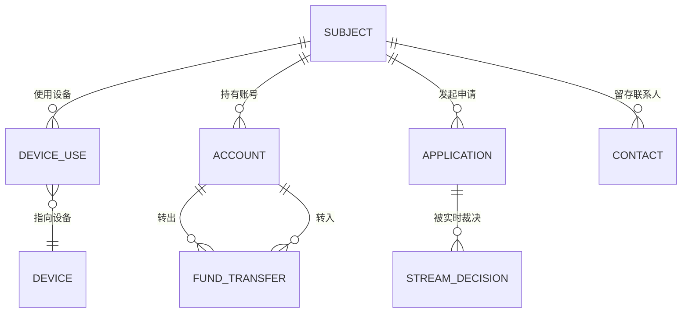
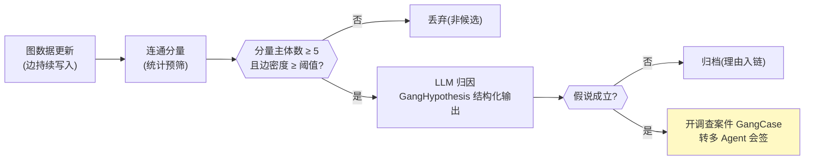
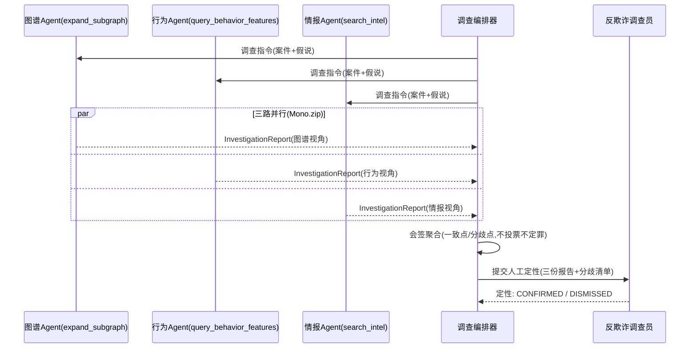
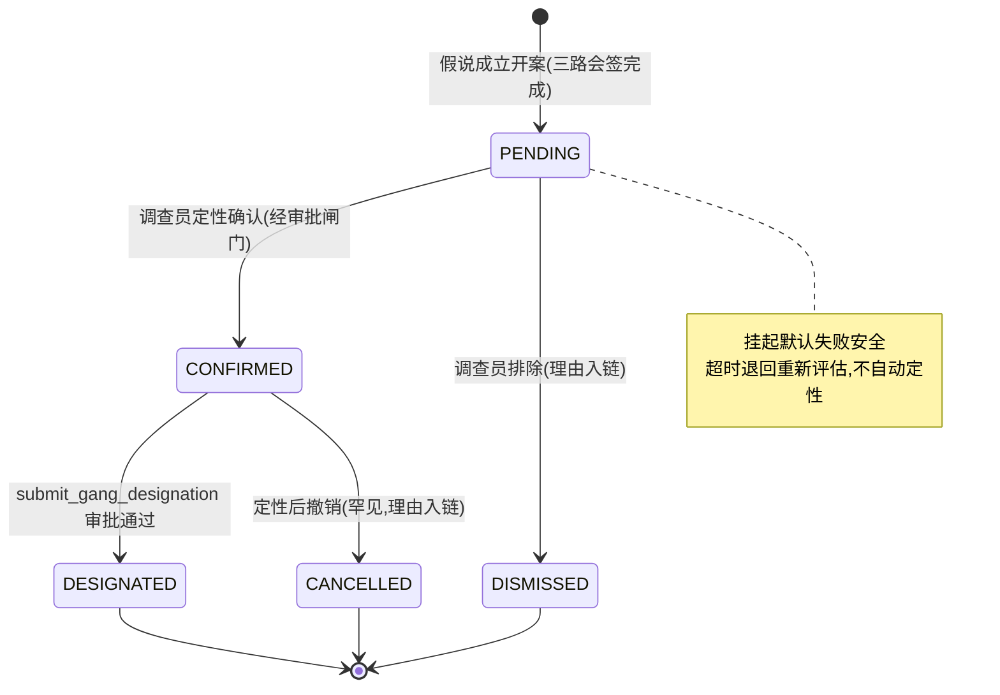

# 项目 06：金融风控 Agent 系统 — 11-反欺诈多 Agent 协同

> **定位**：从"个案预审"扩展到"关联视角"——图关联分析（设备/账号/资金关系图）、团伙识别（社区检测 + LLM 归因）、多 Agent 协同调查（图谱/行为/情报三 Agent 会签）、可疑团伙的人工定性（HITL 升级）。多 Agent 协作在风控场景的完整落地。**本文给出完整可手写代码（一行不省略）。**
>
> 「遇到阻塞？→ [教程 00-基础与核心/09-多Agent协作 全篇]、[教程 04-企业级架构主干/08-Human-in-the-Loop与审批流 §4.1 拦截点]、[教程 04-企业级架构主干/03-工具执行可观测与审计]、[附录 10-知识图谱工程/00-Neo4j落地GraphRAG]」

---

## 1. 需求与上一版痛点（四问）

| 问 | 答 |
|----|----|
| **新增了什么需求** | ① 图关联分析（申请人-设备-账号-资金的实体关系图）② 团伙识别（社区检测统计预筛 + LLM 归因）③ 多 Agent 协同调查（图谱 Agent + 行为 Agent + 情报 Agent 会签）④ 可疑团伙 HITL 定性 |
| **影响了哪些模块** | 新增关系图存储与查询、团伙候选识别、调查编排与会签聚合；审批引擎复用（危险动作工具化）；审计新增 INVESTIGATION / GANG_DESIGNATED 事件 |
| **架构如何演进** | 单 Agent 预审（材料输入）→ 多 Agent 调查工作流：fan-out 三路调查 + 会签聚合 + 人工定性 + 名单动作审批 |
| **上一版痛点是什么** | 团伙跨申请作案：个案各自"低风险"，关联信号（同设备/资金闭环/联系人重叠）无人消费 |

| v9 痛点 | 对策 |
|---------|------|
| 个案视角看不见团伙 | 实体关系图 + 社区检测 |
| 统计社区检测误报高、不可解释 | 统计预筛 + LLM 归因两层（快慢双通道思想的图版） |
| 单 Agent 调查视角单一 | 三 Agent 分工会签（图谱/行为/情报） |
| "给团伙定罪"动作风险极高 | 定性必须人工；名单标记走 v3 审批闸门 |

### 1.1 本节核对（四问）

- [ ] 四条 v9 痛点与四项新增能力一一对应
- [ ] "个案低风险、关联成网"的团伙欺诈特征能举例（同设备/资金闭环/联系人重叠）

## 2. 图关联分析：实体关系建模

反欺诈图的核心不是点多，是**边的语义**：共用设备、资金流转、联系人重叠、申请时间聚集。先建图模型（本页用 Mermaid ER 图表达，落地为关系表）：



### 2.1 存储选型（ADR-133）

| 方案 | 优势 | 劣势 | 适用 |
|------|------|------|------|
| PG/H2 邻接表 + 递归 CTE | 零新组件、SQL 可审计、与现有库同栈 | 多跳查询性能一般、无图算法 | 本项目规模（十万级实体） |
| Neo4j 图数据库 | 原生图遍历、GDS 图算法（社区检测） | 新组件、运维、行内引入流程 | 亿级边 + 高频多跳 |

本迭代用**邻接表起步**：团伙识别的社区检测在应用层实现简化版（连通分量 + 密度阈值），GDS 级算法（Louvain/Label Propagation）作为演进方向。Neo4j 真实坐标（**第三方，本机 Maven 仓库未下载，未 javap 实证，引入前需自行验证**）：

```xml
<!-- 概念坐标：Neo4j 官方 Java 驱动（本机仓库未下载，引入前需自行实证）
<dependency>
    <groupId>org.neo4j.driver</groupId>
    <artifactId>neo4j-java-driver</artifactId>
    <version>5.28.0</version>
</dependency>
-->
```

Cypher 查询示例（**概念代码**，图版落地时参考）：

```cypher
// 概念代码：两跳设备关联（Neo4j Cypher，本项目未落地）
MATCH (s1:Subject)-[:USES]->(d:Device)<-[:USES]-(s2:Subject)
WHERE s1 <> s2 AND d.riskLevel = "HIGH"
RETURN s1, s2, count(d) AS sharedDevices ORDER BY sharedDevices DESC
```

### 2.2 关系表与递归 CTE（本项目落地）

```sql
-- 实体关系表（邻接表；实体标识一律用 v6 脱敏后的假名，还原走 PseudonymVault 授权）
CREATE TABLE IF NOT EXISTS graph_edge (
    id          BIGINT PRIMARY KEY AUTO_INCREMENT,
    src_type    VARCHAR(16) NOT NULL,     -- SUBJECT / DEVICE / ACCOUNT
    src_id      VARCHAR(64) NOT NULL,
    dst_type    VARCHAR(16) NOT NULL,
    dst_id      VARCHAR(64) NOT NULL,
    rel_type    VARCHAR(32) NOT NULL,     -- USES_DEVICE / OWNS_ACCOUNT / TRANSFERS_TO / SHARES_CONTACT
    weight      DOUBLE      NOT NULL DEFAULT 1.0,
    occurred_at TIMESTAMP   NOT NULL
);
CREATE INDEX IF NOT EXISTS idx_edge_src ON graph_edge(src_type, src_id);
CREATE INDEX IF NOT EXISTS idx_edge_dst ON graph_edge(dst_type, dst_id);
```

```sql
-- 递归 CTE：从种子主体出发的三跳关联子图（H2 PostgreSQL 模式支持 WITH RECURSIVE）
WITH RECURSIVE expand(lvl, node_type, node_id) AS (
    SELECT 0, 'SUBJECT', :seedSubject
    UNION ALL
    SELECT e.lvl + 1,
           CASE WHEN re.dst_type = 'SUBJECT' THEN re.dst_type ELSE re.src_type END,
           CASE WHEN re.dst_type = 'SUBJECT' THEN re.dst_id ELSE re.src_id END
    FROM expand e
    JOIN graph_edge re
      ON (re.src_type = e.node_type AND re.src_id = e.node_id)
      OR (re.dst_type = e.node_type AND re.dst_id = e.node_id)
    WHERE e.lvl < 3
)
SELECT DISTINCT node_type, node_id FROM expand;
```

### 2.3 `GraphQueryService.java`（子图查询，只读）

```java
package com.bank.risk.service;

import org.springframework.beans.factory.annotation.Autowired;
import org.springframework.jdbc.core.JdbcTemplate;
import org.springframework.stereotype.Service;

import java.util.List;

/**
 * 关系图查询（只读——调查类工具最小权限，ADR-135）。
 * 实体标识全部为假名（v6 PseudonymVault 产物），图数据本身不含明文 PII。
 */
@Service
public class GraphQueryService {

    @Autowired
    private JdbcTemplate jdbc;

    /** 三跳关联子图：返回主体/设备/账号节点与边。 */
    public SubGraph expandSubgraph(String seedSubject) {
        List<String> nodes = jdbc.queryForList("""
                WITH RECURSIVE expand(lvl, node_type, node_id) AS (
                    SELECT 0, 'SUBJECT', ?
                    UNION ALL
                    SELECT e.lvl + 1,
                           CASE WHEN re.dst_type = 'SUBJECT' THEN re.dst_type ELSE re.src_type END,
                           CASE WHEN re.dst_type = 'SUBJECT' THEN re.dst_id ELSE re.src_id END
                    FROM expand e
                    JOIN graph_edge re
                      ON (re.src_type = e.node_type AND re.src_id = e.node_id)
                      OR (re.dst_type = e.node_type AND re.dst_id = e.node_id)
                    WHERE e.lvl < 3
                )
                SELECT DISTINCT node_type || ':' || node_id FROM expand
                """,
                String.class, seedSubject);
        List<String> edges = jdbc.queryForList(
                "SELECT CONCAT(src_type, ':', src_id, '-', rel_type, '->', dst_type, ':', dst_id) "
                + "FROM graph_edge WHERE src_id = ? OR dst_id = ?",
                String.class, seedSubject, seedSubject);
        return new SubGraph(nodes, edges);
    }

    /** 子图快照（给图谱 Agent 与 LLM 归因消费）。 */
    public record SubGraph(List<String> nodes, List<String> edges) {}
}
```

### 2.4 `GraphEdgeService.java`（边写入与来源入链）+ 接入端点

§2.3 是只读查询；写侧独立成服务——**每条边落 `graph_edge` 的同时，其来源事件（哪次申请/哪笔交易产生了这条边）入审计链**（ADR-136"边来源入链"的落点，防"图本身被污染"无据可查）。实体标识必须是 v6 假名（上游过脱敏管道后才允许调本服务）：

```java
// Spring AI 2.0.0 —— 关系图写入：边落库 + 来源事件入链（ADR-136）
package com.bank.risk.service;

import com.bank.risk.domain.AuditEvent;
import org.springframework.beans.factory.annotation.Autowired;
import org.springframework.jdbc.core.JdbcTemplate;
import org.springframework.stereotype.Service;

import java.time.Instant;
import java.util.UUID;

@Service
public class GraphEdgeService {

    @Autowired
    private JdbcTemplate jdbc;
    @Autowired
    private AuditService auditService;

    /** 写一条关系边并落链。sourceEventId 是产生该边的业务事件（申请/交易/审批）标识。 */
    public void recordEdge(String srcType, String srcId, String dstType, String dstId,
                           String relType, double weight, String sourceEventId) {
        jdbc.update("""
                INSERT INTO graph_edge (src_type, src_id, dst_type, dst_id, rel_type, weight, occurred_at)
                VALUES (?,?,?,?,?,?,NOW())
                """,
                srcType, srcId, dstType, dstId, relType, weight);
        // 来源入链：GRAPH_EDGE_APPENDED 事件携带边五元组 + 来源事件，图污染可回溯
        auditService.record(new AuditEvent(
                UUID.randomUUID().toString(),
                AuditEvent.EventType.GRAPH_EDGE_APPENDED,
                srcId,
                "{\"src\":\"%s:%s\",\"dst\":\"%s:%s\",\"rel\":\"%s\",\"sourceEventId\":\"%s\"}"
                        .formatted(srcType, srcId, dstType, dstId, relType, sourceEventId),
                null,
                Instant.now()));
    }
}
```

调试/演示用接入端点（生产由申请、交易管线在业务事件点调用 `recordEdge`，不暴露写接口）：

```java
// Spring AI 2.0.0 —— 边写入接入端点（演示/联调用；生产环境应关闭或限内网）
package com.bank.risk.controller;

import com.bank.risk.service.GraphEdgeService;
import org.springframework.beans.factory.annotation.Autowired;
import org.springframework.web.bind.annotation.PostMapping;
import org.springframework.web.bind.annotation.RequestBody;
import org.springframework.web.bind.annotation.RequestMapping;
import org.springframework.web.bind.annotation.RestController;
import reactor.core.publisher.Mono;
import reactor.core.scheduler.Schedulers;

import java.util.Map;

@RestController
@RequestMapping("/api/graph")
public class GraphEdgeController {

    @Autowired
    private GraphEdgeService graphEdgeService;

    public record EdgeRequest(String srcType, String srcId, String dstType, String dstId,
                              String relType, Double weight, String sourceEventId) {}

    @PostMapping("/edges")
    public Mono<Map<String, Object>> addEdge(@RequestBody EdgeRequest req) {
        return Mono.fromRunnable(() -> graphEdgeService.recordEdge(
                        req.srcType(), req.srcId(), req.dstType(), req.dstId(),
                        req.relType(), req.weight() == null ? 1.0 : req.weight(),
                        req.sourceEventId() == null ? "MANUAL" : req.sourceEventId()))
                .subscribeOn(Schedulers.boundedElastic())
                .thenReturn(Map.of("recorded", true));
    }
}
```

### 2.5 本节测试与验证（递归 CTE 与假名一致性）

**前置条件**：`graph_edge` DDL 已执行并插入测试拓扑。

**材料——已知拓扑数据与断言**：

```sql
-- 构造拓扑：A-B-C-D 链 + E 孤立点（SUBJECT 用假名 PSEUDO-A 等）
INSERT INTO graph_edge (src_type, src_id, dst_type, dst_id, rel_type, occurred_at) VALUES
  ('SUBJECT','PSEUDO-A','DEVICE','DEV-1','USES_DEVICE',NOW()),
  ('SUBJECT','PSEUDO-B','DEVICE','DEV-1','USES_DEVICE',NOW()),   -- A、B 共用设备
  ('SUBJECT','PSEUDO-C','DEVICE','DEV-2','USES_DEVICE',NOW()),
  ('SUBJECT','PSEUDO-D','DEVICE','DEV-2','USES_DEVICE',NOW());   -- E 不插入
```

**步骤与断言**：

| # | 操作 | 预期（PASS 判据） |
|---|------|------------------|
| 1 | `expandSubgraph("PSEUDO-A")` | 三跳内返回 B/C/D 关联节点，不返回 E |
| 2 | 环路图（A→B→A 两条边） | 不死循环（`lvl < 3` 截断生效） |
| 3 | 假名核对 | 图节点标识与 v6 PseudonymVault 产物同形（PSEUDO-N）；节点/边结果中无明文 PII |
| 4 | 编译核对 | H2 `MODE=PostgreSQL` 下 `WITH RECURSIVE` 执行成功；GraphQueryService 无写 SQL（只读） |

**失败排查**：①E 混入→CTE 的 JOIN 条件漏了双向匹配；②死循环→lvl 条件放错了分支；③出现明文→上游写边时未过脱敏管道。

## 3. 团伙识别：统计预筛 + LLM 归因

社区检测的标准算法（Louvain、Label Propagation）在 Neo4j GDS 库中提供（**第三方插件，本项目未引入，概念参考 [附录 10-知识图谱工程/00-Neo4j落地GraphRAG]**）。本项目落地的简化版：**连通分量 + 密度阈值**——把图按共享设备/联系人边聚成连通分量，分量内主体数与边密度超过阈值即为候选团伙。这是"快通道"（确定性统计）；候选团伙再交 LLM 做**归因**（"慢通道"）：把子图序列化成结构化特征，让 LLM 输出团伙假说与证据评估。



### 3.1 `GangHypothesis.java` 与 `GangAttributionService.java`

```java
package com.bank.risk.domain;

import java.util.List;

/** 团伙假说：LLM 归因的结构化产物（证据必须指向子图中的具体节点/边）。 */
public record GangHypothesis(
        boolean plausible,
        String gangType,              // 设备农场 / 资金闭环 / 材料造假互助
        List<String> evidence,        // 引用子图节点/边的证据描述
        List<String> missingEvidence, // 证据缺口（下一步调查方向）
        double confidence
) {}
```

```java
package com.bank.risk.service;

import com.bank.risk.domain.GangHypothesis;
import com.bank.risk.service.GraphQueryService.SubGraph;
import org.springframework.ai.chat.client.ChatClient;
import org.springframework.beans.factory.annotation.Autowired;
import org.springframework.stereotype.Service;
import reactor.core.publisher.Mono;
import reactor.core.scheduler.Schedulers;

/**
 * 团伙归因：子图 → GangHypothesis。
 * 与 v1 同款 API：entity(Class) 结构化输出 + boundedElastic 桥接。
 */
@Service
public class GangAttributionService {

    @Autowired
    private ChatClient modelAClient;

    public Mono<GangHypothesis> attribute(SubGraph subGraph) {
        return Mono.fromCallable(() -> modelAClient.prompt()
                    .system("""
                            你是反欺诈分析师。根据关联子图判断是否存在欺诈团伙。
                            规则：每条 evidence 必须引用子图中具体的节点或边，禁止臆造；
                            证据不足时 plausible 给 false 并列出 missingEvidence。
                            """)
                    .user("子图节点：" + subGraph.nodes() + "\n子图边：" + subGraph.edges())
                    .call()
                    .entity(GangHypothesis.class))
                .subscribeOn(Schedulers.boundedElastic());
    }
}
```

### 3.2 `GangCase.java` 与 `CaseOpeningService.java`（开案触发）

§3 流程图的收尾落点：**归因成立 → 开调查案件，进入 §4 三路会签；归因不成立 → 归档且理由入链**（DROP2 分支也不能无痕）。案件记录与会签/定性（§5 状态机）共用 `CaseStatus`：

```java
package com.bank.risk.domain;

import java.time.Instant;
import java.util.List;

/** 团伙调查案件：统计预筛 + 归因成立后开案，进入三 Agent 会签（§4）。 */
public record GangCase(
        String caseId,
        List<String> memberSubjects,   // 分量内主体假名清单（v6 假名，无明文 PII）
        String subgraphSummary,        // 子图摘要（节点/边计数，全文见调查工具取数）
        GangHypothesis hypothesis,     // 开案依据：LLM 归因假说
        CaseStatus status,
        Instant openedAt
) {
    public enum CaseStatus { OPEN, CONFIRMED, DISMISSED, DESIGNATED, CANCELLED }
}
```

```java
// Spring AI 2.0.0 —— 开案触发：归因成立开案 + INVESTIGATION 事件入链；不成立归档且理由入链
package com.bank.risk.service;

import com.bank.risk.domain.AuditEvent;
import com.bank.risk.domain.GangCase;
import com.bank.risk.domain.GangHypothesis;
import com.bank.risk.service.GraphQueryService.SubGraph;
import com.fasterxml.jackson.databind.ObjectMapper;
import org.springframework.beans.factory.annotation.Autowired;
import org.springframework.stereotype.Service;
import reactor.core.publisher.Mono;

import java.time.Instant;
import java.util.List;
import java.util.Map;
import java.util.UUID;

@Service
public class CaseOpeningService {

    @Autowired
    private GangAttributionService gangAttributionService;
    @Autowired
    private AuditService auditService;
    @Autowired
    private ObjectMapper objectMapper;

    /**
     * 开案触发（§3 流程图 T→LLM→H 节点的代码落点）：候选分量（连通分量 + 密度阈值预筛命中）
     * 交 LLM 归因——成立则开案（OPEN，进三路会签），不成立则归档（理由入链，DROP2 分支无痕即漏）。
     */
    public Mono<GangCase> openIfPlausible(List<String> memberSubjects, SubGraph subGraph) {
        return gangAttributionService.attribute(subGraph)
                .flatMap(hypothesis -> {
                    if (!hypothesis.plausible()) {
                        // 归因不成立：归档理由入链（不静默丢弃）
                        auditService.record(new AuditEvent(
                                UUID.randomUUID().toString(),
                                AuditEvent.EventType.INVESTIGATION,
                                null,
                                toJson(Map.of("action", "ARCHIVED",
                                        "subjects", memberSubjects,
                                        "missingEvidence", hypothesis.missingEvidence())),
                                null, Instant.now()));
                        return Mono.empty();
                    }
                    GangCase gangCase = new GangCase(
                            "GC-" + UUID.randomUUID().toString().substring(0, 8),
                            memberSubjects,
                            "nodes=" + subGraph.nodes().size() + ",edges=" + subGraph.edges().size(),
                            hypothesis,
                            GangCase.CaseStatus.OPEN,
                            Instant.now());
                    auditService.record(new AuditEvent(
                            UUID.randomUUID().toString(),
                            AuditEvent.EventType.INVESTIGATION,
                            null,
                            toJson(Map.of("action", "CASE_OPENED", "caseId", gangCase.caseId())),
                            null, Instant.now()));
                    return Mono.just(gangCase);
                });
    }

    private String toJson(Object value) {
        try {
            return objectMapper.writeValueAsString(value);
        } catch (Exception e) {
            throw new IllegalStateException("案件事件序列化失败", e);
        }
    }
}
```

> 归因不成立走 `Mono.empty()`——预筛候选被 LLM 否决不是错误，不开案；但**归档动作必须入链**，否则"预筛命中却无下文"在监管问询时是空窗。

### 3.3 本节测试与验证（LLM 归因结构化输出）

**前置条件**：`DEEPSEEK_API_KEY` 在位；§2.5 的子图可查。

**材料——归因探针**（手写集成测试或临时端点）：

```java
// 用 §2.5 的四主体共设备子图调用 GangAttributionService.attribute(subGraph)
```

**步骤与断言**：

| # | 操作 | 预期（PASS 判据） |
|---|------|------------------|
| 1 | 材料 attribute | 返回 GangHypothesis（entity 反序列化成功），gangType 为设备农场/资金闭环/材料造假互助之一 |
| 2 | 证据引用核对 | 每条 evidence 能对应子图中的具体节点/边；构造稀疏子图（仅 2 条边）时 plausible=false 且 missingEvidence 非空 |
| 3 | API 核对 | `entity(GangHypothesis.class)` + boundedElastic 桥接（v1 同款，无臆造 API） |

**失败排查**：①evidence 臆造→System Prompt 的引用规则被弱化；②entity 解析失败→GangHypothesis 字段名与 LLM 输出键不一致。

## 4. 多 Agent 协同调查：三路会签

候选团伙开案后进入调查。单一 Agent 调查的问题与 v5 单模型预审相同：**视角单一，系统性盲点自证**。反欺诈调查的三个正交视角拆给三个 Agent（[教程 00-基础与核心/09-多Agent协作 §任务委派]）：

- **图谱 Agent**：查关系图——工具 `expand_subgraph`（三跳子图，只读）
- **行为 Agent**：查行为序列——工具 `query_behavior_features`（复用 v8 滑动窗口特征，只读）
- **情报 Agent**：查历史情报——工具 `search_intel`（内部黑名单/历史案件/外部风险提示，只读）

每个 Agent 是一个独立 `ChatClient` Bean（同 v5 双模型的多 Bean 模式，按参数名注入），各自挂载自己的只读工具（ADR-135：调查类工具最小权限，全部只读）。产出统一契约 `InvestigationReport`。



**会签不是投票**（ADR-134）：聚合器只整理"三个视角都指向的风险"与"视角间矛盾"，不给"少数服从多数"的自动结论——风控里多数视角一致仍然可能是同源数据污染（呼应 ADR-116 分歧一律人工）。定性权始终在人。

### 4.1 调查工具（三个只读 @Tool）

```java
package com.bank.risk.tool;

import com.bank.risk.service.GraphQueryService;
import com.bank.risk.service.GraphQueryService.SubGraph;
import org.springframework.ai.tool.annotation.Tool;
import org.springframework.ai.tool.annotation.ToolParam;
import org.springframework.beans.factory.annotation.Autowired;
import org.springframework.stereotype.Component;

/** 图谱 Agent 的工具（全部只读——调查类工具最小权限，ADR-135）。 */
@Component
public class GraphInvestigationTools {

    @Autowired
    private GraphQueryService graphQueryService;

    @Tool(name = "expand_subgraph",
          description = "查询某主体的三跳关联子图（只读）：节点类型与边语义，用于团伙关联分析。")
    public SubGraph expandSubgraph(
            @ToolParam(description = "种子主体假名标识") String seedSubject) {
        return graphQueryService.expandSubgraph(seedSubject);
    }
}
```

```java
package com.bank.risk.tool;

import org.springframework.ai.tool.annotation.Tool;
import org.springframework.ai.tool.annotation.ToolParam;
import org.springframework.stereotype.Component;

/** 行为 Agent 的工具：复用 v8 滑动窗口特征（只读快照重建）。 */
@Component
public class BehaviorInvestigationTools {

    @Tool(name = "query_behavior_features",
          description = "查询某主体的行为特征画像（只读）：近 24h/7d 交易频次、设备数、渠道分布。")
    public String queryBehaviorFeatures(
            @ToolParam(description = "主体假名标识") String subjectId) {
        // 【演示桩】返回固定演示数据，非真实查询。生产实现：从特征仓/审计链重建行为画像
        // （复用 v8 SlidingWindowFeatureService 或回放 STREAM_DECISION 事件聚合），接入前必须替换本方法体。
        return "{\"subjectId\":\"" + subjectId + "\",\"txn24h\":17,\"devices7d\":4,\"channels\":[\"app\",\"h5\"]}";
    }
}
```

```java
package com.bank.risk.tool;

import org.springframework.ai.tool.annotation.Tool;
import org.springframework.ai.tool.annotation.ToolParam;
import org.springframework.stereotype.Component;

/** 情报 Agent 的工具：历史黑名单与案件库检索（只读）。 */
@Component
public class IntelInvestigationTools {

    @Tool(name = "search_intel",
          description = "检索内部黑名单与历史反欺诈案件（只读）：按主体/设备/账号假名匹配。")
    public String searchIntel(
            @ToolParam(description = "检索关键词（假名标识或团伙类型）") String keyword) {
        // 【演示桩】返回固定演示数据，非真实查询。生产实现：接黑名单库/历史案件库检索服务
        // （本迭代未定义案件库存储，接入前必须先落案件检索服务再替换本方法体）。
        return "{\"keyword\":\"" + keyword + "\",\"blacklistHits\":0,\"similarCases\":1}";
    }
}
```

> **API 真实性标注**：`@Tool(name/description)` 与 `@ToolParam(description)` 为 2.0.0 真实注解（`@ToolParam` 无 value 属性）；工具经 `MethodToolCallbackProvider.builder().toolObjects(...)` 显式暴露（v3 同款，[附录 05-SpringAI2-API基准/02-Tool与Observation真实API §1]）。

### 4.2 三 Agent 的 ChatClient（多 Bean 模式）

```java
package com.bank.risk.config;

import com.bank.risk.tool.BehaviorInvestigationTools;
import com.bank.risk.tool.GraphInvestigationTools;
import com.bank.risk.tool.IntelInvestigationTools;
import org.springframework.ai.chat.client.ChatClient;
import org.springframework.ai.tool.ToolCallbackProvider;
import org.springframework.ai.tool.method.MethodToolCallbackProvider;
import org.springframework.context.annotation.Bean;
import org.springframework.context.annotation.Configuration;

/**
 * 三个调查 Agent：独立 ChatClient Bean（按参数名注入，v5 双模型同模式）。
 * 每个 Agent 只挂自己的只读工具——工具面即权限面。
 */
@Configuration
public class InvestigationAgentConfig {

    private static final String COMMON_RULE = """
            你是反欺诈调查员，从你的专属视角调查候选团伙。
            规则：结论只引用工具返回的证据；证据不足写进 missingEvidence，不猜测。
            你没有定性权——只产出调查报告。
            """;

    @Bean
    public ToolCallbackProvider graphTools(GraphInvestigationTools tools) {
        return MethodToolCallbackProvider.builder().toolObjects(tools).build();
    }

    @Bean
    public ToolCallbackProvider behaviorTools(BehaviorInvestigationTools tools) {
        return MethodToolCallbackProvider.builder().toolObjects(tools).build();
    }

    @Bean
    public ToolCallbackProvider intelTools(IntelInvestigationTools tools) {
        return MethodToolCallbackProvider.builder().toolObjects(tools).build();
    }

    @Bean
    public ChatClient graphAgentClient(ChatClient.Builder builder,
                                       ToolCallbackProvider graphTools) {
        return builder.defaultSystem("视角：关系图。" + COMMON_RULE)
                .defaultTools(graphTools).build();
    }

    @Bean
    public ChatClient behaviorAgentClient(ChatClient.Builder builder,
                                          ToolCallbackProvider behaviorTools) {
        return builder.defaultSystem("视角：行为序列。" + COMMON_RULE)
                .defaultTools(behaviorTools).build();
    }

    @Bean
    public ChatClient intelAgentClient(ChatClient.Builder builder,
                                       ToolCallbackProvider intelTools) {
        return builder.defaultSystem("视角：历史情报。" + COMMON_RULE)
                .defaultTools(intelTools).build();
    }
}
```

> **API 真实性标注**：`ChatClient.Builder.defaultSystem(String)` / `defaultTools(ToolCallbackProvider...)` 为真实 Builder 方法（基线 §15，javap 实证）。注意 `defaultTools` 接收 `ToolCallbackProvider...`——各 Bean 按参数名精确注入（`graphTools`/`behaviorTools`/`intelTools`），不受多 Bean 歧义影响。

### 4.3 `InvestigationReport.java` 与会签编排

```java
package com.bank.risk.domain;

import java.util.List;

/** 调查报告：三个 Agent 的统一产出契约（会签的输入）。 */
public record InvestigationReport(
        String perspective,          // GRAPH / BEHAVIOR / INTEL
        boolean supportsHypothesis,
        List<String> findings,       // 关键发现（引用工具证据）
        List<String> missingEvidence,
        double confidence
) {}
```

```java
package com.bank.risk.service;

import com.bank.risk.domain.InvestigationReport;
import org.springframework.ai.chat.client.ChatClient;
import org.springframework.beans.factory.annotation.Autowired;
import org.springframework.stereotype.Service;
import reactor.core.publisher.Mono;
import reactor.core.scheduler.Schedulers;

import java.util.List;
import java.util.Map;

/**
 * 调查编排器：三路并行（Mono.zip）+ 会签聚合。
 * 聚合只整理一致/分歧，不投票、不定罪（ADR-134）。
 */
@Service
public class InvestigationOrchestrator {

    @Autowired
    private ChatClient graphAgentClient;
    @Autowired
    private ChatClient behaviorAgentClient;
    @Autowired
    private ChatClient intelAgentClient;

    public Mono<JointReport> investigate(String caseId, String hypothesis) {
        Mono<InvestigationReport> graph = run(graphAgentClient, "GRAPH", caseId, hypothesis);
        Mono<InvestigationReport> behavior = run(behaviorAgentClient, "BEHAVIOR", caseId, hypothesis);
        Mono<InvestigationReport> intel = run(intelAgentClient, "INTEL", caseId, hypothesis);
        return Mono.zip(graph, behavior, intel).map(t -> aggregate(t.getT1(), t.getT2(), t.getT3()));
    }

    private Mono<InvestigationReport> run(ChatClient agent, String perspective,
                                          String caseId, String hypothesis) {
        return Mono.fromCallable(() -> agent.prompt()
                    .user("案件：" + caseId + "，待验证假说：" + hypothesis
                            + "。调用你的工具收集证据后输出调查报告。")
                    .call()
                    .entity(InvestigationReport.class))
                .subscribeOn(Schedulers.boundedElastic())
                .map(r -> new InvestigationReport(perspective, r.supportsHypothesis(),
                        r.findings(), r.missingEvidence(), r.confidence()));
    }

    /** 会签聚合：一致点（全部支持）/分歧点（支持不一致）——只呈现，不裁决。 */
    private JointReport aggregate(InvestigationReport a, InvestigationReport b,
                                  InvestigationReport c) {
        List<InvestigationReport> reports = List.of(a, b, c);
        boolean allSupport = reports.stream().allMatch(InvestigationReport::supportsHypothesis);
        List<String> divergences = reports.stream()
                .filter(r -> r.supportsHypothesis() != allSupport || !allSupport)
                .map(r -> r.perspective() + " 视点结论：" + r.supportsHypothesis()
                        + "（置信 " + r.confidence() + "）")
                .toList();
        return new JointReport(reports, allSupport, divergences);
    }

    /** 会签产物：三份报告 + 一致性 + 分歧清单——提交人工定性。 */
    public record JointReport(List<InvestigationReport> reports, boolean allSupport,
                              List<String> divergences) {}
}
```

### 4.4 本节测试与验证（会签聚合与工具权限）

**前置条件**：三 Agent Bean 已注册；`InvestigationOrchestrator` 已手写。

**材料——聚合语义单测**（直接构造 InvestigationReport，不起 LLM）：

```java
// ① 三报告 2 支持 1 反对（GRAPH/BEHAVIOR 支持、INTEL 反对）
// ② 三报告全支持
// ③ 直接调用 aggregate(a, b, c)（包内可见或提取静态方法）
```

**步骤与断言**：

| # | 操作 | 预期（PASS 判据） |
|---|------|------------------|
| 1 | 材料① | `JointReport.allSupport=false`，divergences 含 INTEL 视角条目 |
| 2 | 材料② | allSupport=true 且 divergences 为空 |
| 3 | 工具权限核对 | 图谱 Agent 的 ChatClient 只解析到 `expand_subgraph`；三个工具类均无写方法（代码审查：无 INSERT/UPDATE/DELETE SQL、无 setter） |
| 4 | 并行核对 | investigate 用 `Mono.zip` 三路并行，各 run 均 boundedElastic（代码审查） |

**失败排查**：①全支持仍出分歧→aggregate 的过滤条件写反；③工具串 Bean→`defaultTools` 参数名与三个 ToolCallbackProvider Bean 名不匹配。

## 5. HITL 升级：团伙定性

定性是"给一群人贴欺诈标签"的动作，风险高于单笔终审——复用 v3 的架构强制模式：**名单标记动作工具化 + 危险工具过审批闸门**。



```java
package com.bank.risk.tool;

import org.springframework.ai.tool.annotation.Tool;
import org.springframework.ai.tool.annotation.ToolParam;
import org.springframework.stereotype.Component;

/**
 * 团伙名单标记：危险动作工具化——真正执行发生在审批通过后（复用 v3 模式）。
 * 在 HumanApprovalToolManager.DANGEROUS_TOOLS 集合中追加本工具名即可复用既有闸门。
 */
@Component
public class GangDesignationTools {

    @Tool(name = "submit_gang_designation",
          description = "将确认的团伙成员加入反欺诈名单（危险操作，需要人工审批后执行）。")
    public String submitGangDesignation(
            @ToolParam(description = "团伙案件编号") String caseId,
            @ToolParam(description = "成员假名标识清单，逗号分隔") String memberSubjects,
            @ToolParam(description = "定性理由摘要") String reason) {
        return "{\"caseId\":\"" + caseId + "\",\"status\":\"ALREADY_APPROVED\"}";
    }
}
```

审计事件：`INVESTIGATION`（开案/归档/会签报告入链）、`GANG_DESIGNATED`（名单标记动作入链）、`GRAPH_EDGE_APPENDED`（边写入来源入链，§2.4 GraphEdgeService）——EventType 再演进三个值。图数据的写入入链已在 §2.4 落地：每条 `graph_edge` 的来源事件（哪次申请/哪笔交易产生了这条边）可回溯，防止"图本身被污染"无据可查。

### 5.1 本节测试与验证（定性闸门复用）

**前置条件**：v3 的 `HumanApprovalToolManager` 在位；`GangDesignationTools` 已手写。

**材料——闸门核对**：

```java
// 代码级断言：HumanApprovalToolManager.DANGEROUS_TOOLS 集合的元素
// ① 含 "submit_final_decision"（v3 原有）
// ② 含 "submit_gang_designation"（本迭代追加）
```

**步骤与断言**：

| # | 操作 | 预期（PASS 判据） |
|---|------|------------------|
| 1 | 材料①② | 两元素均在集合内 |
| 2 | 闸门路径复验（复用 03 篇 §4.18 方法） | 绕过审批直接执行 `submit_gang_designation` 的路径不存在——NONE 状态触发即抛 ApprovalPendingException 挂起 |
| 3 | 事件类型核对 | EventType 已新增 `INVESTIGATION` / `GANG_DESIGNATED` / `GRAPH_EDGE_APPENDED`，老链事件反序列化不受影响 |

**失败排查**：②名单标记被静默执行→工具未加入 DANGEROUS_TOOLS 或闸门 Bean 未生效；③老链断→枚举改名（只许新增）。

## 6. 全篇回归验证

**前置条件**：§2.5 / §3.3 / §4.4 / §5.1 均通过。

| # | 操作 | 预期（PASS 判据） |
|---|------|------------------|
| 1 | `mvn clean test` | 全部单测通过，`BUILD SUCCESS` |
| 2 | 端到端：插边→预筛命中→归因成立→三路会签→人工定性→名单标记走闸门（前三步的 curl 落点见 §7 验证命令：POST /api/graph/edges → 预筛归因 → POST 开案） | 全链贯通；`GET /api/audit/verify` intact，链上含 GRAPH_EDGE_APPENDED / INVESTIGATION / GANG_DESIGNATED / APPROVAL_* 事件序列 |
| 3 | 回归 v1-v9 | 预审/审批/审计/脱敏/流式链路不受多 Agent 新增 Bean 影响（ChatClient 多 Bean 按参数名注入无歧义） |

**失败排查**：②某环节事件缺失→对应落链点漏写；③启动 Bean 歧义→参数名与 Bean 名不一致（对照 §4.2 命名）。

## 7. 验收对照

| # | 验收项 | 标准 |
|---|--------|------|
| 1 | 团伙召回 | 注入 20 个已知团伙样本（同设备/资金闭环），统计预筛 + 归因召回 ≥ 18 |
| 2 | 会签完整性 | 每个候选团伙 100% 三视角报告齐全；分歧清单呈现给调查员 |
| 3 | 定性强制 | 名单标记 100% 经人工定性 + 审批闸门；无自动定罪路径 |
| 4 | 工具最小权限 | 调查工具全部只读；三 Agent 工具面互不越界 |
| 5 | 审计闭环 | 会签报告/定性决定/名单标记 100% 入链；图边来源可回溯 |
| 6 | 图数据合规 | 图实体全假名；还原仅授权角色且留痕（v6 复用） |

> 与章节验证的映射：验收 1=§2.5 材料+§3.3 断言 1 的样本扩展（20 团伙）、验收 2=§4.4 断言 1/2、验收 3=§5.1 断言 2、验收 4=§4.4 断言 3、验收 5=§6 回归断言 2、验收 6=§2.5 断言 3（还原留痕复用 06 篇材料⑦）。本表不重复材料。

**可执行验证命令**（应用已启动 8081 端口、Redis/H2 可用；覆盖 §6 回归链路前三步"插边→预筛→归因开案"的可执行化）：

```bash
# ① 插边：A、B 共用设备 DEV-1（§2.4 接入端点）
curl -X POST "http://localhost:8081/api/graph/edges" -H "Content-Type: application/json" \
  -d '{"srcType":"SUBJECT","srcId":"PSEUDO-A","dstType":"DEVICE","dstId":"DEV-1","relType":"USES_DEVICE","sourceEventId":"EVT-001"}'
curl -X POST "http://localhost:8081/api/graph/edges" -H "Content-Type: application/json" \
  -d '{"srcType":"SUBJECT","srcId":"PSEUDO-B","dstType":"DEVICE","dstId":"DEV-1","relType":"USES_DEVICE","sourceEventId":"EVT-002"}'
# 预期：各返回 {"recorded":true}；audit_chain 新增两条 GRAPH_EDGE_APPENDED 事件

# ② 边来源入链核对
# SQL: SELECT event_json FROM audit_chain WHERE event_type='GRAPH_EDGE_APPENDED' ORDER BY seq DESC LIMIT 2;
# 预期：payload 含边五元组与 sourceEventId（图污染可回溯，ADR-136）

# ③ 开案触发（归因成立开案；归因不成立则链上出现 action=ARCHIVED 的 INVESTIGATION 事件——无痕即漏）
# SQL: SELECT event_json FROM audit_chain WHERE event_type='INVESTIGATION' ORDER BY seq DESC LIMIT 1;
```

## 8. 本迭代的 ADR

| # | 决策 | 理由 |
|---|------|------|
| ADR-133 | 图存储用邻接表 + 递归 CTE 起步，Neo4j 为规模化演进 | 十万级实体 SQL 足够且可审计；新组件引入要走行内流程，规模没到不预付复杂度 |
| ADR-134 | 团伙定性必须三 Agent 会签 + 人工，禁止自动定罪 | 多数投票会被同源数据污染欺骗（ADR-116 同理）；定罪动作不可逆，定性权必须在人 |
| ADR-135 | 调查类工具最小权限（全部只读） | 调查 Agent 被注入利用时的爆炸半径最小化；写动作统一走危险工具审批 |
| ADR-136 | 图数据全假名 + 边来源入链 | 图是 PII 密集区（设备/联系人/资金），假名是 v6 分级的延续；图污染必须可追溯 |

### 8.1 本节核对（ADR-133~136）

- [ ] ADR-134"会签不投票"的理由（同源数据污染可欺骗多数投票）与 ADR-116 的关系能说出
- [ ] ADR-135 与 §4.4 断言 3、ADR-136 与 §2.5 断言 3 分别对应

## 9. v10 的痛点

十个迭代走完，36 条 ADR 散落在各篇的"本迭代 ADR"小节里——架构师复盘、新人接手、监管问询"你们为什么这么设计"时，需要一本**决策总账**：每条决策的上下文、备选方案、取舍理由、回滚方式。→ [12-ADR架构决策记录.md](12-ADR架构决策记录.md)

## 10. 总结

| 概念 | 一句话 |
|------|--------|
| 关系图 | 邻接表 + 递归 CTE 起步；边的语义比点的数量重要 |
| 团伙识别 | 统计预筛（连通分量+密度）→ LLM 归因（GangHypothesis）——快慢双通道的图版 |
| 多 Agent | 三视角独立 ChatClient + 只读工具 + Mono.zip 会签；会签不投票 |
| HITL 升级 | 定性权在人；名单标记工具化进 DANGEROUS_TOOLS，复用 v3 闸门 |
| 合规延续 | 图全假名、边来源入链、还原走授权（v6/v4 能力复用） |

> §9 一句话核对：痛点（36 条 ADR 散落）指向 12 总账即 PASS；§10 总结五行与 ADR-133/§3 流程图/§4.3/§5/ADR-136 一一对应即 PASS。

→ [12-ADR架构决策记录.md](12-ADR架构决策记录.md)

**下一篇**：12-ADR架构决策记录——全项目架构决策资产复盘。
