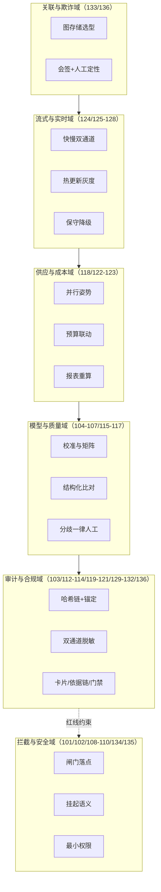
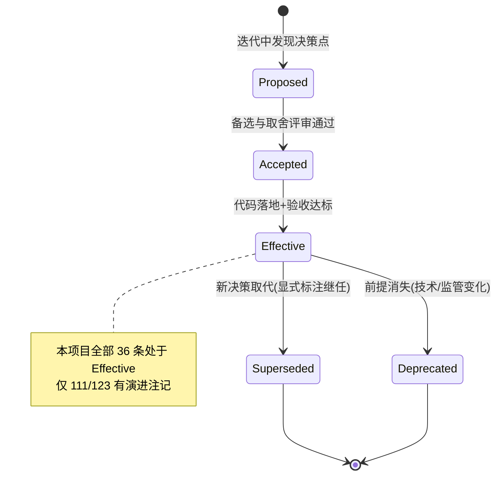
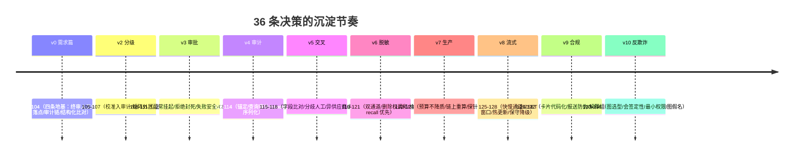

# 项目 06：金融风控 Agent 系统 — 12-ADR 架构决策记录

> **定位**：全项目 36 条架构决策（ADR-101 ~ ADR-136）的总账——每条含上下文、备选方案、取舍理由、可回滚方式；十条最有复用价值的决策给出详解。监管问询"你们为什么这么设计"、架构师复盘、新人接手，都从这一篇开始。方法论文档见 [附录 08-架构决策方法论/00-ADR架构决策记录]。
>
> **前置阅读**：00-11 全部迭代篇（本篇是对它们的提炼，不是替代——细节永远在迭代篇里）。

---

## 1. 为什么金融风控场景必须写 ADR

三个别的行业不那么强的理由，在金融场景是刚需：

1. **监管问询即决策考古**。检查组问"为什么 HITL 拦截点选在这里"、"为什么不上区块链"，答"当时团队觉得"是过不了关的——必须有当时的上下文、被否掉的备选、量化的取舍。
2. **决策的半衰期比代码长**。`HumanApprovalToolManager` 会被重写，但"拦截点必须选在被拦截行为的真实发生层"这条决策会活到下一次技术选型。不落下来，它就随人员流动蒸发。
3. **防止同一问题被反复重新决策**。没有 ADR 的团队每半年重新吵一遍"要不要文本相似度比对"——吵赢的人不知道三年前谁输过。

ADR 的最小完备结构（本项目的写法）：**上下文**（什么压力下决策）、**备选方案**（至少两个被认真考虑过的替代）、**取舍**（放弃了什么换到了什么）、**可回滚性**（推翻它的代价与信号）。只写"决定"不写"放弃"的 ADR 是宣传稿。

## 2. 决策域全景

36 条 ADR 按域归为六组，彼此的关系如下——安全与合规域是地基（监管红线），质量与数据域在服务它，运营与流式域在让它可持续：

## 3. 决策总账（ADR-101 ~ ADR-136）

| 编号 | 决策（一句话） | 出处 | 状态 |
|------|----------------|------|------|
| ADR-101 | AI 只做预审建议，终审动作必须走 HITL 工具 | 00 需求篇 | 生效 |
| ADR-102 | HITL 拦截点在 ToolCallingManager 装饰器，不在 Advisor | 00/03 | 生效 |
| ADR-103 | 审计哈希链防篡改，WORM 按 SEC 17a-4 精神留 7 年 | 00 需求篇 | 生效 |
| ADR-104 | 交叉验证用结构化结论比对而非自由文本比对 | 00/05 | 生效 |
| ADR-105 | 校准数据（分桶/因子/模型版本）必须入审计 | 02 迭代一 | 生效 |
| ADR-106 | 决策矩阵硬编码在代码里，阈值外置配置 | 02 迭代一 | 生效 |
| ADR-107 | self-check 失败只重试一次 | 02 迭代一 | 生效 |
| ADR-108 | 挂起用受控异常中断生成流 | 03 迭代二 | 生效 |
| ADR-109 | 审批拒绝后禁止 Agent 自动重试 | 03 迭代二 | 生效 |
| ADR-110 | 挂起默认失败安全（EXPIRED 退回重发起） | 03 迭代二 | 生效 |
| ADR-111 | Checkpoint 用 JDBC 文件库持久化 | 03 迭代二 | 生产换 PG（已演进） |
| ADR-112 | 哈希链+每日外部锚定，不上区块链 | 04 迭代三 | 生效 |
| ADR-113 | 审计查询本身被审计 | 04 迭代三 | 生效 |
| ADR-114 | canonical JSON（键排序）后再哈希 | 04 迭代三 | 生效 |
| ADR-115 | 比对用字段级结构化对照 | 05 迭代四 | 生效（细化 104） |
| ADR-116 | 分歧一律人工，不设权重自动仲裁 | 05 迭代四 | 生效 |
| ADR-117 | 复核模型选不同供应商 | 05 迭代四 | 生效 |
| ADR-118 | 并行用 Mono.zip + boundedElastic | 05 迭代四 | 生效 |
| ADR-119 | 双通道脱敏（Prompt 假名化/审计加密原文） | 06 迭代五 | 生效 |
| ADR-120 | 删除权=销毁映射而非删审计记录 | 06 迭代五 | 生效 |
| ADR-121 | 敏感检测 recall 优先（宁可误杀） | 06 迭代五 | 生效 |
| ADR-122 | 超预算收敛触发面+排队，不降级模型质量 | 07 迭代六 | 生效 |
| ADR-123 | 报表从审计链重算，不另存数据源 | 07 迭代六 | 生效（v9 扩展为 130） |
| ADR-124 | 探针检查业务依赖而非只 ping 端口 | 07 迭代六 | 生效 |
| ADR-125 | 确定性规则前置，LLM 只做异步旁路且无放行权 | 09 迭代七 | 生效 |
| ADR-126 | 窗口特征用 Redis ZSET 内嵌，不引 Flink | 09 迭代七 | 生效 |
| ADR-127 | 规则热更新用双缓冲原子切换+影子模式 | 09 迭代七 | 生效 |
| ADR-128 | 旁路过载降级方向为保守侧（DEFERRED） | 09 迭代七 | 生效 |
| ADR-129 | 卡片代码化（record+注册表+入链），不做 wiki | 10 迭代八 | 生效 |
| ADR-130 | 报送从审计链重算并附链证明 | 10 迭代八 | 生效（承 123） |
| ADR-131 | 解释=事件链组装，禁止 LLM 现场再生成 | 10 迭代八 | 生效 |
| ADR-132 | 合规检查点是策略激活的硬门禁 | 10 迭代八 | 生效 |
| ADR-133 | 图存储用邻接表+递归 CTE 起步，Neo4j 为演进 | 11 迭代九 | 生效 |
| ADR-134 | 团伙定性必须三 Agent 会签+人工，禁止自动定罪 | 11 迭代九 | 生效 |
| ADR-135 | 调查类工具最小权限（全部只读） | 11 迭代九 | 生效 |
| ADR-136 | 图数据全假名+边来源入链 | 11 迭代九 | 生效 |

> 状态说明：「生效」= 当前架构遵守；「已演进」= 决策被后续迭代 supersede（如 111 的 H2 文件库在生产换 PostgreSQL，决策内核"Checkpoint 持久化"不变，存储介质演进）。supersede 关系在总账里显式标注，不删除旧条目——被否决的历史也是历史。

## 4. 十条详解

以下十条是本项目最有复用价值的决策（也最适合在面试/评审里复述）。每条按上下文/备选/取舍/回滚展开。

### 4.1 ADR-102：HITL 拦截点在 ToolCallingManager 装饰器

- **上下文**：监管红线"终审必须人工"。要在"LLM 决定调用终审工具"与"工具实际执行"之间插闸门。
- **备选**：① Advisor 层拦截（环绕 ChatClient 整个调用边界）② 流程层标签（审批只是工作流状态，不强制）③ ToolCallingManager 装饰器（工具执行的真实发生层）。
- **取舍**：Advisor 拦不到"工具意图返回后、执行前"时点（工具循环发生在 ChatModel 内部）；流程标签无强制力（v2 已证明）。TCM 装饰器的代价是要实现 `resolveToolDefinitions` + `executeToolCalls(Prompt, ChatResponse)` 两个真实抽象方法并自己重建 delegate——但这是唯一稳定的拦截位置。
- **可回滚**：换成 ToolCallback 包装层（`FunctionToolCallback`/自定义 `ToolCallback` 包一层）语义等价、粒度更细；触发重评的信号是 Spring AI 工具循环机制发生大改（Advisor 能力下沉进工具层时）。

### 4.2 ADR-104/115：比对用结构化字段级对照

- **上下文**：双模型交叉验证需要判定"两份预审意见是否一致"。
- **备选**：① 文本相似度（余弦/编辑距离）② 字段级结构化对照（riskLevel/confidence/high 因子集合逐一比）。
- **取舍**：文本相似度三个全无——不可判定（0.73 算一致吗）、不可审计（分歧进不了工作台）、不可回溯（分数对不上决策依据）。结构化对照把"分歧"变成 `FieldDiff` 清单，直接渲染给审批员。代价是契约先行（PreTrialOpinion schema 是全系统的 API）。
- **可回滚**：若未来引入语义级比对需求（如理由文本矛盾检测），作为**补充信号**叠加，不替换字段级主判定。

### 4.3 ADR-112：哈希链+每日外部锚定，不上区块链

- **上下文**：审计记录要防静默篡改，且 DBA 换整条链的场景也要能发现。
- **备选**：① 普通表+权限 ② 哈希链（链内防篡改）③ 哈希链+外部锚定 ④ 联盟链/区块链。
- **取舍**：①防不住 DBA（权限在同一人手里）；②防不住整链替换；④复杂度、性能、行内合规成本全不成比例——威胁模型里没有"需要多方共识"的场景。③用每天一次的链尾哈希锚定（行内值班记录/独立系统）补上整链替换的检测面，成本几乎为零。
- **可回滚**：锚定频率与锚点位置是配置项；升级区块链的触发信号是出现跨机构共享审计的需求（那时多方共识才有意义）。

### 4.4 ADR-116：分歧一律人工，不设权重自动仲裁

- **上下文**：双模型结论冲突时，"自动裁决"能省人工。
- **备选**：① 加权投票（主模型 0.6/复核 0.4）② 置信度高者胜 ③ 一律人工。
- **取舍**：任何自动仲裁都引入新的不可解释黑盒——权重本身无法向监管解释为什么是 0.6。且风控错误代价不对称（漏放损失 >> 复核成本）。③的代价是人工量，用"分歧只在 ≥500 万段出现"控制触发面。
- **可回滚**：不可回滚到自动仲裁（合规红线），只可演进为"更聪明的人工呈现"（分歧自动聚类、相似案例引用）。
### 4.5 ADR-119：双通道脱敏

- **上下文**：同一份材料，Prompt 通道要"能分析"（假名保留指代），审计通道要"能回放"（原文保真）——两个消费方要求相反。
- **备选**：① 全脱敏（Prompt 与审计同视图）② 全原文+出域管控 ③ 按消费方分通道。
- **取舍**：①审计回放失真（假名还原受限时无法核对原始证据）；②出域即违规（LLM 供应商收到明文 PII）。③是唯一同时满足两侧的解，代价是 PseudonymVault 的复杂度（同值同假名、按申请隔离、还原留痕）。这本质是 CQRS：读模型按消费方分别物化。
- **可回滚**：若供应商侧部署（行内私有化推理）成熟，Prompt 通道可放宽——但审计通道加密策略不动。

### 4.6 ADR-122：超预算收敛触发面+排队，不降级模型质量

- **上下文**：交叉验证后高额度段成本 3.1 倍，月预算超支。
- **备选**：① 降级到廉价模型 ② 收敛触发面+排队 ③ 砍掉交叉验证。
- **取舍**：风控场景错误代价不对称——降质省下的钱远小于一笔高额度漏放损失。②通过提高交叉验证阈值（500 万→800 万）、降低 self-check 触发面、高额度排队消化超支。代价是峰值期高额度申请体验（排队等下月额度）。
- **可回滚**：档位阈值是配置；策略选择本身**不该回滚**——它是业务风险 profile 的函数，不是技术偏好。换业务场景（如营销文案生成）应得出相反答案。

### 4.7 ADR-125：确定性规则前置，LLM 只做异步旁路

- **上下文**：交易级实时决策，延迟预算 50ms，LLM 秒级。
- **备选**：① 全量 LLM（延迟不达标）② 全量规则（语义灰区盲区）③ 规则主链+LLM 旁路。
- **取舍**：③的关键细节是**旁路无放行权**——LLM 最重只能标记 REVIEW。若旁路能放行，"旁路故障=全放行"就是系统性风险。代价是灰区事件的人工复核量（用抽样与批处理消化）。
- **可回滚**：若延迟预算放宽（如反洗钱事后筛查 T+1），LLM 可回到主链；50ms 预算存在一天，这个结构就成立一天。

### 4.8 ADR-128：旁路过载降级方向为保守侧

- **上下文**：旁路队列容量有限，过载时怎么办。
- **备选**：① 丢弃旁路任务（事件放行）② 排队无限增长 ③ 显式 DEFERRED 降级。
- **取舍**：①等价于"过载时风险敞口放大"，不可接受；②内存拖垮主链路；③放弃深度判断但保留规则决策+审计标记，代价是过载期间灰区事件只享受规则保护。
- **可回滚**：容量与档位是配置；降级方向是设计不变量（与 ADR-110 失败安全同族），回滚方向只有"更保守"。

### 4.9 ADR-131：解释=事件链组装，禁止 LLM 现场再生成

- **上下文**：监管问询需要"这笔为什么拒"，而决策发生在过去。
- **备选**：① 问询时让 LLM 重新解释一遍 ② 事件链组装呈现。
- **取舍**：①会产生与当时决策不一致的第二套说法（LLM 非确定性 + Prompt/模型版本已变）——审计上等于自认"解释可以编"。②保证口径唯一：解释的每个字都能指回链上 seq/hash。代价是解释的表现力受限于入链信息的丰富度（所以 v1 起就要求 summaryReason 与证据字段入链）。
- **可回滚**：不可回滚到现场生成；可演进的是呈现层（链上事实之上做可视化，不做语义再创造）。

### 4.10 ADR-134：团伙定性必须三 Agent 会签+人工

- **上下文**：候选团伙需要定性，定性动作（进黑名单）不可逆且影响一群人。
- **备选**：① 单 Agent 结论直采 ② 多数投票自动定性 ③ 三视角会签+人工定性。
- **取舍**：①视角单一（v5 教训）；②投票会被同源数据污染欺骗（三 Agent 消费同一份被污染的图数据时会一起错，"多数"没有意义）；③把三个正交视角（图/行为/情报）与分歧清单呈现给人，定性权在人。代价是每案人工投入。
- **可回滚**：不可回滚到自动定性；可演进的是视角数量与工具丰富度。

## 5. ADR 生命周期

纪律：**新 ADR 只能取代旧 ADR，不能静默违反**。违反生效 ADR 的代码合并请求应被评审拦下（本项目的 CI 检查清单引用 ADR 编号，如"TCM 装饰器签名变更需核对 ADR-102"）。

## 6. 决策与迭代的时间线

节奏规律：**每个迭代的 ADR 都在回答上一迭代暴露的痛点**——决策不是设计出来的，是被痛点逼出来的（这也是各迭代篇"四问"表存在的意义）。

## 7. 使用规范与自检清单

**写新 ADR 的时机**：① 在两个以上合理方案间做了选择 ② 选择会约束后续多个模块 ③ 六个月后没人能记起为什么。三条满足两条就该写。

- [ ] 有上下文（什么压力/什么约束下决策）
- [ ] 至少两个被认真考虑的备选（稻草人备选不算）
- [ ] 写清楚了放弃了什么（只写收益的是宣传稿）
- [ ] 有可回滚性（推翻代价+触发重评的信号）
- [ ] 标注出处迭代与状态；取代旧决策时显式 supersede
- [ ] 关键 ADR 在代码评审清单中有对应引用（如 ADR-102/119/125）

## 8. 总结

| 概念 | 一句话 |
|------|--------|
| 总账 | 36 条（101-136），六决策域，全部含出处与状态 |
| 详解 | 十条最具复用价值：102/104/112/116/119/122/125/128/131/134 |
| 生命周期 | Proposed→Accepted→Effective→Superseded/Deprecated，只取代不静默违反 |
| 最大公约数 | 失败安全（110/128）、定性权在人（101/116/134）、口径唯一（113/131）、按消费方分视图（119） |

→ [13-工业前沿与演进方向.md](13-工业前沿与演进方向.md)

**下一篇**：13-工业前沿与演进方向。
