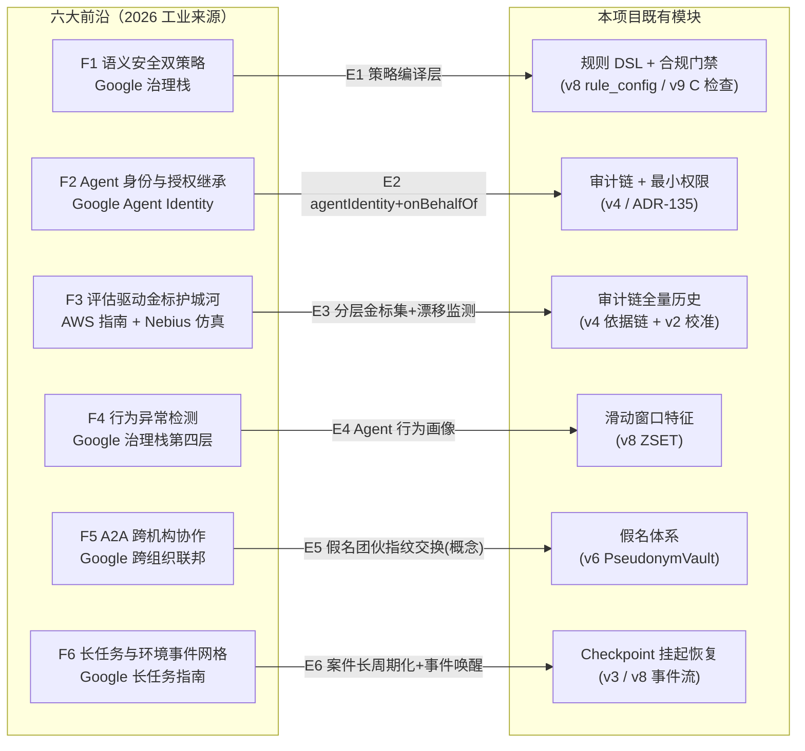
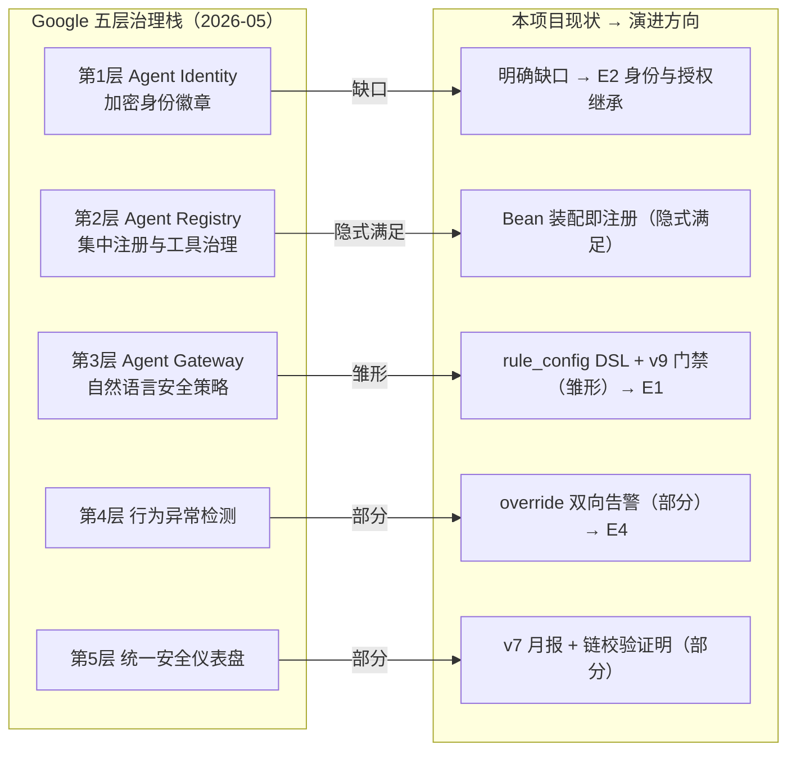
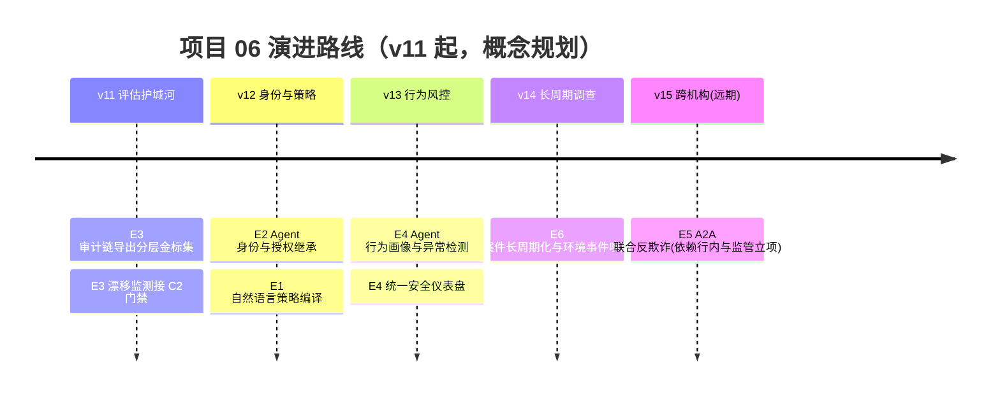

# 项目 06：金融风控 Agent 系统 — 13-工业前沿与演进方向（收官）

> **定位**：收官篇——以 2026 年三份真实工业来源（Google 五指南 / AWS 评估驱动指南 / Nebius Agents Blueprint）为坐标，把金融风控 Agent 的六大前沿（语义安全双策略、Agent 身份与授权继承、评估驱动、行为异常检测、A2A 跨机构协作、长任务与环境事件网格）映射到本项目的演进路线。**本文无代码，全部是架构判断。**
>
> **前置阅读**：00-12 全部（本篇是对整个项目的收口，先有体系再谈前沿）。

---

## 1. 三份真实来源

**来源一：Google Cloud《Five guides to building and scaling production-ready AI agents》**（Addy Osmani、Shubham Saboo，2026-05-05，[链接](https://cloud.google.com/blog/topics/developers-practitioners/five-guides-to-building-and-scaling-production-ready-ai-agents)）。五部分系列，与本项目直接相关的三个论点：

1. **长任务设计模式**：Agent 运行时可维持最长 7 天的状态；checkpoint-and-resume 从故障恢复而不从头重跑；**委托审批工作流在暂停等待人工期间消耗零算力**——这正是本项目 v3 "挂起=持久化+终止当前流+事件驱动恢复"的工业化表述。
2. **五层治理栈**：Agent Identity（每个 Agent 一枚加密身份徽章）→ Agent Registry（集中注册与工具治理）→ Agent Gateway（**用自然语言安全策略**在入口统一执行）→ 行为异常检测 → 统一安全仪表盘。
3. **A2A 与 MCP 协同**：Agent Cards 发布能力供协调者发现；跨组织联邦让不同机构的 Agent 安全协作；**环境事件网格**让 Agent 持续响应后台事件而非等待请求。

**来源二：亚马逊云科技《企业生产级智能体开发部署指南》**（2026 中国峰会发布，储瑞松主旨，2026-07-08，[链接](https://cloud.it168.com/a2026/0708/6939/000006939041.shtml)）。核心论点：**评估必须成为一切工程实践的起点**。六步开发生命周期（定标准、开发实现、效果评估、灰度上线、持续监控、改进循环）；八类评估维度；覆盖底层大模型/中间核心组件/最终业务结果的三层指标库。最锋利的一句：**"底层技术平台可以通过采购获得，但评估标准必须由企业自主掌控——企业的核心竞争壁垒在于其自有的黄金数据集和评分标准。"**

**来源三：Nebius《Introducing the Nebius Agents Blueprint》**（Devang Sachdev，2026-06-10，[链接](https://nebius.com/blog/posts/introducing-the-nebius-agents-blueprint)）。六组件可组合栈（推理/编排/可观测/知识/接地/仿真）。两个论点：**"Agent 失败是系统失败"**（模型忠实推理，错的是给它的系统——检索错、编排错、评估缺位）；**系统改进的收益跑赢模型升级**——其合规审计 Agent 案例通过改进检索/编排/接地/评估（而非换模型）实现成本降 72%、精度升 20%。

三份来源合起来的元判断，恰好是本项目十个迭代的注脚：**风控 Agent 的竞争力不在模型，在系统**——校准（v2）、闸门（v3）、审计（v4）、交叉验证（v5）、脱敏（v6）、预算（v7）、双通道（v8）、门禁与金标（v9）、会签（v10）全是系统层改进，每一步的收益都不依赖等一个更强的模型。

### 1.1 本节核对（三来源）

- [ ] 三份来源的标题/作者/日期/链接四要素齐全（外部引用规范）
- [ ] 元判断"竞争力不在模型，在系统"能在 v2-v10 各迭代找到对应系统层改进例证（抽三条）

## 2. 六大前沿与本项目的映射

### F1 语义安全双策略（IAM + 自然语言检查）

- **前沿是什么**：Google 治理栈第三层的 Agent Gateway 把安全策略写成自然语言（"调查类 Agent 只能读取近 90 天的脱敏数据"），入口处统一编译执行——传统的 IAM（角色/资源/动作三元组）之上叠加一层**语义可读的策略**，安全团队用业务语言写策略，网关负责落地。
- **本项目现状**：权限是代码形态——`DANGEROUS_TOOLS` 白名单（v3）、调查工具全只读（ADR-135）、矩阵阈值外置（ADR-106）。能审计，但策略表达停留在"枚举工具名"。
- **映射演进（E1）**：把 v8 的规则 DSL（predicate/threshold/action）升级为**自然语言策略编译层**——合规员用自然语言描述策略，编译成规则配置（经 v9 合规门禁激活）。本项目的 `rule_config` 表已经是这个编译器的目标码。

### F2 Agent 身份与授权继承（员工权限继承模式）

- **前沿是什么**：Google 治理栈第一层给每个 Agent 独立的加密身份徽章。企业场景的关键细节是**授权继承**：Agent 以"代行某员工"的身份运行，继承该员工权限的子集，所有动作可归因到人。
- **本项目现状**：审批员/调查员身份存在于流程（审批单的 approver 字段），但 Agent 自身无身份——审计事件里分不清"这个工具调用是系统定时任务还是张调查员发起的调查"。
- **映射演进（E2）**：审计事件增加 `agentIdentity`（哪个 Agent）与 `onBehalfOf`（代行谁）双字段；调查 Agent 继承发起调查员的只读权限子集，权限随会话结束回收。这与 ADR-135（最小权限）和 ADR-113（查询审计）自然衔接。

### F3 评估驱动：金标集是护城河

- **前沿是什么**：AWS 指南把评估置于工程起点，断言金标数据集与评分标准是企业核心壁垒；Nebius 的仿真组件（Snowglobe）在部署前跑数百个模拟任务，**同一次运行同时产出评估数据集与 QA 回归套件**。
- **本项目现状**：金标回归已进合规门禁 C2（v9），但金标集只有 500 份校准样本（v2），且是"历史终审一致率"单一评分维度。
- **映射演进（E3）**：本项目有个别人没有的原料——**v4 审计链就是全量标注数据**（每笔决策带完整依据链与人工终审结果）。把审计链批量导出为分层金标集（预审一致性 / 流式裁决准确性 / 团伙归因召回三类），加漂移监测（分数下滑触发 C2 门禁自动收紧）。评估标准自主掌控 = 别人换模型你换阈值，你比市场快一个身位。

### F4 行为异常检测：把风控反身应用到 Agent 自己

- **前沿是什么**：Google 治理栈第四层对 Agent 行为做异常检测，第五层统一安全仪表盘呈现整体风险——治理 Agent 的方法论与治理交易的方法论趋同。
- **本项目现状**：对"业务行为"的异常检测已两代（v2 校准矩阵、v8 窗口特征）；对"Agent 自己的行为"只有 override rate 双向告警（v7）。
- **映射演进（E4）**：用 v8 的滑动窗口特征技术给 Agent 建行为画像——调用频率、工具选择分布、单次调查耗时分布、token 消耗曲线。异常形态举例：某调查 Agent 突然高频调用 `search_intel`（可能在被注入利用后探测黑名单）；预审 Agent 的工具拒绝率骤降（闸门可能被绕过）。**已有组件的重新组合，零新概念**。

### F5 A2A 跨机构协作：联合反欺诈

- **前沿是什么**：Google 第四指南的跨组织联邦——不同机构的 Agent 通过 Agent Cards 互相发现能力，在受控前提（协议、授权、数据边界）下协作共享任务。
- **本项目现状**：团伙图谱（v10）只有行内数据；跨机构作案（在 A 行骗完到 B 行）天然看不见。
- **映射演进（E5，概念演进）**：同业反欺诈联盟的 Agent 间线索交换——交换的不是原始数据（合规不允许），是**假名化团伙指纹**（设备指纹哈希/资金模式特征，呼应 v6 假名体系）。前提有三：A2A 类协议承载（跨机构能力发现与授权）、隐私计算/可信执行环境（保证"可计算不可见"）、行内与监管的联合立项。**这是演进方向，不是本项目的落地项**——单行内闭环（00-11）仍然成立。

### F6 长任务与环境事件网格

- **前沿是什么**：Google 长任务指南的 7 天状态维持与 ambient event meshes——Agent 不再只被动响应请求，而是持续订阅环境事件（新证据到达自动唤醒）。
- **本项目现状**：v3 审批 Checkpoint 已实现跨天挂起恢复；v8 事件流是"事件驱动决策"但 Agent 侧仍是单次调用。
- **映射演进（E6）**：调查案件（GangCase）长周期化——一个团伙案件调查数周，期间新事件（同设备新申请、同账号新交易）到达时自动唤醒案件补充证据、更新会签报告；唤醒动作入审计链。挂起零算力（来源一）与本项目的"挂起=终止当前流+事件驱动恢复"完全同构。
### 2.1 本节核对（六大前沿映射）

- [ ] 不看正文能说出 F1-F6 各自的"本项目现状"与"演进项编号 E1-E6"的配对
- [ ] 每条演进项（E1-E6）都能指到既有模块（rule_config / 审计链 / ZSET / PseudonymVault / Checkpoint）——六条无一条推翻既有架构

## 3. 前沿到模块的映射全景

### 3.1 治理栈逐层对照

把 F1/F2/F4 涉及的 Google 五层治理栈逐层对照本项目——三层有雏形或部分覆盖，一层隐式满足，一层是明确缺口：

对照结论：本项目离治理栈最近的路径不是补五个新系统，而是**把已隐式存在的东西显式化**——注册（Bean→登记表）、策略（DSL→自然语言编译）、画像（交易特征→Agent 行为特征）。
映射的共同点：**六条演进没有一条需要推翻既有架构**——全部是在 v2-v10 已落地模块上的叠加与重组。这不是巧合：本项目每个迭代都选了"失败安全、可审计、按消费方分视图"这类与前沿方向兼容的骨架决策（见 12-ADR §4 的"最大公约数"）。

### 3.1 本节核对（治理栈对照与映射全景）

- [ ] 两张图的 F-N/E 连线与 §2 六小节的映射一一对应（F1→N1、F2→N2……F6→N6），无错位
- [ ] 五层治理栈对照中"明确缺口/隐式满足/雏形/部分"四档判定能对照正文说出理由（如 L2 为何算隐式满足）

## 4. 演进路线与优先级

| 优先级 | 演进项 | 理由 | 依赖 |
|--------|--------|------|------|
| P0 | E3 金标集 | AWS 判断的"核心竞争壁垒"；原料（审计链）已在手，边际成本最低 | 无新组件 |
| P0 | E2 Agent 身份 | 审计可归因性的缺口，改造成本小（事件加双字段） | 无新组件 |
| P1 | E4 行为异常检测 | 复用 v8 特征技术，组合创新 | E2（身份先有，画像才有主键） |
| P1 | E1 策略编译层 | rule_config 是现成目标码；自然语言编译需评估 | v9 门禁已有 |
| P2 | E6 长周期调查 | 产品形态升级，工程量在案件状态机 | v10 案件体系 |
| P2 | E5 跨机构协作 | 外部依赖（协议/监管/同业）最重，单行内闭环不受影响 | A2A 类协议 + 隐私计算 + 立项 |

### 4.1 本节核对（演进优先级）

- [ ] timeline 五段（v11-v15）与优先级表的六行（E1-E6）一一对应，无遗漏
- [ ] P0 两条（E3/E2）的"理由+依赖"两列能复述（金标壁垒 / 审计可归因，均无新组件）

## 5. 收官：项目 06 的完整弧线

十四篇文档走完，这个强监管场景的完整弧线是：

**可用（v1 结构化预审）→ 可信（v2 校准分级）→ 可控（v3 HITL 闸门）→ 可证（v4 审计回放）→ 可靠（v5 交叉验证）→ 合规（v6 双通道脱敏）→ 可运营（v7 成本与部署）→ 实时（v8 快慢双通道）→ 可解释（v9 卡片与依据链）→ 协同（v10 多 Agent 会签）→ 决策考古（12-ADR 总账）→ 前沿接续（本篇）**。

检验你从项目 06 带走的标准：

1. 能独立复述 **ADR-102**（拦截点选在真实发生层）与 **ADR-122**（预算策略与业务风险 profile 匹配）的备选方案——前者是 Spring AI 架构知识，后者是架构判断力。
2. 能对一个陌生的强监管业务（保险核保/信贷催收/证券适当性）画出"决策矩阵 + HITL 闸门 + 审计链 + 合规门禁"的最小骨架——四个组件的引入顺序不能错（v2→v3→v4→v9 的依赖关系就是顺序）。
3. 能回答 2026 年的面试题："金融风控 Agent 的竞争壁垒是什么？"——**不是模型，是系统：校准过的置信度、强制的人工闸门、不可篡改的依据链、自主掌控的金标集**（三份来源与本项目十个迭代给出同一个答案）。

**项目 06 到此收官。** 教程线继续：管控分离（教程 20）、微服务拆分（教程 21）、Agent 治理与合规框架（教程 43）、多模型协作（教程 44）是本项目触及但不展开的主线知识。

### 5.1 本节核对（收官检验）

- [ ] 三条检验标准（复述 ADR-102/122、画最小骨架、答竞争壁垒题）能独立通过——特别是骨架四组件引入顺序（矩阵→闸门→审计链→门禁）不能错
- [ ] 十二段弧线的形容词序列与本篇 §6 总结"弧线"行一致

## 6. 总结

> 本节核对（一句话）：五行总结与 §1/§2/§3/§4/§5 一一对应即 PASS。

| 概念 | 一句话 |
|------|--------|
| 三来源 | Google 五指南（治理栈/长任务/A2A）、AWS 评估驱动（金标壁垒）、Nebius Blueprint（系统失败论） |
| 六前沿 | 语义安全双策略 / 身份与授权继承 / 评估驱动 / 行为异常检测 / A2A 联合反欺诈 / 长任务事件网格 |
| 映射 | 六条演进全部叠加在既有模块上——骨架决策兼容前沿，无需推翻 |
| 优先级 | E3 金标与 E2 身份是 P0（成本低、补缺口）；E5 跨机构是 P2（外部依赖最重） |
| 弧线 | 可用→可信→可控→可证→可靠→合规→可运营→实时→可解释→协同→决策考古→前沿接续 |

> **项目 06 收官**：基础九篇（00-08）+ 进阶五篇（09-13）到此完整——从风控分级到实时流式、监管合规、反欺诈协同，形成可落地的金融风控 Agent 体系。独立项目，无后续依赖。
