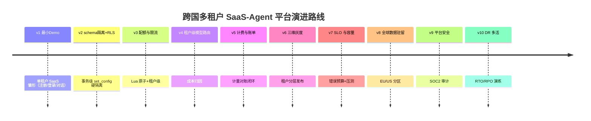
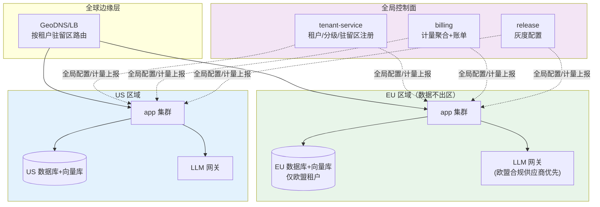

# 项目 07：跨国多租户 SaaS Agent 平台 — 00-需求分析与架构设计

> **定位**：面向外部客户的 SaaS Agent 平台——从单租户雏形到**schema 隔离 + 事务级 RLS** 硬隔离、分级配额、计费归因、三维灰度、全球数据驻留、多活容灾的完整演进。项目 07 是**完整独立**的项目，不依赖也不引用其他项目。
>
> 「遇到阻塞？→ [教程 26-多租户隔离与资源治理 全篇]、[教程 29-灰度发布与版本管理]、[教程 33-部署与运维 §多区域]、[教程 27-成本治理与Token计量]」
>
> **API 真实性**：本项目的全部代码以 [附录 05-SpringAI2-API基准] 为准——`ChatClient`/`@Tool`/`CallAdvisor`/`ChatMemory` 均为 Spring AI 2.0.0 真实签名，可照抄编译。

---

## 1. 业务场景

### 1.1 背景

一家企业软件公司要把内部沉淀的客服/知识 Agent 能力产品化，输出为 SaaS：**租户（企业客户）开箱即用的 Agent 工作台**。已签下首批意向客户：欧洲两家（合规要求：数据不出欧盟）、北美三家、亚太若干。

### 1.2 SaaS 与自建的核心差异（一切设计的来源）

| 维度 | 企业自建（对比参照） | SaaS |
|------|--------------------|------|
| 信任边界 | 同一集团内部 | **租户互为不可信方**——隔离是安全边界不是管理边界 |
| 计费 | 成本归因即可 | **计费是营收**——计量的正确性=财务的正确性 |
| 恶意租户 | 不存在 | 存在刷量、探测其他租户数据、滥用工具的动机 |
| 合规主体 | 一个 | 数据驻留按租户所在法域变化 |
| 变更发布 | 自己担风险 | 租户信任是资产，灰度分级发布是义务 |

### 1.3 租户分级模型（商业设计驱动架构设计）

| 级别 | 月费 | 配额 | 特性 |
|------|------|------|------|
| Free | 0 | 1k tokens/天, 1 个 Agent, 无自定义工具 | 引流 |
| Pro | $299 | 100k tokens/天, 5 个 Agent, 标准工具集 | 主力 |
| Enterprise | 定制 | 定制 + SLA + 专属模型路由 + 数据驻留选项 | 高价值 |

### 1.4 非目标

- 不做 Marketplace（第三方工具市场是后续路线图）
- 不做私有化部署版本（Enterprise 驻留选项已覆盖主要诉求）
- 不做多模型供应商管理细节（[教程 39] 已覆盖，本项目按抽象接口引用）

## 2. 演进路线



**顺序理由**：隔离是 SaaS 的地基（v2 在功能扩展前完成）；配额在计费前（v3→v5：先有可靠的量控再有账单）；灰度在客户规模上来前（v6：前 10 个租户时全量发布可接受，50 个后不行）；驻留最后（v8：等 Enterprise 客户真的签约再建设，避免过度工程）。

## 3. 目标架构（v10 终态）



## 4. 关键 ADR（预录）

| # | 决策 | 理由 |
|---|------|------|
| ADR-201 | 池化多租户：**schema-per-tenant（业务数据）+ 事务级 RLS（强制）**，不做库级独享 | 千级租户时库级独享运维爆炸；schema 隔离提供强数据边界，RLS 兜底"漏写 where 也安全"；Enterprise 驻留诉求用"区域分区"而非"独立库"满足 |
| ADR-202 | 计量三副本（网关计数/配额流水/账单聚合）互相对账 | 计费正确性靠冗余与对账，不靠单点精度 |
| ADR-203 | 灰度按"租户"为原子单位，不做租户内分流 | 同一企业内员工看到不同版本 Agent 会引发支持工单 |
| ADR-204 | 驻留区路由在边缘层完成，应用层对区域无感知 | 驻留是路由问题不是代码问题——代码若感知区域则每个功能都要写分支 |

## 5. 工程骨架（完整可手写）

### 5.1 `pom.xml`（平台基础依赖）

```xml
<?xml version="1.0" encoding="UTF-8"?>
<project xmlns="http://maven.apache.org/POM/4.0.0"
         xmlns:xsi="http://www.w3.org/2001/XMLSchema-instance"
         xsi:schemaLocation="http://maven.apache.org/POM/4.0.0 https://maven.apache.org/xsd/maven-4.0.0.xsd">
    <modelVersion>4.0.0</modelVersion>
    <parent>
        <groupId>org.springframework.boot</groupId>
        <artifactId>spring-boot-starter-parent</artifactId>
        <version>4.1.0</version>
        <relativePath/>
    </parent>
    <groupId>com.acme</groupId>
    <artifactId>saas-agent-platform</artifactId>
    <version>1.0.0</version>
    <name>saas-agent-platform</name>

    <properties>
        <java.version>21</java.version>
    </properties>

    <dependencyManagement>
        <dependencies>
            <dependency>
                <groupId>org.springframework.ai</groupId>
                <artifactId>spring-ai-bom</artifactId>
                <version>2.0.0</version>
                <type>pom</type>
                <scope>import</scope>
            </dependency>
        </dependencies>
    </dependencyManagement>

    <dependencies>
        <!-- WebFlux（非 MVC，WebFlux 铁律：禁 ThreadLocal 传请求上下文、EventLoop 上禁 block） -->
        <dependency>
            <groupId>org.springframework.boot</groupId>
            <artifactId>spring-boot-starter-webflux</artifactId>
        </dependency>

        <!-- Spring AI 2.0：OpenAI 协议模型（含 DeepSeek 兼容） -->
        <dependency>
            <groupId>org.springframework.ai</groupId>
            <artifactId>spring-ai-starter-model-openai</artifactId>
        </dependency>

        <!-- 数据访问（v1 即引入：注册/登录要落库） -->
        <dependency>
            <groupId>org.springframework.boot</groupId>
            <artifactId>spring-boot-starter-data-r2dbc</artifactId>
        </dependency>
        <dependency>
            <groupId>org.postgresql</groupId>
            <artifactId>r2dbc-postgresql</artifactId>
        </dependency>
        <dependency>
            <groupId>org.flywaydb</groupId>
            <artifactId>flyway-core</artifactId>
        </dependency>
        <dependency>
            <groupId>org.flywaydb</groupId>
            <artifactId>flyway-database-postgresql</artifactId>
        </dependency>

        <!-- JWT（需在 pom.xml 中添加依赖） -->
        <dependency>
            <groupId>io.jsonwebtoken</groupId>
            <artifactId>jjwt-api</artifactId>
            <version>0.12.6</version>
        </dependency>
        <dependency>
            <groupId>io.jsonwebtoken</groupId>
            <artifactId>jjwt-impl</artifactId>
            <version>0.12.6</version>
            <scope>runtime</scope>
        </dependency>
        <dependency>
            <groupId>io.jsonwebtoken</groupId>
            <artifactId>jjwt-jackson</artifactId>
            <version>0.12.6</version>
            <scope>runtime</scope>
        </dependency>

        <dependency>
            <groupId>org.projectlombok</groupId>
            <artifactId>lombok</artifactId>
            <optional>true</optional>
        </dependency>
        <dependency>
            <groupId>org.springframework.boot</groupId>
            <artifactId>spring-boot-starter-test</artifactId>
            <scope>test</scope>
        </dependency>
    </dependencies>
</project>
```

> 各迭代新增依赖时均标注「需在 pom.xml 中添加依赖」并给出完整 `<dependency>` 片段（如 v3 的 Redis、v7 的 K8s 指标、v9 的 KMS SDK）。

### 5.2 入口 `SaasAgentApplication.java`

```java
package com.acme.saas;

import org.springframework.boot.SpringApplication;
import org.springframework.boot.autoconfigure.SpringBootApplication;

@SpringBootApplication
public class SaasAgentApplication {

    public static void main(String[] args) {
        SpringApplication.run(SaasAgentApplication.class, args);
    }
}
```

### 5.3 `application.yml`（基础）

```yaml
spring:
  application:
    name: saas-agent-platform
  ai:
    openai:
      base-url: https://api.deepseek.com          # DeepSeek 兼容 OpenAI 协议
      api-key: ${DEEPSEEK_API_KEY}                # 环境变量，不落明文
      chat:
        options:
          model: deepseek-chat
  r2dbc:
    url: r2dbc:postgresql://${DB_HOST:localhost}:5432/saas
    username: ${DB_USER:saas}
    password: ${DB_PASSWORD:change-me}
  flyway:
    enabled: true
server:
  port: 8080
```

## 6. 下一步

→ [01-最小Demo搭建.md](01-最小Demo搭建.md) — 单租户雏形：注册、对话、最简 Agent。

---

## 7. 代码使用说明（照抄前必读）

本项目的代码遵循「项目文档不生成 .java 文件、代码由用户手写」的规范，因此：

1. **框架 API 全部真实**：Spring AI 2.0.0 的 `ChatClient`/`@Tool`/`CallAdvisor`/`ChatMemory` 等均按 [附录 05-SpringAI2-API基准] 的真实签名书写，可照抄编译；标注「⚠ 修正」处为审计后对齐的基准写法。
2. **本文档体系为"完整可手写"**：每篇代码块是**完整 Java 类**（含全部 import，无 `...` 省略）、完整 pom.xml 依赖块、完整 application.yml、SQL DDL。自定义业务类（`TenantRlsBinder`、`QuotaService`、`TenantKeyVault` 等）给出全部方法体，你需要做的是**手抄到 IDE 里编译运行**，而非脑补实现。
3. **依赖标注**：凡引入 pom.xml 未声明的新依赖，均标注「需在 pom.xml 中添加依赖」并给出完整 `<dependency>` 片段。
4. **WebFlux 一致性**：所有代码遵循响应式铁律（Reactor Context 传请求上下文、禁 ThreadLocal、EventLoop 上禁 block、Redis 用 ReactiveRedisTemplate）。
5. **演进式阅读**：每个迭代篇都从"上一版痛点"出发，回答"新增需求→影响模块→架构演进"四问，请按 `00 → 01 → 02 → ...` 顺序阅读，不要跳读最终版。

## 8. 总结

| 设计主线 | 一句话 |
|---------|--------|
| 隔离 | schema-per-tenant + 事务级 RLS（漏写 where 也安全） |
| 限量 | 预扣+修正的 Lua 原子配额 + 并发会话双限量 |
| 计费 | append-only 事件流水三副本对账，监控数据与财务数据分轨 |
| 发布 | 灰度原子=租户，指标门禁 + 自动回滚 |
| 主权 | 内容数据绝不跨区，全局服务最小化（仅三个无内容服务） |
| 生存 | 同法域内两级容灾，RTO/RPO 分级承诺 + 演练制度化 |
