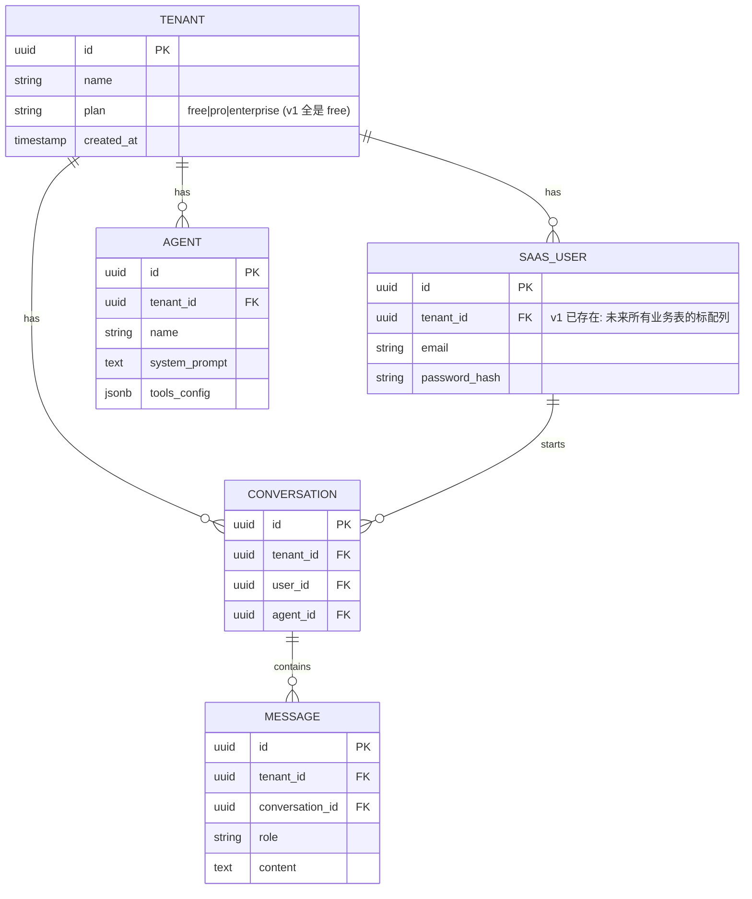

# 项目 07：跨国多租户 SaaS Agent 平台 — 01-最小 Demo 搭建

> **定位**：单租户 SaaS 雏形——租户注册、成员登录、单 Agent 对话。**刻意只支持一个租户**——多租户隔离在下一迭代以"真实痛点驱动"的方式引入，避免一上来就过度设计。本文给出**完整可手写代码**（一行不省略）。
>
> 「遇到阻塞？→ [教程 00-基础与核心/01-Spring-AI框架入门]、[教程 00-基础与核心/02-ChatClient与对话模型]、[教程 02-SpringAI核心机制/00-SSE流式通信]；API 真实性以 [附录 05-SpringAI2-API基准] 为准」

---

## 1. 四问

| 问 | 答 |
|----|----|
| **新增了什么需求** | 一个最小可运行的 SaaS 雏形：租户注册、成员登录（JWT）、SSE 流式对话 |
| **影响了哪些模块** | 全部（这是地基，无历史包袱） |
| **架构如何演进** | 单体：WebFilter（租户上下文）→ Controller → ChatClient；数据落 PostgreSQL（R2DBC） |
| **上一版痛点是什么** | 无（v0 是起点，痛点是**将要暴露的**） |

## 2. 最小 Demo 边界

三件事：租户注册（表单写入 tenant 表）、成员登录（JWT）、对话（SSE 流式）。不做配额、不做多 Agent、不做计费——这些属于"第二个租户出现后才会疼"的问题，本篇不预支复杂度。

**本迭代明确不做**：多租户隔离（v2）、配额限流（v3）、模型路由（v4）、计费（v5）。

### 2.1 本节核对（最小 Demo 边界）

- [ ] 四问的"架构演进"答案（WebFilter → Controller → ChatClient + R2DBC）与 §4 实际结构一致
- [ ] 边界三件事（注册/登录/对话）与四个"明确不做"清单能复述——抄代码时不得预支 v2-v5 的复杂度

## 3. 数据模型（为多租户预留的伏笔）



**v1 的关键伏笔**：所有业务表已经带 `tenant_id` 列——即使 v1 只有一个租户，schema 从第一天就是多租户形态。这是"为演进预留接缝"的最小成本做法：加列是伏笔，加隔离逻辑是 v2 的事。

### 3.1 `db/migrations/V1__init.sql`

```sql
-- v1：单租户，全部表在 public schema。v2 把业务表迁入每租户 schema + 事务级 RLS
CREATE EXTENSION IF NOT EXISTS pgcrypto;   -- gen_random_uuid()

CREATE TABLE tenant (
    id          UUID PRIMARY KEY DEFAULT gen_random_uuid(),
    name        TEXT NOT NULL,
    plan        TEXT NOT NULL DEFAULT 'FREE',     -- FREE | PRO | ENTERPRISE
    created_at  TIMESTAMPTZ NOT NULL DEFAULT now()
);

CREATE TABLE saas_user (
    id            UUID PRIMARY KEY DEFAULT gen_random_uuid(),
    tenant_id     UUID NOT NULL REFERENCES tenant(id),
    email         TEXT NOT NULL,
    password_hash TEXT NOT NULL,
    created_at    TIMESTAMPTZ NOT NULL DEFAULT now(),
    UNIQUE (email)
);

CREATE TABLE agent (
    id            UUID PRIMARY KEY DEFAULT gen_random_uuid(),
    tenant_id     UUID NOT NULL REFERENCES tenant(id),
    name          TEXT NOT NULL,
    system_prompt TEXT NOT NULL,
    tools_config  JSONB NOT NULL DEFAULT '{}',
    created_at    TIMESTAMPTZ NOT NULL DEFAULT now()
);

CREATE TABLE conversation (
    id         UUID PRIMARY KEY DEFAULT gen_random_uuid(),
    tenant_id  UUID NOT NULL REFERENCES tenant(id),
    user_id    UUID NOT NULL REFERENCES saas_user(id),
    agent_id   UUID REFERENCES agent(id),
    created_at TIMESTAMPTZ NOT NULL DEFAULT now()
);

CREATE TABLE message (
    id              UUID PRIMARY KEY DEFAULT gen_random_uuid(),
    tenant_id       UUID NOT NULL REFERENCES tenant(id),
    conversation_id UUID NOT NULL REFERENCES conversation(id),
    role            TEXT NOT NULL,               -- user | assistant | tool
    content         TEXT NOT NULL,
    created_at      TIMESTAMPTZ NOT NULL DEFAULT now()
);

CREATE INDEX idx_message_conversation ON message (conversation_id, created_at);
```

### 3.2 本节测试与验证（建表与多租户伏笔）

**前置条件**：PG 实例可连；`V1__init.sql` 已放入 `db/migrations/`；R2DBC/Flyway 配置就绪。

**材料——表结构核对 SQL**：

```sql
-- ① 业务表清单（v1 全部在 public schema）
SELECT table_name FROM information_schema.tables
WHERE table_schema = 'public' ORDER BY table_name;
-- ② tenant_id 伏笔核对：四张业务表都应有该列
SELECT table_name, column_name FROM information_schema.columns
WHERE table_schema = 'public' AND column_name = 'tenant_id';
-- ③ 索引核对
SELECT indexname FROM pg_indexes WHERE tablename = 'message';
```

**步骤与断言**：

| # | 操作 | 预期（PASS 判据） |
|---|------|------------------|
| 1 | 启动应用（触发 Flyway） | 日志出现 `V1__init.sql` 迁移成功，无报错 |
| 2 | 材料① | 返回 tenant / saas_user / agent / conversation / message 五表（外加 flyway_schema_history） |
| 3 | 材料② | saas_user / agent / conversation / message 四行（tenant 表自身除外） |
| 4 | 材料③ | `idx_message_conversation` 存在 |

**失败排查**：①迁移未执行→`spring.flyway.enabled` 未开或路径不对；②缺 tenant_id→SQL 抄漏列；③`gen_random_uuid()` 不存在→`CREATE EXTENSION pgcrypto` 未执行。

## 4. 完整代码（照抄即可，一行不省略）

### 4.1 `pom.xml`（完整基础依赖）

```xml
<?xml version="1.0" encoding="UTF-8"?>
<project xmlns="http://maven.apache.org/POM/4.0.0"
         xmlns:xsi="http://www.w3.org/2001/XMLSchema-instance"
         xsi:schemaLocation="http://maven.apache.org/POM/4.0.0 https://maven.apache.org/xsd/maven-4.0.0.xsd">
    <modelVersion>4.0.0</modelVersion>
    <parent>
        <groupId>org.springframework.boot</groupId>
        <artifactId>spring-boot-starter-parent</artifactId>
        <version>4.1.0</version>
        <relativePath/>
    </parent>
    <groupId>com.acme</groupId>
    <artifactId>saas-agent-platform</artifactId>
    <version>1.0.0</version>
    <name>saas-agent-platform</name>

    <properties>
        <java.version>21</java.version>
    </properties>

    <dependencyManagement>
        <dependencies>
            <dependency>
                <groupId>org.springframework.ai</groupId>
                <artifactId>spring-ai-bom</artifactId>
                <version>2.0.0</version>
                <type>pom</type>
                <scope>import</scope>
            </dependency>
        </dependencies>
    </dependencyManagement>

    <dependencies>
        <!-- WebFlux（非 MVC，WebFlux 铁律） -->
        <dependency>
            <groupId>org.springframework.boot</groupId>
            <artifactId>spring-boot-starter-webflux</artifactId>
        </dependency>
        <!-- Spring AI 2.0：OpenAI 协议模型（含 DeepSeek 兼容） -->
        <dependency>
            <groupId>org.springframework.ai</groupId>
            <artifactId>spring-ai-starter-model-openai</artifactId>
        </dependency>
        <!-- 数据访问（R2DBC + PostgreSQL + Flyway） -->
        <dependency>
            <groupId>org.springframework.boot</groupId>
            <artifactId>spring-boot-starter-data-r2dbc</artifactId>
        </dependency>
        <dependency>
            <groupId>org.postgresql</groupId>
            <artifactId>r2dbc-postgresql</artifactId>
        </dependency>
        <dependency>
            <groupId>org.flywaydb</groupId>
            <artifactId>flyway-core</artifactId>
        </dependency>
        <dependency>
            <groupId>org.flywaydb</groupId>
            <artifactId>flyway-database-postgresql</artifactId>
        </dependency>
        <!-- JWT（需在 pom.xml 中添加依赖） -->
        <dependency>
            <groupId>io.jsonwebtoken</groupId>
            <artifactId>jjwt-api</artifactId>
            <version>0.12.6</version>
        </dependency>
        <dependency>
            <groupId>io.jsonwebtoken</groupId>
            <artifactId>jjwt-impl</artifactId>
            <version>0.12.6</version>
            <scope>runtime</scope>
        </dependency>
        <dependency>
            <groupId>io.jsonwebtoken</groupId>
            <artifactId>jjwt-jackson</artifactId>
            <version>0.12.6</version>
            <scope>runtime</scope>
        </dependency>
        <dependency>
            <groupId>org.projectlombok</groupId>
            <artifactId>lombok</artifactId>
            <optional>true</optional>
        </dependency>
        <dependency>
            <groupId>org.springframework.boot</groupId>
            <artifactId>spring-boot-starter-test</artifactId>
            <scope>test</scope>
        </dependency>
    </dependencies>
</project>
```

> 后续迭代新增依赖时均在对应篇标注「需在 pom.xml 中添加依赖」并给出完整 `<dependency>` 片段（v3 加 Redis、v9 加 KMS）。

### 4.2 `application.yml`

```yaml
spring:
  application:
    name: saas-agent-platform
  ai:
    openai:
      base-url: https://api.deepseek.com          # DeepSeek 兼容 OpenAI 协议
      api-key: ${DEEPSEEK_API_KEY}                # 环境变量，不落明文
      chat:
        model: deepseek-chat          # Spring AI 2.0.0：无 options 中缀，参数直挂
  r2dbc:
    url: r2dbc:postgresql://${DB_HOST:localhost}:5432/saas
    username: ${DB_USER:saas}
    password: ${DB_PASSWORD:change-me}
  flyway:
    enabled: true
app:
  jwt:
    secret: ${JWT_SECRET:dev-only-change-me-in-prod-please-32bytes}
server:
  port: 8080
```

### 4.3 `SaasAgentApplication.java`

```java
package com.acme.saas;

import org.springframework.boot.SpringApplication;
import org.springframework.boot.autoconfigure.SpringBootApplication;

@SpringBootApplication
public class SaasAgentApplication {

    public static void main(String[] args) {
        SpringApplication.run(SaasAgentApplication.class, args);
    }
}
```

### 4.4 租户上下文（v1 版：单租户但链路成型）

`Plan.java`（租户分级，v1 全 FREE，v3 起被配额消费）：

```java
package com.acme.saas.identity;

/** 租户分级：月费/日 Token/并发会话/Agent 数上限。 */
public enum Plan {

    FREE(0, 1_000, 1, 1),
    PRO(299, 100_000, 5, 5),
    ENTERPRISE(0, 1_000_000, 50, 100);   // 定制，v4 起允许偏好路由

    private final int monthlyFee;
    private final int dailyTokens;
    private final int concurrentSessions;
    private final int maxAgents;

    Plan(int monthlyFee, int dailyTokens, int concurrentSessions, int maxAgents) {
        this.monthlyFee = monthlyFee;
        this.dailyTokens = dailyTokens;
        this.concurrentSessions = concurrentSessions;
        this.maxAgents = maxAgents;
    }

    public int monthlyFee() { return monthlyFee; }
    public int dailyTokens() { return dailyTokens; }
    public int concurrentSessions() { return concurrentSessions; }
    public int maxAgents() { return maxAgents; }
}
```

`AuthContext.java`（请求级身份，经 Reactor Context 传递——WebFlux 铁律：禁 ThreadLocal）：

```java
package com.acme.saas.tenant;

import com.acme.saas.identity.Plan;

import java.util.UUID;

/** 认证主体：由 JWT 解析得到，随请求写入 Reactor Context。 */
public record AuthContext(UUID tenantId, UUID userId, String email, Plan plan) {}
```

`TenantContextFilter.java`（WebFilter：解析 JWT → 写 Reactor Context）：

```java
package com.acme.saas.tenant;

import com.acme.saas.identity.ReactiveAuthService;
import org.springframework.http.HttpStatus;
import org.springframework.stereotype.Component;
import org.springframework.web.server.ServerWebExchange;
import org.springframework.web.server.WebFilter;
import org.springframework.web.server.WebFilterChain;
import reactor.core.publisher.Mono;

import java.util.Set;

@Component
public class TenantContextFilter implements WebFilter {

    /** Reactor Context 中的 key，Controller 侧用 Flux.deferContextual 读取。 */
    public static final String AUTH_CONTEXT_KEY = "authContext";

    private static final Set<String> WHITELIST_PREFIXES = Set.of("/api/auth/", "/actuator/");

    private final ReactiveAuthService authService;

    public TenantContextFilter(ReactiveAuthService authService) {
        this.authService = authService;
    }

    @Override
    public Mono<Void> filter(ServerWebExchange exchange, WebFilterChain chain) {
        String path = exchange.getRequest().getPath().value();
        if (WHITELIST_PREFIXES.stream().anyMatch(path::startsWith)) {
            return chain.filter(exchange);           // 注册/登录/健康检查放行
        }

        String header = exchange.getRequest().getHeaders().getFirst("Authorization");
        if (header == null || !header.startsWith("Bearer ")) {
            exchange.getResponse().setStatusCode(HttpStatus.UNAUTHORIZED);
            return exchange.getResponse().setComplete();
        }

        return authService.authenticate(header.substring(7))
                .flatMap(auth -> chain.filter(exchange)
                        .contextWrite(ctx -> ctx.put(AUTH_CONTEXT_KEY, auth)))
                .onErrorResume(e -> {
                    exchange.getResponse().setStatusCode(HttpStatus.UNAUTHORIZED);
                    return exchange.getResponse().setComplete();
                });
    }
}
```

#### 4.4.1 本节测试与验证（租户上下文过滤器）

**前置条件**：`TenantContextFilter` 已注册为 `@Component`；§4.5 的登录端点可用（能取到合法 JWT）。

**材料——探针 curl**：

```bash
# ① 无 Token 访问受保护端点
curl -i -X POST "http://localhost:8080/conversations/00000000-0000-0000-0000-000000000001/messages" \
  -H "Content-Type: application/json" -d '{"message":"hi"}'
# ② 带伪造 Token
curl -i -X POST "http://localhost:8080/conversations/00000000-0000-0000-0000-000000000001/messages" \
  -H "Authorization: Bearer not-a-jwt" \
  -H "Content-Type: application/json" -d '{"message":"hi"}'
```

**步骤与断言**：

| # | 操作 | 预期（PASS 判据） |
|---|------|------------------|
| 1 | 材料① | HTTP 401（无 Authorization 头即被拒） |
| 2 | 材料② | HTTP 401（parse 失败走 onErrorResume） |
| 3 | 访问 `/api/auth/login`（白名单） | 不被过滤器拦截（直接进入 Controller） |
| 4 | 检查代码 | 上下文经 `.contextWrite(ctx.put(...))` 写 Reactor Context，全程无 ThreadLocal |

**失败排查**：①白名单路径仍 401→`WHITELIST_PREFIXES` 前缀抄错；②401 但 Token 合法→`JWT_SECRET` 与签发时不一致或过期（1 小时）。

### 4.5 身份：注册 / 登录 / JWT

`JwtService.java`（签发与解析，JJWT 0.12.x 签名 API）：

```java
package com.acme.saas.identity;

import io.jsonwebtoken.Claims;
import io.jsonwebtoken.Jwts;
import io.jsonwebtoken.security.Keys;
import org.springframework.beans.factory.annotation.Value;
import org.springframework.stereotype.Component;

import javax.crypto.SecretKey;
import java.nio.charset.StandardCharsets;
import java.time.Instant;
import java.util.Date;
import java.util.UUID;

@Component
public class JwtService {

    private final SecretKey key;

    public JwtService(@Value("${app.jwt.secret}") String secret) {
        this.key = Keys.hmacShaKeyFor(secret.getBytes(StandardCharsets.UTF_8));
    }

    /** 签发：payload 带 tenant_id / plan——下游（v3 配额、v4 路由）直接消费。 */
    public String issue(UUID tenantId, UUID userId, String email, Plan plan) {
        Instant now = Instant.now();
        return Jwts.builder()
                .subject(userId.toString())
                .claim("tenant_id", tenantId.toString())
                .claim("email", email)
                .claim("plan", plan.name())
                .issuedAt(Date.from(now))
                .expiration(Date.from(now.plusSeconds(3600)))
                .signWith(key)
                .compact();
    }

    public TokenClaims parse(String token) {
        Claims claims = Jwts.parser().verifyWith(key).build()
                .parseSignedClaims(token).getPayload();
        return new TokenClaims(
                UUID.fromString(claims.get("tenant_id", String.class)),
                UUID.fromString(claims.getSubject()),
                claims.get("email", String.class),
                Plan.valueOf(claims.get("plan", String.class)));
    }

    public record TokenClaims(UUID tenantId, UUID userId, String email, Plan plan) {}
}
```

`ReactiveAuthService.java`：

```java
package com.acme.saas.identity;

import com.acme.saas.tenant.AuthContext;
import org.springframework.stereotype.Service;
import reactor.core.publisher.Mono;

@Service
public class ReactiveAuthService {

    private final JwtService jwt;

    public ReactiveAuthService(JwtService jwt) {
        this.jwt = jwt;
    }

    public Mono<AuthContext> authenticate(String token) {
        return Mono.fromCallable(() -> jwt.parse(token))
                .map(c -> new AuthContext(c.tenantId(), c.userId(), c.email(), c.plan()));
    }
}
```

`PasswordHasher.java`（PBKDF2，纯 JDK 零新依赖；生产可换 BCrypt）：

```java
package com.acme.saas.identity;

import org.springframework.stereotype.Component;

import javax.crypto.SecretKeyFactory;
import javax.crypto.spec.PBEKeySpec;
import java.security.MessageDigest;
import java.security.SecureRandom;
import java.util.Base64;

@Component
public class PasswordHasher {

    private static final int ITERATIONS = 120_000;
    private static final int KEY_LENGTH = 256;

    private final SecureRandom random = new SecureRandom();

    public String hash(String rawPassword) {
        byte[] salt = new byte[16];
        random.nextBytes(salt);
        byte[] hash = pbkdf2(rawPassword.toCharArray(), salt, ITERATIONS);
        return ITERATIONS + ":" + Base64.getEncoder().encodeToString(salt)
                + ":" + Base64.getEncoder().encodeToString(hash);
    }

    public boolean matches(String rawPassword, String stored) {
        String[] parts = stored.split(":");
        int iterations = Integer.parseInt(parts[0]);
        byte[] salt = Base64.getDecoder().decode(parts[1]);
        byte[] expected = Base64.getDecoder().decode(parts[2]);
        byte[] actual = pbkdf2(rawPassword.toCharArray(), salt, iterations);
        return MessageDigest.isEqual(expected, actual);   // 常数时间比较
    }

    private byte[] pbkdf2(char[] password, byte[] salt, int iterations) {
        try {
            PBEKeySpec spec = new PBEKeySpec(password, salt, iterations, KEY_LENGTH);
            return SecretKeyFactory.getInstance("PBKDF2WithHmacSHA256")
                    .generateSecret(spec).getEncoded();
        } catch (Exception e) {
            throw new IllegalStateException("PBKDF2 计算失败", e);
        }
    }
}
```

`Tenant.java` / `User.java` / 两个 R2DBC 仓库：

```java
package com.acme.saas.identity;

import java.time.Instant;
import java.util.UUID;

public record Tenant(UUID id, String name, Plan plan, Instant createdAt) {}
```

```java
package com.acme.saas.identity;

import java.util.UUID;

public record User(UUID id, UUID tenantId, String email, String passwordHash) {}
```

```java
package com.acme.saas.identity;

import org.springframework.r2dbc.core.DatabaseClient;   // ⚠ 需引入依赖 org.springframework.boot:spring-boot-starter-data-r2dbc（本地未下载，未 javap 实证；以引入依赖后 javap 输出为准）
import org.springframework.stereotype.Repository;
import reactor.core.publisher.Mono;

import java.time.Instant;
import java.util.UUID;

@Repository
public class TenantRepository {

    private final DatabaseClient db;

    public TenantRepository(DatabaseClient db) {
        this.db = db;
    }

    public Mono<Tenant> insert(Tenant tenant) {
        return db.sql("""
                INSERT INTO tenant (id, name, plan, created_at)
                VALUES (:id, :name, :plan, :createdAt)
                """)
                .bind("id", tenant.id())
                .bind("name", tenant.name())
                .bind("plan", tenant.plan().name())
                .bind("createdAt", tenant.createdAt())
                .then()
                .thenReturn(tenant);
    }

    public Mono<Tenant> findById(UUID id) {
        return db.sql("SELECT id, name, plan, created_at FROM tenant WHERE id = :id")
                .bind("id", id)
                .map((row, meta) -> new Tenant(
                        row.get("id", UUID.class),
                        row.get("name", String.class),
                        Plan.valueOf(row.get("plan", String.class)),
                        row.get("created_at", Instant.class)))
                .one();
    }
}
```

```java
package com.acme.saas.identity;

import org.springframework.r2dbc.core.DatabaseClient;   // ⚠ 需引入依赖 org.springframework.boot:spring-boot-starter-data-r2dbc（本地未下载，未 javap 实证；以引入依赖后 javap 输出为准）
import org.springframework.stereotype.Repository;
import reactor.core.publisher.Mono;

import java.time.Instant;
import java.util.UUID;

@Repository
public class UserRepository {

    private final DatabaseClient db;

    public UserRepository(DatabaseClient db) {
        this.db = db;
    }

    public Mono<User> insert(User user) {
        return db.sql("""
                INSERT INTO saas_user (id, tenant_id, email, password_hash, created_at)
                VALUES (:id, :tenantId, :email, :passwordHash, :createdAt)
                """)
                .bind("id", user.id())
                .bind("tenantId", user.tenantId())
                .bind("email", user.email())
                .bind("passwordHash", user.passwordHash())
                .bind("createdAt", Instant.now())
                .then()
                .thenReturn(user);
    }

    public Mono<User> findByEmail(String email) {
        return db.sql("""
                SELECT id, tenant_id, email, password_hash
                FROM saas_user WHERE email = :email
                """)
                .bind("email", email)
                .map((row, meta) -> new User(
                        row.get("id", UUID.class),
                        row.get("tenant_id", UUID.class),
                        row.get("email", String.class),
                        row.get("password_hash", String.class)))
                .one();
    }
}
```

`IdentityController.java`（注册 + 登录）：

```java
package com.acme.saas.identity.web;

import com.acme.saas.identity.JwtService;
import com.acme.saas.identity.PasswordHasher;
import com.acme.saas.identity.Plan;
import com.acme.saas.identity.Tenant;
import com.acme.saas.identity.TenantRepository;
import com.acme.saas.identity.User;
import com.acme.saas.identity.UserRepository;
import org.springframework.web.bind.annotation.PostMapping;
import org.springframework.web.bind.annotation.RequestBody;
import org.springframework.web.bind.annotation.RequestMapping;
import org.springframework.web.bind.annotation.RestController;
import reactor.core.publisher.Mono;

import java.time.Instant;
import java.util.UUID;

@RestController
@RequestMapping("/api/auth")
public class IdentityController {

    private final TenantRepository tenants;
    private final UserRepository users;
    private final PasswordHasher hasher;
    private final JwtService jwt;

    public IdentityController(TenantRepository tenants, UserRepository users,
                              PasswordHasher hasher, JwtService jwt) {
        this.tenants = tenants;
        this.users = users;
        this.hasher = hasher;
        this.jwt = jwt;
    }

    @PostMapping("/register")
    public Mono<RegisterResponse> register(@RequestBody RegisterRequest req) {
        UUID tenantId = UUID.randomUUID();
        Tenant tenant = new Tenant(tenantId, req.companyName(), Plan.FREE, Instant.now());
        User admin = new User(UUID.randomUUID(), tenantId, req.adminEmail(), hasher.hash(req.password()));
        return tenants.insert(tenant)
                .then(users.insert(admin))
                .map(u -> new RegisterResponse(tenantId, u.id()));
    }

    @PostMapping("/login")
    public Mono<LoginResponse> login(@RequestBody LoginRequest req) {
        return users.findByEmail(req.email())
                .filter(u -> hasher.matches(req.password(), u.passwordHash()))
                .flatMap(u -> tenants.findById(u.tenantId())
                        .map(tenant -> new LoginResponse(
                                jwt.issue(u.tenantId(), u.id(), u.email(), tenant.plan()))))
                .switchIfEmpty(Mono.error(new IllegalStateException("邮箱或密码错误")));
    }

    public record RegisterRequest(String companyName, String adminEmail, String password) {}
    public record RegisterResponse(UUID tenantId, UUID userId) {}
    public record LoginRequest(String email, String password) {}
    public record LoginResponse(String token) {}
}
```

> 注：登录时把 `tenant.plan()` 放进 JWT 是 v1 简化——v4 租户级路由时，每请求会从配置缓存取"租户档位 + 偏好"而非信任 JWT 里的 plan（防止 plan 变更后 JWT 陈旧）。

#### 4.5.1 本节测试与验证（注册登录与 JWT）

**前置条件**：§3.2 建表通过；jjwt 三件依赖已加。

**材料——注册/登录 curl**：

```bash
# ① 注册
curl -i -X POST "http://localhost:8080/api/auth/register" \
  -H "Content-Type: application/json" \
  -d '{"companyName":"Acme","adminEmail":"admin@acme.io","password":"s3cret-Pass"}'
# ② 登录
curl -s -X POST "http://localhost:8080/api/auth/login" \
  -H "Content-Type: application/json" \
  -d '{"email":"admin@acme.io","password":"s3cret-Pass"}'
# ③ 密码错误
curl -i -X POST "http://localhost:8080/api/auth/login" \
  -H "Content-Type: application/json" \
  -d '{"email":"admin@acme.io","password":"wrong"}'
```

**材料——JWT 载荷核对**（把②返回的 token 三段式的第二段 base64url 解码）：

```bash
echo '<token中段>' | base64 -d   # 应含 tenant_id / email / plan / sub / exp
```

**步骤与断言**：

| # | 操作 | 预期（PASS 判据） |
|---|------|------------------|
| 1 | 材料① | HTTP 200，返回 tenantId + userId（UUID） |
| 2 | 材料② | 返回 `{"token":"eyJ..."}`；材料载荷核对含 `plan":"FREE"`、`tenant_id` |
| 3 | 材料③ | 非正常登录失败（switchIfEmpty 抛错，不返回 token） |
| 4 | DB 抽查 | `saas_user.password_hash` 形如 `120000:<salt>:<hash>`（非明文） |

**失败排查**：①注册 500→email 唯一冲突或迁移未跑；②JWT 解出无 plan→`issue()` claim 抄漏；③`WeakKeyException`→`JWT_SECRET` 不足 32 字节。

### 4.6 对话：ChatClient 装配 + SSE 端点

`AgentConfig.java`（ChatClient + 会话记忆）：

```java
package com.acme.saas.agent;

import org.springframework.ai.chat.client.ChatClient;
import org.springframework.ai.chat.client.advisor.MessageChatMemoryAdvisor;
import org.springframework.ai.chat.memory.ChatMemory;
import org.springframework.ai.chat.memory.InMemoryChatMemoryRepository;
import org.springframework.ai.chat.memory.MessageWindowChatMemory;
import org.springframework.context.annotation.Bean;
import org.springframework.context.annotation.Configuration;

@Configuration
public class AgentConfig {

    @Bean
    public ChatMemory chatMemory() {
        // 官方仅 InMemory / JDBC 两类仓库（附录 05-00 §2.2）；v1 用内存，后续迭代换持久化
        return MessageWindowChatMemory.builder()
                .chatMemoryRepository(new InMemoryChatMemoryRepository())
                .maxMessages(20)
                .build();
    }

    @Bean
    public ChatClient chatClient(ChatClient.Builder builder, ChatMemory memory) {
        return builder
                .defaultSystem("你是客户支持助手。回答要简洁、基于事实；不知道就明说不知道。")
                .defaultAdvisors(MessageChatMemoryAdvisor.builder(memory).build())   // Spring AI 2.0.0：无 public 构造器
                .build();
    }
}
```

`MessageRepository.java`（消息落库）：

```java
package com.acme.saas.conversation;

import org.springframework.r2dbc.core.DatabaseClient;   // ⚠ 需引入依赖 org.springframework.boot:spring-boot-starter-data-r2dbc（本地未下载，未 javap 实证；以引入依赖后 javap 输出为准）
import org.springframework.stereotype.Repository;
import reactor.core.publisher.Mono;

import java.time.Instant;
import java.util.UUID;

@Repository
public class MessageRepository {

    private final DatabaseClient db;

    public MessageRepository(DatabaseClient db) {
        this.db = db;
    }

    public Mono<Void> insert(UUID tenantId, UUID conversationId, String role, String content) {
        return db.sql("""
                INSERT INTO message (id, tenant_id, conversation_id, role, content, created_at)
                VALUES (:id, :tenantId, :conversationId, :role, :content, :createdAt)
                """)
                .bind("id", UUID.randomUUID())
                .bind("tenantId", tenantId)
                .bind("conversationId", conversationId)
                .bind("role", role)
                .bind("content", content)
                .bind("createdAt", Instant.now())
                .then();
    }
}
```

`AgentChatService.java`（对话服务：用户消息落库 → 流式调用 → 完成后落 assistant 消息）：

```java
package com.acme.saas.agent;

import com.acme.saas.conversation.MessageRepository;
import org.springframework.ai.chat.client.ChatClient;
import org.springframework.ai.chat.memory.ChatMemory;
import org.springframework.stereotype.Service;
import reactor.core.publisher.Flux;
import reactor.core.publisher.Mono;

import java.util.UUID;

@Service
public class AgentChatService {

    private final ChatClient chatClient;
    private final MessageRepository messages;

    public AgentChatService(ChatClient chatClient, MessageRepository messages) {
        this.chatClient = chatClient;
        this.messages = messages;
    }

    public Flux<String> chat(UUID tenantId, UUID userId, UUID conversationId, String message) {
        StringBuilder acc = new StringBuilder();
        return messages.insert(tenantId, conversationId, "user", message)
                .thenMany(chatClient.prompt()
                        .user(message)
                        .advisors(a -> a.param(ChatMemory.CONVERSATION_ID, conversationId.toString()))
                        .stream()
                        .content()
                        .doOnNext(acc::append))
                .concatWith(Mono.defer(() ->
                        messages.insert(tenantId, conversationId, "assistant", acc.toString())));
    }
}
```

> 关于 `userId`：v1 的 `chat` 方法接收它但不直接使用（保留签名是为 v2 越权校验做接口准备）。`tenantId` 会贯穿到数据层——v2 的隔离就发生在这条链路上。

`ChatController.java`（SSE 流式端点，从 Reactor Context 读 AuthContext）：

```java
package com.acme.saas.agent.web;

import com.acme.saas.agent.AgentChatService;
import com.acme.saas.tenant.AuthContext;
import com.acme.saas.tenant.TenantContextFilter;
import org.springframework.http.MediaType;
import org.springframework.web.bind.annotation.PathVariable;
import org.springframework.web.bind.annotation.PostMapping;
import org.springframework.web.bind.annotation.RequestBody;
import org.springframework.web.bind.annotation.RestController;
import reactor.core.publisher.Flux;

import java.util.UUID;

@RestController
public class ChatController {

    private final AgentChatService agentChat;

    public ChatController(AgentChatService agentChat) {
        this.agentChat = agentChat;
    }

    @PostMapping(value = "/conversations/{id}/messages", produces = MediaType.TEXT_EVENT_STREAM_VALUE)
    public Flux<String> chat(@PathVariable UUID id, @RequestBody ChatRequest req) {
        // WebFlux 铁律：请求上下文从 Reactor Context 读，绝不走 ThreadLocal
        return Flux.deferContextual(contextView -> {
            AuthContext auth = contextView.get(TenantContextFilter.AUTH_CONTEXT_KEY);
            return agentChat.chat(auth.tenantId(), auth.userId(), id, req.message());
        });
    }

    public record ChatRequest(String message) {}
}
```

#### 4.6.1 本节测试与验证（SSE 对话与消息落库）

**前置条件**：§4.5.1 已拿到合法 JWT；`DEEPSEEK_API_KEY` 有效；先在 DB 插入一行 conversation（v1 无建会话端点，手工 INSERT）：

```sql
INSERT INTO conversation (tenant_id, user_id) SELECT tenant_id, id FROM saas_user LIMIT 1;
SELECT id FROM conversation ORDER BY created_at DESC LIMIT 1;   -- 记下会话 ID
```

**材料——SSE 对话 curl**：

```bash
curl -N -X POST "http://localhost:8080/conversations/<会话ID>/messages" \
  -H "Authorization: Bearer <JWT>" \
  -H "Content-Type: application/json" \
  -d '{"message":"你好，你能做什么？"}'
```

**材料——落库核对 SQL**：

```sql
SELECT role, LEFT(content, 60), created_at FROM message
WHERE conversation_id = '<会话ID>' ORDER BY created_at;
```

**步骤与断言**：

| # | 操作 | 预期（PASS 判据） |
|---|------|------------------|
| 1 | 材料 curl | SSE 流式返回（多段 data: 逐步到达，非一次性） |
| 2 | 同一会话再问"我刚才问了什么" | 能复述上文（MessageChatMemoryAdvisor + conversationId 生效，窗口 20 条内） |
| 3 | 材料 SQL | 出现 role=user 与 role=assistant 成对两行（assistant 为拼接全文） |
| 4 | `jstack <pid> | grep -i block` | 对话期间无 EventLoop 阻塞（响应式链路未误用 block） |

**失败排查**：①401→Token 过期/未带；②无记忆→`a.param(ChatMemory.CONVERSATION_ID, ...)` 抄漏或 conversationId 每次变化；③只落 user 不落 assistant→`.concatWith(Mono.defer(...))` 链没接上；④无 SSE 流感→客户端未用 `-N`。

### 4.7 项目结构

```
saas-agent-platform/
├── pom.xml
├── api-gateway/            # v1: 简单反代+JWT校验（生产用云 LB/网关）
├── app/                    # 主应用（WebFlux, com.acme.saas）
│   ├── identity/           # 租户/用户/JWT/密码哈希
│   ├── agent/              # Agent 运行时（ChatClient 装配 + 对话服务）
│   ├── conversation/       # 会话/消息落库
│   └── tenant/             # 租户上下文（AuthContext + WebFilter）
└── db/migrations/          # Flyway（V1__init.sql）
```

单库单应用单 Redis 都没有（v1 连 Redis 都没引入）——**SaaS 的第一天和内部工具没有区别，这是刻意为之**。

### 4.8 本节核对（项目结构）

- [ ] 手写后的包结构与 §4.7 一致（identity / agent / conversation / tenant 四包）
- [ ] v1 无 Redis、无配额、无计费相关类——结构核对即 §5 验收项 4「无过度设计」的 git 证据

## 5. 验收标准

| # | 验收项 | 标准 |
|---|--------|------|
| 1 | 注册登录 | 租户注册→成员登录→JWT 签发全流程（curl 可验） |
| 2 | 对话 | SSE 流式对话可用，会话历史可查（message 表有 user/assistant 两行） |
| 3 | 伏笔就位 | 全部业务表含 tenant_id；数据访问层统一经 TenantContextFilter 链路 |
| 4 | 无过度设计 | 无配额/无计费/无灰度代码（git 历史可证） |

> 本表即全篇回归口径：§3.2 / §4.4.1 / §4.5.1 / §4.6.1 各节验证全通过后，逐条对照本表复核。

## 6. ADR 决策

| # | 决策 | 理由 |
|---|------|------|
| ADR-231 | v1 允许"正确架构缺席"，但埋两个接缝 | ① 业务表全带 `tenant_id`（v2 隔离的伏笔）② 请求上下文收敛到 `AuthContext`（v2 在 Filter 挂 RLS 绑定，业务零改动） |
| ADR-232 | 上下文走 Reactor Context 而非 ThreadLocal | WebFlux 铁律——ThreadLocal 在响应式线程切换下必然串号 |

### 6.1 本节核对（ADR 决策与痛点衔接）

- [ ] ADR-231 的两个接缝（tenant_id 列 / AuthContext 收敛）能在 §3.1 SQL 与 §4.4 代码中指出具体位置
- [ ] §7 的痛点（tenant_id 躺在表里、越权可探测）与 ADR-231 的"v2 在 Filter 挂 RLS 绑定"形成因果闭环

## 7. v1 的痛点

第二家客户签约在即，v1 立刻暴露致命问题：**所有查询按 user_id 过滤、tenant_id 只是躺在表里**——试用期的第二家客户理论上可以通过会话 ID 探测到第一家的数据（越权读写）。SaaS 的信任前提是"租户互为不可信方"，隔离必须是**硬边界**而不是"代码自觉"。→ [02-多租户数据隔离.md](02-多租户数据隔离.md)
