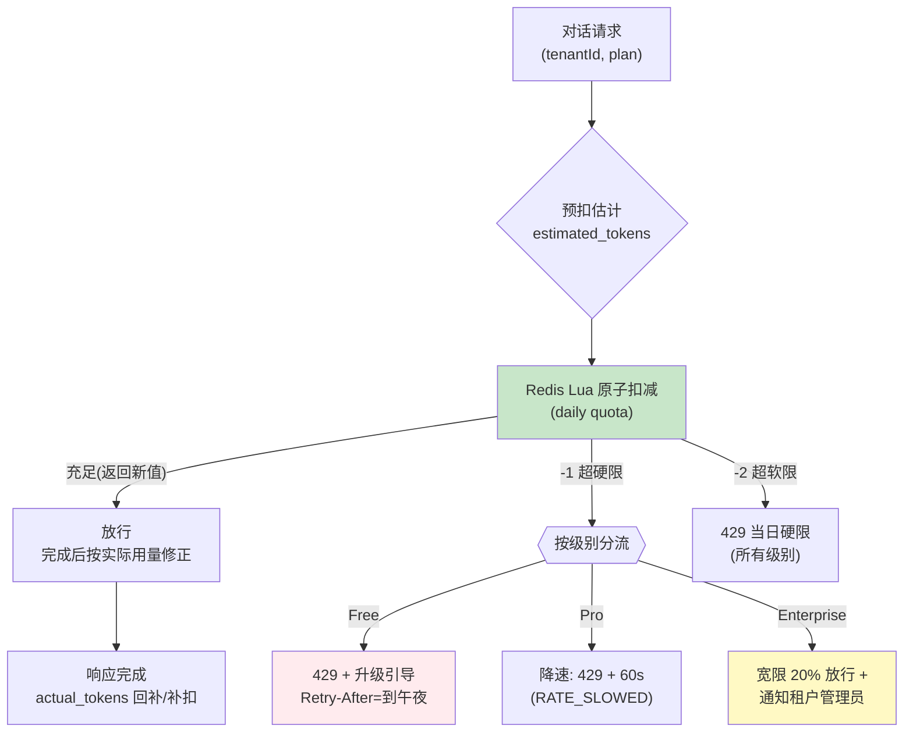

# 项目 07：跨国多租户 SaaS Agent 平台 — 03-迭代二：租户配额与限流

> **定位**：分级配额体系——Token 日配额（Lua 原子预扣+修正）、租户级并发限流（突发保护）、超限行为分级（Free 限流 / Pro 降速 / Enterprise 宽限+通知）。本文给出**完整可手写代码**（一行不省略）。
>
> 「遇到阻塞？→ [教程 20-多租户隔离与资源治理 §资源配额]、[教程 24-容错与弹性设计 §限流]；API 真实性以 [附录 12-SpringAI2-API基准] 为准」

---

## 1. 四问

| 问 | 答 |
|----|----|
| **新增了什么需求** | ① 分级 Token 日配额（原子预扣+修正）② 租户级并发会话限流 ③ 超限行为分级（拒/缓/宽）④ 429 响应带 Retry-After 与分级语义 |
| **影响了哪些模块** | AgentChatService（对话链路包上配额闸门）、新增 quota 模块（Lua/Redis）、全局异常处理（429 映射）、pom.xml（Redis） |
| **架构如何演进** | 无 Redis → 引入 Redis（ReactiveRedisTemplate）；对话链路从"直通 LLM"→"配额闸门 → LLM → 修正/落库" |
| **上一版痛点是什么** | Free 租户白嫖 40× 成本；单租户突发打爆共享资源；超限一刀切拒服务伤体验 |

## 2. 配额体系设计



**预扣+修正**是本设计的关键：请求开始前按消息长度预扣估计量（防止"边跑边超"），完成后按实际 Token 修正差额——保证原子性的同时不牺牲精度。

## 3. 完整代码（照抄即可，一行不省略）

### 3.1 pom.xml 新增依赖（需在 pom.xml 中添加依赖）

```xml
<!-- 响应式 Redis：配额/并发限量/灰度（v3 引入） -->
<dependency>
    <groupId>org.springframework.boot</groupId>
    <artifactId>spring-boot-starter-data-redis-reactive</artifactId>
</dependency>
```

### 3.2 application.yml 新增

```yaml
spring:
  data:
    redis:
      host: ${REDIS_HOST:localhost}
      port: 6379
```

### 3.3 `QuotaCheck.java`（配额判定结果）

```java
package com.acme.saas.quota;

import com.acme.saas.identity.Plan;

/** 配额判定结果。SOFT_EXCEEDED 仅在 Enterprise 宽限场景放行。 */
public record QuotaCheck(Status status, long usedTokens) {

    public enum Status { OK, SOFT_EXCEEDED, HARD_EXCEEDED }

    public boolean allowed() {
        return status == Status.OK;
    }

    public boolean allowedWithEnterpriseGrace(Plan plan) {
        return status == Status.SOFT_EXCEEDED && plan == Plan.ENTERPRISE;
    }
}
```

### 3.4 `QuotaService.java`（Lua 原子预扣 + 完成后修正）

```java
package com.acme.saas.quota;

import com.acme.saas.identity.Plan;
import org.springframework.data.redis.core.ReactiveRedisTemplate;
import org.springframework.data.redis.core.script.DefaultRedisScript;
import org.springframework.data.redis.core.script.RedisScript;
import org.springframework.stereotype.Service;
import reactor.core.publisher.Mono;

import java.time.LocalDate;
import java.util.List;
import java.util.UUID;

@Service
public class QuotaService {

    // 原子脚本：GET+判断+INCRBY 三步合一条 Lua，杜绝并发超卖（教程 24 §原子性教训）
    private static final String QUOTA_LUA = """
            local key       = KEYS[1]
            local est       = tonumber(ARGV[1])
            local limit     = tonumber(ARGV[2])
            local softLimit = math.floor(limit * 1.2)   -- Enterprise 宽限区
            local used      = tonumber(redis.call('GET', key) or '0')
            if used + est > softLimit then return -2 end  -- 超软限：硬拒区
            if used + est > limit    then return -1 end  -- 超硬限：可宽限（Enterprise）
            redis.call('INCRBY', key, est)
            return used + est                             -- 预扣成功，返回新值
            """;

    private final ReactiveRedisTemplate<String, String> redis;

    public QuotaService(ReactiveRedisTemplate<String, String> redis) {
        this.redis = redis;
    }

    /** 请求开始：按估计量原子预扣。返回 OK / SOFT_EXCEEDED / HARD_EXCEEDED。 */
    public Mono<QuotaCheck> preCharge(UUID tenantId, Plan plan, long estimated) {
        String key = "quota:token:" + tenantId + ":" + LocalDate.now();
        RedisScript<Long> script = new DefaultRedisScript<>(QUOTA_LUA, Long.class);
        return redis.execute(script, List.of(key),
                        List.of(String.valueOf(estimated), String.valueOf(plan.dailyTokens())))
                .next()
                .map(r -> switch (r.intValue()) {
                    case -2 -> new QuotaCheck(QuotaCheck.Status.HARD_EXCEEDED, 0);
                    case -1 -> new QuotaCheck(QuotaCheck.Status.SOFT_EXCEEDED, 0);
                    default -> new QuotaCheck(QuotaCheck.Status.OK, r);
                });
    }

    /** 完成后：按实际用量修正差额（回补多扣 or 补扣少扣）。 */
    public Mono<Void> settle(UUID tenantId, long preCharged, long actual) {
        String key = "quota:token:" + tenantId + ":" + LocalDate.now();
        long diff = actual - preCharged;
        if (diff == 0) {
            return Mono.empty();
        }
        if (diff > 0) {
            return redis.opsForValue().increment(key, diff).then();
        }
        return redis.opsForValue().decrement(key, -diff).then();
    }
}
```

### 3.5 `ConcurrencyLimitService.java`（租户级并发会话，同 Lua 原子）

```java
package com.acme.saas.quota;

import com.acme.saas.identity.Plan;
import org.springframework.data.redis.core.ReactiveRedisTemplate;
import org.springframework.data.redis.core.script.DefaultRedisScript;
import org.springframework.data.redis.core.script.RedisScript;
import org.springframework.stereotype.Service;
import reactor.core.publisher.Mono;

import java.util.List;
import java.util.UUID;

@Service
public class ConcurrencyLimitService {

    // 集合语义：同会话幂等占用 + SCARD 上限 + EXPIRE 自愈（释放丢失也会 2h 后自动过期）
    private static final String SESS_LUA = """
            local key    = KEYS[1]
            local member = ARGV[1]
            local limit  = tonumber(ARGV[2])
            local active = tonumber(redis.call('SCARD', key) or '0')
            if redis.call('SISMEMBER', key, member) == 1 then return 1 end
            if active >= limit then return 0 end
            redis.call('SADD', key, member)
            redis.call('EXPIRE', key, 7200)
            return 1
            """;

    private final ReactiveRedisTemplate<String, String> redis;

    public ConcurrencyLimitService(ReactiveRedisTemplate<String, String> redis) {
        this.redis = redis;
    }

    /** 占会话；被拒说明该租户并发已达上限（Pro=5，Enterprise=自定义）。 */
    public Mono<Boolean> tryAcquireSession(UUID tenantId, Plan plan, String sessionId) {
        String key = "sessions:" + tenantId;
        RedisScript<Long> script = new DefaultRedisScript<>(SESS_LUA, Long.class);
        return redis.execute(script, List.of(key),
                        List.of(sessionId, String.valueOf(plan.concurrentSessions())))
                .next()
                .map(r -> r.intValue() == 1);
    }

    /** 释放会话；即使丢失，EXPIRE 2h 也会自愈。 */
    public Mono<Long> releaseSession(UUID tenantId, String sessionId) {
        return redis.opsForSet().remove("sessions:" + tenantId, sessionId);
    }
}
```

**双层限量的分工**：Token 配额（天级、总量、财务保护）+ 并发限制（秒级、瞬时、稳定性保护）——只做其中一层都会被打穿（只限总量：一秒内打完当日额度拖垮共享服务；只限并发：全天匀速白嫖）。

### 3.6 `QuotaGuard.java`（对话链路的配额闸门）

```java
package com.acme.saas.quota;

import com.acme.saas.tenant.AuthContext;
import org.springframework.stereotype.Component;
import reactor.core.publisher.Mono;

import java.util.UUID;

/**
 * 配额闸门：请求前预扣估计量，完成后按实际用量修正。
 * 超限行为按级别分流：Free 硬拒 / Pro 降速 / Enterprise 宽限 20% + 通知。
 */
@Component
public class QuotaGuard {

    private final QuotaService quota;

    public QuotaGuard(QuotaService quota) {
        this.quota = quota;
    }

    /** 进入：预扣成功返回已扣量；超限抛 QuotaExceededException（由全局处理器映射 429）。 */
    public Mono<Long> tryEnter(AuthContext auth, long estimatedTokens) {
        return quota.preCharge(auth.tenantId(), auth.plan(), estimatedTokens)
                .flatMap(check -> {
                    if (check.allowed()) {
                        return Mono.just(check.usedTokens());
                    }
                    if (check.allowedWithEnterpriseGrace(auth.plan())) {
                        // Enterprise 宽限 20%：放行 + 异步通知租户管理员
                        return notifyGrace(auth).thenReturn(check.usedTokens());
                    }
                    return Mono.error(new QuotaExceededException(auth.plan()));
                });
    }

    /** 退出：按实际用量修正。 */
    public Mono<Void> exit(UUID tenantId, long preCharged, long actual) {
        return quota.settle(tenantId, preCharged, actual);
    }

    private Mono<Void> notifyGrace(AuthContext auth) {
        // 真实实现：发事件到通知管道（邮件/Webhook），此处占位
        return Mono.empty();
    }
}
```

### 3.7 异常与 429 标准姿势

```java
package com.acme.saas.quota;

import com.acme.saas.identity.Plan;

/** 配额超限（区别于普通业务异常：携带分级语义）。 */
public class QuotaExceededException extends RuntimeException {

    private final Plan plan;

    public QuotaExceededException(Plan plan) {
        super("quota exceeded: " + plan);
        this.plan = plan;
    }

    public Plan getPlan() {
        return plan;
    }
}
```

```java
package com.acme.saas.quota;

/** 并发会话超限（Pro 第 6 个并发被拒）。 */
public class ConcurrencyExceededException extends RuntimeException {

    public ConcurrencyExceededException() {
        super("concurrent sessions limit exceeded");
    }
}
```

```java
package com.acme.saas.quota;

import com.acme.saas.identity.Plan;
import org.springframework.core.annotation.Order;
import org.springframework.http.HttpStatus;
import org.springframework.http.ResponseEntity;
import org.springframework.web.bind.annotation.ExceptionHandler;
import org.springframework.web.bind.annotation.RestControllerAdvice;

import java.time.Duration;
import java.time.LocalDateTime;
import java.util.Map;

/**
 * 429 必须带 Retry-After 与分级语义，前端据此展示（Free 显示升级入口 / Pro 显示降速）。
 * @Order(-1) 保证先于 Spring 默认错误处理。
 */
@RestControllerAdvice
@Order(-1)
public class QuotaExceptionHandler {

    @ExceptionHandler(QuotaExceededException.class)
    public ResponseEntity<Map<String, Object>> handleQuota(QuotaExceededException ex) {
        return switch (ex.getPlan()) {
            case FREE -> ResponseEntity.status(HttpStatus.TOO_MANY_REQUESTS)
                    .header("Retry-After", secondsUntilMidnight())
                    .body(Map.of(
                            "code", "DAILY_QUOTA_EXCEEDED",
                            "upgradeUrl", "/pricing"));               // 商业转化点
            case PRO -> ResponseEntity.status(HttpStatus.TOO_MANY_REQUESTS)
                    .header("Retry-After", "60")
                    .body(Map.of("code", "RATE_SLOWED"));             // 降速非阻断
            case ENTERPRISE -> ResponseEntity.status(HttpStatus.TOO_MANY_REQUESTS)
                    .header("Retry-After", "60")
                    .body(Map.of("code", "HARD_QUOTA_EXCEEDED"));
        };
    }

    @ExceptionHandler(ConcurrencyExceededException.class)
    public ResponseEntity<Map<String, Object>> handleConcurrency(ConcurrencyExceededException ex) {
        return ResponseEntity.status(HttpStatus.TOO_MANY_REQUESTS)
                .header("Retry-After", "5")
                .body(Map.of("code", "CONCURRENT_LIMIT_EXCEEDED"));
    }

    private String secondsUntilMidnight() {
        LocalDateTime now = LocalDateTime.now();
        LocalDateTime midnight = now.toLocalDate().plusDays(1).atStartOfDay();
        long secs = Duration.between(now, midnight).getSeconds();
        return String.valueOf(Math.max(secs, 1));
    }
}
```

### 3.8 `AgentChatService.java`（对话链路包上配额闸门 + 并发限流）

```java
package com.acme.saas.agent;

import com.acme.saas.conversation.MessageRepository;
import com.acme.saas.quota.ConcurrencyExceededException;
import com.acme.saas.quota.ConcurrencyLimitService;
import com.acme.saas.quota.QuotaGuard;
import com.acme.saas.tenant.AuthContext;
import org.springframework.ai.chat.client.ChatClient;
import org.springframework.ai.chat.memory.ChatMemory;
import org.springframework.stereotype.Service;
import reactor.core.publisher.Flux;
import reactor.core.publisher.Mono;

import java.util.UUID;

@Service
public class AgentChatService {

    private final ChatClient chatClient;
    private final MessageRepository messages;
    private final QuotaGuard quota;
    private final ConcurrencyLimitService concurrency;

    public AgentChatService(ChatClient chatClient, MessageRepository messages,
                            QuotaGuard quota, ConcurrencyLimitService concurrency) {
        this.chatClient = chatClient;
        this.messages = messages;
        this.quota = quota;
        this.concurrency = concurrency;
    }

    public Flux<String> chat(AuthContext auth, UUID conversationId, String message) {
        long estimated = estimateTokens(message);
        String sessionKey = conversationId.toString();
        UUID tenantId = auth.tenantId();

        return concurrency.tryAcquireSession(tenantId, auth.plan(), sessionKey)
                .flatMapMany(acquired -> acquired
                        ? chatInner(auth, conversationId, message, estimated, sessionKey)
                        : Flux.error(new ConcurrencyExceededException()));
    }

    private Flux<String> chatInner(AuthContext auth, UUID conversationId, String message,
                                   long estimated, String sessionKey) {
        StringBuilder acc = new StringBuilder();
        return quota.tryEnter(auth, estimated)
                .flatMapMany(preCharged -> messages.insert(auth.tenantId(), conversationId, "user", message)
                        .thenMany(chatClient.prompt()
                                .user(message)
                                .advisors(a -> a.param(ChatMemory.CONVERSATION_ID, conversationId.toString()))
                                .stream()
                                .content()
                                .doOnNext(acc::append))
                        .concatWith(Mono.defer(() -> {
                            long actual = estimateTokens(acc.toString());
                            return quota.exit(auth.tenantId(), preCharged, actual)
                                    .then(messages.insert(auth.tenantId(), conversationId, "assistant", acc.toString()));
                        })))
                .doFinally(signal -> concurrency.releaseSession(auth.tenantId(), sessionKey).subscribe());
    }

    private long estimateTokens(String text) {
        // 粗略：中文约 1 字/token、英文约 4 字符/token；生产用真实 tokenizer
        return (text.length() / 3) + 1;
    }
}
```

> 关于 `.doFinally(... .subscribe())`：并发会话释放是 fire-and-forget，但 Redis 侧 `SESS_LUA` 每次 SADD 都刷新 EXPIRE 2h——即使释放丢失，会话也会自动过期，不构成泄漏（自愈设计）。

### 3.9 `ChatController.java`（传入完整 AuthContext）

```java
package com.acme.saas.agent.web;

import com.acme.saas.agent.AgentChatService;
import com.acme.saas.tenant.AuthContext;
import com.acme.saas.tenant.TenantContextFilter;
import org.springframework.http.MediaType;
import org.springframework.web.bind.annotation.PathVariable;
import org.springframework.web.bind.annotation.PostMapping;
import org.springframework.web.bind.annotation.RequestBody;
import org.springframework.web.bind.annotation.RestController;
import reactor.core.publisher.Flux;

import java.util.UUID;

@RestController
public class ChatController {

    private final AgentChatService agentChat;

    public ChatController(AgentChatService agentChat) {
        this.agentChat = agentChat;
    }

    @PostMapping(value = "/conversations/{id}/messages", produces = MediaType.TEXT_EVENT_STREAM_VALUE)
    public Flux<String> chat(@PathVariable UUID id, @RequestBody ChatRequest req) {
        return Flux.deferContextual(contextView -> {
            AuthContext auth = contextView.get(TenantContextFilter.AUTH_CONTEXT_KEY);
            return agentChat.chat(auth, id, req.message());
        });
    }

    public record ChatRequest(String message) {}
}
```

## 4. 验收标准

| # | 验收项 | 标准 |
|---|--------|------|
| 1 | 原子性 | 1000 并发预扣无超卖（Lua 原子验证） |
| 2 | 预扣修正 | 日终对账：Redis 累计扣减 = 实际用量总和（误差仅结算窗口内未完成请求） |
| 3 | 分级行为 | Free 超限 429+引导；Pro 降速；Enterprise 宽限 20% 且通知 |
| 4 | 并发限量 | Pro 租户第 6 个并发会话被拒，第 5 个完成后立即可用 |
| 5 | 白嫖防线 | 复现 v2 痛点场景（40× 滥用），当日成本被限在配额内 |
| 6 | 无阻塞 | 配额链路全程响应式，P99 新增延迟 < 5ms |

## 5. 本迭代的 ADR

| # | 决策 | 理由 |
|---|------|------|
| ADR-208 | 预扣+完成后修正，非逐 token 实时扣 | 逐 token 扣减的 Redis QPS 与请求量同阶，成本高且流式断连时扣多少算不清 |
| ADR-209 | 超限行为分级（拒/缓/宽） | Free 限流是商业策略，Enterprise 宽限是 SLA 承诺——技术实现服务商业分级 |
| ADR-210 | Token 总量与并发会话双限量 | 单层限量必被打穿（总量 vs 瞬时互补） |
| ADR-234 | 并发会话用 Redis SET + EXPIRE 自愈 | 释放丢失不泄漏；幂等占用（SISMEMBER 去重） |

## 6. v3 的痛点

配额立住了，但 Enterprise 客户提出新诉求："我们要用自己偏好的模型/指定更便宜的模型控制成本"——当前所有租户共用一个模型路由。同时运营发现 Pro 与 Enterprise 共用模型时，Enterprise 客户的高峰体验被 Free 流量挤压。→ [04-迭代三-租户级模型路由.md](04-迭代三-租户级模型路由.md)
