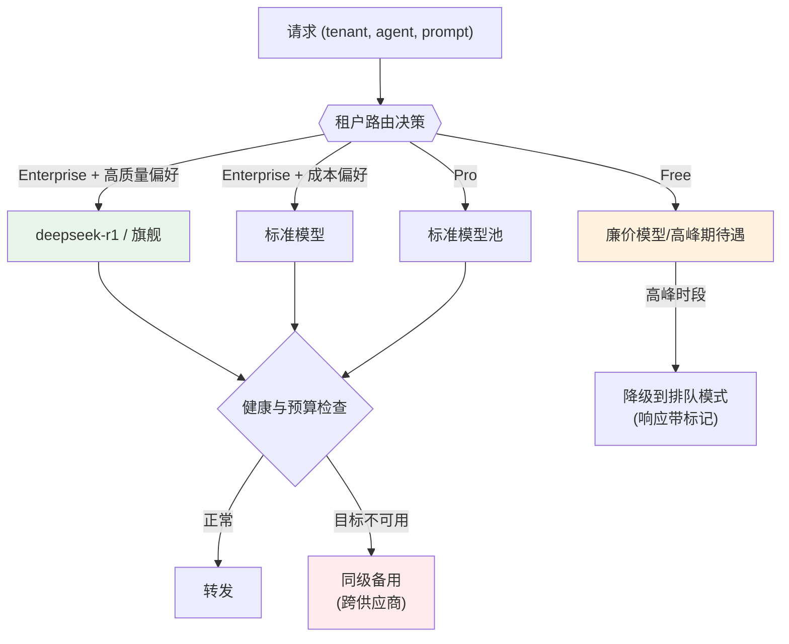

# 项目 07：跨国多租户 SaaS Agent 平台 — 04-租户级模型路由与成本归因

> **定位**：模型路由从"平台一刀切"升级为"按租户级别与偏好路由"——Enterprise 专属高性能模型、Pro 标准模型、Free 廉价模型，且单租户成本可精确归因（为 v5 计费铺路）。本文给出**完整可手写代码**（一行不省略）。
>
> 「遇到阻塞？→ [教程 04-企业级架构主干/12-模型路由与降级 全篇]、[教程 04-企业级架构主干/07-成本治理与Token计量 §归因]；API 真实性以 [附录 05-SpringAI2-API基准] 为准」

---

## 1. 四问

| 问 | 答 |
|----|----|
| **新增了什么需求** | ① 按租户级别（plan）分模型池 ② Enterprise 允许租户偏好自选 ③ 被动健康检查 + 同级跨供应商降级 ④ Free 高峰降级（透明标记）⑤ 租户×Agent×模型三级归因 |
| **影响了哪些模块** | 新增 routing 模块（路由决策/健康/归因）；AgentChatService 在调用前解析路由并以 `.options(...)` 注入模型；TenantRepository 加 model_preference 查询 |
| **架构如何演进** | 单模型直连 → **路由层**（配置驱动、健康兜底、归因埋点）包在 ChatClient 前 |
| **上一版痛点是什么** | 全租户共用一个模型路由；Free 流量挤压付费体验；成本归因粒度不够（租户内哪个 Agent 烧钱无法回答） |

## 2. 路由设计



**"Free 高峰期待遇"的决策依据**：Free 租户是获客成本（平台倒贴 LLM 费），高峰期降其体验保付费客户是商业理性——但降级必须透明（响应标记），不能静默（静默降质会伤害转化，ADR-212）。

### 2.1 本节核对（路由设计）

- [ ] 四条出边（Enterprise 双偏好 / Pro / Free+高峰）与 §3.1 的 tiers 配置一一对应
- [ ] 健康兜底（同级跨供应商 fallback）与 Free 高峰排队是两条互不混用的分支
- [ ] ADR-212 的"透明降级"理由能复述

## 3. 完整代码（照抄即可，一行不省略）

### 3.1 路由策略配置（`application-saaagent.yaml`，控制面配置支持热更新）

> `routing.*` 是控制面配置（tier/模型池/降级链），归入业务配置 `application-saaagent.yaml`；生产可切到配置中心热更新。

```yaml
routing:
  peak-hours: "9:00-12:00,14:00-18:00"
  tiers:
    ENTERPRISE:
      default: flagship
      allow-preference: true            # Enterprise 允许租户自选
      fallback-chain: [flagship-b, standard, cheap]
    PRO:
      default: standard
      allow-preference: false
      fallback-chain: [standard-b, cheap]
    FREE:
      default: cheap
      allow-preference: false
      peak-hours-degrade: queue-mode    # 高峰降级模式（透明标记）
  models:
    flagship:
      provider: deepseek
      model: deepseek-r1
    flagship-b:
      provider: openai
      model: gpt-5.1
    standard:
      provider: deepseek
      model: deepseek-chat
    standard-b:
      provider: qwen
      model: qwen-plus
    cheap:
      provider: deepseek
      model: deepseek-lite
```

### 3.2 `RouterProperties.java`（配置绑定）

```java
package com.acme.saas.routing;

import org.springframework.boot.context.properties.ConfigurationProperties;

import java.util.LinkedHashMap;
import java.util.List;
import java.util.Map;

/** routing.* 配置绑定。需在主类加 @EnableConfigurationProperties(RouterProperties.class)。 */
@ConfigurationProperties(prefix = "routing")
public class RouterProperties {

    private String peakHours = "9:00-12:00,14:00-18:00";
    private Map<String, TierConfig> tiers = new LinkedHashMap<>();
    private Map<String, ModelEndpoint> models = new LinkedHashMap<>();

    public String getPeakHours() { return peakHours; }
    public void setPeakHours(String peakHours) { this.peakHours = peakHours; }
    public Map<String, TierConfig> getTiers() { return tiers; }
    public void setTiers(Map<String, TierConfig> tiers) { this.tiers = tiers; }
    public Map<String, ModelEndpoint> getModels() { return models; }
    public void setModels(Map<String, ModelEndpoint> models) { this.models = models; }

    public static class TierConfig {
        private String defaultModel;
        private boolean allowPreference;
        private List<String> fallbackChain = List.of();
        private String peakHoursDegrade = "none";

        public String getDefaultModel() { return defaultModel; }
        public void setDefaultModel(String defaultModel) { this.defaultModel = defaultModel; }
        public boolean isAllowPreference() { return allowPreference; }
        public void setAllowPreference(boolean allowPreference) { this.allowPreference = allowPreference; }
        public List<String> getFallbackChain() { return fallbackChain; }
        public void setFallbackChain(List<String> fallbackChain) { this.fallbackChain = fallbackChain; }
        public String getPeakHoursDegrade() { return peakHoursDegrade; }
        public void setPeakHoursDegrade(String peakHoursDegrade) { this.peakHoursDegrade = peakHoursDegrade; }
    }

    public static class ModelEndpoint {
        private String provider;
        private String model;

        public String getProvider() { return provider; }
        public void setProvider(String provider) { this.provider = provider; }
        public String getModel() { return model; }
        public void setModel(String model) { this.model = model; }
    }
}
```

### 3.3 `ModelRoute.java` / `ModelHealthRegistry.java` / `PeakHoursDetector.java`

```java
package com.acme.saas.routing;

/** 路由结果。degraded=true 表示高峰降级（透明标记，不静默）。 */
public record ModelRoute(String alias, String provider, String model, boolean degraded) {

    public static ModelRoute normal(String alias, String provider, String model) {
        return new ModelRoute(alias, provider, model, false);
    }

    public static ModelRoute degraded(String alias) {
        return new ModelRoute(alias, "queue", "queue-mode", true);
    }
}
```

```java
package com.acme.saas.routing;

import org.springframework.stereotype.Component;

import java.util.Set;
import java.util.concurrent.ConcurrentHashMap;

/** 被动健康（[教程 04-企业级架构主干/03-工具执行可观测与审计 §6 模型健康检查与自动切换]）：由错误观测标记不可用模型，定期衰减。 */
@Component
public class ModelHealthRegistry {

    private final Set<String> unhealthy = ConcurrentHashMap.newKeySet();

    public void markUnhealthy(String alias) {
        unhealthy.add(alias);
    }

    public boolean isUnhealthy(String alias) {
        return unhealthy.contains(alias);
    }

    public void recover(String alias) {
        unhealthy.remove(alias);
    }
}
```

```java
package com.acme.saas.routing;

import org.springframework.stereotype.Component;

import java.time.LocalTime;
import java.util.Arrays;
import java.util.List;

/** 高峰时段判断（从 routing.peak-hours 解析）。 */
@Component
public class PeakHoursDetector {

    private final List<TimeRange> ranges;

    public PeakHoursDetector(RouterProperties props) {
        this.ranges = Arrays.stream(props.getPeakHours().split(","))
                .map(TimeRange::parse)
                .toList();
    }

    public boolean isPeak() {
        LocalTime now = LocalTime.now();
        return ranges.stream().anyMatch(r -> r.contains(now));
    }

    record TimeRange(LocalTime start, LocalTime end) {
        static TimeRange parse(String s) {
            String[] p = s.split("-");
            return new TimeRange(LocalTime.parse(p[0]), LocalTime.parse(p[1]));
        }
        boolean contains(LocalTime t) {
            return !t.isBefore(start) && !t.isAfter(end);
        }
    }
}
```

### 3.4 `TenantModelRouter.java`（核心路由决策）

```java
package com.acme.saas.routing;

import com.acme.saas.identity.Plan;
import org.springframework.stereotype.Service;
import reactor.core.publisher.Mono;

import java.util.ArrayList;
import java.util.List;

@Service
public class TenantModelRouter {

    private final RouterProperties props;
    private final ModelHealthRegistry health;
    private final PeakHoursDetector peakHours;

    public TenantModelRouter(RouterProperties props, ModelHealthRegistry health,
                             PeakHoursDetector peakHours) {
        this.props = props;
        this.health = health;
        this.peakHours = peakHours;
    }

    /** 路由决策：tier 决定模型池；Enterprise 允许偏好；被动健康 + 同级跨供应商降级。 */
    public Mono<ModelRoute> resolve(Plan plan, String tenantPreference) {
        RouterProperties.TierConfig tier = props.getTiers().get(plan.name());
        if (tier == null) {
            return Mono.error(new IllegalStateException("no routing tier for " + plan));
        }

        String primary = tier.isAllowPreference() && tenantPreference != null
                ? tenantPreference
                : tier.getDefaultModel();

        // Free 高峰降级：显式标记（ADR-212 透明降级），由调用方决定排队行为
        if (plan == Plan.FREE
                && "queue-mode".equals(tier.getPeakHoursDegrade())
                && peakHours.isPeak()) {
            return Mono.just(ModelRoute.degraded(primary));
        }

        return findUsable(primary, tier.getFallbackChain());
    }

    private Mono<ModelRoute> findUsable(String primary, List<String> chain) {
        List<String> candidates = new ArrayList<>();
        candidates.add(primary);
        candidates.addAll(chain);
        for (String alias : candidates) {
            RouterProperties.ModelEndpoint ep = props.getModels().get(alias);
            if (ep != null && !health.isUnhealthy(alias)) {
                return Mono.just(ModelRoute.normal(alias, ep.getProvider(), ep.getModel()));
            }
        }
        return Mono.error(new NoUsableModelException("all models in chain unhealthy"));
    }
}
```

```java
package com.acme.saas.routing;

/** 整条降级链都不可用（罕见：合规集合全挂见 v8 的"宁可慢不可违"排队策略）。 */
public class NoUsableModelException extends RuntimeException {

    public NoUsableModelException(String message) {
        super(message);
    }
}
```

### 3.5 租户偏好（Enterprise 限定）

`TenantRepository` 增加查询 + `TenantPreferenceService` 缓存（1 分钟 TTL，plan 变更后 JWT 陈旧不影响路由）：

```java
// TenantRepository 新增方法
public Mono<String> findPreference(UUID id) {
    return db.sql("SELECT model_preference FROM tenant WHERE id = :id")
            .bind("id", id)
            .map((row, meta) -> row.get("model_preference", String.class))
            .one();
}
```

```java
package com.acme.saas.routing;

import com.acme.saas.identity.TenantRepository;
import org.springframework.stereotype.Service;
import reactor.core.publisher.Mono;

import java.time.Duration;
import java.time.Instant;
import java.util.UUID;
import java.util.concurrent.ConcurrentHashMap;

/** 租户路由偏好缓存：避免每请求查库；1 分钟 TTL 保证变更可接受延迟生效。 */
@Service
public class TenantPreferenceService {

    private static final Duration TTL = Duration.ofMinutes(1);

    private final TenantRepository tenants;
    private final ConcurrentHashMap<UUID, PrefEntry> cache = new ConcurrentHashMap<>();

    public TenantPreferenceService(TenantRepository tenants) {
        this.tenants = tenants;
    }

    public Mono<String> preferenceOf(UUID tenantId) {
        PrefEntry entry = cache.get(tenantId);
        if (entry != null && !entry.expired()) {
            return Mono.justOrEmpty(entry.preference());
        }
        return tenants.findPreference(tenantId)
                .doOnNext(pref -> cache.put(tenantId, new PrefEntry(pref, Instant.now())));
    }

    record PrefEntry(String preference, Instant cachedAt) {
        boolean expired() {
            return Duration.between(cachedAt, Instant.now()).compareTo(TTL) > 0;
        }
    }
}
```

需要给 tenant 表加列（Flyway）：

```sql
-- db/migrations/V2__tenant_preference.sql
ALTER TABLE tenant ADD COLUMN IF NOT EXISTS model_preference TEXT;
```

#### 3.5.1 本节测试与验证（租户偏好与路由决策）

**前置条件**：`routing.tiers` 配置就绪；V2 迁移已执行；三档租户 token 各一枚。

**材料——偏好写入 SQL 与路由探针**：

```sql
-- Enterprise 租户设"成本偏好"
UPDATE tenant SET model_preference = 'COST_OPTIMIZED' WHERE plan = 'ENTERPRISE';
```

```bash
# 三档租户各发一次对话，观察日志/指标里的 model 标签
curl -N -X POST "http://localhost:8081/conversations/<会话ID>/messages" \
  -H "Authorization: Bearer <各档JWT>" -H "Content-Type: application/json" \
  -d '{"message":"你好"}'
```

**步骤与断言**：

| # | 操作 | 预期（PASS 判据） |
|---|------|------------------|
| 1 | Free 租户对话 | 命中 cheap 模型池 |
| 2 | Pro 租户对话 | 命中 standard 模型池 |
| 3 | Enterprise（无偏好/高质量偏好） | 命中 flagship；材料 SQL 设 COST_OPTIMIZED 后（等超 TTL 再重试）命中 standard |
| 4 | 改偏好后等超 TTL 再次请求 | 新偏好生效（TTL 缓存过期后重新查库，ADR-235——TTL 内缓存仍持旧偏好） |
| 5 | 把 ENTERPRISE fallback-chain 首位模型配置为不可用地址 | 请求自动落到 fallback-chain 次位（健康检查兜底） |

**失败排查**：①三档命中同一模型→`RouterProperties` 绑定前缀 `routing` 抄错；②偏好不生效→迁移未跑或 `TenantPreferenceService` 缓存 TTL 未过期；③降级不触发→健康标记未按失败计数更新。

### 3.6 归因计量 `UsageAttributionMeter.java`（v5 计费的数据基础）

```java
package com.acme.saas.routing;

import io.micrometer.core.instrument.MeterRegistry;
import org.springframework.stereotype.Component;

import java.util.UUID;

/**
 * 归因计量：网关转发时打全归因三标签（ADR-213 埋点先于计费）。
 * v5 计费直接消费这些指标流，不再回补埋点。
 */
@Component
public class UsageAttributionMeter {

    private final MeterRegistry registry;

    public UsageAttributionMeter(MeterRegistry registry) {
        this.registry = registry;
    }

    public void recordInput(UUID tenantId, String agentId, ModelRoute route, long inputTokens) {
        registry.counter("saas.llm.tokens",
                        "tenant_id", tenantId.toString(),
                        "agent_id", agentId,
                        "model", route.model(),
                        "token_type", "input")
                .increment(inputTokens);
    }

    public void recordOutput(UUID tenantId, String agentId, ModelRoute route, long outputTokens) {
        registry.counter("saas.llm.tokens",
                        "tenant_id", tenantId.toString(),
                        "agent_id", agentId,
                        "model", route.model(),
                        "token_type", "output")
                .increment(outputTokens);
    }
}
```

### 3.7 `AgentChatService.java`（v4：路由注入 + 归因 + 高峰排队）

```java
package com.acme.saas.agent;

import com.acme.saas.conversation.MessageRepository;
import com.acme.saas.quota.ConcurrencyExceededException;
import com.acme.saas.quota.ConcurrencyLimitService;
import com.acme.saas.quota.QuotaGuard;
import com.acme.saas.routing.ModelRoute;
import com.acme.saas.routing.PeakDegradeException;
import com.acme.saas.routing.TenantModelRouter;
import com.acme.saas.routing.TenantPreferenceService;
import com.acme.saas.routing.UsageAttributionMeter;
import com.acme.saas.tenant.AuthContext;
import org.springframework.ai.chat.client.ChatClient;
import org.springframework.ai.chat.memory.ChatMemory;
import org.springframework.ai.openai.OpenAiChatOptions;
import org.springframework.stereotype.Service;
import reactor.core.publisher.Flux;
import reactor.core.publisher.Mono;

import java.util.UUID;

@Service
public class AgentChatService {

    private final ChatClient chatClient;
    private final MessageRepository messages;
    private final QuotaGuard quota;
    private final ConcurrencyLimitService concurrency;
    private final TenantModelRouter router;
    private final TenantPreferenceService preferences;
    private final UsageAttributionMeter attribution;

    public AgentChatService(ChatClient chatClient, MessageRepository messages,
                            QuotaGuard quota, ConcurrencyLimitService concurrency,
                            TenantModelRouter router, TenantPreferenceService preferences,
                            UsageAttributionMeter attribution) {
        this.chatClient = chatClient;
        this.messages = messages;
        this.quota = quota;
        this.concurrency = concurrency;
        this.router = router;
        this.preferences = preferences;
        this.attribution = attribution;
    }

    public Flux<String> chat(AuthContext auth, UUID conversationId, String message) {
        long estimated = estimateTokens(message);
        String sessionKey = conversationId.toString();
        UUID tenantId = auth.tenantId();

        return concurrency.tryAcquireSession(tenantId, auth.plan(), sessionKey)
                .flatMapMany(acquired -> {
                    if (!acquired) {
                        return Flux.error(new ConcurrencyExceededException());
                    }
                    return preferences.preferenceOf(tenantId)
                            .flatMapMany(pref -> router.resolve(auth.plan(), pref))
                            .flatMapMany(route -> route.degraded()
                                    ? Flux.error(new PeakDegradeException())
                                    : chatInner(auth, conversationId, message, estimated, sessionKey, route));
                });
    }

    private Flux<String> chatInner(AuthContext auth, UUID conversationId, String message,
                                   long estimated, String sessionKey, ModelRoute route) {
        StringBuilder acc = new StringBuilder();
        UUID tenantId = auth.tenantId();
        return quota.tryEnter(auth, estimated)
                .flatMapMany(preCharged -> messages.insert(tenantId, conversationId, "user", message)
                        .thenMany(chatClient.prompt()
                                .user(message)
                                .options(OpenAiChatOptions.builder().model(route.model()))   // 路由决定模型
                                .advisors(a -> a.param(ChatMemory.CONVERSATION_ID, conversationId.toString()))
                                .stream()
                                .content()
                                .doOnNext(acc::append))
                        .concatWith(Mono.defer(() -> {
                            long actual = estimateTokens(acc.toString());
                            attribution.recordInput(tenantId, agentIdOf(conversationId), route, estimated);
                            attribution.recordOutput(tenantId, agentIdOf(conversationId), route, actual - estimated);
                            return quota.exit(tenantId, preCharged, actual)
                                    .then(messages.insert(tenantId, conversationId, "assistant", acc.toString()));
                        })))
                .doFinally(signal -> concurrency.releaseSession(tenantId, sessionKey).subscribe());
    }

    private String agentIdOf(UUID conversationId) {
        // 真实实现：从 conversation.agent_id 查（ConversationRepository.findAgentId）
        return "agent-placeholder";
    }

    private long estimateTokens(String text) {
        return (text.length() / 3) + 1;
    }
}
```

```java
package com.acme.saas.routing;

/** Free 租户高峰降级为排队（透明标记，ADR-212）。由全局异常处理映射 429 + Retry-After。 */
public class PeakDegradeException extends RuntimeException {

    public PeakDegradeException() {
        super("peak-hours degrade: request queued");
    }
}
```

在 `QuotaExceptionHandler` 追加：

```java
@ExceptionHandler(PeakDegradeException.class)
public ResponseEntity<Map<String, Object>> handlePeakDegrade(PeakDegradeException ex) {
    return ResponseEntity.status(HttpStatus.TOO_MANY_REQUESTS)
            .header("Retry-After", "120")
            .body(Map.of("code", "PEAK_QUEUE", "message", "高峰时段排队中，请稍后重试"));
}
```

### 3.8 本节测试与验证（高峰降级与归因埋点）

**前置条件**：§3.5.1 通过；actuator + Micrometer 已暴露（`/actuator/metrics`）；当前系统时间调进 `routing.peak-hours` 区间（或临时把区间改成当前时刻）。

**材料——指标核对**：

```bash
# 归因三标签核对（tenant_id / agent_id / model / token_type）
curl -s "http://localhost:8081/actuator/metrics/saas.llm.tokens" | head
```

**步骤与断言**：

| # | 操作 | 预期（PASS 判据） |
|---|------|------------------|
| 1 | Free 租户在高峰区间对话 | HTTP 429，body 含 `code=PEAK_QUEUE` 与透明标记文案，头 `Retry-After: 120` |
| 2 | 同高峰区间 Pro 租户对话 | 正常 200（付费不受影响） |
| 3 | 把 peak-hours 改回非当前时段（热更新） | Free 恢复 200 |
| 4 | 正常对话若干次后材料 curl | `saas.llm.tokens` 计数按 tenant_id/agent_id/model/token_type 四标签可切片，input+output 与对话量同阶 |
| 5 | 检查 `chatInner` 归因位置 | recordInput/recordOutput 在完成路径（concatWith）内、`quota.exit` 之前 |

**失败排查**：①Free 高峰不降级→`PeakHoursDetector` 时段解析错（"9:00-12:00" 格式抄错）；②429 无 PEAK_QUEUE code→异常处理器未追加该分支；③指标缺标签→counter tag 值为 null（agentIdOf 占位未接 ConversationRepository）。

## 4. 验收标准

| # | 验收项 | 标准 |
|---|---|---|
| 1 | 分级路由 | 三级租户分别命中各自模型池；Enterprise 偏好生效 |
| 2 | 故障切换 | 主模型供应商故障，付费租户 30s 内切同级备用（体验无感） |
| 3 | 高峰降级 | Free 租户高峰进入排队模式且响应带标记；付费租户不受影响 |
| 4 | 归因完整 | 任意一天的用量可按租户×Agent×模型三维切片，总和与供应商账单差 < 1% |

> 本表即全篇回归口径：§3.5.1（分档路由/偏好/故障切换）与 §3.8（高峰降级/归因）全通过后，逐条对照本表复核（项 2 的 30s 切换与项 4 的 <1% 对账需观测窗口补测）。

## 5. 本迭代的 ADR

| # | 决策 | 理由 |
|---|------|------|
| ADR-211 | 路由即商业策略（tier 决定模型池） | 模型路由不只是技术降级链，还是付费墙的实现层 |
| ADR-212 | Free 高峰降级必须显式标记 | 静默降质伤害转化；透明降级反而制造升级动机 |
| ADR-213 | 埋点先于计费（v3 打全标签） | 归因标签回补成本远高于先行设计 |
| ADR-235 | 租户偏好走 TTL 缓存而非信任 JWT | plan/偏好变更后 JWT 陈旧，路由决策必须取新鲜配置 |

### 5.1 本节核对（ADR 与痛点衔接）

- [ ] ADR-211/212/213/235 分别对应 §3.4 决策层 / §3.7 透明标记 / §3.6 埋点 / §3.5 TTL 缓存
- [ ] §6 痛点（指标不能当账单源）与 v5 "append-only 事件流水"形成因果衔接（§6 为收束章，不另设验证）

## 6. v4 的痛点

产品上线正式收费（Pro 计划开放），财务提要求："月底怎么给每个租户出账单？拿什么保证账单数字是对的？"——目前只有 Prometheus 指标，指标是采样聚合、可重置的，**不能直接当账单数据源**。→ [05-计费与账单.md](05-计费与账单.md)
