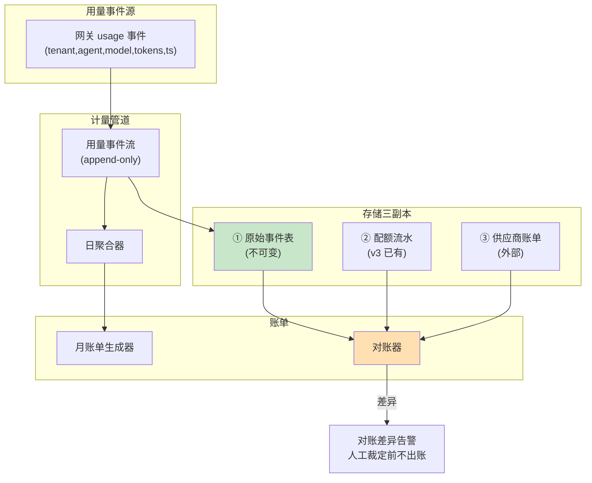

# 项目 07：跨国多租户 SaaS Agent 平台 — 05-计费与账单

> **定位**：把"计量"升级为"计费"——事件级用量流水（append-only 不可变）、三副本对账、月度账单生成、争议处理。SaaS 的营收正确性问题。本文给出**完整可手写代码**（一行不省略）。
>
> 「遇到阻塞？→ [教程 04-企业级架构主干/07-成本治理与Token计量 §计费正确性]、[教程 04-企业级架构主干/05-历史记录持久化与合规 §不可变记录]；API 真实性以 [附录 05-SpringAI2-API基准] 为准」

---

## 1. 四问

| 问 | 答 |
|----|----|
| **新增了什么需求** | ① 事件级用量流水（append-only，不可变）② 三副本对账（事件/配额/供应商）③ 月账单生成（含租户内 Agent 行项）④ 争议取证链路 |
| **影响了哪些模块** | 新增 billing 模块；网关/对话链路在完成时写用量事件；v3 配额流水升级为可对账的 ledger 表 |
| **架构如何演进** | Prometheus 指标（运维）→ **事件流水（财务）**——两类数据分轨；账单生成 + 对账 + 争议下钻 |
| **上一版痛点是什么** | 指标当账单（可聚合/可重置/采样）；无对账保障；无争议处理依据 |

## 2. 计费数据架构



**账单的唯一数据源是原始事件表**（append-only，禁 UPDATE/DELETE）；指标继续服务运维监控但与账单无关——**监控数据与财务数据必须分轨**（ADR-214）。

### 2.1 本节核对（计费数据架构）

- [ ] 三副本各自角色（原始事件/配额流水/供应商账单）与对账器的输入能对应
- [ ] "差异→冻结出账"的闸门位置在账单生成之前（ADR-215）能指出
- [ ] 监控与财务分轨的理由（指标可聚合/重置/采样）能复述

## 3. 完整代码（照抄即可，一行不省略）

### 3.1 用量事件表 DDL（`db/migrations/V3__billing.sql`）

```sql
-- ① 原始用量事件（append-only，触发器拒绝 UPDATE/DELETE）
CREATE TABLE usage_event (
    id            BIGINT PRIMARY KEY,        -- 雪花 ID（全局单调）
    tenant_id     UUID NOT NULL,
    agent_id      TEXT NOT NULL,
    model         TEXT NOT NULL,
    input_tokens  BIGINT NOT NULL,
    output_tokens BIGINT NOT NULL,
    request_ts    BIGINT NOT NULL,           -- epoch 秒（月聚合窗口用）
    duration_ms   BIGINT NOT NULL,
    complete      BOOLEAN NOT NULL,          -- false = 断连但按已有 usage 计
    trace_id      TEXT NOT NULL,             -- 争议时可拉全链路
    event_ts      TIMESTAMPTZ NOT NULL DEFAULT now()
);
CREATE INDEX idx_usage_tenant_month ON usage_event (tenant_id, request_ts);
CREATE INDEX idx_usage_month ON usage_event (request_ts);

-- 不可变性：数据库层强制（同 RLS 思路——应用层自觉不可靠）
CREATE FUNCTION forbid_usage_change() RETURNS trigger AS $$
BEGIN
    RAISE EXCEPTION 'usage_event is append-only';
END;
$$ LANGUAGE plpgsql;

CREATE TRIGGER trg_usage_no_update BEFORE UPDATE ON usage_event
    FOR EACH ROW EXECUTE FUNCTION forbid_usage_change();
CREATE TRIGGER trg_usage_no_delete BEFORE DELETE ON usage_event
    FOR EACH ROW EXECUTE FUNCTION forbid_usage_change();

-- ② 配额流水（v3 的扣减落 ledger 表，月终聚合对账）
CREATE TABLE quota_ledger (
    id             UUID PRIMARY KEY DEFAULT gen_random_uuid(),
    tenant_id      UUID NOT NULL,
    agent_id       TEXT NOT NULL,
    ledger_month   TEXT NOT NULL,            -- '2026-08'
    charged_tokens BIGINT NOT NULL,
    event_ts       TIMESTAMPTZ NOT NULL DEFAULT now()
);
CREATE INDEX idx_quota_ledger_month ON quota_ledger (tenant_id, ledger_month);
```

### 3.2 `UsageEvent.java`（不可变流水记录）

```java
package com.acme.saas.billing;

import java.util.UUID;

/** 用量事件：每次网关调用的完成事件（含流式断连的"计量丢失"事件）。 */
public record UsageEvent(
        long eventId,                    // 全局单调（雪花 ID）
        UUID tenantId,
        String agentId,
        String model,
        long inputTokens,
        long outputTokens,
        long requestTs,                  // epoch 秒
        long durationMs,
        boolean complete,                // false = 断连但按已有 usage 计（[教程 01-WebFlux与响应式编程/00-WebFlux从零入门 §7.3 流式中断后的部分结果处理]）
        String traceId                   // 争议时可拉全链路
) {}
```

### 3.3 `UsageEventRepository.java`（append-only 写入 + 查询 + 月聚合）

```java
package com.acme.saas.billing;

import org.springframework.r2dbc.core.DatabaseClient;   // ⚠ 需引入依赖 org.springframework.boot:spring-boot-starter-data-r2dbc（本地未下载，未 javap 实证；以引入依赖后 javap 输出为准）
import org.springframework.stereotype.Repository;
import reactor.core.publisher.Flux;
import reactor.core.publisher.Mono;

import java.time.YearMonth;
import java.time.ZoneOffset;
import java.util.HashMap;
import java.util.Map;
import java.util.UUID;

@Repository
public class UsageEventRepository {

    private final DatabaseClient db;

    public UsageEventRepository(DatabaseClient db) {
        this.db = db;
    }

    /** append-only 写入（表层触发器拒绝 UPDATE/DELETE，ADR-214）。 */
    public Mono<Void> append(UsageEvent event) {
        return db.sql("""
                INSERT INTO usage_event (id, tenant_id, agent_id, model,
                                         input_tokens, output_tokens, request_ts,
                                         duration_ms, complete, trace_id)
                VALUES (:id, :tenantId, :agentId, :model,
                        :inputTokens, :outputTokens, :requestTs,
                        :durationMs, :complete, :traceId)
                """)
                .bind("id", event.eventId())
                .bind("tenantId", event.tenantId())
                .bind("agentId", event.agentId())
                .bind("model", event.model())
                .bind("inputTokens", event.inputTokens())
                .bind("outputTokens", event.outputTokens())
                .bind("requestTs", event.requestTs())
                .bind("durationMs", event.durationMs())
                .bind("complete", event.complete())
                .bind("traceId", event.traceId())
                .then();
    }

    public Flux<UsageEvent> eventsOf(UUID tenantId, YearMonth month) {
        long from = month.atDay(1).atStartOfDay(ZoneOffset.UTC).toEpochSecond();
        long to = month.plusMonths(1).atDay(1).atStartOfDay(ZoneOffset.UTC).toEpochSecond();
        return db.sql("""
                SELECT id, tenant_id, agent_id, model,
                       input_tokens, output_tokens, request_ts,
                       duration_ms, complete, trace_id
                FROM usage_event
                WHERE tenant_id = :tenantId AND request_ts >= :from AND request_ts < :to
                """)
                .bind("tenantId", tenantId)
                .bind("from", from)
                .bind("to", to)
                .map((row, meta) -> new UsageEvent(
                        row.get("id", Long.class),
                        row.get("tenant_id", UUID.class),
                        row.get("agent_id", String.class),
                        row.get("model", String.class),
                        row.get("input_tokens", Long.class),
                        row.get("output_tokens", Long.class),
                        row.get("request_ts", Long.class),
                        row.get("duration_ms", Long.class),
                        row.get("complete", Boolean.class),
                        row.get("trace_id", String.class)))
                .all();
    }

    /** 副本① 月聚合（对账用，按租户）。 */
    public Mono<Map<UUID, Long>> aggregateByTenant(YearMonth month) {
        long from = month.atDay(1).atStartOfDay(ZoneOffset.UTC).toEpochSecond();
        long to = month.plusMonths(1).atDay(1).atStartOfDay(ZoneOffset.UTC).toEpochSecond();
        return db.sql("""
                SELECT tenant_id, sum(input_tokens + output_tokens) AS tokens
                FROM usage_event
                WHERE request_ts >= :from AND request_ts < :to
                GROUP BY tenant_id
                """)
                .bind("from", from)
                .bind("to", to)
                .map((row, meta) -> Map.entry(
                        row.get("tenant_id", UUID.class),
                        row.get("tokens", Long.class)))
                .all()
                .collect(HashMap::new, (m, e) -> m.put(e.getKey(), e.getValue()));
    }
}
```

### 3.4 月账单生成：`Invoice.java` / `OverageCalculator.java` / `InvoiceService.java`

```java
package com.acme.saas.billing;

import java.math.BigDecimal;
import java.time.YearMonth;
import java.util.List;
import java.util.UUID;

public record Invoice(
        UUID tenantId,
        YearMonth period,
        BigDecimal basePrice,
        long includedTokens,
        long usedTokens,
        BigDecimal overageCharge,
        BigDecimal total,
        List<LineItem> lineItems        // 按租户内 Agent 分行项（企业客户要部门分摊）
) {

    public record LineItem(String agentId, long inputTokens, long outputTokens, long totalTokens) {}
}
```

```java
package com.acme.saas.billing;

import com.acme.saas.identity.Plan;

import java.math.BigDecimal;

/** 分层计价：免费额度内 0，超额按单价（Pro $0.002/1k tokens）。 */
public class OverageCalculator {

    private static final BigDecimal PRO_UNIT_PRICE =
            new BigDecimal("0.002").divide(BigDecimal.valueOf(1000));   // 每 token

    public BigDecimal calculate(Plan plan, long usedTokens, long includedTokens) {
        long overage = Math.max(0, usedTokens - includedTokens);
        return switch (plan) {
            case FREE -> BigDecimal.ZERO;                                 // Free 超限即限流，不产生账单
            case PRO -> PRO_UNIT_PRICE.multiply(BigDecimal.valueOf(overage));
            case ENTERPRISE -> BigDecimal.ZERO;                           // Enterprise 定制合同另计
        };
    }
}
```

```java
package com.acme.saas.billing;

import com.acme.saas.identity.Tenant;
import org.springframework.stereotype.Service;
import reactor.core.publisher.Mono;

import java.math.BigDecimal;
import java.time.YearMonth;
import java.util.List;
import java.util.Map;
import java.util.stream.Collectors;

@Service
public class InvoiceService {

    private final UsageEventRepository usageEvents;
    private final OverageCalculator overage;

    public InvoiceService(UsageEventRepository usageEvents, OverageCalculator overage) {
        this.usageEvents = usageEvents;
        this.overage = overage;
    }

    public Mono<Invoice> generateInvoice(Tenant tenant, YearMonth month) {
        return usageEvents.eventsOf(tenant.id(), month)
                .collectList()
                .map(events -> build(tenant, month, events));
    }

    private Invoice build(Tenant tenant, YearMonth month, List<UsageEvent> events) {
        var plan = tenant.plan();
        long input = events.stream().mapToLong(UsageEvent::inputTokens).sum();
        long output = events.stream().mapToLong(UsageEvent::outputTokens).sum();
        long total = input + output;
        long included = (long) plan.dailyTokens() * month.lengthOfMonth();

        BigDecimal base = BigDecimal.valueOf(plan.monthlyFee());
        BigDecimal overageCharge = overage.calculate(plan, total, included);
        BigDecimal totalCharge = base.add(overageCharge);

        return new Invoice(tenant.id(), month, base, included, total,
                overageCharge, totalCharge, groupByAgent(events));
    }

    /** 按租户内 Agent 聚合行项。 */
    private List<Invoice.LineItem> groupByAgent(List<UsageEvent> events) {
        Map<String, long[]> acc = events.stream().collect(Collectors.groupingBy(
                UsageEvent::agentId,
                Collectors.collectingAndThen(Collectors.toList(), list -> {
                    long i = list.stream().mapToLong(UsageEvent::inputTokens).sum();
                    long o = list.stream().mapToLong(UsageEvent::outputTokens).sum();
                    return new long[]{i, o};
                })));
        return acc.entrySet().stream()
                .map(e -> new Invoice.LineItem(e.getKey(), e.getValue()[0], e.getValue()[1],
                        e.getValue()[0] + e.getValue()[1]))
                .toList();
    }
}
```

### 3.5 三副本对账：`Discrepancy.java` / `ReconciliationResult.java` / `ReconciliationService.java`

```java
package com.acme.saas.billing;

public record Discrepancy(String subject, String comparison, long left, long right) {}
```

```java
package com.acme.saas.billing;

import java.util.List;

public record ReconciliationResult(boolean clean, List<Discrepancy> issues) {

    public static ReconciliationResult clean() {
        return new ReconciliationResult(true, List.of());
    }

    public static ReconciliationResult withIssues(List<Discrepancy> issues) {
        return new ReconciliationResult(false, issues);
    }
}
```

```java
package com.acme.saas.billing;

import org.springframework.stereotype.Service;
import reactor.core.publisher.Mono;

import java.time.YearMonth;
import java.util.ArrayList;
import java.util.List;
import java.util.Map;
import java.util.UUID;

/** 三副本对账：① 原始事件 ② 配额流水 ③ 供应商账单。有差异冻结出账（ADR-215）。 */
@Service
public class ReconciliationService {

    private static final double SUPPLIER_TOLERANCE = 0.01;   // 供应商对照允许 <1%

    private final UsageEventRepository usageEvents;
    private final QuotaLedger quotaLedger;
    private final SupplierInvoice supplierInvoice;

    public ReconciliationService(UsageEventRepository usageEvents,
                                 QuotaLedger quotaLedger, SupplierInvoice supplierInvoice) {
        this.usageEvents = usageEvents;
        this.quotaLedger = quotaLedger;
        this.supplierInvoice = supplierInvoice;
    }

    public Mono<ReconciliationResult> reconcile(YearMonth month) {
        Mono<Map<UUID, Long>> byEvents = usageEvents.aggregateByTenant(month);
        Mono<Map<UUID, Long>> byQuota = quotaLedger.aggregateByTenant(month);
        Mono<Map<String, Long>> bySupplier = supplierInvoice.download(month);

        return Mono.zip(byEvents, byQuota, bySupplier)
                .map(t -> {
                    List<Discrepancy> issues = new ArrayList<>();
                    issues.addAll(compareInternal(t.getT1(), t.getT2()));   // 内部两轨差 = 漏记/重记
                    issues.addAll(compareSupplierTotal(t.getT1(), t.getT3()));
                    return issues.isEmpty()
                            ? ReconciliationResult.clean()
                            : ReconciliationResult.withIssues(issues);       // 有差异冻结
                });
    }

    private List<Discrepancy> compareInternal(Map<UUID, Long> byEvents, Map<UUID, Long> byQuota) {
        List<Discrepancy> issues = new ArrayList<>();
        for (UUID tenant : byEvents.keySet()) {
            long e = byEvents.getOrDefault(tenant, 0L);
            long q = byQuota.getOrDefault(tenant, 0L);
            if (e != q) {
                issues.add(new Discrepancy(tenant.toString(), "events-vs-quota", e, q));
            }
        }
        return issues;
    }

    private List<Discrepancy> compareSupplierTotal(Map<UUID, Long> byEvents, Map<String, Long> bySupplier) {
        List<Discrepancy> issues = new ArrayList<>();
        long eventTotal = byEvents.values().stream().mapToLong(Long::longValue).sum();
        long supplierTotal = bySupplier.values().stream().mapToLong(Long::longValue).sum();
        if (supplierTotal == 0) {
            return issues;
        }
        double diff = Math.abs(eventTotal - supplierTotal) / (double) supplierTotal;
        if (diff > SUPPLIER_TOLERANCE) {
            issues.add(new Discrepancy("supplier", "events-vs-supplier", eventTotal, supplierTotal));
        }
        return issues;
    }
}
```

`QuotaLedger.java`（副本②）：

```java
package com.acme.saas.billing;

import org.springframework.r2dbc.core.DatabaseClient;   // ⚠ 需引入依赖 org.springframework.boot:spring-boot-starter-data-r2dbc（本地未下载，未 javap 实证；以引入依赖后 javap 输出为准）
import org.springframework.stereotype.Component;
import reactor.core.publisher.Mono;

import java.time.YearMonth;
import java.util.HashMap;
import java.util.Map;
import java.util.UUID;

/** 副本② 配额流水：v3 配额扣减时同步写 quota_ledger 表，月终聚合。 */
@Component
public class QuotaLedger {

    private final DatabaseClient db;

    public QuotaLedger(DatabaseClient db) {
        this.db = db;
    }

    public Mono<Map<UUID, Long>> aggregateByTenant(YearMonth month) {
        return db.sql("""
                SELECT tenant_id, sum(charged_tokens) AS tokens
                FROM quota_ledger
                WHERE ledger_month = :month
                GROUP BY tenant_id
                """)
                .bind("month", month.toString())
                .map((row, meta) -> Map.entry(
                        row.get("tenant_id", UUID.class),
                        row.get("tokens", Long.class)))
                .all()
                .collect(HashMap::new, (m, e) -> m.put(e.getKey(), e.getValue()));
    }
}
```

`SupplierInvoice.java`（副本③）：

```java
package com.acme.saas.billing;

import org.springframework.stereotype.Component;
import reactor.core.publisher.Mono;

import java.time.YearMonth;
import java.util.Map;

/** 副本③ 供应商账单：从供应商计量 API 下载月度用量（真实实现接各供应商）。 */
@Component
public class SupplierInvoice {

    public Mono<Map<String, Long>> download(YearMonth month) {
        // 真实实现：调用供应商用量导出接口（OpenAI/DeepSeek 用量报表），按租户分摊
        return Mono.just(Map.of());
    }
}
```

### 3.6 计费接口 `BillingController.java`

```java
package com.acme.saas.billing.web;

import com.acme.saas.billing.Invoice;
import com.acme.saas.billing.InvoiceService;
import com.acme.saas.billing.ReconciliationResult;
import com.acme.saas.billing.ReconciliationService;
import com.acme.saas.identity.TenantRepository;
import org.springframework.web.bind.annotation.GetMapping;
import org.springframework.web.bind.annotation.PathVariable;
import org.springframework.web.bind.annotation.RequestMapping;
import org.springframework.web.bind.annotation.RestController;
import reactor.core.publisher.Mono;

import java.time.YearMonth;
import java.util.UUID;

@RestController
@RequestMapping("/api/billing")
public class BillingController {

    private final InvoiceService invoices;
    private final ReconciliationService reconciler;
    private final TenantRepository tenants;

    public BillingController(InvoiceService invoices, ReconciliationService reconciler,
                             TenantRepository tenants) {
        this.invoices = invoices;
        this.reconciler = reconciler;
        this.tenants = tenants;
    }

    @GetMapping("/tenants/{tenantId}/invoices/{month}")
    public Mono<Invoice> invoice(@PathVariable UUID tenantId, @PathVariable String month) {
        return tenants.findById(tenantId)
                .flatMap(t -> invoices.generateInvoice(t, YearMonth.parse(month)));
    }

    @GetMapping("/reconciliation/{month}")
    public Mono<ReconciliationResult> reconcile(@PathVariable String month) {
        return reconciler.reconcile(YearMonth.parse(month));
    }
}
```

### 3.7 本节测试与验证（账单生成与三副本对账）

**前置条件**：V3 迁移已执行（usage_event + 触发器）；已产生若干真实对话（事件表有数据）；供应商侧有对照账单（测试期可用手工 INSERT 的"供应商副本"代替）。

**材料——不可变性与对账探针**：

```sql
-- ① append-only 强制核对：DBA 直连尝试改写
UPDATE usage_event SET input_tokens = 0 WHERE id = <某事件ID>;
-- ② 事件表抽样（核对 traceId 存在）
SELECT id, tenant_id, model, input_tokens, output_tokens, trace_id
FROM usage_event ORDER BY id DESC LIMIT 5;
```

```bash
# ③ 生成账单与对账
curl -s "http://localhost:8080/api/billing/tenants/<tenantId>/invoices/2026-08" | head
curl -s "http://localhost:8080/api/billing/reconciliation/2026-08" | head
```

**步骤与断言**：

| # | 操作 | 预期（PASS 判据） |
|---|------|------------------|
| 1 | 材料① | 数据库层报错拒绝（触发器拦截 UPDATE；DELETE 同理） |
| 2 | 材料② | 每行 `trace_id` 非空（ADR-216 争议裁决依据） |
| 3 | 材料③ 账单 | 行项按 Agent 分列；总额 = 事件重算值；超额部分走 OverageCalculator |
| 4 | 材料③ 对账 | 三副本一致时返回 matched；人为删一条事件副本后再跑，出现差异项且该租户账单被冻结（不出账 + 告警） |
| 5 | 重复调用同月账单 | 金额幂等（同月重复生成不翻倍） |

**失败排查**：①UPDATE 成功→触发器未建或 DBA 用了表 owner 旁路（核对触发器权限）；②对账恒 matched→对账输入抄错副本；③账单翻倍→聚合器把同月事件重复计入。

## 4. 争议处理

租户质疑账单时的取证路径：**账单行项 → 日聚合 → 原始用量事件（traceId）→ 调用链 Trace →（脱敏后的）请求上下文**。每一级都可下钻，争议最终落到**可验证的事件流水**而非"我们的系统说是多少"。每笔事件的 `traceId` 保证了"我们俩说的到底是不是同一笔调用"可被独立验证。

### 4.1 本节核对（争议取证链路）

- [ ] 五级下钻路径（账单行项→日聚合→事件→Trace→脱敏上下文）每级的数据载体能说出（invoice / 聚合表 / usage_event / Trace 后端 / 日志）
- [ ] §3.7 断言 2（trace_id 非空）是本节取证链成立的前提，已验证过

## 5. 验收标准

| # | 验收项 | 标准 |
|---|--------|------|
| 1 | 不可变性 | DBA 尝试 UPDATE/ DELETE 用量表被数据库层拒绝 |
| 2 | 对账月报 | 三副本对账自动化；差异自动冻结并告警 |
| 3 | 账单准确 | 人工抽检 50 张账单，金额与事件流水重算零差异 |
| 4 | 争议取证 | 随机取 3 个争议模拟，全链下钻到 trace 可复现 |
| 5 | 断连计量 | 断连请求按已有 usage 计入，"丢失事件"有标记可统计 |

> 本表即全篇回归口径：§3.7（不可变/账单/对账冻结）通过后逐条对照本表复核（项 3 的 50 张抽检与项 4 的争议模拟需补测）。

## 6. 本迭代的 ADR

| # | 决策 | 理由 |
|---|------|------|
| ADR-214 | 账单数据源=原始事件表，指标仅运维用 | 监控数据的聚合/重置特性与财务要求冲突 |
| ADR-215 | 差异冻结出账 | 错账的信任代价远高于晚出账（B2B 信任破裂=续约归零） |
| ADR-216 | 每笔事件带 traceId | 计费争议的最终裁决依据是调用链，不是口头解释 |
| ADR-236 | 不可变由 DB 触发器强制 | append-only 的可靠性不能依赖应用层自觉（同 RLS 的 FORCE 思路） |

### 6.1 本节核对（ADR 与痛点衔接）

- [ ] ADR-214/215/216/236 分别对应 §2 分轨 / §3.5 冻结 / §4.1 取证 / §3.7 材料① 触发器
- [ ] §7 痛点（47 家租户、配置错误全量受损）与 v6 "租户原子灰度"形成因果衔接（§7 为收束章，不另设验证）

## 7. v5 的痛点

付费租户到了 47 家，发布节奏出问题：上周一次模型路由策略调整导致 3 家 Pro 租户的 Agent 集体变笨（标准模型池配置错误），客服工单 40+，两家威胁退款。**全量即时发布在 SaaS 是奢侈品**。→ [06-三维灰度发布.md](06-三维灰度发布.md)
