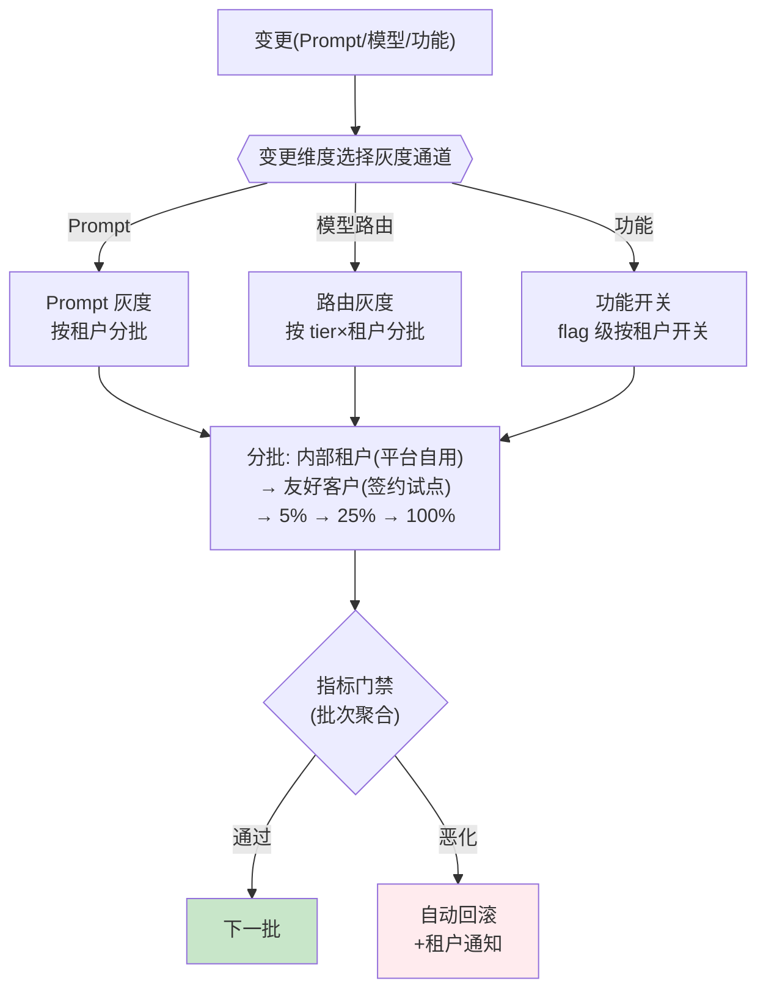

# 项目 07：跨国多租户 SaaS Agent 平台 — 06-三维灰度发布

> **定位**：SaaS 的变更安全网——Prompt/模型/功能三个维度 × 租户分层灰度 + 指标门禁 + 自动回滚。租户信任是资产，灰度是保护它的机制。本文给出**完整可手写代码**（一行不省略）。
>
> 「遇到阻塞？→ [教程 29-灰度发布与版本管理 全篇]、[教程 37-自我反思与Agent评估 §5 在线监控 + 离线评估闭环]；API 真实性以 [附录 05-SpringAI2-API基准] 为准」

---

## 1. 四问

| 问 | 答 |
|----|----|
| **新增了什么需求** | ① 租户分层灰度（内部→试点→5%→25%→100%）② 指标门禁（批次聚合，租户维度）③ 配置指针回滚（秒级）+ 自动熔断 ④ 受影响租户主动通知 |
| **影响了哪些模块** | 新增 gray 模块（分批/门禁/回滚）；ReleaseController（推进批次）；配置加载（Prompt/模型路由/功能开关读灰度指针） |
| **架构如何演进** | 全量即时发布 → **配置指针 + 租户批次**：变更先到"灰度通道"，门禁通过才放大范围 |
| **上一版痛点是什么** | 全量即时发布，配置错误伤所有租户（3 家 Pro 集体变笨、工单 40+、两家威胁退款） |

## 2. 灰度矩阵



**灰度原子单位是租户**（ADR-203）：同一企业内员工看到不同版本会引发支持工单。批次顺序的设计：内部租户（自己吃狗粮）→ 友好客户（签约试点，出问题有谅解）→ 百分比放量。

## 3. 完整代码（照抄即可，一行不省略）

### 3.1 `CanaryBatch.java` / `TenantCanary.java`（租户分批器）

```java
package com.acme.saas.gray;

/** 灰度批次：内部租户 → 签约试点 → 5% → 25% → 全量。 */
public enum CanaryBatch {
    INTERNAL, PILOT, P5, P25, REST
}
```

```java
package com.acme.saas.gray;

import java.nio.charset.StandardCharsets;
import java.security.MessageDigest;
import java.util.Set;
import java.util.UUID;

import static java.lang.Math.floorMod;

/**
 * 租户分批器：按注册序外的稳定哈希分桶；内部租户与签约试点显式列名单（不参与哈希）。
 * 同一租户在任何变更下都落在同一批次（灰度一致性单元=租户，ADR-203）。
 */
public class TenantCanary {

    private static final UUID INTERNAL_TENANT =
            UUID.fromString("00000000-0000-0000-0000-000000000001");

    private final Set<UUID> friendlyList;
    private final MessageDigest sha256;

    public TenantCanary(Set<UUID> friendlyList) {
        this.friendlyList = friendlyList;
        try {
            this.sha256 = MessageDigest.getInstance("SHA-256");
        } catch (Exception e) {
            throw new IllegalStateException("SHA-256 unavailable", e);
        }
    }

    public CanaryBatch batchOf(UUID tenantId) {
        if (tenantId.equals(INTERNAL_TENANT)) {
            return CanaryBatch.INTERNAL;
        }
        if (friendlyList.contains(tenantId)) {
            return CanaryBatch.PILOT;
        }
        int bucket = floorMod(hash(tenantId), 100);   // floorMod 处理负数
        if (bucket < 5) return CanaryBatch.P5;
        if (bucket < 30) return CanaryBatch.P25;
        return CanaryBatch.REST;
    }

    private int hash(UUID tenantId) {
        sha256.reset();
        byte[] digest = sha256.digest(tenantId.toString().getBytes(StandardCharsets.UTF_8));
        return ((digest[0] & 0xFF) << 24) | ((digest[1] & 0xFF) << 16)
                | ((digest[2] & 0xFF) << 8) | (digest[3] & 0xFF);
    }
}
```

### 3.2 `ReleaseService.java`（配置指针，回滚 = 指针切回基线）

```java
package com.acme.saas.gray;

import java.util.Map;
import java.util.concurrent.ConcurrentHashMap;

/** 发布配置指针：灰度期间变更在"指针"层生效，回滚 = 指针切回基线（秒级）。 */
public class ReleaseService {

    public static final String BASELINE = "baseline";

    private final Map<String, String> currentPointer = new ConcurrentHashMap<>();

    /** 把某 release 的指针指到指定配置版本（推下一批）。 */
    public void pinTo(String releaseId, String configVersion) {
        currentPointer.put(releaseId, configVersion);
    }

    /** 回滚：指针切回基线版本。 */
    public void pinToBaseline(String releaseId) {
        currentPointer.put(releaseId, BASELINE);
    }

    public String currentOf(String releaseId) {
        return currentPointer.getOrDefault(releaseId, BASELINE);
    }
}
```

### 3.3 门禁：`WindowStats.java` / `GateResult.java` / `GateEvaluator.java`

```java
package com.acme.saas.gray;

/** 租户批次时间窗口的 SLI 快照（MetricsClient 从 Prometheus/时序库聚合得到）。 */
public record WindowStats(
        double errorRate,
        double p99LatencyMs,
        double avgTokensPerConversation,
        double toolSuccessRate,
        double thumbsDownRate
) {}
```

```java
package com.acme.saas.gray;

import java.util.ArrayList;
import java.util.List;

/** 门禁结果：failures 任一存在即不通过（触发回滚）；warnings 只告警不回滚。 */
public record GateResult(boolean passed, List<String> failures, List<String> warnings) {

    public static GateResult pass() {
        return new GateResult(true, List.of(), List.of());
    }

    public static GateResult fail(List<String> failures) {
        return new GateResult(false, failures, List.of());
    }

    public static GateResult withWarnings(List<String> warnings) {
        return new GateResult(true, List.of(), warnings);
    }

    public GateResult merge(GateResult other) {
        List<String> f = new ArrayList<>(failures);
        f.addAll(other.failures());
        List<String> w = new ArrayList<>(warnings);
        w.addAll(other.warnings());
        return new GateResult(passed && other.passed(), f, w);
    }
}
```

```java
package com.acme.saas.gray;

/** 批次门禁：以批次聚合为准，单租户异常只做"关注通知"（ADR-218）。 */
public class GateEvaluator {

    private final WindowStats baseline;

    public GateEvaluator(WindowStats baseline) {
        this.baseline = baseline;
    }

    public GateResult evaluate(WindowStats current) {
        java.util.List<String> failures = new java.util.ArrayList<>();
        java.util.List<String> warnings = new java.util.ArrayList<>();

        if (current.errorRate() > baseline.errorRate() * 2) {
            failures.add("错误率翻倍");
        }
        if (current.p99LatencyMs() > baseline.p99LatencyMs() * 1.3) {
            failures.add("延迟劣化30%");
        }
        if (current.avgTokensPerConversation() > baseline.avgTokensPerConversation() * 1.25) {
            failures.add("成本劣化(变啰嗦)");
        }
        if (current.toolSuccessRate() < baseline.toolSuccessRate() * 0.9) {
            failures.add("工具成功率下降");
        }
        if (current.thumbsDownRate() > baseline.thumbsDownRate() * 1.5) {
            warnings.add("用户负反馈率上升(软门禁)");
        }

        return new GateResult(failures.isEmpty(), failures, warnings);
    }
}
```

### 3.4 指标客户端与协作接口（真实实现接 Prometheus）

```java
package com.acme.saas.gray;

import reactor.core.publisher.Mono;

import java.time.Duration;

/** 租户批次窗口指标客户端。真实实现用 Prometheus HTTP API / Thanos 查询时序。 */
public interface MetricsClient {

    Mono<WindowStats> tenantWindow(String releaseId, CanaryBatch batch, Duration window);
}
```

```java
package com.acme.saas.gray;

import java.util.List;
import java.util.UUID;

/** 租户目录：按批次列出受影响租户（回滚通知用）。 */
public interface TenantDirectory {

    List<TenantContact> tenantsInBatch(CanaryBatch batch);

    record TenantContact(UUID tenantId, String adminEmail) {}
}
```

```java
package com.acme.saas.gray;

/** 通知管道：邮件/Webhook/SLA 客户经理。 */
public interface Notifier {

    void notify(String adminEmail, String message);
}
```

```java
package com.acme.saas.gray;

/** 审计留痕：自动回滚记录（SOC 2 证据链，v9 复用）。 */
public interface AuditService {

    void recordAutoRollback(String releaseId, GateResult reason);
}
```

### 3.5 `AutoRollbackService.java`（回滚 + 通知 + 审计）

```java
package com.acme.saas.gray;

import org.springframework.stereotype.Component;

/**
 * 自动回滚：配置指针切回基线（秒级）+ 受影响租户主动告知（ADR-219）。
 * SaaS 与内部系统的差异：内部回滚即结束；SaaS 回滚后还要通知租户——透明度是信任资产。
 */
@Component
public class AutoRollbackService {

    private static final String ROLLBACK_NOTICE =
            "我们检测到一次配置变更导致异常，已自动回退到稳定版本。你的 Agent 已恢复，无需操作。";

    private final ReleaseService releaseService;
    private final TenantDirectory tenants;
    private final Notifier notifier;
    private final AuditService audit;

    public AutoRollbackService(ReleaseService releaseService, TenantDirectory tenants,
                               Notifier notifier, AuditService audit) {
        this.releaseService = releaseService;
        this.tenants = tenants;
        this.notifier = notifier;
        this.audit = audit;
    }

    public void rollback(String releaseId, CanaryBatch affectedBatch, GateResult reason) {
        releaseService.pinToBaseline(releaseId);            // 配置指针切回，秒级
        tenants.tenantsInBatch(affectedBatch).forEach(contact ->
                notifier.notify(contact.adminEmail(), ROLLBACK_NOTICE));
        audit.recordAutoRollback(releaseId, reason);
    }
}
```

### 3.6 `ReleaseController.java`（推进批次 / 查租户批次）

```java
package com.acme.saas.gray.web;

import com.acme.saas.gray.CanaryBatch;
import com.acme.saas.gray.GateEvaluator;
import com.acme.saas.gray.GateResult;
import com.acme.saas.gray.MetricsClient;
import com.acme.saas.gray.ReleaseService;
import com.acme.saas.gray.TenantCanary;
import org.springframework.web.bind.annotation.GetMapping;
import org.springframework.web.bind.annotation.PathVariable;
import org.springframework.web.bind.annotation.PostMapping;
import org.springframework.web.bind.annotation.RequestBody;
import org.springframework.web.bind.annotation.RequestMapping;
import org.springframework.web.bind.annotation.RestController;
import reactor.core.publisher.Mono;

import java.time.Duration;
import java.util.Map;
import java.util.UUID;

@RestController
@RequestMapping("/api/releases")
public class ReleaseController {

    private final TenantCanary canary;
    private final ReleaseService releases;
    private final MetricsClient metrics;

    public ReleaseController(TenantCanary canary, ReleaseService releases, MetricsClient metrics) {
        this.canary = canary;
        this.releases = releases;
        this.metrics = metrics;
    }

    /** 查询租户所在批次（灰度期间支持工单定位 + 租户内一致性子校验）。 */
    @GetMapping("/tenants/{tenantId}/batch")
    public Map<String, String> batchOf(@PathVariable UUID tenantId) {
        return Map.of("batch", canary.batchOf(tenantId).name());
    }

    /** 推进下一批：人工确认门禁通过后调用（灰度是配置不是代码，ADR-203）。 */
    @PostMapping("/{releaseId}/advance")
    public void advance(@PathVariable String releaseId, @RequestBody AdvanceRequest req) {
        releases.pinTo(releaseId, req.configVersion());
    }

    /** 手工触发门禁评估（生产上由调度每 5 分钟自动跑）。 */
    @PostMapping("/{releaseId}/gate")
    public Mono<GateResult> gate(@PathVariable String releaseId, @RequestBody GateRequest req) {
        CanaryBatch batch = CanaryBatch.valueOf(req.batch());
        // baseline 由 release 的基线配置对应的历史窗口提供
        var baseline = new com.acme.saas.gray.WindowStats(0.02, 2500, 500, 0.99, 0.01);
        return metrics.tenantWindow(releaseId, batch, Duration.ofMinutes(30))
                .map(new GateEvaluator(baseline)::evaluate);
    }

    public record AdvanceRequest(String configVersion) {}
    public record GateRequest(String batch) {}
}
```

#### 3.6.1 本节测试与验证（批次推进 / 门禁 / 指针回滚）

**前置条件**：gray 模块全部类已装配；MetricsClient 已接真实指标源（或测试 stub）；至少 8 个租户（内部批 + 试点批可分）。

**材料——灰度操作 curl**：

```bash
# ① 查租户批次
curl -s "http://localhost:8080/api/releases/tenants/<tenantId>/batch"
# ② 手工触发门禁评估（试点批）
curl -s -X POST "http://localhost:8080/api/releases/prompt/gate" \
  -H "Content-Type: application/json" -d '{"batch":"CANARY"}'
# ③ 推进/回滚（指针操作）
curl -X POST "http://localhost:8080/api/releases/prompt/advance" \
  -H "Content-Type: application/json" -d '{"configVersion":"v2-baseline"}'
```

**步骤与断言**：

| # | 操作 | 预期（PASS 判据） |
|---|------|------------------|
| 1 | 材料① | 返回 INTERNAL / CANARY / PERCENT_10 等批次名，同一租户重复查询结果稳定 |
| 2 | 材料②（指标正常时） | GateResult 为 PASS（批次聚合窗口 vs baseline 不劣化） |
| 3 | 人为把指标源注入劣化（错误率 > baseline 阈值）再跑材料② | GateResult 为 FAIL 并给出劣化维度 |
| 4 | 触发 `AutoRollbackService.rollback` | `currentOf(releaseId)` 立即回到 baseline（秒级指针回滚，ADR-237）；通知与审计各有记录 |
| 5 | 灰度期间同一租户两名用户并发对话 | 行为一致（租户原子性，无租户内分裂） |

**失败排查**：①门禁恒 PASS→WindowStats 阈值抄宽或窗口取错批次；②回滚不生效→`pinToBaseline` 未落存储（指针未持久化）；③租户内分裂→批次判定引入了 user 级维度（违反 ADR-217）。

## 4. 灰度如何接入具体变更维度

三个维度共用同一套"租户批次 + 门禁 + 回滚"机制，区别只在"变更生效位置"：

| 维度 | 生效位置 | 回滚动作 |
|------|---------|---------|
| Prompt | `PromptTemplateRegistry` 读 `release.currentOf("prompt-v2")` | 指针切回 baseline → 立即用回 v1 Prompt |
| 模型路由 | `TenantModelRouter` 读 `release.currentOf("routing-v3")` | 指针切回 → 路由策略回滚 |
| 功能 | 功能开关（flag）按租户批次 on/off | 关闭 flag |

示例（Prompt 灰度读指针）：

```java
package com.acme.saas.agent;

import com.acme.saas.gray.ReleaseService;
import org.springframework.stereotype.Component;

import java.util.Map;
import java.util.concurrent.ConcurrentHashMap;

/** Prompt 版本注册表：版本与灰度指针绑定，指针切回即回滚。 */
@Component
public class PromptTemplateRegistry {

    private static final String RELEASE_ID = "prompt";

    private final ReleaseService releases;
    private final Map<String, String> templates = new ConcurrentHashMap<>();

    public PromptTemplateRegistry(ReleaseService releases) {
        this.releases = releases;
    }

    public String resolve() {
        String version = releases.currentOf(RELEASE_ID);
        return templates.getOrDefault(version, templates.get(ReleaseService.BASELINE));
    }

    public void put(String version, String prompt) {
        templates.put(version, prompt);
    }
}
```

### 4.1 本节测试与验证（Prompt 指针灰度）

**前置条件**：`PromptTemplateRegistry` 已注册两版 Prompt（v1 baseline / v2）；`ReleaseService` 指针可切。

**步骤与断言**：

| # | 操作 | 预期（PASS 判据） |
|---|------|------------------|
| 1 | 指针在 baseline，试点批租户对话 | System Prompt 用 v1 模板 |
| 2 | `advance` 把指针切到 v2 | 试点批租户下一次对话即用 v2（无需重启，配置生效） |
| 3 | 指针切回 baseline | 立即恢复 v1（秒级回滚） |
| 4 | `resolve()` 在指针指向不存在版本时 | 回退 `templates.get(BASELINE)`，不抛 NPE |

**失败排查**：①切指针不生效→模板注册表未挂 `ReleaseService` 而是启动时固定；②NPE→`put(baseline, ...)` 未预置基线版本。

## 5. 验收标准

| # | 验收项 | 标准 |
|---|---|---|
| 1 | 分批执行 | 复现 v5 痛点场景（错误路由配置），影响面从 47 家降到 ≤3 家（试点批） |
| 2 | 自动回滚 | 注入劣化，批次门禁 30 分钟窗口内自动回滚+租户通知 |
| 3 | 批次隔离 | 灰度期间同一租户的所有用户看到同一版本（无租户内分裂） |
| 4 | 门禁准度 | 批次聚合门禁的假警报率 < 5%（单租户噪声不触发回滚） |

> 本表即全篇回归口径：§3.6.1（批次/门禁/回滚）与 §4.1（Prompt 指针灰度）通过后逐条对照本表复核（项 1 的影响面统计与项 4 的假警报率需多轮发布数据）。

## 6. 本迭代的 ADR

| # | 决策 | 理由 |
|---|------|------|
| ADR-217 | 灰度原子=租户，批次=内部→试点→百分比 | 租户内分裂产生支持成本；批次顺序吸收风险 |
| ADR-218 | 门禁用批次聚合，单租户异常仅通知 | 单租户噪声触发回滚的代价（全量回退）大于收益 |
| ADR-219 | 回滚必通知受影响租户 | 主动透明是 SaaS 信任资产的一部分 |
| ADR-237 | 灰度是配置指针而非代码分支 | 指针切回=秒级回滚；代码分支的部署回滚远慢于指针 |

### 6.1 本节核对（ADR 与痛点衔接）

- [ ] ADR-217/218/219/237 分别对应 §3.1 批次原子 / §3.3 批次聚合门禁 / §3.5 回滚通知 / §3.2 指针
- [ ] §7 痛点（签 SLA 但无 SLO/容量/感知）与 v7 形成因果衔接（§7 为收束章，不另设验证）

## 7. v6 的痛点

客户成功团队开始签 Enterprise SLA（99.9% 可用性承诺），但平台当前：没有定义 SLO、没有容量规划、出故障靠人肉感知——**签了 SLA 就要赔得起**。→ [07-SLO与容量规划.md](07-SLO与容量规划.md)
