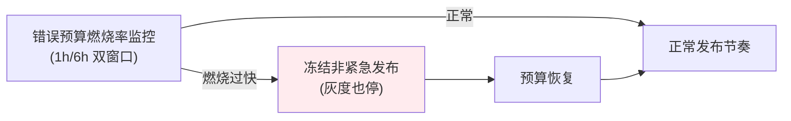

# 项目 07：跨国多租户 SaaS Agent 平台 — 07-SLO 与容量规划

> **定位**：把"感觉稳定"变成"承诺可兑现"——SLO 定义与错误预算、面向 SSE 长连接的容量压测、扩容模型。本文给出**完整可手写代码**（一行不省略）。
>
> 「遇到阻塞？→ [教程 66-部署与运维 §容量规划]、[教程 63-容错与弹性设计]、[教程 81-Agent性能优化]；API 真实性以 [附录 05-SpringAI2-API基准] 为准」

---

## 1. 四问

| 问 | 答 |
|----|----|
| **新增了什么需求** | ① 定义 SLI/SLO/错误预算体系 ② SLI 计量埋点 ③ 错误预算燃烧率监控 + 发布冻结联动 ④ SSE 长连接专用压测模型 ⑤ 连接数驱动的 HPA |
| **影响了哪些模块** | 新增 slo 模块（SLI 计量/预算）；对话链路埋 SLI；发布管道接"预算冻结"门禁；部署加 HPA |
| **架构如何演进** | "感觉稳定" → **数字化的 SLI/SLO + 预算驱动的发布纪律**；容量从"再挂两台" → 压测建模 |
| **上一版痛点是什么** | 要签 SLA 但无 SLO 基础；容量靠感觉；SSE 长连接的容量特性与传统 Web 不同 |

## 2. SLO 体系

| SLI | 定义 | SLO（Enterprise） | 错误预算 |
|-----|------|-------------------|---------|
| 可用性 | 成功对话请求占比 | 99.9%/月 | 43 分钟不可用 |
| 首字延迟（TTFT） | P95 < 2.5s | 95% 请求达标 | 预算联动发布 |
| 流完整性 | 流启动后中断率 < 0.5% | 99.5% | - |
| 工具成功率 | 工具调用非平台故障成功率 > 99% | 99% | - |

**TTFT 作为 SLI 的意义**：对话场景"可用了但 8 秒才出首字"客户体验上等于不可用——SaaS 的可用性承诺必须含延迟维度，否则 SLA 变成文字游戏（ADR-220）。



**错误预算=发布许可证**：预算烧光时，一切非紧急变更冻结（包括灰度）——这是把"稳定性 vs 迭代速度"的冲突变成数字决策。

## 3. 完整代码（照抄即可，一行不省略）

### 3.1 `SliMeter.java`（SLI 计量埋点）

```java
package com.acme.saas.slo;

import io.micrometer.core.instrument.Counter;
import io.micrometer.core.instrument.MeterRegistry;
import io.micrometer.core.instrument.Timer;
import org.springframework.stereotype.Component;

import java.time.Duration;

/** SLI 计量：可用性 / TTFT / 流完整性三类（工具成功率由 Tool Observation 产出）。 */
@Component
public class SliMeter {

    private final Counter success;
    private final Counter failure;
    private final Timer ttft;
    private final Counter streamStarted;
    private final Counter streamBroken;

    public SliMeter(MeterRegistry registry) {
        this.success = registry.counter("sli.availability", "outcome", "success");
        this.failure = registry.counter("sli.availability", "outcome", "failure");
        this.ttft = registry.timer("sli.ttft");
        this.streamStarted = registry.counter("sli.stream", "phase", "started");
        this.streamBroken = registry.counter("sli.stream", "phase", "broken");
    }

    public void recordSuccess() { success.increment(); }

    public void recordFailure() { failure.increment(); }

    public void recordTtft(long millis) { ttft.record(Duration.ofMillis(millis)); }

    public void recordStreamStarted() { streamStarted.increment(); }

    public void recordStreamBroken() { streamBroken.increment(); }
}
```

### 3.2 `ErrorBudgetService.java` + `ErrorBudgetScheduler.java`（预算→发布冻结）

```java
package com.acme.saas.slo;

import org.springframework.stereotype.Component;

import java.util.concurrent.atomic.AtomicBoolean;

/**
 * 错误预算燃烧率监控：1h/6h 双窗口（Google SRE 标准）。
 * 燃烧过快 → 冻结非紧急发布（含灰度）；预算恢复 → 解冻。
 */
@Component
public class ErrorBudgetService {

    private static final double BURN_ALERT_1H = 2.0;     // 1h 内消耗全年预算的 2%
    private static final double BURN_ALERT_6H = 7.5;     // 6h 内消耗全年预算的 7.5%

    private final AtomicBoolean frozen = new AtomicBoolean(false);

    public boolean isFrozen() {
        return frozen.get();
    }

    public void evaluate(double burnRate1h, double burnRate6h) {
        frozen.set(burnRate1h > BURN_ALERT_1H || burnRate6h > BURN_ALERT_6H);
    }
}
```

```java
package com.acme.saas.slo;

import org.springframework.scheduling.annotation.EnableScheduling;
import org.springframework.scheduling.annotation.Scheduled;
import org.springframework.stereotype.Component;

/** 定时评估错误预算（生产接入 Prometheus 窗口聚合查询，此处为调度骨架）。 */
@Component
@EnableScheduling
public class ErrorBudgetScheduler {

    private final ErrorBudgetService budget;

    public ErrorBudgetScheduler(ErrorBudgetService budget) {
        this.budget = budget;
    }

    @Scheduled(fixedDelay = 60_000)
    public void run() {
        // 真实实现：Prometheus 查询最近 1h/6h 的错误率与预算消耗率
        // 即 (窗口错误率 - SLO错误率) / 全年预算分配 的比值；此处按 0 占位
        double burn1h = burnRateOf("1h");
        double burn6h = burnRateOf("6h");
        budget.evaluate(burn1h, burn6h);
    }

    private double burnRateOf(String window) {
        // 占位：从 sli.availability 计数器窗口聚合计算
        return 0.0;
    }
}
```

**发布管道的联动**（灰度入口读取冻结状态，预算冻结时拒绝推进批次）：

```java
package com.acme.saas.gray.web;

import com.acme.saas.slo.ErrorBudgetService;
import org.springframework.stereotype.Component;

/** 预算冻结门禁：冻结期间非紧急发布（含灰度推进）被拒绝。 */
@Component
public class BudgetGate {

    private final ErrorBudgetService budget;

    public BudgetGate(ErrorBudgetService budget) {
        this.budget = budget;
    }

    public void assertNotFrozen(String releaseId) {
        if (budget.isFrozen()) {
            throw new BudgetFrozenException("error budget exhausted, release " + releaseId + " frozen");
        }
    }

    public static class BudgetFrozenException extends RuntimeException {
        public BudgetFrozenException(String message) {
            super(message);
        }
    }
}
```

### 3.3 本节测试与验证（SLI 埋点与错误预算冻结）

**前置条件**：Micrometer 已暴露 `/actuator/metrics`；对话链路已挂 `SliMeter`；`ErrorBudgetScheduler` 调度运行中。

**材料——SLI 指标核对**：

```bash
curl -s "http://localhost:8080/actuator/metrics/sli.availability" | head
curl -s "http://localhost:8080/actuator/metrics/sli.ttft" | head
```

**步骤与断言**：

| # | 操作 | 预期（PASS 判据） |
|---|------|------------------|
| 1 | 正常对话一次 + 人为制造一次失败（断开/无效请求） | `sli.availability` 的 success/failure 两 tag 各 +1 |
| 2 | 材料 TTFT 指标 | `sli.ttft` 有采样值（count ≥ 对话次数） |
| 3 | 流式对话中途断开客户端 | `sli.stream` 的 broken 计数 +1（started 已在开场 +1） |
| 4 | 人为把失败率推高烧穿预算（测试环境灌失败请求） | 调度器下一轮判定后发布冻结生效（非紧急变更被拒） |
| 5 | 预算恢复（窗口滚动或重置） | 冻结自动解除 |

**失败排查**：①指标无数据→埋点未挂进对话完成/失败路径；②冻结不触发→燃烧率计算阈值或调度 cron 未跑；③TTFT 恒 0→计时点取错（记在了流结束而非首帧）。

## 4. SSE 长连接的容量模型

传统 Web 容量按 RPS；SSE 平台的容量是**三维**的：

| 维度 | 资源瓶颈 | 建模 |
|------|---------|------|
| 并发连接数 | 文件描述符/内存（每连接常驻） | 单实例 5k 连接（Netty + 4GB 堆实测） |
| Token 吞吐 | LLM 供应商侧限速（RPM/TPM）+ 网关 CPU | 供应商 TPM 配额 ÷ 安全系数 0.7 |
| 工具并发 | 工具服务 DB 连接池/下游 | 池大小 ÷ 平均工具并发占比 |

### 4.1 k6 压测脚本（SSE 场景专用模型）

```javascript
// k6 SSE 压测：连接保持 + 首帧时间（真实对话模式：建立连接→读流→断言TTFT→保持到done）
// 注意：k6 不原生支持 HTTP 流式分帧读取（响应会缓冲），TTFT 用响应计时近似；
// 生产用自研流式压测器/oha 精确断言首帧。本文给出场景骨架 + 阈值门禁。
import http from 'k6/http';
import { check, sleep } from 'k6';
import { Trend } from 'k6/metrics';

const ttft = new Trend('sse_ttft', true);

export const options = {
  scenarios: {
    sustained_conversations: {
      executor: 'ramping-vus',
      startVUs: 100,
      stages: [
        { duration: '5m', target: 2000 },    // 阶梯爬升到目标并发
        { duration: '30m', target: 2000 },   // 持续段：观察连接稳定性与内存
        { duration: '2m', target: 0 },
      ],
      gracefulRampDown: '30s',
    },
  },
  thresholds: {
    'sse_ttft': ['p(95)<2500'],              // SLI 与 SLO 直接挂钩
    'http_req_failed': ['rate<0.001'],
  },
};

export default function () {
  const payload = JSON.stringify({ message: '压测消息' });
  const res = http.post(
    'http://localhost:8080/conversations/test/messages',
    payload,
    {
      headers: {
        'Content-Type': 'application/json',
        'Authorization': `Bearer ${__ENV.TOKEN}`,
      },
      timeout: '120s',                        // SSE 整个流时长，不是单请求（教程 10 §10.1 代理和超时）
    }
  );
  ttft.add(res.timings.waiting);              // 近似 TTFT（等待首字节）
  check(res, {
    'status 200': (r) => r.status === 200,
    'has sse frame': (r) => r.body && r.body.includes('data:'),
  });
  sleep(1);
}
```

> 「遇到阻塞？→ [教程 10 §10.1 代理和超时]——SSE 压测的两个坑：客户端超时要按"整个流时长"设置（不是单请求）；必须断言心跳/首帧到达（否则挂在代理缓冲上压了个寂寞）」

### 4.2 扩容模型：连接数驱动的 HPA

```yaml
# 基于 SLI 的 HPA：连接数驱动（而非 CPU——SSE 场景 CPU 低但连接高，ADR-221）
apiVersion: autoscaling/v2
kind: HorizontalPodAutoscaler
metadata:
  name: saas-app-hpa
spec:
  scaleTargetRef:
    apiVersion: apps/v1
    kind: Deployment
    name: saas-app
  minReplicas: 3
  maxReplicas: 20
  metrics:
    - type: Pods
      pods:
        metric:
          name: active_sse_connections      # 自定义指标（由 metrics-server adapter 提供）
        target:
          type: AverageValue
          averageValue: "3000"              # 单实例 5k 上限留安全余量
```

**供应商 TPM 是水平扩不掉的天花板**（ADR-222）——应用层扩容到 20 实例，供应商 TPM 满了照样 429。供应商配额管理（多 Key 池、多供应商分摊，[教程 44 §4 多供应商冗余 / §API Key 池]）是容量规划的隐藏维度。

### 4.3 本节测试与验证（k6 压测与 HPA 扩容）

**前置条件**：k6 已安装；`TOKEN` 环境变量为有效 JWT；压测租户配额足够（或专用压测租户放宽配额）；K8s 环境已部署 §4.2 的 HPA 与 `active_sse_connections` 自定义指标管道。

**步骤与断言**：

| # | 操作 | 预期（PASS 判据） |
|---|------|------------------|
| 1 | `k6 run sse.js`（阶梯爬升到 2000 VU） | thresholds 全过：`sse_ttft p(95)<2500`、`http_req_failed rate<0.001` |
| 2 | 压测持续段观察实例 | 无 OOM / fd 耗尽（单实例连接 ≤ 5k 设计线） |
| 3 | 观察 HPA | 副本数随 `active_sse_connections` 上升（min 3 → 上扩），非 CPU 触发 |
| 4 | 压测中同时观察供应商侧 | 到达供应商 TPM 前应用已扩容但 429 出现 → 记录为 TPM 天花板数据点（容量报告输入） |
| 5 | ramp-down 后 | 副本回落，SSE 无 zombie 连接（`sli.stream` broken 占比不异常升高） |

**失败排查**：①TTFT 全 0/无数据→响应被代理缓冲（教程 10 §10.1 的坑，需关代理缓冲或换流式压测器）；②HTTP 大量失败→压测租户撞配额 429（先放宽配额）；③HPA 不动→自定义指标 adapter 未接 `active_sse_connections`。

## 5. 验收标准

| # | 验收项 | 标准 |
|---|---|---|
| 1 | SLO 可观测 | 四个 SLI 的仪表板 + 错误预算燃烧率实时可见 |
| 2 | 预算联动 | 手动烧穿预算，发布冻结机制自动触发 |
| 3 | 压测基线 | 容量报告：单实例连接上限、供应商 TPM 天花板、单租户最大占用全部有数 |
| 4 | HPA 有效性 | 压测爬升场景，自动扩容后 TTFT P95 不超 SLO |
| 5 | SLA 兑现 | 连续两个月 SLO 达成（内部试运行），具备签约底气 |

> 本表即全篇回归口径：§3.3（SLI/预算冻结）与 §4.3（压测/HPA）通过后逐条对照本表复核（项 5 需两个月的试运行窗口）。

## 6. 本迭代的 ADR

| # | 决策 | 理由 |
|---|------|------|
| ADR-220 | TTFT 进 SLI | 对话场景的可用性含延迟，纯成功率 SLA 无意义 |
| ADR-221 | HPA 用连接数不用 CPU | SSE 常驻连接下 CPU 无法反映真实负载 |
| ADR-222 | 供应商 TPM 列为一等容量约束 | 应用扩容解决不了供应商侧限速 |

### 6.1 本节核对（ADR 与痛点衔接）

- [ ] ADR-220/221/222 分别对应 §3.1 TTFT 埋点 / §4.2 连接数 HPA / §4.3 断言 4 的 TPM 天花板
- [ ] §7 痛点（Enterprise 要数据驻留）与 v8 形成因果衔接（§7 为收束章，不另设验证）
| ADR-238 | 错误预算=发布许可证 | 把"稳定性 vs 迭代速度"的冲突变成数字决策 |

## 7. v7 的痛点

第一份 Enterprise 合同的法务批注回来："客户数据（含对话内容）不得离开欧盟。"当前平台是单区域部署——**数据驻留从"路线图项"变成"签约阻塞项"**。→ [08-全球数据驻留.md](08-全球数据驻留.md)
