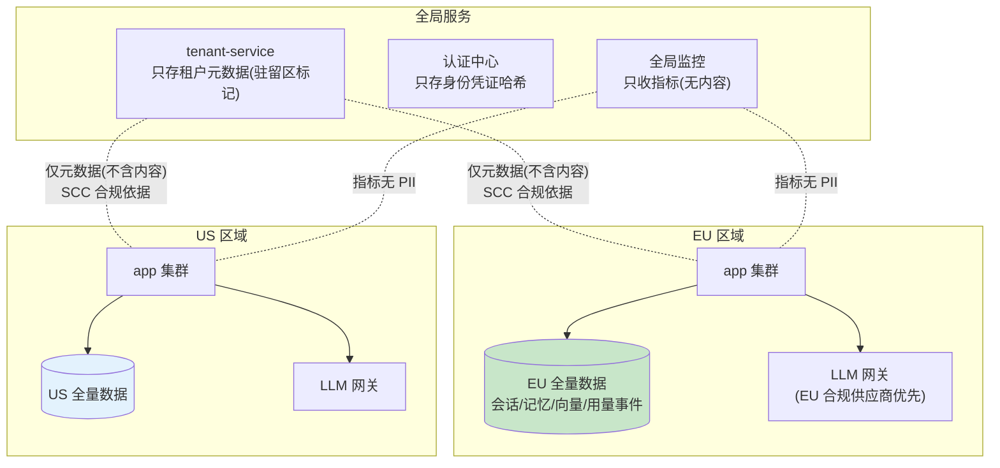

# 项目 07：跨国多租户 SaaS Agent 平台 — 08-迭代七：全球数据驻留

> **定位**：EU/US 数据分区——租户数据按法域物理隔离、跨区协作的合规边界、欧盟供应商优先路由。GDPR 跨境传输要求的架构落地。本文给出**完整可手写代码**（一行不省略）。
>
> 「遇到阻塞？→ [教程 33-部署与运维 §多区域]、[附录 13-AI治理与合规/02-数据隐私与偏见检测 §跨境传输]、[教程 43-Agent治理与合规框架]；API 真实性以 [附录 05-SpringAI2-API基准] 为准」

---

## 1. 四问

| 问 | 答 |
|----|----|
| **新增了什么需求** | ① 租户注册绑定不可变驻留区（EU/US/APAC）② 边缘层区域校验（错区 307）③ EU 区合规供应商路由 ④ 区域独立的全套资源 |
| **影响了哪些模块** | 身份（tenant 表加 zone、JWT 加 zone 声明）、边缘（ZoneValidationFilter）、路由（ComplianceRouter 包一层）、部署（每区独立 DB/Redis/向量库/网关） |
| **架构如何演进** | 单区域部署 → **区域分区**：内容数据（对话/向量/记忆/用量事件）绝不跨区；跨区只有无内容的元数据与指标 |
| **上一版痛点是什么** | EU 客户数据出区（单区域部署）；跨境传输无机制；LLM 供应商可能跨境处理 |

## 2. 数据流分类与合规边界

驻留设计的第一步**不是建机房**，是列出全部数据流并逐条定性：



**核心原则：内容数据（对话/向量/记忆）绝不跨区；跨区的只有"无内容的元数据与指标"**。元数据跨境的合规依据（SCC 标准合同条款之类）由法务出具，技术保证"不含内容"。

## 3. 完整代码（照抄即可，一行不省略）

### 3.1 数据模型：`DataResidencyZone.java` + `Tenant.java`（v8 版）+ DDL

```java
package com.acme.saas.residency;

/** 数据驻留区。租户注册时绑定，不可变——变更走迁移工单（ADR-223）。 */
public enum DataResidencyZone {
    EU, US, APAC
}
```

```java
package com.acme.saas.identity;

import com.acme.saas.residency.DataResidencyZone;

import java.time.Instant;
import java.util.UUID;

/** v8：tenant 增加驻留区（zone），注册时确定，源自客户签约法域。 */
public record Tenant(UUID id, String name, Plan plan, DataResidencyZone zone, Instant createdAt) {}
```

```sql
-- db/migrations/V4__residency.sql
ALTER TABLE tenant ADD COLUMN IF NOT EXISTS zone TEXT NOT NULL DEFAULT 'US';

-- 变更驻留的唯一路径：迁移流程(导出→跨境合规审查→导入→双run验证→旧区删除)
-- 不提供运行时"切换区域"开关——那是数据泄露事故的配方（ADR-223）
```

### 3.2 `TenantRepository.java`（v8 版，含 zone）

```java
package com.acme.saas.identity;

import com.acme.saas.residency.DataResidencyZone;
import org.springframework.r2dbc.core.DatabaseClient;   // ⚠ 需引入依赖 org.springframework.boot:spring-boot-starter-data-r2dbc（本地未下载，未 javap 实证；以引入依赖后 javap 输出为准）
import org.springframework.stereotype.Repository;
import reactor.core.publisher.Mono;

import java.time.Instant;
import java.util.UUID;

@Repository
public class TenantRepository {

    private final DatabaseClient db;

    public TenantRepository(DatabaseClient db) {
        this.db = db;
    }

    public Mono<Tenant> insert(Tenant tenant) {
        return db.sql("""
                INSERT INTO tenant (id, name, plan, zone, created_at)
                VALUES (:id, :name, :plan, :zone, :createdAt)
                """)
                .bind("id", tenant.id())
                .bind("name", tenant.name())
                .bind("plan", tenant.plan().name())
                .bind("zone", tenant.zone().name())
                .bind("createdAt", tenant.createdAt())
                .then()
                .thenReturn(tenant);
    }

    public Mono<Tenant> findById(UUID id) {
        return db.sql("SELECT id, name, plan, zone, created_at FROM tenant WHERE id = :id")
                .bind("id", id)
                .map((row, meta) -> new Tenant(
                        row.get("id", UUID.class),
                        row.get("name", String.class),
                        Plan.valueOf(row.get("plan", String.class)),
                        DataResidencyZone.valueOf(row.get("zone", String.class)),
                        row.get("created_at", Instant.class)))
                .one();
    }

    public Mono<String> findPreference(UUID id) {
        return db.sql("SELECT model_preference FROM tenant WHERE id = :id")
                .bind("id", id)
                .map((row, meta) -> row.get("model_preference", String.class))
                .one();
    }
}
```

### 3.3 注册绑定驻留区：`TenantRegistrationService.java`

```java
package com.acme.saas.identity;

import com.acme.saas.residency.DataResidencyZone;
import org.springframework.stereotype.Service;
import reactor.core.publisher.Mono;

import java.time.Instant;
import java.util.UUID;

@Service
public class TenantRegistrationService {

    private final TenantRepository tenants;
    private final UserRepository users;
    private final PasswordHasher hasher;

    public TenantRegistrationService(TenantRepository tenants, UserRepository users,
                                     PasswordHasher hasher) {
        this.tenants = tenants;
        this.users = users;
        this.hasher = hasher;
    }

    /** 注册即绑定驻留区（源自客户签约法域），不可变——变更走迁移工单。 */
    public Mono<RegisteredTenant> register(String companyName, String adminEmail,
                                           String password, DataResidencyZone zone) {
        UUID tenantId = UUID.randomUUID();
        Tenant tenant = new Tenant(tenantId, companyName, Plan.FREE, zone, Instant.now());
        User admin = new User(UUID.randomUUID(), tenantId, adminEmail, hasher.hash(password));
        return tenants.insert(tenant)
                .then(users.insert(admin))
                .map(u -> new RegisteredTenant(tenantId, u.id(), zone));
    }

    public record RegisteredTenant(UUID tenantId, UUID userId, DataResidencyZone zone) {}
}
```

### 3.4 JWT 带 zone 声明：`JwtService.java`（v8 版）

```java
package com.acme.saas.identity;

import com.acme.saas.residency.DataResidencyZone;
import io.jsonwebtoken.Claims;
import io.jsonwebtoken.Jwts;
import io.jsonwebtoken.security.Keys;
import org.springframework.beans.factory.annotation.Value;
import org.springframework.stereotype.Component;

import javax.crypto.SecretKey;
import java.nio.charset.StandardCharsets;
import java.time.Instant;
import java.util.Date;
import java.util.UUID;

@Component
public class JwtService {

    private final SecretKey key;

    public JwtService(@Value("${app.jwt.secret}") String secret) {
        this.key = Keys.hmacShaKeyFor(secret.getBytes(StandardCharsets.UTF_8));
    }

    /** 签发：payload 带 tenant_id / plan / zone——边缘层 ZoneValidationFilter 读取 zone。 */
    public String issue(UUID tenantId, UUID userId, String email, Plan plan, DataResidencyZone zone) {
        Instant now = Instant.now();
        return Jwts.builder()
                .subject(userId.toString())
                .claim("tenant_id", tenantId.toString())
                .claim("email", email)
                .claim("plan", plan.name())
                .claim("zone", zone.name())
                .issuedAt(Date.from(now))
                .expiration(Date.from(now.plusSeconds(3600)))
                .signWith(key)
                .compact();
    }

    public TokenClaims parse(String token) {
        Claims claims = Jwts.parser().verifyWith(key).build()
                .parseSignedClaims(token).getPayload();
        return new TokenClaims(
                UUID.fromString(claims.get("tenant_id", String.class)),
                UUID.fromString(claims.getSubject()),
                claims.get("email", String.class),
                Plan.valueOf(claims.get("plan", String.class)),
                DataResidencyZone.valueOf(claims.get("zone", String.class)));
    }

    public record TokenClaims(UUID tenantId, UUID userId, String email,
                              Plan plan, DataResidencyZone zone) {}
}
```

`IdentityController.login` 传 zone：

```java
@PostMapping("/login")
public Mono<LoginResponse> login(@RequestBody LoginRequest req) {
    return users.findByEmail(req.email())
            .filter(u -> hasher.matches(req.password(), u.passwordHash()))
            .flatMap(u -> tenants.findById(u.tenantId())
                    .map(tenant -> new LoginResponse(
                            jwt.issue(u.tenantId(), u.id(), u.email(), tenant.plan(), tenant.zone()))))
            .switchIfEmpty(Mono.error(new IllegalStateException("邮箱或密码错误")));
}
```

### 3.5 边缘兜底校验：`DeploymentZone.java` + `ZoneValidationFilter.java`

```java
package com.acme.saas.residency;

import org.springframework.beans.factory.annotation.Value;
import org.springframework.stereotype.Component;

/** 当前部署区（每区环境变量 ZONE 不同：EU / US / APAC）。 */
@Component
public class DeploymentZone {

    private final DataResidencyZone current;

    public DeploymentZone(@Value("${app.zone}") String zone) {
        this.current = DataResidencyZone.valueOf(zone);
    }

    public DataResidencyZone current() {
        return current;
    }
}
```

```java
package com.acme.saas.residency;

import com.acme.saas.identity.JwtService;
import org.springframework.http.HttpStatus;
import org.springframework.stereotype.Component;
import org.springframework.web.server.ServerWebExchange;
import org.springframework.web.server.WebFilter;
import org.springframework.web.server.WebFilterChain;
import reactor.core.publisher.Mono;

import java.net.URI;
import java.util.Set;

/** 边缘兜底校验（ADR-204：驻留是路由问题）：错区到达 → 307 到正确区，绝不在本区处理。 */
@Component
public class ZoneValidationFilter implements WebFilter {

    private static final Set<String> WHITELIST_PREFIXES = Set.of("/api/auth/", "/actuator/");

    private final JwtService jwt;
    private final DeploymentZone deployment;

    public ZoneValidationFilter(JwtService jwt, DeploymentZone deployment) {
        this.jwt = jwt;
        this.deployment = deployment;
    }

    @Override
    public Mono<Void> filter(ServerWebExchange exchange, WebFilterChain chain) {
        String path = exchange.getRequest().getPath().value();
        if (WHITELIST_PREFIXES.stream().anyMatch(path::startsWith)) {
            return chain.filter(exchange);
        }
        String header = exchange.getRequest().getHeaders().getFirst("Authorization");
        if (header == null || !header.startsWith("Bearer ")) {
            exchange.getResponse().setStatusCode(HttpStatus.UNAUTHORIZED);
            return exchange.getResponse().setComplete();
        }
        try {
            JwtService.TokenClaims claims = jwt.parse(header.substring(7));
            if (claims.zone() != deployment.current()) {
                // GeoDNS 故障或配置错误时兜底：重定向到正确区，不在本区处理
                exchange.getResponse().setStatusCode(HttpStatus.TEMPORARY_REDIRECT);
                exchange.getResponse().getHeaders().setLocation(redirectTarget(claims.zone()));
                return exchange.getResponse().setComplete();
            }
            return chain.filter(exchange);
        } catch (Exception e) {
            exchange.getResponse().setStatusCode(HttpStatus.UNAUTHORIZED);
            return exchange.getResponse().setComplete();
        }
    }

    private URI redirectTarget(DataResidencyZone zone) {
        return URI.create("https://" + zone.name().toLowerCase() + ".acme-agents.com");
    }
}
```

### 3.6 EU 区合规供应商路由

```yaml
# application.yml（EU 区）
app:
  zone: ${ZONE:EU}
compliance:
  zone: EU
  allowed-suppliers: [eu-provider-a, eu-provider-b, deepseek-eu-endpoint]
  # 降级链也全在合规集合内；合规集合全挂 → 排队不跨境（ADR-224）
```

```java
package com.acme.saas.residency;

import org.springframework.boot.context.properties.ConfigurationProperties;

import java.util.ArrayList;
import java.util.List;

/** compliance.* 配置绑定。需在主类加 @EnableConfigurationProperties(ComplianceProperties.class)。 */
@ConfigurationProperties(prefix = "compliance")
public class ComplianceProperties {

    private String zone = "US";
    private List<String> allowedSuppliers = new ArrayList<>();

    public String getZone() { return zone; }
    public void setZone(String zone) { this.zone = zone; }
    public List<String> getAllowedSuppliers() { return allowedSuppliers; }
    public void setAllowedSuppliers(List<String> allowedSuppliers) { this.allowedSuppliers = allowedSuppliers; }
}
```

```java
package com.acme.saas.residency;

import com.acme.saas.routing.ModelRoute;
import org.springframework.stereotype.Component;
import reactor.core.publisher.Mono;

import java.util.Set;

/** 合规路由（EU 区）：降级链全在合规集合内，全挂 → 排队不跨境（ADR-224 宁可慢不可违）。 */
@Component
public class ComplianceRouter {

    private final DeploymentZone deployment;
    private final ComplianceProperties props;

    public ComplianceRouter(DeploymentZone deployment, ComplianceProperties props) {
        this.deployment = deployment;
        this.props = props;
    }

    public Mono<ModelRoute> guardRoute(ModelRoute route) {
        if (deployment.current() != DataResidencyZone.EU) {
            return Mono.just(route);                     // 非 EU 区无合规过滤
        }
        Set<String> allowed = Set.copyOf(props.getAllowedSuppliers());
        if (allowed.contains(route.alias())) {
            return Mono.just(route);
        }
        // 合规集合全挂 → 降级到排队模式，不跨境调用（宁可慢不可违）
        return Mono.just(ModelRoute.degraded(route.alias()));
    }
}
```

接入方式（`AgentChatService` v8 版本的路由段）：

```java
// 路由决策后包一层合规守卫
return preferences.preferenceOf(tenantId)
        .flatMapMany(pref -> router.resolve(auth.plan(), pref))
        .flatMap(compliance::guardRoute)          // EU 区合规过滤
        .flatMapMany(route -> route.degraded()
                ? Flux.error(new PeakDegradeException())
                : chatInner(auth, conversationId, message, estimated, sessionKey, route));
```

**"宁可慢不可违"**：合规集合全挂时降级为排队/稍后重试，而不是悄悄路由到美区供应商——驻留违约的合同罚金与信任损失远大于暂时不可用（ADR-224）。

### 3.7 区域独立的全套资源

每区独立拥有：数据库、Redis、向量库、LLM 网关配置、审计日志。**全局共享的只有三个无内容服务**（tenant 元数据/认证哈希/指标聚合）——这个清单要克制，每加一个全局服务都要回答"它为什么可以无内容"。

## 4. 验收标准

| # | 验收项 | 标准 |
|---|--------|------|
| 1 | 数据不出区 | EU 租户全部内容数据（会话/向量/事件）仅存在于 EU 区存储（网络抓包+存储审计双重验证） |
| 2 | 路由正确 | 错区到达的请求 100% 重定向；DNS 故障时网关兜底生效 |
| 3 | 降级守规 | 模拟 EU 合规供应商全挂，系统排队而非跨境调用 |
| 4 | 全局最小化 | 全局服务清单审查：零内容数据（抽包验证） |
| 5 | 法务闭环 | 数据流清单与合规依据文档齐备，通过外部律师审查 |

## 5. 本迭代的 ADR

| # | 决策 | 理由 |
|---|------|------|
| ADR-223 | 驻留绑定不可变，变更走迁移流程 | 运行时切换=不可控的跨境泄露面 |
| ADR-224 | 合规供应商全挂时排队不跨境 | 违约代价 > 可用性代价（宁可慢不可违） |
| ADR-225 | 全局服务最小化（仅三个无内容服务） | 每个全局服务都是驻留的潜在漏洞 |
| ADR-239 | JWT 带 zone 声明做边缘兜底 | GeoDNS 是主路由，应用层校验是配置错误的最后防线 |

## 6. v8 的痛点

EU 区签约的 Enterprise 客户进入安全审查阶段：要求提供 SOC 2 Type II 报告与渗透测试结果——平台从未做过系统性的安全审计建设。→ [09-平台安全与SOC2.md](09-平台安全与SOC2.md)
