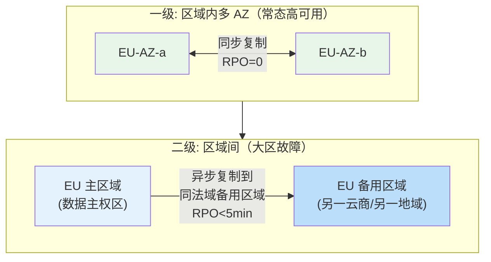
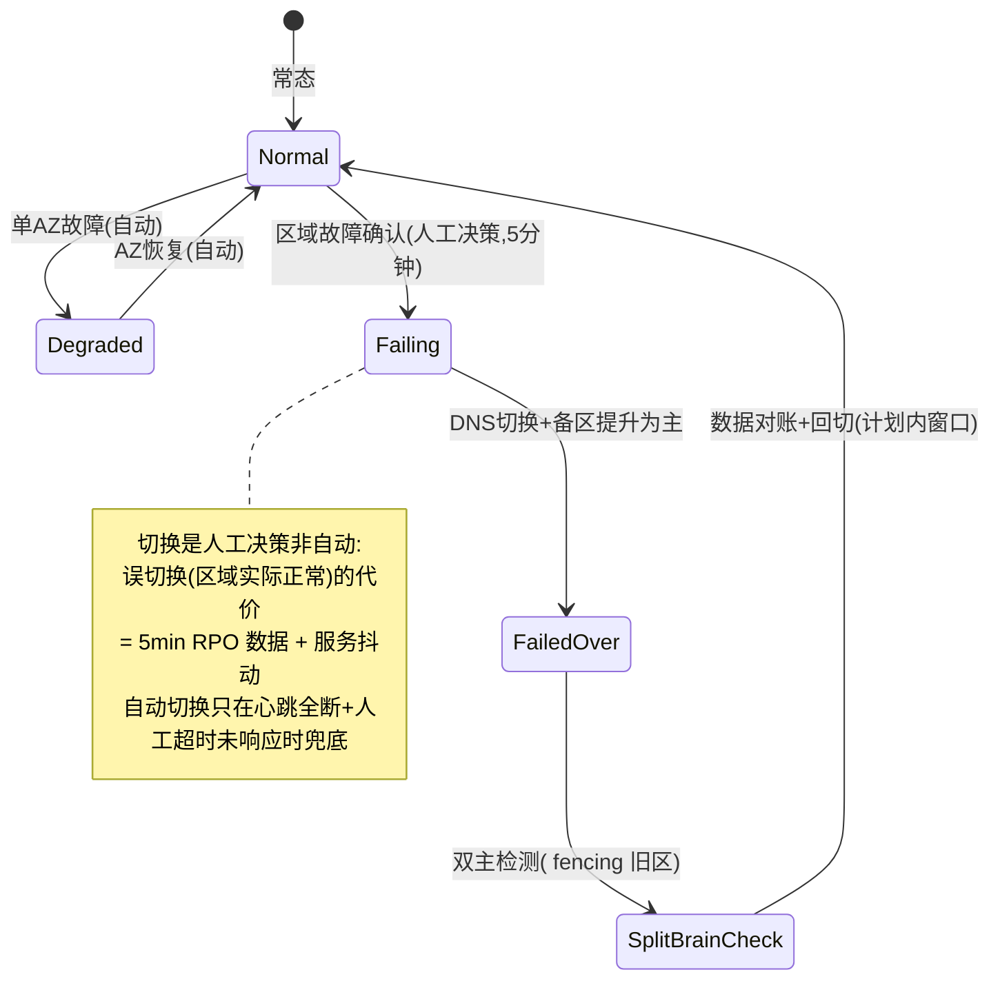
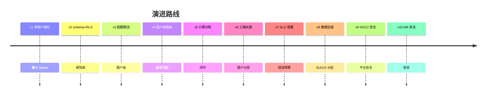

# 项目 07：跨国多租户 SaaS Agent 平台 — 10-迭代九：DR 与多活（收官）

> **定位**：收官迭代——区域内容灾与跨区容灾的两级体系：数据主权约束下的 DR 设计、RTO/RPO 承诺、多活演进与容灾演练制度化。本文给出**完整可手写代码**（一行不省略）。
>
> 「遇到阻塞？→ [教程 28-部署与运维 §DR 与多活]、[教程 24-容错与弹性设计]；API 真实性以 [附录 12-SpringAI2-API基准] 为准」

---

## 1. 四问

| 问 | 答 |
|----|----|
| **新增了什么需求** | ① 两级 DR（区域内多 AZ + 区域间故障切换）② fencing 隔离旧主 ③ 人工决策切换 + Runbook 化 ④ 演练制度化 |
| **影响了哪些模块** | 新增 dr 模块（fencing/切换协调）；写入口接写令牌校验；部署拓扑（多 AZ/备区）；监控接心跳与对账 |
| **架构如何演进** | 区内自愈 → **两级容灾**：区域内多 AZ 常态高可用 + 区域间同法域故障切换 |
| **上一版痛点是什么** | 区域级故障无预案；驻留约束（EU 数据不能备到 US）与容灾冗余矛盾 |

## 2. 两级容灾体系



**关键决策（ADR-230）：跨区 DR 只在同法域内做**。EU 数据备到 US 区域直接违反驻留承诺——EU 的备区选法兰克福/阿姆斯特丹（同 EU 法域的不同地域），US 区备美东/美西。法域内没有备用区域可用时（理论极端），该区降级为"区内多 AZ + 更激进的备份频率 + 书面风险披露"，而不是偷偷跨境。

## 3. RTO/RPO 分级承诺

| 故障级别 | RTO | RPO | 机制 |
|---------|-----|-----|------|
| 实例故障 | 0（自愈） | 0 | K8s 重调度 |
| AZ 故障 | < 5 min | 0（同步复制） | 多 AZ + 自动切换 |
| 区域故障 | < 30 min | < 5 min（异步） | 备区接管 + DNS 切换 |
| 全局服务故障 | < 15 min | 0（无状态） | 全局服务双活 |

**SLA 与 DR 的联动**：Enterprise SLA 的 99.9% 月度承诺，按每月 43 分钟预算倒推——区域级故障（30 分钟 RTO）一年最多容忍一次还要其他月份全绿，所以**演练与预防性维护比灾后恢复更重要**。

## 4. 完整代码（照抄即可，一行不省略）

### 4.1 数据复制拓扑

| 数据 | 复制方式 | 跨法域？ |
|------|---------|---------|
| 会话/消息/用量事件 | PostgreSQL 流复制（AZ 间同步 + 区域间异步） | 否 |
| 向量库 | PgVector 随主库复制 | 否 |
| Redis（配额/会话缓存） | 区域间不复制——缓存可重建，DR 后冷启动 | - |
| 租户元数据（全局服务） | 双区双主（CRDT 式合并或单主+快速切换） | 元数据无内容，可跨境 |

### 4.2 切换流程（Runbook 化）



### 4.3 `FencingService.java`（先隔离旧主，再提升新主）

```java
package com.acme.saas.dr;

import org.springframework.data.redis.core.ReactiveRedisTemplate;
import org.springframework.stereotype.Component;
import reactor.core.publisher.Mono;

/**
 * fencing：切换前撤销旧主写令牌，再提升新主。
 * 双主比宕机更危险（脑裂写坏两边数据）——fencing 优先是铁律。
 */
@Component
public class FencingService {

    private final ReactiveRedisTemplate<String, String> redis;

    public FencingService(ReactiveRedisTemplate<String, String> redis) {
        this.redis = redis;
    }

    /** 撤销旧主的写令牌（各写入口在事务前校验令牌）。 */
    public Mono<Void> revokeWriteToken(String region) {
        return redis.opsForValue().set(fencingKey(region), "REVOKED").then();
    }

    /** 提升新主：发放写令牌。 */
    public Mono<Void> grantWriteToken(String region) {
        return redis.opsForValue().set(fencingKey(region), "GRANTED").then();
    }

    /** 写入口调用：令牌非 GRANTED 拒绝写入（fail-closed）。 */
    public Mono<Boolean> canWrite(String region) {
        return redis.opsForValue().get(fencingKey(region))
                .defaultIfEmpty("REVOKED")          // 默认拒绝，防脑裂双写
                .map("GRANTED"::equals);
    }

    private String fencingKey(String region) {
        return "fencing:write-token:" + region;
    }
}
```

### 4.4 `FailoverCoordinator.java`（人工决策 + fencing + DNS 切换）

```java
package com.acme.saas.dr;

import org.springframework.stereotype.Component;
import reactor.core.publisher.Mono;

import java.time.Duration;
import java.time.Instant;

/** 区域切换协调器：人工决策（Runbook 触发）+ fencing 优先 + 提升新主（ADR-241）。 */
@Component
public class FailoverCoordinator {

    private final FencingService fencing;
    private final DnsSwitch dns;

    public FailoverCoordinator(FencingService fencing, DnsSwitch dns) {
        this.fencing = fencing;
        this.dns = dns;
    }

    public Mono<FailoverResult> failover(String failedRegion, String standbyRegion) {
        Instant start = Instant.now();
        return fencing.revokeWriteToken(failedRegion)          // 1) 隔离旧主
                .then(fencing.grantWriteToken(standbyRegion))  // 2) 提升新主
                .then(dns.switchTraffic(standbyRegion))        // 3) DNS 切流量
                .thenReturn(new FailoverResult(failedRegion, standbyRegion,
                        Duration.between(start, Instant.now()).toMillis()));
    }

    public record FailoverResult(String failedRegion, String standbyRegion, long durationMs) {}
}
```

```java
package com.acme.saas.dr;

import reactor.core.publisher.Mono;

/** DNS/流量切换：真实实现接 DNS 提供商 API / 全局负载均衡器。 */
public interface DnsSwitch {

    Mono<Void> switchTraffic(String region);
}
```

### 4.5 演练制度化（收官也是常态）

```java
package com.acme.saas.dr;

import java.time.Instant;

/** 演练记录：场景 + 执行时间 + RTO/RPO 实测 + 是否通过。 */
public record DrillRecord(String scenario, Instant executedAt,
                          long rtoMillis, long rpoMillis, boolean passed) {}
```

```java
package com.acme.saas.dr;

import org.springframework.stereotype.Component;

import java.util.ArrayList;
import java.util.List;

/** 演练台账：每月 AZ 宕机自动切换、每季桌面推演、每年真实区域切换（ADR-242）。 */
@Component
public class DrillService {

    private final List<DrillRecord> history = new ArrayList<>();

    public void record(DrillRecord record) {
        history.add(record);
    }

    public List<DrillRecord> recent() {
        return List.copyOf(history);
    }
}
```

| 频率 | 剧本 |
|------|------|
| 每月 | AZ 宕机自动切换（生产环境真实注入） |
| 每季 | 区域切换桌面推演（Runbook 走查+部分实操） |
| 每年 | 真实区域切换演练（选低峰期，客户提前公告） |

## 5. 验收标准（项目收官验收）

| # | 验收项 | 标准 |
|---|--------|------|
| 1 | AZ 切换 | 月度演练：AZ 宕机 0 感知（RPO=0，自动） |
| 2 | 区域切换 | 年度演练：RTO < 30min、RPO < 5min、fencing 验证、数据对账零差异 |
| 3 | 驻留合规 | 全部 DR 复制链路零跨法域（审计网络拓扑） |
| 4 | Runbook | 每个故障级别有 runbook；年度演练按 runbook 执行（非个人英雄主义） |
| 5 | SLA 兑现 | Enterprise 承诺可用性连续一季度达成 |

## 6. 本迭代的 ADR

| # | 决策 | 理由 |
|---|------|------|
| ADR-230 | 跨区 DR 只在同法域内做 | EU 数据备到 US = 违反驻留承诺；法域内无备区时降级为"区内多 AZ + 书面风险披露" |
| ADR-241 | 切换人工决策 + fencing 优先 | 误切换代价 = 5min RPO 数据 + 服务抖动；双主比宕机更危险 |
| ADR-242 | 演练制度化（月/季/年） | 区域级故障年预算只容忍一次，演练与预防比灾后恢复更重要 |

## 7. 项目 07 总结



十个迭代完成 SaaS 平台的完整弧线：**雏形 → 硬隔离 → 限量 → 分级 → 计费 → 灰度 → 承诺（SLO）→ 主权（驻留）→ 审计（SOC 2）→ 生死（DR）**。30+ 条 ADR 中最有复用价值的三个：ADR-205（RLS 事务级绑定的教训）、ADR-214/215（计费三副本与差异冻结）、ADR-224（宁可慢不可违的合规降级哲学）。

→ [11-核心代码讲解.md](11-核心代码讲解.md)
