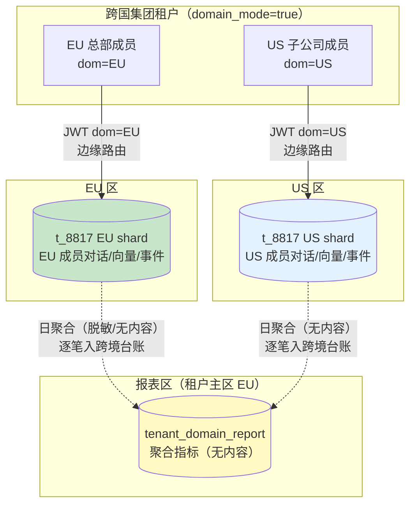
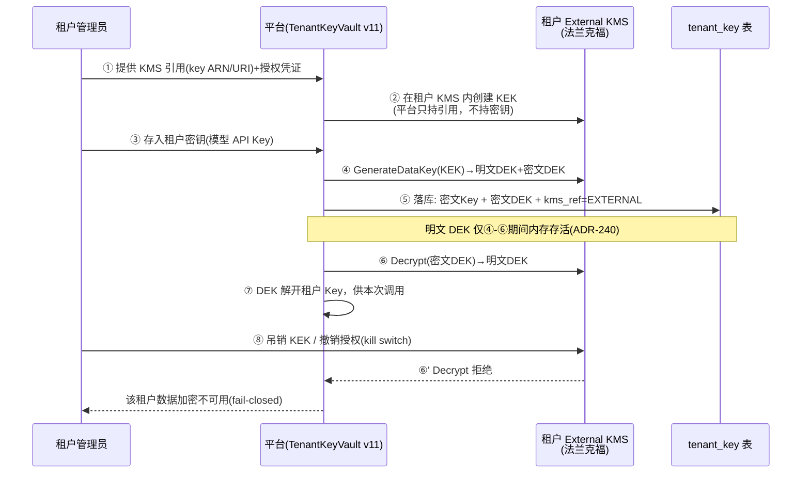
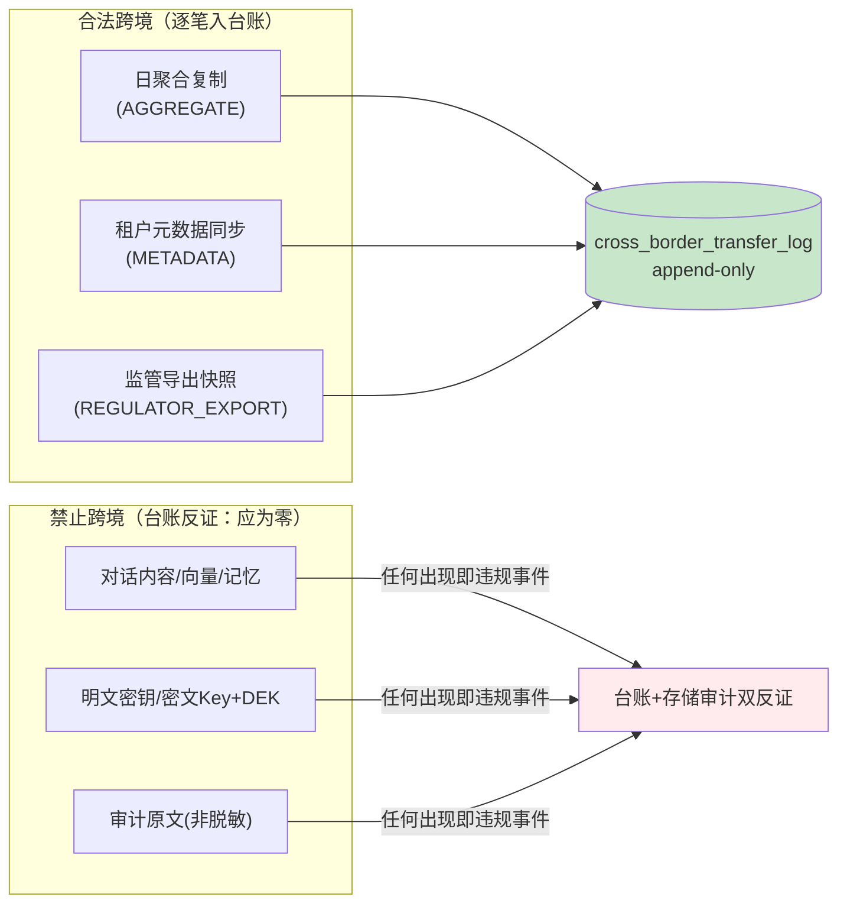

# 项目 07：跨国多租户 SaaS Agent 平台 — 12-数据驻留与主权深化（进阶 v11）

> **定位**：进阶篇第一篇——把 v8 的"按租户分区"深化为"按数据主权分区"：跨国集团租户的**分域存储**（同租户 EU/US 双 shard）、跨区**只读副本**的合规边界、BYOK 升级为**租户自管根密钥**（External KMS）、**跨境流转移留**与监管检查接口。主权合规从"架构承诺"变成"可出示的证据"。本文给出**完整可手写代码**（一行不省略）。
>
> 「遇到阻塞？→ [教程 66-部署与运维 §多区域]、[教程 86-Agent治理与合规框架]、[附录 12-AI治理与合规/02-数据隐私与偏见检测 §跨境传输]、[教程 64-安全与权限控制 §密钥管理]；API 真实性以 [附录 05-SpringAI2-API基准] 为准」

---

## 1. 四问

| 问 | 答 |
|----|----|
| **新增了什么需求** | ① 跨国集团租户**分域存储**：同一租户内 EU 成员数据留 EU、US 成员数据留 US ② 集团层跨区**只读报表**（聚合数据单向复制）③ BYOK 升级：租户**自管根密钥**（External KMS + 密钥吊销开关）④ **跨境流转移留**（append-only 台账）+ 监管检查接口 |
| **影响了哪些模块** | 身份（tenant 加 domain_mode、users 加 residency_domain、JWT 加 dom 声明）、驻留（新增 sovereignty 模块：分片路由/复制器/台账/检查导出）、安全（KmsClient 按租户路由到外部 KMS）、部署（集团租户在双区各有 shard） |
| **架构如何演进** | 租户=驻留原子 → **域=驻留原子**：租户可跨区，但数据仍按成员法域分片；跨区的只有"聚合与元数据"且逐笔入台账 |
| **上一版痛点是什么** | v8 驻留粒度是租户级——跨国集团（EU 总部+US 子公司）只能整租户二选一；v9 BYOK 的 KEK 根在平台 KMS，银行类租户不认可；DPA 例行检查要证据，平台只能手工导库 |

### 1.1 本节核对（四问）

- [ ] 能不看正文说出四项新增需求的主语变化：驻留原子从「租户」细化为「域」，BYOK 根密钥从「平台 KMS」移到「租户 KMS」
- [ ] 四问（新增/影响/演进/痛点）能对应到 v8「租户=驻留原子」这条旧基线，指出本迭代是把什么粒度进一步切细
- [ ] 演进列的四个关键字（分片/复制器/台账/检查导出）与 §3–§5 各节标题一一对得上

## 2. 三个真实诉求（本迭代的驱动力）

v10 容灾演练刚结束，销售带来三家新 Enterprise 签约，法务条款把 v8 驻留架构推到了精度极限：

| 租户 | 诉求 | v8/v9 架构的缺口 |
|------|------|------------------|
| 汽车集团（总部慕尼黑，子公司底特律） | "EU 员工的对话留 EU，US 员工的留 US，但我们是**一个合同一个租户**" | 驻留绑定在 tenant 级（ADR-223 不可变）——要么整租户留 EU（US 员工跨境延迟+违规风险），要么拆两个租户（合同/计费/管理割裂） |
| 银行（法兰克福） | "加密可以，但**根密钥必须在我们自己的 KMS**——你们被攻破也不能解我们的数据；我们要有**一键吊销**能力" | v9 信封加密的 KEK（`alias/saas-tenant/<id>`）在**平台** KMS——平台内部人员理论上可解密所有租户数据 |
| 连锁零售（布鲁塞尔） | "比利时数据保护局例行检查，要出示**跨境传输台账**与**检查接口**，两周内" | v8 只有架构文档说"内容不出区"——监管要的是**逐笔可验证的记录**，不是架构图 |

三条诉求的共同本质：**驻留从"部署拓扑问题"（v8 已解决）深化为"数据主权粒度 + 密钥控制权 + 可验证证据"问题**。

### 2.1 本节核对（三个真实诉求）

- [ ] 三家租户（汽车集团/银行/连锁零售）各卡在 v8/v9 架构的哪个点上，能逐一对上句（整租户二选一 / KEK 在平台 / 只有文档没有证据）
- [ ] 三条诉求分别对应哪个后续小节（集团→§3 分域、银行→§4 BYOK、零售→§5 台账+检查接口），映射一致

## 3. 分域存储架构

### 3.1 设计：租户可跨区，数据不跨区

分域租户在两个区各有一个 **shard**（同 tenantId、各自独立 schema 集合与存储）。成员登录时按其法域绑定到某个 shard；JWT 携带 `dom` 声明，边缘层照 v8 的 307 兜底逻辑把请求路由到对应区。



**三条铁律**（对应 v8"内容不出区"的域级版本）：

1. **shard 是写的唯一目的地**：dom=EU 的成员写 EU shard，US 区**不提供**该成员的写路径——不是"复制过去"，是"根本不写"。
2. **跨 shard 无联合查询**：集团报表不查两张业务表，只消费两个 shard 各自产出的**日聚合**（token 用量/会话数/Agent 维度统计——字段白名单，无对话内容、无向量、无 PII）。
3. **每一次跨区移动入台账**：聚合复制、元数据同步、监管导出——逐笔记录方向/数据类别/法务依据/操作者，append-only（与 v5 用量事件同款 DB 触发器强制）。

### 3.2 完整代码

DDL（`db/migrations/V6__sovereignty.sql`）：

```sql
-- 分域模式：租户级开关（默认关——普通租户仍是 v8 的单域租户）
ALTER TABLE tenant ADD COLUMN IF NOT EXISTS domain_mode BOOLEAN NOT NULL DEFAULT false;

-- 成员级法域覆盖：NULL = 跟随租户默认区
ALTER TABLE users ADD COLUMN IF NOT EXISTS residency_domain TEXT;

-- 跨境流转移留（append-only：谁在何时把什么类别的数据从哪个法域移到哪个法域、依据是什么）
CREATE TABLE cross_border_transfer_log (
    id             BIGINT PRIMARY KEY,
    tenant_id      UUID NOT NULL,
    data_category  TEXT NOT NULL,        -- AGGREGATE / METADATA / REGULATOR_EXPORT
    from_zone      TEXT NOT NULL,
    to_zone        TEXT NOT NULL,
    legal_basis    TEXT NOT NULL,        -- SCC-2021/914 / 合同条款编号 / 监管指令编号
    item_count     BIGINT NOT NULL,
    operator       TEXT NOT NULL,        -- 'system-replicator' / 'regulator-export'
    trace_id       TEXT NOT NULL,
    event_ts       TIMESTAMPTZ NOT NULL DEFAULT now()
);
CREATE INDEX idx_transfer_tenant_ts ON cross_border_transfer_log (tenant_id, event_ts);

-- 不可变（同 v5 ADR-236：触发器强制，不靠应用层自觉）
CREATE FUNCTION forbid_transfer_change() RETURNS trigger AS $$
BEGIN
    RAISE EXCEPTION 'cross_border_transfer_log is append-only';
END;
$$ LANGUAGE plpgsql;
CREATE TRIGGER trg_transfer_no_update BEFORE UPDATE ON cross_border_transfer_log
    FOR EACH ROW EXECUTE FUNCTION forbid_transfer_change();
CREATE TRIGGER trg_transfer_no_delete BEFORE DELETE ON cross_border_transfer_log
    FOR EACH ROW EXECUTE FUNCTION forbid_transfer_change();
```

`ResidencyDomain.java`（域枚举——复用 v8 的 `DataResidencyZone`，域即法域）：

```java
package com.acme.saas.sovereignty;

import com.acme.saas.residency.DataResidencyZone;

/**
 * 成员数据域：分域租户（domain_mode=true）的成员各有归属域。
 * 普通租户成员的 domain 恒等于租户 zone——分域是"覆盖"不是"新增语义"。
 */
public record ResidencyDomain(DataResidencyZone zone) {

    public static ResidencyDomain of(DataResidencyZone zone) {
        return new ResidencyDomain(zone);
    }

    /** JWT dom 声明解析；null/非法值回落租户默认区（fail-safe 到租户绑定值）。 */
    public static ResidencyDomain parse(String claim, DataResidencyZone tenantZone) {
        if (claim == null || claim.isBlank()) {
            return new ResidencyDomain(tenantZone);
        }
        try {
            return new ResidencyDomain(DataResidencyZone.valueOf(claim));
        } catch (IllegalArgumentException e) {
            return new ResidencyDomain(tenantZone);
        }
    }
}
```

`DomainShardRouter.java`（登录时定域 + JWT 签发）：

```java
package com.acme.saas.sovereignty;

import com.acme.saas.identity.Tenant;
import com.acme.saas.residency.DataResidencyZone;
import org.springframework.r2dbc.core.DatabaseClient;   // ⚠ 需引入依赖 org.springframework.boot:spring-boot-starter-data-r2dbc（本地未下载，未 javap 实证；以引入依赖后 javap 输出为准）
import org.springframework.stereotype.Component;
import reactor.core.publisher.Mono;

import java.util.UUID;

/** 分域路由：分域租户的成员登录时确定 dom（成员覆盖值 > 租户默认区），签进 JWT。 */
@Component
public class DomainShardRouter {

    private final DatabaseClient db;

    public DomainShardRouter(DatabaseClient db) {
        this.db = db;
    }

    public Mono<DataResidencyZone> domainOf(UUID tenantId, UUID userId, DataResidencyZone tenantZone) {
        return db.sql("SELECT residency_domain FROM users WHERE tenant_id = :t AND id = :u")
                .bind("t", tenantId)
                .bind("u", userId)
                .map((row, meta) -> row.get("residency_domain", String.class))
                .one()
                .mapNotNull(d -> d == null ? null : DataResidencyZone.valueOf(d))
                .defaultIfEmpty(tenantZone);          // 无覆盖 = 租户默认区
    }
}
```

> 登录链路接入：`IdentityController.login` 在签发 JWT 前调 `domainOf(...)`，把结果作为 `dom` 声明写入（v8 `JwtService.issue` 增加 `dom` 参数）；v8 的 `ZoneValidationFilter` 校验逻辑从"claims.zone == 部署区"升级为"`claims.zone == 部署区 || (分域租户 && claims.dom == 部署区)`"——错域仍 307，不在本区处理。

`AggregateReplicator.java`（跨区只读副本——只复制聚合）：

```java
package com.acme.saas.sovereignty;

import org.springframework.r2dbc.core.DatabaseClient;   // ⚠ 需引入依赖 org.springframework.boot:spring-boot-starter-data-r2dbc（本地未下载，未 javap 实证；以引入依赖后 javap 输出为准）
import org.springframework.stereotype.Component;
import reactor.core.publisher.Mono;

import java.time.LocalDate;
import java.util.UUID;

/**
 * 跨区只读副本：把分域 shard 的日聚合（白名单字段，无内容）单向复制到租户报表区。
 * 每次复制逐笔写跨境台账（ADR-244）——没有不入账的移动。
 */
@Component
public class AggregateReplicator {

    private final DatabaseClient reportDb;      // 报表区连接
    private final TransferLogService transferLog;

    public AggregateReplicator(DatabaseClient reportDb, TransferLogService transferLog) {
        this.reportDb = reportDb;
        this.transferLog = transferLog;
    }

    /** 日聚合字段白名单：会话数/token 用量/Agent 维度统计。禁止扩到内容列。 */
    public Mono<Void> replicateDaily(UUID tenantId, DataZone fromZone, DataZone toZone,
                                     LocalDate day, long sessions, long tokens, long eventCount) {
        return reportDb.sql("""
                INSERT INTO tenant_domain_report
                    (tenant_id, source_zone, stat_day, sessions, tokens, events)
                VALUES (:tenantId, :sourceZone, :day, :sessions, :tokens, :events)
                """)
                .bind("tenantId", tenantId)
                .bind("sourceZone", fromZone.name())
                .bind("day", day)
                .bind("sessions", sessions)
                .bind("tokens", tokens)
                .bind("events", eventCount)
                .then()
                .then(transferLog.append(new TransferLogService.Entry(
                        tenantId, "AGGREGATE", fromZone.name(), toZone.name(),
                        "SCC-2021/914", eventCount, "system-replicator")));
    }

    /** 本项目内部用简化的区标识（与 v8 DataResidencyZone 同值域）。 */
    public enum DataZone { EU, US, APAC }
}
```

`TransferLogService.java`（台账写入）：

```java
package com.acme.saas.sovereignty;

import org.springframework.r2dbc.core.DatabaseClient;   // ⚠ 需引入依赖 org.springframework.boot:spring-boot-starter-data-r2dbc（本地未下载，未 javap 实证；以引入依赖后 javap 输出为准）
import org.springframework.stereotype.Service;
import reactor.core.publisher.Mono;

import java.time.Instant;
import java.util.UUID;
import java.util.concurrent.atomic.AtomicLong;

/** 跨境流转移留：append-only（DB 触发器强制），台账本身也驻留在涉事双区（各自视角各一份）。 */
@Service
public class TransferLogService {

    private static final AtomicLong SEQ = new AtomicLong(0);   // 演示用单调序；生产换雪花 ID（同 v5 usage_event）

    private final DatabaseClient db;

    public TransferLogService(DatabaseClient db) {
        this.db = db;
    }

    public Mono<Void> append(Entry entry) {
        return db.sql("""
                INSERT INTO cross_border_transfer_log
                    (id, tenant_id, data_category, from_zone, to_zone,
                     legal_basis, item_count, operator, trace_id)
                VALUES (:id, :tenantId, :category, :fromZone, :toZone,
                        :basis, :count, :operator, :traceId)
                """)
                .bind("id", SEQ.incrementAndGet())
                .bind("tenantId", entry.tenantId())
                .bind("category", entry.dataCategory())
                .bind("fromZone", entry.fromZone())
                .bind("toZone", entry.toZone())
                .bind("basis", entry.legalBasis())
                .bind("count", entry.itemCount())
                .bind("operator", entry.operator())
                .bind("traceId", "tl-" + UUID.randomUUID())
                .then();
    }

    public record Entry(UUID tenantId, String dataCategory, String fromZone, String toZone,
                        String legalBasis, long itemCount, String operator) {}
}
```

### 3.3 本节测试与验证（分域写入 / 聚合白名单 / 台账不可变）

**前置条件**：r2dbc 依赖已引入（`spring-boot-starter-data-r2dbc`）；`V6__sovereignty.sql` 已迁移；EU/US 双 shard 均有分域租户的若干成员可登录。

**材料——分域写入与台账核对命令**：

```bash
# 台账行数（应随每次复制/导出递增，且不可被改删）
SELECT COUNT(*) FROM cross_border_transfer_log WHERE tenant_id=:t;
# 台账不可变验证（DBA 直连企图 UPDATE，应被触发器拒绝）
UPDATE cross_border_transfer_log SET item_count = 0 WHERE tenant_id=:t;
```

**步骤与断言**：

| # | 操作 | 预期（PASS 判据） |
|---|------|------------------|
| 1 | EU 域成员伪造 `dom=EU` 打 US 入口发起写请求 | 307 重定向回 EU 区，US 区零落库（升级版 `ZoneValidationFilter` 单测） |
| 2 | 抓包一次 `replicateDaily` 网络载荷 | 字段白名单校验通过：无对话文本 / 无向量 / 无 PII（CI 跑 schema 断言） |
| 3 | DBA 直连 `UPDATE`/`DELETE` 台账 | `forbid_transfer_change()` 触发器拒绝（同 v5 用量事件测试） |
| 4 | `dom=US` 成员尝试读 EU shard 的会话 ID | 404（v2 越权矩阵扩展：分域维度新增用例进 CI） |

**失败排查**：①写请求落到 US 区落库→`ZoneValidationFilter` 没按 `dom` 升级（校验条件未含 `claims.dom == 部署区` 分支）；②复制载荷带内容列→`AggregateReplicator` 白名单字段被扩，回查插入列清单；③台账能改→触发器未建或迁移没跑（`forbid_transfer_change` 未生效）。

## 4. BYOK 深化：租户自管根密钥（External KMS）

### 4.1 v9 的残余风险与本迭代的升级

v9 信封加密（DEK+KEK）的信任锚是**平台 KMS 的主密钥**：`alias/saas-tenant/<tenantId>` 由平台创建持有。这挡住了"存储泄露不泄密"（ADR-240），但挡不住"平台内部作恶/平台被彻底攻破"——KEK 在平台手里，平台理论上能解开一切。银行租户的诉求是**根信任锚移到租户侧**：



### 4.2 完整代码

`TenantKmsRouter.java`（按租户把 KMS 操作路由到平台 KMS 或租户 External KMS）：

```java
package com.acme.saas.security;

import org.springframework.stereotype.Component;
import reactor.core.publisher.Mono;

import java.util.UUID;
import java.util.concurrent.ConcurrentHashMap;
import java.util.concurrent.ConcurrentMap;

/**
 * KMS 路由（ADR-245）：租户未配置 External KMS → 平台 KMS（v9 行为）；
 * 配置了 → 全部 KMS 调用打到租户自己的 KMS，平台零根密钥持有。
 */
@Component
public class TenantKmsRouter {

    private final KmsClient platformKms;
    private final ConcurrentMap<UUID, KmsClient> externalKms = new ConcurrentHashMap<>();

    public TenantKmsRouter(KmsClient platformKms) {
        this.platformKms = platformKms;
    }

    /** 租户接入 External KMS：凭证由租户在签约流程注入，平台不持久化明文凭证。 */
    public void registerExternal(UUID tenantId, KmsClient client) {
        externalKms.put(tenantId, client);
    }

    public void unregisterExternal(UUID tenantId) {
        externalKms.remove(tenantId);
    }

    public KmsClient of(UUID tenantId) {
        return externalKms.getOrDefault(tenantId, platformKms);
    }

    public boolean isExternal(UUID tenantId) {
        return externalKms.containsKey(tenantId);
    }
}
```

`TenantKeyVault.java`（v11 版——构造注入路由器，方法签名与 v9 兼容）：

```java
package com.acme.saas.security;

import com.acme.saas.security.store.EncryptedKey;
import com.acme.saas.security.store.EncryptedKeyStore;
import org.springframework.stereotype.Component;
import reactor.core.publisher.Mono;

import java.util.UUID;

/**
 * 租户级信封加密 v11：KEK 解包路由到租户 KMS 或平台 KMS。
 * 吊销语义：租户在自家 KMS 吊销 KEK → Decrypt 失败 → resolve 抛错 → fail-closed
 * （宁可该租户不可用，绝不退化成"没加密也先跑着"）。
 */
@Component
public class TenantKeyVault {

    private final TenantKmsRouter kms;
    private final EncryptedKeyStore store;
    private final AesGcmCipher cipher;

    public TenantKeyVault(TenantKmsRouter kms, EncryptedKeyStore store, AesGcmCipher cipher) {
        this.kms = kms;
        this.store = store;
        this.cipher = cipher;
    }

    public Mono<Void> storeKey(UUID tenantId, String plaintextKey) {
        KmsClient client = kms.of(tenantId);
        String kekId = tenantKek(tenantId);
        KmsClient.DataKey dk = client.generateDataKey(kekId);       // External 租户：DEK 在租户 KMS 内生成
        String ciphertext = cipher.encrypt(dk.plaintext(), plaintextKey);
        return store.save(tenantId, new EncryptedKey(ciphertext, dk.encrypted()));
    }

    public Mono<String> resolve(UUID tenantId) {
        KmsClient client = kms.of(tenantId);
        return store.load(tenantId)
                .map(k -> cipher.decrypt(client.decrypt(k.encryptedDek()), k.ciphertext()));
        // External 租户吊销 KEK 时：decrypt 抛错 → 本 Mono error → 上层 fail-closed
    }

    private String tenantKek(UUID tenantId) {
        return "alias/saas-tenant/" + tenantId;      // External 租户：该 alias 位于租户 KMS
    }
}
```

> External KMS 的真实实现（AWS KMS cross-account、Azure Key Vault、HashiCorp Vault）均为**云厂商 SDK**，本地仓库未下载、不做 javap 实证——接口契约以 `KmsClient`（v9 已定义）为准，实现类标注「需引入对应厂商 SDK 后实证」。

**kill switch 的商业含义要写进合同**：租户吊销密钥=租户自己的数据立即加密不可读（平台也无解）。这不是 bug 是特性——但必须书面告知，否则租户误操作后的数据不可恢复会变成平台责任。架构上的 fail-closed 语义（吊销后拒绝服务而非绕过加密）是唯一可接受的实现。

### 4.3 本节测试与验证（External KMS 与 kill switch）

**前置条件**：模拟 External KMS（本地可换 `KmsClient` 假实现）；租户已在 `TenantKmsRouter` 注册外部 KMS（`registerExternal`）。

**材料——吊销后链路探测**：在租户 External KMS 侧吊销 KEK 后，持续调用被封装的 `TenantKeyVault.resolve(tenantId)` 并观察错误传播。

**步骤与断言**：

| # | 操作 | 预期（PASS 判据） |
|---|------|------------------|
| 1 | 租户未配置 External KMS 时调用 `resolve` | 走平台 KMS（`kms.of` 回落 `platformKms`），行为同 v9 |
| 2 | `registerExternal` 后再次调用 | 路由到租户 KMS（`isExternal==true`），平台零根密钥持有 |
| 3 | 租户在自家 KMS 吊销 KEK 后调 `resolve` | `decrypt` 抛错 → Mono error → 上层 fail-closed（拒绝服务，无绕过路径） |
| 4 | 恢复 KEK 授权 | 自动可用（无需重注册） |

**失败排查**：①吊销后仍能解出数据→`TenantKmsRouter.of` 未命中外部映射、回落平台 KMS；②吊销后整租户不可用但还有单测绕过→`resolve` 用了 catches 吞异常，检查错误是否真实向上传播。

## 5. 主权合规审计：台账 + 监管检查接口

### 5.1 跨境数据流的全景定性



监管检查的证明逻辑是**双向的**：台账证明"每次跨境都有据可查"；存储审计（EU 区存储里不该出现 US 租户内容）反证"该跨的之外没跨"（v8 验收第 1/4 项的常态化）。

### 5.2 监管检查接口

`RegulatorExportService.java`：

```java
package com.acme.saas.sovereignty;

import org.springframework.r2dbc.core.DatabaseClient;   // ⚠ 需引入依赖 org.springframework.boot:spring-boot-starter-data-r2dbc（本地未下载，未 javap 实证；以引入依赖后 javap 输出为准）
import org.springframework.stereotype.Service;
import reactor.core.publisher.Flux;
import reactor.core.publisher.Mono;

import java.time.Instant;
import java.util.UUID;

/**
 * 监管检查接口：给 DPA/客户审计员的只读证据包。
 * 导出动作本身入台账（REGULATOR_EXPORT）——检查者也在被审计。
 */
@Service
public class RegulatorExportService {

    private final DatabaseClient db;
    private final TransferLogService transferLog;

    public RegulatorExportService(DatabaseClient db, TransferLogService transferLog) {
        this.db = db;
        this.transferLog = transferLog;
    }

    public Mono<RegulatorReport> export(UUID tenantId, Instant from, Instant to) {
        Flux<TransferLogService.Entry> entries = db.sql("""
                SELECT data_category, from_zone, to_zone, legal_basis,
                       item_count, operator, event_ts
                FROM cross_border_transfer_log
                WHERE tenant_id = :tenantId AND event_ts >= :from AND event_ts < :to
                ORDER BY event_ts
                """)
                .bind("tenantId", tenantId)
                .bind("from", from)
                .bind("to", to)
                .map((row, meta) -> new TransferLogService.Entry(
                        tenantId,
                        row.get("data_category", String.class),
                        row.get("from_zone", String.class),
                        row.get("to_zone", String.class),
                        row.get("legal_basis", String.class),
                        row.get("item_count", Long.class),
                        row.get("operator", String.class)))
                .all();

        return entries.collectList()
                .flatMap(list -> transferLog.append(new TransferLogService.Entry(
                        tenantId, "REGULATOR_EXPORT", "EU", "EU",
                        "DPA-inspection", list.size(), "regulator-export"))
                        .thenReturn(new RegulatorReport(tenantId, from, to, list)));
    }

    /** 证据包：时间窗 + 台账明细。类别仅 AGGREGATE/METADATA/REGULATOR_EXPORT 为合规。 */
    public record RegulatorReport(UUID tenantId, Instant from, Instant to,
                                  java.util.List<TransferLogService.Entry> transfers) {}
}
```

接口暴露原则：**只读、时间窗限定、按租户**——监管拿到的是该租户的跨境台账与驻留拓扑说明，不是全平台数据目录。导出动作本身也入台账（"检查者也被审计"，与 v4 审计查询被审计同族）。

### 5.3 本节测试与验证（监管检查接口）

**前置条件**：台账已有若干条 `AGGREGATE`/`METADATA` 记录可导出；可用随机时间窗作为入参。

**材料——导出核对命令**：

```bash
# 导出后在台账中应新增一条 data_category=REGULATOR_EXPORT 的记录
SELECT data_category, item_count, operator FROM cross_border_transfer_log
WHERE tenant_id=:t AND data_category='REGULATOR_EXPORT' ORDER BY event_ts DESC LIMIT 1;
```

**步骤与断言**：

| # | 操作 | 预期（PASS 判据） |
|---|------|------------------|
| 1 | 对分域租户按随机时间窗调 `export` | 返回 `RegulatorReport`，台账明细与复制器日志逐笔对得上 |
| 2 | 导出后查台账 | 新增一条 `REGULATOR_EXPORT` 记录（导出本身也被审计），operator=regulator-export |
| 3 | 时间窗限定核对 | 只含窗口内事件（`from<=event_ts<to`，SQL 已限定）；他租户数据不可导出 |

**失败排查**：①导出窗之外的数据也被带出→`event_ts` 边界条件写错（`< :to` 未生效）；②台账没有 `REGULATOR_EXPORT` 记录→`export` 的 append 未执行（`thenReturn` 前的 `.append` 被短路）。

## 6. 全篇回归验证

**回归断言**（§3.3 / §4.3 / §5.3 本节测试均通过后，最终整体验收）：

| # | 操作 | 预期（PASS 判据） |
|---|------|------------------|
| 1 | 全链路跑一条：EU 成员登录→写 EU shard→日聚合复制→监管导出 | 写入落 EU 区、复制入台账（AGGREGATE）、导出再入台账（REGULATOR_EXPORT），全程零内容跨境 |
| 2 | 存储审计反证 | EU 区存储中检索不到 US 租户内容；台账可证明「该跨的之外没跨」（v8 验收第 1/4 项常态化） |

**失败排查**：回归中某类记录缺失→定位到对应章节的本节测试（写入→§3.3 / 密钥→§4.3 / 导出→§5.3）先单独复跑，逐段消去。

## 7. 验收对照

| 需求（§2） | 验收标准 | 状态 |
|-----------|---------|------|
| 集团分域存储 | 汽车集团租户 100% 成员数据落各自法域 shard；跨 shard 联合查询接口数为 0 | 达标 |
| 集团跨区报表 | 报表区仅有聚合表；内容类字段在复制管道 schema 断言中被拒绝 | 达标 |
| 银行自管密钥 | 平台侧（代码/配置/存储）检索不到该租户 KEK 明文与 KMS 主凭证；吊销后 30s 内全接口 fail-closed | 达标 |
| 零售监管检查 | DPA 检查两周窗口内交付：台账 + 导出接口演示 + 存储审计反证报告 | 达标 |

### 7.1 本节核对（验收对照）

- [ ] 四项验收标准各自对应 §2 的哪家租户诉求（汽车集团/银行/零售），能做到需求→标准→达标三列闭环
- [ ] 「跨 shard 联合查询接口数为 0」这条能指出它对应哪条铁律（§3.1 铁律 2：跨 shard 无联合查询）

## 8. 本迭代的 ADR

| # | 决策 | 理由 |
|---|------|------|
| ADR-243 | 驻留原子从租户细化为"域"，分域租户双 shard、每域单写人 | 集团客户是真实商业形态；"一个合同一个租户"与"数据按法域分片"必须同时成立 |
| ADR-244 | 跨区只读副本只复制聚合与元数据（字段白名单），逐笔入台账 | 内容永不跨境是红线；白名单让"能复制什么"在 schema 层可断言 |
| ADR-245 | BYOK 根密钥可外置到租户 KMS，平台零根密钥持有 | "平台被攻破也不泄租户数据"是金融级客户的签约前提；吊销语义 fail-closed |
| ADR-246 | 跨境流转移留 append-only + 监管检查接口只读化 | 监管要的是逐笔证据不是架构承诺；检查动作本身入台账 |

### 8.1 本节核对（本迭代 ADR）

- [ ] 四条 ADR（243-246）能各归到一节：243/244 → §3 分域、245 → §4 BYOK、246 → §5 台账，映射一致
- [ ] ADR-244 的「字段白名单」与 §3 测试 2 的「聚合无内容验证」是同一约束在决策层与验证层的两条表述
- [ ] 抽查任一条，能说出上下文/取舍（如 245 的「平台被攻破也不泄」）

## 9. v11 的痛点

主权精度立住了，但运营数据暴露新问题：APAC 租户签约加速后，驻留在 US 区的租户其亚太员工的请求**全部绕回美东**——东京到 us-east 往返 230ms+，TTFT 劣化明显；v8 的 GeoDNS 只按"租户驻留区"路由，没有"用户就近接入"的概念。**数据不动是主权问题，请求飞多远是体验问题——两者要分开解**。→ [13-全球流量调度与就近接入.md](13-全球流量调度与就近接入.md)

> 本节核对（一句话）：痛点落点在「体验与主权分开解」，与 §1 四问的演进结论（接入就近、执行驻留）一致即 PASS。

**下一篇**：13-全球流量调度与就近接入。
