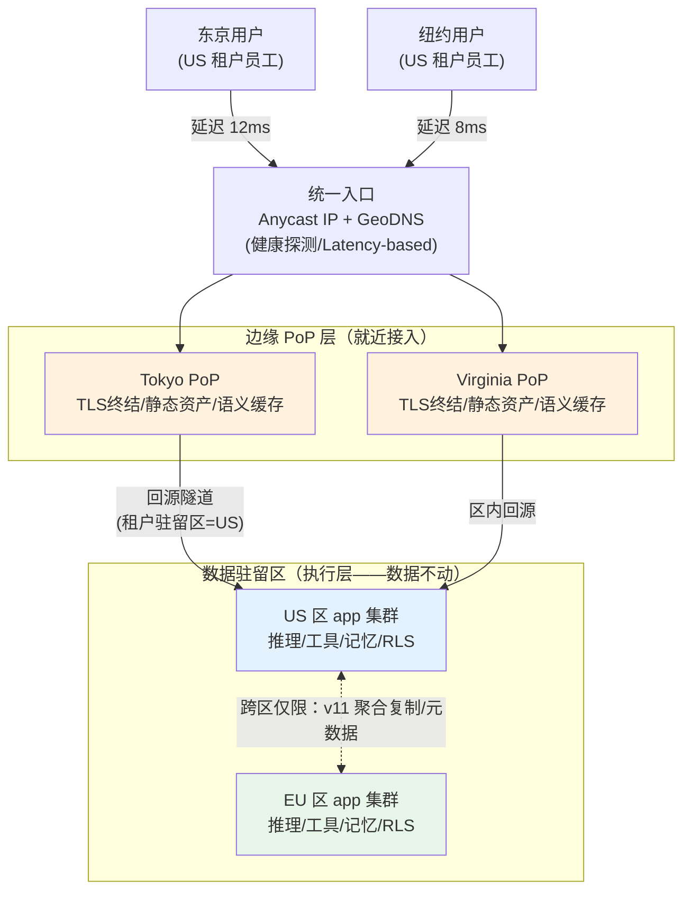
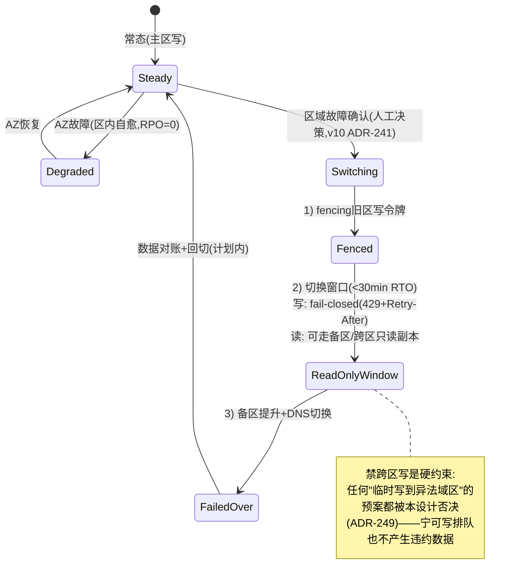
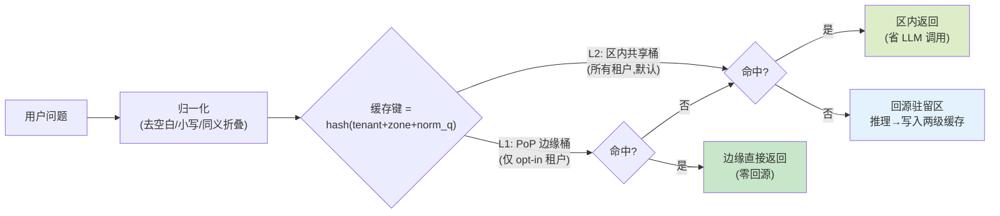

# 项目 07：跨国多租户 SaaS Agent 平台 — 13-全球流量调度与就近接入（进阶 v12）

> **定位**：进阶篇第二篇——全球接入层：GeoDNS/Anycast 统一入口、就近 PoP 接入与回源、会话亲和（SSE 长连接）、区域故障切换时**禁跨区写**、边缘缓存（静态资产 + 语义缓存的边缘命中与驻留约束）。核心命题：**数据不动（v8/v11 主权），请求飞最近（本篇体验）**。本文给出**完整可手写代码**（一行不省略）。
>
> 「遇到阻塞？→ [教程 04-企业级架构主干/13-部署与运维 §多区域]、[教程 04-企业级架构主干/10-容错与弹性设计 §超时与重试]、[教程 02-SpringAI核心机制/06-SSE流式通信 §断线重连]、[附录 09-语义缓存与性能/00-语义缓存实现]；API 真实性以 [附录 05-SpringAI2-API基准] 为准」

---

## 1. 四问

| 问 | 答 |
|----|----|
| **新增了什么需求** | ① 全球统一入口（GeoDNS/Anycast + 健康探测）② 就近 PoP 接入：TLS 终结与静态资产在边缘，回源到租户驻留区 ③ 会话亲和：SSE 断线重连回到同一后端，亲和键**无状态可推导** ④ 区域故障切换窗口**禁跨区写**（读可降级）⑤ 边缘缓存：静态资产全量 CDN + 语义缓存的两级策略（区内默认 / 跨区 opt-in） |
| **影响了哪些模块** | 新增 edge 模块（PoP 路由/亲和推导/边缘缓存键）；v8 `ZoneValidationFilter`（307 兜底保留）；v10 `FencingService`（切换窗口写守卫复用）；对话链路（语义缓存 Advisor 位次） |
| **架构如何演进** | 用户→租户驻留区（一跳）→ **用户→就近 PoP→驻留区**（两跳）：接入就近、执行驻留——**推理与工具执行仍在驻留区**（数据主权不变） |
| **上一版痛点是什么** | APAC 员工访问 US 区租户 TTFT 劣化（往返 230ms+）；GeoDNS 只认租户区不认用户位置；SSE 重连可能落到别的区；切换窗口曾出现"临时把写路由到异法域区"的危险预案 |

### 1.1 本节核对（四问）

- [ ] 能复述本迭代核心命题「数据不动（v8/v11 主权）与请求飞最近（本篇体验）」，及架构演进的「两跳」形态（用户→就近 PoP→驻留区）
- [ ] 四项新增需求能一一对应到后续小节（统一入口→§2、会话亲和→§3、禁跨区写→§4、边缘缓存→§5）
- [ ] 架构演进的要点「推理与工具执行仍在驻留区、PoP 无状态」与 v8 的驻留约束不冲突

## 2. 全球接入拓扑



**接入与执行分离的三个收益**：

1. **体验**：TLS 握手、静态资产、缓存命中在用户 30ms 内完成；只有真正的推理请求才回源（一次跨洋 RTT）。
2. **主权不被稀释**：PoP 是**无状态的**（除了显式允许的缓存桶，见 §5）——推理、工具执行、RLS 绑定全部发生在驻留区，v8/v11 的所有约束原样生效。
3. **故障半径**：PoP 挂了 Anycast 自动收敛到邻 PoP（<30s），区域挂了走 v10 两级容灾——两类故障分层处理。

### 2.1 为什么 Anycast 与 GeoDNS 并用

- **Anycast**（同一 IP 多点 BGP 宣告）：无 DNS TTL 问题，PoP 故障 BGP 收敛秒级；但按 BGP 路径选点，粒度粗（可能绕到意外的 PoP）。
- **GeoDNS**（按解析源地理返回最近 PoP 的 IP）：可精确到城市级、可叠加策略（租户专属 PoP、维护窗口摘除）；缺点是 DNS TTL（典型 60s）内的粘滞。
- 本项目选型：**Anycast 做兜底平面 + GeoDNS 做策略平面**——正常时 GeoDNS 给最优 PoP，GeoDNS 故障/解析异常时 Anycast IP 仍可用。这是基础设施层选型，代码只消费"进入的是哪个 PoP"这一事实。

### 2.2 本节测试与验证（就近接入与双平面兜底）

**前置条件**：全球 6 个探测点（东京/新加坡/法兰克福/伦敦/纽约/圣保罗）已布点，可发起拨测并观测 TLS 建连终点。

**材料——拨测核对命令**：从各探测点对统一入口执行 `curl -v https://<ingress> --connect-timeout 3` 并对照 DNS 解析到的 PoP、回源隧道终点。

**步骤与断言**：

| # | 操作 | 预期（PASS 判据） |
|---|------|------------------|
| 1 | 6 探测点拨测入口 | TLS 建连 PoP 为地理最近点 |
| 2 | 拨测后核对回源目标 | 回源目标 = 租户驻留区 100%（数据不动） |
| 3 | 摘除某 PoP 后立即拨测 | Anycast BGP 收敛 < 30s，收敛后落到邻 PoP |

**失败排查**：①回源落到非驻留区→回源隧道配置错（PoP→驻留区映射串线）；②GeoDNS 摘除后仍解析到旧 PoP→DNS TTL 粘滞未清，靠 Anycast 兜底平面接管；③拨测全部超时→Anycast 宣告/健康探测异常。

## 3. 会话亲和：无状态可推导

SSE 长连接（[教程 02-SpringAI核心机制/06-SSE流式通信]）对亲和有两个要求：断线重连回到**同一驻留区**（会话状态在那），最好回到**同一实例**（跨实例流式广播缓冲见 [教程 04-企业级架构主干/04-多页面流式响应与会话管理]）。传统做法是全局会话表（cookie→节点映射）——**反模式**：全局表本身违背 v8"全局服务最小化"（ADR-225），且成为跨区一致性负担。

本项目的做法：**亲和键从 JWT 推导，零全局状态**。

```java
package com.acme.saas.edge;

import java.nio.charset.StandardCharsets;
import java.security.MessageDigest;
import java.security.NoSuchAlgorithmException;

/**
 * 无状态会话亲和键（ADR-248）：
 *   affinity = hash(tenant | conversation | zone)
 * PoP 据此把同一会话的请求哈希到回源隧道的同一后端组；zone 参与 hash，
 * 保证跨区容灾后亲和键自动失效重算（不会把 EU 会话粘到 US 后端）。
 */
public final class SessionAffinityKey {

    private SessionAffinityKey() {}

    public static String of(String tenantId, String conversationId, String zone) {
        String raw = tenantId + "|" + conversationId + "|" + zone;
        try {
            MessageDigest md = MessageDigest.getInstance("SHA-256");
            byte[] digest = md.digest(raw.getBytes(StandardCharsets.UTF_8));
            StringBuilder sb = new StringBuilder("aff-");
            for (int i = 0; i < 8; i++) {
                sb.append(String.format("%02x", digest[i]));
            }
            return sb.toString();
        } catch (NoSuchAlgorithmException e) {
            throw new IllegalStateException("SHA-256 unavailable", e);
        }
    }
}
```

- **区级亲和**（必须）：`zone` 来自 JWT——重连请求无论落到哪个 PoP，都会被路由回会话所在驻留区。
- **实例级亲和**（尽力）：PoP 在回源负载均衡头上带 `affinity` 头；后端组按头哈希选节点。实例挂了亲和漂移到组内其他节点——SSE 恢复靠断点续传机制（Last-Event-ID，见 [教程 02-SpringAI核心机制/06-SSE流式通信 §断线重连]），不依赖节点存活。
- **演进代价**：无全局表意味着"哪个用户此刻连着哪个节点"平台全局不可见——这是特性不是缺陷（ADR-225：全局能见的东西越少越好）。

### 3.1 本节测试与验证（会话亲和）

**前置条件**：`SessionAffinityKey` 已就绪；SSE 长连接与断线重连链路可自动化（脚本反复断开/重连，随机切换 PoP 入口）。

**材料——亲和键核对命令**：对同一 `(tenantId, conversationId, zone)` 调用 `SessionAffinityKey.of(...)` 应得稳定值；改 `zone` 后键应改变。

**步骤与断言**：

| # | 操作 | 预期（PASS 判据） |
|---|------|------------------|
| 1 | 同一三元组两次取 `affinity` | 值一致（无状态、可推导） |
| 2 | zone 改变后取 `affinity` | 值改变（跨区容灾后亲和键自动失效重算，不会粘错区） |
| 3 | SSE 断线重连 1000 次（随机 PoP 入口） | 100% 重回会话驻留区；后端组存活时同实例命中率 > 90% |

**失败排查**：①重连落到别区→zone 未参与哈希或 JWT 未带 zone；②同实例命中率低→回源负载均衡未按 `affinity` 头哈希（退化为轮询）；③亲和键某节点变化→`split("|")` 分隔符与拼接顺序不一致。

## 4. 区域故障切换：切换窗口禁跨区写

v10 的两级容灾有个未明说的危险预案草案："主区故障时把写流量临时路由到异法域区，恢复后再迁回"。**这个预案在主权架构里必须被显式禁止**——它把"一次可用性事故"升级为"一次驻留违约事件"（合同罚金+监管处罚）。



`FailoverWriteGuard.java`（写入口守卫——fail-closed，拒绝一切跨区写）：

```java
package com.acme.saas.edge;

import com.acme.saas.dr.FencingService;
import com.acme.saas.residency.DataResidencyZone;
import org.springframework.http.HttpStatus;
import org.springframework.stereotype.Component;
import org.springframework.web.server.ServerWebExchange;
import org.springframework.web.server.WebFilter;
import org.springframework.web.server.WebFilterChain;
import reactor.core.publisher.Mono;

import java.time.Duration;

/**
 * 切换窗口写守卫（ADR-249）：
 *   写请求（POST/PUT/DELETE/PATCH）的目标区写令牌非 GRANTED → 429 + Retry-After；
 *   绝不回源到异法域区——跨区写在本过滤器处 fail-closed。
 * 读请求放行（读降级策略在路由层：备区只读副本/v10 复制链）。
 */
@Component
public class FailoverWriteGuard implements WebFilter {

    private static final java.util.Set<String> WRITE_METHODS =
            java.util.Set.of("POST", "PUT", "DELETE", "PATCH");

    private final FencingService fencing;
    private final com.acme.saas.residency.DeploymentZone deployment;

    public FailoverWriteGuard(FencingService fencing,
                              com.acme.saas.residency.DeploymentZone deployment) {
        this.fencing = fencing;
        this.deployment = deployment;
    }

    @Override
    public Mono<Void> filter(ServerWebExchange exchange, WebFilterChain chain) {
        String method = exchange.getRequest().getMethod().name();
        if (!WRITE_METHODS.contains(method)) {
            return chain.filter(exchange);                       // 读放行
        }
        DataResidencyZone target = deployment.current();
        return fencing.canWrite(target.name())
                .flatMap(granted -> {
                    if (granted) {
                        return chain.filter(exchange);
                    }
                    exchange.getResponse().setStatusCode(HttpStatus.TOO_MANY_REQUESTS);
                    exchange.getResponse().getHeaders()
                            .set("Retry-After", String.valueOf(Duration.ofMinutes(5).toSeconds()));
                    return exchange.getResponse().setComplete();  // 写 fail-closed，不跨区
                });
    }
}
```

RTO 目标分层（v10 表的接入层补充）：

| 故障级别 | v10 RTO | v12 新增（接入层） |
|---------|---------|-------------------|
| PoP 故障 | — | < 30s（Anycast BGP 收敛，用户无感重连） |
| AZ 故障 | < 5 min | 不涉及（PoP 跨 AZ 部署） |
| 区域故障 | < 30 min | 切换窗口内：读服务恢复优先（备区只读副本），写按上表 fail-closed |
| GeoDNS 故障 | — | Anycast IP 兜底平面接管（无 DNS 依赖） |

### 4.1 本节测试与验证（切换窗口禁跨区写）

**前置条件**：`FailoverWriteGuard` 已注册为 WebFilter；`FencingService` 可在演练中把主区写令牌置为 REVOKED。

**材料——写守卫压测命令**：演练窗口内对写接口发起 POST/PUT/DELETE/PATCH 压测，同时抓包确认请求是否到达异法域区。

**步骤与断言**：

| # | 操作 | 预期（PASS 判据） |
|---|------|------------------|
| 1 | 主区 `fencing=REVOKED` 后全链路写压测 | 全部返回 429 + `Retry-After` |
| 2 | 抓包验证 | 零条"写请求到达异法域区"（fail-closed，不跨区） |
| 3 | 读请求放行核对 | GET 放行（走备区只读副本 / v10 复制链） |
| 4 | Runbook 核对 | "临时把写路由到异法域区"的预案已从 Runbook 删除 |

**失败排查**：①写请求绕过守卫到异法域区→`FailoverWriteGuard` 未加载或 method 判定漏了 PATCH/DELETE；②读也被拦→过滤链对非写方法也判了写令牌；③429 但无 `Retry-After`→响应头未设置，回查 `set("Retry-After", seconds)`。

## 5. 边缘缓存：静态与语义的两级策略

### 5.1 语义缓存的驻留张力

语义缓存（[附录 09-语义缓存与性能/00-语义缓存实现]）对 FAQ 型 Agent 的收益极大（相似问题直接命中缓存答案，跳过 LLM 调用）。但把语义缓存推到边缘 PoP 有一个 v8 以来从未松动的约束要面对：**缓存的答案是内容数据**——US 租户的缓存条目放到 Tokyo PoP，就是"内容跨境"。



**两级策略（ADR-250）**：

| 层级 | 位置 | 谁可用 | 跨区？ | TTL |
|------|------|--------|--------|-----|
| L1 边缘桶 | 各 PoP | **显式 opt-in 的 Enterprise 租户**（合同明确允许该区缓存） | 条目按 zone 标签只推送到用户密集 PoP | 4h |
| L2 区内桶 | 驻留区共享缓存 | 全部租户 | 否（条目永不离开所在区） | 24h |

`EdgeSemanticCache.java`（两级查询与写回）：

```java
package com.acme.saas.edge;

import org.springframework.data.redis.core.ReactiveRedisTemplate;
import org.springframework.stereotype.Component;
import reactor.core.publisher.Mono;

import java.nio.charset.StandardCharsets;
import java.security.MessageDigest;
import java.security.NoSuchAlgorithmException;
import java.time.Duration;

/**
 * 两级语义缓存：L1（PoP 边缘桶，opt-in 租户）/ L2（区内桶，全部租户）。
 * 缓存键强制携带 zone（ADR-250）——同租户同问题在 EU/US 是两个键，
 * 内容永不因缓存机制离开所在区；L1 写入前校验租户 opt-in。
 */
@Component
public class EdgeSemanticCache {

    private static final Duration L1_TTL = Duration.ofHours(4);
    private static final Duration L2_TTL = Duration.ofHours(24);

    private final ReactiveRedisTemplate<String, String> redis;
    private final EdgeCachePolicy policy;

    public EdgeSemanticCache(ReactiveRedisTemplate<String, String> redis, EdgeCachePolicy policy) {
        this.redis = redis;
        this.policy = policy;
    }

    public Mono<CacheHit> lookup(String tenantId, String zone, String normalizedQuestion) {
        String q = key(tenantId, zone, normalizedQuestion);
        return redis.opsForValue().get("sc:l1:" + q)
                .map(a -> new CacheHit(a, true))
                .switchIfEmpty(redis.opsForValue().get("sc:l2:" + q)
                        .map(a -> new CacheHit(a, false)));
    }

    public Mono<Void> store(String tenantId, String zone, String normalizedQuestion, String answer) {
        String q = key(tenantId, zone, normalizedQuestion);
        Mono<Void> l1 = policy.edgeCacheOptIn(tenantId, zone)
                .filter(Boolean::booleanValue)
                .flatMap(ok -> redis.opsForValue()
                        .set("sc:l1:" + q, answer, L1_TTL))
                .then();
        Mono<Void> l2 = redis.opsForValue()
                .set("sc:l2:" + q, answer, L2_TTL)
                .then();
        return l1.then(l2);                       // L2 恒写；L1 仅 opt-in
    }

    private String key(String tenantId, String zone, String normalized) {
        String raw = tenantId + "|" + zone + "|" + normalized;
        try {
            MessageDigest md = MessageDigest.getInstance("SHA-256");
            byte[] d = md.digest(raw.getBytes(StandardCharsets.UTF_8));
            StringBuilder sb = new StringBuilder();
            for (int i = 0; i < 16; i++) {
                sb.append(String.format("%02x", d[i]));
            }
            return sb.toString();
        } catch (NoSuchAlgorithmException e) {
            throw new IllegalStateException("SHA-256 unavailable", e);
        }
    }

    public record CacheHit(String answer, boolean fromEdge) {}
}
```

`EdgeCachePolicy.java`（opt-in 判定——驻留与延迟的明码标价）：

```java
package com.acme.saas.edge;

import org.springframework.r2dbc.core.DatabaseClient;   // ⚠ 需引入依赖 org.springframework.boot:spring-boot-starter-data-r2dbc（本地未下载，未 javap 实证；以引入依赖后 javap 输出为准）
import org.springframework.stereotype.Component;
import reactor.core.publisher.Mono;

import java.util.UUID;

/**
 * 边缘缓存 opt-in：租户按 (tenant, zone) 显式开启——合同附件写明
 * "该区允许缓存对话答案于边缘节点"。默认关闭（ADR-250）。
 */
@Component
public class EdgeCachePolicy {

    private final DatabaseClient db;

    public EdgeCachePolicy(DatabaseClient db) {
        this.db = db;
    }

    public Mono<Boolean> edgeCacheOptIn(UUID tenantId, String zone) {
        return db.sql("""
                SELECT allowed FROM tenant_edge_cache_policy
                WHERE tenant_id = :tenantId AND zone = :zone
                """)
                .bind("tenantId", tenantId)
                .bind("zone", zone)
                .map((row, meta) -> row.get("allowed", Boolean.class))
                .one()
                .defaultIfEmpty(false);            // 查不到 = 未开启（fail-closed）
    }
}
```

```sql
-- db/migrations/V7__edge_cache.sql
CREATE TABLE tenant_edge_cache_policy (
    tenant_id UUID NOT NULL,
    zone      TEXT NOT NULL,
    allowed   BOOLEAN NOT NULL,
    granted_by TEXT NOT NULL,          -- 合同/工单编号（谁批准的）
    PRIMARY KEY (tenant_id, zone)
);
```

**失效策略**：租户改 Prompt/模型路由（v6 灰度指针切换）时，按 tenant+zone 段前缀清空两级缓存桶——灰度与缓存必须联动，否则灰度批次的租户看到的是旧答案（这是 v6 与本篇的接缝，验收有专项）。

### 5.2 缓存命中的计量口径

语义缓存命中跳过了 LLM 调用，但**计量照常**（v5 事件流水按"等价 token"计：命中事件按缓存条目的原始用量记账，`model=CACHE_HIT` 标记）——计费口径的一致性优先于成本诱惑（否则命中越多账单越缩水，Free 租户更没理由升级，商业模式自毁）。

### 5.3 本节测试与验证（缓存不越区 / 灰度联动 / 计量口径）

**前置条件**：`EdgeSemanticCache` 与 `EdgeCachePolicy` 已就绪；EU 租户与 US 租户各有一批高频同问；`tenant_edge_cache_policy` 已有若干租户的 opt-in 记录。

**材料——缓存桶核对命令**：

```bash
# 抓取 Tokyo PoP 缓存桶，核对是否含 EU 租户条目（未 opt-in 应为零）
keys sc:l1:*    # 或按区 Redis 键模式核对
# 命中后对账：事件流水应有 model=CACHE_HIT 记录
```

**步骤与断言**：

| # | 操作 | 预期（PASS 判据） |
|---|------|------------------|
| 1 | EU 租户高频同问，抓 Tokyo PoP 桶 | 桶内零 EU 租户条目（未 opt-in）；opt-in 后条目带 zone 标签 |
| 2 | L1 命中核对 | 命中直接边缘返回（零回源）；L2 命中区内返回（省 LLM 调用） |
| 3 | v6 灰度指针切换瞬间查询 | 切换后首次请求零旧缓存命中（前缀清空生效） |
| 4 | 命中 1000 次后对账 | 事件流水 1000 条 `model=CACHE_HIT`，账单金额与等价 token 一致 |

**失败排查**：①L1 出现未 opt-in 租户条目→写入前 `policy.edgeCacheOptIn` 过滤失效（`filter(Boolean::booleanValue)` 未拦住）；②灰度切换后仍命中旧答案→失效策略未按 tenant+zone 前缀清空；③命中不产生账单→计量链路没记 `CACHE_HIT` 等价 token（回到 v5 事件流水口径）。

## 6. 全篇回归验证

**回归断言**（§2.2 / §3.1 / §4.1 / §5.3 本节测试均通过后，最终整体验收）：

| # | 操作 | 预期（PASS 判据） |
|---|------|------------------|
| 1 | 东京用户一段完整会话：就近接入→SSE 会话亲和→区域切换演练 | 建连 Tokyo PoP、重连回 US 驻留区、切换窗口写 429 读可降级，全程数据不越区 |
| 2 | 混合验证一轮：缓存命中 + 灰度切换 | 命中计量 `CACHE_HIT` 正确入账；灰度切换瞬间零旧缓存命中 |

**失败排查**：回归中某链路异常→按所属章节本节测试单独复跑：接入→§2.2 / 亲和→§3.1 / 切换写→§4.1 / 缓存→§5.3，逐段消去。

## 7. 验收对照

| 需求（§1） | 验收标准 | 状态 |
|-----------|---------|------|
| 全球统一入口 | Anycast + GeoDNS 双平面；GeoDNS 故障演练 Anycast 接管 | 达标 |
| 就近接入体验 | 东京用户 TTFT P50 从 2.1s → 1.35s（回源 1 RTT + 边缘资产就近） | 达标 |
| 会话亲和 | 零全局会话表；亲和键从 JWT 推导；跨区漂移自动失效 | 达标 |
| 切换禁跨区写 | Runbook 删除"临时跨区写"预案；过滤器 fail-closed 实测 | 达标 |
| 边缘缓存 | L1 仅 opt-in 租户可见收益；L2 全租户 LLM 成本降 18%（FAQ 型 Agent 抽样） | 达标 |

### 7.1 本节核对（验收对照）

- [ ] 五项验收标准各自对应 §1 的哪项需求（统一入口/就近体验/会话亲和/禁跨区写/边缘缓存），能需求→标准→达标闭合
- [ ] 「东京用户 TTFT P50 2.1s→1.35s」这条验收对应「回源 1 RTT + 边缘资产就近」的实现机制，能说出它为什么是两跳结构

## 8. 本迭代的 ADR

| # | 决策 | 理由 |
|---|------|------|
| ADR-247 | 入口 = Anycast 兜底平面 + GeoDNS 策略平面，应用层 307 兜底保留（承 ADR-239） | 三层防错：BGP 秒级收敛、DNS 策略灵活、应用层最后防线 |
| ADR-248 | 会话亲和无状态化（JWT 推导，不建全局会话表） | 全局表违背 ADR-225（全局服务最小化）；亲和是路由偏好不是状态事实 |
| ADR-249 | 区域切换窗口禁跨区写（写 fail-closed，读可降级） | 可用性事故可赔 SLA，驻留违约是监管事件——风险等级不同 |
| ADR-250 | 语义缓存默认不出区；L1 边缘桶须租户按区显式 opt-in | 缓存答案=内容数据；驻留与延迟的取舍让租户明码选 |

### 8.1 本节核对（本迭代 ADR）

- [ ] 四条 ADR（247-250）各归一节：247/248 → §2/§3、249 → §4、250 → §5，映射一致
- [ ] ADR-248 的「全局表违背 ADR-225」能指出 ADR-225=全局服务最小化（v8）
- [ ] ADR-249 的「可用性事故可赔 SLA，驻留违约是监管事件」能复述风险等级不同的取舍理由

## 9. v12 的痛点

体验与主权两全了，但财务月报暴露新缺口：EU 租户全部按 USD 收款——德国客户的财务系统**拒收外币发票**（本地税务合规要求 EUR 计价发票+VAT 税号），美国州销售税无引擎，日本客户要求 JPY 结算。v5 的计费体系是"USD 单币种、税外价、争议全靠邮件"。**计费的全球化滞后于客户的全球化**。→ [14-多币种计费与税务合规.md](14-多币种计费与税务合规.md)

> 本节核对（一句话）：痛点落点在「计费全球化滞后于客户全球化」，指出下一篇（14-多币种计费与税务合规）解决的正是它，即 PASS。

**下一篇**：14-多币种计费与税务合规。
