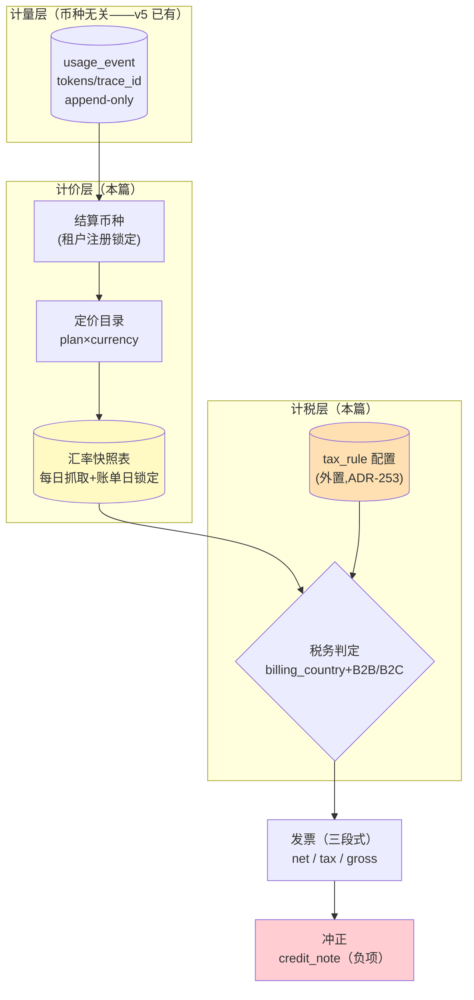
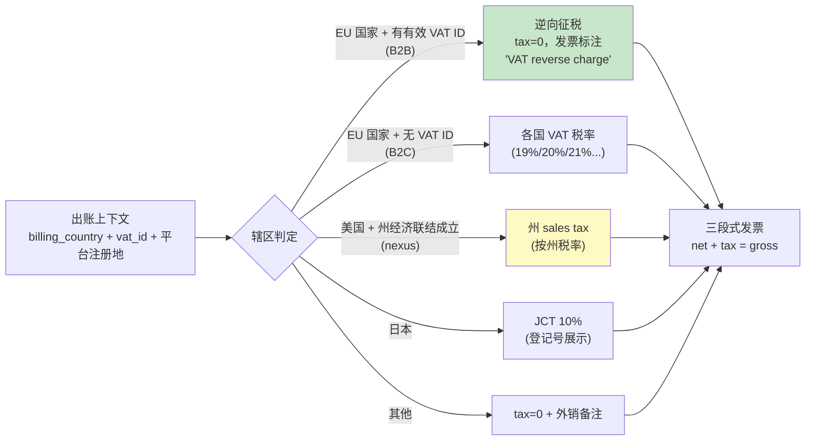
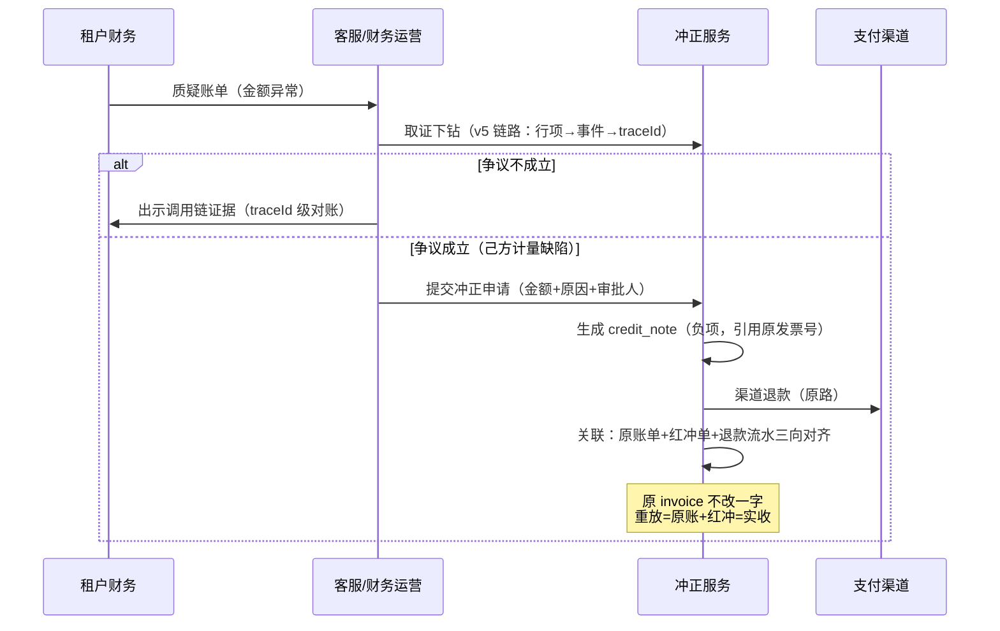

# 项目 07：跨国多租户 SaaS Agent 平台 — 14-多币种计费与税务合规（进阶 v13）

> **定位**：进阶篇第三篇——计费的全球化：多币种定价与**汇率快照**（计费时刻锁定）、税务引擎（EU VAT / 美国州 sales tax / 发票规则）、账单争议与**红冲冲正**、防薅羊毛（新注册冷启动配额 + 异常用量风控）。v5 的计费正确性原则（事件流水、三副本对账、差异冻结）在多币种与税务下被重新检验。本文给出**完整可手写代码**（一行不省略）。
>
> 「遇到阻塞？→ [教程 04-企业级架构主干/07-成本治理与Token计量 §计费正确性]、[教程 04-企业级架构主干/05-历史记录持久化与合规 §不可变记录]、[教程 09-前沿专题/03-Agent经济与支付集成]；API 真实性以 [附录 05-SpringAI2-API基准] 为准」

---

## 1. 四问

| 问 | 答 |
|----|----|
| **新增了什么需求** | ① 多币种：租户注册选定结算币种（EUR/USD/JPY），定价目录按币种维护，**汇率快照在计费时刻锁定** ② 税务：EU B2B 逆向征税（税号校验）/EU B2C 各国 VAT/美国经济联结 sales tax/日本 JCT，发票净额-税额-总额三段式 ③ 账单争议与**冲正**：红冲 credit note（不改历史账单），退款走审批+渠道 ④ 防薅羊毛：新租户冷启动配额、注册指纹风控、异常用量检测 |
| **影响了哪些模块** | billing（币种/汇率/税务/冲正全链路）、identity（tenant 加 billing_currency/billing_country/vat_id）、风控（新增 abuse 模块，复用 v3 Redis 配额设施） |
| **架构如何演进** | 计量（token，币种无关）→ 计价（币种+锁定汇率）→ 计税（辖区规则外置）→ 出账（三段式发票）→ 冲正（append-only 红冲）；**"计量永远币种无关"是多币种正确性的地基** |
| **上一版痛点是什么** | USD 单币种（德国财务拒收）、无税务引擎（VAT/sales tax 全靠手工）、争议退款改台账（违反 append-only）、Free 配额被批量注册薅（3 个月检出 217 个套利租户） |

### 1.1 本节核对（四问）

- [ ] 能复述管道五级：计量（币种无关）→计价（币种+锁定汇率）→计税（辖区规则外置）→出账（三段式）→冲正（append-only 红冲）
- [ ] 四项新增需求能一一对应到后续小节（币种/汇率→§2、税务→§3、冲正→§4、防薅羊毛→§5）
- [ ] 演进列的「计量永远币种无关」是多币种正确性地基，能说出为什么不能在事件里存金额（汇率变动污染原始计量）

## 2. 多币种计费管道



**最容易被忽视的一条**：`usage_event` 一行都不用改——token 是天然的世界货币。所有币种复杂度都压在**计价及之后**的管道里，计量层保持纯净。反过来（在事件里存金额）会让汇率变动污染原始计量，对账永远算不平。

### 2.1 汇率快照：计费时刻锁定

汇率每天波动，账单必须**唯一确定**——同一个月的账单在任何时候重算都得到同一金额。规则：**账单周期末日 00:00 UTC 的快照被"锁定"进账单记录**，之后汇率再动与这张账单无关。

```sql
-- db/migrations/V8__multi_currency.sql
ALTER TABLE tenant ADD COLUMN IF NOT EXISTS billing_currency TEXT;      -- 'EUR'/'USD'/'JPY'，注册时锁定（ADR-252）
ALTER TABLE tenant ADD COLUMN IF NOT EXISTS billing_country TEXT;       -- ISO 3166-1 alpha-2，税务判定用
ALTER TABLE tenant ADD COLUMN IF NOT EXISTS vat_id TEXT;                -- B2B 税号（EU VAT ID / 日本登记号）

-- 汇率快照：每日抓取源（ECB 参考汇率）落库；出账时把当日快照写死进账单
CREATE TABLE fx_rate_snapshot (
    snapshot_day DATE PRIMARY KEY,
    rate_usd_to_eur NUMERIC(12,8) NOT NULL,
    rate_usd_to_jpy NUMERIC(12,8) NOT NULL,
    source        TEXT NOT NULL DEFAULT 'ECB-REF',
    fetched_at    TIMESTAMPTZ NOT NULL DEFAULT now()
);

-- 定价目录：plan × currency（本币定价，不是"美元价×汇率"——各市场定价独立，ADR-252）
CREATE TABLE price_catalog (
    plan            TEXT NOT NULL,
    currency        TEXT NOT NULL,
    monthly_base    NUMERIC(12,2) NOT NULL,
    overage_per_1k  NUMERIC(12,4) NOT NULL,
    PRIMARY KEY (plan, currency)
);
```

`FxRateService.java`（快照读取与锁定）：

```java
package com.acme.saas.billing.fx;

import org.springframework.r2dbc.core.DatabaseClient;   // ⚠ 需引入依赖 org.springframework.boot:spring-boot-starter-data-r2dbc（本地未下载，未 javap 实证；以引入依赖后 javap 输出为准）
import org.springframework.stereotype.Service;
import reactor.core.publisher.Mono;

import java.math.BigDecimal;
import java.time.LocalDate;

/** 汇率快照：出账日用周期末日快照，查不到往前找最近一日（假日缺源），永不现算市场价。 */
@Service
public class FxRateService {

    private final DatabaseClient db;

    public FxRateService(DatabaseClient db) {
        this.db = db;
    }

    /** USD→目标币种。锁定语义：同一 billingDay 永远返回同一数值（快照表不可变）。 */
    public Mono<BigDecimal> usdTo(String targetCurrency, LocalDate billingDay) {
        return db.sql("""
                SELECT rate_usd_to_eur, rate_usd_to_jpy
                FROM fx_rate_snapshot
                WHERE snapshot_day <= :day
                ORDER BY snapshot_day DESC
                LIMIT 1
                """)
                .bind("day", billingDay)
                .map((row, meta) -> switch (targetCurrency) {
                    case "USD" -> BigDecimal.ONE;
                    case "EUR" -> row.get("rate_usd_to_eur", BigDecimal.class);
                    case "JPY" -> row.get("rate_usd_to_jpy", BigDecimal.class);
                    default -> throw new IllegalArgumentException("unsupported: " + targetCurrency);
                })
                .one();
    }
}
```

> 汇率源（ECB 每日参考汇率）为外部 HTTP 接口，抓取器为**概念代码**（真实实现接 ECB API 并落 `fx_rate_snapshot`）；表结构与锁定语义是本篇的落点。

**为什么内部成本仍按 USD**：供应商账单（v5 副本③）是 USD——EUR 账单收入与 USD 供应商成本的差额是**汇兑损益**，进财务报表不进账单。把汇兑风险显式交给财务，而不是摊进租户账单（租户只为"自己的用量与本币定价"负责）。

### 2.2 本节测试与验证（汇率快照锁定）

**前置条件**：`V8__multi_currency.sql` 已迁移；`fx_rate_snapshot` 已有周期末日快照记录；`FxRateService` 可注入。

**材料——重算一致性核对（同一账单周期日验证）**：

```bash
# 同一 snapshot_day 重复查询应返回同一数值（锁定语义）
SELECT rate_usd_to_eur FROM fx_rate_snapshot WHERE snapshot_day = :day;
```

**步骤与断言**：

| # | 操作 | 预期（PASS 判据） |
|---|------|------------------|
| 1 | 周期末日快照落库 | `fx_rate_snapshot` 记录 source=ECB-REF、fetched_at 已填 |
| 2 | 同月账单在快照日后 1/7/30 天重算三次 | 金额逐分一致（快照日与锁定率持久化在账单上） |
| 3 | 快照缺失时出账 | 往前找最近一日快照（`snapshot_day <= :day`）+ `limit 1`，永不现算市场价 |
| 4 | 币种守恒核对 | `usage_event` 一行未改（计量币种无关）；价格差异只出现在计价及之后管道 |

**失败排查**：①重算金额变→出账没读锁定快照而是实时汇率；②`usdTo` 报无快照→快照抓取未落库或查询条件写反（`<=` 错成 `>=`）；③USD 返回非 1→switch 分支没命中 `case "USD" -> BigDecimal.ONE`。

## 3. 税务引擎

### 3.1 判定规则（外置配置，不硬编码）



美国经济联结说明：最高法院 South Dakota v. Wayfair（2018）后，各州可对"无实体存在但年销售额/交易数超阈值"的远程卖家征税——阈值各州不同（典型：年销 10 万美元或 200 笔交易）。平台按州维护 nexus 状态表，跨过阈值即开始代收该州 sales tax。

`TaxRule.java` + `TaxEngine.java`：

```java
package com.acme.saas.billing.tax;

import java.math.BigDecimal;

/** 辖区计税规则（外置配置渲染而来，ADR-253）。 */
public record TaxRule(
        String countryCode,          // ISO 3166-1 α2，如德国'DE'、法国'FR'、意大利'IT'、西班牙'ES'或美国州级'US-CA'
        boolean requireVatId,        // B2B 逆向征税适用
        BigDecimal rate,             // B2C/JCT/sales-tax 税率
        String invoiceNote           // 发票税务备注（逆向征税标识等）
) {}
```

```java
package com.acme.saas.billing.tax;

import java.math.BigDecimal;
import java.util.List;
import java.util.Map;

/** 税务引擎：判定纯函数——规则来自外置配置表，代码只实现判定逻辑。 */
public class TaxEngine {

    /** 规则集从 tax_rule 配置加载（部署期快照）；判定运行时纯内存。 */
    private final Map<String, TaxRule> rulesByCountry;

    public TaxEngine(List<TaxRule> rules) {
        this.rulesByCountry = new java.util.HashMap<>();
        for (TaxRule r : rules) {
            rulesByCountry.put(r.countryCode(), r);
        }
    }

    public TaxResult judge(String billingCountry, String vatId, boolean usNexusState) {
        // ① EU 成员国（简化清单；真实以 ISO + EU 成员配置为准）
        if (EU_COUNTRIES.contains(billingCountry)) {
            if (vatId != null && !vatId.isBlank()) {
                TaxRule r = rulesByCountry.get(billingCountry);
                return new TaxResult(BigDecimal.ZERO,
                        "VAT reverse charge — customer VAT ID " + vatId);   // B2B 逆向征税
            }
            TaxRule r = rulesByCountry.get(billingCountry);
            return new TaxResult(r.rate(), "VAT " + r.rate() + "%");        // B2C 各国税率
        }
        // ② 美国：nexus 成立的州才收（判定输入由 nexus 状态表给出）
        if ("US".equals(billingCountry)) {
            return usNexusState
                    ? new TaxResult(rulesByCountry.get("US-DEFAULT").rate(), "US sales tax (nexus)")
                    : new TaxResult(BigDecimal.ZERO, "No sales tax — no nexus in state");
        }
        // ③ 日本 JCT
        if ("JP".equals(billingCountry)) {
            return new TaxResult(rulesByCountry.get("JP").rate(), "JCT");
        }
        return new TaxResult(BigDecimal.ZERO, "Export — tax not applicable");
    }

    public record TaxResult(BigDecimal rate, String note) {}

    private static final java.util.Set<String> EU_COUNTRIES = java.util.Set.of(
            "DE", "FR", "IT", "ES", "NL", "BE", "IE", "AT", "DK", "SE", "FI", "PL", "LU");
}
```

> VAT ID 有效性校验（VIES）与 nexus 状态表均为外部依赖：VIES 是欧盟官方 SOAP/REST 接口（注册时调用，结果缓存落库），真实接入标注「概念代码——需接 VIES 后实证」；nexus 状态表按州维护（年销售额/交易数 vs 阈值），数据维护进运营流程。

### 3.2 三段式发票与 Invoice v13

```java
package com.acme.saas.billing;

import java.math.BigDecimal;
import java.time.LocalDate;
import java.time.YearMonth;
import java.util.List;
import java.util.UUID;

/** v13 发票：币种 + 锁定汇率 + 税务三段式。net + tax = gross 由构造校验。 */
public record Invoice(
        UUID tenantId,
        YearMonth period,
        String currency,               // 结算币种（ADR-252：注册锁定）
        BigDecimal lockedFxRate,       // USD→currency，账单周期末日快照（重算恒等）
        LocalDate fxSnapshotDay,       // 快照日（审计：这条汇率从哪来）
        BigDecimal netAmount,          // 净额（本币定价目录计价）
        BigDecimal taxAmount,          // 税额
        BigDecimal grossAmount,        // 总额 = net + tax
        String taxNote,                // 税务备注（逆向征税标识/税率说明）
        List<LineItem> lineItems
) {
    public Invoice {
        if (netAmount.add(taxAmount).compareTo(grossAmount) != 0) {
            throw new IllegalArgumentException("net + tax != gross");
        }
    }

    public record LineItem(String agentId, long inputTokens, long outputTokens,
                           long totalTokens, BigDecimal amount) {}
}
```

`InvoiceService` v13 的计价段（在 v5 聚合之后接上币种/税率）：

```java
package com.acme.saas.billing;

import com.acme.saas.billing.fx.FxRateService;
import com.acme.saas.billing.tax.TaxEngine;
import org.springframework.stereotype.Service;
import reactor.core.publisher.Mono;

import java.math.BigDecimal;
import java.math.RoundingMode;
import java.time.LocalDate;
import java.time.YearMonth;
import java.util.UUID;

@Service
public class MultiCurrencyInvoiceService {

    private final UsageEventRepository usageEvents;      // v5 已有（计量，币种无关）
    private final FxRateService fx;
    private final TaxEngine tax;
    private final PriceCatalog catalog;

    public MultiCurrencyInvoiceService(UsageEventRepository usageEvents,
                                       FxRateService fx, TaxEngine tax, PriceCatalog catalog) {
        this.usageEvents = usageEvents;
        this.fx = fx;
        this.tax = tax;
        this.catalog = catalog;
    }

    public Mono<Invoice> generate(TenantBillingInfo tenant, YearMonth month) {
        LocalDate snapshotDay = month.atEndOfMonth();       // 周期末日快照锁定（ADR-251）
        return usageEvents.eventsOf(tenant.id(), month)
                .collectList()
                .zipWith(fx.usdTo(tenant.currency(), snapshotDay))
                .map(t -> {
                    long tokens = t.getT1().stream()
                            .mapToLong(e -> e.inputTokens() + e.outputTokens()).sum();
                    PriceCatalog.Entry price = catalog.priceOf(tenant.plan(), tenant.currency());
                    BigDecimal overageUsd = price.overagePer1k()
                            .multiply(BigDecimal.valueOf(tokens))
                            .divide(BigDecimal.valueOf(1000), 8, RoundingMode.HALF_UP);
                    // 本币净额：基础费按本币定价目录直接取，超额部分按锁定汇率换算
                    BigDecimal net = price.monthlyBase()
                            .add(overageUsd.multiply(t.getT2()).setScale(2, RoundingMode.HALF_UP));
                    TaxEngine.TaxResult taxRes = tax.judge(
                            tenant.billingCountry(), tenant.vatId(), tenant.usNexusState());
                    BigDecimal taxAmt = net.multiply(taxRes.rate())
                            .setScale(2, RoundingMode.HALF_UP);
                    return new Invoice(tenant.id(), month, tenant.currency(),
                            t.getT2(), snapshotDay, net, taxAmt, net.add(taxAmt),
                            taxRes.note(), java.util.List.of());
                });
    }

    /** 出账上下文（从 tenant 表聚合；nexus 状态来自州阈值表）。 */
    public record TenantBillingInfo(UUID id, String plan, String currency,
                                    String billingCountry, String vatId, boolean usNexusState) {}
}
```

`PriceCatalog.java`（定价目录读取，占位实现接 R2DBC）：

```java
package com.acme.saas.billing;

import org.springframework.stereotype.Component;

import java.util.Map;

/** 本币定价目录：各市场独立定价（不是美元价×汇率）。真实实现查 price_catalog 表。 */
@Component
public class PriceCatalog {

    private static final Map<String, Entry> CATALOG = Map.of(
            "PRO|EUR", new Entry(new java.math.BigDecimal("279.00"), new java.math.BigDecimal("0.0018")),
            "PRO|USD", new Entry(new java.math.BigDecimal("299.00"), new java.math.BigDecimal("0.0020")),
            "PRO|JPY", new Entry(new java.math.BigDecimal("44900.00"), new java.math.BigDecimal("0.30")));

    public Entry priceOf(String plan, String currency) {
        Entry e = CATALOG.get(plan + "|" + currency);
        if (e == null) {
            throw new IllegalArgumentException("no price for " + plan + "/" + currency);
        }
        return e;
    }

    public record Entry(java.math.BigDecimal monthlyBase, java.math.BigDecimal overagePer1k) {}
}
```

### 3.3 本节测试与验证（税务判定矩阵与三段式校验）

**前置条件**：`TaxRule`/`TaxEngine` 已实现；`tax_rule` 配置就绪（EU 各国 / US-DEFAULT / JP）；`Invoice` 三段式构造已可用。

**材料——判定矩阵核对（可直接进 CI）**：5 辖区（DE/FR/US/JP/其他）× B2B/B2C × 有/无税号组合出的 20 用例。

**步骤与断言**：

| # | 操作 | 预期（PASS 判据） |
|---|------|------------------|
| 1 | 跑 20 例税务判定矩阵 | 判定与 `tax_rule` 配置逐条一致；逆向征税发票带标准备注（`VAT reverse charge — customer VAT ID ...`） |
| 2 | DE 无税号（B2C）判定 | 返回税率与 `rulesByCountry.get("DE").rate()` 一致 |
| 3 | US 非 nexus 州判定 | tax=0 + 备注 `No sales tax — no nexus in state` |
| 4 | 构造 1000 张随机发票 | `net+tax==gross` 构造校验零失败；发票模板含税号/税率/币种/快照率 |
| 5 | Invoice 非法金额构造 | 抛 `IllegalArgumentException`（net+tax≠gross 被构造校验拦截） |

**失败排查**：①判定与配置不一致→`TaxEngine` 规则集加载顺序/`rulesByCountry` 覆盖问题（重复 country 被后者覆盖）；②EU 无税号误判逆向征税→`vatId.isBlank()` 分支顺序错；③发票金额不平→`MultiCurrencyInvoiceService` 净额/税额 rounding 不一致，回看 `setScale` 与 `net.add(tax)`。

## 4. 账单争议与冲正

### 4.1 红冲（Credit Note）：append-only 的退款

v5 的铁律"用量事件不可变"同样适用于账单：**争议成立时不开 UPDATE 账单的后门，开一张负项发票（credit note）冲抵**。账单历史因此永远可回放（v5 取证链 + 本篇冲正链 = 完整财务轨迹）。



`CreditNoteService.java`：

```java
package com.acme.saas.billing;

import org.springframework.r2dbc.core.DatabaseClient;   // ⚠ 需引入依赖 org.springframework.boot:spring-boot-starter-data-r2dbc（本地未下载，未 javap 实证；以引入依赖后 javap 输出为准）
import org.springframework.stereotype.Service;
import reactor.core.publisher.Mono;

import java.math.BigDecimal;
import java.time.Instant;
import java.util.UUID;

/** 冲正：只开红冲单，不改历史账单（ADR-254）。红冲单本身也 append-only。 */
@Service
public class CreditNoteService {

    private final DatabaseClient db;

    public CreditNoteService(DatabaseClient db) {
        this.db = db;
    }

    public Mono<CreditNote> issue(UUID originalInvoiceId, UUID tenantId, String currency,
                                  BigDecimal netAmount, BigDecimal taxAmount,
                                  String reason, String approvedBy) {
        BigDecimal gross = netAmount.add(taxAmount);
        UUID noteId = UUID.randomUUID();
        return db.sql("""
                INSERT INTO credit_note
                    (id, original_invoice_id, tenant_id, currency,
                     net_amount, tax_amount, gross_amount, reason, approved_by, issued_at)
                VALUES (:id, :origId, :tenantId, :currency,
                        :net, :tax, :gross, :reason, :approvedBy, now())
                """)
                .bind("id", noteId)
                .bind("origId", originalInvoiceId)
                .bind("tenantId", tenantId)
                .bind("currency", currency)
                .bind("net", netAmount)
                .bind("tax", taxAmount)
                .bind("gross", gross)
                .bind("reason", reason)
                .bind("approvedBy", approvedBy)
                .then()
                .thenReturn(new CreditNote(noteId, originalInvoiceId, tenantId, currency,
                        netAmount, taxAmount, gross, reason, approvedBy, Instant.now()));
    }

    /** 净收款 = Σ(发票 gross) − Σ(红冲 gross)——财务对账口径。 */
    public record CreditNote(UUID id, UUID originalInvoiceId, UUID tenantId, String currency,
                             BigDecimal netAmount, BigDecimal taxAmount, BigDecimal grossAmount,
                             String reason, String approvedBy, Instant issuedAt) {}
}
```

```sql
-- db/migrations/V8__multi_currency.sql（续）
CREATE TABLE credit_note (
    id                  UUID PRIMARY KEY,
    original_invoice_id UUID NOT NULL,        -- 引用原发票（不改原票）
    tenant_id           UUID NOT NULL,
    currency            TEXT NOT NULL,
    net_amount          NUMERIC(12,2) NOT NULL,
    tax_amount          NUMERIC(12,2) NOT NULL,
    gross_amount        NUMERIC(12,2) NOT NULL,
    reason              TEXT NOT NULL,
    approved_by         TEXT NOT NULL,        -- 冲正必须有人签字（与 v9 审计同理）
    issued_at           TIMESTAMPTZ NOT NULL DEFAULT now()
);
CREATE INDEX idx_credit_note_invoice ON credit_note (original_invoice_id);

-- 追加：invoice 表不可变触发器（append-only——红冲只开 credit_note，绝不 UPDATE/DELETE 原发票）
CREATE OR REPLACE FUNCTION block_invoice_update() RETURNS trigger AS $$
BEGIN
    RAISE EXCEPTION 'invoice is append-only; use credit note for corrections';
END;
$$ LANGUAGE plpgsql;

CREATE TRIGGER trg_invoice_immutable
    BEFORE UPDATE OR DELETE ON invoice
    FOR EACH ROW EXECUTE FUNCTION block_invoice_update();
```
```

### 4.2 本节测试与验证（红冲与重放）

**前置条件**：`CreditNoteService` 已实现；`credit_note` 已迁移；原 `invoice` 的记录存在；支付渠道流水可核对。

**材料——冲正后重放核对命令**：

```bash
# 净收款 = Σ(发票 gross) − Σ(红冲 gross)：核对与渠道流水一致
SELECT SUM(gross_amount) FROM credit_note WHERE tenant_id=:t;
# 原发票应零 UPDATE（触发器守护）
```

**步骤与断言**：

| # | 操作 | 预期（PASS 判据） |
|---|------|------------------|
| 1 | 对一笔争议提交冲正（金额+原因+审批人） | `issue` 生成 credit_note，引用原发票号，红冲单 gross=net+tax |
| 2 | 原发票零 UPDATE 核对 | DB 触发器守护：对 invoice 的任何 UPDATE 被拒（append-only） |
| 3 | 争议-红冲-退款后重放财务月 | 净收款 = Σ发票 − Σ红冲 = 渠道流水（三方对账） |
| 4 | 审批留痕核对 | credit_note 含 `approved_by`（必须有签字） |

**失败排查**：①冲正后原发票被改→触发器未覆盖 invoice 表；②三方对账不平→红冲金额/币种与原发票不一致，或渠道退款流水没入账；③红冲单缺审批人→`issue` 未强制传 `approvedBy`。

## 5. 防薅羊毛

### 5.1 配额管"量"，风控管"坏"

v3 配额解决了"Free 租户用量失控"，但**批量注册薅免费额度**是另一类问题：3 个月检出 217 个套利租户（同 IP 段注册、一次性邮箱、注册后立即满配额调用）——配额视角它们每个都"合规"。防薅羊毛与配额**分治**（ADR-255）：

| 层 | 对象 | 机制 |
|----|------|------|
| 注册风控 | 新租户注册 | 指纹评分（邮箱域信誉/IP 段密度/注册行为），低分 → 人工审核队列 |
| 冷启动配额 | 新租户前 7 天 | 配额爬坡：首日 20% → 第 7 天 100%（薅羊毛者等不起爬坡，正常租户前 7 天用不满） |
| 用量异常检测 | 在册租户 | 速率尖峰（分钟级 token 10σ）、工具滥用模式（如 RAG 上传+全文抽取循环）、API Key 地理跳变（Key 被共享/转卖） |

### 5.2 完整代码

`NewTenantCooldown.java`（冷启动配额——复用 v3 的 Redis 设施）：

```java
package com.acme.saas.abuse;

import org.springframework.data.redis.core.ReactiveRedisTemplate;
import org.springframework.stereotype.Component;
import reactor.core.publisher.Mono;

import java.time.Duration;
import java.time.Instant;

/** 冷启动配额爬坡（ADR-255）：注册日起 7 天内配额系数 20%→100%。 */
@Component
public class NewTenantCooldown {

    private static final int RAMP_DAYS = 7;

    private final ReactiveRedisTemplate<String, String> redis;

    public NewTenantCooldown(ReactiveRedisTemplate<String, String> redis) {
        this.redis = redis;
    }

    /** 注册时记起点（7 天后过期——之后系数恒 1，不再查 Redis）。 */
    public Mono<Void> onStart(String tenantId) {
        return redis.opsForValue()
                .set("cooldown:" + tenantId, String.valueOf(Instant.now().getEpochSecond()),
                        Duration.ofDays(RAMP_DAYS))
                .then();
    }

    /** 系数：day0=0.2 … day6=0.8，day7+=1.0。v3 配额闸门把日配额乘以该系数。 */
    public Mono<Double> factor(String tenantId) {
        return redis.opsForValue().get("cooldown:" + tenantId)
                .map(start -> {
                    long days = Duration.between(
                            Instant.ofEpochSecond(Long.parseLong(start)), Instant.now()).toDays();
                    if (days >= RAMP_DAYS) {
                        return 1.0;
                    }
                    return 0.2 + 0.8 * days / RAMP_DAYS;
                })
                .defaultIfEmpty(1.0);            // 无记录 = 非冷启动（过期或老租户）
    }
}
```

`AbuseRiskRule.java` + `SignupRiskScorer.java`（注册指纹）：

```java
package com.acme.saas.abuse;

/** 注册风险信号。 */
public enum AbuseRiskRule {
    DISPOSABLE_EMAIL_DOMAIN,     // 一次性邮箱域（黑名单维护）
    IP_SEGMENT_DENSITY,          // 同 /24 段 30 天内注册租户数 ≥ 3
    SIGNUP_BEHAVIOR,             // 注册到首次 API 调用间隔 < 5s（脚本特征）
    GEO_MISMATCH                 // 账单国家与注册 IP 国家不一致
}
```

```java
package com.acme.saas.abuse;

import org.springframework.stereotype.Component;

import java.util.EnumSet;
import java.util.Set;

/** 注册指纹评分：命中 ≥2 条 → 人工审核队列（不直接拒绝——误伤真实客户成本更高）。 */
@Component
public class SignupRiskScorer {

    private static final Set<String> DISPOSABLE_DOMAINS =
            Set.of("mailinator.com", "10minutemail.com", "temp-mail.org", "guerrillamail.com");

    public RiskScore score(String email, String signupIp, String ipCountry,
                           String billingCountry, int sameSegmentSignups30d,
                           long secondsToFirstApiCall) {
        EnumSet<AbuseRiskRule> hits = EnumSet.noneOf(AbuseRiskRule.class);
        String domain = email.substring(email.indexOf('@') + 1).toLowerCase();
        if (DISPOSABLE_DOMAINS.contains(domain)) {
            hits.add(AbuseRiskRule.DISPOSABLE_EMAIL_DOMAIN);
        }
        if (sameSegmentSignups30d >= 3) {
            hits.add(AbuseRiskRule.IP_SEGMENT_DENSITY);
        }
        if (secondsToFirstApiCall >= 0 && secondsToFirstApiCall < 5) {
            hits.add(AbuseRiskRule.SIGNUP_BEHAVIOR);
        }
        if (ipCountry != null && billingCountry != null && !ipCountry.equals(billingCountry)) {
            hits.add(AbuseRiskRule.GEO_MISMATCH);
        }
        return new RiskScore(hits.size() >= 2, Set.copyOf(hits));
    }

    public record RiskScore(boolean manualReview, Set<AbuseRiskRule> hits) {}
}
```

> 用量异常检测（速率尖峰 10σ、Key 地理跳变）复用 v8 的指标管道（区内 Prometheus）+ 告警规则，不在本篇重复建设——防薅羊毛是**组合现有观测能力 + 少量新规则**，不是新系统。

### 5.3 本节测试与验证（冷启动爬坡与注册风控）

**前置条件**：`NewTenantCooldown` / `SignupRiskScorer` 已实现；新租户模拟注册与配额边界可压测；老租户数据存在。

**材料——注册风控核对命令（CI 用例）**：批量脚本注册 50 个（同 IP 段 + 一次性邮箱），抽样记录是否进入人工审核队列。

**步骤与断言**：

| # | 操作 | 预期（PASS 判据） |
|---|------|------------------|
| 1 | 新租户 `onStart` 后连打配额边界 | 首日第 21% 用量即 429（`factor` 系数 0.2 生效） |
| 2 | 第 8 天再打配额边界 | 全量放行（系数 1.0）；老租户（无 cooldown 记录）不受影响 |
| 3 | 批量脚本注册 50 个（同 IP 段+一次性邮箱） | ≥ 90% 进人工审核队列（命中 ≥2 条信号）；误伤抽样 < 2% |
| 4 | 单信号核对 | 仅命中一条信号（如 GEO_MISMATCH）→ 不进队列（`hits.size() >= 2` 才审） |

**失败排查**：①首日没被限→`NewTenantCooldown.factor` 未挂进 v3 配额闸门（系数没乘）；②批量注册全过→IP 段密度统计口径/一次性邮箱黑名单未命中，或 `SignupRiskScorer` 阈值 `<3` / `<2` 被改大；③误伤高→GEO_MISMATCH 等单信号被误判成 ≥2 条（检查 `>= 2` 判定）。

## 6. 全篇回归验证

**回归断言**（§2.2 / §3.3 / §4.2 / §5.3 本节测试均通过后，最终整体验收）：

| # | 操作 | 预期（PASS 判据） |
|---|------|------------------|
| 1 | 一条德国租户账单全链路：计量→计价→计税→出账→（争议）冲正 | EUR 三段式发票（VAT 逆向征税标注）、汇率锁定可重算、争议红冲后净收款对账 |
| 2 | 混合验证：EUR 计费 + 新租户冷启动 | 发票含 EUR 币种 + 快照率；新租户第 7 天配额爬坡至 100%，老租户不受影响 |

**失败排查**：回归中某环节异常→按所属章节本节测试单独复跑：汇率→§2.2 / 税务与三段式→§3.3 / 红冲→§4.2 / 冷启动与风控→§5.3，逐段消去。

## 7. 验收对照

| 需求（§1） | 验收标准 | 状态 |
|-----------|---------|------|
| 德国 EUR 发票 | EUR 三段式发票通过德国客户财务系统校验（VAT 逆向征税标注+税号展示） | 达标 |
| 汇率可审计 | 任一账单可出示：快照来源（ECB）+快照日+锁定率；重算恒等 | 达标 |
| 美国州税 | 加州 nexus 达阈值后次月账单自动含 sales tax | 达标 |
| 冲正合规 | 原 invoice 零 UPDATE（DB 触发器守护）；红冲单三向对齐渠道流水 | 达标 |
| 防薅羊毛 | 套利租户检出率 87%→98%（冷启动+注册风控上线后月度对比）；误伤率 < 2% | 达标 |

### 7.1 本节核对（验收对照）

- [ ] 五项验收标准各自对应 §1 的哪项需求（EUR 发票→币种+税务、汇率可审计→快照、州税→nexus、冲正合规→红冲、防薅→风控），能需求→标准→达标闭合
- [ ] 「原 invoice 零 UPDATE」这条能对应 §4 红冲（补丁）与 v5 触发器守护（ADR-236）同族
- [ ] 「防薅/误伤率」能说出风控设计的分寸：命中 ≥2 信号才审、误伤 < 2%（宁可少抓不误伤真实客户）

## 8. 本迭代的 ADR

| # | 决策 | 理由 |
|---|------|------|
| ADR-251 | 计量币种无关；计价用账单周期末日汇率快照锁定 | 账单唯一确定性优先；汇率波动是财务问题不是计费问题 |
| ADR-252 | 结算币种注册锁定；各币种本币定价（不做美元价×汇率） | 市场定价独立（EUR 279 与 USD 299 是两个商业决策）；运行时换币种=汇率风险转嫁租户 |
| ADR-253 | 税务规则外置配置（tax_rule 表），代码只实现判定逻辑 | 税率年年变、州级 nexu 逐州推进——改配置不改代码、不发版 |
| ADR-254 | 冲正只开红冲单（credit note），不改历史账单 | append-only 财务轨迹（承 ADR-214/236）；重放=原账+红冲=实收 |
| ADR-255 | 配额管量、风控管坏，分治两套机制 | 薅羊毛者每个租户都"配额合规"——量控与坏控的威胁模型不同 |

### 8.1 本节核对（本迭代 ADR）

- [ ] 五条 ADR（251-255）各归一节：251/252 → §2、253 → §3、254 → §4、255 → §5，映射一致
- [ ] ADR-252 的「EUR 279 与 USD 299 是两个商业决策」能支撑「本币定价、不做美元价×汇率」的取舍
- [ ] ADR-254 的「承 214/236」能指出其与 v5 事件流水/不可变触发器同族（append-only 财务轨迹）

## 9. v13 的痛点

进阶三连（主权深化/全球接入/多币种）完成后，平台能力面已齐——但回看 13 个版本沉淀的 50 余条 ADR，散落在各迭代篇的"本迭代的 ADR"小节里：新架构师入职要通读 14 篇才能拼出决策全貌，而三个迭代前的 supersede 关系（如 ADR-201 在 v2 被修正、ADR-239 在 v12 被扩展）已经没人说得清。**决策本身成了需要治理的资产**。→ [15-ADR架构决策记录.md](15-ADR架构决策记录.md)

> 本节核对（一句话）：痛点落点在「决策成了需要治理的资产 / supersede 关系说不清」，指出下一篇（15-ADR架构决策记录）把它汇成总账，即 PASS。

**下一篇**：15-ADR架构决策记录。
