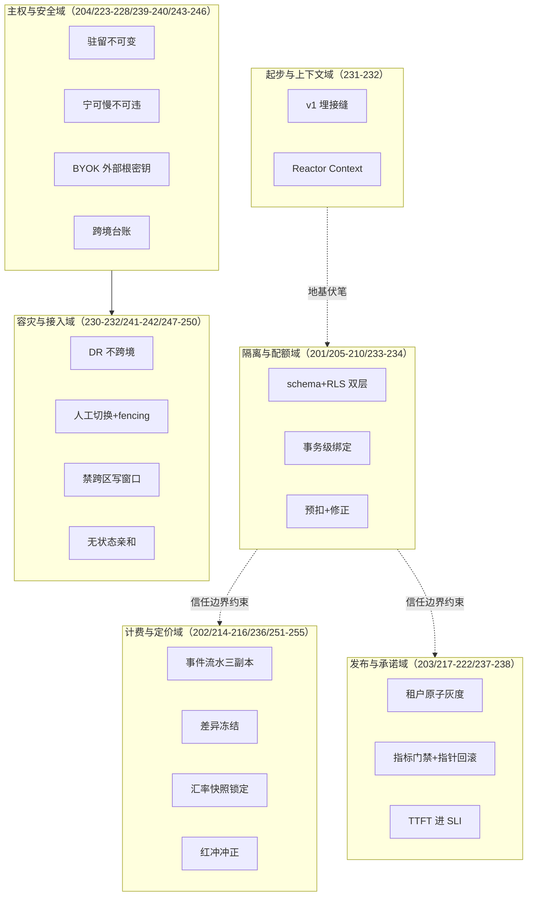
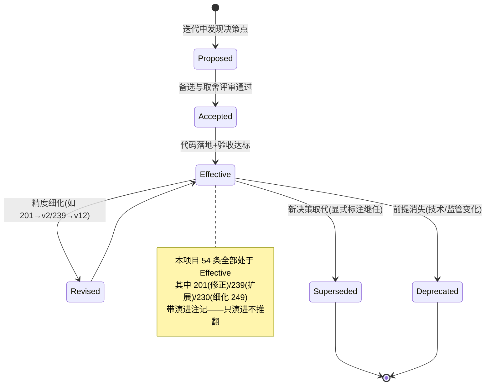
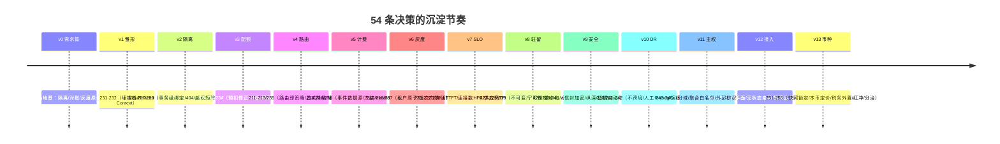

# 项目 07：跨国多租户 SaaS Agent 平台 — 15-ADR 架构决策记录

> **定位**：全项目 54 条架构决策（ADR-201 ~ ADR-255，编号 229 跳空未使用）的总账——每条含一句话决策、出处与状态；十条最有复用价值的决策给出**上下文/备选/取舍/可回滚**详解。Enterprise 客户尽调"你们为什么这么设计"、架构师面试复盘、新人接手，都从这一篇开始。方法论文档见 [附录 08-架构决策方法论/00-ADR架构决策记录]。
>
> **前置阅读**：00-14 全部迭代篇（本篇是对它们的提炼，不是替代——细节永远在迭代篇里）。

---

## 1. 为什么 SaaS 平台必须写 ADR

三个在本项目里真实发生过的场景：

1. **客户尽调即决策考古**。银行租户签约前的安全问卷："多租户数据隔离采用什么层级？为什么不是独立数据库？"——答"团队惯例"过不了尽调，必须有当时的上下文、被否掉的备选、量化的取舍（这正是 ADR-201 的内容）。
2. **决策的半衰期比代码长**。`TenantRlsBinder` 会被重写，但"连接级状态在连接池环境下必然出错"这条教训（ADR-205）会活到下一次换数据库驱动。不落下来，它就随人员流动蒸发——v2 那次越权泄露事故的根因认知，比修复代码本身值钱。
3. **supersede 关系说不清就等于没有架构**。ADR-201 在 00 预录时是"池化+RLS"，v2 修正为"schema+RLS"；ADR-239 在 v8 是"JWT zone 兜底"，v12 扩展为"Anycast+GeoDNS+应用层三层"。没有显式的演进记录，六个月后没人说得清"现在生效的到底是哪一版"。

ADR 的最小完备结构（本项目写法）：**上下文**（什么压力下决策）、**备选方案**（至少两个被认真考虑过的替代）、**取舍**（放弃了什么换到了什么）、**可回滚性**（推翻它的代价与触发重评的信号）。只写"决定"不写"放弃"的 ADR 是宣传稿。

## 2. 决策域全景

54 条 ADR 按域归为六组。隔离与配额域是 SaaS 的地基（信任边界），计费与发布域让它可持续，主权与容灾域是跨国形态下的生存能力：

## 3. 决策总账（ADR-201 ~ ADR-255）

| 编号 | 决策（一句话） | 出处 | 状态 |
|------|----------------|------|------|
| ADR-201 | 池化多租户：schema-per-tenant（业务数据）+ 事务级 RLS（强制），不做库级独享 | 00 预录 / 02 修正 | 生效（v2 修正版） |
| ADR-202 | 计量三副本（网关计数/配额流水/账单聚合）互相对账 | 00 需求篇 | 生效 |
| ADR-203 | 灰度按"租户"为原子单位，不做租户内分流 | 00 需求篇 | 生效 |
| ADR-204 | 驻留区路由在边缘层完成，应用层对区域无感知 | 00 需求篇 | 生效（v12 扩展执行层） |
| ADR-205 | RLS 绑定用事务级 `set_config(..., true)`，弃连接级 SET | 02 迭代一 | 生效 |
| ADR-206 | 越权返回 404 不返回 403 | 02 迭代一 | 生效 |
| ADR-207 | 越权测试矩阵进 CI | 02 迭代一 | 生效 |
| ADR-208 | 配额预扣+完成后修正，非逐 token 实时扣 | 03 迭代二 | 生效 |
| ADR-209 | 超限行为分级（拒/缓/宽） | 03 迭代二 | 生效 |
| ADR-210 | Token 总量与并发会话双限量 | 03 迭代二 | 生效 |
| ADR-211 | 路由即商业策略（tier 决定模型池） | 04 迭代三 | 生效 |
| ADR-212 | Free 高峰降级必须显式标记 | 04 迭代三 | 生效 |
| ADR-213 | 埋点先于计费（v3 打全标签） | 04 迭代三 | 生效 |
| ADR-214 | 账单数据源=原始事件表，指标仅运维用 | 05 迭代四 | 生效 |
| ADR-215 | 对账差异冻结出账 | 05 迭代四 | 生效 |
| ADR-216 | 每笔用量事件带 traceId | 05 迭代四 | 生效 |
| ADR-217 | 灰度原子=租户，批次=内部→试点→百分比（三维分桶） | 06 迭代五 | 生效 |
| ADR-218 | 门禁用批次聚合，单租户异常仅通知 | 06 迭代五 | 生效 |
| ADR-219 | 回滚必通知受影响租户 | 06 迭代五 | 生效 |
| ADR-220 | TTFT 进 SLI | 07 迭代六 | 生效 |
| ADR-221 | HPA 用连接数不用 CPU | 07 迭代六 | 生效 |
| ADR-222 | 供应商 TPM 列为一等容量约束 | 07 迭代六 | 生效 |
| ADR-223 | 驻留绑定不可变，变更走迁移流程 | 08 迭代七 | 生效 |
| ADR-224 | 合规供应商全挂时排队不跨境（宁可慢不可违） | 08 迭代七 | 生效 |
| ADR-225 | 全局服务最小化（仅三个无内容服务） | 08 迭代七 | 生效 |
| ADR-226 | BYOK 用信封加密（每租户独立 KEK） | 09 迭代八 | 生效 |
| ADR-227 | 注入防御三层纵深，无单点依赖 | 09 迭代八 | 生效 |
| ADR-228 | 证据生成自动化进日常管道 | 09 迭代八 | 生效 |
| ADR-230 | 跨区 DR 只在同法域内做 | 10 迭代九 | 生效 |
| ADR-231 | v1 允许"正确架构缺席"，但埋两个接缝（tenant_id 列+AuthContext） | 01 最小 Demo | 生效 |
| ADR-232 | 上下文走 Reactor Context 而非 ThreadLocal | 01 最小 Demo | 生效 |
| ADR-233 | schema 隔离 + RLS 纵深并存（双层互补） | 02 迭代一 | 生效（细化 201） |
| ADR-234 | 并发会话用 Redis SET + EXPIRE 自愈 | 03 迭代二 | 生效 |
| ADR-235 | 租户偏好走 TTL 缓存而非信任 JWT | 04 迭代三 | 生效 |
| ADR-236 | 不可变由 DB 触发器强制（用量事件） | 05 迭代四 | 生效（v11 台账/v13 红冲沿用同模式） |
| ADR-237 | 灰度是配置指针而非代码分支 | 06 迭代五 | 生效 |
| ADR-238 | 错误预算=发布许可证 | 07 迭代六 | 生效 |
| ADR-239 | JWT 带 zone 声明做边缘兜底 | 08 迭代七 | 生效（v12 扩展为三层入口之一） |
| ADR-240 | DEK 明文只在内存，密文落库 + KMS 解密 | 09 迭代八 | 生效 |
| ADR-241 | 区域切换人工决策 + fencing 优先 | 10 迭代九 | 生效 |
| ADR-242 | 容灾演练制度化（月/季/年） | 10 迭代九 | 生效 |
| ADR-243 | 驻留原子从租户细化为"域"（分域租户双 shard、每域单写人） | 12 进阶 v11 | 生效 |
| ADR-244 | 跨区只读副本只复制聚合与元数据（白名单），逐笔入台账 | 12 进阶 v11 | 生效 |
| ADR-245 | BYOK 根密钥可外置到租户 KMS，平台零根密钥持有 | 12 进阶 v11 | 生效（承 226/240） |
| ADR-246 | 跨境流转移留 append-only + 监管检查接口只读化 | 12 进阶 v11 | 生效 |
| ADR-247 | 入口 = Anycast 兜底平面 + GeoDNS 策略平面 + 应用层 307 兜底 | 13 进阶 v12 | 生效（承 239） |
| ADR-248 | 会话亲和无状态化（JWT 推导，不建全局会话表） | 13 进阶 v12 | 生效（受 225 约束） |
| ADR-249 | 区域切换窗口禁跨区写（写 fail-closed，读可降级） | 13 进阶 v12 | 生效（细化 230） |
| ADR-250 | 语义缓存默认不出区；边缘桶须租户按区显式 opt-in | 13 进阶 v12 | 生效 |
| ADR-251 | 计量币种无关；计价用账单周期末日汇率快照锁定 | 14 进阶 v13 | 生效 |
| ADR-252 | 结算币种注册锁定；各币种本币定价（不做美元价×汇率） | 14 进阶 v13 | 生效 |
| ADR-253 | 税务规则外置配置（tax_rule 表），代码只实现判定逻辑 | 14 进阶 v13 | 生效 |
| ADR-254 | 冲正只开红冲单（credit note），不改历史账单 | 14 进阶 v13 | 生效（承 214/236） |
| ADR-255 | 配额管量、风控管坏，分治两套机制 | 14 进阶 v13 | 生效 |

> 编号说明：ADR-229 编号跳空未使用（历史保留，不回填——编号连续性比补齐更重要）。状态说明：「生效」= 当前架构遵守；「修正/扩展」关系显式标注（如 201 的 v2 修正、239 的 v12 扩展），**不删除旧条目**——被演进的历史也是历史。

## 4. 十条详解

以下十条是本项目最有复用价值的决策（也最适合在面试/评审里复述）。

### 4.1 ADR-201：隔离层级——schema + RLS 池化，不做库级独享

- **上下文**：千级租户预期下的隔离选型，隔离是安全边界（租户互为不可信方）不是管理边界。
- **备选**：① 共享表+`where tenant_id=`（逻辑隔离）② schema-per-tenant + 事务级 RLS ③ 库级独享（每租户一库）④ 独立集群。
- **取舍**：①漏写一个 where 就泄露（v1 实际发生了）；③④在千级租户下连接池/迁移/成本全面爆炸，且 Enterprise 驻留诉求由"区域分区"而非"独立库"满足（v8 验证）。②的代价是租户开通稍重（迁移自动跑 N 次 schema）——换来删档=`DROP SCHEMA`、导出=只读该 schema 的强生命周期边界。
- **可回滚**：租户规模结构性下降时可对头部租户升级为独享库（混合形态）；触发重评信号是单租户数据量/合规诉求超出 schema 池化承载力。

### 4.2 ADR-205：RLS 绑定必须事务级——连接池的教训

- **上下文**：v2 第一版实现"新建连接 SET 后归还"，越权压测全泄露——**本项目最痛的一次事故**。
- **备选**：① 连接级 SET（事故版）② 事务级 `set_config(..., true)`（第三参 true=SET LOCAL，随事务失效）③ 显式参数传递（每条 SQL 带 tenant_id，放弃 RLS）。
- **取舍**：①在连接池下对后续借出的连接毫无作用且污染池（反向串号）；③把正确性押回"每条 SQL 都记得"的 code review；②的代价是每个事务开头两次 set_config——用可忽略的开销买"漏写 where 也安全"的兜底。
- **可回滚**：不可回滚到连接级（教训级决策）；泛化结论是"任何连接级状态在池化环境都是错的"。

### 4.3 ADR-208：配额预扣+修正

- **上下文**：Token 日配额的扣减时机——逐 token 实时扣的 Redis QPS 与对话流量同阶，且流式断连时"扣多少"算不清。
- **备选**：① 逐 token 实时扣 ② 请求开始预扣估计量、完成后按实际修正 ③ 事后对账不预扣。
- **取舍**：①成本高且断连语义无解；③存在无限透支窗口（恶意租户发起即不管完成）。②Redis 压力降为每请求 2 次、天然覆盖断连；代价是短暂超限窗口（预扣估计偏低时）——商业上完全可接受的误差换架构简洁。
- **可回滚**：若未来出现"预扣误差不可接受"的合约级承诺，可对 Enterprise 加"结算以修正后为准、预扣仅闸门"的双层语义——预扣机制本身不动。

### 4.4 ADR-214/215：计费口径——事件流水唯一数据源 + 差异冻结

- **上下文**：财务要求账单数字可发誓。Prometheus 指标三宗罪：可重置、可降采样、无审计语义。
- **备选**：① 指标聚合出账 ② 事件流水（append-only，DB 触发器拒改）出账 ③ 三副本对账+差异冻结出账。
- **取舍**：①的账单无法通过任何审计；②解决了数据源但单点计量必有误差；③把"账单对不对"从"我们系统说是多少"变成"三个独立来源一致"，对不上就**冻结不出账、人工裁定后留痕**——错账的信任代价远高于晚出账。
- **可回滚**：不可回滚到指标出账；可演进的是副本数与对账频率（v13 的红冲单是第四个对齐方：渠道流水）。

### 4.5 ADR-217：灰度原子=租户 + 三维分桶

- **上下文**：v5 后 47 家付费租户，一次模型池配置错误让 3 家 Pro 集体变笨、两家威胁退款——全量即时发布在 SaaS 是奢侈品。
- **备选**：① 按用户 hash 分桶（To C 惯例）② 按租户分批 ③ 三维（Prompt/模型/功能）× 租户分层。
- **取舍**：①同一企业内员工看到不同版本 Agent，工单必然产生且无法解释——**灰度粒度=产品的信任一致性单元**；②覆盖单维度；③的代价是灰度状态矩阵变复杂（用配置指针与批次状态机管理，ADR-237），换来每个变更维度独立放量、独立回滚。
- **可回滚**：批次推进可随时暂停/回退（指针秒级）；架构决策本身在"单租户单用户"产品形态出现时才需重评。

### 4.6 ADR-220：TTFT 进 SLI

- **上下文**：签 Enterprise SLA 时定义 SLI——只有成功率够不够？
- **备选**：① 纯成功率 ② 成功率+TTFT 双 SLI ③ 吞吐型 SLI。
- **取舍**：①下 8 秒首字的系统也能 100% 达标但客户会流失——对话产品的"可用"包含"及时"；③适合批处理不适合对话。**SLO 设计是产品知识，不是运维知识**。
- **可回滚**：SLI 集合可随产品形态调整（新增工具调用成功率等）；"延迟类指标进对话 SLI"这一条不该回滚。

### 4.7 ADR-223/225：驻留不可变 + 全局服务最小化

- **上下文**：第一份 Enterprise 合同要求数据不出欧盟——驻留从路线图项变签约阻塞项。
- **备选**：① 运行时可切换驻留区（灵活）② 注册即绑定不可变+迁移工单 ③ 全局共享控制面（省事）vs 最小化全局面（仅三个无内容服务）。
- **取舍**：①运行时切换=不可控的跨境泄露面；③每个全局服务都是驻留的潜在漏洞——"它为什么可以无内容"要逐个回答。代价是跨区协作受限（只能元数据与指标跨境）与全局功能要克制。
- **可回滚**：v11 的分域（ADR-243）是对 223 的**精度细化**而非推翻——租户不可变仍是铁律，域成为新的驻留原子。

### 4.8 ADR-224：宁可慢不可违

- **上下文**：EU 区合规 LLM 供应商集合全挂时的选择：跨境调用保可用，还是排队保合规？
- **备选**：① 静默路由到美区供应商（用户无感）② 显式排队/稍后重试 ③ 完全拒绝服务。
- **取舍**：①违约的合同罚金+监管处罚+信任崩塌是确定性损失；区域供应商故障是概率事件。②把不可用变成可解释可预期的等待；③过度惩罚正常用户。
- **可回滚**：不可回滚到静默跨境（合规红线）；可演进的是排队体验（预估恢复时间、自动重试）。

### 4.9 ADR-230/241：DR 不跨境 + 人工切换 fencing 优先

- **上下文**：EU 大区整体故障的容灾设计——驻留承诺与容灾冗余天然矛盾。
- **备选**：① 跨区容灾（EU 备 US，最快恢复）② 同法域备区（法兰克福备阿姆斯特丹）③ 法域内无备区时降级为区内多 AZ+书面披露；切换执行：自动切换 vs 人工决策。
- **取舍**：①直接违约；②③是风险排序的结果——违约是确定性损失，区域故障是概率事件。切换上误切换（区域实际正常）的代价=5 分钟 RPO 数据+服务抖动，且**双主比宕机更危险**——fencing 先隔离旧主再提升新主，自动切换只在心跳全断+人工超时未响应时兜底。
- **可回滚**：法域内新增可用区/云商时备区选择可调整；"不跨境"这一条在监管环境变化前不可回滚。

### 4.10 ADR-251：汇率快照锁定

- **上下文**：EUR/JPY 结算后，账单必须唯一确定——同月账单任何时候重算都同一金额。
- **备选**：① 出账时刻现算市场汇率 ② 每笔事件按当日汇率计价 ③ 账单周期末日快照锁定。
- **取舍**：①重算不定（汇率是变量）；②把汇率波动污染进原始计量，对账永远算不平且事件表要带金额（破坏"计量币种无关"）；③锁定后账单可审计可重放（快照来源+日期+数值三持久化），汇兑损益显式交给财务。
- **可回滚**：锁定时点（周期末日 vs 出账日）是配置级可调；"计量币种无关"这一地基不可回滚。

## 5. ADR 生命周期

纪律：**新 ADR 只能取代旧 ADR，不能静默违反**。违反生效 ADR 的代码合并请求应被评审拦下（CI 检查清单引用 ADR 编号，如"SQL 会话绑定改动需核对 ADR-205"）。本项目的三个演进注记（201/239/230）都遵循"显式标注继任关系、旧条目保留"。

## 6. 决策与迭代的时间线

节奏规律：**每个迭代的 ADR 都在回答上一迭代暴露的痛点**——决策不是设计出来的，是被痛点逼出来的（这也是各迭代篇"四问"表存在的意义）。

## 7. 写作规范与自检清单

**写新 ADR 的时机**：① 在两个以上合理方案间做了选择 ② 选择会约束后续多个模块 ③ 六个月后没人能记起为什么。三条满足两条就该写。

- [ ] 有上下文（什么压力/什么约束下决策）
- [ ] 至少两个被认真考虑过的备选（稻草人备选不算）
- [ ] 写清楚了放弃了什么（只写收益的是宣传稿）
- [ ] 有可回滚性（推翻代价+触发重评的信号）
- [ ] 标注出处迭代与状态；取代旧决策时显式 supersede/revise
- [ ] 关键 ADR 在代码评审清单中有对应引用（如 ADR-205/215/224/230）
- [ ] 合规红线类决策（224/230/249）标注"不可回滚"及原因——把不可逆性也记录下来

## 8. 总结

| 概念 | 一句话 |
|------|--------|
| 总账 | 54 条（201-255，229 跳空），六决策域，全部含出处与状态 |
| 详解 | 十条最具复用价值：201/205/208/214+215/217/220/223+225/224/230+241/251 |
| 生命周期 | Proposed→Accepted→Effective→Revised/Superseded/Deprecated，只演进不静默违反 |
| 最大公约数 | 不可变靠 DB 强制（205/236/246/254）、宁可慢不可违（224/249）、原子单位对齐信任单元（203/217/223→243）、数据分轨（202/214/251） |

→ [16-工业前沿与演进方向.md](16-工业前沿与演进方向.md)

**下一篇**：16-工业前沿与演进方向（收官）。
