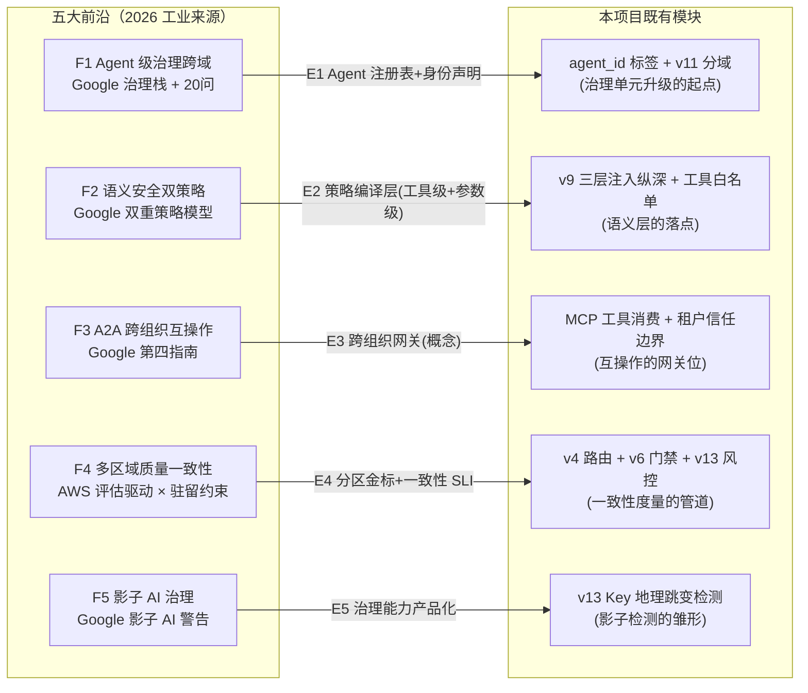
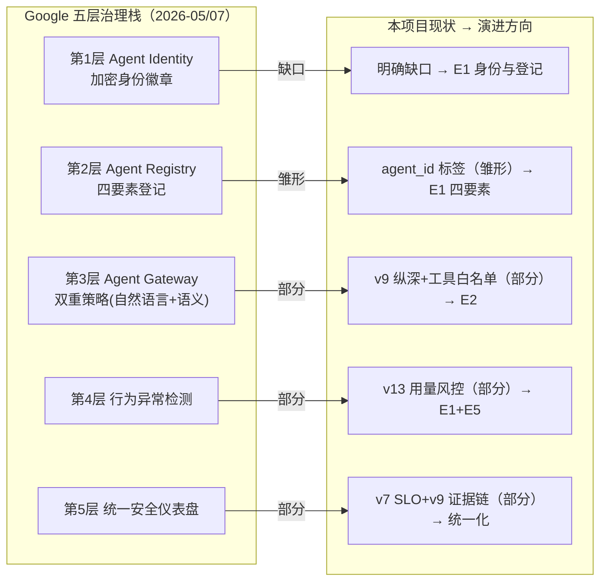
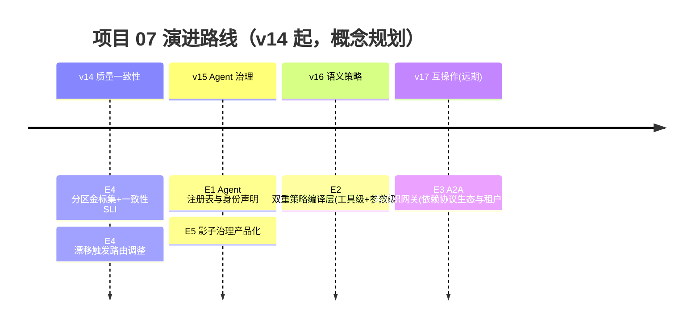

# 项目 07：跨国多租户 SaaS Agent 平台 — 16-工业前沿与演进方向（收官）

> **定位**：收官篇——以 2026 年三份真实工业来源（Google 五指南 / Google 20 问框架 / AWS 评估驱动指南）为坐标，把跨国 SaaS Agent 平台的五大前沿（Agent 级治理跨域适用、语义安全双策略、A2A 跨组织互操作、评估驱动的多区域质量一致性、影子 AI 治理）映射到本项目的演进路线，并收官整个项目。**本文无代码，全部是架构判断。**
>
> **前置阅读**：00-15 全部（本篇是对整个项目的收口，先有体系再谈前沿）。

---

## 1. 三份真实来源

**来源一：Google Cloud《Five guides to building and scaling production-ready AI agents》**（Addy Osmani、Shubham Saboo，2026-05-05，[链接](https://cloud.google.com/blog/topics/developers-practitioners/five-guides-to-building-and-scaling-production-ready-ai-agents)）。五部分系列（长任务设计模式 / Agent 治理栈 / ADK 多 Agent 编排 / A2A+MCP 互操作 / Agent Garden 蓝图），与本项目直接相关的三个论点：

1. **五层治理栈**：Agent Identity（每个 Agent 一枚加密身份徽章）→ Agent Registry（集中注册与工具治理）→ Agent Gateway（自然语言安全策略在入口统一执行）→ 行为异常检测 → 统一安全仪表盘。原文最锋利的一句：**"配置错误的 SaaS 工具会被动泄露数据，而配置错误的 Agent 会主动做坏事"**——2015 年的影子 IT 正在 Agent 身上重演。
2. **A2A 与 MCP 协同**：Agent Cards 发布能力供协调者发现；跨组织联邦让不同机构的 Agent 安全协作；环境事件网格让 Agent 持续响应后台事件而非等待请求。
3. **长任务**：状态可维持最长 7 天；checkpoint-and-resume 从故障恢复；委托审批工作流在暂停等待人工期间零算力消耗。

**来源二：IT Brief《Google sets out 20-question framework for AI agents》**（Sean Mitchell，2026-07-08，[链接](https://itbrief.com.au/story/google-sets-out-20-question-framework-for-ai-agents)）。围绕 Gemini Enterprise Agent Platform 的 20 问框架，核心立场：**Agent 是需要受控运维的软件资产，不是聊天功能**。与本项目相关的要点：

- 20 问覆盖"谁在构建（无代码业务人员 vs 工程师）、谁在用（员工/客户/机器对机器）、如何连接企业数据（MCP）、生产环境需要什么护栏"。
- **单专精 Agent 起步**而非大而全系统（窄范围限错误、降延迟、易排障）。
- **双重策略模型**：常规 IAM 之上叠加**语义检查**（在 Agent 行动前检查请求的含义）——传统权限管"能不能调这个工具"，语义检查管"这个请求想干什么坏事"。
- **委托授权**（delegated authority）：Agent 继承员工的权限子集，动作可归因到人、审计链保留。
- **影子 AI 警告与中央注册表**：每个活跃 Agent、其 owner、触达的数据、允许的工具——四要素登记。
- 成本侧：按任务复杂度选模型（常规用轻模型、终判才用推理模型）、限制上下文窗口/迭代深度/多余工具调用。

**来源三：亚马逊云科技《企业生产级智能体开发部署指南》**（2026 中国峰会发布，储瑞松主旨，2026-07-08，[链接](https://cloud.it168.com/a2026/0708/6939/000006939041.shtml)）。核心论点：**评估必须成为一切工程实践的起点**——六步生命周期（定标准、开发实现、效果评估、灰度上线、持续监控、改进循环）、八类评估维度、覆盖"底层大模型/中间核心组件/最终业务结果"的三层指标库。最锋利的一句：**"底层技术平台可以通过采购获得，但评估标准必须由企业自主掌控——企业的核心竞争壁垒在于其自有的黄金数据集和评分标准。"** 指南同时点出 Agent 落地难的本质：输出概率性、提示词是"运行代码"却无静态分析、对底层模型存在隐式依赖（模型商后台升级会让无代码变动的 Agent 行为漂移）。

三份来源合起来的元判断，恰好是本项目十三个版本的注脚：**跨国 SaaS Agent 平台的竞争力不在模型，在系统**——隔离（v2）、配额（v3）、计费（v5/v13）、灰度（v6）、驻留（v8/v11/v12）全是系统层工程，每一步的收益都不依赖等一个更强的模型。而 AWS 说的"隐式模型依赖导致行为漂移"，在**多区域**架构下还有一个本项目特有的放大器：EU 区合规供应商集合与 US 区不同——**同一租户的 Agent 在两个区跑的根本不是同一个模型**。质量一致性从"运维话题"变成"架构话题"，这正是 F4 的来源。

### 1.1 本节核对（三份真实来源）

- [ ] 三份来源（Google 五指南 / Google 20 问 / AWS 评估指南）的出处链接、作者/主旨与发布日期能对照正文点明，无空引无小编
- [ ] 各自最锋利论点能一句复述：五指南「配置错误的 Agent 会主动做坏事」、20 问「Agent 是需要受控运维的软件资产」、AWS「评估标准必须企业自主掌控」
- [ ] 元判断「竞争力不在模型，在系统」能指认它落到本项目哪几个版本（隔离 v2 / 配额 v3 / 计费 v5+v13 / 灰度 v6 / 驻留 v8+v11+v12）

## 2. 五大前沿与本项目的映射

### F1 Agent 级治理跨域适用

- **前沿是什么**：Google 治理栈把治理单元从"系统"下沉到"Agent"——每枚 Agent 有身份徽章、注册记录、网关策略、行为审计。20 问框架进一步要求"Agent 资产化运维"（owner/工具/数据四要素登记）。
- **本项目现状**：治理单元是"租户"——配额、灰度、驻留、密钥全部按租户。租户内的多个 Agent（Pro 计划 5 个）只是 `agent_id` 标签，**无独立身份、无独立工具授权、无独立行为画像**——一个被注入的 Agent 与正常 Agent 在平台侧无法区分。
- **映射演进（E1）**：Agent 注册表升级为四要素表（agent/owner/数据域/工具集），JWT 之外增加 Agent 身份声明；v11 的分域架构顺势获益——Agent 归属域比用户归属域更稳定（Agent 绑定数据域，员工流动不影响）。治理栈五层的每一层在多区形态下都要回答"这一层是全局还是区内"：身份与注册可全局（无内容），网关策略与行为审计必须区内（含内容）。

### F2 语义安全双策略

- **前沿是什么**：双重策略模型——常规 IAM（角色/资源/动作）+ 语义检查（请求含义审查）在 Agent 行动前执行；所有交互过 Agent Gateway，统一检测策略违规、注入企图、内容问题。
- **本项目现状**：v9 已有三层注入纵深（输入检测/提示词界定/输出 DLP），但**权限表达是枚举式的**（工具白名单、敏感工具清单）——能答"能不能调 send_email"，答不了"这封邮件要把对话历史发去外部域名"。
- **映射演进（E2）**：租户管理员用自然语言写策略（"本 Agent 的工具只能访问本租户知识库，外发内容需人工确认"），平台把它编译成两层检查：工具级（现有 IAM）+ 参数级语义（外发 URL 域名比对租户白名单、正文 DLP）。语义检查天然驻留敏感（要读内容）——**按区部署检查器**，策略规则全局同步（规则无内容）。这与 v6 灰度（ADR-237 指针）天然衔接：策略也是配置指针，可灰度可回滚。

### F3 A2A 跨组织互操作

- **前沿是什么**：A2A 开放协议 + Agent Cards——不同框架、不同组织的 Agent 互相发现能力并协作；跨组织联邦处理共享任务。
- **本项目现状**：平台是封闭的 Agent 托管方——租户的 Agent 之间、租户 Agent 与租户自有系统之间没有标准互操作层（MCP 侧平台已可作为工具消费方，见 [教程 20-MCP协议]）。
- **映射演进（E3，概念演进）**：租户组织内部的 Agent（自建/第三方）通过 A2A 类协议发现并调用平台托管的 Agent（例如租户自建 HR Agent 调用平台的客服知识 Agent）。多租户 SaaS 的特有难题：**跨组织信任的边界单位是租户**——Agent Card 要带租户与工具授权声明，平台网关在互操作入口执行 F2 的双策略（互操作流量不能绕过治理）。这是演进方向而非本项目落地项——单租户内闭环（00-15）仍然成立。

### F4 评估驱动的多区域质量一致性

- **前沿是什么**：AWS 把评估置于工程起点、金标集是护城河；Google 20 问同样强调部署前评估。**多区域**给这个问题加上本项目特有的维度：EU 合规供应商集合 ≠ US 供应商集合（ADR-224），两个区的模型不同——同一 Prompt、同一知识库、同一工具集，输出质量**结构性漂移**。
- **本项目现状**：v6 灰度有指标门禁（在线指标：错误率/满意度代理），但**跨区质量一致性没有度量**——EU 租户抱怨"欧洲区的 Agent 变笨了"只能靠工单发现。
- **映射演进（E4）**：分层金标集按区驻留（金标数据含内容，本身受驻留约束——**每区一份独立金标**，抽样同题双区跑），输出质量一致性 SLI（如双区金标通过率差 < 3 个百分点）进监控；漂移超阈值触发动作：优先调整 EU 区模型池/路由策略（v4 能力），无解时**书面披露双区质量差**（ADR-230"降级方案+书面披露"的质量版）。离线评估可直接用 Spring AI 官方 Evaluator 体系（`RelevancyEvaluator.builder().chatClientBuilder(...)` 等真实 API，见 [附录 05-SpringAI2-API基准 §17]）——LLM-as-Judge 的评审模型也要过合规供应商集合，评审模型本身漂移要交叉校准。

### F5 影子 AI 治理

- **前沿是什么**：Google 两份材料都警告影子 AI（员工用个人账号/API Key 搭建未登记 Agent）与失控的内部 Agent 增长；对策是中央注册表 + 近实时行为审计 + 统一仪表盘。
- **本项目现状**：平台侧的"影子"已有部分检测——v13 的 API Key 地理跳变检测能发现 Key 被共享/转卖；但**租户内部的影子 Agent**（员工绕过 IT 用租户 API Key 接入平台再分发）平台不可见——平台看到的是一个正常 Key 的正常调用。
- **映射演进（E5）**：把影子治理做成**租户可购买的功能**而不是平台单方管控：租户管理员面板展示本租户全部接入 Key 的调用画像（来源 IP 分布/时间模式/Agent 指纹），异常模式（同 Key 多地域并发/调用量突增）告警给租户管理员；配合 E1 的 Agent 注册表，租户可以要求"未登记 Agent 的 Key 降级到只读配额"。**治理能力产品化**——这是 SaaS 把合规成本变成营收的路径。

### 2.1 本节核对（五大前沿映射）

- [ ] 五条前沿（F1 治理跨域 / F2 语义双策略 / F3 A2A 互操作 / F4 多区域质量一致性 / F5 影子 AI）各能说出「前沿是什么 / 本项目现状 / 映射演进 E」三段，方向-现状差距可复述
- [ ] F4 的本项目特有放大器能复述：EU/US 供应商集合不同 → 同租户双区非同一模型 → 质量一致性由运维话题变架构话题
- [ ] F3 标注「概念演进」，能指出它是「演进方向而非本项目落地项」（单租户内闭环 00-15 仍然成立），不误作已实现

## 3. 前沿到模块的映射全景

### 3.1 治理栈逐层对照

把 F1/F2/F5 涉及的五层治理栈逐层对照本项目——两层有雏形、两层部分覆盖、一层是明确缺口：

对照结论：本项目离治理栈最近的路径不是补五个新系统，而是**把治理单元从租户下沉到 Agent**——注册表、身份、画像的主语全换成 Agent，五层里四层的材料就都有了。而多区形态下的判别式（这一层是全局还是区内）本项目已经用 ADR-225 回答过一次（全局服务最小化）——同一把尺子再量一遍治理栈。

### 3.2 本节核对（映射全景与治理栈逐层对照）

- [ ] 五条 F→E→现有模块（N1-N5）的映射在 Mermaid 图上能一一指认（F1→E1→N1 ... F5→E5→N5），无错位
- [ ] 治理栈五层逐层对照的定性（缺口/雏形/部分）能说清：L1 缺口、L2 雏形、L3/L4/L5 部分
- [ ] 「治理单元从租户下沉到 Agent」是共同前置、且借 ADR-225 的同一把尺子量治理栈——能复述这一结论

## 4. 演进路线与优先级

| 优先级 | 演进项 | 理由 | 依赖 |
|--------|--------|------|------|
| P0 | E4 质量一致性 | EU/US 供应商集合不同=结构性漂移，工单已在发生；金标与门禁管道（v6）现成 | 无新组件（金标数据要按区重建） |
| P0 | E1 Agent 注册表 | 治理单元下沉是一切 Agent 级能力（画像/策略/互操作）的主键 | 无新组件 |
| P1 | E5 影子治理产品化 | 复用 v13 风控设施，把合规成本变营收功能 | E1（注册表先有，登记才有对象） |
| P1 | E2 语义双策略 | v9 纵深是现成落点；语义检查器要按区部署 | E1（策略主语是 Agent） |
| P2 | E3 A2A 互操作 | 外部依赖最重（协议生态成熟度/租户需求/跨组织信任），不阻塞主线 | E1+E2+A2A 类协议生态 |

### 4.1 本节核对（演进路线与优先级）

- [ ] v14-v17 与 E 的前沿映射（v14=E4、v15=E1+E5、v16=E2、v17=E3 远期）能从 timeline 与优先级表互读
- [ ] 优先级分级理由能说清：P0（E4 质量一致性、E1 注册表）为何无新组件；P2（E3）为何外部依赖最重、不阻塞主线
- [ ] E1 作为「一切 Agent 级能力的主键」是其列在 P0 的理由，能指出其后置依赖了 E5/E2

## 5. 收官：项目 07 的完整弧线

十七篇文档走完，这个跨国多租户 SaaS 的完整弧线是：

**雏形（v1）→ 硬隔离（v2 schema+RLS）→ 限量（v3 配额限流）→ 分级（v4 租户路由）→ 营收（v5 计费对账）→ 变更安全（v6 三维灰度）→ 承诺（v7 SLO）→ 主权（v8 驻留）→ 审计（v9 SOC 2）→ 生死（v10 DR）→ 主权深化（v11 分域/BYOK/台账）→ 体验（v12 全球接入）→ 商业完备（v13 多币种税务）→ 决策考古（15-ADR 总账）→ 前沿接续（本篇）**。

检验你从项目 07 带走的标准：

1. 能独立复述 **ADR-205**（连接池环境下连接级状态必错——本项目的伤痕决策）与 **ADR-224**（宁可慢不可违——合规降级哲学）的备选方案与取舍。
2. 能对一个陌生行业的 SaaS 化需求画出最小骨架：**schema+RLS 隔离 → 预扣配额 → 事件流水计费 → 租户原子灰度 → 驻留绑定不可变**——五个组件的引入顺序就是 v2→v3→v5→v6→v8 的依赖顺序，倒过来做会返工。
3. 能回答 2026 年的架构面试题："跨国多租户 Agent SaaS 最难的架构张力是什么？"——**数据不动（主权）与请求飞最近（体验）的张力、可用性与合规降级的张力、计费正确性与计量误差的张力**——三对张力本项目分别用 v12+ADR-250、ADR-224/249、ADR-214/215/251 显式回答，且全部"明码标价给业务方选"（这是架构师对诚实的定义）。

**项目 07 到此收官。** 教程线继续：多租户隔离（教程 26）、成本治理（教程 27）、灰度发布（教程 29）、部署运维（教程 33）、Agent 治理与合规框架（教程 43）是本项目触及但不展开的主线知识；附录 05（API 基准）与 13（AI 治理与合规）是手写代码与合规细节的下钻层。

### 5.1 本节核对（收官弧线）

- [ ] 十七篇的完整弧线（雏形→…→决策考古→前沿接续）能从头到尾复述，无跳段
- [ ] 带走的三条标准能自测：ADR-205/224 备选与取舍、五组件引入顺序（schema+RLS→预扣→事件流水→租户原子灰度→驻留不可变）及其依赖序、三对张力的答案（数据不动 vs 请求飞最近 / 可用 vs 合规降级 / 计费正确性 vs 计量误差）
- [ ] 教程/附录收口方向（26/27/29/33/43 + 附录 05/13）与各阶段设计能对应

## 6. 总结

| 概念 | 一句话 |
|------|--------|
| 三来源 | Google 五指南（治理栈/A2A/长任务）、Google 20 问（双重策略/委托授权/影子 AI）、AWS 指南（评估起点/金标护城河/隐式依赖） |
| 五前沿 | 治理跨域 / 语义双策略 / A2A 互操作 / 多区域质量一致性 / 影子 AI 治理 |
| 映射 | 五条演进全部叠加在既有模块上（治理单元从租户下沉到 Agent 是共同前置）——骨架决策兼容前沿，无需推翻 |
| 优先级 | E4 质量一致性与 E1 注册表是 P0；E3 跨组织互操作外部依赖最重为 P2 |
| 弧线 | 雏形→硬隔离→限量→分级→营收→变更→承诺→主权→审计→生死→主权深化→体验→商业完备→决策考古→前沿接续 |

### 6.1 本节核对（全篇收官）

- [ ] 六行总结（三来源 / 五前沿 / 映射 / 优先级 / 弧线）与 §1-§5 各章口径一致，可作全景速览
- [ ] 五前沿与其 `E` 演进（F1-E1 / F1·F5-E1/E5 / F2-E2 / F3-E3 / F4-E4）及优先级（P0/P1/P2）能互读，且每条都带真实来源链接
- [ ] 「骨架决策兼容前沿、无需推翻」是本篇收口结论——能说出它由「抽象决策下沉到既有模块」支撑

> **项目 07 收官**：基础十二篇（00-11）+ 进阶五篇（12-16）到此完整——从单租户雏形到分域主权、全球接入、多币种税务，54 条 ADR 沉淀，形成可落地的跨国多租户 SaaS Agent 平台体系。独立项目，无后续依赖。
