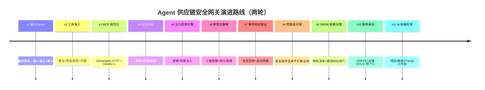
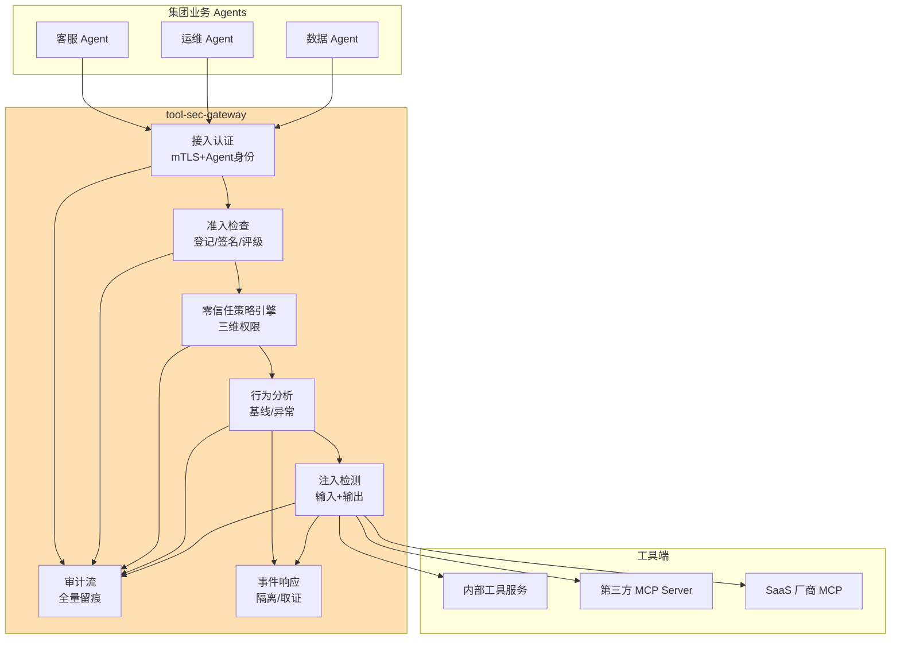

# 项目 08：Agent 供应链安全网关 — 00-需求分析与架构设计

> **定位**：企业统一 MCP/工具接入的安全网关——从代理模式起步，演进到工具准入签名、动态行为分析、注入检测、零信任策略与事件响应的完整供应链安全体系。项目 08 是**完整独立**的项目，不依赖也不引用其他项目。本文给出**完整可手写代码**：pom.xml（全文）、主类、基础配置，以及全项目共享的领域模型。
>
> 「遇到阻塞？→ [教程 04-企业级架构主干/11-安全与权限控制 全篇]、[教程 02-SpringAI核心机制/01-MCP协议]、[附录 08-Agent安全深度 全部]、[前沿 04-MCP生态全景 §供应链安全]」

---

## ★ 阅读顺序总览（序号 = 你的实际阅读顺序）

> 本子文件夹 15 个文件，**文件名编号 00-14 即阅读顺序**。按"全貌 → 起步 → 第一轮八迭代 → 复盘 → 第二轮三迭代 → 决策资产 → 前沿"组织：

| 阶段 | 文件 | 读者定位 |
|------|------|---------|
| ① 全貌 | 00-需求分析与架构设计 | **先读**：业务场景、目标架构、演进路线、完整 pom 与领域模型 |
| ② 起步 | 01-最小Demo搭建 | **动手**：代理模式跑通"收口 + 身份 + 审计"最小闭环 |
| ③ 第一轮迭代 | 02~08（迭代一~七） | **严格顺序**：准入 → MCP 规范 → 行为 → 注入 → 零信任 → 响应 → 高可用——每迭代先跑验收再进下一步 |
| ④ 复盘 | 09-核心代码讲解 | **回顾**：SecurityPipeline 全链编排 + 五个关键设计 + 最易写错五处 |
| ⑤ 第二轮深化 | 10~12（迭代八~十） | **顺序深化**：SBOM 依赖治理 → SPIFFE 身份与全链 mTLS → AI 投毒检测（模型/数据/Prompt 三件套）——收官后由审计与新攻击面驱动的第二演进轮 |
| ⑥ 决策资产 | 13-ADR架构决策记录 | **按需查阅**：31 条 ADR 总账、决策关系图、上下文/备选/取舍/可回滚详解 |
| ⑦ 前沿 | 14-工业前沿与演进方向 | **收官**：Google 五层治理栈对照、语义双策略、A2A 信任传递、P0-P5 演进路线 |

> 第一轮（v1-v8）解决"Agent↔工具这一跳"的完整安全弧线；第二轮（v9-v11）把镜头转向网关自身依赖、服务身份与 AI 原料投毒。两轮合起来才是"供应链"的全长。

---

## 1. 业务场景

### 1.1 背景

某集团全面拥抱 Agent 后，接入了大量第三方 MCP 工具：官方的（filesystem、web-search）、社区的（GitHub 上 200 星的"数据库查询工具"）、供应商的（SaaS 厂商提供的 MCP 接口）。安全团队盘点后惊出一身冷汗：

| 风险 | 现状 |
|------|------|
| 未知来源工具 | 6 个业务 Agent 共接 47 个工具，12 个没人说得清来源与维护者 |
| 工具投毒 | 社区工具的描述文本被检测出"调用时悄悄读取环境变量"的指令 |
| 权限过宽 | filesystem 工具全部以 root 运行；数据库工具共享 DBA 账号 |
| 间接注入 | web-search 返回的网页内容直接进 Prompt，无任何检测 |
| 无审计 | 工具调用日志分散在各业务 Agent，无法回答"谁在何时调了什么" |

### 1.2 项目目标

建设集团统一的 **Agent 工具供应链安全网关**（tool-sec-gateway）：所有内部 Agent 对外部/内部工具的调用一律经网关，实现：

1. **准入**：工具登记、来源验证、签名校验、安全评级
2. **规范化接入**：MCP Streamable HTTP + OAuth 2.1，杜绝私接
3. **行为分析**：工具执行行为基线，异常检测（参数漂移/越权访问/数据外传）
4. **注入检测**：工具返回内容进 Prompt 前的间接注入检测
5. **零信任策略**：工具×数据×调用方三维权限，默认拒绝
6. **事件响应**：攻击检测、自动隔离、取证回放

### 1.3 非目标

- 不做业务 Agent 本身的开发（网关的客户是全集团 Agent）
- 不做通用 WAF/网络防火墙（职责边界：只管 Agent↔工具这一跳）
- 不做工具市场（登记≠分发，市场是后续路线图）

### 1.4 本节核对（业务场景与目标）

| # | 核对项 | 判据 |
|---|--------|------|
| 1 | 六大目标（准入/规范/行为/注入/零信任/响应）与 §3 目标架构中的网关组件一一对应 | 每个 goal 在架构图里能找到承载组件 |
| 2 | 三条非目标没有越界 | 全文后续迭代（02~14）均未出现"做业务 Agent/通用 WAF/工具市场"的内容 |

## 2. 演进路线



**顺序理由**：先收口（v1——没有收口一切安全都是空谈）再准入（v2）再规范（v3）；行为分析在注入检测前（v4→v5：行为基线为注入检测提供数据）；零信任在检测能力之后（v6：没有检测信号的策略是盲目的）；高可用最后（v8——安全组件自己成为单点/瓶颈是最大的讽刺，但它依赖前面全部能力的降级策略设计）。第一轮收官后，审计与真实事件驱动第二轮：依赖治理（v9——治理者先被治理）、服务身份（v10——静态证书墙升级为有生命周期的身份 mesh）、AI 原料投毒（v11——治理对象扩展到模型/数据/Prompt）。

### 2.1 本节核对（演进路线）

| # | 核对项 | 判据 |
|---|------|------|
| 1 | timeline 中 v1~v11 与子文件夹文件编号一一对应 | v1→01、v2→02 … v3→03-MCP规范化接入、v8→08-旁路高可用与收官、v9~v11→10/11/12 三篇 |
| 2 | 顺序理由的因果链（收口→准入→规范→行为→注入→零信任→响应→高可用）无循环依赖 | 每个版本的依赖都指向更早版本 |

## 3. 目标架构（v8 终态）



### 3.1 本节核对（目标架构）

| # | 核对项 | 判据 |
|---|------|------|
| 1 | 网关六个内部组件（AUTHN/ADMIT/POLICY/BEHAV/INJ/RESP）全部汇入审计流 AUD | 图中每个检测组件都有指向 AUD 的边 |
| 2 | 业务 Agent 到工具端无绕过网关的直连边 | 图中 A1/A2/A3 只连 AUTHN，不直连 T1/T2/T3（呼应 ADR-301 强制收口） |

## 4. 关键 ADR（预录）

| # | 决策 | 理由 |
|---|------|------|
| ADR-301 | 强制收口：网络层阻断 Agent 直连工具（egress ACL） | 网关安全的前提是不可绕过；仅靠"约定走网关"等于没有网关 |
| ADR-302 | 检测分层：确定性规则（快）优先、模型检测（准）兜底 | 每次调用都过 LLM 检测的延迟与成本不可接受 |
| ADR-303 | 默认拒绝（deny-by-default）策略 | 白名单演进，而非黑名单追着攻击跑 |
| ADR-304 | 网关自身必须支持旁路模式（fail-open 可配置） | 安全组件全挂导致全集团 Agent 停摆的风险要可控——高危工具 fail-close、低危 fail-open |

### 4.1 本节核对（关键 ADR 预录）

| # | 核对项 | 判据 |
|---|------|------|
| 1 | ADR-301~304 各自能在后续迭代篇中找到落点 | ADR-301→v1 收口、ADR-302→v4/v5 检测分层、ADR-303→v6 零信任、ADR-304→v8 旁路（详见 13-ADR 总账） |
| 2 | 四条决策与 §1.2 六大目标不冲突 | 无任何一条 ADR 取消或削弱某个安全目标 |

## 5. 完整代码（照抄即可）

### 5.1 `pom.xml`（全文，各迭代新增依赖已标注进入时机）

```xml
<?xml version="1.0" encoding="UTF-8"?>
<project xmlns="http://maven.apache.org/POM/4.0.0"
         xmlns:xsi="http://www.w3.org/2001/XMLSchema-instance"
         xsi:schemaLocation="http://maven.apache.org/POM/4.0.0 https://maven.apache.org/xsd/maven-4.0.0.xsd">
    <modelVersion>4.0.0</modelVersion>

    <parent>
        <groupId>org.springframework.boot</groupId>
        <artifactId>spring-boot-starter-parent</artifactId>
        <version>4.1.0</version>
        <relativePath/>
    </parent>

    <groupId>com.group</groupId>
    <artifactId>tool-sec-gateway</artifactId>
    <version>1.0.0</version>
    <name>tool-sec-gateway</name>
    <description>Agent 工具供应链安全网关</description>

    <properties>
        <java.version>21</java.version>
        <spring-ai.version>2.0.0</spring-ai.version>
    </properties>

    <dependencyManagement>
        <dependencies>
            <dependency>
                <groupId>org.springframework.ai</groupId>
                <artifactId>spring-ai-bom</artifactId>
                <version>${spring-ai.version}</version>
                <type>pom</type>
                <scope>import</scope>
            </dependency>
        </dependencies>
    </dependencyManagement>

    <dependencies>
        <!-- 响应式 Web 框架（v1 起） -->
        <dependency>
            <groupId>org.springframework.boot</groupId>
            <artifactId>spring-boot-starter-webflux</artifactId>
        </dependency>

        <!-- 审计/登记存储（v1 起）：R2DBC 响应式数据层 -->
        <dependency>
            <groupId>org.springframework.boot</groupId>
            <artifactId>spring-boot-starter-data-r2dbc</artifactId>
        </dependency>
        <dependency>
            <groupId>io.r2dbc</groupId>
            <artifactId>r2dbc-h2</artifactId>
            <scope>runtime</scope>
        </dependency>
        <!-- 生产换 PostgreSQL：io.r2dbc:r2dbc-postgresql（runtime）+ 改 r2dbc url -->

        <!-- 安全：mTLS（v1）+ OAuth2.1 资源服务器（v3） -->
        <dependency>
            <groupId>org.springframework.boot</groupId>
            <artifactId>spring-boot-starter-security</artifactId>
        </dependency>
        <dependency>
            <groupId>org.springframework.security</groupId>
            <artifactId>spring-security-oauth2-resource-server</artifactId>
        </dependency>
        <dependency>
            <groupId>org.springframework.security</groupId>
            <artifactId>spring-security-oauth2-jose</artifactId>
        </dependency>

        <!-- 可观测（v1 起）：Micrometer + OTel -->
        <dependency>
            <groupId>org.springframework.boot</groupId>
            <artifactId>spring-boot-starter-actuator</artifactId>
        </dependency>
        <dependency>
            <groupId>io.micrometer</groupId>
            <artifactId>micrometer-tracing-bridge-otel</artifactId>
        </dependency>
        <dependency>
            <groupId>io.opentelemetry</groupId>
            <artifactId>opentelemetry-exporter-otlp</artifactId>
        </dependency>

        <!-- 模型：注入判定 / 审批复核的 LLM 层（v5 起，DeepSeek 兼容） -->
        <dependency>
            <groupId>org.springframework.ai</groupId>
            <artifactId>spring-ai-starter-model-openai</artifactId>
        </dependency>

        <!-- MCP：客户端（v3 起，对外连真实工具）+ 服务端（v3 起，对内暴露给业务 Agent） -->
        <dependency>
            <groupId>org.springframework.ai</groupId>
            <artifactId>spring-ai-starter-mcp-client</artifactId>
        </dependency>
        <dependency>
            <groupId>org.springframework.ai</groupId>
            <artifactId>spring-ai-starter-mcp-server-webflux</artifactId>
        </dependency>

        <!-- 开发辅助 -->
        <dependency>
            <groupId>org.projectlombok</groupId>
            <artifactId>lombok</artifactId>
            <optional>true</optional>
        </dependency>
        <dependency>
            <groupId>org.springframework.boot</groupId>
            <artifactId>spring-boot-starter-test</artifactId>
            <scope>test</scope>
        </dependency>
    </dependencies>
</project>
```

### 5.2 主类 `ToolSecGatewayApplication.java`

```java
package com.group.secgw;

import org.springframework.boot.SpringApplication;
import org.springframework.boot.autoconfigure.SpringBootApplication;

/** 网关入口。v1 起即可运行；安全能力按迭代叠加。 */
@SpringBootApplication
public class ToolSecGatewayApplication {

    public static void main(String[] args) {
        SpringApplication.run(ToolSecGatewayApplication.class, args);
    }
}
```

### 5.3 `application.yml`（基础版，各迭代增量见对应篇章）

```yaml
server:
  port: 8443
  ssl:
    enabled: true
    client-auth: want                    # mTLS：请求 Agent 客户端证书（v1 的 Agent 身份来源）
    key-store: ${GATEWAY_KEYSTORE:classpath:gateway.p12}
    key-store-password: ${GATEWAY_KEYSTORE_PASSWORD}
    key-alias: gateway
  http2:
    enabled: true

spring:
  application:
    name: tool-sec-gateway
  ai:
    openai:
      base-url: ${OPENAI_BASE_URL:https://api.deepseek.com}
      api-key: ${OPENAI_API_KEY}
    mcp:
      client:
        streamable-http:                 # v3 起逐个登记真实工具端点（这里仅示例）
          connections:
            example-tool:
              url: https://tools.internal/example/mcp
  r2dbc:
    url: r2dbc:h2:mem:///secgw;DB_CLOSE_DELAY=-1
    username: sa
    password: ""

management:
  endpoints:
    web:
      exposure:
        include: health,metrics,prometheus
  tracing:
    sampling:
      probability: 1.0
```

### 5.4 全项目共享领域模型（v1 定义，后续迭代全部复用）

```java
package com.group.secgw.security;

/** Agent 身份——来自 mTLS 客户端证书的解析结果（v1）。 */
public record AgentPrincipal(
        String agentId,        // 全局唯一 Agent 标识，如 "ops-agent"
        String department,     // 部门：运维/客服/数据
        TrustLevel trustLevel  // 信任等级：PRODUCTION / TESTING / UNTRUSTED
) {

    public enum TrustLevel { PRODUCTION, TESTING, UNTRUSTED }

    /** 从 mTLS 证书 CN 解析：CN=ops-agent@production → agentId + trustLevel */
    public static AgentPrincipal fromCertificateCn(String cn) {
        // X500Principal.getName() 形如 "CN=ops-agent@production,O=Acme"，先剥 CN= 前缀
        String cnValue = cn;
        if (cn.contains("CN=")) {
            cnValue = cn.split("CN=")[1].split(",")[0];
        }
        String[] parts = cnValue.split("@");
        String id = parts[0];
        String level = parts.length > 1 ? parts[1].toUpperCase() : "UNTRUSTED";
        TrustLevel tl = switch (level) {
            case "PRODUCTION" -> TrustLevel.PRODUCTION;
            case "TESTING"    -> TrustLevel.TESTING;
            default           -> TrustLevel.UNTRUSTED;
        };
        return new AgentPrincipal(id, "unknown", tl);
    }
}
```

```java
package com.group.secgw.api;

import com.group.secgw.security.AgentPrincipal;

import java.time.Instant;
import java.util.Map;

/**
 * 一次工具调用的上下文（v1）——贯穿所有检测层的标准输入。
 * 检测层（准入/行为/注入/策略）全部吃这个数据，扩展字段即扩展安全能力。
 */
public record ToolCallContext(
        String traceId,          // 跨网关-工具-业务 Agent 的链路关联
        String sessionId,        // 会话标识（v5 注入隔离状态据此传播）
        AgentPrincipal agent,    // 谁在调
        String toolId,           // 调什么
        Map<String, Object> args,// 参数（原始）
        Instant ts
) {}
```

```java
package com.group.secgw.api;

/** 网关对工具调用的标准响应（v1）。 */
public record ToolResponse(
        boolean success,
        String body,        // 工具返回内容（进注入检测管道前的不信任数据）
        String error,       // 失败原因（success=false 时）
        long durationMs
) {

    public static ToolResponse ok(String body, long durationMs) {
        return new ToolResponse(true, body, null, durationMs);
    }

    public static ToolResponse fail(String error, long durationMs) {
        return new ToolResponse(false, null, error, durationMs);
    }
}
```

```java
package com.group.secgw.audit;

import java.time.Instant;
import java.util.Map;

/** 审计事件（v1）——v4 行为基线、v7 攻击回放都以此为原料。 */
public record AuditEvent(
        long eventId,
        String traceId,
        String sessionId,
        String agentId,               // 谁在调
        String toolId,                // 调什么
        Map<String, Object> args,     // 参数（脱敏后）
        String resultPreview,         // 结果摘要（截断 500 字符）
        long durationMs,
        Outcome outcome,              // STARTED/COMPLETED/FAILED/CANCELLED/QUARANTINED/DENIED/CONFIRM_REQUIRED
        String tagsJson,              // 检测层标注（行为异常/注入隔离/降级标记等，JSON 字符串）
        Instant ts
) {

    public enum Outcome {
        STARTED, COMPLETED, FAILED, CANCELLED,
        QUARANTINED, DENIED, CONFIRM_REQUIRED
    }
}
```

```java
package com.group.secgw.audit;

import com.group.secgw.api.ToolCallContext;
import com.group.secgw.api.ToolResponse;

import java.time.Instant;
import java.util.Map;

/** 审计事件构造助手——把调用上下文 + 响应折叠成审计事件（v1）。 */
public final class AuditEvents {

    private AuditEvents() {}

    /** 调用开始（v1 埋 STARTED，失败/取消也埋，保证覆盖率 100%）。 */
    public static AuditEvent started(ToolCallContext ctx) {
        return new AuditEvent(0, ctx.traceId(), ctx.sessionId(), ctx.agent().agentId(),
                ctx.toolId(), sanitize(ctx.args()), null, 0,
                AuditEvent.Outcome.STARTED, "{}", Instant.now());
    }

    /** 调用完成。resultPreview 截断 500 字符，避免审计表膨胀。 */
    public static AuditEvent completed(ToolCallContext ctx, ToolResponse resp, long durationMs) {
        return new AuditEvent(0, ctx.traceId(), ctx.sessionId(), ctx.agent().agentId(),
                ctx.toolId(), sanitize(ctx.args()), preview(resp.body()),
                durationMs, AuditEvent.Outcome.COMPLETED, "{}", Instant.now());
    }

    /** 失败/拒绝/隔离等带 tagsJson 的形态——检测层写标注。 */
    public static AuditEvent flagged(ToolCallContext ctx, AuditEvent.Outcome outcome,
                                     String tagsJson, String resultPreview) {
        return new AuditEvent(0, ctx.traceId(), ctx.sessionId(), ctx.agent().agentId(),
                ctx.toolId(), sanitize(ctx.args()), preview(resultPreview), 0,
                outcome, tagsJson, Instant.now());
    }

    private static String preview(String s) {
        if (s == null) return null;
        return s.length() <= 500 ? s : s.substring(0, 500);
    }

    /** 脱敏：v1 仅占位（黑名单键），v6 接入 DLP 分级。 */
    private static Map<String, Object> sanitize(Map<String, Object> args) {
        return args == null ? Map.of() : args;
    }
}
```

### 5.5 本节测试与验证（工程骨架与领域模型）

**前置条件**：JDK 21 + Maven；`GATEWAY_KEYSTORE_PASSWORD`、`OPENAI_API_KEY` 环境变量已设置；`gateway.p12` 已放入 classpath（自签证书生成方式见 [01-最小Demo搭建]）。

**材料——纯逻辑单测（`AgentPrincipal.fromCertificateCn` 与 `AuditEvents`）**：

```java
// src/test/java/com/group/secgw/security/AgentPrincipalTest.java（节选，JUnit5）
assertEquals("ops-agent", AgentPrincipal.fromCertificateCn("CN=ops-agent@production,O=Acme").agentId());
assertEquals(TrustLevel.PRODUCTION, AgentPrincipal.fromCertificateCn("CN=ops-agent@production").trustLevel());
assertEquals(TrustLevel.UNTRUSTED, AgentPrincipal.fromCertificateCn("CN=mystery").trustLevel());

// AuditEvents.completed 的 preview 截断：body 传 600 个 'a'
var ev = AuditEvents.completed(ctx, ToolResponse.ok("a".repeat(600), 5), 5);
assertEquals(500, ev.resultPreview().length());
```

**步骤与断言**：

| # | 操作 | 预期（PASS 判据） |
|---|------|------------------|
| 1 | `mvn -f <工程> clean compile` | BUILD SUCCESS——§5.1 pom 全文与 §5.4 五个领域模型类可编译（record/switch 表达式为 Java 21 语法） |
| 2 | 运行上述单测 | 3 个 agentId/trustLevel 断言 + preview 截断断言全部通过（CN 剥前缀、@ 后大小写归一、无 @ 视为 UNTRUSTED） |
| 3 | `AuditEvents.started(ctx)` | 返回 Outcome=STARTED、args 为空 Map 时得 `Map.of()` 而非 null |
| 4 | 按 §5.3 启动应用（依赖各迭代代码齐备后） | 8443 端口监听、`ssl.client-auth: want` 生效（无证书请求不被直接拒绝） |

**失败排查**：①编译报 `record`/`switch` 不识别→编译级别不是 21（查 `java.version` 属性与 JDK）；②`fromCertificateCn` 对 `CN=` 前缀解析错→传入的是完整 X500Principal 串而非纯 CN 值，检查 split 顺序；③启动报 keystore 密码错→`GATEWAY_KEYSTORE_PASSWORD` 未导出或 p12 格式不符。

## 6. 代码使用说明（照抄前必读）

1. **框架 API 全部真实**：Spring AI 2.0.0 的 `ChatClient`/`@Tool`/`CallAdvisor`/`ChatMemory`/`McpSyncClient`/`ToolCallingManager` 等均按 [附录 05-SpringAI2-API基准] 的真实签名书写，可照抄编译；标注「⚠ 修正」处为审计后对齐的基准写法。
2. **自定义业务类是"概念骨架"的进阶版**：本项目业务类（`AdmissionRegistry`、`PolicyRepository`、`BehaviorAnomalyDetector` 等）均给出**完整类 + 全部 import**，唯一留白的是业务实现细节（如具体 SQL、具体模型服务），文档会显式标注「业务实现」。
3. **依赖标注**：凡引入 pom.xml 未声明的新依赖，均标注「需在 pom.xml 中添加依赖」并给出完整 `<dependency>` 片段（pom 全文见 §5.1）。
4. **WebFlux 一致性**：热路径（接收调用、审计落库）用响应式（Reactor/R2DBC）；工具执行面为 Spring AI 同步接口（`ToolCallingManager`），在模型调用线程执行，注释中会说明为什么此处允许 block。禁止 ThreadLocal 传递请求上下文。
5. **演进式阅读**：每个迭代篇都从"上一版痛点"出发，回答四问（新增需求/影响模块/架构演进/上一版痛点），请按 `00 → 01 → 02 → ...` 顺序阅读，不要跳读最终版。

### 6.1 本节核对（代码使用说明）

| # | 核对项 | 判据 |
|---|------|------|
| 1 | 抄代码时遇到新依赖是否都看到「需在 pom.xml 中添加依赖」标注 | 无"静默新增依赖"的代码块 |
| 2 | 热路径代码无 ThreadLocal、无 EventLoop 上的 block | 抽查各迭代篇的响应式段落 |

## 7. 全篇回归验证

**回归断言**（§5.5 骨架验证通过后）：

| # | 操作 | 预期（PASS 判据） |
|---|------|------------------|
| 1 | §5.5 四步全部重跑一次 | 编译、单测、启动均稳定复现 PASS |
| 2 | 对照 §2 演进路线逐篇核验（01~14 每篇的本节验证） | 每个版本号在对应篇章有独立验证节，无缺号 |

**失败排查**：复跑单测偶发失败→测试依赖共享状态（H2 内存库未隔离）；篇章验证缺号→回读该篇补齐本节验证。

## 8. 下一步

→ [01-最小Demo搭建.md](01-最小Demo搭建.md) — 代理模式起步：收口 + 审计。
