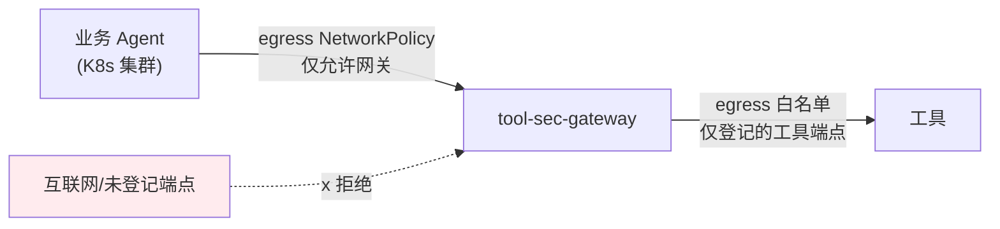

# 项目 08：Agent 供应链安全网关 — 01-最小 Demo 搭建

> **定位**：代理模式网关起步——统一入口、Agent 身份识别、全量调用审计。本篇只做"收口"，安全能力从迭代二开始逐层叠加。**完整可手写代码**：v1 的全部 Java 类（含全部 import）、`application.yml`、SQL DDL。
>
> 「遇到阻塞？→ [教程 04-企业级架构主干/01-微服务拆分与Agent部署 §LLM 网关]、[教程 04-企业级架构主干/03-工具执行可观测与审计]」

---

## 1. 四问

| 问 | 答 |
|----|----|
| **新增了什么需求** | ① 所有工具调用走网关代理（收口） ② 每个调用方有 Agent 身份（mTLS 证书解析） ③ 每次调用落审计日志（含失败/取消） |
| **影响了哪些模块** | 网关入口（RouterFunction + Handler）、身份解析（mTLS 过滤器）、审计（R2DBC 落库） |
| **架构如何演进** | 从"业务 Agent 直连工具"→「**代理模式网关**」：Agent→网关→工具的固定一跳，网络层收口 |
| **上一版痛点是什么** | 无网关——47 个工具直连、无身份、无审计，安全事故无法追溯 |

**与 LLM 网关的区别**（避免混淆）：LLM 网关代理的是 Agent→模型的推理流量；本项目代理的是 Agent→工具的执行流量。两跳分开是安全模型的要求（工具执行有副作用，风险等级完全不同）。

### 1.1 本节核对（四问）

| # | 核对项 | 判据 |
|---|------|------|
| 1 | 四问答案与 §3 代码一一对应 | "影响了哪些模块"列出的三处（路由/身份过滤/审计）在 §3.2/§3.4/§3.6 都有对应类 |
| 2 | "上一版痛点"与本篇遗留痛点（§总结）不混淆 | 痛点是 v1 之前（无网关），遗留痛点是 v1 之后（供 v2 决策） |

## 2. 最小 Demo 边界

三件事：① 所有工具调用走网关代理；② 每个调用方有 Agent 身份（不是匿名流量）；③ 每次调用落审计日志。不做签名、不做检测、不做策略——先让"流量经过网关"这个物理事实成立。

### 2.1 本节核对（最小 Demo 边界）

| # | 核对项 | 判据 |
|---|------|------|
| 1 | §3 代码只实现"收口/身份/审计"三件事 | 全篇无签名校验、无检测、无策略代码（那些属于 02~06） |
| 2 | 审计埋点四态齐全 | STARTED/COMPLETED/FAILED/CANCELLED 在 §3.5 代码路径中都有落点 |

## 3. 完整代码（照抄即可）

### 3.1 `db/schema-v1.sql`（审计表）

```sql
-- 审计事件表（v1 打全字段——后续所有迭代的检测都吃这个数据）
CREATE TABLE IF NOT EXISTS audit_event (
    event_id        BIGINT GENERATED ALWAYS AS IDENTITY PRIMARY KEY,
    trace_id        VARCHAR(64)  NOT NULL,
    session_id      VARCHAR(64),
    agent_id        VARCHAR(64)  NOT NULL,
    tool_id         VARCHAR(128) NOT NULL,
    args_json       TEXT,                       -- 参数（脱敏后，JSON）
    result_preview  VARCHAR(500),               -- 结果摘要（截断 500 字符）
    duration_ms     BIGINT,
    outcome         VARCHAR(32)  NOT NULL,      -- STARTED/COMPLETED/FAILED/CANCELLED/QUARANTINED/DENIED/CONFIRM_REQUIRED
    tags_json       TEXT,                       -- 检测层标注（v4 起使用）
    ts              TIMESTAMP    NOT NULL
);

CREATE INDEX IF NOT EXISTS idx_audit_trace  ON audit_event (trace_id);
CREATE INDEX IF NOT EXISTS idx_audit_tool   ON audit_event (tool_id, ts);
CREATE INDEX IF NOT EXISTS idx_audit_agent  ON audit_event (agent_id, ts);
```

### 3.2 `security/AgentIdentityFilter.java`（mTLS → Agent 身份）

```java
package com.group.secgw.security;

import org.springframework.core.io.buffer.DataBuffer;
import org.springframework.http.HttpStatus;
import org.springframework.http.server.reactive.ServerHttpResponse;
import org.springframework.stereotype.Component;
import org.springframework.web.server.ServerWebExchange;
import org.springframework.web.server.WebFilter;
import org.springframework.web.server.WebFilterChain;
import reactor.core.publisher.Mono;

import java.security.cert.X509Certificate;

/**
 * mTLS 客户端证书 → AgentPrincipal 的 WebFilter（v1）。
 * 从请求级 SSL 会话取对端证书 CN，解析为 Agent 身份并放进 Reactor Context
 * （响应式铁律：请求上下文用 Reactor Context，不用 ThreadLocal）。
 */
@Component
public class AgentIdentityFilter implements WebFilter {

    @Override
    public Mono<Void> filter(ServerWebExchange exchange, WebFilterChain chain) {
        Object[] certs = exchange.getAttribute("javax.net.ssl.peerCertificates");
        X509Certificate cert = certs != null && certs.length > 0
                ? (X509Certificate) certs[0]
                : null;

        if (cert == null) {
            // 非 mTLS 请求：拒绝（收口的身份底线——匿名流量 0）
            ServerHttpResponse resp = exchange.getResponse();
            resp.setStatusCode(HttpStatus.FORBIDDEN);
            return resp.writeWith(Mono.just(bufferOf(resp, "missing client certificate")));
        }

        AgentPrincipal agent = AgentPrincipal.fromCertificateCn(cert.getSubjectX500Principal().getName());
        exchange.getAttributes().put(AgentPrincipal.class.getName(), agent);
        // 放进 Reactor Context，handler 通过 exchange 取（WebFlux 标准通道）
        return chain.filter(exchange).contextWrite(ctx -> ctx.put(AgentPrincipal.class.getName(), agent));
    }

    private DataBuffer bufferOf(ServerHttpResponse resp, String msg) {
        return resp.bufferFactory().wrap(msg.getBytes());
    }
}
```

### 3.3 `registry/ToolEndpoint.java` + `registry/EndpointRegistry.java`（v1 手工登记表）

```java
package com.group.secgw.registry;

/** 工具端点（v1 手工静态表；v2 起接入准入流程）。 */
public record ToolEndpoint(
        String toolId,          // 全局唯一工具名
        String uri,             // 真实端点 URL
        String credentialRef,   // 工具凭证引用（v4 凭证缝：配置只存引用，不落明文）
        boolean egressAllowed   // 是否允许出网（v4 数据流向检测用）
) {}
```

```java
package com.group.secgw.registry;

import org.springframework.stereotype.Component;

import java.util.Map;
import java.util.Optional;
import java.util.concurrent.ConcurrentHashMap;

/**
 * 端点登记表（v1）。
 * 静态初始化 + 内存存储；v2 起替换为 AdmissionRegistry（准入流程产出）。
 */
@Component
public class EndpointRegistry {

    private final Map<String, ToolEndpoint> endpoints = new ConcurrentHashMap<>();

    public EndpointRegistry() {
        // v1 手工登记（示例 3 个）
        register(new ToolEndpoint("weather.query",
                "https://tools.internal/weather/mcp", "tool.weather.apiKey", false));
        register(new ToolEndpoint("fs.read",
                "https://tools.internal/filesystem/mcp", "tool.fs.apiKey", false));
        register(new ToolEndpoint("web.search",
                "https://tools.internal/websearch/mcp", "tool.websearch.apiKey", true));
    }

    public void register(ToolEndpoint ep) {
        endpoints.put(ep.toolId(), ep);
    }

    public Optional<ToolEndpoint> lookup(String toolId) {
        return Optional.ofNullable(endpoints.get(toolId));
    }
}
```

### 3.4 `api/ToolGatewayRoutes.java`（路由）

```java
package com.group.secgw.api;

import org.springframework.context.annotation.Bean;
import org.springframework.context.annotation.Configuration;
import org.springframework.web.reactive.function.server.RouterFunction;
import org.springframework.web.reactive.function.server.RouterFunctions;
import org.springframework.web.reactive.function.server.ServerResponse;

import static org.springframework.web.reactive.function.server.RequestPredicates.POST;

/** 网关路由（v1）：/api/v1/tool/invoke 是唯一工具调用入口。 */
@Configuration
public class ToolGatewayRoutes {

    @Bean
    public RouterFunction<ServerResponse> toolRoutes(ToolGatewayHandler handler) {
        return RouterFunctions.route(POST("/api/v1/tool/invoke"), handler::invoke);
    }
}
```

### 3.5 `api/ToolGatewayHandler.java`（代理 + 审计埋点）

```java
package com.group.secgw.api;

import com.group.secgw.audit.AuditEvent;
import com.group.secgw.audit.AuditEvents;
import com.group.secgw.audit.AuditSink;
import com.group.secgw.registry.EndpointRegistry;
import com.group.secgw.registry.ToolEndpoint;
import com.group.secgw.security.AgentPrincipal;
import org.springframework.stereotype.Component;
import org.springframework.web.reactive.function.client.WebClient;
import org.springframework.web.reactive.function.server.ServerRequest;
import org.springframework.web.reactive.function.server.ServerResponse;
import reactor.core.publisher.Mono;

import java.time.Instant;
import java.util.Map;
import java.util.UUID;

/**
 * 网关核心处理器（v1）：透明代理 + 全量审计。
 * 审计埋点的先见：STARTED/COMPLETED/FAILED/CANCELLED 全覆盖——
 * v4 行为基线靠历史参数分布训练，v7 攻击回放靠事件重放。
 */
@Component
public class ToolGatewayHandler {

    private final WebClient toolsWebClient;
    private final AuditSink auditSink;
    private final EndpointRegistry endpointRegistry;

    public ToolGatewayHandler(WebClient.Builder webClientBuilder,
                              AuditSink auditSink,
                              EndpointRegistry endpointRegistry) {
        // 网关用"网关身份"调用工具，不透传 Agent 的内部凭证（凭证最小化）
        this.toolsWebClient = webClientBuilder.build();
        this.auditSink = auditSink;
        this.endpointRegistry = endpointRegistry;
    }

    public Mono<ServerResponse> invoke(ServerRequest request) {
        return request.bodyToMono(ToolInvokeRequest.class)
                .switchIfEmpty(Mono.error(new IllegalArgumentException("empty body")))
                .flatMap(body -> {
                    AgentPrincipal agent = (AgentPrincipal)
                            request.attributes().get(AgentPrincipal.class.getName());
                    ToolCallContext ctx = new ToolCallContext(
                            UUID.randomUUID().toString(), body.sessionId(), agent,
                            body.toolId(), body.args(), Instant.now());

                    // 审计前半：STARTED 先落（失败也留痕）
                    return auditSink.emit(AuditEvents.started(ctx))
                            .then(forward(ctx))
                            .flatMap(resp -> {
                                AuditEvent done = AuditEvents.completed(ctx, resp, resp.durationMs());
                                return auditSink.emit(done).thenReturn(resp);
                            })
                            .onErrorResume(e -> {
                                AuditEvent failed = AuditEvents.flagged(ctx,
                                        AuditEvent.Outcome.FAILED, "{\"error\":\"" + e.getMessage() + "\"}", null);
                                return auditSink.emit(failed).thenReturn(ToolResponse.fail(e.getMessage(), 0));
                            })
                            .map(resp -> ServerResponse.ok().bodyValue(resp));
                });
    }

    private Mono<ToolResponse> forward(ToolCallContext ctx) {
        ToolEndpoint endpoint = endpointRegistry.lookup(ctx.toolId())
                .orElseThrow(() -> new UnknownToolException(ctx.toolId()));
        long start = System.currentTimeMillis();
        // 注意：此处是"工具执行面"，WebClient 响应式调用（非 block）。
        return toolsWebClient.post()
                .uri(endpoint.uri())
                .header("Authorization", "Bearer " + resolveCredential(endpoint.credentialRef()))
                .bodyValue(ctx.args())
                .retrieve()
                .bodyToMono(String.class)
                .map(body -> ToolResponse.ok(body, System.currentTimeMillis() - start));
    }

    /** v1：凭证从配置取（v4 起改为 CredentialProvider 每操作解析）。 */
    private String resolveCredential(String ref) {
        return System.getenv(ref.replace(".", "_").toUpperCase());
    }

    /** 请求体（record）。 */
    public record ToolInvokeRequest(String sessionId, String toolId, Map<String, Object> args) {}
}
```

### 3.6 `audit/AuditSink.java` + `audit/R2dbcAuditSink.java`（响应式审计落库）

```java
package com.group.secgw.audit;

import reactor.core.publisher.Mono;

/** 审计通道接口（v1）——后续所有检测标注都通过它落库。 */
public interface AuditSink {
    Mono<Void> emit(AuditEvent event);
}
```

```java
package com.group.secgw.audit;

import org.springframework.r2dbc.core.DatabaseClient;   // ⚠ 需引入依赖 org.springframework.boot:spring-boot-starter-data-r2dbc（本地未下载，未 javap 实证；以引入依赖后 javap 输出为准）
import org.springframework.stereotype.Component;
import reactor.core.publisher.Mono;

import java.sql.Timestamp;

/** R2DBC 审计落库（v1）。热路径响应式，不阻塞 EventLoop。 */
@Component
public class R2dbcAuditSink implements AuditSink {

    private final DatabaseClient db;

    public R2dbcAuditSink(DatabaseClient db) {
        this.db = db;
    }

    @Override
    public Mono<Void> emit(AuditEvent e) {
        return db.sql("""
                INSERT INTO audit_event
                    (trace_id, session_id, agent_id, tool_id, args_json,
                     result_preview, duration_ms, outcome, tags_json, ts)
                VALUES
                    (:traceId, :sessionId, :agentId, :toolId, :argsJson,
                     :resultPreview, :durationMs, :outcome, :tagsJson, :ts)
                """)
                .bind("traceId", e.traceId())
                .bind("sessionId", e.sessionId())
                .bind("agentId", e.agentId())
                .bind("toolId", e.toolId())
                .bind("argsJson", e.args().toString())
                .bind("resultPreview", e.resultPreview())
                .bind("durationMs", e.durationMs())
                .bind("outcome", e.outcome().name())
                .bind("tagsJson", e.tagsJson())
                .bind("ts", Timestamp.from(e.ts()))
                .then();
    }
}
```

### 3.7 收口的物理强制（ADR-301）



网络层 egress 策略：业务 Pod 只允许出网到网关；网关只允许出网到登记表内的工具端点。**绕过网关的路径在网络层不存在**——这是"收口"的物理含义。

### 3.8 本节测试与验证（收口代理与审计埋点）

**前置条件**：工程按 00-§5 建好、§3.1 SQL 已在 H2/R2DBC 执行；`gateway.p12` 与 Agent 客户端证书 `ops-agent@production` 已生成（keytool 自签即可）；`TOOL_WEATHER_APIKEY` 等环境变量已设置。

**材料——调用与核对命令**：

```bash
# A. 带 mTLS 客户端证书的正常调用（登记表内工具 weather.query）
curl -sk --cert ops-agent.pem --key ops-agent.key -H 'Content-Type: application/json' \
  -d '{"sessionId":"s-001","toolId":"weather.query","args":{"city":"北京"}}' \
  https://localhost:8443/api/v1/tool/invoke

# B. 不带客户端证书的匿名调用
curl -sk -H 'Content-Type: application/json' \
  -d '{"sessionId":"s-002","toolId":"weather.query","args":{}}' \
  https://localhost:8443/api/v1/tool/invoke

# C. 未登记工具
curl -sk --cert ops-agent.pem --key ops-agent.key -H 'Content-Type: application/json' \
  -d '{"sessionId":"s-003","toolId":"no.such.tool","args":{}}' \
  https://localhost:8443/api/v1/tool/invoke
```

```sql
-- D. 审计核对 SQL
SELECT outcome, COUNT(*) FROM audit_event GROUP BY outcome;
SELECT trace_id, agent_id, tool_id, result_preview FROM audit_event ORDER BY ts DESC LIMIT 5;
```

**步骤与断言**：

| # | 操作 | 预期（PASS 判据） |
|---|------|------------------|
| 1 | 材料 A | HTTP 200，返回 `ToolResponse`（success=true、body 来自真实工具端点、durationMs>0） |
| 2 | 材料 B | HTTP 403，body 为 `missing client certificate`（AgentIdentityFilter 生效，匿名流量 0） |
| 3 | 材料 C | 返回 success=false、error 指向 `UnknownToolException`；审计表出现一条 FAILED（不是静默 500） |
| 4 | 材料 D 第一条 | A 产生 STARTED+COMPLETED 各 1 条、C 产生 STARTED+FAILED 各 1 条——审计覆盖率 100%（含失败） |
| 5 | 材料 D 第二条 | agent_id=`ops-agent`（mTLS CN 解析正确）、同一 traceId 出现两条事件 |
| 6 | 抽查 args_json | 凭证/密钥类字段不出现明文（ADR-307-初：配置只存引用） |

**失败排查**：①材料 A 也 403→`ssl.client-auth` 被改成 `need` 以外的值或证书 CN 不含 `@`（AgentPrincipal 兜底 UNTRUSTED 但过滤器仍放行，检查 attribute key 是否为 `javax.net.ssl.peerCertificates`）；②审计表空→R2DBC URL/schema 未执行 §3.1 DDL，或 `auditSink.emit` 链被 `.then()` 吞掉；③FAILED 不落库→`onErrorResume` 里 emit 的返回值没接回主链。

## 4. 量化验收

| # | 目标 | 验收 |
|---|------|------|
| 1 | 收口完整 | 抽查业务 Agent 直连工具的路径全部被网络层阻断（egress 策略验证） |
| 2 | 身份可信 | 所有调用带 Agent 身份（mTLS 证书）；匿名流量 0 |
| 3 | 审计完整 | 调用审计覆盖率 100%（含失败与取消） |
| 4 | 代理透明 | 业务 Agent 迁移到网关只需改 base-url（协议透明代理） |
| 5 | 延迟可接受 | 网关新增 P99 延迟 < 15ms（v1 无检测逻辑的基线） |

### 4.1 本节测试与验证（量化验收全项）

**前置条件**：§3.8 已全部 PASS（收口/身份/审计三断言已就位）；网络层 egress NetworkPolicy 已下发到测试集群；压测器 `hey` 已安装。

**材料——压测与迁移命令**：

```bash
# E. 延迟压测（网关新增延迟基线；对照"业务 Agent 直连工具端点"的同参数压测）
hey -z 30s -c 20 -disable-keepalive=false \
    -cert ops-agent.pem -key ops-agent.key \
    -D invoke.json -T 'application/json' \
    https://localhost:8443/api/v1/tool/invoke
# F. 直连路径抽查（在业务 Agent Pod 内执行，应被 egress 阻断）
curl -v --max-time 5 https://tools.internal/weather/mcp
```

**步骤与断言**：

| # | 操作 | 预期（PASS 判据） |
|---|------|------------------|
| 1 | 材料 E 与"直连工具"压测对比 | 网关新增 P99 延迟 < 15ms（v1 无检测逻辑的基线） |
| 2 | 材料 F | 连接被 egress 策略阻断（超时/拒绝），网络层不存在绕过路径（验收表 #1） |
| 3 | 把被测业务 Agent 的工具 base-url 改为 `https://网关:8443/api/v1/tool/invoke`，重跑其工具调用用例 | 仅改 base-url 即迁移成功，协议字段不变（验收表 #4 代理透明） |

**失败排查**：断言不符先分层——网关入口日志（请求到没到）→ 策略/校验层日志（为何拦/放）→ 沙箱/执行层（隔离是否真的生效）；安全类验收（egress 阻断等）失败优先验证"测试前置的恶意样本/直连请求是否真的到达被测层"，再查规则；P99 超标先看审计落库是否同步阻塞（R2DBC 应为响应式非阻塞）。

## 5. ADR 演进决策

| # | 决策 | 理由 |
|---|------|------|
| ADR-301 | 收口靠网络层 egress 白名单而非"约定" | 流程约束对恶意绕过无效；安全边界必须建在攻击者无法绕过的层 |
| ADR-305-初 | 审计事件在 v1 打全字段（含 args 与 resultPreview） | 审计是安全网关的"原料"，埋点设计决定 v4/v7 能力上限 |
| ADR-307-初 | 凭证不落地：v1 即用引用 + 环境变量解析 | 配置/日志/错误不含明文；为 v4 凭证缝预铺路 |

### 5.1 本节核对（ADR 演进决策）

| # | 核对项 | 判据 |
|---|------|------|
| 1 | ADR-307-初 在 §3.8 断言 6 有对应验证 | args_json/日志抽查无凭证明文 |
| 2 | ADR-305-初 的"全字段"与 §3.1 表结构一致 | audit_event 含 args_json/result_preview/tags_json |

## 6. 全篇回归验证

**回归断言**（§3.8 与 §4.1 均通过后）：

| # | 操作 | 预期（PASS 判据） |
|---|------|------------------|
| 1 | 重启网关，重跑材料 A→C + SQL D | 行为不变；H2 内存库清空后审计重新从 0 计数（确认无残留脏数据） |
| 2 | 混合轮：A 一次 + B 一次 + C 一次 | 三类链路（正常/匿名拒绝/未知工具）同一进程内均正常，审计条数 = 6 |

**失败排查**：重启后 403→证书文件路径/密码环境变量未持久化；混合轮审计缺条→FAILED 分支的 emit 未接回主链，回查 §3.5 `onErrorResume`。

## 7. 总结

v1 完成「收口 + 身份 + 审计」三件事。遗留痛点（供 v2 决策）：

1. **登记表是手工的**：47 个工具中 12 个"来源与维护者不明"——没有一个工具经过任何形式的准入审核；社区工具的描述文本里发现了诱导 Agent 泄露环境变量的指令（Tool Poisoning 的活案例）
2. **工具凭证混用**：3 个数据库工具共用一个 DBA 账号——网关侧凭证有了，但"哪个工具该有什么权限"没有任何模型
3. **无版本概念**：第三方工具悄悄更新了行为（上周还好好的查询工具这周开始外传数据），没有任何机制感知变化

→ [02-工具准入与签名校验.md](02-工具准入与签名校验.md)
