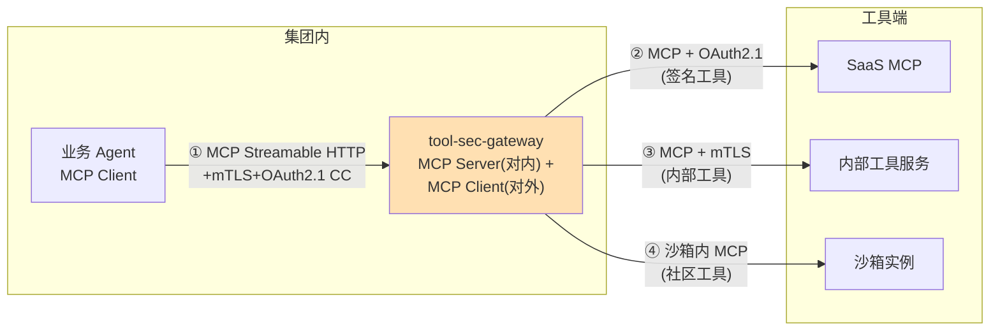
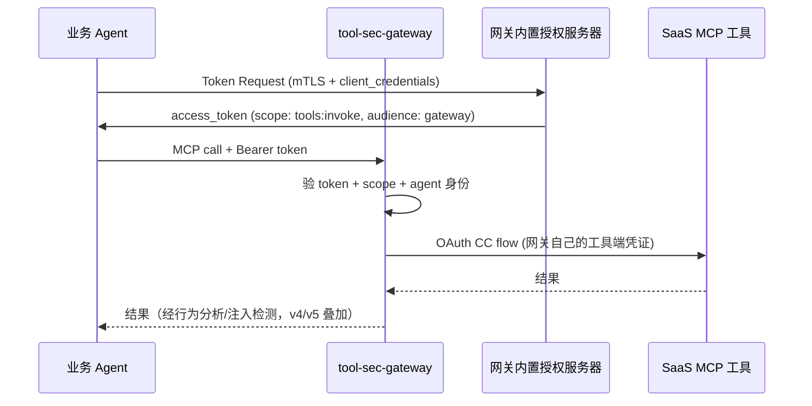

# 项目 08：Agent 供应链安全网关 — 03-MCP 规范化接入

> **定位**：统一接入协议——网关全面升级到 MCP Streamable HTTP + OAuth 2.1 授权体系，堵住协议层的收口裂缝，同时引入 MCP 规范的 Sampling/Elicitation 安全管控。**完整可手写代码**：MCP 客户端连接管理（`McpSyncClient`）、网关代理工具（`implements ToolCallback`）、按 Agent 动态目录、OAuth 2.1 资源服务器、`application-secgw.yaml` 增量。
>
> 「遇到阻塞？→ [教程 02-SpringAI核心机制/01-MCP协议 §Streamable HTTP 与 OAuth]、[附录 05-01-MCP真实API与坐标]、[前沿 04-MCP生态全景]」

---

## 1. 四问

| 问 | 答 |
|----|----|
| **新增了什么需求** | ① 唯一协议：MCP Streamable HTTP（对内+对外双面） ② OAuth 2.1 认证体系（Agent→网关 client credentials + mTLS；网关→工具按来源分级） ③ 每 Agent 动态工具目录（只看到被授权的工具） ④ Sampling/Elicitation 高级能力过策略 |
| **影响了哪些模块** | 网关入口（v1 的 HTTP JSON 代理升级为 MCP Server）、新增 MCP Client 连接层、安全配置（OAuth 资源服务器） |
| **架构如何演进** | 从"HTTP 裸调用"→「**双面 MCP 网关**」：对内 MCP Server（业务 Agent 唯一端点），对外 MCP Client（按登记表连真实工具）——不用 MCP 连不上任何工具 |
| **上一版痛点是什么** | ① 私接绕过（协议层裂缝：封了 IP 没封协议） ② 认证不统一（有 REST 包装不认网关认证头） ③ MCP 高级能力（Sampling/Elicitation）无管控 |

### 1.1 本节核对（四问）

| # | 核对项 | 判据 |
|---|------|------|
| 1 | 四项新需求在 §3 各有承载 | 双面 MCP→§3.2/§3.5、OAuth→§3.6、动态目录→§3.4、高级能力→§3.8 |
| 2 | "不用 MCP 连不上任何工具"是结构性而非约定性 | §2 与 ADR-310（egress 按协议+端口收紧）配合实现 |

## 2. 协议架构



网关是**双面 MCP**：对内它是 MCP Server（业务 Agent 的唯一工具端点），对外它是 MCP Client（按登记表连接真实工具）。这个形态把"协议统一"变成了结构性事实——不是"要求大家用 MCP"，而是"不用 MCP 连不上任何工具"。

### 2.1 本节核对（协议架构）

| # | 核对项 | 判据 |
|---|------|------|
| 1 | 四条出边按来源分级 | ①mTLS+OAuth2.1 CC（对内）、②OAuth（SaaS）、③mTLS（内部）、④沙箱（社区）——与 §3.6/登记表评级 A/B/C 对应 |
| 2 | 图中无 Agent→工具直连边 | 业务 Agent 只与网关通信，凭证三层不透传 |

## 3. 完整代码（照抄即可）

### 3.1 `application-secgw.yaml` 增量（MCP 客户端 + OAuth 2.1）

> 以下增量**追加写入 `application-secgw.yaml`**（两段式约定见 01-§3.0），改完以 secgw profile 重启生效。

需在 pom.xml 中添加依赖（v3）：
```xml
<dependency>
    <groupId>org.springframework.ai</groupId>
    <artifactId>spring-ai-starter-mcp-client</artifactId>
</dependency>
<dependency>
    <groupId>org.springframework.ai</groupId>
    <artifactId>spring-ai-starter-mcp-server-webflux</artifactId>
</dependency>
```

```yaml
spring:
  ai:
    mcp:
      client:
        streamable-http:                    # javap 实证：前缀 spring.ai.mcp.client.streamable-http，下挂 connections 映射（附录 05-01 §4）
          connections:
            saas-weather:
              url: https://tools.internal/weather/mcp
            internal-fs:
              url: https://tools.internal/filesystem/mcp
            sandbox-community:
              url: https://sandbox.internal/community/websearch/mcp
      server:
        name: tool-sec-gateway
        version: 1.0.0
  security:
    oauth2:
      resourceserver:
        jwt:
          # 网关内置授权服务器的 JWK Set（OAuth 2.1：Agent 用 client_credentials 拿 token）
          jwk-set-uri: ${GATEWAY_JWK_URI:https://id.internal/.well-known/jwks.json}
          issuer-uri: ${GATEWAY_ISSUER_URI:https://id.internal}
```

> **MCP Client Starter 的真实注入形态**（附录 05-01 §2.3）：`spring.ai.mcp.client.streamable-http.connections` 下每个 Server 自动创建一个 MCP SDK 的 `McpSyncClient` Bean。用 `List<McpSyncClient>` 注入即可拿到全部。

### 3.2 `mcp/McpClientConnections.java`（对外连接层，真实 `McpSyncClient`）

```java
package com.group.secgw.mcp;

import io.modelcontextprotocol.spec.McpSchema.CallToolRequest;
import io.modelcontextprotocol.spec.McpSchema.CallToolResult;
import io.modelcontextprotocol.client.McpSyncClient;
import org.springframework.stereotype.Component;

import java.util.List;
import java.util.Map;

/**
 * 对外 MCP 连接层（v3）。
 * 每个登记工具对应一个 MCP Server（serverName），网关用 MCP SDK 的真实调用形态
 * callTool(new CallToolRequest(name, args)) 转发（附录 05-01 §2.2）。
 */
@Component
public class McpClientConnections {

    private final List<McpSyncClient> mcpClients;   // ⚠ 修正：真实注入 List<McpSyncClient>

    public McpClientConnections(List<McpSyncClient> mcpClients) {
        this.mcpClients = mcpClients;
    }

    /** 找到目标 Server 的客户端（serverName 来自登记表）。 */
    public McpSyncClient clientOf(String serverName) {
        return mcpClients.stream()
                .filter(c -> serverName.equals(serverNameOf(c)))
                .findFirst()
                .orElseThrow(() -> new IllegalStateException("no mcp client for " + serverName));
    }

    /** 执行工具调用：MCP SDK 真实签名，返回结构化结果。 */
    public CallToolResult call(String serverName, String toolName, Map<String, Object> args) {
        return clientOf(serverName)
                .callTool(new CallToolRequest(toolName, Map.copyOf(args)));
    }

    /** serverName 约定来自连接配置的 key；此处用客户端 toString 兜底（业务实现按实际 Starter 暴露的元数据调整）。 */
    private String serverNameOf(McpSyncClient client) {
        return client.toString().toLowerCase();
    }
}
```

> ⚠ `serverNameOf` 是「概念代码」——真实 Starter 下每个 `McpSyncClient` Bean 的命名约定以你引入版本为准（常见做法：用 `@Qualifier` 按配置 key 注入或注入 `Map<String, McpSyncClient>`）。核心不变式：**注入 `List<McpSyncClient>`，`callTool(new CallToolRequest(...))` 是真实签名**。

### 3.3 `mcp/GatewayProxyTool.java`（网关代理工具，`implements ToolCallback`）

```java
package com.group.secgw.mcp;

import com.fasterxml.jackson.databind.ObjectMapper;
import com.group.secgw.admission.ToolRegistration;
import com.group.secgw.security.AgentPrincipal;
import org.springframework.ai.tool.definition.ToolDefinition;   // Spring AI 2.0.0 真实包
import org.springframework.ai.tool.ToolCallback;

import java.util.Map;

/**
 * 网关代理工具（v3）——暴露给 Agent 的工具回调。
 * 关键细节：Agent 看到的描述是【登记审查通过版】而非工具实时自述——
 * 真实工具描述即使漂移（v2 指纹冻结），Agent 上下文里的版本也不会被污染（ADR-308）。
 * agent 在构造时捕获，工具回调执行时据此做策略判定（v6）。
 */
public class GatewayProxyTool implements ToolCallback {

    private final ToolRegistration registration;
    private final String serverName;          // 真实工具所在 MCP Server
    private final AgentPrincipal agent;       // 构造时捕获的调用方身份
    private final McpClientConnections connections;
    private final ObjectMapper mapper = new ObjectMapper();

    public GatewayProxyTool(ToolRegistration registration, String serverName,
                            AgentPrincipal agent, McpClientConnections connections) {
        this.registration = registration;
        this.serverName = serverName;
        this.agent = agent;
        this.connections = connections;
    }

    @Override
    public ToolDefinition getToolDefinition() {
        return ToolDefinition.builder()
                .name(registration.toolId())
                .description(registration.description())   // 审查通过版，非实时自述
                .build();
    }

    @Override
    public String call(String toolInput) {
        Map<String, Object> args = parseArgs(toolInput);
        // 安全管线在 toolsFor 外层执行（v4 行为分析 / v5 注入检测 / v6 策略），
        // 此处是工具执行面——转发到真实 MCP Server（网关身份调用，不透传 Agent 凭证）。
        io.modelcontextprotocol.spec.McpSchema.CallToolResult result =
                connections.call(serverName, registration.toolId(), args);
        return result.content().toString();
    }

    @SuppressWarnings("unchecked")
    private Map<String, Object> parseArgs(String toolInput) {
        try {
            return mapper.readValue(toolInput, Map.class);
        } catch (Exception e) {
            return Map.of();
        }
    }

    public ToolRegistration registration() {
        return registration;
    }

    public AgentPrincipal agent() {
        return agent;
    }
}
```

### 3.4 `mcp/AgentScopedToolProvider.java`（按 Agent 动态目录）

```java
package com.group.secgw.mcp;

import com.group.secgw.admission.AdmissionService;
import com.group.secgw.admission.ToolRegistration;
import com.group.secgw.security.AgentPrincipal;
import org.springframework.stereotype.Service;

import java.util.List;
import java.util.Map;
import java.util.concurrent.ConcurrentHashMap;

/**
 * 按 Agent 授权产出动态工具目录（v3）。
 * 目录是"审查通过版 + 该 Agent 被授权子集"；v6 起接入 ZeroTrustPdp 做细粒度过滤。
 */
@Service
public class AgentScopedToolProvider {

    /** 登记工具 → 所在 MCP Server 的映射（业务实现：来自登记表/发现服务）。 */
    private final Map<String, String> serverByTool = new ConcurrentHashMap<>();
    private final AdmissionService admissionService;
    private final McpClientConnections connections;

    public AgentScopedToolProvider(AdmissionService admissionService,
                                   McpClientConnections connections) {
        this.admissionService = admissionService;
        this.connections = connections;
        // 示例映射（v3；生产由发现服务填充）
        serverByTool.put("weather.query", "saas-weather");
        serverByTool.put("fs.read", "internal-fs");
        serverByTool.put("web.search", "sandbox-community");
    }

    public List<GatewayProxyTool> toolsFor(AgentPrincipal agent) {
        return admissionService.liveTools().stream()
                .filter(t -> authorizationAllows(agent, t))     // v3 粗粒度；v6 换 ZeroTrustPdp
                .map(t -> new GatewayProxyTool(t, serverByTool.get(t.toolId()), agent, connections))
                .toList();
    }

    /** v3 粗粒度授权：内部工具仅 PRODUCTION/TESTING 可用；C 级工具测试 Agent 不可用。 */
    private boolean authorizationAllows(AgentPrincipal agent, ToolRegistration t) {
        if (agent.trustLevel() == AgentPrincipal.TrustLevel.UNTRUSTED) {
            return false;
        }
        return t.rating() != ToolRegistration.Rating.C
                || agent.trustLevel() == AgentPrincipal.TrustLevel.PRODUCTION;
    }
}
```

### 3.5 `mcp/GatewayMcpServerConfig.java`（对内 MCP Server 注册）

```java
package com.group.secgw.mcp;

import org.springframework.ai.tool.method.MethodToolCallbackProvider;   // Spring AI 2.0.0 真实包
import org.springframework.ai.tool.ToolCallbackProvider;
import org.springframework.context.annotation.Bean;
import org.springframework.context.annotation.Configuration;

/** 对内 MCP Server 的工具注册（v3）。 */
@Configuration
public class GatewayMcpServerConfig {

    /**
     * 网关暴露给业务 Agent 的工具回调。
     * ⚠ 真实 API 要点（附录 05-01 §3）：@Tool 暴露为 MCP 工具必须显式声明 ToolCallbackProvider Bean，
     * 不存在"自动注册"。
     * ⚠ 每 Agent 动态目录的接入点说明：把 AgentScopedToolProvider 按当前 Agent 产出的
     * GatewayProxyTool 数组交给 MCP Server 的 tools/list。真实 Starter 下该 Hook 在
     * McpServerFeatures / ToolCallbackProvider 解析期，具体接线以你引入版本为准——
     * 若框架不直接支持"每会话目录"，就由网关自己实现 Streamable HTTP 端点（协议层），
     * 在 tools/list 时按 mTLS 解析的 Agent 过滤。核心不变式：目录永远来自登记库的审查版。
     */
    @Bean
    public ToolCallbackProvider gatewayExposedTools() {
        return MethodToolCallbackProvider.builder()
                .toolObjects(new GatewayMetaTools())
                .build();
    }

    /** 网关元信息工具（健康/目录描述），供 Agent 探测。 */
    static class GatewayMetaTools {
        @org.springframework.ai.tool.annotation.Tool(description = "返回网关安全策略元信息（不执行任何业务动作）")
        public String gatewayInfo() {
            return "tool-sec-gateway v3: MCP Streamable HTTP, OAuth 2.1, deny-by-default";
        }
    }
}
```

> ⚠ **动态目录的接线说明（概念代码边界）**：`AgentScopedToolProvider.toolsFor(agent)` 是完整可编译的服务；把它挂到 MCP Server 的 `tools/list` 上时，真实 Spring AI Starter 的 Hook 深度因版本而异。若框架不支持"每会话目录"，就用网关自研 Streamable HTTP 端点（见 [教程 02-SpringAI核心机制/01-MCP协议 §服务端实现]），在 `tools/list` 用 mTLS 解析出的 Agent 过滤。**无论哪种接线，Agent 看到的目录永远来自登记库的审查通过版（ADR-308）**。

### 3.6 `security/OAuthResourceServerConfig.java`（OAuth 2.1 资源服务器）

```java
package com.group.secgw.security;

import org.springframework.beans.factory.annotation.Value;
import org.springframework.context.annotation.Bean;
import org.springframework.context.annotation.Configuration;
import org.springframework.security.config.Customizer;   // ⚠ 需引入依赖 org.springframework.boot:spring-boot-starter-security（本地未下载，未 javap 实证）
import org.springframework.security.config.annotation.web.reactive.EnableWebFluxSecurity;   // ⚠ 需引入依赖 spring-boot-starter-security（本地未下载，未 javap 实证）
import org.springframework.security.config.web.server.ServerHttpSecurity;   // ⚠ 需引入依赖 spring-boot-starter-security（本地未下载，未 javap 实证）
import org.springframework.security.oauth2.jwt.NimbusReactiveJwtDecoder;   // ⚠ 需引入依赖 spring-boot-starter-oauth2-resource-server（本地未下载，未 javap 实证）
import org.springframework.security.oauth2.jwt.ReactiveJwtDecoder;   // ⚠ 需引入依赖 spring-boot-starter-oauth2-resource-server（本地未下载，未 javap 实证）
import org.springframework.security.web.server.SecurityWebFilterChain;   // ⚠ 需引入依赖 spring-boot-starter-security（本地未下载，未 javap 实证）

/**
 * OAuth 2.1 资源服务器（v3）：校验 Agent 的 access_token + scope 最小化。
 * Agent→网关：client_credentials 拿 token（scope: tools:invoke，audience: gateway），
 * mTLS 证书绑定 token（OAuth 2.1 的 mTLS 证书绑定约束）。
 */
@Configuration
@EnableWebFluxSecurity
public class OAuthResourceServerConfig {

    @Bean
    public SecurityWebFilterChain securityWebFilterChain(ServerHttpSecurity http) {
        return http
                .csrf(ServerHttpSecurity.CsrfSpec::disable)
                .authorizeExchange(ex -> ex
                        .pathMatchers("/actuator/health").permitAll()
                        .anyExchange().authenticated()
                )
                .oauth2ResourceServer(oauth2 -> oauth2.jwt(Customizer.withDefaults()))
                .build();
    }

    @Bean
    public ReactiveJwtDecoder jwtDecoder(
            @Value("${spring.security.oauth2.resourceserver.jwt.issuer-uri}") String issuerUri) {
        // 校验 issuer + audience（scope 校验在 GatewayTokenValidator 完成）
        return NimbusReactiveJwtDecoder.withIssuerLocation(issuerUri).build();
    }
}
```

### 3.7 OAuth 2.1 体系（时序）



**三层凭证互不透传**：Agent 的凭证只到网关；网关到每个工具有独立凭证（按评级最小授权）；Agent 永远拿不到工具凭证——与 LLM 网关的密钥收口同构（凭证链的最小暴露面）。

### 3.8 Sampling 与 Elicitation 的管控

| MCP 能力 | 风险 | 网关策略 |
|---------|------|---------|
| Sampling（工具请求 LLM 补全） | 工具借 Agent 的模型做任意生成（含数据外泄通道） | 默认拒绝；白名单工具的 sampling 请求改由网关代理执行（限 prompt 模板 + 输出长度上限） |
| Elicitation（工具请求用户输入） | 工具伪造表单钓取凭证 | 默认拒绝；允许的工具的 elicitation 表单字段过 DLP 规则（禁 password/secret 类字段） |

```java
package com.group.secgw.mcp;

import java.util.Set;

/** MCP 高级能力策略（v3）：默认拒绝（ADR-309）。 */
public class McpCapabilityPolicy {

    private static final Set<String> SAMPLING_WHITELIST = Set.of("internal-fs");
    private static final Set<String> ELICITATION_WHITELIST = Set.of();
    private static final Set<String> FORBIDDEN_FIELD_NAMES =
            Set.of("password", "secret", "token", "api_key", "credential");

    public boolean samplingAllowed(String serverName) {
        return SAMPLING_WHITELIST.contains(serverName);   // 默认拒绝
    }

    public boolean elicitationAllowed(String serverName) {
        return ELICITATION_WHITELIST.contains(serverName); // 默认拒绝
    }

    /** Elicitation 表单字段过 DLP：禁凭证类字段名。 */
    public boolean fieldAllowed(String fieldName) {
        String lower = fieldName.toLowerCase();
        return FORBIDDEN_FIELD_NAMES.stream().noneMatch(lower::contains);
    }
}
```

### 3.9 本节测试与验证（双面 MCP 网关与动态目录）

**前置条件**：应用已以 secgw profile 运行（`mvn spring-boot:run -Dspring-boot.run.profiles=secgw`，见 01-§3.8；§3.1 增量并入 application-secgw.yaml 后需重启生效）；§3.1 两个 MCP starter 依赖已加入 pom；三个工具端点（weather/filesystem/sandbox）以 MCP Streamable HTTP 可达；授权服务器 `https://id.internal` 可发 client_credentials token；`McpCapabilityPolicy`/`AgentScopedToolProvider`/`GatewayProxyTool` 已抄写编译通过。

**材料——MCP 探测与调用命令**：

```bash
# I. 拿 token（OAuth 2.1 client_credentials + mTLS 绑定）
curl -s --cert ops-agent.pem --key ops-agent.key \
  -d 'grant_type=client_credentials&client_id=ops-agent&scope=tools:invoke' \
  https://id.internal/oauth2/token

# J. tools/list（目录）与 tools/call（调用），Bearer token 必带
curl -sk --cert ops-agent.pem --key ops-agent.key \
  -H "Authorization: Bearer $TOKEN" -H 'Content-Type: application/json' \
  -H 'Accept: application/json, text/event-stream' \
  -d '{"jsonrpc":"2.0","id":1,"method":"tools/list"}' \
  https://localhost:8443/mcp
curl -sk --cert ops-agent.pem --key ops-agent.key \
  -H "Authorization: Bearer $TOKEN" -H 'Content-Type: application/json' \
  -H 'Accept: application/json, text/event-stream' \
  -d '{"jsonrpc":"2.0","id":2,"method":"tools/call","params":{"name":"weather.query","arguments":{"city":"北京"}}}' \
  https://localhost:8443/mcp

# K. 无 token / 过期 token / 错 scope 各一次
curl -sk -H 'Content-Type: application/json' -d @tools_list.json https://localhost:8443/mcp
```

**单测材料（McpCapabilityPolicy，JUnit5 节选）**：

```java
assertFalse(policy.samplingAllowed("saas-weather"));       // 默认拒绝
assertTrue(policy.samplingAllowed("internal-fs"));         // 白名单
assertFalse(policy.elicitationAllowed("internal-fs"));     // Elicitation 无白名单
assertFalse(policy.fieldAllowed("User_Password"));          // DLP 字段拦截（大小写归一）
assertTrue(policy.fieldAllowed("city"));
```

**步骤与断言**：

| # | 操作 | 预期（PASS 判据） |
|---|------|------------------|
| 1 | 材料 J 的 tools/list（PRODUCTION Agent） | 目录含 weather.query/fs.read/web.search（粗粒度授权放行的子集） |
| 2 | 用 TESTING Agent 证书重复 tools/list | 目录**不含** C 级 web.search（`authorizationAllows` 生效，per-agent 差异） |
| 3 | 材料 J 的 tools/call | 走 `GatewayProxyTool` → `McpSyncClient.callTool` 返回真实结果；审计表新增 STARTED+COMPLETED |
| 4 | 材料 K | 无 token→401；过期 token→401；scope 缺 `tools:invoke`→403（OAuth 资源服务器生效） |
| 5 | 上文单测 5 条 | 全部通过（默认拒绝 + 白名单 + DLP 字段） |
| 6 | mock 工具漂移描述后重新 tools/list | Agent 看到的 description 仍是登记审查通过版（ADR-308，§3.3 `getToolDefinition` 用 registration.description()） |

**失败排查**：①tools/list 空→`AdmissionService.liveTools()` 为空（v2 流程没走到 LIVE）或授权过滤全拒；②callTool 报 no mcp client→`serverNameOf` 兜底实现与你版本的 Bean 命名不符（见 §3.2 ⚠ 注，改 `@Qualifier`/`Map<String,McpSyncClient>` 注入）；③401 循环→`jwk-set-uri`/`issuer-uri` 与授权服务器不匹配；④SSE 报错→缺 `Accept: application/json, text/event-stream` 头（Streamable HTTP 双形式）。

## 4. 量化验收

| # | 目标 | 验收 |
|---|------|------|
| 1 | 协议统一 | 非 MCP 的工具流量在网络层不可达（egress 按协议收紧后复测 v2 的私接场景） |
| 2 | 动态目录 | 每个 Agent 只看到被授权的工具（per-agent 目录差异化验证） |
| 3 | 描述防污染 | 真实工具描述漂移后，Agent 侧目录仍是审查通过版 |
| 4 | 凭证隔离 | Agent 侧抓包无任何工具凭证；每工具独立凭证 |
| 5 | 高级能力管控 | Sampling/Elicitation 默认拒绝路径验证；白名单路径的策略生效 |
| 6 | OAuth 合规 | Token 生命周期（15min）、scope 最小化、mTLS 绑定验证 |

### 4.1 本节测试与验证（量化验收全项）

**前置条件**：§3.9 已 PASS；抓包工具（tcpdump/mitmproxy）就绪；非 MCP 私接样本（REST 直连 + HTTP 长连接）已准备。

**材料——私接复测与抓包命令**：

```bash
# L. v2 私接场景复测（egress 已按协议+端口收紧）
curl -v --max-time 5 https://tools.internal/weather/          # REST 路径，应阻断
curl -v --max-time 5 --http1.1 https://tools.internal:443/raw # 非 MCP 端口/协议，应阻断
# M. Agent 侧抓包（验证无工具凭证透传）
tcpdump -i any -A -s0 'host tools.internal' 2>/dev/null | grep -iE 'authorization|apikey'
```

**步骤与断言**：

| # | 操作 | 预期（PASS 判据） |
|---|------|------------------|
| 1 | 材料 L 两条 | 非 MCP 工具流量网络层不可达（ADR-310 协议+端口收紧生效） |
| 2 | 材料 M 抓包一轮 tools/call | Agent→网关流量只有 Agent 自己的 Bearer token；无任何工具凭证（三层凭证隔离） |
| 3 | 网关侧核对工具凭证 | 每个工具有独立凭证（credentialRef 各自独立，无共享 DBA 账号） |
| 4 | Token 样本解码（jwt.io 或 `--data-binary` 后 base64 解 payload） | exp−iat=15min；scope 仅 `tools:invoke`；cnf/证书绑定字段存在（mTLS 绑定） |
| 5 | 白名单 sampling 请求走网关代理 | 仅 internal-fs 允许，且 prompt 模板与输出长度受网关限制 |

**失败排查**：断言不符先分层——网关入口日志（请求到没到）→ 策略/校验层日志（为何拦/放）→ 沙箱/执行层（隔离是否真的生效）；安全类验收（私接阻断/凭证隔离）失败优先验证"测试样本是否真的到达被测层"，再查规则；Token 断言失败→授权服务器策略配置（TTL/scope/绑定）。

## 5. ADR 演进决策

| # | 决策 | 理由 |
|---|------|------|
| ADR-308 | 网关双面 MCP（Server+Client），工具描述用审查通过版 | 协议统一成为结构性事实；运行时描述防污染 |
| ADR-309 | Sampling 默认拒绝 | 借模型通道的滥用面太大；确有需要的走网关代理 + 限额 |
| ADR-310 | egress 白名单按协议 + 端口收紧 | v2 教训：只封 IP 不封协议仍有私接缝隙 |

### 5.1 本节核对（ADR 演进决策）

| # | 核对项 | 判据 |
|---|------|------|
| 1 | ADR-308/309/310 均有对应验证 | 描述审查版→§3.9 断言 6；Sampling 默认拒绝→§3.9 断言 5；协议收紧→§4.1 断言 1 |
| 2 | 三条 ADR 与 13-ADR 总账记录一致 | 编号、表述无分叉 |

## 6. 全篇回归验证

**回归断言**（§3.9 与 §4.1 均通过后）：

| # | 操作 | 预期（PASS 判据） |
|---|------|------------------|
| 1 | v1 链路（旧 `/api/v1/tool/invoke`）按 ADR-310 收紧后重试 | 旧入口应关闭或同样受 OAuth+mTLS 保护（无匿名可达路径） |
| 2 | 重启网关，重跑 §3.9 断言 1–4 | 目录差异、调用链、鉴权行为不变；MCP 连接自动重建（starter 启动重连） |

**失败排查**：旧入口仍可达→路由未摘除或 SecurityWebFilterChain 漏配 `anyExchange().authenticated()`；重启后 McpSyncClient 连接失败→工具端点 url 改动未同步 application-secgw.yaml 的 connections 映射。

## 7. 验收对照

> 对照 §4 量化验收逐项；落地章节即该验收项的证据所在。

| 验收项 | 标准 | 状态 |
|--------|------|------|
| 协议统一 | 非 MCP 工具流量在网络层不可达 | ✅ §4.1 断言 1（材料 L 私接复测阻断） |
| 动态目录 | 每 Agent 只看到被授权工具 | ✅ §3.9 断言 1/2（PRODUCTION 与 TESTING 目录差异） |
| 描述防污染 | 描述漂移后 Agent 侧仍是审查通过版 | ✅ §3.9 断言 6（§3.3 getToolDefinition 用登记版） |
| 凭证隔离 | Agent 侧无工具凭证；每工具独立凭证 | ✅ §4.1 断言 2/3（材料 M 抓包 + 网关侧核对） |
| 高级能力管控 | Sampling/Elicitation 默认拒绝路径验证 | ✅ §3.9 断言 5（单测）+ §4.1 断言 5（白名单代理限额） |
| OAuth 合规 | Token 15min、scope 最小化、mTLS 绑定 | ✅ §4.1 断言 4（Token payload 解码核对） |

## 8. 总结

v3 完成「协议统一 + OAuth 2.1 + 动态目录 + 高级能力管控」。遗留痛点（供 v4 决策）：

协议收口完成，但运行时行为仍是黑盒：审计数据显示一个"查询天气"的工具平均每天被调 200 次，最近一周涨到 9000 次——参数也从城市名变成了包含用户完整对话上下文的长文本。**没人能回答"这正常吗"**，因为没有行为基线的概念。

→ [04-动态行为分析.md](04-动态行为分析.md)
