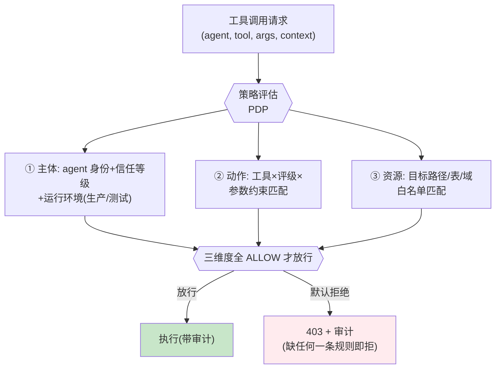

# 项目 08：Agent 供应链安全网关 — 06-迭代五：零信任策略引擎

> **定位**：零信任策略引擎——三维权限（主体×工具×资源）+ 默认拒绝 + 参数级约束的最小权限模型。事件响应体系见 [07-迭代六-事件响应与取证](07-迭代六-事件响应与取证.md)。**完整可手写代码**：策略模型、YAML 加载、PDP 评估、SQL 语法级网关、路径白名单匹配。
>
> 「遇到阻塞？→ [教程 31-安全与权限控制 §零信任]、[教程 28-Human-in-the-Loop与审批流]、[教程 23-工具执行可观测与审计 §审计]」

---

## 1. 四问

| 问 | 答 |
|----|----|
| **新增了什么需求** | ① 三维策略：主体 × 工具 × 资源，精确到参数约束 ② 默认拒绝（deny-by-default，ADR-303） ③ 参数约束在网关 PEP 强制（不是靠工具自觉） ④ SQL 语法级解析拦截 |
| **影响了哪些模块** | 工具执行管线（v3 `GatewayProxyTool.call` 前插入 PDP 评估）、新增策略引擎与策略存储、审计（DENIED/CONFIRM_REQUIRED 新 outcome） |
| **架构如何演进** | 从"工具级粗粒度 allow/deny"→「**三维零信任 PDP**」：任一维度不匹配即拒绝；参数越界可 HITL 升级（confirm） |
| **上一版痛点是什么** | ① fs.read 给了整个文件系统 ② 没写拒绝就能用（默认允许） ③ 参数约束靠工具自觉（被入侵的工具会撒谎） |

## 2. 零信任策略模型



### 2.1 策略示例（声明式，deny-by-default）

```yaml
# 运维 Agent 的策略——注意粒度
policies:
- subject: agent:ops-agent@production
  action: tool:fs.read          # 只允许读
  resource:
    path-globs: ["/var/log/**/*.log", "/app/logs/**"]   # 只允许日志目录
  constraints:
    max-file-size: 10MB
- subject: agent:ops-agent@production
  action: tool:sql.query
  resource:
    catalogs: [metrics_ro]      # 只读报表库
  constraints:
    read-only: true
    max-rows: 10000
- subject: agent:ops-agent@*
  action: tool:fs.write         # 运维 Agent 完全禁止写
  resource: { deny-all: true }
# 没有任何 policy 匹配的 (agent, tool) 组合 = 拒绝——无需显式写 deny
```

## 3. 完整代码（照抄即可）

### 3.1 `policy/Policy.java`（策略模型）

```java
package com.group.secgw.policy;

import java.util.List;
import java.util.Map;

/**
 * 三维策略声明（v6）：subject × action × resource + constraints。
 * 与 application.yml 的 policies 结构一一对应（用 Jackson 直接反序列化）。
 */
public record Policy(
        String subject,          // "agent:ops-agent@production" | "agent:ops-agent@*"
        String action,           // "tool:fs.read" | "tool:sql.query" | "tool:*"
        ResourceRule resource,   // 资源白名单
        Map<String, Object> constraints  // 参数约束（read-only/max-rows/max-file-size...）
) {

    /** 资源规则。 */
    public record ResourceRule(
            List<String> pathGlobs,     // 文件路径 glob
            List<String> catalogs,      // 数据库 catalog/库名
            boolean denyAll             // 完全禁止
    ) {

        public static ResourceRule denyAll() {
            return new ResourceRule(List.of(), List.of(), true);
        }
    }

    /** 主体通配匹配：agent:ops-agent@* 匹配任意环境的 ops-agent。 */
    public boolean matchesSubject(String agentId, String env) {
        String target = "agent:" + agentId + "@" + env;
        if (subject.equals(target)) {
            return true;
        }
        // 支持 "agent:<id>@*" 通配环境
        String star = subject.substring(0, subject.lastIndexOf('@') + 1) + "*";
        return star.equals(target.substring(0, target.lastIndexOf('@') + 1) + "*")
                && subject.contains(agentId);
    }

    /** 动作匹配：tool:fs.read 精确匹配，tool:* 通配全部。 */
    public boolean matchesAction(String toolId) {
        return action.equals("tool:*") || action.equals("tool:" + toolId);
    }
}
```

### 3.2 `policy/PolicyRepository.java`（YAML 策略加载 + 版本化）

```java
package com.group.secgw.policy;

import com.fasterxml.jackson.databind.ObjectMapper;
import com.fasterxml.jackson.dataformat.yaml.YAMLFactory;
import org.springframework.stereotype.Repository;

import java.io.InputStream;
import java.util.ArrayList;
import java.util.List;
import java.util.Map;

/**
 * 策略存储（v6）——从 application.yml 的 gateway.policies 加载。
 * ADR-317：策略版本化热更新（配置中心下发新版本）弥补 PDP 内嵌的灵活性不足。
 */
@Repository
public class PolicyRepository {

    private volatile List<Policy> policies = List.of();

    public PolicyRepository() {
        reloadFromClasspath("policies.yml");
    }

    /** 从 classpath YAML 加载（格式见 §2.1）。 */
    public void reloadFromClasspath(String path) {
        ObjectMapper mapper = new ObjectMapper(new YAMLFactory());
        try (InputStream in = getClass().getClassLoader().getResourceAsStream(path)) {
            if (in == null) {
                return;
            }
            PolicyBundle bundle = mapper.readValue(in, PolicyBundle.class);
            this.policies = bundle.policies();
        } catch (Exception e) {
            throw new IllegalStateException("加载策略失败: " + path, e);
        }
    }

    /** 热更新：由配置中心/管理接口调用。 */
    public void replaceAll(List<Policy> newPolicies) {
        this.policies = List.copyOf(newPolicies);
    }

    public List<Policy> all() {
        return policies;
    }

    /** 匹配 (subject, action) 的策略列表。 */
    public List<Policy> match(String agentId, String env, String toolId) {
        return policies.stream()
                .filter(p -> p.matchesSubject(agentId, env) && p.matchesAction(toolId))
                .toList();
    }

    /** YAML 根结构。 */
    public record PolicyBundle(List<Policy> policies) {}
}
```

> ⚠ 需在 pom.xml 中添加依赖：`com.fasterxml.jackson.dataformat:jackson-dataformat-yaml`（随 Spring Boot 传递引入，若缺失则补 `<dependency>`）。

### 3.3 `policy/Decision.java`（评估结果）

```java
package com.group.secgw.policy;

/** PDP 评估结果（v6）：ALLOW / DENY / CONFIRM（参数越界但可人工确认 → HITL 升级）。 */
public sealed interface Decision permits Decision.Allow, Decision.Deny, Decision.Confirm {

    record Allow() implements Decision {}
    record Deny(String reason) implements Decision {}
    record Confirm(String reason) implements Decision {}

    static Decision allow() {
        return new Allow();
    }

    static Decision deny(String reason) {
        return new Deny(reason);
    }

    static Decision confirm(String reason) {
        return new Confirm(reason);
    }
}
```

### 3.4 `policy/PathMatcher.java`（资源路径白名单）

```java
package com.group.secgw.policy;

import java.util.List;
import java.util.regex.Pattern;

/** 路径 glob 匹配（v6）——把 "/var/log/**/*.log" 编译为正则。 */
public final class PathMatcher {

    private PathMatcher() {}

    public static boolean matchesAny(List<String> globs, String path) {
        if (globs == null || path == null) {
            return false;
        }
        return globs.stream().anyMatch(g -> globToRegex(g).matcher(path).matches());
    }

    /** glob → 正则：** 跨目录，* 单段，? 单字符。 */
    static Pattern globToRegex(String glob) {
        StringBuilder sb = new StringBuilder("^");
        for (int i = 0; i < glob.length(); i++) {
            char c = glob.charAt(i);
            switch (c) {
                case '*' -> {
                    if (i + 1 < glob.length() && glob.charAt(i + 1) == '*') {
                        sb.append(".*");   // ** 跨目录
                        i++;
                    } else {
                        sb.append("[^/]*"); // 单段
                    }
                }
                case '?' -> sb.append("[^/]");
                default -> sb.append(Pattern.quote(String.valueOf(c)));
            }
        }
        return Pattern.compile(sb.append('$').toString());
    }
}
```

### 3.5 `policy/SqlSyntaxGate.java`（参数约束网关强制，ADR-318）

```java
package com.group.secgw.policy;

import java.util.regex.Pattern;

/**
 * SQL 语法级网关（v6）——约束执行在网关（PEP）强制，不是靠工具自觉。
 * read-only 约束：只认 SELECT/EXPLAIN，非 SELECT 即拒（语法级解析比正则黑名单可靠）。
 * 生产用 SQL 解析器（JSqlParser 等）做 AST 级判定；此处给可运行的白名单内核。
 */
public class SqlSyntaxGate {

    private static final Pattern READ_ONLY_SQL =
            Pattern.compile("(?is)^\\s*(select|explain|with|show|desc)\\b.*");

    /** read-only 约束检查。 */
    public boolean isReadOnly(String sql) {
        return sql != null && READ_ONLY_SQL.matcher(sql).matches();
    }

    /** 最大返回行数约束——在 SQL 外追加 LIMIT（防一次拉全表）。 */
    public String enforceMaxRows(String sql, int maxRows) {
        if (sql == null || sql.isBlank()) {
            return sql;
        }
        String trimmed = sql.trim();
        if (trimmed.toLowerCase().contains(" limit ")) {
            return sql;   // 已有 limit，交由工具端兜底
        }
        return trimmed.endsWith(";") ? trimmed.substring(0, trimmed.length() - 1) : trimmed
                + " LIMIT " + maxRows;
    }
}
```

### 3.6 `policy/ZeroTrustPdp.java`（策略决策点，内嵌毫秒级，ADR-317）

```java
package com.group.secgw.policy;

import com.group.secgw.api.ToolCallContext;
import org.springframework.stereotype.Component;

import java.util.List;
import java.util.Map;

/**
 * 零信任 PDP（v6）——内嵌网关、毫秒级评估（ADR-317）。
 * deny-by-default：没有任何 policy 匹配的 (agent, tool) 组合 = 拒绝。
 */
@Component
public class ZeroTrustPdp {

    private final PolicyRepository policyRepository;
    private final PathMatcher pathMatcher = new PathMatcher();
    private final SqlSyntaxGate sqlGate = new SqlSyntaxGate();

    public ZeroTrustPdp(PolicyRepository policyRepository) {
        this.policyRepository = policyRepository;
    }

    public Decision evaluate(ToolCallContext ctx) {
        String agentId = ctx.agent().agentId();
        String env = ctx.agent().trustLevel().name().toLowerCase();

        List<Policy> matched = policyRepository.match(agentId, env, ctx.toolId());
        if (matched.isEmpty()) {
            return Decision.deny("no policy grants (" + agentId + ", " + ctx.toolId() + ")");
        }

        for (Policy p : matched) {
            PolicyResult r = evaluatePolicy(p, ctx);
            if (r.denied()) {
                return Decision.deny(r.reason());
            }
            if (r.needsConfirmation()) {
                return Decision.confirm(r.reason());   // 参数越界但可人工确认 → HITL 升级
            }
        }
        return Decision.allow();
    }

    private PolicyResult evaluatePolicy(Policy p, ToolCallContext ctx) {
        Policy.ResourceRule res = p.resource();

        // 资源维度：deny-all 或白名单不匹配 → 拒绝
        if (res.denyAll()) {
            return PolicyResult.denied("resource denied by policy");
        }

        Map<String, Object> args = ctx.args();
        String path = stringArg(args, "path");
        if (path != null) {
            if (!PathMatcher.matchesAny(res.pathGlobs(), path)) {
                return PolicyResult.denied("path not in whitelist: " + path);
            }
        }
        String catalog = stringArg(args, "catalog");
        if (catalog != null && res.catalogs() != null && !res.catalogs().isEmpty()
                && !res.catalogs().contains(catalog)) {
            return PolicyResult.denied("catalog not in whitelist: " + catalog);
        }

        // 参数约束
        Object readOnly = p.constraints().get("read-only");
        String sql = stringArg(args, "sql");
        if (Boolean.TRUE.equals(readOnly) && sql != null && !sqlGate.isReadOnly(sql)) {
            return PolicyResult.denied("read-only violated: non-SELECT sql");
        }
        Object maxRows = p.constraints().get("max-rows");
        if (maxRows instanceof Number n && sql != null) {
            // 提示：网关已追加 LIMIT（PEP 强制）；这里可标记 confirm 让审计可见
            return PolicyResult.confirm("sql auto-limited to " + n.intValue());
        }
        return PolicyResult.allowed();
    }

    private String stringArg(Map<String, Object> args, String key) {
        Object v = args.get(key);
        return v instanceof String s ? s : null;
    }

    /** 单条策略评估结果。 */
    private record PolicyResult(boolean denied, boolean needsConfirmation, String reason) {
        static PolicyResult allowed() {
            return new PolicyResult(false, false, null);
        }
        static PolicyResult denied(String reason) {
            return new PolicyResult(true, false, reason);
        }
        static PolicyResult confirm(String reason) {
            return new PolicyResult(false, true, reason);
        }
    }
}
```

**约束执行的信任边界**：参数约束必须在网关（PEP）强制执行——工具端的"我保证只读"不可信（被入侵的工具可以说谎）。SQL 的语法级解析（只认 SELECT）比正则黑名单可靠（[教程 25 §注入防御的层级]）。

## 4. 量化验收

| # | 目标 | 验收 |
|---|------|------|
| 1 | 默认拒绝 | 无策略匹配的 (agent,tool) 组合 100% 被拒（模糊测试） |
| 2 | 参数级粒度 | v5 痛点复现：ops-agent 读非日志路径被拒；写完全禁止；SQL 写语句被语法级拦截 |
| 3 | 最小权限 | 每个 Agent 的工具×资源组合按声明策略生效（差异矩阵验证） |
| 4 | 决策延迟 | PDP 评估 P99 < 5ms（内嵌无 RPC） |
| 5 | HITL 升级 | 参数越界但可确认的调用进入人工确认队列（CONFIRM_REQUIRED 审计） |

## 5. ADR 演进决策

| # | 决策 | 理由 |
|---|------|------|
| ADR-317 | 策略评估（PDP）在网关内嵌、毫秒级 | 外置 PDP 的 RPC 延迟会逼业务绕过网关；策略版本化热更新弥补灵活性 |
| ADR-318 | 参数约束网关强制（语法级解析先行） | 被入侵的工具不可信；正则黑名单可绕过 |
| ADR-319 | 高危自动遏制 + 低危人工队列 | 全自动遏制误伤业务；全人工错过遏制窗口——按严重度分流 |

## 6. 总结

v6 完成「三维零信任 + 默认拒绝 + 参数级约束 + SQL 语法级网关」。遗留痛点（供 v7 决策）：

安全能力全家桶就位（准入/行为/注入/策略），但**检测命中后没有处置机制**——隔离/取证/复盘全靠人。安全事件需要一条自动化流水线：检测 → 分诊 → 遏制 → 取证回放 → 复盘反哺。

→ [07-迭代六-事件响应与取证.md](07-迭代六-事件响应与取证.md)
