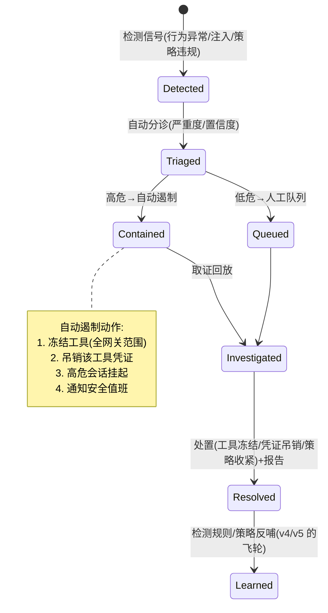

# 项目 08：Agent 供应链安全网关 — 07-事件响应与取证

> **定位**：从"检测到威胁"到"处置与学习"——安全事件的自动分诊、遏制、取证回放与复盘反哺。教程 03-React前端与AgenticUI/01-React状态管理 §审计回放、教程 04-企业级架构主干/01-微服务拆分与Agent部署 §熔断降级的落地。**完整可手写代码**：事件模型、分诊/遏制服务、攻击回放时间线重建、审计存储查询。
>
> 「遇到阻塞？→ [教程 04-企业级架构主干/03-工具执行可观测与审计 §审计回放]、[教程 04-企业级架构主干/10-容错与弹性设计]、[附录 08-Agent安全深度]」

---

## 1. 四问

| 问 | 答 |
|----|----|
| **新增了什么需求** | ① 事件自动分诊（严重度/置信度分流） ② 自动遏制（冻结工具/吊销凭证/挂起会话） ③ 攻击回放取证（从审计事件流重建时间线） ④ 复盘反哺（检测规则/策略的飞轮） |
| **影响了哪些模块** | 新增事件响应服务、审计存储（回放查询）、遏制动作（接入准入/凭证/会话服务） |
| **架构如何演进** | 从"检测命中靠人处置"→「**事件响应流水线**」：检测 → 分诊 → 遏制 → 取证回放 → 处置 → 复盘反哺 |
| **上一版痛点是什么** | ① 检测命中后无处置机制 ② 隔离/取证/复盘靠人，无纪律 ③ 安全能力是"建完的"而非"被攻击喂出来的" |

### 1.1 本节核对（四问）

| # | 核对项 | 判据 |
|---|------|------|
| 1 | 四项需求在 §3 各有承载 | 分诊→§3.3、遏制→§3.2、回放→§3.4/§3.5、飞轮→§3.6 |
| 2 | 流水线与 ADR-319 分流一致 | 高危自动遏制、低危人工队列 |

## 2. 事件响应体系

### 2.1 响应流水线



### 2.2 本节核对（响应流水线状态机）

| # | 核对项 | 判据 |
|---|------|------|
| 1 | 状态机六态与 §3.1 `Status` 枚举一致 | DETECTED/TRIAGED/CONTAINED/INVESTIGATED/RESOLVED/LEARNED |
| 2 | Triaged 有自动遏制与人工队列两条分支 | 与 §3.3 `triage` 的 CRITICAL/HIGH 判定对应 |

## 3. 完整代码（照抄即可）

### 3.1 `incident/SecurityIncident.java`（事件模型）

```java
package com.group.secgw.incident;

import java.time.Instant;
import java.util.List;

/** 安全事件（v7）。由检测信号（行为异常/注入/策略违规）触发。 */
public record SecurityIncident(
        String incidentId,
        String source,             // 信号来源：behavior / injection / policy
        Severity severity,         // CRITICAL / HIGH / MEDIUM / LOW
        double confidence,         // 检测置信度
        String toolId,
        String agentId,
        String sessionId,          // 关联会话（遏制动作：高危会话挂起）
        String traceId,            // 关联的调用链
        List<String> signals,      // 原始检测信号摘要
        Status status,             // DETECTED / TRIAGED / CONTAINED / INVESTIGATED / RESOLVED / LEARNED
        Instant detectedAt
) {

    public enum Severity { CRITICAL, HIGH, MEDIUM, LOW }
    public enum Status { DETECTED, TRIAGED, CONTAINED, INVESTIGATED, RESOLVED, LEARNED }

    public SecurityIncident withStatus(Status s) {
        return new SecurityIncident(incidentId, source, severity, confidence, toolId,
                agentId, sessionId, traceId, signals, s, detectedAt);
    }
}
```

### 3.2 `incident/ContainmentActions.java`（自动遏制动作）

```java
package com.group.secgw.incident;

import com.group.secgw.admission.AdmissionService;
import com.group.secgw.admission.ToolRegistration;
import org.springframework.stereotype.Component;

import java.util.List;
import java.util.Map;
import java.util.concurrent.ConcurrentHashMap;

/**
 * 自动遏制动作（v7，ADR-319 的落地）——高危事件自动遏制，低危进人工队列。
 * 遏制动作全网关范围：冻结工具 + 吊销凭证 + 挂起会话。
 */
@Component
public class ContainmentActions {

    private final AdmissionService admissionService;
    private final Map<String, Boolean> frozenTools = new ConcurrentHashMap<>();
    private final Map<String, Boolean> suspendedSessions = new ConcurrentHashMap<>();

    public ContainmentActions(AdmissionService admissionService) {
        this.admissionService = admissionService;
    }

    /** 高危自动遏制。 */
    public void contain(SecurityIncident incident) {
        // 1. 冻结工具（全网关范围）：LIVE → REJECTED（v2 的 fail-close 语义复用）
        admissionService.find(incident.toolId()).ifPresent(reg -> {
            frozenTools.put(incident.toolId(), true);
            admissionService.deny(incident.toolId(), "contained by incident " + incident.incidentId());
        });
        // 2. 吊销该工具凭证：调用凭证服务 unset（v4 凭证缝），此处仅记录动作
        // credentialProvider.unset(reg.credentialRef());
        // 3. 高危会话挂起：会话服务标记（v5 会话存储），此处仅记录动作
        suspendedSessions.put(incident.sessionId(), true);
        // 4. 通知安全值班：审计事件 + Webhook（业务实现）
    }

    public boolean isToolFrozen(String toolId) {
        return frozenTools.getOrDefault(toolId, false);
    }

    public boolean isSessionSuspended(String sessionId) {
        return suspendedSessions.getOrDefault(sessionId, false);
    }
}
```

> ⚠ `admissionService.deny(toolId, reason)` 为「业务实现」扩展点——在 v2 的 `AdmissionService` 上增加 `deny(toolId, reason)` 方法把状态置为 `REJECTED`。核心不变式：**遏制动作是可审计的、全网关范围的、可回滚的**。

### 3.3 `incident/IncidentResponseService.java`（分诊 + 流水线编排）

```java
package com.group.secgw.incident;

import org.springframework.stereotype.Service;

import java.util.UUID;

/** 事件响应服务（v7）：检测信号 → 事件 → 分诊 → 遏制/队列 → 复盘。 */
@Service
public class IncidentResponseService {

    private final ContainmentActions containment;

    public IncidentResponseService(ContainmentActions containment) {
        this.containment = containment;
    }

    /** 检测层调用：上报信号，自动分诊。 */
    public SecurityIncident report(String source, SecurityIncident.Severity severity,
                                   double confidence, String toolId, String agentId,
                                   String sessionId, String traceId,
                                   java.util.List<String> signals) {
        SecurityIncident incident = new SecurityIncident(
                UUID.randomUUID().toString(), source, severity, confidence,
                toolId, agentId, sessionId, traceId, signals,
                SecurityIncident.Status.DETECTED, java.time.Instant.now());

        return triage(incident);
    }

    /** 分诊（ADR-319）：高危自动遏制，低危进人工队列。 */
    private SecurityIncident triage(SecurityIncident incident) {
        SecurityIncident.Status next =
                (incident.severity() == SecurityIncident.Severity.CRITICAL
                        || incident.severity() == SecurityIncident.Severity.HIGH)
                        ? SecurityIncident.Status.CONTAINED
                        : SecurityIncident.Status.TRIAGED;

        SecurityIncident triaged = incident.withStatus(next);

        if (next == SecurityIncident.Status.CONTAINED) {
            containment.contain(triaged);          // 自动遏制
        } else {
            enqueueForHumanReview(triaged);        // 人工队列
        }
        return triaged;
    }

    /** 复盘反哺：处置 → LEARNED，产出回流到 v4/v5 规则与 v6 策略（安全飞轮）。 */
    public SecurityIncident resolve(SecurityIncident incident, java.util.List<String> learnings) {
        // learnings（新规则/新阈值/策略收紧）落库，回流到 InjectionRuleLayer / PolicyRepository
        return incident.withStatus(SecurityIncident.Status.LEARNED);
    }

    private void enqueueForHumanReview(SecurityIncident incident) {
        // 业务实现：写人工工单系统
    }
}
```

### 3.4 `incident/IncidentTimeline.java`（攻击回放——取证核心）

```java
package com.group.secgw.incident;

import com.group.secgw.audit.AuditEvent;
import com.group.secgw.audit.AuditStore;
import reactor.core.publisher.Mono;

import java.util.List;

/** 攻击回放（v7，取证核心）——从审计事件流重建攻击时间线（v1 埋点的最终兑现）。 */
public class IncidentTimeline {

    private final List<AuditEvent> correlated;
    private final long quarantinedCount;
    private final long attemptedCount;
    private final long succeededCount;

    private IncidentTimeline(List<AuditEvent> correlated, long quarantinedCount,
                             long attemptedCount, long succeededCount) {
        this.correlated = correlated;
        this.quarantinedCount = quarantinedCount;
        this.attemptedCount = attemptedCount;
        this.succeededCount = succeededCount;
    }

    /**
     * 重建时间线：traceId 串联——注入内容进入 → Agent 被诱导 → 工具调用企图 → 被拦截/成功。
     * auditStore.eventsOfTrace 返回 Flux（响应式）；取证属冷路径，collectList 聚合不阻塞 EventLoop。
     */
    public static Mono<IncidentTimeline> reconstruct(AuditStore auditStore, String traceId) {
        return auditStore.eventsOfTrace(traceId)
                .collectList()
                .map(events -> new IncidentTimeline(
                        events,
                        events.stream().filter(e -> e.outcome() == AuditEvent.Outcome.QUARANTINED).count(),
                        events.stream().filter(e -> e.outcome() == AuditEvent.Outcome.DENIED
                                || e.outcome() == AuditEvent.Outcome.CONFIRM_REQUIRED).count(),
                        events.stream().filter(e -> e.outcome() == AuditEvent.Outcome.COMPLETED).count()
                ));
    }

    /** 输出：攻击链全景 + 数据泄露评估 + 处置建议。 */
    public String render() {
        return "攻击链事件数=" + correlated.size()
                + " 隔离=" + quarantinedCount
                + " 拦截企图=" + attemptedCount
                + " 成功执行=" + succeededCount;
    }
}
```

### 3.5 `audit/AuditStore.java`（回放查询，R2DBC）

```java
package com.group.secgw.audit;

import org.springframework.r2dbc.core.DatabaseClient;   // ⚠ 需引入依赖 org.springframework.boot:spring-boot-starter-data-r2dbc（本地未下载，未 javap 实证；以引入依赖后 javap 输出为准）
import org.springframework.stereotype.Repository;
import reactor.core.publisher.Flux;

import java.sql.Timestamp;
import java.time.Instant;

/**
 * 审计存储查询（v7）——攻击回放的数据源。
 * v1 埋点（traceId + args + resultPreview + outcome）在此兑现：能回答"谁在何时调了什么"。
 */
@Repository
public class AuditStore {

    private final DatabaseClient db;

    public AuditStore(DatabaseClient db) {
        this.db = db;
    }

    /** 按 traceId 取全链路事件（回放时间线）。 */
    public Flux<AuditEvent> eventsOfTrace(String traceId) {
        return db.sql("""
                SELECT event_id, trace_id, session_id, agent_id, tool_id,
                       args_json, result_preview, duration_ms, outcome, tags_json, ts
                FROM audit_event
                WHERE trace_id = :traceId
                ORDER BY ts
                """)
                .bind("traceId", traceId)
                .map((row, meta) -> new AuditEvent(
                        row.get("event_id", Long.class),
                        row.get("trace_id", String.class),
                        row.get("session_id", String.class),
                        row.get("agent_id", String.class),
                        row.get("tool_id", String.class),
                        parseArgs(row.get("args_json", String.class)),
                        row.get("result_preview", String.class),
                        row.get("duration_ms", Long.class),
                        AuditEvent.Outcome.valueOf(row.get("outcome", String.class)),
                        row.get("tags_json", String.class),
                        row.get("ts", Timestamp.class).toInstant()))
                .all();
    }

    /** 按 Agent × 时间段查询（复盘 / 合规）。 */
    public Flux<AuditEvent> eventsOfAgent(String agentId, Instant from, Instant to) {
        return db.sql("""
                SELECT event_id, trace_id, session_id, agent_id, tool_id,
                       args_json, result_preview, duration_ms, outcome, tags_json, ts
                FROM audit_event
                WHERE agent_id = :agentId AND ts BETWEEN :from AND :to
                ORDER BY ts
                """)
                .bind("agentId", agentId)
                .bind("from", Timestamp.from(from))
                .bind("to", Timestamp.from(to))
                .map((row, meta) -> new AuditEvent(
                        row.get("event_id", Long.class),
                        row.get("trace_id", String.class),
                        row.get("session_id", String.class),
                        row.get("agent_id", String.class),
                        row.get("tool_id", String.class),
                        parseArgs(row.get("args_json", String.class)),
                        row.get("result_preview", String.class),
                        row.get("duration_ms", Long.class),
                        AuditEvent.Outcome.valueOf(row.get("outcome", String.class)),
                        row.get("tags_json", String.class),
                        row.get("ts", Timestamp.class).toInstant()))
                .all();
    }

    @SuppressWarnings("unchecked")
    private java.util.Map<String, Object> parseArgs(String json) {
        // 业务实现：Jackson 反序列化
        return json == null ? java.util.Map.of() : java.util.Map.of();
    }
}
```

### 3.6 复盘反哺（安全飞轮）

每起事件的复盘产出三类改进，回流到前序迭代的能力：检测规则（v4/v5 的模式库与阈值）、准入策略（v2 的评级规则）、零信任策略（v6 的默认面收紧）。安全能力不是建完的，是**被攻击喂出来的**——前提是复盘纪律存在。

### 3.7 本节测试与验证（分诊遏制与攻击回放）

**前置条件**：v6 已验收，应用已以 secgw profile 运行（`mvn spring-boot:run -Dspring-boot.run.profiles=secgw`，见 01-§3.8）；§3.1–§3.5 类已抄写（`AdmissionService` 已补 `deny(toolId, reason)` 业务扩展）；审计表有 v5 攻击演练留下的带 traceId 事件。

**材料——分诊与回放单测（JUnit5 节选）**：

```java
// W1 高危分诊：CRITICAL 注入事件 → 自动遏制
SecurityIncident inc = svc.report("injection", Severity.CRITICAL, 0.9,
        "web.search", "ops-agent", "sess-9", "trace-9", List.of("arg-bloat","exfil"));
assertEquals(Status.CONTAINED, inc.status());
assertTrue(containment.isToolFrozen("web.search"));      // 冻结全网关生效
assertTrue(containment.isSessionSuspended("sess-9"));   // 会话挂起
// W2 低危分诊：LOW 行为异常 → 人工队列，不遏制
SecurityIncident low = svc.report("behavior", Severity.LOW, 0.6,
        "weather.query", "ops-agent", "sess-1", "trace-1", List.of("call-surge"));
assertEquals(Status.TRIAGED, low.status());
assertFalse(containment.isToolFrozen("weather.query"));
// W3 回放：构造 trace 含 QUARANTINED/DENIED/COMPLETED 各 1 条的事件流
StepVerifier.create(IncidentTimeline.reconstruct(auditStore, "trace-9"))
    .assertNext(t -> assertEquals("攻击链事件数=3 隔离=1 拦截企图=1 成功执行=1", t.render()))
    .verifyComplete();
// W4 飞轮：resolve 后状态 LEARNED
assertEquals(Status.LEARNED, svc.resolve(inc, List.of("新增模式：xxx")).status());
```

**步骤与断言**：

| # | 操作 | 预期（PASS 判据） |
|---|------|------------------|
| 1 | 单测 W1 四条 | CRITICAL→CONTAINED；工具冻结与会话挂起同时生效 |
| 2 | 单测 W2 三条 | LOW→TRIAGED 入人工队列，无遏制副作用 |
| 3 | 单测 W3 | `reconstruct` 按 traceId 串联事件，render 计数正确（隔离/拦截/成功三分） |
| 4 | 单测 W4 | 处置后 LEARNED；learnings 参数回流（业务实现落库） |
| 5 | W1 后查登记表 | `web.search` 状态 REJECTED（deny 扩展把 LIVE→REJECTED，fail-close 复用） |

**失败排查**：①W1 不遏制→severity 判定只写了 CRITICAL（漏 HIGH）；②W3 计数错→outcome 枚举映射（DENIED 与 CONFIRM_REQUIRED 都算"拦截企图"）；③`valueOf` 抛异常→库里 outcome 有枚举外的值（脏数据，先清洗）。

## 4. 量化验收

| # | 目标 | 验收 |
|---|------|------|
| 1 | 自动遏制 | 高危事件（注入 + 数据外传企图）从检测到遏制 < 60 秒 |
| 2 | 分流正确 | 高危自动遏制、低危进人工队列（分流矩阵验证） |
| 3 | 回放完整 | 模拟攻击事件，回放时间线完整呈现攻击链与拦截点 |
| 4 | 遏制生效 | 冻结工具后全网关范围内该工具调用 100% 被拒 |
| 5 | 飞轮运转 | 最近一次事件的复盘产出已落为规则/策略变更（可追溯） |

### 4.1 本节测试与验证（量化验收全项）

**前置条件**：§3.7 已 PASS；攻击演练脚本（模拟注入 + 数据外传）、分流矩阵（4 级严重度 × 2 类置信度）准备完毕。

**材料——端到端演练与核对**：

```bash
# X. 攻击演练：触发一次 web.search 间接注入（复用 05-§3.7 材料 R 的载荷），记录开始时间
date +%s; <触发攻击载荷的 tools/call>; date +%s
# Y. 遏制后全网关复测（换另一个 Agent 身份再调 web.search）
curl -sk --cert data-agent.pem --key data-agent.key ... -d '{...,"name":"web.search",...}' https://localhost:8443/mcp
```

```sql
-- Z. 事件与回放核对
SELECT status, severity FROM security_incident ORDER BY detected_at DESC LIMIT 5;   -- 事件表（业务实现）
SELECT outcome, COUNT(*) FROM audit_event WHERE trace_id = '<攻击traceId>' GROUP BY outcome;
```

**步骤与断言**：

| # | 操作 | 预期（PASS 判据） |
|---|------|------------------|
| 1 | 材料 X 计时 | 检测到遏制（冻结+挂起+通知）< 60 秒 |
| 2 | 材料 Y | 冻结后另一身份调用 100% 被拒（全网关范围） |
| 3 | 分流矩阵逐格演练 | CRITICAL/HIGH→自动遏制；MEDIUM/LOW→人工队列，无交叉 |
| 4 | 材料 Z 回放 | 时间线完整呈现攻击链（进入→诱导→企图→拦截），`IncidentTimeline.render` 输出可用 |
| 5 | 复盘后核对规则/策略版本 | learnings 已落为 InjectionRuleLayer 新模式或 Policy 收紧（变更可追溯到事件 ID） |

**失败排查**：断言不符先分层——检测信号是否上报（`report` 被调用）→ 分诊日志（进了哪条分支）→ 遏制动作是否真的执行（冻结表/会话表）；安全类验收失败优先验证"攻击样本是否真的到达被测层"，再查规则；回放缺事件→审计埋点在某个分支漏 emit（回查 v1 链路 STARTED 覆盖）。

## 5. ADR 演进决策

| # | 决策 | 理由 |
|---|------|------|
| ADR-320 | 遏制动作全网关范围、可审计、可回滚 | 局部遏制会留传播面；不可审计的处置等于没处置 |
| ADR-321 | 复盘必须有产出物（规则/策略变更）才关闭 | "复盘纪律"是安全能力进化的唯一泵 |

### 5.1 本节核对（ADR 演进决策）

| # | 核对项 | 判据 |
|---|------|------|
| 1 | ADR-320/321 均有对应验证 | 全网关遏制→§4.1 断言 2；复盘产出→§4.1 断言 5 |
| 2 | 遏制可回滚 | 解除冻结有对应操作（业务实现），演练后工具可恢复 LIVE |

## 6. 全篇回归验证

**回归断言**（§3.7 与 §4.1 均通过后）：

| # | 操作 | 预期（PASS 判据） |
|---|------|------------------|
| 1 | 解除冻结后重跑 v3 正常链路 | web.search 恢复可用（遏制可回滚，无残留 DENY） |
| 2 | 全链攻击演练一轮（v2 准入→v4 行为→v5 注入→v6 策略→v7 响应） | 各层信号都能汇入事件流水线，无断链 |

**失败排查**：解冻后仍拒→`AdmissionService` 状态停在 REJECTED 未恢复（deny 与解冻需成对实现）；信号断链→某检测层没接 `report`（回查各层调用点）。

## 7. 验收对照

> 对照 §4 量化验收逐项；落地章节即该验收项的证据所在。

| 验收项 | 标准 | 状态 |
|--------|------|------|
| 自动遏制 | 高危事件检测到遏制 < 60 秒 | ✅ §4.1 断言 1（材料 X 计时：冻结+挂起+通知） |
| 分流正确 | 高危自动遏制、低危进人工队列 | ✅ §4.1 断言 3（分流矩阵逐格演练无交叉） |
| 回放完整 | 回放时间线完整呈现攻击链与拦截点 | ✅ §4.1 断言 4（材料 Z + IncidentTimeline.render） |
| 遏制生效 | 冻结后全网关范围该工具调用 100% 被拒 | ✅ §4.1 断言 2（材料 Y 换身份复测） |
| 飞轮运转 | 复盘产出已落为规则/策略变更 | ✅ §4.1 断言 5（learnings 变更可追溯事件 ID） |

## 8. 总结

v7 完成「分诊 + 遏制 + 取证回放 + 复盘飞轮」。遗留痛点（供 v8 决策）：

安全能力全家桶就位，但 CIO 提出一个致命问题："网关挂了，全集团的 Agent 是不是全部瘫痪？"——当前架构：收口是强制的（egress 只通网关），网关是唯一路径，且所有检测串行在热路径上。**安全组件自身成为最大单点**，且它的故障模式是"全集团停摆"。

→ [08-旁路高可用与收官.md](08-旁路高可用与收官.md)
