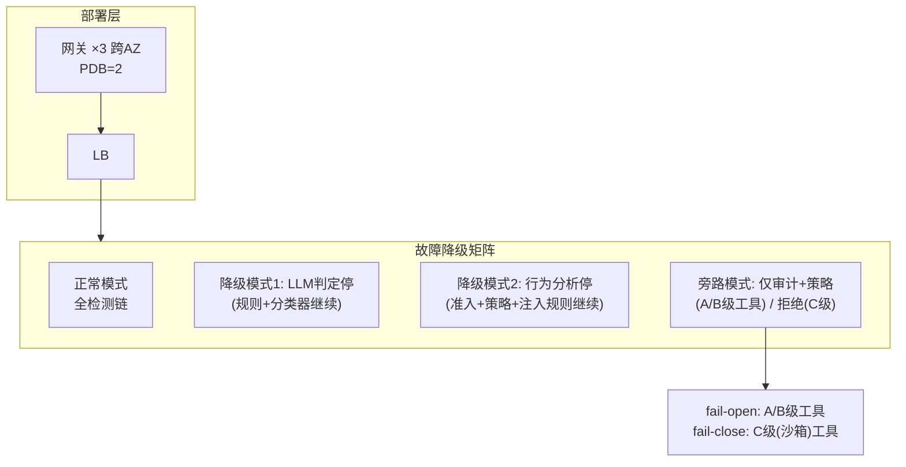
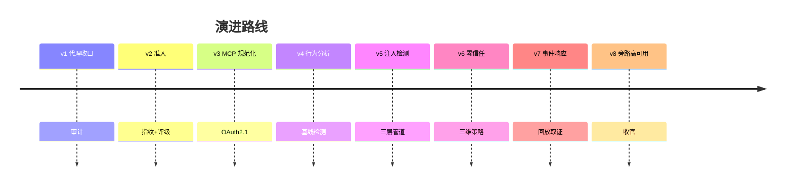

# 项目 08：Agent 供应链安全网关 — 08-迭代七：旁路高可用与项目收官

> **定位**：收官迭代——解决"安全组件自身是最大单点"的悖论：分级 fail-open/fail-close、旁路降级模式、网关自身的可观测与演练。安全的存在感应该体现在"拦住攻击"，而不是"经常挡路"。**完整可手写代码**：检测模式、独立熔断器、分级降级策略、降级感知的检测管道。
>
> 「遇到阻塞？→ [教程 30-容错与弹性设计 §熔断降级]、[教程 31-安全与权限控制 §可用性]、[附录 09-Agent安全深度]」

---

## 1. 四问

| 问 | 答 |
|----|----|
| **新增了什么需求** | ① 多实例 + 分级降级策略（ADR-304 的完整落地） ② 每个检测组件独立熔断器 ③ 降级可见（指标/告警/审计事件） ④ 网关自身安全（凭证加密/渗透测试/审计双写） |
| **影响了哪些模块** | 全部检测组件（行为分析/注入/策略/审计）、网关部署架构、审计流（降级标记） |
| **架构如何演进** | 从"单点全链串行"→「**多实例 + 分级 fail 矩阵**」：检测层按工具评级降级，策略/审计层一律 fail-close |
| **上一版痛点是什么** | ① 网关挂 = 全集团 Agent 停摆 ② 检测全串行在热路径，一个组件故障拖垮全链 |

## 2. 可用性设计



### 2.1 分级 fail 策略（ADR-304 的完整落地）

| 组件故障 | A 级（受信）工具 | C 级（沙箱/社区）工具 |
|---------|----------------|---------------------|
| 注入检测 LLM 不可用 | 降级到 L1+L2 继续（记录降级标记） | fail-close（C 级工具本就高风险） |
| 行为分析不可用 | 继续放行（规则层仍在线） | 限额模式（每工具×Agent 限速） |
| 策略引擎不可用 | **fail-close**（权限不可妥协） | fail-close |
| 审计不可用 | fail-close——**没有审计的调用不允许发生**（合规底线） | 同左 |

**审计 fail-close 是最后的底线**：宁可停服，不可产生无法审计的工具调用——这与"安全组件挂了业务全停"看似矛盾，实则是**风险分级**：检测层可以临时降级（攻击概率×检测窗口的乘积风险），审计层不可（不可追溯=合规事故=确定性损失）。

## 3. 完整代码（照抄即可）

### 3.1 `ha/DetectionMode.java`（检测模式枚举）

```java
package com.group.secgw.ha;

/** 检测模式（v8）——CLOSED 全链 → DEGRADED 降级 → BYPASS 旁路。 */
public enum DetectionMode {
    CLOSED,        // 全检测链
    DEGRADED_LLM,  // LLM 判定停（规则+分类器继续）
    DEGRADED_BA,   // 行为分析停（准入+策略+注入规则继续）
    BYPASS         // 仅审计+策略（A/B 级放行，C 级拒绝）
}
```

### 3.2 `ha/DetectionCircuitBreaker.java`（独立熔断器）

```java
package com.group.secgw.ha;

import java.time.Instant;
import java.util.concurrent.atomic.AtomicInteger;
import java.util.concurrent.atomic.AtomicLong;

/**
 * 每个检测组件的独立熔断器（v8）——一个组件故障不拖垮全链。
 * CLOSED → OPEN（连续失败达阈值）→ HALF_OPEN（试探恢复）→ CLOSED。
 * 恢复后：降级期间的调用做离线补检（审计流回放），弥补检测窗口。
 */
public class DetectionCircuitBreaker {

    private final String component;         // "injection-llm" | "behavior-analysis" | "policy" | "audit"
    private final int failureThreshold;     // 连续失败阈值
    private final AtomicInteger consecutiveFailures = new AtomicInteger();
    private final AtomicLong lastFailureAt = new AtomicLong();
    private volatile boolean open = false;
    private volatile boolean halfOpen = false;

    public DetectionCircuitBreaker(String component, int failureThreshold) {
        this.component = component;
        this.failureThreshold = failureThreshold;
    }

    /** 调用前：OPEN 状态直接走降级，不尝试。 */
    public boolean tryAcquire() {
        if (open && !halfOpen) {
            return false;   // 熔断中，降级
        }
        if (halfOpen) {
            // HALF_OPEN 只放一个试探请求
            halfOpen = false;
            return true;
        }
        return true;
    }

    /** 调用成功：复位计数；若在 HALF_OPEN 试探成功 → 恢复 CLOSED。 */
    public void onSuccess() {
        consecutiveFailures.set(0);
        if (open) {
            open = false;   // 自动恢复
        }
    }

    /** 调用失败：连续失败达阈值 → OPEN（熔断）。 */
    public void onFailure() {
        lastFailureAt.set(System.currentTimeMillis());
        if (consecutiveFailures.incrementAndGet() >= failureThreshold) {
            open = true;
        }
    }

    /** 熔断后冷却期到 → HALF_OPEN 试探。 */
    public void enterHalfOpenAfter(long cooldownMillis) {
        if (open && !halfOpen
                && System.currentTimeMillis() - lastFailureAt.get() >= cooldownMillis) {
            halfOpen = true;
        }
    }

    public boolean isOpen() {
        return open;
    }

    public String component() {
        return component;
    }
}
```

### 3.3 `ha/DegradePolicy.java`（分级降级策略）

```java
package com.group.secgw.ha;

import com.group.secgw.admission.ToolRegistration.Rating;
import org.springframework.stereotype.Component;

/**
 * 分级降级策略（v8，ADR-304 的完整落地）。
 * 输入：组件故障状态 + 工具评级 → 输出：对该工具调用放行/拒绝/降级。
 */
@Component
public class DegradePolicy {

    /** 审计层 fail-close：没有审计的调用不允许发生（合规底线）。 */
    public boolean auditAvailable = true;

    /** 策略层 fail-close：权限不可妥协。 */
    public boolean policyAvailable = true;

    /** 检测层（概率性防御）可按评级降级。 */
    private final DetectionCircuitBreaker injectionLlm;
    private final DetectionCircuitBreaker behaviorAnalysis;

    public DegradePolicy() {
        this.injectionLlm = new DetectionCircuitBreaker("injection-llm", 5);
        this.behaviorAnalysis = new DetectionCircuitBreaker("behavior-analysis", 5);
    }

    public enum Action { ALLOW_FULL, ALLOW_DEGRADED, LIMIT, DENY }

    /** 对一次工具调用，按组件故障 × 工具评级决定动作。 */
    public Action decide(Rating rating, String component) {
        // 审计/策略不可用 → 一律 DENY（fail-close）
        if (!auditAvailable || !policyAvailable) {
            return Action.DENY;
        }

        boolean llmDown = injectionLlm.isOpen();
        boolean baDown = behaviorAnalysis.isOpen();

        switch (component) {
            case "injection" -> {
                if (llmDown && rating == Rating.C) {
                    return Action.DENY;                     // C 级 fail-close
                }
                return llmDown ? Action.ALLOW_DEGRADED : Action.ALLOW_FULL;  // A/B 级降级到 L1+L2
            }
            case "behavior" -> {
                if (baDown && rating == Rating.C) {
                    return Action.LIMIT;                    // C 级限额模式
                }
                return baDown ? Action.ALLOW_DEGRADED : Action.ALLOW_FULL;
            }
            default -> {
                return Action.ALLOW_FULL;
            }
        }
    }

    public DetectionCircuitBreaker injectionLlm() {
        return injectionLlm;
    }

    public DetectionCircuitBreaker behaviorAnalysis() {
        return behaviorAnalysis;
    }
}
```

### 3.4 `ha/DegradeAwarePipeline.java`（降级感知的检测管道）

```java
package com.group.secgw.ha;

import com.group.secgw.admission.ToolRegistration.Rating;
import com.group.secgw.api.ToolCallContext;
import com.group.secgw.api.ToolResponse;
import com.group.secgw.behavior.BehaviorAnomalyDetector;
import com.group.secgw.inject.InjectionRuleLayer;
import com.group.secgw.inject.InjectionLlmJudge;
import com.group.secgw.inject.InjectionVerdict;
import org.springframework.stereotype.Component;
import reactor.core.publisher.Mono;

/**
 * 降级感知的检测管道（v8）——串行热路径上的每个检测点先问"当前防线什么状态"。
 * 降级期间的调用在审计流打 detection_degraded 标记，恢复后离线补检。
 */
@Component
public class DegradeAwarePipeline {

    private final DegradePolicy degradePolicy;
    private final InjectionRuleLayer ruleLayer;
    private final InjectionLlmJudge llmJudge;
    private final BehaviorAnomalyDetector anomalyDetector;

    public DegradeAwarePipeline(DegradePolicy degradePolicy,
                                InjectionRuleLayer ruleLayer,
                                InjectionLlmJudge llmJudge,
                                BehaviorAnomalyDetector anomalyDetector) {
        this.degradePolicy = degradePolicy;
        this.ruleLayer = ruleLayer;
        this.llmJudge = llmJudge;
        this.anomalyDetector = anomalyDetector;
    }

    /** 注入检测入口：按降级策略决定走全链还是降级。 */
    public Mono<InjectionResult> checkInjection(ToolCallContext ctx, Rating rating, String content) {
        DegradePolicy.Action action = degradePolicy.decide(rating, "injection");

        // L1 规则层永远在线（零成本）
        if (ruleLayer.malicious(content)) {
            return Mono.just(InjectionResult.blocked(ruleLayer.hits(content)));
        }
        if (action == DegradePolicy.Action.DENY) {
            return Mono.just(InjectionResult.degradedDeny("injection-llm down, rating C"));
        }
        if (action == DegradePolicy.Action.ALLOW_DEGRADED) {
            // 记录降级标记，走 L1+L2（此处省略 L2 分类器，直接放行 + 审计标记）
            return Mono.just(InjectionResult.passWithDegradeMarker());
        }
        // 全链：L2 可疑才进 L3 LLM（此处简化为直接 L3）
        return llmJudge.judge(content)
                .map(v -> v.verdict() == InjectionVerdict.Verdict.INJECTION
                        ? InjectionResult.blocked(java.util.List.of("llm-judge"))
                        : InjectionResult.pass());
    }

    /** 行为检测入口：降级时跳过趋势检测（规则层在线）。 */
    public void checkBehavior(ToolCallContext ctx, Rating rating, ToolResponse resp) {
        DegradePolicy.Action action = degradePolicy.decide(rating, "behavior");
        if (action == DegradePolicy.Action.LIMIT) {
            // 限额模式：每工具×Agent 限速（业务实现：令牌桶）
            return;
        }
        if (action == DegradePolicy.Action.ALLOW_DEGRADED) {
            // 规则层仍在线（BehaviorAnomalyDetector.checkRules 不依赖模型层）
            anomalyDetector.checkRules(ctx, baseline(ctx));
            return;
        }
        anomalyDetector.checkRules(ctx, baseline(ctx));
    }

    private com.group.secgw.behavior.ToolBehaviorBaseline baseline(ToolCallContext ctx) {
        return com.group.secgw.behavior.ToolBehaviorBaseline.empty(ctx.toolId(), ctx.agent().agentId());
    }

    /** 注入检测结果。 */
    public record InjectionResult(boolean blocked, boolean degraded, java.util.List<String> hits) {
        static InjectionResult blocked(java.util.List<String> hits) {
            return new InjectionResult(true, false, hits);
        }
        static InjectionResult pass() {
            return new InjectionResult(false, false, java.util.List.of());
        }
        static InjectionResult passWithDegradeMarker() {
            return new InjectionResult(false, true, java.util.List.of());
        }
        static InjectionResult degradedDeny(String reason) {
            return new InjectionResult(true, true, java.util.List.of(reason));
        }
    }
}
```

### 3.5 `application.yml`（部署 + 降级配置）

```yaml
server:
  port: 8443
  ssl:
    enabled: true
    client-auth: want
    key-store: ${GATEWAY_KEYSTORE:classpath:gateway.p12}
    key-store-password: ${GATEWAY_KEYSTORE_PASSWORD}
    key-alias: gateway

spring:
  application:
    name: tool-sec-gateway

# 降级矩阵配置（v8）
gateway:
  degrade:
    failure-threshold: 5
    cooldown-ms: 30000
    # 分级 fail 矩阵已固化在 DegradePolicy；这里只给熔断参数
  ha:
    instances: 3
    pod-distruption-budget: 2

management:
  endpoints:
    web:
      exposure:
        include: health,metrics,prometheus
  tracing:
    sampling:
      probability: 1.0
```

## 4. 网关自身的安全（谁看门看门人）

| 威胁 | 对策 |
|------|------|
| 网关被入侵（凭证集中地） | 工具凭证在 HSM/KMS 信封加密（[项目 07 v9 同模式]）；网关运行时最小权限 |
| 网关自身漏洞 | 月度渗透测试（网关是高价值目标）；依赖扫描进 CI |
| 内部人员滥用 | 网关操作全审计（策略变更/凭证访问），审计流对外不可删（双写独立存储） |
| DoS 网关本身 | 限流 + 优先级队列（生产 Agent 流量优先于测试 Agent） |

## 5. 量化验收（项目收官验收）

| # | 目标 | 验收 |
|---|---|---|
| 1 | 无单点 | 杀掉 1/3 网关实例，零业务影响；杀掉 2/3，P99 延迟上升但服务可用 |
| 2 | 分级降级 | 注入 LLM 故障：A/B 级继续（带降级标记）+ C 级拒绝；恢复后离线补检执行 |
| 3 | 审计底线 | 审计存储故障时全部调用被拒（fail-close 验证） |
| 4 | 降级可见 | 任何降级模式切换产生指标 + 告警 + 审计事件 |
| 5 | 看门人安全 | 渗透测试：网关凭证不可提取；策略变更全审计 |
| 6 | 演练制度化 | 降级矩阵剧本季度演练 |

## 6. ADR 演进决策

| # | 决策 | 理由 |
|---|------|------|
| ADR-304（完整落地） | 分级 fail-open/close：检测层按评级、策略/审计层一律 fail-close | "安全"不是整体，按功能分维后每维有自己的可用性策略 |
| ADR-322 | 每个检测组件独立熔断器 | 一个组件故障不拖垮全链；降级不无感 |

## 7. 项目 08 总结



八个迭代走完供应链安全的完整弧线：**收口 → 安检 → 规范 → 观察 → 防注入 → 最小权限 → 响应 → 自保**。19 条 ADR 中最有复用价值的三个：ADR-301（收口的物理强制性）、ADR-311（检测分层的成本架构）、ADR-304 的完整落地（分级 fail 策略——安全组件的可用性也要服从风险分级）。

→ [09-核心代码讲解.md](09-核心代码讲解.md)
