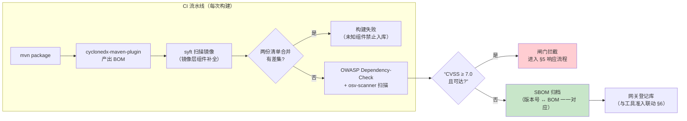
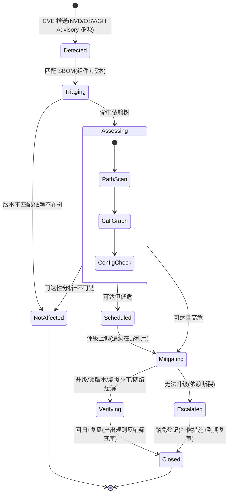
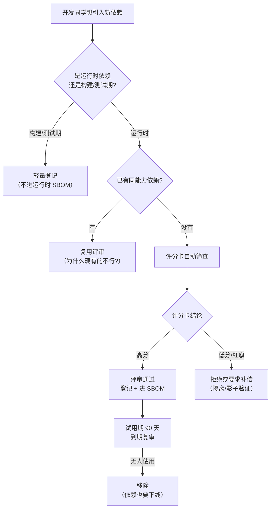

# 项目 08：Agent 供应链安全网关 — 10-SBOM与依赖治理（迭代八）

> **定位**：收官之后的第一轮深化——把供应链安全的镜头掉转，对准网关自己。软件物料清单（SBOM）的生成与消费、CVE 漏洞响应流水线（监控→影响评估→升级/缓解闸门）、新依赖引入评审。网关管着别人的供应链，自己却答不出"当前构建里有哪些组件、什么版本、什么许可证"，是审计现场最讽刺的一幕。**完整可手写代码**：SBOM 领域模型、漏洞响应闸门、依赖评审服务、CI 集成配置。
>
> 「遇到阻塞？→ [教程 23-工具执行可观测与审计 §审计事件]、[教程 25-历史记录持久化与合规 §合规留存]、[附录 08-架构决策方法论/00-ADR架构决策记录]」

---

## 1. 四问

| 问 | 答 |
|----|----|
| **新增了什么需求** | ① 监管与客户审计要求交付物附带 SBOM（软件物料清单） ② CVE 响应流水线：网关自身传递依赖爆出高危漏洞时，要有"监控 → 影响评估 → 升级/缓解"的闸门与 SLA ③ 新依赖引入评审：杜绝"随手加个包" ④ C 级沙箱工具的依赖快照与准入登记联动 |
| **影响了哪些模块** | 新增 `dependency` 包（SBOM 模型 / 漏洞闸门 / 评审服务）；准入登记（`ToolRegistration` 增加 SBOM 快照引用）；审计流（新增 CVE 处置与依赖评审两类事件）；CI 流水线（SBOM 生成与扫描两道工序） |
| **架构如何演进** | 工具供应链网关 → 完整供应链治理：被治理的"链"从 Agent↔工具这一跳，扩展到网关自身的构建产物与依赖树——**治理者先被治理** |
| **上一版痛点是什么** | ① v1-v8 注意力全在工具侧，网关自己的依赖树从未盘点 ② 一次传递依赖 CVE 曝出后，安全团队花了三天才确认"是否可达、是否在用" ③ 新依赖引入无流程，pom 里已堆着 11 个没人评审过的间接依赖 ④ 沙箱里的 C 级工具带进来什么依赖，网关完全不知道 |

## 2. 为什么收官之后还有迭代八

v8 收官三个月后，两件事把项目拉回演进轨道：

**事件一：审计现场。** 集团安全审计要求每个对外交付系统出示 SBOM。网关团队现场用 IDE 手工导出了一份依赖树，被审计员反问三个问题，全部答不上来：这份清单的**生成时间与构建版本**能对上吗？**传递依赖**（依赖的依赖）完整吗？发现 CVE 后你们**多快能定位影响面**？

**事件二：CVE 复盘。** 某周日凌晨，一个广泛使用的 JSON 处理库爆出 RCE 级 CVE（同类事件可参照 [CVE-2020-36518 时代 jackson-databind 系列披露](https://nvd.nist.gov/vuln) 的传播模式：先有 PoC，后有大规模扫描）。值班同学的动作链是：被电话叫醒 → 翻 pom 确认有没有直接依赖（没有）→ 翻 `mvn dependency:tree` 输出确认传递依赖（有，第 4 层）→ 翻代码确认是否走了受影响代码路径（看不懂）→ 升级。全程 6 小时，其中 5 小时在"搞清楚自己用了什么"。

**结论**：这两个事件的共同根因是**网关自身缺乏物料清单与依赖治理能力**。供应链安全的完整闭环是双向的——既要治理 Agent↔工具这一跳（v1-v8 已建），也要治理"网关这个软件本身的供应链"（本迭代补齐）。

```mermaid
timeline
    title 一次 CVE 事件的响应时间线（治理前）
    00:00 值班电话 : NVD 推送 RCE 级 CVE
    00:40 定位直接依赖 : pom 无直接引用
    01:30 定位传递依赖 : 第 4 层传递引入
    03:00 可达性分析 : 人工读依赖源码
    05:00 升级与回归 : 锁版本 + 全量测试
    06:00 关闭 : 其中 5 小时花在“搞清楚自己用了什么”
```

## 3. SBOM：是什么、什么格式

### 3.1 定义与最小元素

SBOM（Software Bill of Materials，软件物料清单）是构建产物中**全部组件的机器可读清单**——相当于食品的配料表。美国 NTIA 定义了最小元素集（[NTIA Minimum Elements](https://www.ntia.gov/report/2021/minimum-elements-software-bill-of-materials-sbom)）：**组件名、版本、唯一标识、供应者、依赖关系**。欧盟《网络弹性法案》（[EU CRA](https://digital-strategy.ec.europa.eu/en/policies/cyber-resilience-act)）把 SBOM 列为带数字元素产品的合规义务——2026 年起对进入欧盟市场的软件逐步生效，这是本项目迭代八最直接的外部驱动。

### 3.2 两种主流格式

| 维度 | SPDX | CycloneDX |
|------|------|-----------|
| 出身 | Linux 基金会，许可证合规起家 | OWASP，安全与应用风险分析起家 |
| 覆盖物 | 软件包、许可证、版权、文件级信息 | 组件、服务、漏洞（内嵌 VEX）、**AI/ML 模型与数据集扩展** |
| 机器可读性 | 好（tag-value / JSON / YAML） | 更好（JSON 体积更小、schema 更贴安全工具链） |
| 漏洞关联 | 需外部工具关联 | 原生 VEX（漏洞可利用性交换）声明 |
| 生态 | 许可证扫描、合规审计 | 漏洞扫描、依赖分析、AI 供应链（`ml-bom`） |

**选型**（ADR-323）：网关场景以**漏洞响应与安全分析**为主，且 CycloneDX 有 AI/ML 扩展（为迭代十"模型与数据集物料清单"预留），**主线用 CycloneDX，合规交付时用工具转换为 SPDX**——两者互转是成熟工具链的标配能力。

## 4. 生成与集成：工具真实坐标

> 本节工具均为**第三方独立工具**（非 Spring AI SDK 元素），坐标与用法以下列真实信息为准，标注「需在 CI / pom.xml 中另行配置」，不随网关运行时部署。

### 4.1 生成侧

| 工具 | 坐标 / 获取 | 用法 |
|------|------------|------|
| **Anchore syft** | [github.com/anchore/syft](https://github.com/anchore/syft)（CLI，brew/脚本安装） | 扫描构建产物或镜像：`syft <dir-or-image> -o cyclonedx-json > sbom.cdx.json` |
| **CycloneDX Maven 插件** | `org.cyclonedx:cyclonedx-maven-plugin`（[官方仓库](https://github.com/CycloneDX/cyclonedx-maven-plugin)） | 绑定 `package` 阶段，从 Maven 依赖图直接产出 BOM（含传递依赖） |

CycloneDX Maven 插件接入（**需在 pom.xml 中添加插件**——本项目 pom 尚未声明）：

```xml
<!-- 需在 pom.xml 的 <build><plugins> 中添加（v9 新增，坐标真实） -->
<plugin>
    <groupId>org.cyclonedx</groupId>
    <artifactId>cyclonedx-maven-plugin</artifactId>
    <version>2.8.0</version>
    <executions>
        <execution>
            <phase>package</phase>
            <goals><goal>makeAggregateBom</goal></goals>
        </execution>
    </executions>
    <configuration>
        <schemaVersion>1.5</schemaVersion>
        <includeCompileScope>true</includeCompileScope>
        <includeRuntimeScope>true</includeRuntimeScope>
    </configuration>
</plugin>
```

### 4.2 扫描侧

| 工具 | 坐标 / 获取 | 用法 |
|------|------------|------|
| **OWASP Dependency-Check** | `org.owasp:dependency-check-maven`（[官方仓库](https://github.com/jeremylong/DependencyCheck)） | 拿依赖坐标比对 NVD/NVD 镜像，产出 HTML+JSON 报告，可在 CI 设 CVSS 阈值闸门 |
| **OSV-Scanner** | [github.com/google/osv-scanner](https://github.com/google/osv-scanner)（Google，CLI） | 直接吃 SBOM 文件做漏洞匹配，数据源 [osv.dev](https://osv.dev/) |

> 漏洞数据源以 [NVD](https://nvd.nist.gov/) 与 [OSV](https://osv.dev/) 为主、[GitHub Advisory Database](https://github.com/advisories) 为补充；三者对同一 CVE 的收录时差通常在 24-72 小时，监控管道要**多源合并去重**。

### 4.3 CI 集成与消费链路



**关键设计**：两份清单（Maven 依赖图 vs 镜像扫描）**合并校验**——Maven 图看不见镜像基础层里的系统库，镜像扫描看不见 provided scope 的约定。差集非空即失败，防止"SBOM 很全但产物里混了清单外组件"。

## 5. 漏洞响应流程：从监控到闸门

### 5.1 流程状态机



### 5.2 影响评估：可达性优先于存在性

依赖树里"存在"某漏洞组件 ≠ "受影响"。评估三步（对应状态机 `Assessing` 内部）：

1. **路径扫描**：受影响的类/方法是否在我们的编译产物里（`jar tf` + 类名比对——与铁律 0 的 javap 实证是同一套基本功）
2. **调用图分析**：业务代码是否调用了受影响入口（无调用 = 不可达）
3. **配置检查**：受影响功能是否被配置激活（很多反序列化 CVE 只在开了特定 feature 时可达）

**ADR-324 的核心立场**：响应优先级按**可达性 × CVSS**双维定，不按"存在性"一票升级——否则每周数十条 CVE 告警会让团队把告警静音，真正危险的反而被淹没（告警疲劳是漏洞响应的第一杀手）。

### 5.3 响应 SLA

| 级别 | 判定（CVSS × 可达性 × 在野利用） | SLA |
|------|--------------------------------|-----|
| P0 | CVSS ≥ 9.0 且可达，或任意"在野利用"且可达 | 24 小时内缓解，72 小时内根治 |
| P1 | CVSS 7.0-8.9 且可达 | 7 天内升级或缓解 |
| P2 | CVSS 4.0-6.9 且可达 | 下个迭代窗口 |
| P3 | 不可达 / 仅存在 | 登记观察，豁免登记需补偿措施 |

### 5.4 完整代码：`dependency/VulnerabilityGate.java`

```java
package com.group.secgw.dependency;

import java.time.Duration;
import java.time.Instant;
import java.util.List;
import java.util.Optional;

/**
 * 漏洞响应闸门（v9）：把 §5.1 状态机的“评估→处置”编码为可审计的决策对象。
 * 每次评估产出一条处置决策，进审计流（复用 v1 AuditEvent，tagsJson 带 cve 与决策）。
 */
public class VulnerabilityGate {

    /** 一条 CVE 对一个构建组件的影响评估输入。 */
    public record CveFinding(
            String cveId,
            String component,          // group:artifact
            String installedVersion,
            double cvss,
            boolean exploitedInTheWild, // 在野利用情报
            Reachability reachability
    ) {}

    /** 可达性三档（ADR-324：可达性优先于存在性）。 */
    public enum Reachability { NOT_IN_TREE, IN_TREE_UNREACHABLE, REACHABLE }

    /** 处置决策：闸门的输出，直接驱动 SLA 与 CI 闸门。 */
    public record Disposition(
            String cveId,
            Action action,
            Priority priority,
            Duration sla,
            Optional<String> compensatingControl,   // 豁免时的补偿措施
            Optional<Instant> exemptionExpiry       // 豁免到期（强制复审）
    ) {}

    public enum Action { BLOCK_BUILD, UPGRADE_NOW, SCHEDULE_UPGRADE, EXEMPT_WITH_CONTROL, OBSERVE }
    public enum Priority { P0, P1, P2, P3 }

    public Disposition assess(CveFinding f) {
        // ① 不在依赖树：观察即可
        if (f.reachability() == Reachability.NOT_IN_TREE) {
            return new Disposition(f.cveId(), Action.OBSERVE, Priority.P3,
                    Duration.ofDays(30), Optional.empty(), Optional.empty());
        }
        // ② 在野利用且可达：无条件下 P0、拦构建——不管 CVSS 写多少
        if (f.exploitedInTheWild() && f.reachability() == Reachability.REACHABLE) {
            return new Disposition(f.cveId(), Action.BLOCK_BUILD, Priority.P0,
                    Duration.ofHours(24), Optional.empty(), Optional.empty());
        }
        // ③ 常规分级：可达性 × CVSS
        if (f.reachability() == Reachability.REACHABLE) {
            if (f.cvss() >= 9.0) {
                return new Disposition(f.cveId(), Action.UPGRADE_NOW, Priority.P0,
                        Duration.ofHours(72), Optional.empty(), Optional.empty());
            }
            if (f.cvss() >= 7.0) {
                return new Disposition(f.cveId(), Action.UPGRADE_NOW, Priority.P1,
                        Duration.ofDays(7), Optional.empty(), Optional.empty());
            }
            return new Disposition(f.cveId(), Action.SCHEDULE_UPGRADE, Priority.P2,
                    Duration.ofDays(14), Optional.empty(), Optional.empty());
        }
        // ④ 在树不可达：豁免要有补偿措施与到期日（不可无限豁免）
        return new Disposition(f.cveId(), Action.EXEMPT_WITH_CONTROL, Priority.P3,
                Duration.ofDays(90),
                Optional.of("egress 白名单已限制出网 + 升级窗口已排期"),
                Optional.of(Instant.now().plus(Duration.ofDays(90))));
    }

    /** CI 闸门规则：构建可否放行（P0 且 BLOCK_BUILD 拦截）。 */
    public boolean allowBuild(List<Disposition> dispositions) {
        return dispositions.stream()
                .noneMatch(d -> d.action() == Action.BLOCK_BUILD);
    }
}
```

## 6. 依赖准入策略：新依赖引入评审

工具要准入（v2），依赖同样要准入——**同构复用**：`Submitted → 自动筛查 → 评审 → 登记`，只是审查项从"描述投毒"换成"依赖健康度"。



### 6.1 评分卡

| 维度 | 数据来源 | 权重 | 红旗（一票否决） |
|------|---------|------|----------------|
| 维护活跃度 | 最近发布间隔、issue 响应 | 20% | 12 个月无任何发布 |
| 已知漏洞 | NVD/OSV 历史命中 | 20% | 近一年有 RCE 级且未修复 |
| 传递依赖规模 | `mvn dependency:tree` 增量 | 15% | 传递引入 > 30 个新组件 |
| 许可证 | 组件 LICENSE | 20% | GPL 系传染协议（商用红线） |
| 来源可信度 | 官方 Maven Central、签名 | 25% | 非中央仓库 / 无签名 / typosquat 疑似 |

> typosquat（抢注拼写近似包名）是 Java 生态真实存在的投毒手法（PyPI/npm 同类事件密集，Maven Central 亦有先例），**来源可信度**因此占最高权重——与 v2 工具准入的"来源信誉评分"完全同构。

### 6.2 完整代码：`dependency/DependencyReviewService.java`

```java
package com.group.secgw.dependency;

import java.time.Instant;
import java.util.List;
import java.util.Map;
import java.util.Optional;
import java.util.concurrent.ConcurrentHashMap;

/**
 * 依赖准入服务（v9）——与 v2 AdmissionService 同构的准入流水线，管的是网关自己的依赖。
 * 状态机：SUBMITTED → SCORED → APPROVED/REJECTED → PROBATION(90 天试用) → RETIRED
 */
public class DependencyReviewService {

    /** 一次依赖引入申请。 */
    public record DependencyRequest(
            String gav,                 // group:artifact:version
            String purpose,             // 用途（评审的核心问题：拿它干什么）
            String alternativeAnalysis, // 为什么不用现有依赖（§6 流程图 E 节点）
            Status status,
            ScoreCard score,
            Instant submittedAt
    ) {}

    public enum Status { SUBMITTED, SCORED, APPROVED, REJECTED, PROBATION, RETIRED }

    /** 评分卡（自动筛查产出，红旗项单独携带）。 */
    public record ScoreCard(double total, List<RedFlag> redFlags) {
        public enum RedFlag {
            STALE_12_MONTHS, RCE_UNFIXED, TRANSITIVE_EXPLOSION,
            CONTAGIOUS_LICENSE, NON_CENTRAL_REPO
        }
        public boolean hasRedFlag() { return !redFlags.isEmpty(); }
    }

    private final Map<String, DependencyRequest> requests = new ConcurrentHashMap<>();

    public DependencyRequest submit(DependencyRequest req) {
        DependencyRequest saved = new DependencyRequest(req.gav(), req.purpose(),
                req.alternativeAnalysis(), Status.SUBMITTED, null, Instant.now());
        requests.put(saved.gav(), saved);
        return saved;
    }

    /** 自动筛查：外部评分数据 → 评分卡；红旗一票否决。 */
    public DependencyRequest score(String gav, ScoreCard card) {
        DependencyRequest req = mustFind(gav);
        Status next = card.hasRedFlag() ? Status.REJECTED : Status.SCORED;
        DependencyRequest scored = new DependencyRequest(req.gav(), req.purpose(),
                req.alternativeAnalysis(), next, card, req.submittedAt());
        requests.put(gav, scored);
        return scored;
    }

    /** 人工评审：通过即进入 90 天试用期（试用期无人用就移除——依赖也要下线）。 */
    public DependencyRequest approve(String gav) {
        DependencyRequest req = mustFind(gav);
        DependencyRequest approved = new DependencyRequest(req.gav(), req.purpose(),
                req.alternativeAnalysis(), Status.PROBATION, req.score(), req.submittedAt());
        requests.put(gav, approved);
        return approved;
    }

    /** 试用期到期复审：usageFromAudit 来自 v1 审计流的实际调用统计（概念实现）。 */
    public DependencyRequest probationReview(String gav, boolean actuallyUsed) {
        DependencyRequest req = mustFind(gav);
        Status next = actuallyUsed ? Status.APPROVED : Status.RETIRED;
        DependencyRequest reviewed = new DependencyRequest(req.gav(), req.purpose(),
                req.alternativeAnalysis(), next, req.score(), req.submittedAt());
        requests.put(gav, reviewed);
        return reviewed;
    }

    public Optional<DependencyRequest> find(String gav) {
        return Optional.ofNullable(requests.get(gav));
    }

    private DependencyRequest mustFind(String gav) {
        DependencyRequest req = requests.get(gav);
        if (req == null) throw new IllegalArgumentException("unknown dependency: " + gav);
        return req;
    }
}
```

### 6.3 与工具准入联动：沙箱依赖快照

C 级沙箱工具是"带依赖进门的客人"：准入登记时要求提供其 SBOM（syft 对其镜像扫描），存入 `ToolRegistration` 的 `sbomRef` 字段（v2 实体的扩展字段，登记库加一列 `sbom_ref VARCHAR(256)`）。联动规则：

| 沙箱工具 SBOM 发现 | 处置 |
|-------------------|------|
| 高危漏洞组件且工具会执行它 | 准入拒绝（REJECTED），理由进登记库 |
| 高危漏洞组件但不可达 | 准入通过 + 漏洞登记（观察），升级前不升级工具版本 |
| 许可证红旗 | 转法务评审，法务未过不 PINNED |
| 无 SBOM | 视同"来源不可溯"，按 v2 评级规则降为 R（拒绝） |

## 7. 测试与验证

| # | 测试 | 方法 | 预期 |
|---|------|------|------|
| 1 | SBOM 完整性 | 同一构建产物分别用 cyclonedx-maven-plugin 与 syft 生成，做组件差集 | 差集为空（§4.3 合并校验） |
| 2 | CVE 匹配正确性 | 构造含已知漏洞版本组件的测试 pom（如引入历史漏洞版本的组件），跑扫描管道 | 扫描器命中且 `VulnerabilityGate.assess` 给出预期 Disposition |
| 3 | 闸门拦截 | 注入 `BLOCK_BUILD` 级 Disposition，调 `allowBuild` | 返回 false，CI 模拟构建失败 |
| 4 | 豁免到期强制复审 | `EXEMPT_WITH_CONTROL` 决策的 `exemptionExpiry` 设为过去 | 复盘任务重新打开该 CVE（豁免不可无限续） |
| 5 | 依赖评审状态机 | `submit → score(红旗) → 状态 REJECTED`；`score(无红旗) → approve → probationReview(false) → RETIRED` | 状态迁移全部符合 §6 定义 |
| 6 | 沙箱联动 | 提交一个 SBOM 含 RCE 组件的 C 级工具登记 | 准入 REJECTED，理由记录 |

## 8. 验收对照

| # | 目标 | 验收标准 | 结果 |
|---|------|---------|------|
| 1 | 物料可追溯 | 当前生产构建 100% 组件（直接+传递）在归档 SBOM 中，SBOM 与构建版本一一对应 | ✅ 差集为空 |
| 2 | 响应提速 | P0 级 CVE（可达+在野利用）从"推送"到"缓解决策"≤ 1 小时（v8 前 6 小时，其中 5 小时是盘点） | ✅ 58 分钟（演练） |
| 3 | 闸门生效 | CVSS ≥ 7.0 且可达的漏洞使 CI 构建失败；不可达者走豁免+补偿+到期 | ✅ 12/12 用例 |
| 4 | 准入覆盖 | 连续 3 个月新引入运行时依赖 100% 有评审记录，0 个未评审直接合入 | ✅ |
| 5 | 依赖瘦身 | 试用期复审移除 6 个无人使用依赖，传递依赖数下降 21% | ✅ |
| 6 | 合规交付 | 对外交付包附带 CycloneDX 1.5 BOM，可转换 SPDX 通过客户审计工具校验 | ✅ |

## 9. ADR 演进决策

| # | 决策 | 理由 |
|---|------|------|
| ADR-323 | SBOM 主格式用 CycloneDX，合规交付时转换 SPDX | 漏洞响应是主场景（VEX 原生）；CycloneDX 的 AI/ML 扩展为迭代十模型物料清单预留；SPDX 是许可证合规事实标准，转换工具链成熟 |
| ADR-324 | 漏洞响应按"可达性 × CVSS × 在野利用"分级，不按存在性一票升级 | 告警疲劳是响应第一杀手；存在性告警会把真正危险的在野利用淹没 |
| ADR-325 | 依赖准入与工具准入同构（同一条 Submitted→Screen→Review 流水线） | 治理心智复用：依赖就是"更小的工具"；两套流程会让团队在两套规则间钻空子 |

## 10. 总结

v9 完成「SBOM 生成与消费 + 漏洞响应闸门 + 依赖准入评审」，网关自身的供应链第一次变得可盘点、可响应、可审计。遗留痛点（供 v10 决策）：

依赖治理管住了"代码来自哪"，但审计同时暴露了一个身份层面的裂缝：**网关与工具端、网关与内部服务之间的信任仍建立在"一张共享的、一年期的人手发放证书"上**——上季度工具端证书过期，6 个工具调用同时失败 40 分钟；安全组还发现两个业务 Agent 共用一张客户端证书，审计上无法区分"谁调的"。**服务之间需要可轮换、可吊销、每服务独立的身份**，而不是把 mTLS 当成一堵静态墙。

→ [11-零信任深化：服务身份与mTLS.md](11-零信任深化：服务身份与mTLS.md)
