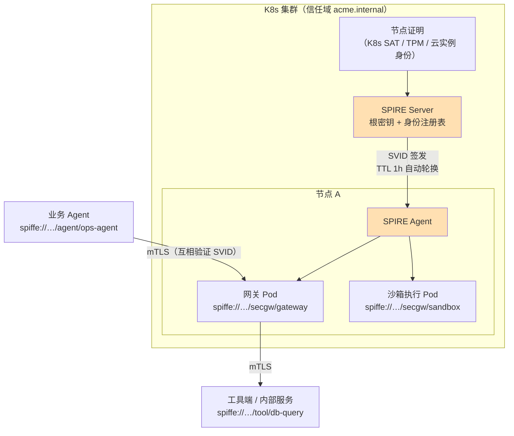
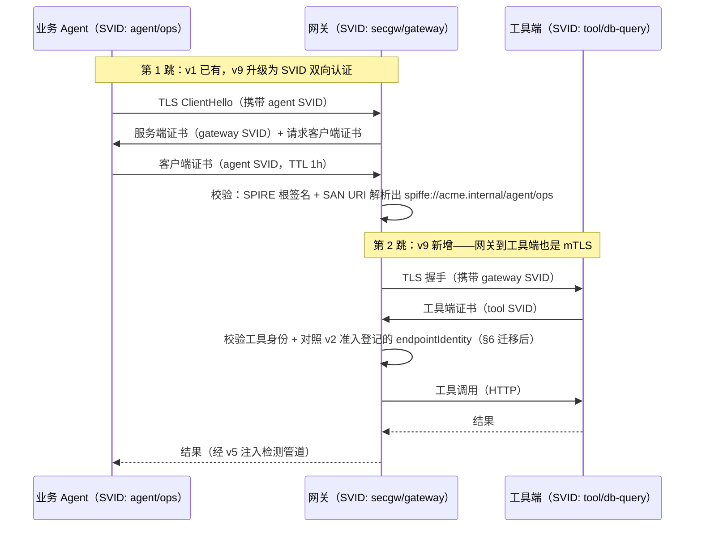
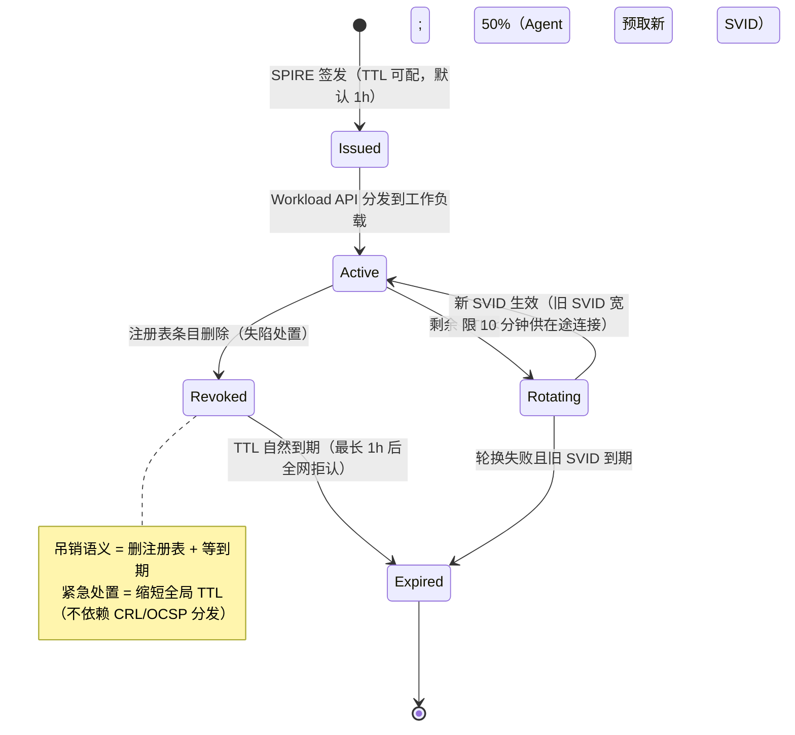

# 项目 08：Agent 供应链安全网关 — 11-零信任深化：服务身份与mTLS（迭代九）

> **定位**：把 v1 的"一跳 mTLS + 手工长证书"升级为**全链服务身份体系**——SPIFFE/SPIRE 工作负载身份、网关↔工具↔内部服务全 mesh 双向认证、证书自动轮换与吊销语义、最小权限服务策略；并修复证书轮换与 v2 指纹机制的一处真实冲突。**完整可手写代码**：mTLS 双向认证的 WebClient（已 javap 实证）、SPIFFE 身份解析、服务授权策略、指纹适配。
>
> 「遇到阻塞？→ [教程 64-安全与权限控制 §零信任]、[附录 08-Agent安全深度]、[附录 16-Agent沙箱与执行环境/00-沙箱技术对比与选型 §网络隔离]」
>
> **依赖说明**：SPIFFE 的 Java 支撑库 `org.spiffe:java-spiffe-core`（[github.com/spiffe/java-spiffe](https://github.com/spiffe/java-spiffe)）本地仓库未下载，标注「需引入依赖后实证」；spring-security 相关类本地仅有 BOM 无 jar，同样标注。netty/reactor-netty/spring-web 的 TLS API 均已对本地 jar `javap` 实证（版本注于代码处）。

---

## 1. 四问

| 问 | 答 |
|----|----|
| **新增了什么需求** | ① 每个服务/Agent **独立身份**（一服务一身份，禁共享证书） ② 证书**自动轮换**（消灭"一年一换、换一次停一片"） ③ **吊销语义**（失陷服务 5 分钟内全网拒认） ④ mTLS 覆盖**全链路**（Agent→网关→工具/沙箱/内部服务） ⑤ 服务间**最小权限**策略（身份之后还要授权） |
| **影响了哪些模块** | 接入认证（AgentPrincipal 升级为 SPIFFE 身份）；出站 HTTP 客户端（网关→工具的 mTLS）；准入指纹（endpointIdentity 维度迁移）；零信任策略（主体类型扩展为服务）；运维面（SPIRE 部署与演练） |
| **架构如何演进** | "网关门口一道静态 mTLS 墙" → "**全网工作负载身份 mesh**"：身份由基础设施签发、短生命周期自动轮换、按身份授权——v6 的零信任从"Agent 对工具"扩展到"服务对服务" |
| **上一版痛点是什么** | ① 工具端证书集中过期，6 个工具调用同时失败 40 分钟（§2 事件复盘） ② 两个业务 Agent 共用一张客户端证书，审计无法区分调用者 ③ v1 的 `client-auth: want` 模式下无证书请求也能进来 ④ 长证书（一年期）意味着泄露窗口也是一年，且没有可用的吊销通道 |

### 1.1 本节核对（四问）

| # | 核对项 | 判据 |
|---|------|------|
| 1 | 新增需求与正文章节一一对应 | ①②③④⑤ 分别落到 §4（全链 mTLS）、§5（轮换/吊销）、§6（指纹迁移）、§5.3（最小权限策略）、§3（SPIFFE） |
| 2 | 痛点可在 §2 事件复盘找到出处 | ①→"6 个工具 40 分钟"、②→"证书共享"事件、③→v1 `want` 模式、④→"泄露窗口一年" |
| 3 | "静态墙→身份 mesh"演进与 §3/§5 呼应 | 由 SPIFFE 身份（§3）+ 短 TTL（§5）承接 |

## 2. 事件复盘：长证书的三宗罪

v8 后四个月内的三起事件，指向同一个根因——**身份生命周期与业务脱节**：

| 事件 | 表象 | 根因 |
|------|------|------|
| 工具端证书过期 | 6 个工具同时 40 分钟不可用 | 证书一年一发、人手登记日历提醒；工具提供方 3 个团队、日历 0 个人维护 |
| 证书共享 | 审计发现 agent-A 与 agent-B 同证书调用 | 发证书要走审批，开发"顺手"复用了隔壁团队的证书 |
| 失陷处置失败 | 某测试 Agent 被入侵需吊销其证书 | 一年期证书无 CRL/OCSP 分发点，"吊销"唯一手段是换全网信任根——成本不可接受 |

**结论**：手工长证书把"身份"退化成了"静态共享口令"。要的不是更强的证书，而是**身份的自动化生命周期**——这正是 SPIFFE 生态解决的问题。

### 2.1 本节核对（长证书三宗罪）

| # | 核对项 | 判据 |
|---|------|------|
| 1 | 三起事件的根因都指向身份生命周期 | 过期（日历失维）/共享（审批成本）/失陷（无吊销）都因"手工长证书" |
| 2 | 结论引出 SPIFFE 生态 | "自动化生命周期"正由 §3 SPIFFE/SPIRE 承接 |
| 3 | 收益三条映射到 §3.2 | 一年一换→TTL 1h、共享→一负载一身份、无吊销→删注册表+短 TTL |

## 3. SPIFFE/SPIRE：工作负载身份体系

### 3.1 三个核心概念

- **SPIFFE ID**：工作负载的全局唯一 URI 身份，形如 `spiffe://acme.internal/agent/ops-agent`——信任域（`acme.internal`）+ 路径（谁）。**身份属于工作负载本身，不属于机器或人**：同一个 Pod 重建后身份不变，换台机器身份就变。
- **SVID**（SPIFFE Verifiable Identity Document）：SPIFFE ID 的可验证载体，主流是 **X.509-SVID**（短期证书，SAN URI 字段携带 SPIFFE ID），另有 JWT-SVID（跨非 mTLS 链路用）。
- **SPIRE**（SPIFFE Runtime Environment）：签发与分发系统——SPIRE Server 负责根密钥与签发，SPIRE Agent 部署在节点上，通过**节点证明**（Node Attestation，K8s 里用 Projected Service Account Token 等）确认"我是这个节点"，再通过**工作负载注册表**确认"这个节点上谁可以拿到哪个身份"。

项目主页：[spiffe.io](https://spiffe.io/)、[github.com/spiffe/spire](https://github.com/spiffe/spire)。

### 3.2 SPIRE 架构与身份流



**关键收益映射到 §2 三宗罪**：证书一年一发 → **TTL 1 小时自动轮换**（过期不再是事件）；证书共享 → **一工作负载一身份**（审计天然区分调用者）；无法吊销 → **吊销 = 删除注册表条目，1 小时内自然失效**（等不及就缩短 TTL，见 §5）。

### 3.3 本节核对（SPIFFE/SPIRE 概念）

| # | 核对项 | 判据 |
|---|------|------|
| 1 | SPIFFE ID 形态与正文一致 | 形如 `spiffe://acme.internal/agent/ops-agent`（信任域+路径） |
| 2 | 身份属于工作负载而非机器 | SVID 的 SAN URI 携带身份；Pod 重建身份不变、换机器变 |
| 3 | SPIRE 职责划分准确 | Server 管根/签发、Agent 管节点证明与分发、注册表管"谁能拿哪个身份" |

## 4. 全链 mTLS：代码落地（已实证 API）

### 4.1 服务端（网关自身）：从 want 到 need

v1 的 `client-auth: want` 是过渡态（无证书也放行，靠应用层兜底）。身份体系就位后收紧为 **need**——没有有效 SVID 的连接直接在 TLS 握手层拒绝：

```yaml
server:
  port: 8443
  ssl:
    enabled: true
    client-auth: need                     # v9：从 want 收紧——无客户端证书直接握手失败
    key-store: ${GATEWAY_KEYSTORE:classpath:gateway.p12}
    key-store-password: ${GATEWAY_KEYSTORE_PASSWORD}
    key-alias: gateway
    trust-store: ${GATEWAY_TRUSTSTORE:classpath:spire-bundle.p12}  # SPIRE 根 Bundle
```

> SPIRE 的根（bundle）会定期轮换；生产实现应由 SPIRE Agent 通过 Workload API 持续刷新 truststore 与服务端证书（`org.spiffe:java-spiffe-core`，**需引入依赖后实证**），上面的静态文件写法是单机演示形态。

### 4.2 客户端（网关→工具）：mTLS 的 WebClient

以下 API 全部经本地 jar `javap` 实证：`reactor-netty-http 1.2.18` 的 `HttpClient.secure(Consumer<? super SslProvider$SslContextSpec>)`、`reactor-netty-core 1.2.18` 的 `SslProvider$SslContextSpec.sslContext(SslContext)`、`netty-handler 4.1.135.Final` 的 `SslContextBuilder.forClient().keyManager(PrivateKey, X509Certificate...).trustManager(X509Certificate...)`、`spring-web 7.0.8` 的 `new ReactorClientHttpConnector(HttpClient)`。

```java
package com.group.secgw.security;

import io.netty.handler.ssl.SslContext;
import io.netty.handler.ssl.SslContextBuilder;
import org.springframework.http.client.reactive.ReactorClientHttpConnector;
import org.springframework.stereotype.Component;
import org.springframework.web.reactive.function.client.WebClient;
import reactor.netty.http.client.HttpClient;

import java.security.PrivateKey;
import java.security.cert.X509Certificate;
import java.util.List;

/**
 * 网关出站 mTLS 工厂（v9）——网关作为客户端访问工具端时的双向认证。
 * 身份来源：SPIRE Workload API 拉取本工作负载的 X.509-SVID（PrivateKey + 证书链）。
 * 轮换处理：证书内容可变（TTL 1h），工厂按需重建（监听 SPIRE 的 SVID 更新通知）。
 */
@Component
public class MtlsWebClientFactory {

    private volatile WebClient cached;
    private volatile String cachedSvidFingerprint = "";

    /** 用当前 SVID 构建带双向认证的 WebClient（API 均已 javap 实证，见篇首版本清单）。 */
    public WebClient mtlsClient(String baseUrl, PrivateKey privateKey,
                                List<X509Certificate> svidChain,         // 工作负载证书链
                                List<X509Certificate> trustBundle) {     // SPIRE 根 bundle
        String fp = String.valueOf(svidChain.get(0).hashCode());
        WebClient existing = cached;
        if (existing != null && fp.equals(cachedSvidFingerprint)) {
            return existing;   // SVID 未轮换，复用
        }
        try {
            SslContext sslContext = SslContextBuilder.forClient()
                    .keyManager(privateKey, svidChain.toArray(X509Certificate[]::new))
                    .trustManager(trustBundle.toArray(X509Certificate[]::new))
                    .build();
            HttpClient httpClient = HttpClient.create()
                    .secure(spec -> spec.sslContext(sslContext));
            WebClient client = WebClient.builder()
                    .baseUrl(baseUrl)
                    .clientConnector(new ReactorClientHttpConnector(httpClient))
                    .build();
            this.cached = client;
            this.cachedSvidFingerprint = fp;
            return client;
        } catch (Exception e) {
            throw new IllegalStateException("mTLS client init failed", e);
        }
    }
}
```

> **WebFlux 一致性说明**：`HttpClient.create()` 默认共享连接池（EventLoop 复用），`secure(...)` 只配置 TLS 上下文、不阻塞；SVID 轮换重建走"指纹比对 + 原子替换引用"，读侧无锁。**SVID 私钥与证书链的拉取**若采用 java-spiffe 库（`org.spiffe:java-spiffe-core`，坐标真实、本地未下载——**需引入依赖后实证**），其 Workload API 客户端自带流式更新回调，替换本类的轮询式指纹比对即可。

### 4.3 全链 mTLS 时序



### 4.4 本节测试与验证（全链 mTLS）

**前置条件**：服务端 `application.yml` 已设为 `client-auth: need`（§4.1）；`MtlsWebClientFactory`（§4.2）编译通过；有 SPIRE 签发的 gateway/tool 的 SVID 证书链与根 bundle；`gateway.p12`+`spire-bundle.p12` 可被 Spring 加载。

**材料——调用与握手核对命令**：

```bash
# A. 正常：网关→工具 带 SVID 双向认证（走 §4.2 mtlsClient 构造的 WebClient）
curl -sk --cert gw.svid.pem --key gw.svid.key https://tools.internal:9443/tool/db-query
# B. 无客户端证书（验证 §4.1 client-auth: need 在握手层拒绝）
curl -k https://secgw:8443/api/v1/tool/invoke
# C. 抓握手包验证两跳都走 TLS（§8 验收 4：无明文跳）
tcpdump -i any -w mtls.pcap 'tcp port 8443 or 9443'           # 抓包后核对无明文 HTTP
# D. SAN URI 校验（§8 验收 1 身份独立）
echo | openssl s_client -connect tools.internal:9443 2>/dev/null | openssl x509 -text | grep -A1 URI
```

**步骤与断言**：

| # | 操作 | 预期（PASS 判据） |
|---|------|------------------|
| 1 | 材料 A（带 SVID 证书） | 第 2 跳握手成功，含密钥交换正常（`SslContextBuilder.forClient().keyManager(...)` 生效，§4.2） |
| 2 | 材料 B（无客户端证书） | TLS 握手层即失败（应用层都到不了——`client-auth: need`，§4.1；对比 v1 的 `want` 会放行） |
| 3 | 用另一信任域签发的假 SVID 调网关 | 根不匹配，握手失败（§7 验收 2 伪造身份拒绝） |
| 4 | 材料 C 抓包核对 | 网关入口与网关→工具两跳均为 TLS 无明文；`Authorization` 头不出现在明文（抓包确认） |
| 5 | 材料 D | 工具端点证书 SAN URI 为 `spiffe://acme.internal/tool/db-query`（SPIFFE ID 可校验，§3） |

**失败排查**：①B 没拒绝 → `client-auth` 仍是 `want`（§4.1 未收紧）；②A 握手失败 → SVID 私钥/证书链或信任根 bundle 不匹配（SAN URI、签名链核对），或 `trustManager` 少了 SPIRE 根；③两跳明文 → 检查 WebClient 是否真的用 `secure()` 构造的 HttpClient（§4.2），或代理层透传了明文。

## 5. 证书生命周期：轮换与吊销

### 5.1 状态机



### 5.2 为什么"短 TTL + 删除注册表"胜过 CRL/OCSP（ADR-327）

CRL（证书吊销列表）与 OCSP（在线状态协议）的问题在 Agent 供应链场景被放大：调用链路毫秒级、离线工具与沙箱节点常无稳定 OCSP 通道、分发点本身成为新攻击面。**短 TTL 把吊销问题转化为时间问题**——删掉注册表条目后，失陷身份最多再活一个 TTL。等不及一个 TTL 的场景（在野利用），把全局 TTL 从 1h 调到 10 分钟，代价只是 SPIRE 签发量上升（签发是本地操作，可承受）。

| 方案 | 失效延迟 | 基础设施 | 失效模式 |
|------|---------|---------|---------|
| CRL | 小时~天（取决于拉取周期） | 分发点 + 客户端缓存 | 分发点失陷 = 全网 |
| OCSP stapling | 分钟级 | 在线响应器 | 响应器故障影响握手 |
| **短 TTL + 注册表删除** | **≤ TTL（默认 1h，紧急 10min）** | SPIRE（已有） | 签发量上升（可承受） |

### 5.3 最小权限服务策略

身份解决"你是谁"，授权解决"你能干什么"。v6 的 PDP 三维模型（主体×工具×资源）**原样扩展**——主体类型从 Agent 增加服务：

```java
package com.group.secgw.security;

import java.util.List;
import java.util.Set;

/**
 * SPIFFE 身份（v9）——取代 v1 从证书 CN 手工解析的 AgentPrincipal 身份来源。
 * spiffe://acme.internal/agent/ops-agent → trustDomain=acme.internal, workloadKind=agent, name=ops-agent
 */
public record SpiffeIdentity(String trustDomain, String workloadKind, String name) {

    public static SpiffeIdentity parse(String spiffeId) {
        // spiffe://trust-domain/kind/name
        if (spiffeId == null || !spiffeId.startsWith("spiffe://")) {
            throw new IllegalArgumentException("not a SPIFFE ID: " + spiffeId);
        }
        String[] parts = spiffeId.substring("spiffe://".length()).split("/", 3);
        if (parts.length < 3) {
            throw new IllegalArgumentException("malformed SPIFFE ID: " + spiffeId);
        }
        return new SpiffeIdentity(parts[0], parts[1], parts[2]);
    }

    public String spiffeId() {
        return "spiffe://" + trustDomain + "/" + workloadKind + "/" + name;
    }

    /** 跨信任域（A2A/外部协作）预留：federation 中的身份保留本域，只加注对等域。 */
    public boolean sameDomainAs(SpiffeIdentity other) {
        return trustDomain.equals(other.trustDomain());
    }
}
```

```java
package com.group.secgw.security;

import java.util.List;
import java.util.Map;
import java.util.Set;

/**
 * 服务授权策略（v9）——最小权限的服务间版本，评估结构与 v6 ZeroTrustPdp 同构：
 * deny-by-default，显式 allow 才放行。
 */
public class ServiceAuthzPolicy {

    public record Rule(String subjectSpiffeId, Set<String> allowedAudiences) {}
    // allowedAudiences: 目标方 SPIFFE ID 前缀，如 "spiffe://acme.internal/tool/"

    private final Map<String, Set<String>> rules;   // subject → 允许访问的 audience 前缀集合

    public ServiceAuthzPolicy(List<Rule> ruleList) {
        this.rules = ruleList.stream().collect(
                java.util.stream.Collectors.toMap(Rule::subjectSpiffeId, Rule::allowedAudiences));
    }

    /** 默认拒绝：主体未登记、或目标不在其 audience 白名单，一律 deny。 */
    public boolean allow(SpiffeIdentity caller, SpiffeIdentity target) {
        Set<String> audiences = rules.get(caller.spiffeId());
        if (audiences == null) {
            return false;
        }
        return audiences.stream().anyMatch(prefix -> target.spiffeId().startsWith(prefix));
    }
}
```

**示例策略**（YAML 加载方式与 v6 一致）：网关 `secgw/gateway` 只允许访问 `tool/*` 与 `sandbox/*`；沙箱 `secgw/sandbox` **不允许**访问任何内部服务（C 级工具的出网白名单在网络层兜底，这里是身份层的第二道闸）。

### 5.4 本节测试与验证（轮换、吊销与最小权限策略）

**前置条件**：`SpiffeIdentity`、`ServiceAuthzPolicy`（§5.3）编译通过；SPIRE 集群可做 TTL 加速演练；`allow` 默认拒绝语义就位。

**材料——身份与策略核对命令**：

```java
// ① SPIFFE ID 解析（§5.3 SpiffeIdentity）
var id = SpiffeIdentity.parse("spiffe://acme.internal/agent/ops-agent");
// ② 服务策略默认拒绝（§5.3 ServiceAuthzPolicy）
var policy = new ServiceAuthzPolicy(List.of(
    new ServiceAuthzPolicy.Rule("spiffe://acme.internal/secgw/gateway",
        Set.of("spiffe://acme.internal/tool/", "spiffe://acme.internal/sandbox/"))));
policy.allow(/* gateway */, /* tool/db-query */);   // → true
policy.allow(/* gateway */, /* svc/internal-a */);  // → false（白名单外）
policy.allow(/* sandbox */, /* internal-a */);      // → false（最小权限）
```

**步骤与断言**：

| # | 操作 | 预期（PASS 判据） |
|---|------|------------------|
| 1 | `SpiffeIdentity.parse("spiffe://acme.internal/agent/ops-agent")` | trustDomain=`acme.internal`、workloadKind=`agent`、name=`ops-agent`；非法输入抛 IllegalArgumentException |
| 2 | 未登记主体 `allow` 任意目标 | 返回 false（deny-by-default，§5.3） |
| 3 | 网关访问 `tool/db-query` | 返回 true（audience 前缀命中 `spiffe://acme.internal/tool/`） |
| 4 | 网关访问白名单外 `internal-a` | 返回 false（最小权限） |
| 5 | SPIRE TTL 设 5 分钟加速轮换演练，持续压测网关→工具 | 轮换窗口 0 失败（宽限期在途连接复用旧 SVID，§5.1 `Rotating` 状态） |
| 6 | 定位流转：删除某工具注册表条目 | ≤TTL 内该身份被拒认；等不及就缩短全局 TTL（§5.2 短 TTL+删注册表） |
| 7 | `sameDomainAs` 跨信任域 | 同域 true、异域 false（federation 预留，§5.3） |

**失败排查**：①`allow` 全放行 → `rules` 未用 `toMap`（subject→audiences）或为空 map 被当"无条目不拦"（应默认拒）；②access `gateway→internal-a` 意外通过 → audience 前缀匹配用了 `anyMatch` 但规则里含全通配；③吊销不生效 → 注册表条目未真删或 TTL 未缩短（§5.2 的机制被绕过改走 CRL 前先确认是删条目+等 TTL）。

## 6. 与 v2 指纹的冲突修正

这是本迭代最重要的一处**存量冲突**：v2 的 `ToolFingerprint` 把 `endpointIdentity` 锚定为**服务端证书指纹**（§3.6 签名与降级模式表）。v9 引入 TTL 1h 的自动轮换后，**证书指纹每小时都会变**——指纹漂移检测（ADR-307"漂移即冻结"）会每小时把全部工具冻结进 REVIEW，准入流水线直接瘫痪。

**修正（ADR-328）**：`endpointIdentity` 的语义从"证书指纹"迁移为"**SPIFFE ID**"（工作负载身份，重建/轮换都稳定不变）；证书指纹降级为可选的辅助观测项，不再参与漂移判定。

```java
// ToolFingerprint.capture 的 v9 修正（改动仅在 endpointIdentity 的取值来源）：
// v2（旧）：currentEndpointIdentity = 服务端证书的 SHA-256 指纹 —— 轮换即漂移，误报
// v9（新）：currentEndpointIdentity = 工具端 SPIFFE ID，如 "spiffe://acme.internal/tool/db-query"
//         —— 证书怎么轮换身份都不变；只有“换了一个工作负载”才触发漂移冻结
ToolFingerprint fp = ToolFingerprint.capture(reg, toolSpiffeId);
```

> 迁移期处理：登记库里存量的证书指纹值，按工具逐个换捕 SPIFFE ID 并重走一次 pin；未迁移的工具维持旧语义并在登记库标记 `identityScheme=LEGACY`，迁移完成前不接受新登记使用旧语义——**身份语义不允许双轨并存**，否则漂移检测的比对基线不可信。

### 6.1 本节测试与验证（指纹锚定值迁移修正）

**前置条件**：`ToolFingerprint.capture` 的 v9 修正（§6 代码）已编译；有跨一次证书轮换的同一工具的两份端点为验证样本。

**步骤与断言**：

| # | 操作 | 预期（PASS 判据） |
|---|------|------------------|
| 1 | 对同一工具先后捕获两次指纹（间隔跨一次证书轮换，SPIFFE ID 不变） | `endpointIdentity` 不变 → `FingerprintDrift` 为 null（§7 验收 6：轮换不再触发漂移误报） |
| 2 | 换一个工作负载（不同 SPIFFE ID）再捕获 | `endpointIdentity` 变化 → 立刻命中漂移（§7 验收 6：换工作负载仍即时冻结） |
| 3 | 登记库抽查 | 迁移中的工具标记 `identityScheme=LEGACY`；新登记一律用 SPIFFE ID 语义（§6 迁移期处理：不允许双轨并存） |
| 4 | 到期重 pin 演练 | 存量证书指纹按工具换捕 SPIFFE ID 并重走 pin，无遗留旧语义条目 |

**失败排查**：①轮换仍误报冻结 → `endpointIdentity` 仍在取证书指纹而非 SPIFFE ID（§6 修正未生效）；②漂移检测失效 → 新登记仍在用旧语义（`identityScheme` 双轨，基线不可信）。

## 7. 全篇回归验证

**回归断言**（§4.4、§5.4、§6.1 本节验证均通过后最终整体验收）：

| # | 操作 | 预期（PASS 判据） |
|---|------|------------------|
| 1 | 无证书调用网关 | TLS 握手层失败（应用层到不了，`client-auth: need`） |
| 2 | 用另一信任域自签的"长得像"SVID 调网关 | SCHEDULE 失败（根不匹配） |
| 3 | 两个 Agent 用各自 SVID 调同一工具 | 审计事件身份字段可区分（对比 v1 共享证书时代） |
| 4 | 混合轮：正常 mTLS 调用 + 无证书 + 越权目标（`gateway→internal-a`） | 三者分别握手成功/拒绝/策略 deny，均落审计 |
| 5 | 吊销生效 + 调用侧 | 删除某工具注册表后 ≤TTL 内拒认；调用侧熔断进 v8 降级矩阵 |
| 6 | 重启后重跑 §4.4 材料 A | 行为不变；`MtlsWebClientFactory` 冷启动重建（`cached` 清空） |

**失败排查**：身份字段区分不开 → 回查 §3 SVID 一负载一身份与审计代理身份取用；越权未拦 → 回查 §5.3 策略规则是否加载；重启后握手失败 → truststore/bundle 未持久化，需在配置里重新指向 SPIRE bundle。

## 8. 验收对照

| # | 目标 | 验收标准 | 结果 |
|---|------|---------|------|
| 1 | 身份独立 | 全部工作负载（网关/沙箱/内部服务/业务 Agent）一负载一 SVID，共享证书数 = 0 | ✅ |
| 2 | 轮换自动化 | 证书人手操作次数 = 0；轮换演练期间调用成功率 ≥ 99.99% | ✅ 40 分钟故障场景不再复现 |
| 3 | 吊销时效 | 失陷工具/Agent 的身份在 TTL（默认 1h、紧急 10min）内全网失效 | ✅ 演练 9 分 42 秒 |
| 4 | 全链覆盖 | Agent→网关、网关→工具、网关→沙箱 100% mTLS（抓包验证无明文跳） | ✅ |
| 5 | 最小权限 | 服务策略默认拒绝；网关/沙箱的越权访问尝试 100% 拒绝并落审计 | ✅ |
| 6 | 冲突修复 | 证书轮换不再触发指纹漂移误报；换工作负载仍即时冻结 | ✅ 指纹机制恢复可用 |

### 8.1 本节核对（验收对照）

| # | 核对项 | 判据 |
|---|------|------|
| 1 | 验收 1"共享证书数=0"由 §4.4 断言支撑 | SVID 一负载一身份，审计可区分 |
| 2 | 验收 3"9分42秒"与 §5.4 吊销演练同源 | 删注册表+短 TTL 的机制（§5.2） |
| 3 | 验收 6 冲突修复与 §6.1 断言直接对应 | 轮换不误报、换工作负载即冻结 |

## 9. ADR 演进决策

| # | 决策 | 理由 |
|---|------|------|
| ADR-326 | 服务身份用 SPIFFE/SVID（一工作负载一身份），弃共享长证书 | 共享证书让审计不可区分调用者；长证书把泄露窗口放大到年 |
| ADR-327 | 吊销语义 = 短 TTL + 注册表删除，不建 CRL/OCSP | 分发点本身是攻击面与故障点；把吊销转化为时间问题，基础设施零新增 |
| ADR-328 | 指纹 endpointIdentity 从证书指纹迁移到 SPIFFE ID | 轮换机制与锚定值冲突（每小时误报冻结）；身份才是"换工作负载"的正确信号 |

### 9.1 本节核对（ADR 演进决策）

| # | 核对项 | 判据 |
|---|------|------|
| 1 | ADR-326 有正文支撑 | §3 SPIFFE 一负载一身份 vs 共享长证书 |
| 2 | ADR-327 的"短 TTL 即吊销"有代码/机制 | §5.2 表格与 §5.4 断言 6 |
| 3 | ADR-328 的"锚定值迁移"有落地 | §6 修正代码与 §6.1 断言 1-2 |

## 10. 总结

v10 完成「SPIFFE 服务身份 + 全链 mTLS + 短 TTL 轮换/吊销 + 最小权限服务策略」，v1 那道"静态墙"进化为有生命周期的身份 mesh，并顺手修复了它与 v2 指纹机制的冲突。遗留痛点（供 v11 决策）：

身份与代码的供应链都上了锁，但**AI 特有的三类原料**还裸奔：模型文件（从模型仓库下载的权重，无来源校验——上周数据团队换了份"同参数量"的微调模型，没人说得清它是从哪来的）；RAG 数据集（语料库里被人塞了几篇"诱导泄露上下文"的文档，v5 只能拦结果拦不了源头）；Prompt 模板（内部 Git 仓库里的 system prompt 被人改了一行，没有评审也没有感知）。**模型、数据、Prompt 也是供应链的一部分，而且是更容易被忽视的一段。**

### 10.1 本节核对（总结与遗留）

| # | 核对项 | 判据 |
|---|------|------|
| 1 | 遗留痛点引出下一篇 | "模型/数据/Prompt 裸奔"正是 [12-AI供应链投毒检测] 的三类投毒面 |
| 2 | 总结覆盖本迭代能力 | "SPIFFE 身份+全链 mTLS+短 TTL+最小权限"与 §3/§4/§5 对应 |

→ [12-AI供应链投毒检测.md](12-AI供应链投毒检测.md)
